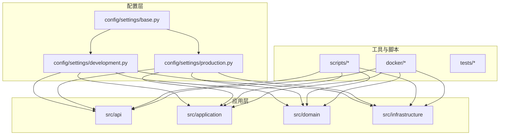
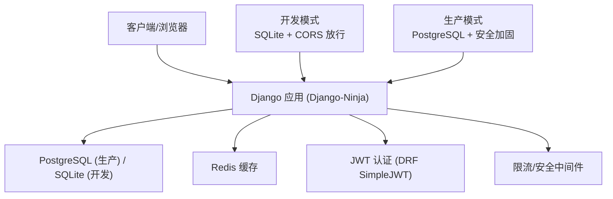
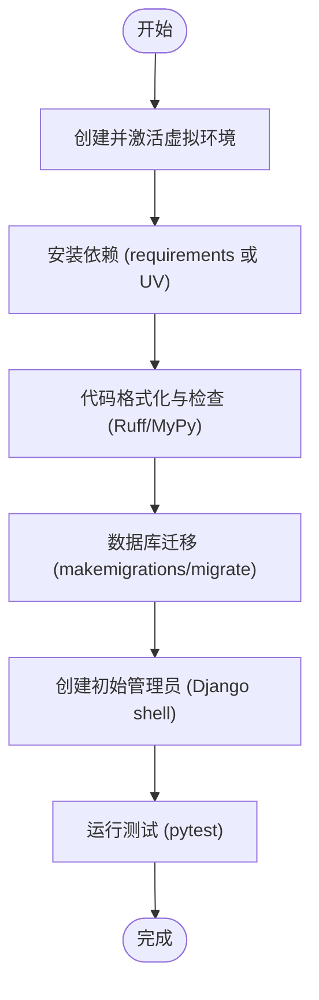
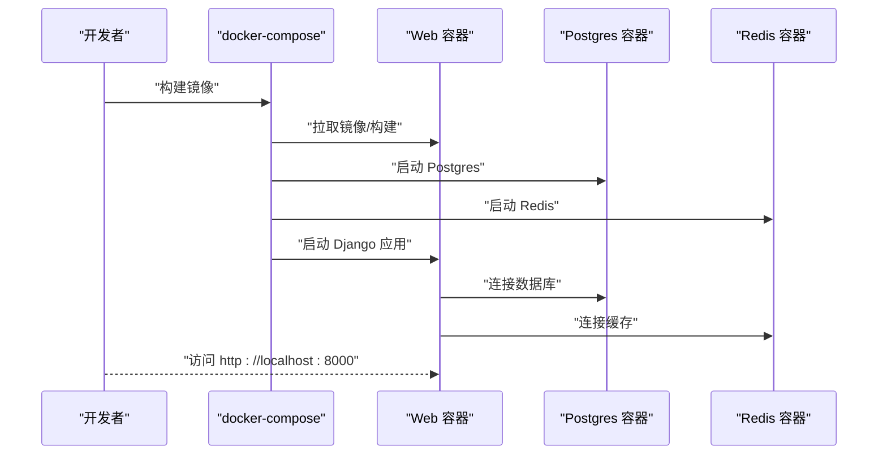
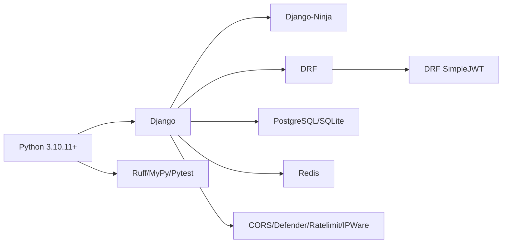

# 快速开始

<cite>
**本文引用的文件**
- [requirements.txt](file://requirements.txt)
- [pyproject.toml](file://pyproject.toml)
- [docker/docker-compose.yml](file://docker/docker-compose.yml)
- [docker/Dockerfile](file://docker/Dockerfile)
- [config/settings/base.py](file://config/settings/base.py)
- [config/settings/development.py](file://config/settings/development.py)
- [config/settings/production.py](file://config/settings/production.py)
- [scripts/setup_dev.sh](file://scripts/setup_dev.sh)
- [scripts/migrate.sh](file://scripts/migrate.sh)
- [scripts/init_admin.py](file://scripts/init_admin.py)
- [scripts/lint.sh](file://scripts/lint.sh)
- [scripts/test.sh](file://scripts/test.sh)
- [manage.py](file://manage.py)
- [docs/DEVELOPMENT.md](file://docs/DEVELOPMENT.md)
</cite>

## 目录
1. [简介](#简介)
2. [项目结构](#项目结构)
3. [核心组件](#核心组件)
4. [架构总览](#架构总览)
5. [详细组件分析](#详细组件分析)
6. [依赖关系分析](#依赖关系分析)
7. [性能考虑](#性能考虑)
8. [故障排除指南](#故障排除指南)
9. [结论](#结论)
10. [附录](#附录)

## 简介
本指南面向新开发者，帮助你在最短时间内成功运行 Hello-Django-Ninja-Api 项目。你将获得从环境准备、依赖安装、数据库与缓存配置、开发服务器启动到容器化部署的完整流程；同时提供常见问题的排查建议，确保你能稳定地进行本地开发与调试。

## 项目结构
该项目采用分层架构（DDD），核心目录与职责概览如下：
- config/settings：Django 配置分层（基础、开发、生产、测试）
- src/api：API 层（版本化控制器与路由）
- src/application：应用层（DTO、应用服务）
- src/domain：领域层（实体、值对象、领域服务）
- src/infrastructure：基础设施层（持久化、仓储、缓存、JWT、限流、IP 管理）
- scripts：开发与运维脚本（迁移、格式化、测试、初始化管理员）
- docker：Dockerfile 与 docker-compose 配置
- tests：单元/集成测试
- docs：开发文档与常见问题

**图表来源**
- [config/settings/base.py:1-235](file://config/settings/base.py#L1-L235)
- [config/settings/development.py:1-24](file://config/settings/development.py#L1-L24)
- [config/settings/production.py:1-39](file://config/settings/production.py#L1-L39)
- [docker/docker-compose.yml:1-47](file://docker/docker-compose.yml#L1-L47)
- [docker/Dockerfile:1-33](file://docker/Dockerfile#L1-L33)

**章节来源**
- [docs/DEVELOPMENT.md:115-163](file://docs/DEVELOPMENT.md#L115-L163)

## 核心组件
- Web 框架与 API：Django + Django-Ninja（REST API）+ DRF（认证与文档）
- 认证与安全：JWT（DRF SimpleJWT）+ 防御中间件 + 速率限制 + IP 黑白名单
- 数据库：PostgreSQL（生产）/ SQLite（开发）
- 缓存：Redis（Django-Redis）
- 开发工具：Ruff（格式化与检查）、MyPy（类型检查）、Pytest（测试）
- 容器化：Docker + docker-compose（Web、Postgres、Redis）

**章节来源**
- [requirements.txt:1-38](file://requirements.txt#L1-L38)
- [pyproject.toml:1-131](file://pyproject.toml#L1-L131)
- [config/settings/base.py:153-163](file://config/settings/base.py#L153-L163)
- [config/settings/development.py:10-16](file://config/settings/development.py#L10-L16)
- [config/settings/production.py:12-23](file://config/settings/production.py#L12-L23)

## 架构总览
下图展示了开发与生产两种运行模式下的关键组件交互：

**图表来源**
- [config/settings/base.py:77-88](file://config/settings/base.py#L77-L88)
- [config/settings/base.py:153-163](file://config/settings/base.py#L153-L163)
- [config/settings/development.py:10-16](file://config/settings/development.py#L10-L16)
- [config/settings/production.py:12-23](file://config/settings/production.py#L12-L23)

## 详细组件分析

### 环境与依赖准备
- Python 版本要求：>= 3.10.11（项目元数据与依赖声明均满足此要求）
- 推荐使用虚拟环境隔离依赖
- 依赖安装方式：
  - 直接安装：pip 安装 requirements.txt
  - 使用 UV（更快）：uv pip install -e ".[dev]"（包含开发依赖）
- 关键依赖（节选）：Django、Django-Ninja、DRF、Pydantic、JWT、PostgreSQL 驱动、Redis、CORS、防攻击与限流组件

**章节来源**
- [pyproject.toml:6-24](file://pyproject.toml#L6-L24)
- [requirements.txt:1-38](file://requirements.txt#L1-L38)
- [docs/DEVELOPMENT.md:3-8](file://docs/DEVELOPMENT.md#L3-L8)

### 数据库配置
- 开发环境：默认使用 SQLite（无需额外服务）
- 生产环境：使用 PostgreSQL（需提前安装并运行）
- 数据库连接通过环境变量注入（引擎、主机、端口、库名、用户名、密码）
- 连接池：CONN_MAX_AGE=600（提升连接复用效率）

**章节来源**
- [config/settings/development.py:10-16](file://config/settings/development.py#L10-L16)
- [config/settings/production.py:12-23](file://config/settings/production.py#L12-L23)
- [config/settings/base.py:77-88](file://config/settings/base.py#L77-L88)

### 缓存与 Redis
- 缓存后端：Redis（Django-Redis）
- 通过环境变量配置 HOST/PORT/DB
- 在生产中用于会话、限流、速率限制等场景

**章节来源**
- [config/settings/base.py:153-163](file://config/settings/base.py#L153-L163)

### 认证与安全
- 认证：JWT（DRF SimpleJWT），默认启用
- 安全：CORS 放行（开发）、生产环境安全头加固（HSTS、HTTPS、X-Frame-Options 等）
- 限流与 IP 管理：中间件与配置项支持按环境开启

**章节来源**
- [config/settings/base.py:122-151](file://config/settings/base.py#L122-L151)
- [config/settings/production.py:29-39](file://config/settings/production.py#L29-L39)

### 开发环境搭建脚本
- setup_dev.sh：一键创建虚拟环境、安装 dev 依赖、格式化、静态检查、初始化管理员、运行测试
- migrate.sh：迁移数据库并尝试创建超级用户
- init_admin.py：执行数据库迁移后，通过 Django shell 创建初始管理员账号

**图表来源**
- [scripts/setup_dev.sh:1-47](file://scripts/setup_dev.sh#L1-L47)
- [scripts/migrate.sh:1-12](file://scripts/migrate.sh#L1-L12)
- [scripts/init_admin.py:19-84](file://scripts/init_admin.py#L19-L84)

**章节来源**
- [scripts/setup_dev.sh:1-47](file://scripts/setup_dev.sh#L1-L47)
- [scripts/migrate.sh:1-12](file://scripts/migrate.sh#L1-L12)
- [scripts/init_admin.py:19-84](file://scripts/init_admin.py#L19-L84)

### 容器化部署
- docker-compose.yml：定义 web、db（Postgres）、redis 三服务，映射端口并挂载卷
- Dockerfile：基于 Python 3.10 slim，安装系统依赖与 Python 依赖，暴露 8000 端口并以 Django 服务器启动
- 启动命令：构建镜像后启动服务，查看日志，停止服务

**图表来源**
- [docker/docker-compose.yml:1-47](file://docker/docker-compose.yml#L1-L47)
- [docker/Dockerfile:1-33](file://docker/Dockerfile#L1-L33)

**章节来源**
- [docker/docker-compose.yml:1-47](file://docker/docker-compose.yml#L1-L47)
- [docker/Dockerfile:1-33](file://docker/Dockerfile#L1-L33)
- [docs/DEVELOPMENT.md:172-186](file://docs/DEVELOPMENT.md#L172-L186)

### 基本运行步骤
- 本地开发：
  - 创建并激活虚拟环境
  - 安装依赖（requirements 或 UV）
  - 配置环境变量（可复制 .env.example 并编辑）
  - 数据库迁移
  - 创建超级用户
  - 启动开发服务器
- 容器化：
  - 构建镜像
  - 启动服务
  - 查看日志
  - 停止服务

**章节来源**
- [docs/DEVELOPMENT.md:9-67](file://docs/DEVELOPMENT.md#L9-L67)
- [manage.py:7-18](file://manage.py#L7-L18)

## 依赖关系分析
- 语言与包管理：Python 3.10.11+，使用 pip 与 UV（可选）
- Web 与 API：Django、Django-Ninja、DRF、Pydantic
- 数据库：psycopg2-binary（生产）、sqlite3（开发）
- 缓存：django-redis、redis
- 安全与工具：CORS、defender、ratelimit、ipware、ruff、mypy、pytest

**图表来源**
- [requirements.txt:1-38](file://requirements.txt#L1-L38)
- [pyproject.toml:11-24](file://pyproject.toml#L11-L24)

**章节来源**
- [requirements.txt:1-38](file://requirements.txt#L1-L38)
- [pyproject.toml:11-24](file://pyproject.toml#L11-L24)

## 性能考虑
- 连接池：生产环境启用数据库连接池（CONN_MAX_AGE）
- 缓存：使用 Redis 作为默认缓存后端，减少数据库压力
- 限流：通过中间件与配置项控制请求频率，保护系统资源
- 静态与媒体：合理配置静态文件与媒体文件路径，便于部署优化

**章节来源**
- [config/settings/base.py:86-87](file://config/settings/base.py#L86-L87)
- [config/settings/base.py:153-163](file://config/settings/base.py#L153-L163)
- [config/settings/base.py:228-235](file://config/settings/base.py#L228-L235)

## 故障排除指南
- 数据库迁移失败
  - 清理迁移文件后重新生成并迁移
- Redis 连接失败
  - 确认 Redis 服务已启动（Windows 使用 redis-server，Linux/Mac 使用系统服务）
- 端口被占用
  - 更改 runserver 端口
- 依赖安装缓慢
  - 使用 UV 替代 pip，或使用 requirements.txt
- 开发/生产配置不一致
  - 明确区分 development.py 与 production.py 的差异，必要时导出环境变量

**章节来源**
- [docs/DEVELOPMENT.md:188-220](file://docs/DEVELOPMENT.md#L188-L220)

## 结论
通过本快速开始指南，你可以完成从环境准备、依赖安装、数据库与缓存配置，到开发服务器启动与容器化部署的全流程。建议优先使用 setup_dev.sh 与 docker-compose.yml，它们能显著降低上手成本并保持一致性。

## 附录
- 开发工具与脚本
  - 代码格式化与检查：ruff format、ruff check、mypy
  - 测试：pytest（含覆盖率）
  - 统一检查脚本：lint.sh、test.sh
- 环境变量参考
  - 数据库：DB_ENGINE、DB_NAME、DB_USER、DB_PASSWORD、DB_HOST、DB_PORT
  - Redis：REDIS_HOST、REDIS_PORT、REDIS_DB
  - 安全与限流：DEBUG、ALLOWED_HOSTS、JWT 生命周期、限流策略开关
- API 文档
  - 启动后访问 Swagger UI 或 ReDoc 查看接口文档

**章节来源**
- [scripts/lint.sh:1-23](file://scripts/lint.sh#L1-L23)
- [scripts/test.sh:1-14](file://scripts/test.sh#L1-L14)
- [config/settings/base.py:16-19](file://config/settings/base.py#L16-L19)
- [config/settings/base.py:137-151](file://config/settings/base.py#L137-L151)
- [docs/DEVELOPMENT.md:165-171](file://docs/DEVELOPMENT.md#L165-L171)