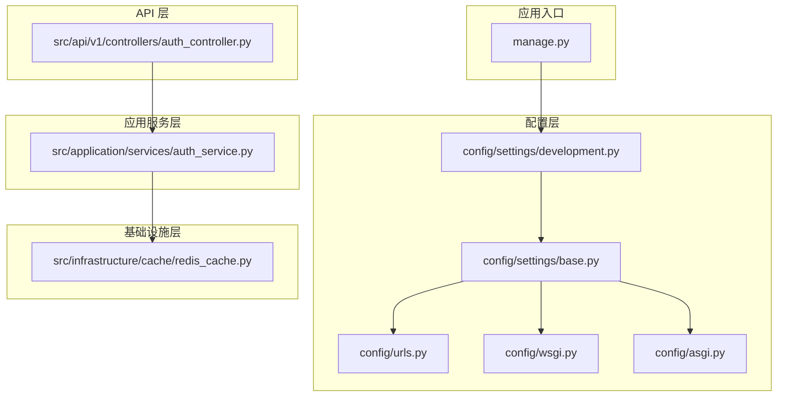
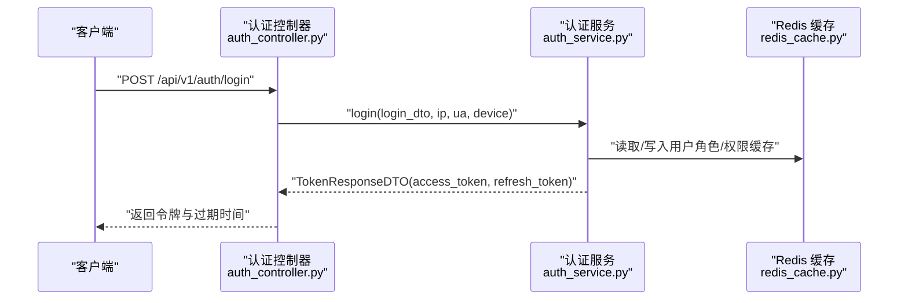
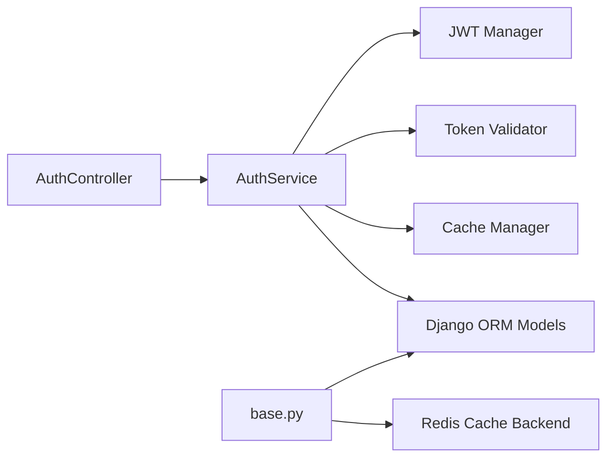

# 快速开始

<cite>
**本文引用的文件**
- [requirements.txt](file://requirements.txt)
- [pyproject.toml](file://pyproject.toml)
- [docker/docker-compose.yml](file://docker/docker-compose.yml)
- [docker/Dockerfile](file://docker/Dockerfile)
- [config/settings/base.py](file://config/settings/base.py)
- [config/settings/development.py](file://config/settings/development.py)
- [config/urls.py](file://config/urls.py)
- [config/wsgi.py](file://config/wsgi.py)
- [config/asgi.py](file://config/asgi.py)
- [manage.py](file://manage.py)
- [scripts/setup_dev.sh](file://scripts/setup_dev.sh)
- [scripts/migrate.sh](file://scripts/migrate.sh)
- [scripts/init_admin.py](file://scripts/init_admin.py)
- [src/api/v1/controllers/auth_controller.py](file://src/api/v1/controllers/auth_controller.py)
- [src/application/services/auth_service.py](file://src/application/services/auth_service.py)
- [src/infrastructure/cache/redis_cache.py](file://src/infrastructure/cache/redis_cache.py)
- [docs/DEVELOPMENT.md](file://docs/DEVELOPMENT.md)
</cite>

## 目录
1. [简介](#简介)
2. [项目结构](#项目结构)
3. [核心组件](#核心组件)
4. [架构总览](#架构总览)
5. [详细组件分析](#详细组件分析)
6. [依赖关系分析](#依赖关系分析)
7. [性能注意事项](#性能注意事项)
8. [故障排除指南](#故障排除指南)
9. [结论](#结论)
10. [附录](#附录)

## 简介
本指南面向新开发者，帮助你在约 15 分钟内成功运行 Hello-Django-Ninja-Api 项目。内容涵盖环境准备、数据库与 Redis 配置、环境变量设置、项目启动流程，以及使用 Docker Compose 快速启动整个服务栈。同时提供基本的 API 使用示例（获取访问令牌、调用受保护接口）与常见问题排查。

## 项目结构
该项目采用分层架构（API → 应用层 → 领域层 → 基础设施层），配合 Django + Django-Ninja 构建 REST API，并集成 JWT 认证、Redis 缓存、限流与安全中间件等能力。

**图表来源**
- [config/settings/base.py:1-235](file://config/settings/base.py#L1-L235)
- [config/settings/development.py:1-24](file://config/settings/development.py#L1-L24)
- [config/urls.py](file://config/urls.py)
- [config/wsgi.py](file://config/wsgi.py)
- [config/asgi.py](file://config/asgi.py)
- [manage.py:1-23](file://manage.py#L1-L23)
- [src/api/v1/controllers/auth_controller.py:1-133](file://src/api/v1/controllers/auth_controller.py#L1-L133)
- [src/application/services/auth_service.py:1-233](file://src/application/services/auth_service.py#L1-L233)
- [src/infrastructure/cache/redis_cache.py:1-169](file://src/infrastructure/cache/redis_cache.py#L1-L169)

**章节来源**
- [docs/DEVELOPMENT.md:115-163](file://docs/DEVELOPMENT.md#L115-L163)

## 核心组件
- 环境与依赖
  - Python 版本要求与依赖管理：参考 [requirements.txt:1-38](file://requirements.txt#L1-L38) 与 [pyproject.toml:1-131](file://pyproject.toml#L1-L131)，确保 Python ≥ 3.10.11，使用 pip 或 uv 安装依赖。
- 配置与运行
  - 基础配置与数据库、Redis、JWT、CORS、日志等在 [config/settings/base.py:1-235](file://config/settings/base.py#L1-L235)；开发环境覆盖在 [config/settings/development.py:1-24](file://config/settings/development.py#L1-L24)。
  - 启动入口在 [manage.py:1-23](file://manage.py#L1-L23)，默认加载开发配置。
- API 控制器与认证服务
  - 认证控制器 [src/api/v1/controllers/auth_controller.py:1-133](file://src/api/v1/controllers/auth_controller.py#L1-L133) 提供登录、刷新、登出接口。
  - 认证服务 [src/application/services/auth_service.py:1-233](file://src/application/services/auth_service.py#L1-L233) 实现 JWT 生成、刷新、撤销与登录日志记录。
- 缓存
  - Redis 缓存封装 [src/infrastructure/cache/redis_cache.py:1-169](file://src/infrastructure/cache/redis_cache.py#L1-L169) 提供常用缓存操作。

**章节来源**
- [requirements.txt:1-38](file://requirements.txt#L1-L38)
- [pyproject.toml:1-131](file://pyproject.toml#L1-L131)
- [config/settings/base.py:1-235](file://config/settings/base.py#L1-L235)
- [config/settings/development.py:1-24](file://config/settings/development.py#L1-L24)
- [manage.py:1-23](file://manage.py#L1-L23)
- [src/api/v1/controllers/auth_controller.py:1-133](file://src/api/v1/controllers/auth_controller.py#L1-L133)
- [src/application/services/auth_service.py:1-233](file://src/application/services/auth_service.py#L1-L233)
- [src/infrastructure/cache/redis_cache.py:1-169](file://src/infrastructure/cache/redis_cache.py#L1-L169)

## 架构总览
下图展示从浏览器到 API 控制器、应用服务与基础设施的调用链路，以及数据库与 Redis 的交互。

**图表来源**
- [src/api/v1/controllers/auth_controller.py:36-78](file://src/api/v1/controllers/auth_controller.py#L36-L78)
- [src/application/services/auth_service.py:26-111](file://src/application/services/auth_service.py#L26-L111)
- [src/infrastructure/cache/redis_cache.py:28-65](file://src/infrastructure/cache/redis_cache.py#L28-L65)

## 详细组件分析

### 环境准备与依赖安装
- Python 3.10+
  - 项目要求 Python ≥ 3.10.11，建议使用版本管理工具安装。
- 虚拟环境
  - 推荐使用 venv 创建隔离环境：[docs/DEVELOPMENT.md:11-27](file://docs/DEVELOPMENT.md#L11-L27)。
- 依赖安装
  - 使用 pip 安装：[docs/DEVELOPMENT.md:29-38](file://docs/DEVELOPMENT.md#L29-L38)。
  - 或使用 uv 安装（推荐）：[scripts/setup_dev.sh:7-23](file://scripts/setup_dev.sh#L7-L23)。
- 依赖清单
  - 关键依赖（Web、API、认证、数据库、缓存、安全、工具、日志）参见 [requirements.txt:1-38](file://requirements.txt#L1-L38) 与 [pyproject.toml:11-24](file://pyproject.toml#L11-L24)。

**章节来源**
- [docs/DEVELOPMENT.md:3-38](file://docs/DEVELOPMENT.md#L3-L38)
- [scripts/setup_dev.sh:7-23](file://scripts/setup_dev.sh#L7-L23)
- [requirements.txt:1-38](file://requirements.txt#L1-L38)
- [pyproject.toml:11-24](file://pyproject.toml#L11-L24)

### 数据库配置（PostgreSQL）
- 环境变量驱动
  - 数据库引擎、名称、用户、密码、主机、端口在基础配置中通过环境变量读取：[config/settings/base.py:77-88](file://config/settings/base.py#L77-L88)。
- 开发环境默认 SQLite
  - 开发配置覆盖默认使用 SQLite：[config/settings/development.py:10-16](file://config/settings/development.py#L10-L16)。
- 生产/容器环境
  - docker-compose 中设置了 PostgreSQL 服务与环境变量，可直接使用：[docker/docker-compose.yml:26-35](file://docker/docker-compose.yml#L26-L35)。

**章节来源**
- [config/settings/base.py:77-88](file://config/settings/base.py#L77-L88)
- [config/settings/development.py:10-16](file://config/settings/development.py#L10-L16)
- [docker/docker-compose.yml:26-35](file://docker/docker-compose.yml#L26-L35)

### Redis 缓存配置
- Redis 连接
  - 通过环境变量配置主机、端口、数据库索引，Django 使用 Redis 作为默认缓存后端：[config/settings/base.py:153-163](file://config/settings/base.py#L153-L163)。
- 项目缓存封装
  - 提供统一的缓存前缀与常用操作（get/set/delete/exists/get_many/set_many/increment）：[src/infrastructure/cache/redis_cache.py:15-169](file://src/infrastructure/cache/redis_cache.py#L15-L169)。

**章节来源**
- [config/settings/base.py:153-163](file://config/settings/base.py#L153-L163)
- [src/infrastructure/cache/redis_cache.py:15-169](file://src/infrastructure/cache/redis_cache.py#L15-L169)

### 环境变量设置
- 基础变量
  - SECRET_KEY、DEBUG、ALLOWED_HOSTS、JWT 生命周期、Redis 主机/端口/库等在基础配置中读取：[config/settings/base.py:16-163](file://config/settings/base.py#L16-L163)。
- 开发专用
  - 开发配置覆盖数据库为 SQLite、日志级别与 CORS 行为：[config/settings/development.py:7-24](file://config/settings/development.py#L7-L24)。
- Docker 环境
  - docker-compose 中预设了数据库与 Redis 的连接参数：[docker/docker-compose.yml:10-22](file://docker/docker-compose.yml#L10-L22)。

**章节来源**
- [config/settings/base.py:16-163](file://config/settings/base.py#L16-L163)
- [config/settings/development.py:7-24](file://config/settings/development.py#L7-L24)
- [docker/docker-compose.yml:10-22](file://docker/docker-compose.yml#L10-L22)

### 项目启动流程（本地）
- 步骤概览
  - 创建并激活虚拟环境：[docs/DEVELOPMENT.md:11-27](file://docs/DEVELOPMENT.md#L11-L27)。
  - 安装依赖：[docs/DEVELOPMENT.md:29-38](file://docs/DEVELOPMENT.md#L29-L38)。
  - 配置环境变量（复制示例并编辑）：[docs/DEVELOPMENT.md:40-45](file://docs/DEVELOPMENT.md#L40-L45)。
  - 数据库迁移：[docs/DEVELOPMENT.md:47-52](file://docs/DEVELOPMENT.md#L47-L52)。
  - 创建超级用户（可选）：[docs/DEVELOPMENT.md:54-58](file://docs/DEVELOPMENT.md#L54-L58)。
  - 启动开发服务器：[docs/DEVELOPMENT.md:60-66](file://docs/DEVELOPMENT.md#L60-L66)。
- 自动化脚本
  - 开发初始化脚本（创建虚拟环境、安装依赖、格式化、检查、类型检查、创建管理员、运行测试）：[scripts/setup_dev.sh:1-47](file://scripts/setup_dev.sh#L1-L47)。
  - 迁移脚本：[scripts/migrate.sh:1-12](file://scripts/migrate.sh#L1-L12)。
  - 初始化管理员脚本：[scripts/init_admin.py:1-84](file://scripts/init_admin.py#L1-L84)。

**章节来源**
- [docs/DEVELOPMENT.md:9-66](file://docs/DEVELOPMENT.md#L9-L66)
- [scripts/setup_dev.sh:1-47](file://scripts/setup_dev.sh#L1-L47)
- [scripts/migrate.sh:1-12](file://scripts/migrate.sh#L1-L12)
- [scripts/init_admin.py:1-84](file://scripts/init_admin.py#L1-L84)

### Docker 容器化部署
- 构建与启动
  - 使用 docker-compose 构建镜像并启动服务栈（web/db/redis）：[docker/docker-compose.yml:1-47](file://docker/docker-compose.yml#L1-L47)。
  - Dockerfile 基于 Python 3.10 slim，安装系统依赖与 Python 依赖，暴露 8000 端口：[docker/Dockerfile:1-33](file://docker/Dockerfile#L1-L33)。
- 端口与卷
  - web 映射 8000:8000，db 使用卷存储数据，redis 使用卷存储数据：[docker/docker-compose.yml:8-42](file://docker/docker-compose.yml#L8-L42)。
- 环境变量
  - web 服务设置 DEBUG、数据库与 Redis 连接参数：[docker/docker-compose.yml:10-19](file://docker/docker-compose.yml#L10-L19)。

**章节来源**
- [docker/docker-compose.yml:1-47](file://docker/docker-compose.yml#L1-L47)
- [docker/Dockerfile:1-33](file://docker/Dockerfile#L1-L33)

### 基本 API 使用示例
- 获取访问令牌
  - 调用登录接口，传入用户名与密码，获取 access_token 与 refresh_token：[src/api/v1/controllers/auth_controller.py:36-78](file://src/api/v1/controllers/auth_controller.py#L36-L78)。
  - 认证服务负责校验凭据、生成 JWT 并记录登录日志：[src/application/services/auth_service.py:26-111](file://src/application/services/auth_service.py#L26-L111)。
- 刷新访问令牌
  - 使用 refresh_token 调用刷新接口，获取新的 access_token：[src/api/v1/controllers/auth_controller.py:80-105](file://src/api/v1/controllers/auth_controller.py#L80-L105)。
  - 服务端验证刷新令牌并生成新令牌：[src/application/services/auth_service.py:113-162](file://src/application/services/auth_service.py#L113-L162)。
- 调用受保护接口
  - 在请求头中携带 Authorization: Bearer <access_token>，服务端通过中间件与 JWT 认证进行鉴权：[config/settings/base.py:123-151](file://config/settings/base.py#L123-L151)。

**章节来源**
- [src/api/v1/controllers/auth_controller.py:36-105](file://src/api/v1/controllers/auth_controller.py#L36-L105)
- [src/application/services/auth_service.py:26-162](file://src/application/services/auth_service.py#L26-L162)
- [config/settings/base.py:123-151](file://config/settings/base.py#L123-L151)

## 依赖关系分析
- 组件耦合
  - 控制器依赖应用服务；应用服务依赖 JWT 管理器、令牌验证器、缓存管理器与持久化模型。
  - 配置层通过环境变量解耦数据库与缓存后端。
- 外部依赖
  - Django、Django-Ninja、Django-Redis、Redis、PostgreSQL、JWT、CORS、Defender 等。

**图表来源**
- [src/api/v1/controllers/auth_controller.py:1-133](file://src/api/v1/controllers/auth_controller.py#L1-L133)
- [src/application/services/auth_service.py:1-233](file://src/application/services/auth_service.py#L1-L233)
- [config/settings/base.py:77-163](file://config/settings/base.py#L77-L163)

**章节来源**
- [src/api/v1/controllers/auth_controller.py:1-133](file://src/api/v1/controllers/auth_controller.py#L1-L133)
- [src/application/services/auth_service.py:1-233](file://src/application/services/auth_service.py#L1-L233)
- [config/settings/base.py:77-163](file://config/settings/base.py#L77-L163)

## 性能注意事项
- 缓存策略
  - 使用 Redis 缓存用户角色/权限与热点数据，减少数据库查询压力：[src/infrastructure/cache/redis_cache.py:15-169](file://src/infrastructure/cache/redis_cache.py#L15-L169)。
- 连接池与长连接
  - 数据库连接池配置（CONN_MAX_AGE）提升连接复用效率：[config/settings/base.py:86-87](file://config/settings/base.py#L86-L87)。
- 限流与安全
  - 开启速率限制与 IP 黑白名单中间件，降低恶意请求影响：[config/settings/base.py:228-235](file://config/settings/base.py#L228-L235)。

**章节来源**
- [src/infrastructure/cache/redis_cache.py:15-169](file://src/infrastructure/cache/redis_cache.py#L15-L169)
- [config/settings/base.py:86-87](file://config/settings/base.py#L86-L87)
- [config/settings/base.py:228-235](file://config/settings/base.py#L228-L235)

## 故障排除指南
- 数据库迁移失败
  - 清理迁移文件并重新生成：[docs/DEVELOPMENT.md:190-199](file://docs/DEVELOPMENT.md#L190-L199)。
- Redis 连接失败
  - 确认 Redis 服务已启动（Windows 使用 redis-server，Linux/Mac 使用 systemctl）：[docs/DEVELOPMENT.md:201-211](file://docs/DEVELOPMENT.md#L201-L211)。
- 端口被占用
  - 更改 runserver 端口（如 8080）：[docs/DEVELOPMENT.md:213-219](file://docs/DEVELOPMENT.md#L213-L219)。
- Docker 服务无法启动
  - 检查 docker-compose 构建与日志输出：[docs/DEVELOPMENT.md:172-186](file://docs/DEVELOPMENT.md#L172-L186)。

**章节来源**
- [docs/DEVELOPMENT.md:188-219](file://docs/DEVELOPMENT.md#L188-L219)

## 结论
按照本指南，你可以在 15 分钟内完成环境准备、数据库与 Redis 配置、依赖安装与项目启动，并通过 Docker 快速拉起完整服务栈。随后即可使用提供的认证接口获取令牌并调用受保护接口。遇到问题时，可依据“故障排除指南”快速定位与解决。

## 附录
- API 文档地址
  - Swagger UI 与 ReDoc 文档地址：[docs/DEVELOPMENT.md:165-171](file://docs/DEVELOPMENT.md#L165-L171)。
- 项目入口与路由
  - manage.py 默认加载开发配置：[manage.py:9-9](file://manage.py#L9-L9)。
  - URL 路由与 WSGI/ASGI 配置：[config/urls.py](file://config/urls.py)、[config/wsgi.py](file://config/wsgi.py)、[config/asgi.py](file://config/asgi.py)。

**章节来源**
- [docs/DEVELOPMENT.md:165-171](file://docs/DEVELOPMENT.md#L165-L171)
- [manage.py:9-9](file://manage.py#L9-L9)
- [config/urls.py](file://config/urls.py)
- [config/wsgi.py](file://config/wsgi.py)
- [config/asgi.py](file://config/asgi.py)