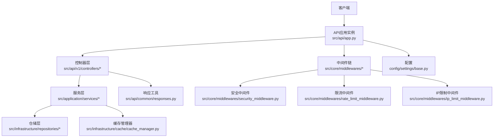
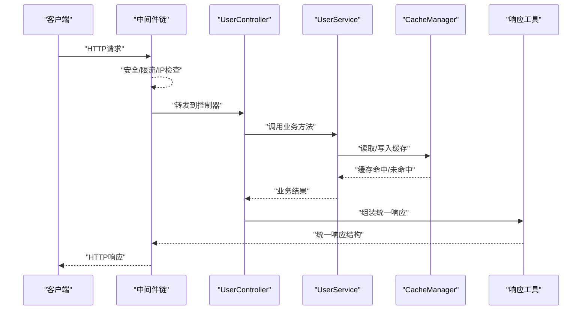
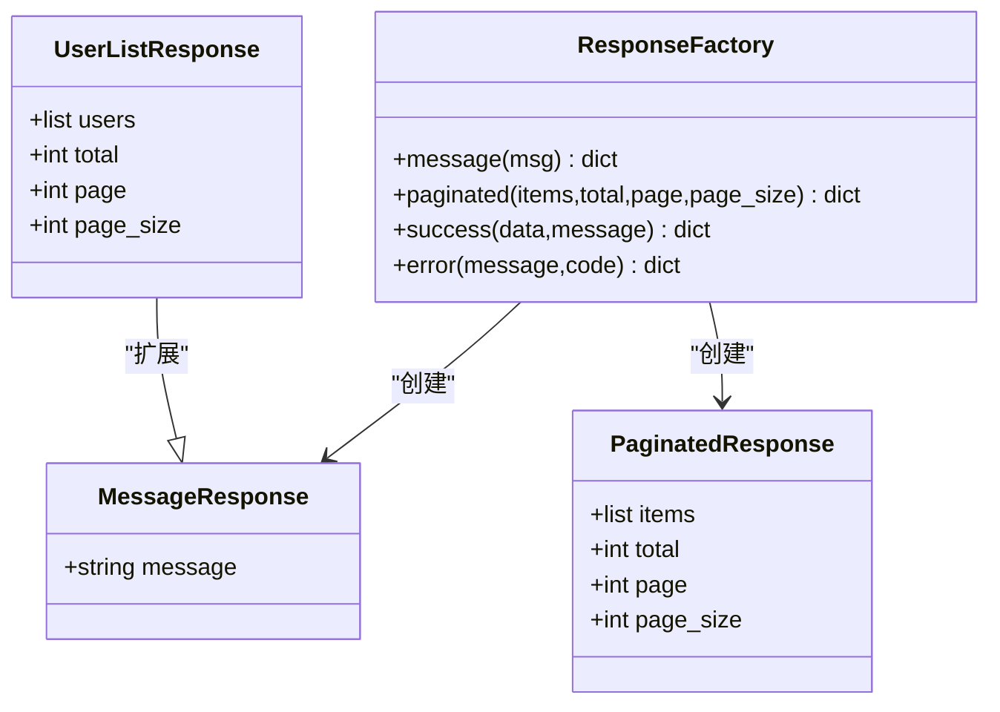
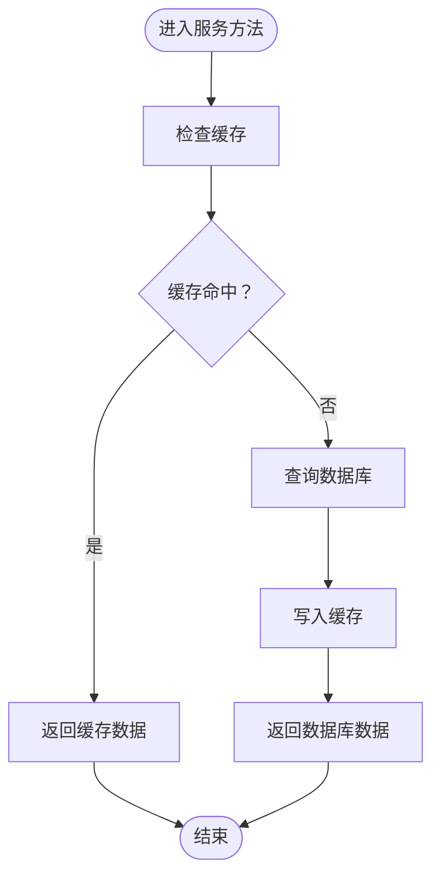
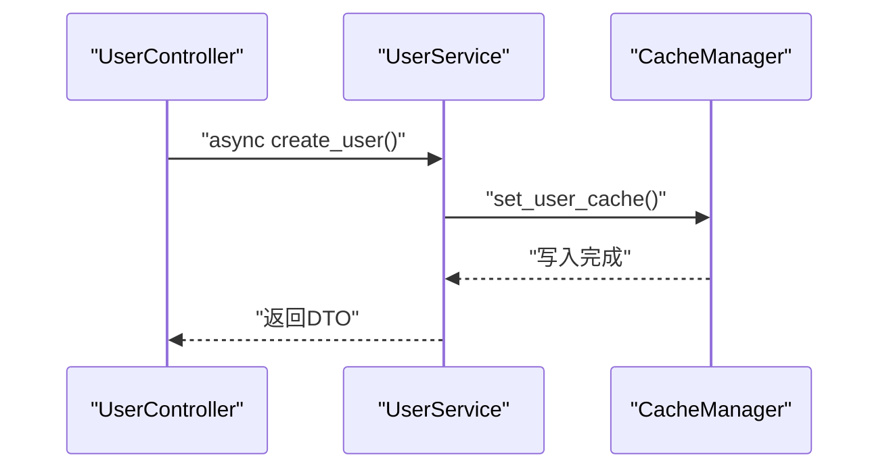
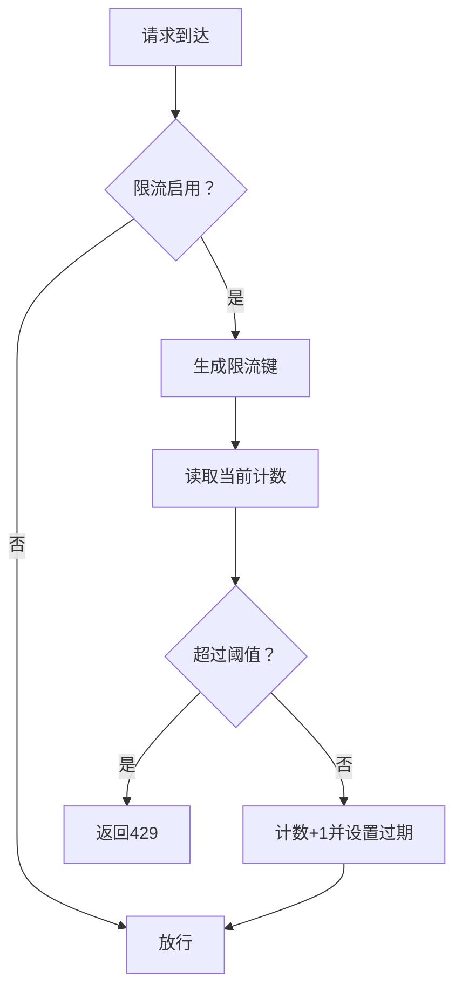
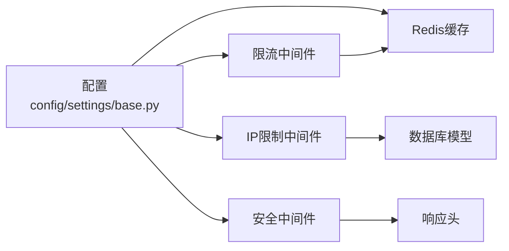

# API响应优化

<cite>
**本文引用的文件**
- [src/api/app.py](file://src/api/app.py)
- [src/api/common/responses.py](file://src/api/common/responses.py)
- [src/api/v1/controllers/user_controller.py](file://src/api/v1/controllers/user_controller.py)
- [src/application/services/user_service.py](file://src/application/services/user_service.py)
- [src/application/dto/user/user_response_dto.py](file://src/application/dto/user/user_response_dto.py)
- [src/core/middlewares/rate_limit_middleware.py](file://src/core/middlewares/rate_limit_middleware.py)
- [src/core/middlewares/ip_limit_middleware.py](file://src/core/middlewares/ip_limit_middleware.py)
- [src/core/middlewares/security_middleware.py](file://src/core/middlewares/security_middleware.py)
- [src/core/decorators/operation_log.py](file://src/core/decorators/operation_log.py)
- [src/infrastructure/cache/cache_manager.py](file://src/infrastructure/cache/cache_manager.py)
- [src/infrastructure/cache/redis_cache.py](file://src/infrastructure/cache/redis_cache.py)
- [src/infrastructure/persistence/models/security_models.py](file://src/infrastructure/persistence/models/security_models.py)
- [config/settings/base.py](file://config/settings/base.py)
- [requirements.txt](file://requirements.txt)
</cite>

## 目录
1. [引言](#引言)
2. [项目结构](#项目结构)
3. [核心组件](#核心组件)
4. [架构总览](#架构总览)
5. [详细组件分析](#详细组件分析)
6. [依赖分析](#依赖分析)
7. [性能考虑](#性能考虑)
8. [故障排查指南](#故障排查指南)
9. [结论](#结论)
10. [附录](#附录)

## 引言
本文件聚焦于API响应优化，围绕以下主题展开：异步处理与并发、缓存与批量优化、响应格式与分页、HTTP压缩与传输优化、限流与节流机制、以及性能监控与分析方法。通过对仓库中的中间件、服务层、缓存与响应工具等模块进行深入剖析，给出可落地的优化建议与实践案例。

## 项目结构
该项目采用Django+Ninja-Extra的分层架构，API入口集中于应用实例，控制器负责HTTP路由与参数校验，服务层承载业务逻辑，仓储层对接ORM，缓存与安全中间件贯穿请求生命周期，配置文件集中管理运行参数与中间件顺序。

图表来源
- [src/api/app.py:1-48](file://src/api/app.py#L1-L48)
- [src/api/v1/controllers/user_controller.py:1-283](file://src/api/v1/controllers/user_controller.py#L1-L283)
- [src/application/services/user_service.py:1-172](file://src/application/services/user_service.py#L1-L172)
- [src/infrastructure/cache/cache_manager.py:1-149](file://src/infrastructure/cache/cache_manager.py#L1-L149)
- [src/core/middlewares/security_middleware.py:1-53](file://src/core/middlewares/security_middleware.py#L1-L53)
- [src/core/middlewares/rate_limit_middleware.py:1-112](file://src/core/middlewares/rate_limit_middleware.py#L1-L112)
- [src/core/middlewares/ip_limit_middleware.py:1-130](file://src/core/middlewares/ip_limit_middleware.py#L1-L130)
- [config/settings/base.py:1-235](file://config/settings/base.py#L1-L235)

章节来源
- [src/api/app.py:1-48](file://src/api/app.py#L1-L48)
- [config/settings/base.py:1-235](file://config/settings/base.py#L1-L235)

## 核心组件
- API应用实例与路由注册：集中式API实例与控制器注册，提供健康检查与根路径响应。
- 控制器层：面向HTTP的接口定义，使用Ninja-Extra注解声明路由、权限与响应模型。
- 服务层：业务逻辑封装，支持异步操作与缓存集成。
- 缓存层：统一缓存管理器与Redis封装，支持批量读写与键空间管理。
- 中间件链：安全、限流、IP黑白名单等横切关注点。
- 响应工具：统一的消息、分页与成功/错误响应格式。

章节来源
- [src/api/app.py:1-48](file://src/api/app.py#L1-L48)
- [src/api/v1/controllers/user_controller.py:1-283](file://src/api/v1/controllers/user_controller.py#L1-L283)
- [src/application/services/user_service.py:1-172](file://src/application/services/user_service.py#L1-L172)
- [src/infrastructure/cache/cache_manager.py:1-149](file://src/infrastructure/cache/cache_manager.py#L1-L149)
- [src/core/middlewares/security_middleware.py:1-53](file://src/core/middlewares/security_middleware.py#L1-L53)
- [src/core/middlewares/rate_limit_middleware.py:1-112](file://src/core/middlewares/rate_limit_middleware.py#L1-L112)
- [src/core/middlewares/ip_limit_middleware.py:1-130](file://src/core/middlewares/ip_limit_middleware.py#L1-L130)
- [src/api/common/responses.py:1-110](file://src/api/common/responses.py#L1-L110)

## 架构总览
下图展示一次典型API请求的端到端流程，涵盖中间件、控制器、服务与缓存交互。

图表来源
- [src/api/v1/controllers/user_controller.py:1-283](file://src/api/v1/controllers/user_controller.py#L1-L283)
- [src/application/services/user_service.py:1-172](file://src/application/services/user_service.py#L1-L172)
- [src/infrastructure/cache/cache_manager.py:1-149](file://src/infrastructure/cache/cache_manager.py#L1-L149)
- [src/api/common/responses.py:1-110](file://src/api/common/responses.py#L1-L110)
- [src/core/middlewares/security_middleware.py:1-53](file://src/core/middlewares/security_middleware.py#L1-L53)
- [src/core/middlewares/rate_limit_middleware.py:1-112](file://src/core/middlewares/rate_limit_middleware.py#L1-L112)
- [src/core/middlewares/ip_limit_middleware.py:1-130](file://src/core/middlewares/ip_limit_middleware.py#L1-L130)

## 详细组件分析

### 响应格式与分页优化
- 统一响应模型：提供消息、分页与成功/错误响应工厂，确保客户端一致的响应结构。
- 控制器分页：用户列表接口支持页码与页大小参数，结合服务层返回总数，便于前端分页渲染。
- DTO约束：响应DTO定义字段与类型，减少多余字段传输，降低响应体积。

图表来源
- [src/api/common/responses.py:1-110](file://src/api/common/responses.py#L1-L110)

章节来源
- [src/api/common/responses.py:1-110](file://src/api/common/responses.py#L1-L110)
- [src/api/v1/controllers/user_controller.py:103-133](file://src/api/v1/controllers/user_controller.py#L103-L133)
- [src/application/dto/user/user_response_dto.py:1-30](file://src/application/dto/user/user_response_dto.py#L1-L30)

### 缓存与批量优化
- 缓存管理器：提供统一键空间、分组与序列化策略；支持用户信息、权限与角色缓存的读写与失效。
- Redis封装：批量读写、存在性检查与自增等原子操作，便于构建高性能缓存层。
- 服务层缓存集成：用户查询优先走缓存，更新/删除后主动失效相关缓存键，保证一致性与性能。

图表来源
- [src/application/services/user_service.py:52-66](file://src/application/services/user_service.py#L52-L66)
- [src/infrastructure/cache/cache_manager.py:93-105](file://src/infrastructure/cache/cache_manager.py#L93-L105)

章节来源
- [src/infrastructure/cache/cache_manager.py:1-149](file://src/infrastructure/cache/cache_manager.py#L1-L149)
- [src/infrastructure/cache/redis_cache.py:1-169](file://src/infrastructure/cache/redis_cache.py#L1-L169)
- [src/application/services/user_service.py:1-172](file://src/application/services/user_service.py#L1-L172)

### 异步处理与并发优化
- 控制器与服务均采用异步方法签名，配合异步ORM保存与查询，提升高并发场景下的吞吐量。
- 建议：对IO密集型操作（如缓存、远程调用）保持异步；CPU密集型任务可考虑线程池/进程池分离。

图表来源
- [src/api/v1/controllers/user_controller.py:59](file://src/api/v1/controllers/user_controller.py#L59)
- [src/application/services/user_service.py:28-50](file://src/application/services/user_service.py#L28-L50)
- [src/infrastructure/cache/cache_manager.py:98-100](file://src/infrastructure/cache/cache_manager.py#L98-L100)

章节来源
- [src/api/v1/controllers/user_controller.py:1-283](file://src/api/v1/controllers/user_controller.py#L1-L283)
- [src/application/services/user_service.py:1-172](file://src/application/services/user_service.py#L1-L172)

### HTTP压缩与传输优化
- 安全中间件：生产环境自动添加安全响应头，提升传输安全性与合规性。
- 建议：在网关/反向代理层启用Gzip/Deflate压缩与HTTP/2，结合持久连接与头部压缩以进一步降低延迟与带宽占用。

章节来源
- [src/core/middlewares/security_middleware.py:1-53](file://src/core/middlewares/security_middleware.py#L1-L53)

### API限流与节流机制
- 基础限流中间件：按IP+方法+路径维度进行简单计数限流，默认每分钟上限示例实现。
- 规则模型：提供更细粒度的限流规则模型（端点、方法、周期、范围），可用于构建更复杂的令牌桶/滑动窗口策略。
- 建议：结合Redis实现分布式限流，使用滑动窗口或令牌桶算法，并将热点端点的限流阈值与缓存结合。

图表来源
- [src/core/middlewares/rate_limit_middleware.py:87-111](file://src/core/middlewares/rate_limit_middleware.py#L87-L111)
- [src/infrastructure/persistence/models/security_models.py:82-136](file://src/infrastructure/persistence/models/security_models.py#L82-L136)

章节来源
- [src/core/middlewares/rate_limit_middleware.py:1-112](file://src/core/middlewares/rate_limit_middleware.py#L1-L112)
- [src/infrastructure/persistence/models/security_models.py:1-162](file://src/infrastructure/persistence/models/security_models.py#L1-L162)

### IP白名单/黑名单与访问控制
- IP白名单/黑名单中间件：支持白名单与黑名单模式，结合数据库模型进行动态控制。
- 建议：与WAF/网关联动，对异常IP进行快速封禁与自动解封。

章节来源
- [src/core/middlewares/ip_limit_middleware.py:1-130](file://src/core/middlewares/ip_limit_middleware.py#L1-L130)
- [src/infrastructure/persistence/models/security_models.py:13-80](file://src/infrastructure/persistence/models/security_models.py#L13-L80)

### 操作日志与性能监控
- 操作日志装饰器：自动记录请求/响应、状态码、用户信息、IP与UA等，支持异步落库，不影响主流程。
- 建议：结合日志聚合与指标系统（如Prometheus/Grafana）统计响应时间、吞吐量与错误率，建立SLA告警。

章节来源
- [src/core/decorators/operation_log.py:1-175](file://src/core/decorators/operation_log.py#L1-L175)

## 依赖分析
- 中间件顺序：安全中间件位于限流与IP限制之后，确保在限流决策后仍能附加安全头。
- 缓存依赖：服务层依赖缓存管理器；缓存层依赖Django缓存后端（Redis）。
- 配置依赖：限流与IP黑白名单开关由配置文件控制；Redis连接信息在配置中集中定义。

图表来源
- [config/settings/base.py:1-235](file://config/settings/base.py#L1-L235)
- [src/core/middlewares/rate_limit_middleware.py:1-112](file://src/core/middlewares/rate_limit_middleware.py#L1-L112)
- [src/core/middlewares/ip_limit_middleware.py:1-130](file://src/core/middlewares/ip_limit_middleware.py#L1-L130)
- [src/core/middlewares/security_middleware.py:1-53](file://src/core/middlewares/security_middleware.py#L1-L53)
- [src/infrastructure/cache/redis_cache.py:1-169](file://src/infrastructure/cache/redis_cache.py#L1-L169)
- [src/infrastructure/persistence/models/security_models.py:1-162](file://src/infrastructure/persistence/models/security_models.py#L1-L162)

章节来源
- [config/settings/base.py:1-235](file://config/settings/base.py#L1-L235)
- [requirements.txt:1-38](file://requirements.txt#L1-L38)

## 性能考虑
- 异步与并发
  - 使用异步方法处理IO密集型操作，避免阻塞事件循环。
  - 对数据库与缓存操作保持异步，减少等待时间。
- 缓存策略
  - 合理设置缓存键前缀与分组，避免键冲突与清理困难。
  - 对热点数据设置较短但稳定的TTL，平衡一致性与性能。
- 响应优化
  - 使用DTO裁剪响应字段，避免传输冗余信息。
  - 分页接口限制最大页大小，防止大页导致内存压力。
- 限流与节流
  - 结合IP/用户维度与端点粒度，针对不同接口设置差异化阈值。
  - 对高频端点采用滑动窗口或令牌桶算法，平滑突发流量。
- 传输优化
  - 在网关层启用Gzip/Deflate与HTTP/2，开启连接复用与头部压缩。
  - 对静态资源与小体积响应启用浏览器缓存策略。

## 故障排查指南
- 限流频繁触发
  - 检查限流中间件开关与默认阈值配置，确认缓存后端可用。
  - 关联日志定位高频端点与来源IP，必要时调整规则或临时放行。
- 缓存命中率低
  - 校验键前缀与分组是否一致，确认序列化策略与TTL设置。
  - 检查写入缓存的时机与失效策略，避免脏读。
- 响应过大或超时
  - 使用DTO裁剪字段，启用分页并限制每页大小。
  - 对复杂查询引入索引与分页游标，避免一次性加载大量数据。
- 安全头缺失
  - 确认生产环境配置与安全中间件生效，检查反向代理是否覆盖响应头。

章节来源
- [src/core/middlewares/rate_limit_middleware.py:1-112](file://src/core/middlewares/rate_limit_middleware.py#L1-L112)
- [src/infrastructure/cache/cache_manager.py:1-149](file://src/infrastructure/cache/cache_manager.py#L1-L149)
- [src/core/middlewares/security_middleware.py:1-53](file://src/core/middlewares/security_middleware.py#L1-L53)

## 结论
本项目在响应优化方面具备良好的基础设施：统一的响应格式、完善的缓存与异步能力、可扩展的限流与安全中间件。建议在现有基础上进一步完善分布式限流算法、传输层压缩与HTTP/2优化，并建立系统化的性能监控体系，持续迭代以满足高并发与低延迟的生产需求。

## 附录
- 实际优化案例与性能测试方法
  - 案例：用户列表接口引入缓存与分页，对比开启/关闭缓存的P95延迟与吞吐量差异。
  - 方法：使用压测工具模拟并发请求，采集响应时间分布、错误率与资源占用，评估不同阈值与TTL对性能的影响。
  - 建议：对热点端点实施滑动窗口限流，结合缓存预热与失效策略，确保峰值稳定性。