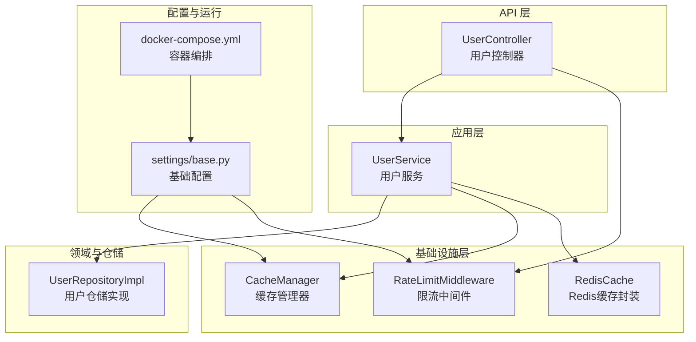
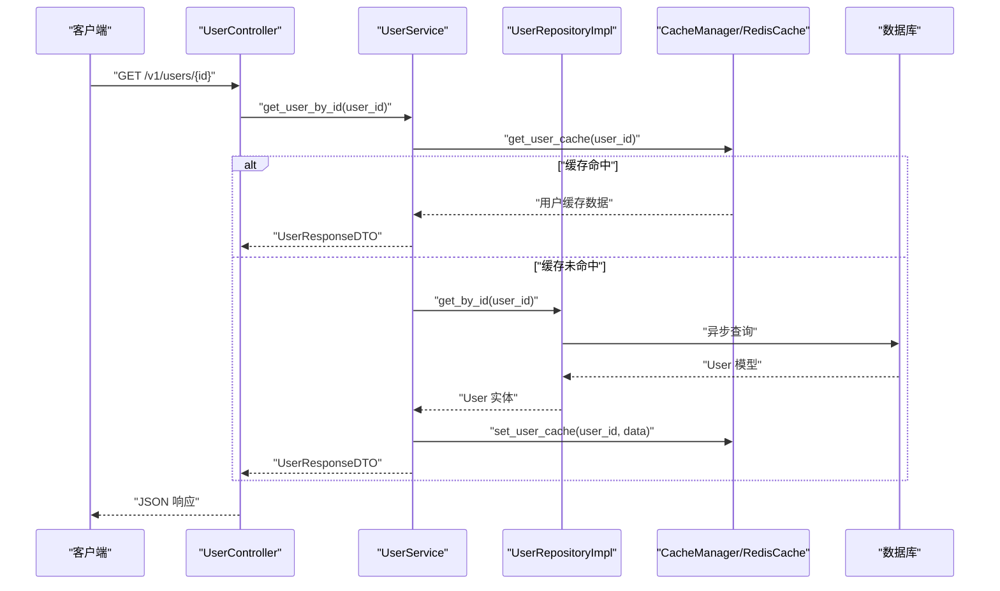
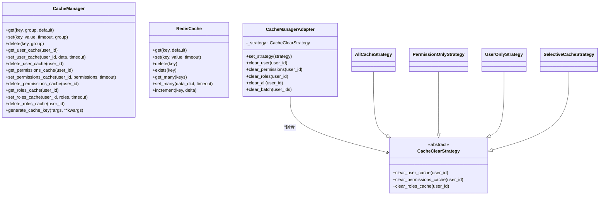
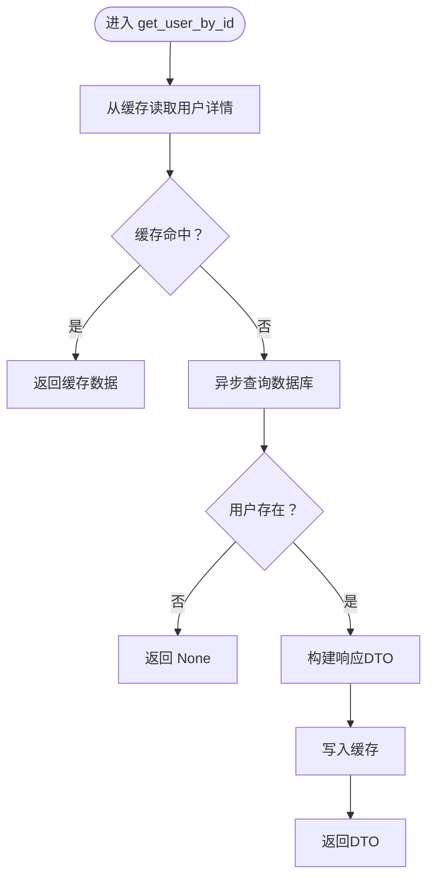
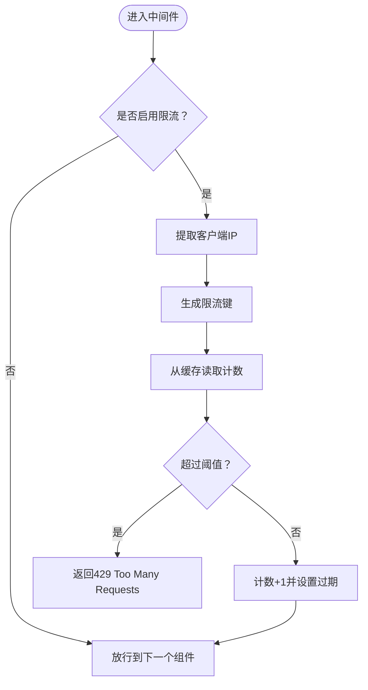
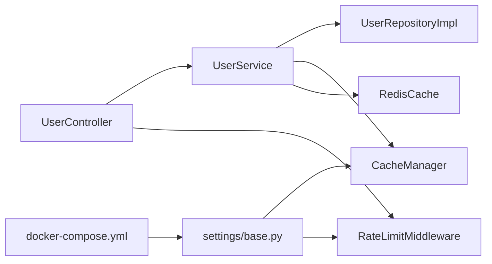

# 性能优化

<cite>
**本文引用的文件**
- [src/infrastructure/cache/cache_manager.py](file://src/infrastructure/cache/cache_manager.py)
- [src/infrastructure/cache/redis_cache.py](file://src/infrastructure/cache/redis_cache.py)
- [src/infrastructure/cache/cache_strategies.py](file://src/infrastructure/cache/cache_strategies.py)
- [src/application/services/user_service.py](file://src/application/services/user_service.py)
- [src/infrastructure/repositories/user_repo_impl.py](file://src/infrastructure/repositories/user_repo_impl.py)
- [src/api/v1/controllers/user_controller.py](file://src/api/v1/controllers/user_controller.py)
- [src/core/middlewares/rate_limit_middleware.py](file://src/core/middlewares/rate_limit_middleware.py)
- [config/settings/base.py](file://config/settings/base.py)
- [config/settings/production.py](file://config/settings/production.py)
- [docker/docker-compose.yml](file://docker/docker-compose.yml)
- [requirements.txt](file://requirements.txt)
- [scripts/test.sh](file://scripts/test.sh)
- [tests/test_api/test_auth_api.py](file://tests/test_api/test_auth_api.py)
</cite>

## 目录
1. [简介](#简介)
2. [项目结构](#项目结构)
3. [核心组件](#核心组件)
4. [架构总览](#架构总览)
5. [详细组件分析](#详细组件分析)
6. [依赖分析](#依赖分析)
7. [性能考量与优化建议](#性能考量与优化建议)
8. [故障排查指南](#故障排查指南)
9. [结论](#结论)
10. [附录](#附录)

## 简介
本文件面向“性能优化”的综合性实践指南，结合仓库中的缓存、限流、数据库连接、API 控制器与中间件等模块，系统阐述以下主题：
- 缓存策略优化：命中率提升、缓存预热、失效策略与穿透/雪崩/击穿防护
- 数据库查询优化：连接复用、异步 ORM、分页与过滤
- API 响应时间优化：并发与批处理、序列化开销控制
- 内存与 CPU 优化：对象池与连接池、GC 优化思路
- 性能监控与分析：指标采集、瓶颈定位、回归检测
- 负载与压力测试：实施方法与自动化流程
- 缓存架构安全：缓存穿透、雪崩、击穿的防护策略
- 最佳实践与案例：基于仓库现有实现的调优建议

## 项目结构
项目采用分层架构：API 层（控制器）、应用层（服务）、领域层（实体/仓储接口）、基础设施层（缓存、持久化、中间件）。缓存与限流分别由基础设施层的缓存模块与中间件实现；数据库连接通过 Django 的连接池机制与异步 ORM 支持实现。

图表来源
- [src/api/v1/controllers/user_controller.py:33-283](file://src/api/v1/controllers/user_controller.py#L33-L283)
- [src/application/services/user_service.py:15-172](file://src/application/services/user_service.py#L15-L172)
- [src/infrastructure/repositories/user_repo_impl.py:13-138](file://src/infrastructure/repositories/user_repo_impl.py#L13-L138)
- [src/infrastructure/cache/cache_manager.py:16-149](file://src/infrastructure/cache/cache_manager.py#L16-L149)
- [src/infrastructure/cache/redis_cache.py:15-169](file://src/infrastructure/cache/redis_cache.py#L15-L169)
- [src/core/middlewares/rate_limit_middleware.py:15-112](file://src/core/middlewares/rate_limit_middleware.py#L15-L112)
- [config/settings/base.py:77-163](file://config/settings/base.py#L77-L163)
- [docker/docker-compose.yml:1-47](file://docker/docker-compose.yml#L1-L47)

章节来源
- [src/api/v1/controllers/user_controller.py:33-283](file://src/api/v1/controllers/user_controller.py#L33-L283)
- [src/application/services/user_service.py:15-172](file://src/application/services/user_service.py#L15-L172)
- [src/infrastructure/repositories/user_repo_impl.py:13-138](file://src/infrastructure/repositories/user_repo_impl.py#L13-L138)
- [src/infrastructure/cache/cache_manager.py:16-149](file://src/infrastructure/cache/cache_manager.py#L16-L149)
- [src/infrastructure/cache/redis_cache.py:15-169](file://src/infrastructure/cache/redis_cache.py#L15-L169)
- [src/core/middlewares/rate_limit_middleware.py:15-112](file://src/core/middlewares/rate_limit_middleware.py#L15-L112)
- [config/settings/base.py:77-163](file://config/settings/base.py#L77-L163)
- [docker/docker-compose.yml:1-47](file://docker/docker-compose.yml#L1-L47)

## 核心组件
- 缓存管理器：统一缓存键命名、分组、序列化与异常兜底，提供用户、RBAC 相关缓存读写与批量操作封装。
- Redis 缓存封装：提供 get/set/delete/get_many/set_many/increment 等常用操作，便于在服务层直接使用。
- 缓存清理策略：基于策略模式的多种清理策略（全量、权限/角色、用户、选择性），配合适配器集中管理。
- 用户服务：在读取用户详情时优先走缓存，写入/删除后主动清理相关缓存，避免脏读。
- 仓储实现：使用异步 ORM 方法进行数据库访问，减少阻塞；提供分页与计数能力。
- 限流中间件：基于 IP + 路径 + 方法的简单计数限流，使用缓存计数，防止突发流量。
- 配置：数据库连接复用（CONN_MAX_AGE）、Redis 缓存后端、日志与限流开关等。

章节来源
- [src/infrastructure/cache/cache_manager.py:16-149](file://src/infrastructure/cache/cache_manager.py#L16-L149)
- [src/infrastructure/cache/redis_cache.py:15-169](file://src/infrastructure/cache/redis_cache.py#L15-L169)
- [src/infrastructure/cache/cache_strategies.py:9-245](file://src/infrastructure/cache/cache_strategies.py#L9-L245)
- [src/application/services/user_service.py:15-172](file://src/application/services/user_service.py#L15-L172)
- [src/infrastructure/repositories/user_repo_impl.py:13-138](file://src/infrastructure/repositories/user_repo_impl.py#L13-L138)
- [src/core/middlewares/rate_limit_middleware.py:15-112](file://src/core/middlewares/rate_limit_middleware.py#L15-L112)
- [config/settings/base.py:77-163](file://config/settings/base.py#L77-L163)

## 架构总览
下图展示从控制器到服务、仓储、缓存与数据库的整体调用链路及性能相关点。

图表来源
- [src/api/v1/controllers/user_controller.py:77-101](file://src/api/v1/controllers/user_controller.py#L77-L101)
- [src/application/services/user_service.py:52-66](file://src/application/services/user_service.py#L52-L66)
- [src/infrastructure/repositories/user_repo_impl.py:72-78](file://src/infrastructure/repositories/user_repo_impl.py#L72-L78)
- [src/infrastructure/cache/cache_manager.py:42-100](file://src/infrastructure/cache/cache_manager.py#L42-L100)
- [src/infrastructure/cache/redis_cache.py:28-65](file://src/infrastructure/cache/redis_cache.py#L28-L65)

## 详细组件分析

### 缓存子系统（CacheManager、RedisCache、CacheStrategies）
- 键空间设计：统一前缀与分组，降低键冲突风险；提供按用户维度的专用键空间。
- 序列化与容错：自动 JSON 序列化复杂对象，异常时返回默认值或 False，避免影响主流程。
- 批量操作：支持 get_many/set_many，减少网络往返与序列化开销。
- 清理策略：策略模式解耦不同场景的清理需求，适配器集中调度，便于扩展与测试。

图表来源
- [src/infrastructure/cache/cache_manager.py:16-149](file://src/infrastructure/cache/cache_manager.py#L16-L149)
- [src/infrastructure/cache/redis_cache.py:15-169](file://src/infrastructure/cache/redis_cache.py#L15-L169)
- [src/infrastructure/cache/cache_strategies.py:9-245](file://src/infrastructure/cache/cache_strategies.py#L9-L245)

章节来源
- [src/infrastructure/cache/cache_manager.py:16-149](file://src/infrastructure/cache/cache_manager.py#L16-L149)
- [src/infrastructure/cache/redis_cache.py:15-169](file://src/infrastructure/cache/redis_cache.py#L15-L169)
- [src/infrastructure/cache/cache_strategies.py:9-245](file://src/infrastructure/cache/cache_strategies.py#L9-L245)

### 用户服务与缓存交互
- 读路径：优先从缓存获取用户详情，未命中再查询数据库，并回填缓存。
- 写路径：更新/删除用户后，主动清理用户、权限、角色相关缓存，确保一致性。
- DTO 映射：将模型转换为响应 DTO，避免在缓存中存储复杂对象，降低序列化成本。

图表来源
- [src/application/services/user_service.py:52-66](file://src/application/services/user_service.py#L52-L66)
- [src/infrastructure/repositories/user_repo_impl.py:72-78](file://src/infrastructure/repositories/user_repo_impl.py#L72-L78)
- [src/infrastructure/cache/cache_manager.py:42-100](file://src/infrastructure/cache/cache_manager.py#L42-L100)

章节来源
- [src/application/services/user_service.py:52-66](file://src/application/services/user_service.py#L52-L66)
- [src/infrastructure/repositories/user_repo_impl.py:72-78](file://src/infrastructure/repositories/user_repo_impl.py#L72-L78)
- [src/infrastructure/cache/cache_manager.py:42-100](file://src/infrastructure/cache/cache_manager.py#L42-L100)

### 限流中间件（RateLimitMiddleware）
- 基于 IP + 方法 + 路径 的计数限流，使用缓存计数与过期时间控制周期。
- 可通过配置开关与默认规则调整，便于在不同环境快速生效。

图表来源
- [src/core/middlewares/rate_limit_middleware.py:41-112](file://src/core/middlewares/rate_limit_middleware.py#L41-L112)

章节来源
- [src/core/middlewares/rate_limit_middleware.py:41-112](file://src/core/middlewares/rate_limit_middleware.py#L41-L112)

### 数据库与连接优化
- 连接复用：通过 CONN_MAX_AGE 配置长连接复用，降低连接建立开销。
- 异步 ORM：仓储实现使用异步方法访问数据库，减少阻塞。
- 分页与过滤：控制器提供分页参数校验，服务层提供计数与分页查询，避免一次性加载大量数据。

章节来源
- [config/settings/base.py:86](file://config/settings/base.py#L86)
- [src/infrastructure/repositories/user_repo_impl.py:117-121](file://src/infrastructure/repositories/user_repo_impl.py#L117-L121)
- [src/api/v1/controllers/user_controller.py:109-133](file://src/api/v1/controllers/user_controller.py#L109-L133)

## 依赖分析
- 缓存与限流依赖 Django 缓存后端（Redis），通过配置文件统一接入。
- 用户服务依赖仓储实现与缓存模块，形成清晰的依赖方向。
- 控制器依赖服务层，遵循依赖倒置原则，便于替换与测试。

图表来源
- [src/api/v1/controllers/user_controller.py:33-283](file://src/api/v1/controllers/user_controller.py#L33-L283)
- [src/application/services/user_service.py:15-172](file://src/application/services/user_service.py#L15-L172)
- [src/infrastructure/repositories/user_repo_impl.py:13-138](file://src/infrastructure/repositories/user_repo_impl.py#L13-L138)
- [src/infrastructure/cache/cache_manager.py:16-149](file://src/infrastructure/cache/cache_manager.py#L16-L149)
- [src/infrastructure/cache/redis_cache.py:15-169](file://src/infrastructure/cache/redis_cache.py#L15-L169)
- [src/core/middlewares/rate_limit_middleware.py:15-112](file://src/core/middlewares/rate_limit_middleware.py#L15-L112)
- [config/settings/base.py:77-163](file://config/settings/base.py#L77-L163)
- [docker/docker-compose.yml:1-47](file://docker/docker-compose.yml#L1-47)

章节来源
- [config/settings/base.py:77-163](file://config/settings/base.py#L77-L163)
- [docker/docker-compose.yml:1-47](file://docker/docker-compose.yml#L1-L47)

## 性能考量与优化建议

### 缓存策略优化
- 命中率提升
  - 读路径：优先使用缓存键分组与前缀隔离，减少键碰撞；对热点数据设置更长 TTL。
  - 写路径：采用“先删后写”或“延迟双删”策略，避免脏读；对批量写入使用批量删除。
- 缓存预热
  - 启动阶段或定时任务中预热热门用户、菜单、权限等数据，降低冷启动抖动。
- 失效策略
  - 使用策略模式的适配器集中管理清理策略，便于按需切换；对批量变更使用批处理清理。
- 缓存穿透/雪崩/击穿防护
  - 穿透：对空结果也做短 TTL 缓存，同时对非法输入做校验。
  - 雪崩：TTL 加随机抖动；热点键设置互斥锁或本地缓存兜底。
  - 击穿：热点键设置互斥锁，同一时间仅允许一个请求回源，其余等待。

章节来源
- [src/infrastructure/cache/cache_manager.py:16-149](file://src/infrastructure/cache/cache_manager.py#L16-L149)
- [src/infrastructure/cache/cache_strategies.py:9-245](file://src/infrastructure/cache/cache_strategies.py#L9-L245)

### 数据库查询优化
- 连接复用：保持 CONN_MAX_AGE，减少连接建立与释放开销。
- 异步访问：仓储使用异步 ORM 方法，避免阻塞事件循环。
- 分页与过滤：控制器严格校验分页参数，服务层提供计数与分页查询，避免全表扫描。
- 索引与查询计划：为高频查询字段建立索引；使用 ORM 的 select_related/only 降低 N+1 查询；定期分析慢查询日志。

章节来源
- [config/settings/base.py:86](file://config/settings/base.py#L86)
- [src/infrastructure/repositories/user_repo_impl.py:117-121](file://src/infrastructure/repositories/user_repo_impl.py#L117-L121)
- [src/api/v1/controllers/user_controller.py:109-133](file://src/api/v1/controllers/user_controller.py#L109-L133)

### API 响应时间优化
- 异步处理：控制器与服务层尽量使用异步方法，减少同步阻塞。
- 批量操作：利用 Redis 的批量读写接口，减少网络往返。
- 压缩传输：启用 Gzip/Deflate 压缩，降低带宽占用。
- 序列化优化：DTO 转换时避免嵌套复杂对象，必要时使用模型的最小字段集。

章节来源
- [src/api/v1/controllers/user_controller.py:77-101](file://src/api/v1/controllers/user_controller.py#L77-L101)
- [src/infrastructure/cache/redis_cache.py:93-118](file://src/infrastructure/cache/redis_cache.py#L93-L118)

### 内存与 CPU 优化
- 对象池与连接池：复用数据库连接（CONN_MAX_AGE）、Redis 连接；对临时对象进行复用。
- GC 优化：避免在热路径上频繁创建大对象；减少字符串拼接与中间变量。
- 并发与批处理：使用异步与批量接口，提高吞吐量。

章节来源
- [config/settings/base.py:86](file://config/settings/base.py#L86)
- [src/infrastructure/cache/redis_cache.py:93-118](file://src/infrastructure/cache/redis_cache.py#L93-L118)

### 性能监控与分析
- 指标采集：记录请求耗时、缓存命中率、数据库查询耗时、队列长度等。
- 瓶颈识别：结合火焰图与慢查询日志定位热点函数与 SQL。
- 回归检测：在 CI 中加入性能回归测试，设定阈值告警。

章节来源
- [config/settings/base.py:174-226](file://config/settings/base.py#L174-L226)

### 负载与压力测试
- 工具：Locust/JMeter/Artillery 等。
- 场景：并发用户数、RPS 目标、资源上限（CPU/内存/连接数）。
- 指标：P95/P99 延迟、错误率、吞吐量、缓存命中率变化。

章节来源
- [scripts/test.sh:10-13](file://scripts/test.sh#L10-L13)

### 缓存架构安全
- 穿透：对空结果短 TTL 缓存 + 输入校验。
- 雪崩：TTL 抖动 + 本地缓存兜底。
- 击穿：热点键互斥锁 + 预热。

章节来源
- [src/infrastructure/cache/cache_manager.py:16-149](file://src/infrastructure/cache/cache_manager.py#L16-L149)

### 最佳实践与案例
- 读多写少场景：优先缓存，写后清理；对热点键设置互斥锁。
- 批量导入：使用批量写入与批量清理，避免频繁小事务。
- 限流策略：结合 IP + 接口维度限流，动态调整阈值。

章节来源
- [src/infrastructure/cache/cache_strategies.py:9-245](file://src/infrastructure/cache/cache_strategies.py#L9-L245)
- [src/core/middlewares/rate_limit_middleware.py:15-112](file://src/core/middlewares/rate_limit_middleware.py#L15-L112)

### 性能测试环境与自动化
- 环境：使用 docker-compose 启动 Web、Postgres、Redis，便于复现与回归。
- 自动化：在 CI 中执行 pytest 并生成覆盖率报告；可扩展性能基准测试脚本。

章节来源
- [docker/docker-compose.yml:1-47](file://docker/docker-compose.yml#L1-L47)
- [scripts/test.sh:10-13](file://scripts/test.sh#L10-L13)
- [tests/test_api/test_auth_api.py:11-87](file://tests/test_api/test_auth_api.py#L11-L87)

## 故障排查指南
- 缓存异常：查看缓存后端连接状态与键空间；确认序列化失败导致的返回默认值。
- 限流误伤：检查限流键生成规则与阈值配置，必要时放宽或定向放行白名单。
- 数据库卡顿：检查慢查询日志与连接池使用情况，优化索引与 SQL。
- 响应缓慢：启用压缩与批处理，检查 DTO 转换与序列化开销。

章节来源
- [src/infrastructure/cache/cache_manager.py:42-100](file://src/infrastructure/cache/cache_manager.py#L42-L100)
- [src/core/middlewares/rate_limit_middleware.py:87-112](file://src/core/middlewares/rate_limit_middleware.py#L87-L112)
- [config/settings/base.py:174-226](file://config/settings/base.py#L174-L226)

## 结论
通过统一的缓存管理、策略化的清理策略、基于 IP 的限流中间件以及异步与连接复用等手段，项目在读多写少的用户管理场景下具备良好的性能基础。建议进一步完善缓存互斥锁、热点预热、慢查询分析与性能回归测试，持续提升稳定性与可维护性。

## 附录
- 依赖清单：Django、Ninja、Redis、PostgreSQL、Pydantic、JWT 等。
- 配置要点：Redis 缓存后端、数据库连接复用、限流开关与规则、日志格式。

章节来源
- [requirements.txt:1-38](file://requirements.txt#L1-L38)
- [config/settings/base.py:153-163](file://config/settings/base.py#L153-L163)
- [config/settings/production.py:12-23](file://config/settings/production.py#L12-L23)