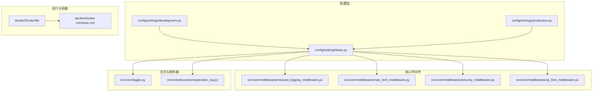
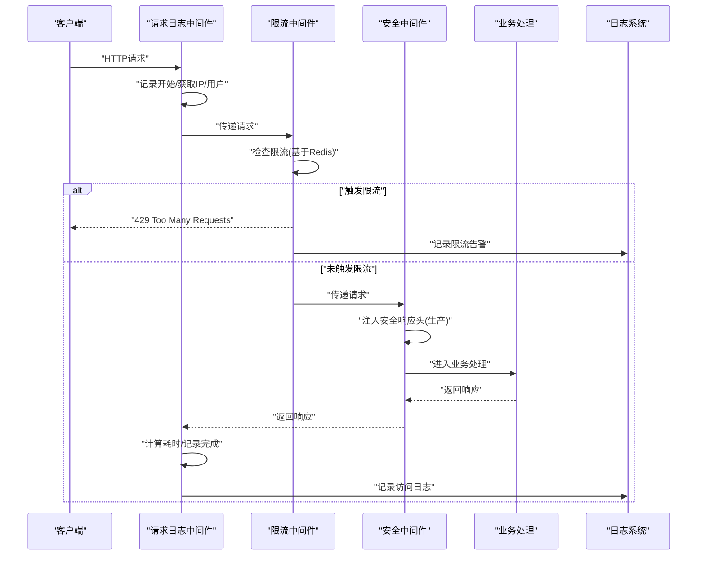
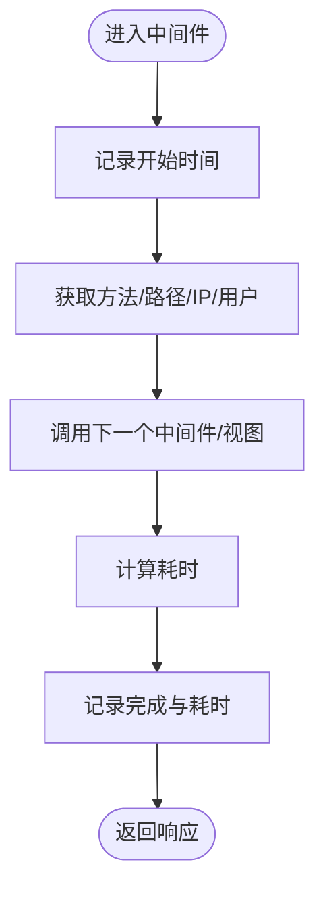
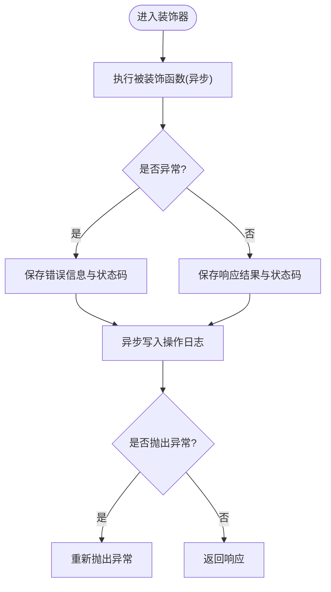
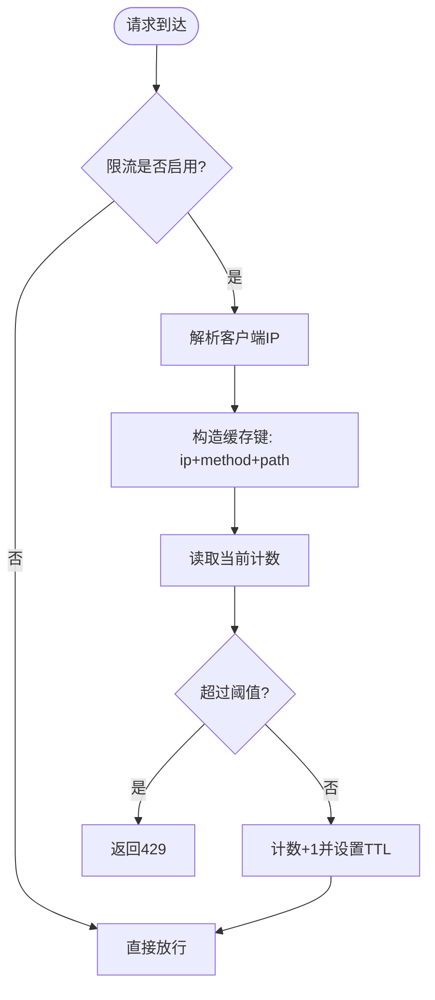
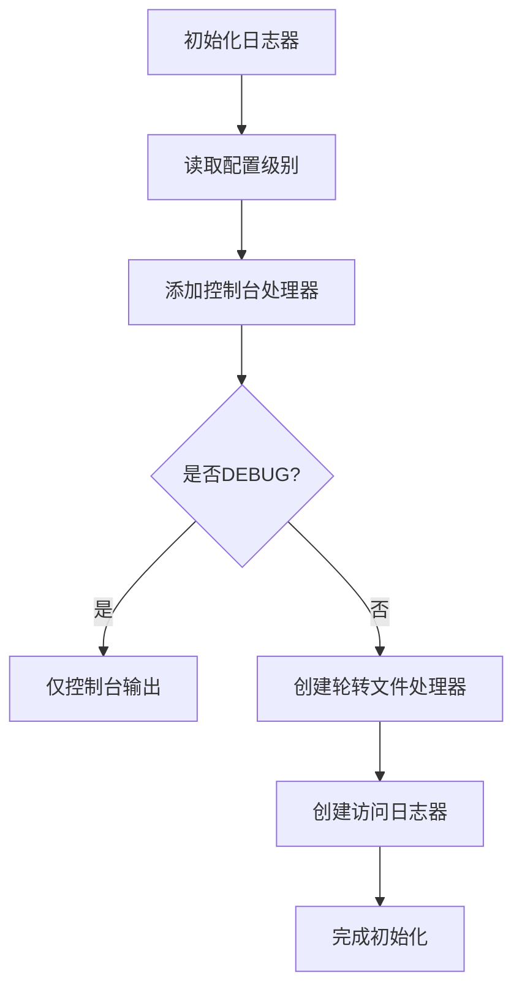
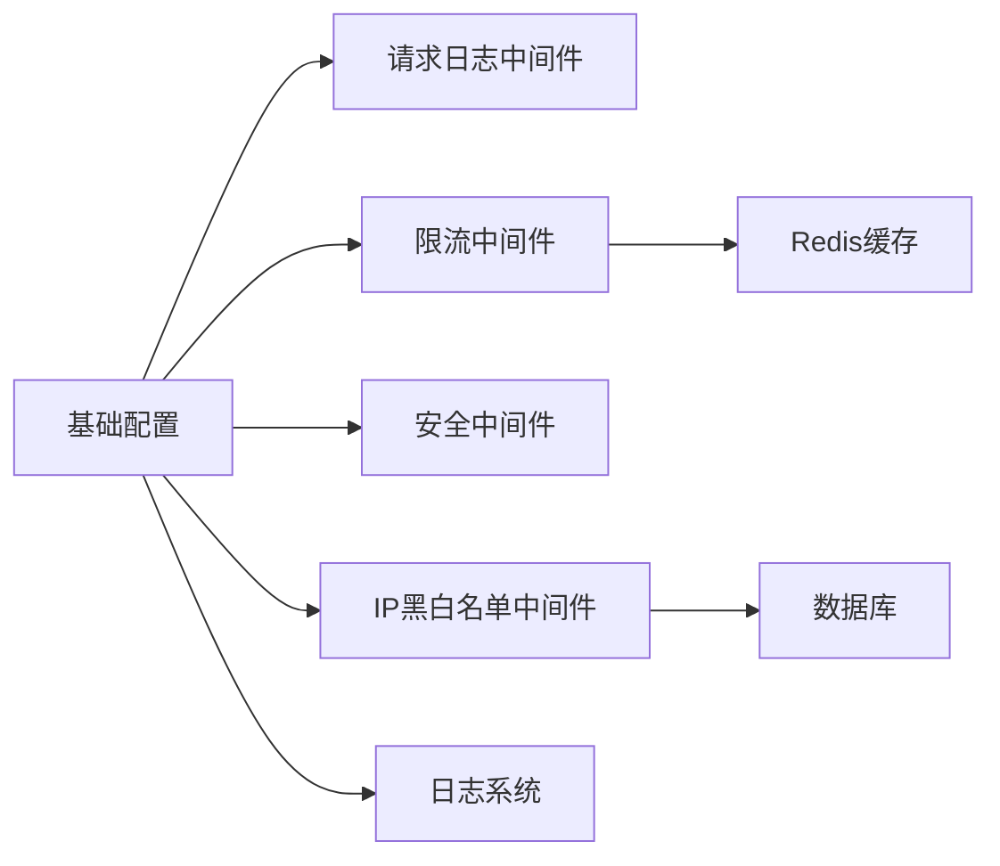

# 性能监控与分析

<cite>
**本文引用的文件**
- [src/core/middlewares/request_logging_middleware.py](file://src/core/middlewares/request_logging_middleware.py)
- [src/core/logger.py](file://src/core/logger.py)
- [src/core/decorators/operation_log.py](file://src/core/decorators/operation_log.py)
- [src/core/middlewares/rate_limit_middleware.py](file://src/core/middlewares/rate_limit_middleware.py)
- [src/core/middlewares/security_middleware.py](file://src/core/middlewares/security_middleware.py)
- [src/core/middlewares/ip_limit_middleware.py](file://src/core/middlewares/ip_limit_middleware.py)
- [config/settings/base.py](file://config/settings/base.py)
- [config/settings/development.py](file://config/settings/development.py)
- [config/settings/production.py](file://config/settings/production.py)
- [requirements.txt](file://requirements.txt)
- [pyproject.toml](file://pyproject.toml)
- [scripts/test.sh](file://scripts/test.sh)
- [docker/Dockerfile](file://docker/Dockerfile)
- [docker/docker-compose.yml](file://docker/docker-compose.yml)
</cite>

## 目录
1. [简介](#简介)
2. [项目结构](#项目结构)
3. [核心组件](#核心组件)
4. [架构总览](#架构总览)
5. [详细组件分析](#详细组件分析)
6. [依赖分析](#依赖分析)
7. [性能考虑](#性能考虑)
8. [故障排查指南](#故障排查指南)
9. [结论](#结论)
10. [附录](#附录)

## 简介
本文件面向性能监控与分析，结合仓库中的中间件、日志与配置，系统性阐述如何采集与分析关键性能指标（响应时间、吞吐量、错误率、资源使用率），如何优化日志系统（结构化日志、日志级别控制、异步日志写入），以及如何通过请求日志中间件、装饰器与限流/安全中间件进行请求跟踪、性能分析与异常监控。同时给出性能分析工具使用建议、瓶颈识别方法、性能测试环境搭建与自动化流程，以及性能回归检测的实施思路。

## 项目结构
该项目采用 Django + Django-Ninja 的分层架构，核心与基础设施按领域划分，配置按环境拆分，便于在不同环境中进行性能调优与监控。

图表来源
- [config/settings/base.py:1-235](file://config/settings/base.py#L1-L235)
- [src/core/middlewares/request_logging_middleware.py:1-86](file://src/core/middlewares/request_logging_middleware.py#L1-L86)
- [src/core/middlewares/rate_limit_middleware.py:1-112](file://src/core/middlewares/rate_limit_middleware.py#L1-L112)
- [src/core/middlewares/security_middleware.py:1-54](file://src/core/middlewares/security_middleware.py#L1-L54)
- [src/core/middlewares/ip_limit_middleware.py:1-130](file://src/core/middlewares/ip_limit_middleware.py#L1-L130)
- [src/core/logger.py:1-138](file://src/core/logger.py#L1-L138)
- [src/core/decorators/operation_log.py:1-175](file://src/core/decorators/operation_log.py#L1-L175)
- [docker/Dockerfile:1-33](file://docker/Dockerfile#L1-L33)
- [docker/docker-compose.yml:1-47](file://docker/docker-compose.yml#L1-L47)

章节来源
- [config/settings/base.py:1-235](file://config/settings/base.py#L1-L235)
- [docker/docker-compose.yml:1-47](file://docker/docker-compose.yml#L1-L47)

## 核心组件
- 请求日志中间件：记录请求开始/结束、耗时、用户与IP，为响应时间与吞吐量统计提供基础数据。
- 操作日志装饰器：在业务方法上自动记录操作日志，包含请求体、状态码、异常等，便于审计与性能回溯。
- 限流中间件：基于Redis缓存实现IP级限流，防止突发流量导致的性能抖动。
- 安全中间件：在生产环境注入安全响应头，减少安全扫描与攻击带来的额外开销。
- IP黑白名单中间件：快速阻断恶意IP，降低后端压力。
- 日志系统：统一日志格式、级别与输出目标，支持访问日志分离与异步写入能力。

章节来源
- [src/core/middlewares/request_logging_middleware.py:14-86](file://src/core/middlewares/request_logging_middleware.py#L14-L86)
- [src/core/decorators/operation_log.py:15-175](file://src/core/decorators/operation_log.py#L15-L175)
- [src/core/middlewares/rate_limit_middleware.py:15-112](file://src/core/middlewares/rate_limit_middleware.py#L15-L112)
- [src/core/middlewares/security_middleware.py:14-54](file://src/core/middlewares/security_middleware.py#L14-L54)
- [src/core/middlewares/ip_limit_middleware.py:15-130](file://src/core/middlewares/ip_limit_middleware.py#L15-L130)
- [src/core/logger.py:12-138](file://src/core/logger.py#L12-L138)

## 架构总览
下图展示请求在中间件链路中的处理顺序与性能相关的关键点（限流、安全、日志）：

图表来源
- [src/core/middlewares/request_logging_middleware.py:34-68](file://src/core/middlewares/request_logging_middleware.py#L34-L68)
- [src/core/middlewares/rate_limit_middleware.py:41-68](file://src/core/middlewares/rate_limit_middleware.py#L41-L68)
- [src/core/middlewares/security_middleware.py:33-53](file://src/core/middlewares/security_middleware.py#L33-L53)
- [src/core/logger.py:92-108](file://src/core/logger.py#L92-L108)

## 详细组件分析

### 请求日志中间件
- 能力概述
  - 记录请求开始与完成信息，包含方法、路径、用户、IP。
  - 计算请求耗时，用于响应时间统计。
  - 通过日志器输出，便于接入集中式日志平台。
- 关键实现要点
  - 使用时间戳计算耗时，避免高并发下的时钟抖动影响。
  - IP解析兼容代理场景，确保日志准确性。
- 性能影响
  - 日志写入为同步I/O，建议在生产环境使用异步/缓冲写入以降低延迟。
  - 可按需裁剪日志字段，减少序列化与IO开销。

图表来源
- [src/core/middlewares/request_logging_middleware.py:34-68](file://src/core/middlewares/request_logging_middleware.py#L34-L68)

章节来源
- [src/core/middlewares/request_logging_middleware.py:14-86](file://src/core/middlewares/request_logging_middleware.py#L14-L86)

### 操作日志装饰器
- 能力概述
  - 在业务方法前后捕获状态码、响应结果、异常，异步写入系统日志表。
  - 提取请求体、IP、User-Agent并解析浏览器与操作系统，便于性能分析与用户画像。
- 关键实现要点
  - 异步写入避免阻塞主流程；异常不影响业务返回。
  - 对请求体长度进行限制，防止过大日志影响性能。
- 性能影响
  - 异步写入与数据库I/O是主要开销；可通过批量入库或队列进一步优化。

图表来源
- [src/core/decorators/operation_log.py:29-72](file://src/core/decorators/operation_log.py#L29-L72)
- [src/core/decorators/operation_log.py:75-127](file://src/core/decorators/operation_log.py#L75-L127)

章节来源
- [src/core/decorators/operation_log.py:15-175](file://src/core/decorators/operation_log.py#L15-L175)

### 限流中间件
- 能力概述
  - 基于IP+方法+路径维度进行限流，使用Redis计数与TTL控制窗口。
  - 支持开关与默认规则配置，便于灰度与快速降级。
- 关键实现要点
  - 使用缓存键聚合维度，避免重复查询数据库。
  - 限流阈值与窗口参数可配置，便于按接口特性调整。
- 性能影响
  - Redis网络与序列化为开销来源；建议与本地缓存结合或使用更高效的限流算法。

图表来源
- [src/core/middlewares/rate_limit_middleware.py:41-112](file://src/core/middlewares/rate_limit_middleware.py#L41-L112)

章节来源
- [src/core/middlewares/rate_limit_middleware.py:15-112](file://src/core/middlewares/rate_limit_middleware.py#L15-L112)

### 安全中间件
- 能力概述
  - 在生产环境注入安全响应头，减少浏览器与服务器层面的安全扫描与攻击尝试带来的额外负载。
- 性能影响
  - 响应头注入为常量时间操作，几乎无性能损耗；但可减少后续安全模块的处理成本。

章节来源
- [src/core/middlewares/security_middleware.py:14-54](file://src/core/middlewares/security_middleware.py#L14-L54)

### IP黑白名单中间件
- 能力概述
  - 支持白名单与黑名单模式，快速阻断非法来源。
  - 支持永久与临时封禁，便于应急处置。
- 性能影响
  - 白名单查询为数据库操作，建议配合缓存或索引优化；黑名单查询逻辑包含到期判断，注意时间比较成本。

章节来源
- [src/core/middlewares/ip_limit_middleware.py:15-130](file://src/core/middlewares/ip_limit_middleware.py#L15-L130)

### 日志系统
- 能力概述
  - 统一日志格式与级别，开发环境仅控制台输出，生产环境落盘并按级别分离。
  - 提供访问日志专用logger，便于独立分析与轮转。
- 结构化与异步
  - 当前为同步写入；建议引入异步处理器或消息队列，降低I/O对主线程的影响。
  - 可扩展JSON格式，便于与ELK/Grafana等平台对接。

图表来源
- [src/core/logger.py:12-82](file://src/core/logger.py#L12-L82)

章节来源
- [src/core/logger.py:12-138](file://src/core/logger.py#L12-L138)

## 依赖分析
- 中间件依赖
  - 请求日志中间件不依赖外部服务，性能开销最小。
  - 限流中间件依赖Redis缓存；IP黑白名单中间件依赖数据库查询。
  - 安全中间件无外部依赖，仅修改响应头。
- 配置依赖
  - 基础配置决定中间件启用顺序与行为；开发/生产配置分别控制日志级别与数据库引擎。
- 工具与测试
  - requirements与pyproject提供测试与覆盖率工具，便于性能回归检测。

图表来源
- [config/settings/base.py:39-52](file://config/settings/base.py#L39-L52)
- [src/core/middlewares/rate_limit_middleware.py:30-39](file://src/core/middlewares/rate_limit_middleware.py#L30-L39)
- [src/core/middlewares/ip_limit_middleware.py:30-39](file://src/core/middlewares/ip_limit_middleware.py#L30-L39)

章节来源
- [config/settings/base.py:1-235](file://config/settings/base.py#L1-L235)
- [requirements.txt:1-38](file://requirements.txt#L1-L38)
- [pyproject.toml:92-109](file://pyproject.toml#L92-L109)

## 性能考虑
- 指标采集与分析
  - 响应时间：由请求日志中间件提供；建议在日志中保留微秒级精度，便于统计P95/P99。
  - 吞吐量：基于访问日志的时间戳与状态码统计QPS；可按接口维度聚合。
  - 错误率：统计4xx/5xx占比，结合操作日志装饰器的异常记录。
  - 资源使用率：结合系统监控（CPU/内存/IO）与数据库慢查询日志。
- 日志系统优化
  - 异步写入：引入异步处理器或消息队列，减少I/O阻塞。
  - 结构化日志：统一JSON格式，便于机器解析与可视化。
  - 日志级别控制：生产环境提升至INFO/ERROR，避免冗余日志。
- 中间件优化
  - 限流：使用更精细的令牌桶/漏桶算法，或结合分布式限流。
  - 安全头：仅在必要时注入，避免重复处理。
  - IP黑白名单：缓存热点IP，优化数据库查询。
- 数据库与缓存
  - 复用连接（CONN_MAX_AGE）与连接池；合理设置Redis超时与重试。
- 容器与部署
  - Dockerfile中设置无缓冲输出与禁用字节码缓存，减少I/O干扰。
  - docker-compose提供数据库与缓存服务，便于本地压测。

章节来源
- [config/settings/base.py:78-88](file://config/settings/base.py#L78-L88)
- [config/settings/base.py:153-163](file://config/settings/base.py#L153-L163)
- [docker/Dockerfile:4-7](file://docker/Dockerfile#L4-L7)
- [docker/docker-compose.yml:20-42](file://docker/docker-compose.yml#L20-L42)

## 故障排查指南
- 响应时间异常升高
  - 检查请求日志中间件是否正常记录耗时；关注是否存在慢查询或数据库锁。
  - 核对限流中间件是否误伤；确认Redis可用性与键空间。
- 错误率上升
  - 查看操作日志装饰器记录的异常堆栈；结合访问日志定位接口与时间段。
  - 检查安全中间件是否误拦截；核对生产环境安全头配置。
- IP被阻断
  - 核对IP黑白名单中间件配置；检查数据库封禁记录与到期时间。
- 日志缺失或过多
  - 检查日志级别与输出目标；确认轮转策略与磁盘空间。
  - 如需异步写入，评估队列积压与失败重试。

章节来源
- [src/core/middlewares/request_logging_middleware.py:44-66](file://src/core/middlewares/request_logging_middleware.py#L44-L66)
- [src/core/decorators/operation_log.py:45-68](file://src/core/decorators/operation_log.py#L45-L68)
- [src/core/middlewares/rate_limit_middleware.py:58-66](file://src/core/middlewares/rate_limit_middleware.py#L58-L66)
- [src/core/middlewares/ip_limit_middleware.py:55-74](file://src/core/middlewares/ip_limit_middleware.py#L55-L74)
- [src/core/logger.py:22-81](file://src/core/logger.py#L22-L81)

## 结论
本项目在中间件与日志层面提供了完善的性能监控基础：请求日志中间件提供响应时间与吞吐量数据，操作日志装饰器提供异常与审计线索，限流与安全中间件保障系统稳定性，日志系统支持结构化与分级输出。建议在生产环境引入异步日志、分布式限流与系统监控，结合测试与容器化环境，形成闭环的性能测试与回归检测体系。

## 附录
- 性能分析工具使用建议
  - Python内置cProfile：用于CPU热点分析，定位耗时函数与调用链。
  - memory_profiler：用于内存分配与泄漏检测，结合进程内存快照对比。
  - pytest与覆盖率：结合自动化测试，建立性能回归基线。
- 性能测试环境与自动化
  - 使用docker-compose一键拉起数据库与缓存，便于本地压测。
  - 测试脚本集成pytest与覆盖率，输出HTML报告，便于持续集成。
- 性能回归检测
  - 将关键接口的P95响应时间与错误率纳入CI检查，设定阈值告警。
  - 建立基准环境（容器化）与压测脚本，定期执行回归测试。

章节来源
- [scripts/test.sh:10-13](file://scripts/test.sh#L10-L13)
- [docker/docker-compose.yml:1-47](file://docker/docker-compose.yml#L1-47)
- [pyproject.toml:92-109](file://pyproject.toml#L92-L109)