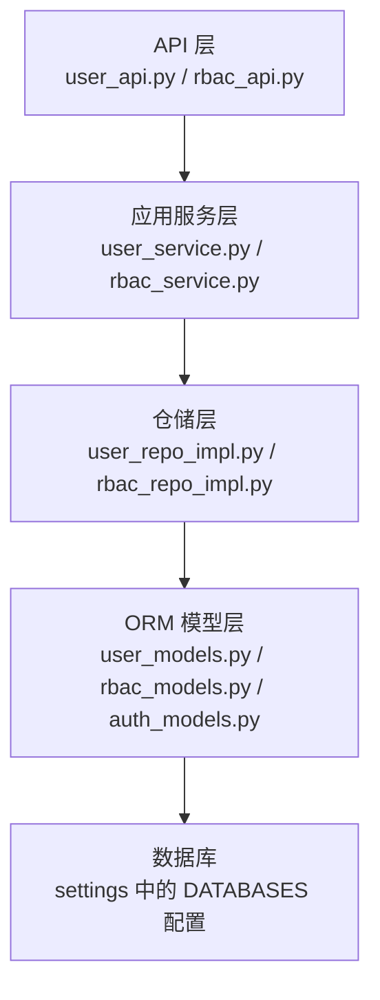
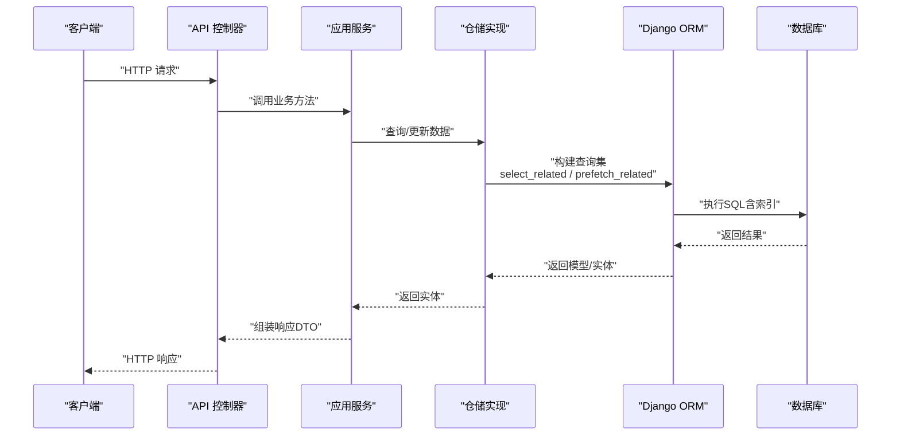
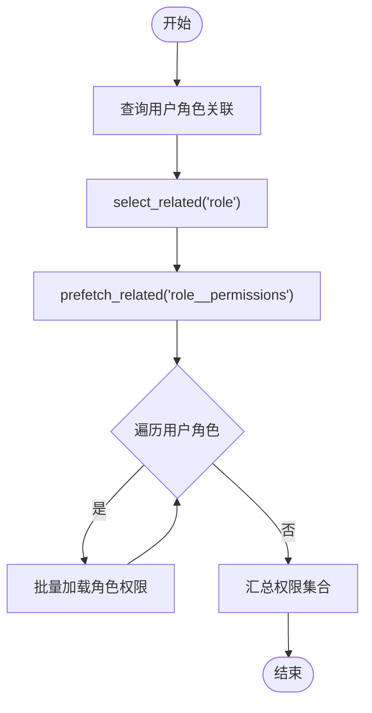
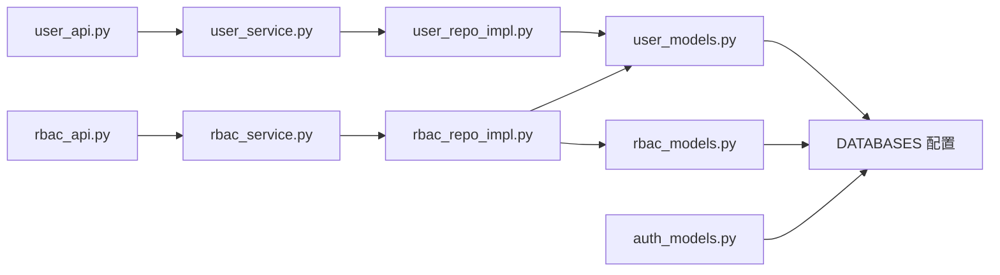

# 数据库优化

<cite>
**本文引用的文件**
- [config/settings/base.py](file://config/settings/base.py)
- [config/settings/development.py](file://config/settings/development.py)
- [config/settings/production.py](file://config/settings/production.py)
- [src/infrastructure/persistence/models/__init__.py](file://src/infrastructure/persistence/models/__init__.py)
- [src/infrastructure/persistence/models/user_models.py](file://src/infrastructure/persistence/models/user_models.py)
- [src/infrastructure/persistence/models/rbac_models.py](file://src/infrastructure/persistence/models/rbac_models.py)
- [src/infrastructure/persistence/models/auth_models.py](file://src/infrastructure/persistence/models/auth_models.py)
- [src/infrastructure/repositories/base_repository.py](file://src/infrastructure/repositories/base_repository.py)
- [src/infrastructure/repositories/crud_repository.py](file://src/infrastructure/repositories/crud_repository.py)
- [src/infrastructure/repositories/user_repo_impl.py](file://src/infrastructure/repositories/user_repo_impl.py)
- [src/infrastructure/repositories/rbac_repo_impl.py](file://src/infrastructure/repositories/rbac_repo_impl.py)
- [src/application/services/user_service.py](file://src/application/services/user_service.py)
- [src/application/services/rbac_service.py](file://src/application/services/rbac_service.py)
- [src/api/v1/user_api.py](file://src/api/v1/user_api.py)
- [src/api/v1/rbac_api.py](file://src/api/v1/rbac_api.py)
- [sql/rbac.sql](file://sql/rbac.sql)
</cite>

## 目录
1. [简介](#简介)
2. [项目结构](#项目结构)
3. [核心组件](#核心组件)
4. [架构总览](#架构总览)
5. [详细组件分析](#详细组件分析)
6. [依赖分析](#依赖分析)
7. [性能考量](#性能考量)
8. [故障排查指南](#故障排查指南)
9. [结论](#结论)
10. [附录](#附录)

## 简介
本文件聚焦于数据库优化的综合实践，结合仓库中的Django/Django Ninja实现，系统阐述以下主题：
- 索引设计原则与字段选择
- 查询计划分析与慢查询识别
- ORM查询优化：select_related、prefetch_related、避免N+1
- 连接池与连接复用：CONN_MAX_AGE
- 表结构优化：字段类型、约束、索引
- 性能监控与分析：日志、缓存、查询计数
- 实战SQL优化案例与最佳实践

## 项目结构
该项目采用分层架构，数据库相关实现主要集中在基础设施层（models、repositories）与应用层（services），并通过API层对外暴露。数据库配置在settings中集中管理，并通过ORM模型与仓储实现进行数据访问。

图表来源
- [src/api/v1/user_api.py:1-150](file://src/api/v1/user_api.py#L1-L150)
- [src/api/v1/rbac_api.py:1-184](file://src/api/v1/rbac_api.py#L1-L184)
- [src/application/services/user_service.py:1-172](file://src/application/services/user_service.py#L1-L172)
- [src/application/services/rbac_service.py:1-286](file://src/application/services/rbac_service.py#L1-L286)
- [src/infrastructure/repositories/user_repo_impl.py:1-138](file://src/infrastructure/repositories/user_repo_impl.py#L1-L138)
- [src/infrastructure/repositories/rbac_repo_impl.py:1-253](file://src/infrastructure/repositories/rbac_repo_impl.py#L1-L253)
- [src/infrastructure/persistence/models/user_models.py:1-147](file://src/infrastructure/persistence/models/user_models.py#L1-L147)
- [src/infrastructure/persistence/models/rbac_models.py:1-148](file://src/infrastructure/persistence/models/rbac_models.py#L1-L148)
- [src/infrastructure/persistence/models/auth_models.py:1-114](file://src/infrastructure/persistence/models/auth_models.py#L1-L114)
- [config/settings/base.py:77-88](file://config/settings/base.py#L77-L88)

章节来源
- [config/settings/base.py:77-88](file://config/settings/base.py#L77-L88)
- [config/settings/development.py:10-16](file://config/settings/development.py#L10-L16)
- [config/settings/production.py:12-23](file://config/settings/production.py#L12-L23)

## 核心组件
- 数据库配置：支持多数据库，默认启用CONN_MAX_AGE实现连接复用；开发使用SQLite，生产使用PostgreSQL。
- ORM模型：用户、角色权限、认证相关模型均定义了必要的索引与外键约束。
- 仓储层：提供通用CRUD与实体转换能力，支持异步ORM操作。
- 应用服务层：封装业务逻辑，调用仓储完成数据访问，并集成缓存。
- API层：提供REST接口，调用应用服务。

章节来源
- [config/settings/base.py:77-88](file://config/settings/base.py#L77-L88)
- [config/settings/development.py:10-16](file://config/settings/development.py#L10-L16)
- [config/settings/production.py:12-23](file://config/settings/production.py#L12-L23)
- [src/infrastructure/persistence/models/user_models.py:71-80](file://src/infrastructure/persistence/models/user_models.py#L71-L80)
- [src/infrastructure/persistence/models/rbac_models.py:29-37](file://src/infrastructure/persistence/models/rbac_models.py#L29-L37)
- [src/infrastructure/repositories/crud_repository.py:50-95](file://src/infrastructure/repositories/crud_repository.py#L50-L95)
- [src/application/services/user_service.py:21-23](file://src/application/services/user_service.py#L21-L23)
- [src/application/services/rbac_service.py:28-29](file://src/application/services/rbac_service.py#L28-L29)

## 架构总览
下图展示从API到数据库的调用链路及关键优化点（索引、select_related/prefetch_related、缓存）：

图表来源
- [src/api/v1/rbac_api.py:162-169](file://src/api/v1/rbac_api.py#L162-L169)
- [src/application/services/rbac_service.py:219-231](file://src/application/services/rbac_service.py#L219-L231)
- [src/infrastructure/repositories/rbac_repo_impl.py:201-228](file://src/infrastructure/repositories/rbac_repo_impl.py#L201-L228)
- [src/infrastructure/persistence/models/rbac_models.py:79-113](file://src/infrastructure/persistence/models/rbac_models.py#L79-L113)

## 详细组件分析

### 数据库配置与连接池优化
- 连接复用：默认启用CONN_MAX_AGE，减少连接建立开销，提升并发吞吐。
- 环境差异：开发环境使用SQLite，便于快速迭代；生产环境使用PostgreSQL，具备更强事务与并发能力。
- 连接数限制：可通过数据库驱动与服务器配置控制最大连接数，建议与应用并发度匹配。

章节来源
- [config/settings/base.py:77-88](file://config/settings/base.py#L77-L88)
- [config/settings/development.py:10-16](file://config/settings/development.py#L10-L16)
- [config/settings/production.py:12-23](file://config/settings/production.py#L12-L23)

### ORM查询优化与N+1避免
- select_related：用于一对一/多对一外键，减少JOIN查询次数。
- prefetch_related：用于多对多/反向外键，预先加载关联集合，避免循环逐条查询。
- 在用户权限查询中，仓储实现已使用select_related("role")与prefetch_related("role__permissions")，有效避免N+1问题。

图表来源
- [src/infrastructure/repositories/rbac_repo_impl.py:201-228](file://src/infrastructure/repositories/rbac_repo_impl.py#L201-L228)

章节来源
- [src/infrastructure/repositories/rbac_repo_impl.py:201-228](file://src/infrastructure/repositories/rbac_repo_impl.py#L201-L228)

### 索引设计与字段类型选择
- 用户模型：对username、email、phone建立索引，加速登录与检索。
- 权限/角色模型：对code、resource等高频过滤字段建立索引。
- 认证模型：对token、jti等唯一且高频查询字段建立索引与db_index。
- 字段类型：优先使用合适长度的CharField/TextField，避免过度占用空间；布尔字段使用TinyInt兼容MySQL，注意ORM映射。

章节来源
- [src/infrastructure/persistence/models/user_models.py:71-80](file://src/infrastructure/persistence/models/user_models.py#L71-L80)
- [src/infrastructure/persistence/models/rbac_models.py:29-37](file://src/infrastructure/persistence/models/rbac_models.py#L29-L37)
- [src/infrastructure/persistence/models/auth_models.py:33-41](file://src/infrastructure/persistence/models/auth_models.py#L33-L41)
- [sql/rbac.sql:14-178](file://sql/rbac.sql#L14-L178)

### 查询计划分析与慢查询识别
- 开发环境：建议开启Django调试面板的SQL日志，观察查询次数与耗时。
- 生产环境：通过日志聚合与慢查询日志定位热点SQL，结合索引与查询重写优化。
- 关注点：JOIN数量、WHERE条件是否可用索引、ORDER BY字段是否命中索引、LIMIT是否合理。

章节来源
- [config/settings/base.py:174-226](file://config/settings/base.py#L174-L226)
- [config/settings/development.py:18-20](file://config/settings/development.py#L18-L20)

### 缓存与性能监控
- 缓存集成：应用服务在读取用户信息时使用缓存管理器，降低数据库压力。
- 缓存键：用户信息、角色、权限分别维护独立缓存键，更新后及时失效。
- 日志：统一的日志配置输出INFO/DEBUG级别日志，便于性能分析与问题追踪。

章节来源
- [src/application/services/user_service.py:54-66](file://src/application/services/user_service.py#L54-L66)
- [src/application/services/rbac_service.py:235-251](file://src/application/services/rbac_service.py#L235-L251)
- [config/settings/base.py:174-226](file://config/settings/base.py#L174-L226)

### 实际SQL优化案例与最佳实践
- 案例1：用户列表分页
  - 优化前：逐页切片+count()两次查询，可能产生重复扫描。
  - 优化后：仓储层使用offset/limit一次性获取，同时提供count()统计；避免N+1。
  章节来源
  - [src/infrastructure/repositories/base_repository.py:65-72](file://src/infrastructure/repositories/base_repository.py#L65-L72)
  - [src/infrastructure/repositories/crud_repository.py:97-110](file://src/infrastructure/repositories/crud_repository.py#L97-L110)

- 案例2：用户权限检查
  - 优化前：循环逐个角色查询权限，N+1问题明显。
  - 优化后：使用select_related+prefetch_related一次性加载，再在Python侧去重合并。
  章节来源
  - [src/infrastructure/repositories/rbac_repo_impl.py:201-228](file://src/infrastructure/repositories/rbac_repo_impl.py#L201-L228)

- 案例3：索引命中
  - 场景：按用户名/邮箱登录、按权限code过滤。
  - 优化：确保对应字段建立索引，避免全表扫描。
  章节来源
  - [src/infrastructure/persistence/models/user_models.py:71-80](file://src/infrastructure/persistence/models/user_models.py#L71-L80)
  - [src/infrastructure/persistence/models/rbac_models.py:29-37](file://src/infrastructure/persistence/models/rbac_models.py#L29-L37)

## 依赖分析
仓储与模型之间存在直接依赖，应用服务依赖仓储接口，API层依赖应用服务。整体耦合度适中，便于扩展与测试。

图表来源
- [src/api/v1/user_api.py:1-150](file://src/api/v1/user_api.py#L1-L150)
- [src/api/v1/rbac_api.py:1-184](file://src/api/v1/rbac_api.py#L1-L184)
- [src/application/services/user_service.py:1-172](file://src/application/services/user_service.py#L1-L172)
- [src/application/services/rbac_service.py:1-286](file://src/application/services/rbac_service.py#L1-L286)
- [src/infrastructure/repositories/user_repo_impl.py:1-138](file://src/infrastructure/repositories/user_repo_impl.py#L1-L138)
- [src/infrastructure/repositories/rbac_repo_impl.py:1-253](file://src/infrastructure/repositories/rbac_repo_impl.py#L1-L253)
- [src/infrastructure/persistence/models/user_models.py:1-147](file://src/infrastructure/persistence/models/user_models.py#L1-L147)
- [src/infrastructure/persistence/models/rbac_models.py:1-148](file://src/infrastructure/persistence/models/rbac_models.py#L1-L148)
- [src/infrastructure/persistence/models/auth_models.py:1-114](file://src/infrastructure/persistence/models/auth_models.py#L1-L114)
- [config/settings/base.py:77-88](file://config/settings/base.py#L77-L88)

章节来源
- [src/infrastructure/persistence/models/__init__.py:1-23](file://src/infrastructure/persistence/models/__init__.py#L1-L23)

## 性能考量
- 连接池与复用：启用CONN_MAX_AGE，减少连接建立成本；生产环境配合数据库连接池（如pgbouncer）进一步提升并发。
- 查询优化：优先使用select_related/prefetch_related，避免N+1；对高频过滤字段建立索引。
- 缓存策略：热点数据使用缓存，更新时主动失效；注意缓存键命名与过期策略。
- 分页与统计：分页查询配合count()统计，避免重复扫描；必要时使用覆盖索引。
- 日志与监控：生产环境开启适当日志级别，结合慢查询日志与APM工具定位瓶颈。

## 故障排查指南
- 慢查询定位
  - 开启Django SQL日志，观察查询次数与耗时。
  - 使用数据库EXPLAIN/EXPLAIN ANALYZE查看执行计划，确认索引使用情况。
- N+1问题
  - 检查关联查询是否使用select_related/prefetch_related。
  - 对多对多/反向外键场景，确认是否提前加载关联集合。
- 连接问题
  - 检查CONN_MAX_AGE配置是否合理，避免连接泄漏。
  - 生产环境核对数据库最大连接数与应用并发度匹配。
- 缓存异常
  - 确认缓存键命名一致，更新后及时失效。
  - 检查Redis连接与内存使用情况。

章节来源
- [config/settings/base.py:174-226](file://config/settings/base.py#L174-L226)
- [src/application/services/user_service.py:95-108](file://src/application/services/user_service.py#L95-L108)
- [src/application/services/rbac_service.py:201-215](file://src/application/services/rbac_service.py#L201-L215)

## 结论
本项目在数据库层面通过合理的索引设计、ORM查询优化（select_related/prefetch_related）、连接复用（CONN_MAX_AGE）以及缓存策略，形成了较为完善的性能基础。建议在生产环境中结合数据库慢查询日志与APM工具持续监控，针对热点SQL进行专项优化，并完善索引覆盖与分页统计策略，以获得更稳定的性能表现。

## 附录
- 参考SQL脚本：包含部门、菜单、操作日志、用户、角色、用户角色等表结构与索引，可用于理解字段类型与约束设计。
  
章节来源
- [sql/rbac.sql:1-232](file://sql/rbac.sql#L1-L232)