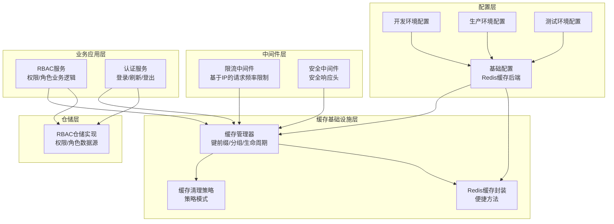
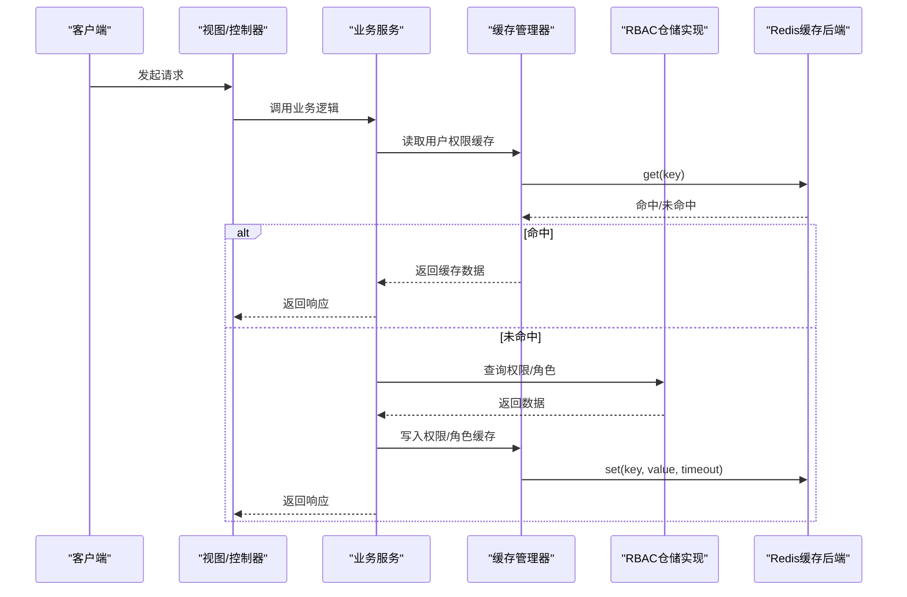
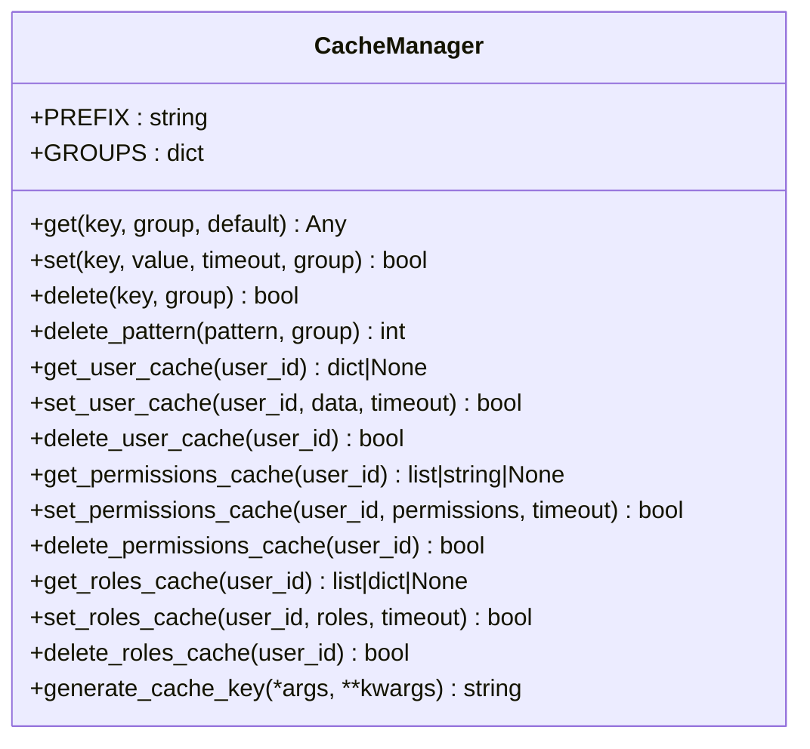
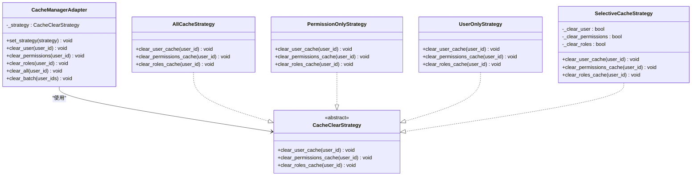
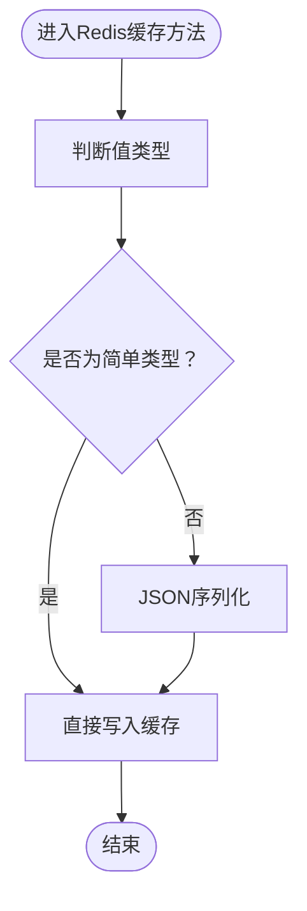
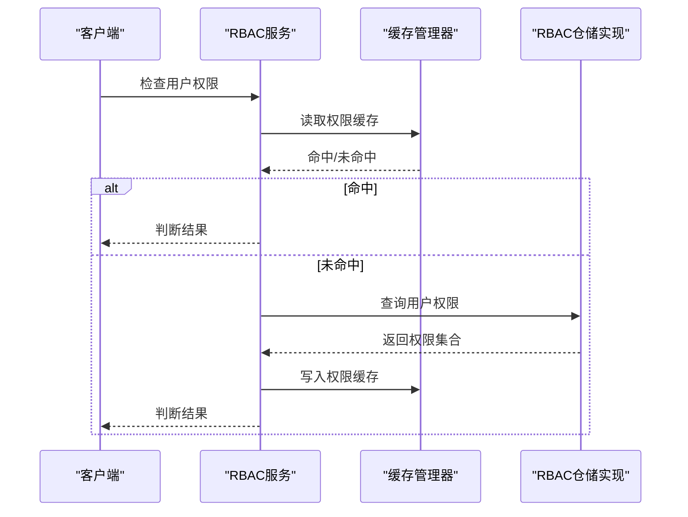
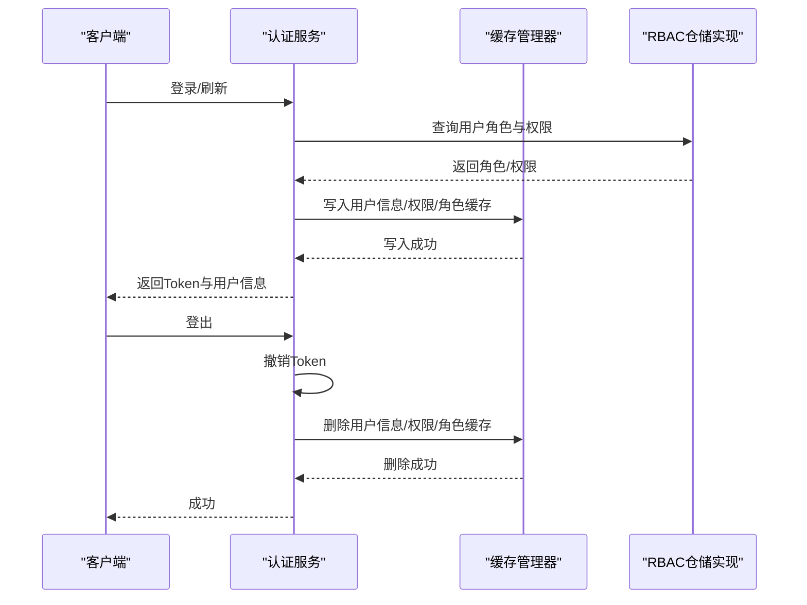
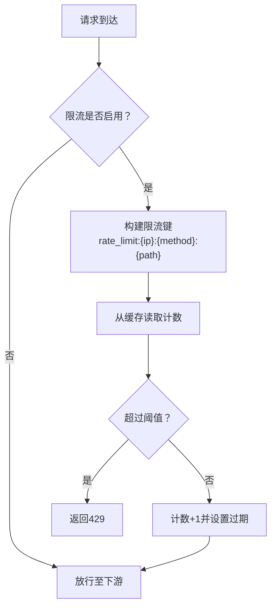
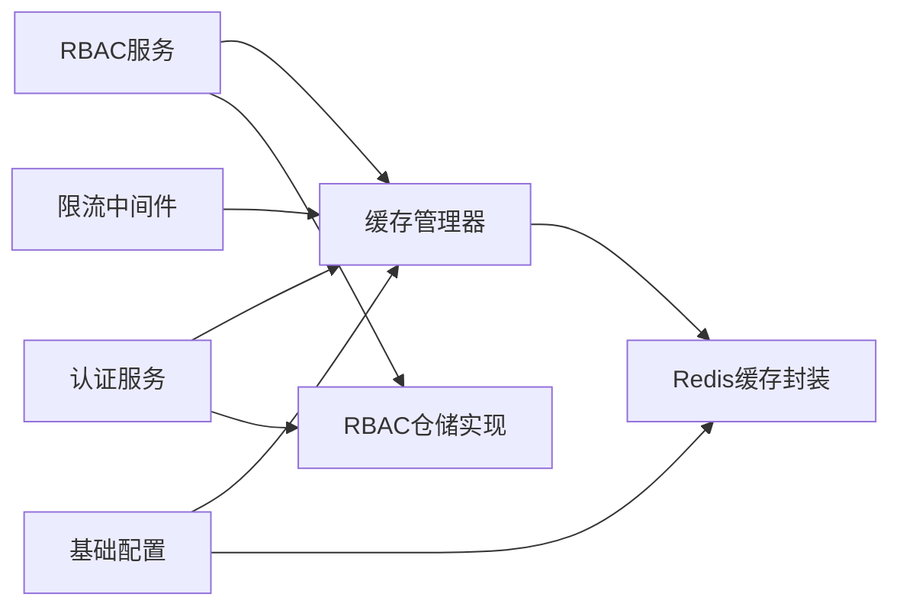

# 缓存优化

<cite>
**本文引用的文件**
- [cache_manager.py](file://src/infrastructure/cache/cache_manager.py)
- [cache_strategies.py](file://src/infrastructure/cache/cache_strategies.py)
- [redis_cache.py](file://src/infrastructure/cache/redis_cache.py)
- [rbac_service.py](file://src/application/services/rbac_service.py)
- [auth_service.py](file://src/application/services/auth_service.py)
- [rbac_repo_impl.py](file://src/infrastructure/repositories/rbac_repo_impl.py)
- [rate_limit_middleware.py](file://src/core/middlewares/rate_limit_middleware.py)
- [security_middleware.py](file://src/core/middlewares/security_middleware.py)
- [base.py](file://config/settings/base.py)
- [production.py](file://config/settings/production.py)
- [development.py](file://config/settings/development.py)
- [testing.py](file://config/settings/testing.py)
</cite>

## 目录
1. [简介](#简介)
2. [项目结构](#项目结构)
3. [核心组件](#核心组件)
4. [架构总览](#架构总览)
5. [详细组件分析](#详细组件分析)
6. [依赖分析](#依赖分析)
7. [性能考虑](#性能考虑)
8. [故障排查指南](#故障排查指南)
9. [结论](#结论)
10. [附录](#附录)

## 简介
本文件围绕本项目的缓存优化进行系统化梳理与实操指导，重点覆盖以下方面：
- 缓存管理器的设计与实现：缓存键生成策略、缓存分组管理、缓存生命周期管理
- 缓存策略应用场景：用户信息缓存、权限缓存、角色缓存
- 缓存命中率优化技术：缓存预热、缓存穿透防护、缓存雪崩预防
- Redis缓存的具体实现与配置优化
- 缓存性能监控与调优：统计指标、失效策略、清理机制
- 实际代码示例与最佳实践建议

## 项目结构
缓存相关能力主要分布在以下模块：
- 缓存基础设施层：缓存管理器、Redis封装、缓存清理策略
- 业务应用层：RBAC服务、认证服务对缓存的使用
- 仓储层：RBAC仓储实现，提供权限/角色查询的底层数据源
- 中间件层：限流中间件、安全中间件，间接影响缓存压力与命中
- 配置层：Redis缓存后端配置、不同环境下的缓存行为差异

**图表来源**
- [base.py:153-163](file://config/settings/base.py#L153-L163)
- [rate_limit_middleware.py:15-112](file://src/core/middlewares/rate_limit_middleware.py#L15-L112)
- [security_middleware.py:14-54](file://src/core/middlewares/security_middleware.py#L14-L54)
- [rbac_service.py:22-286](file://src/application/services/rbac_service.py#L22-L286)
- [auth_service.py:20-233](file://src/application/services/auth_service.py#L20-L233)
- [rbac_repo_impl.py:15-253](file://src/infrastructure/repositories/rbac_repo_impl.py#L15-L253)
- [cache_manager.py:16-149](file://src/infrastructure/cache/cache_manager.py#L16-L149)
- [cache_strategies.py:9-245](file://src/infrastructure/cache/cache_strategies.py#L9-L245)
- [redis_cache.py:15-169](file://src/infrastructure/cache/redis_cache.py#L15-L169)

**章节来源**
- [base.py:153-163](file://config/settings/base.py#L153-L163)
- [development.py:1-24](file://config/settings/development.py#L1-L24)
- [production.py:1-39](file://config/settings/production.py#L1-L39)
- [testing.py:1-31](file://config/settings/testing.py#L1-L31)

## 核心组件
- 缓存管理器（CacheManager）
  - 键前缀与分组：统一前缀“hello_api”，按“user/rbac/auth/security/system”分组，便于隔离与批量管理
  - 生命周期：提供get/set/delete，支持超时控制；自动JSON序列化/反序列化
  - 用户/权限/角色专用接口：针对RBAC场景的键命名约定与默认超时
  - 通用键生成：基于参数生成MD5键，便于动态参数组合的缓存键生成
- 缓存清理策略（CacheClearStrategy + 适配器）
  - 策略模式：All/PermissionOnly/UserOnly/Selective，按需选择清理范围
  - 适配器：集中调用入口，支持批量清理
- Redis缓存封装（RedisCache）
  - 基于Django缓存抽象，提供get/set/delete/exists/get_many/set_many/increment等常用方法
  - 保持与CacheManager一致的前缀与序列化策略
- 业务服务中的缓存使用
  - RBAC服务：权限/角色缓存读写与失效
  - 认证服务：登录/刷新/登出时清理用户相关缓存
- 仓储层支撑
  - RBAC仓储实现提供权限/角色查询，作为缓存未命中时的可靠数据源

**章节来源**
- [cache_manager.py:16-149](file://src/infrastructure/cache/cache_manager.py#L16-L149)
- [cache_strategies.py:9-245](file://src/infrastructure/cache/cache_strategies.py#L9-L245)
- [redis_cache.py:15-169](file://src/infrastructure/cache/redis_cache.py#L15-L169)
- [rbac_service.py:22-286](file://src/application/services/rbac_service.py#L22-L286)
- [auth_service.py:20-233](file://src/application/services/auth_service.py#L20-L233)
- [rbac_repo_impl.py:15-253](file://src/infrastructure/repositories/rbac_repo_impl.py#L15-L253)

## 架构总览
下图展示缓存在系统中的交互路径：业务服务通过缓存管理器读写缓存；当缓存未命中时回源到仓储层；中间件层对请求频率进行限制，降低缓存压力。

**图表来源**
- [rbac_service.py:233-251](file://src/application/services/rbac_service.py#L233-L251)
- [cache_manager.py:42-82](file://src/infrastructure/cache/cache_manager.py#L42-L82)
- [rbac_repo_impl.py:206-248](file://src/infrastructure/repositories/rbac_repo_impl.py#L206-L248)
- [base.py:158-163](file://config/settings/base.py#L158-L163)

## 详细组件分析

### 缓存管理器设计与实现
- 键生成策略
  - 统一前缀与分组：通过前缀+分组+键名形成唯一键，便于隔离与管理
  - 通用键生成：对任意参数生成MD5摘要，适合动态参数组合的场景
- 缓存分组管理
  - 预定义分组：user/rbac/auth/security/system，分别对应用户信息、权限/角色、认证、安全、系统级缓存
- 生命周期管理
  - get：自动JSON反序列化，异常兜底返回默认值
  - set：自动JSON序列化，支持超时
  - delete：删除指定键
  - delete_pattern：当前实现不支持模式删除，仅记录告警
- 用户/权限/角色专用接口
  - 针对RBAC场景的键命名约定（如“user:{user_id}”、“permissions:{user_id}”、“roles:{user_id}”），并提供默认超时

**图表来源**
- [cache_manager.py:16-149](file://src/infrastructure/cache/cache_manager.py#L16-L149)

**章节来源**
- [cache_manager.py:22-149](file://src/infrastructure/cache/cache_manager.py#L22-L149)

### 缓存清理策略与适配器
- 策略模式
  - AllCacheStrategy：清理用户信息、权限、角色缓存
  - PermissionOnlyStrategy：仅清理权限与角色缓存
  - UserOnlyStrategy：仅清理用户信息缓存
  - SelectiveCacheStrategy：按配置选择性清理
- 适配器
  - 集中调用入口，支持clear_user/clear_permissions/clear_roles/clear_all/clear_batch

**图表来源**
- [cache_strategies.py:9-245](file://src/infrastructure/cache/cache_strategies.py#L9-L245)

**章节来源**
- [cache_strategies.py:9-245](file://src/infrastructure/cache/cache_strategies.py#L9-L245)

### Redis缓存封装与配置
- Redis封装
  - 提供get/set/delete/exists/get_many/set_many/increment等方法，统一前缀与序列化
  - 对异常进行日志记录并返回安全默认值
- 配置优化
  - Redis后端通过CACHES配置，支持主机、端口、数据库选择
  - 不同环境配置差异：开发/生产/测试分别采用不同后端与日志级别

**图表来源**
- [redis_cache.py:49-66](file://src/infrastructure/cache/redis_cache.py#L49-L66)
- [base.py:158-163](file://config/settings/base.py#L158-L163)

**章节来源**
- [redis_cache.py:15-169](file://src/infrastructure/cache/redis_cache.py#L15-L169)
- [base.py:153-163](file://config/settings/base.py#L153-L163)
- [production.py:1-39](file://config/settings/production.py#L1-L39)
- [development.py:1-24](file://config/settings/development.py#L1-L24)
- [testing.py:1-31](file://config/settings/testing.py#L1-L31)

### RBAC服务中的缓存策略
- 权限检查流程
  - 优先从缓存读取权限集合，命中则直接判断
  - 未命中时回源仓储查询，随后将权限集合写入缓存
- 缓存失效
  - 分配/移除角色后主动删除该用户的权限与角色缓存，确保一致性

**图表来源**
- [rbac_service.py:233-251](file://src/application/services/rbac_service.py#L233-L251)
- [cache_manager.py:108-122](file://src/infrastructure/cache/cache_manager.py#L108-L122)
- [rbac_repo_impl.py:206-248](file://src/infrastructure/repositories/rbac_repo_impl.py#L206-L248)

**章节来源**
- [rbac_service.py:233-251](file://src/application/services/rbac_service.py#L233-L251)
- [rbac_repo_impl.py:206-248](file://src/infrastructure/repositories/rbac_repo_impl.py#L206-L248)

### 认证服务中的缓存策略
- 登录/刷新：生成JWT后，可将用户的角色与权限信息写入缓存，减少鉴权时的查询开销
- 登出：撤销Token的同时，清理用户相关的用户信息、权限、角色缓存，避免脏数据

**图表来源**
- [auth_service.py:26-112](file://src/application/services/auth_service.py#L26-L112)
- [auth_service.py:164-180](file://src/application/services/auth_service.py#L164-L180)
- [cache_manager.py:93-137](file://src/infrastructure/cache/cache_manager.py#L93-L137)
- [rbac_repo_impl.py:201-228](file://src/infrastructure/repositories/rbac_repo_impl.py#L201-L228)

**章节来源**
- [auth_service.py:26-112](file://src/application/services/auth_service.py#L26-L112)
- [auth_service.py:164-180](file://src/application/services/auth_service.py#L164-L180)
- [cache_manager.py:93-137](file://src/infrastructure/cache/cache_manager.py#L93-L137)

### 中间件对缓存的影响
- 限流中间件
  - 基于IP的请求频率限制，使用缓存记录请求次数，防止突发流量导致缓存压力过大
- 安全中间件
  - 在生产环境添加安全响应头，提升整体安全性，间接降低被攻击导致的缓存滥用风险

**图表来源**
- [rate_limit_middleware.py:87-111](file://src/core/middlewares/rate_limit_middleware.py#L87-L111)

**章节来源**
- [rate_limit_middleware.py:15-112](file://src/core/middlewares/rate_limit_middleware.py#L15-L112)
- [security_middleware.py:14-54](file://src/core/middlewares/security_middleware.py#L14-L54)

## 依赖分析
- 组件耦合
  - 业务服务依赖缓存管理器与仓储实现，形成清晰的分层
  - 缓存管理器与Redis封装共同依赖Django缓存抽象
- 外部依赖
  - Redis作为默认缓存后端，通过CACHES配置注入
  - 中间件层对缓存有直接使用，影响缓存压力与命中

**图表来源**
- [rbac_service.py:22-286](file://src/application/services/rbac_service.py#L22-L286)
- [auth_service.py:20-233](file://src/application/services/auth_service.py#L20-L233)
- [cache_manager.py:16-149](file://src/infrastructure/cache/cache_manager.py#L16-L149)
- [redis_cache.py:15-169](file://src/infrastructure/cache/redis_cache.py#L15-L169)
- [rate_limit_middleware.py:15-112](file://src/core/middlewares/rate_limit_middleware.py#L15-L112)
- [base.py:158-163](file://config/settings/base.py#L158-L163)

**章节来源**
- [base.py:158-163](file://config/settings/base.py#L158-L163)
- [cache_manager.py:16-149](file://src/infrastructure/cache/cache_manager.py#L16-L149)
- [redis_cache.py:15-169](file://src/infrastructure/cache/redis_cache.py#L15-L169)
- [rbac_service.py:22-286](file://src/application/services/rbac_service.py#L22-L286)
- [auth_service.py:20-233](file://src/application/services/auth_service.py#L20-L233)
- [rate_limit_middleware.py:15-112](file://src/core/middlewares/rate_limit_middleware.py#L15-L112)

## 性能考虑
- 缓存键设计
  - 使用统一前缀与分组，便于管理与失效
  - 针对RBAC场景采用“实体:标识”的命名约定，提高可读性与可维护性
- 缓存超时策略
  - 用户信息：较短超时，保证数据新鲜度
  - 权限/角色：中等超时，平衡命中率与一致性
- 批量操作
  - Redis封装提供get_many/set_many，减少网络往返
- 异常与降级
  - 缓存读写异常时返回默认值，避免影响主流程
- 中间件保护
  - 限流中间件通过缓存控制请求频率，缓解缓存击穿与雪崩风险

[本节为通用性能讨论，无需列出具体文件来源]

## 故障排查指南
- 缓存未命中
  - 检查键前缀与分组是否一致
  - 确认缓存是否正确序列化/反序列化
- 缓存清理无效
  - 确认使用的策略是否覆盖目标键空间
  - 检查delete_pattern在当前后端的可用性
- 登录后权限不生效
  - 确认分配/移除角色后是否清理了权限/角色缓存
- 限流误伤
  - 检查限流键构建规则与阈值配置
  - 关注代理/负载均衡场景下的真实IP获取

**章节来源**
- [cache_manager.py:42-82](file://src/infrastructure/cache/cache_manager.py#L42-L82)
- [cache_strategies.py:170-241](file://src/infrastructure/cache/cache_strategies.py#L170-L241)
- [rate_limit_middleware.py:70-111](file://src/core/middlewares/rate_limit_middleware.py#L70-L111)
- [auth_service.py:164-180](file://src/application/services/auth_service.py#L164-L180)
- [rbac_service.py:171-217](file://src/application/services/rbac_service.py#L171-L217)

## 结论
本项目通过统一的缓存管理器、策略化的缓存清理方案以及Redis后端配置，实现了对用户信息、权限、角色等关键数据的高效缓存。配合中间件层的限流与安全策略，整体具备良好的稳定性与可扩展性。后续可在以下方向持续优化：
- 引入缓存预热机制，热点数据在低峰时段提前加载
- 针对缓存穿透与雪崩引入布隆过滤器与随机抖动
- 增设缓存命中率与延迟等监控指标，结合日志进行分析与调优

[本节为总结性内容，无需列出具体文件来源]

## 附录
- 最佳实践清单
  - 明确缓存键命名规范与分组策略
  - 为不同业务场景设定合理的超时与淘汰策略
  - 在数据变更点主动清理相关缓存，确保一致性
  - 使用批量读写减少网络开销
  - 通过中间件限制突发流量，保护缓存与后端
  - 在测试环境中禁用真实缓存，确保测试稳定性

[本节为通用实践建议，无需列出具体文件来源]