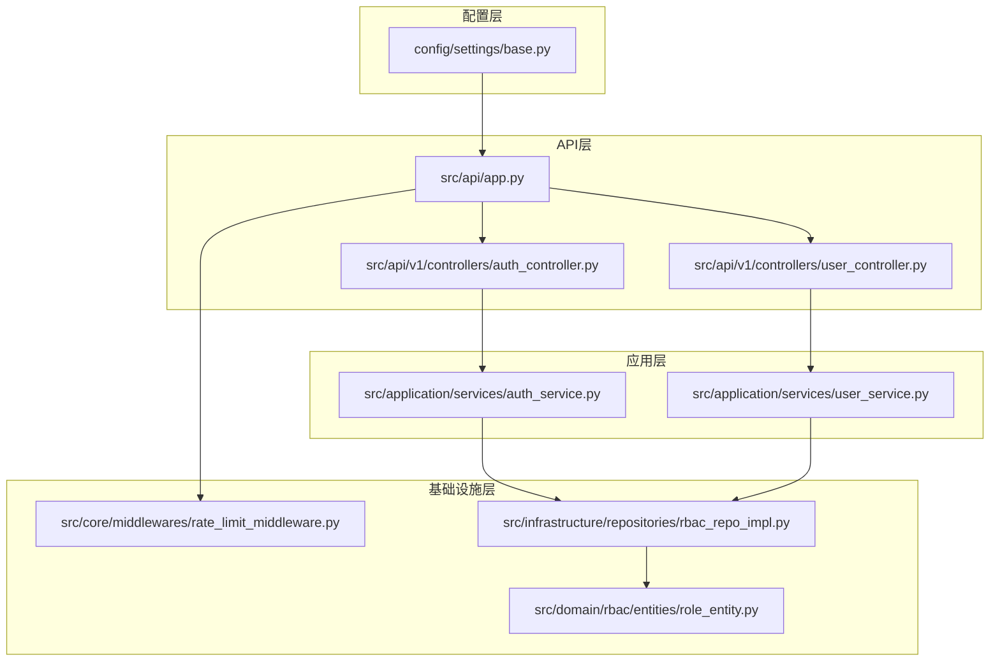
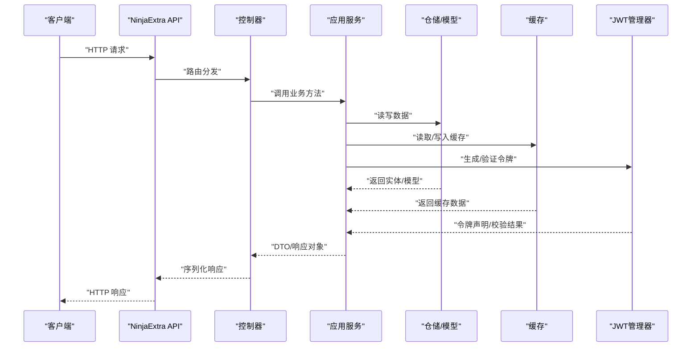
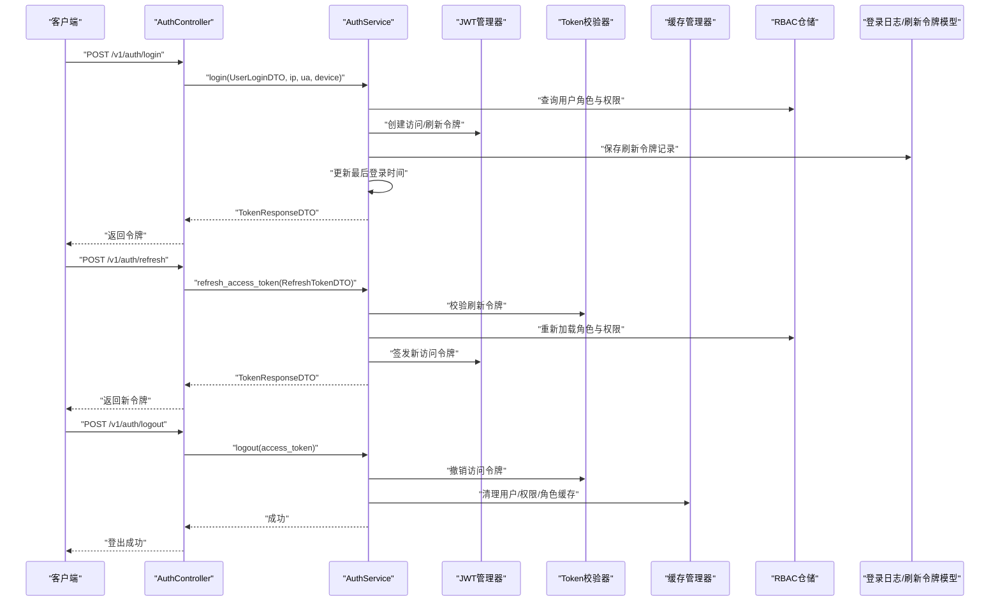
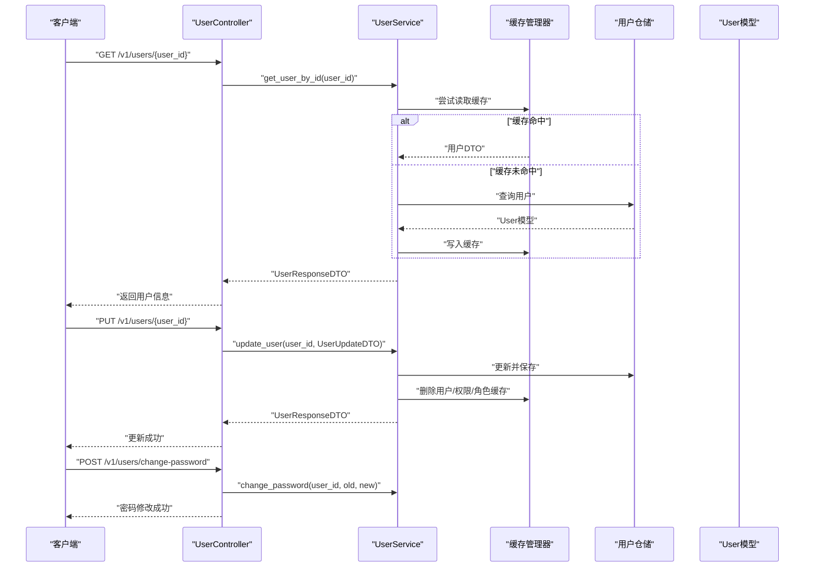
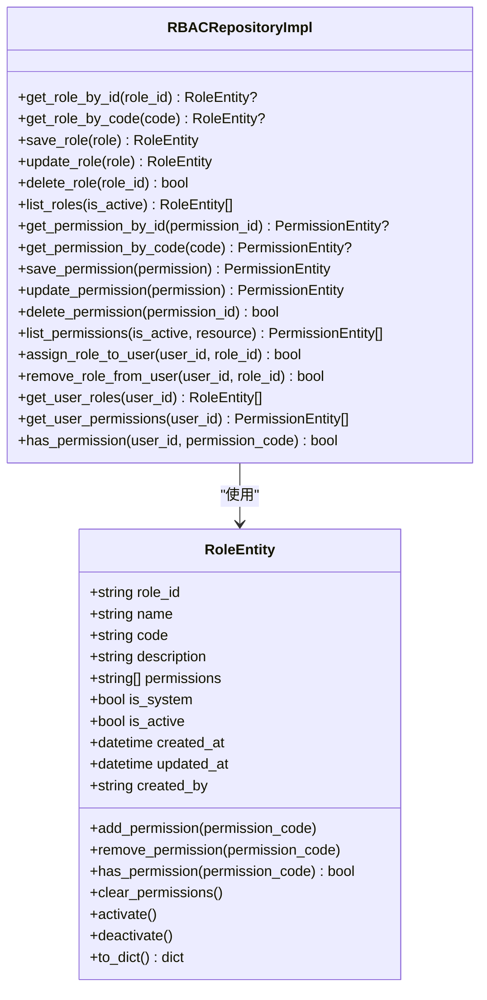
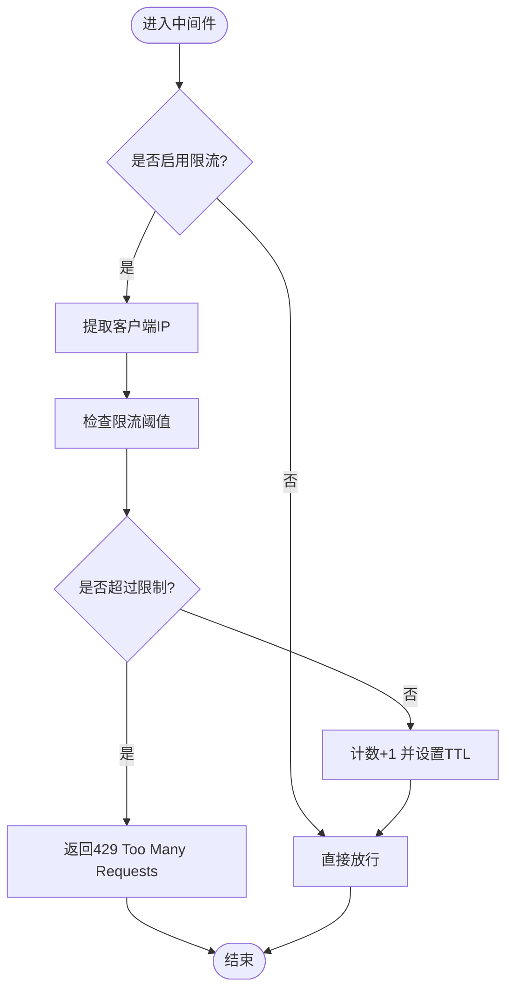
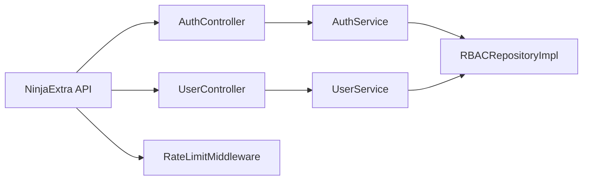

# 扩展和定制

<cite>
**本文引用的文件**
- [config/settings/base.py](file://config/settings/base.py)
- [src/api/app.py](file://src/api/app.py)
- [src/api/v1/controllers/auth_controller.py](file://src/api/v1/controllers/auth_controller.py)
- [src/api/v1/controllers/user_controller.py](file://src/api/v1/controllers/user_controller.py)
- [src/application/services/auth_service.py](file://src/application/services/auth_service.py)
- [src/application/services/user_service.py](file://src/application/services/user_service.py)
- [src/core/middlewares/rate_limit_middleware.py](file://src/core/middlewares/rate_limit_middleware.py)
- [src/core/middlewares/__init__.py](file://src/core/middlewares/__init__.py)
- [src/domain/rbac/entities/role_entity.py](file://src/domain/rbac/entities/role_entity.py)
- [src/infrastructure/repositories/rbac_repo_impl.py](file://src/infrastructure/repositories/rbac_repo_impl.py)
- [src/core/exceptions/authentication_error.py](file://src/core/exceptions/authentication_error.py)
- [skills/python-code-test/_meta.json](file://skills/python-code-test/_meta.json)
- [skills/python-script-generator/_meta.json](file://skills/python-script-generator/_meta.json)
</cite>

## 目录
1. [简介](#简介)
2. [项目结构](#项目结构)
3. [核心组件](#核心组件)
4. [架构总览](#架构总览)
5. [详细组件分析](#详细组件分析)
6. [依赖关系分析](#依赖关系分析)
7. [性能考量](#性能考量)
8. [故障排查指南](#故障排查指南)
9. [结论](#结论)
10. [附录](#附录)

## 简介
本指南面向希望对 Hello-Django-Ninja-Api 进行扩展与定制的高级开发者，围绕以下目标展开：
- 如何扩展现有功能模块：新增 API 端点、自定义业务逻辑、集成第三方服务
- 插件系统的开发方法与最佳实践
- 配置扩展：环境变量、功能开关、动态配置管理
- 认证机制、权限模型与安全策略的定制
- 主题与 UI 扩展、前端集成方法
- AI 技能包的开发与集成
- 面向高级用户的系统深度定制方案

## 项目结构
项目采用分层架构与领域驱动设计（DDD）思想，主要分为以下层次：
- 配置层：Django 设置与环境变量
- API 层：Ninja/NinjaExtra 控制器与路由注册
- 应用层：应用服务（业务编排）
- 领域层：实体与值对象
- 基础设施层：仓储、缓存、JWT、中间件等
- 测试与脚本：测试用例与部署/迁移脚本

图表来源
- [config/settings/base.py:1-235](file://config/settings/base.py#L1-L235)
- [src/api/app.py:1-48](file://src/api/app.py#L1-L48)
- [src/api/v1/controllers/auth_controller.py:1-133](file://src/api/v1/controllers/auth_controller.py#L1-L133)
- [src/api/v1/controllers/user_controller.py:1-283](file://src/api/v1/controllers/user_controller.py#L1-L283)
- [src/application/services/auth_service.py:1-233](file://src/application/services/auth_service.py#L1-L233)
- [src/application/services/user_service.py:1-193](file://src/application/services/user_service.py#L1-L193)
- [src/core/middlewares/rate_limit_middleware.py:1-112](file://src/core/middlewares/rate_limit_middleware.py#L1-L112)
- [src/infrastructure/repositories/rbac_repo_impl.py:1-251](file://src/infrastructure/repositories/rbac_repo_impl.py#L1-L251)
- [src/domain/rbac/entities/role_entity.py:1-80](file://src/domain/rbac/entities/role_entity.py#L1-L80)

章节来源
- [config/settings/base.py:1-235](file://config/settings/base.py#L1-L235)
- [src/api/app.py:1-48](file://src/api/app.py#L1-L48)

## 核心组件
- API 应用与路由注册：统一创建 NinjaExtra 实例并注册控制器，提供健康检查与根路径。
- 控制器层：认证控制器与用户控制器，负责请求解析、权限校验与调用应用服务。
- 应用服务层：封装业务逻辑，协调仓储与外部组件（如 JWT、缓存、日志）。
- 中间件层：限流中间件、安全中间件等，提供横切关注点。
- RBAC 仓储与实体：角色与权限的数据模型与业务实体，支撑细粒度权限控制。

章节来源
- [src/api/app.py:17-36](file://src/api/app.py#L17-L36)
- [src/api/v1/controllers/auth_controller.py:16-35](file://src/api/v1/controllers/auth_controller.py#L16-L35)
- [src/api/v1/controllers/user_controller.py:33-51](file://src/api/v1/controllers/user_controller.py#L33-L51)
- [src/application/services/auth_service.py:20-111](file://src/application/services/auth_service.py#L20-L111)
- [src/application/services/user_service.py:16-50](file://src/application/services/user_service.py#L16-L50)
- [src/core/middlewares/rate_limit_middleware.py:15-68](file://src/core/middlewares/rate_limit_middleware.py#L15-L68)
- [src/infrastructure/repositories/rbac_repo_impl.py:15-105](file://src/infrastructure/repositories/rbac_repo_impl.py#L15-L105)
- [src/domain/rbac/entities/role_entity.py:11-28](file://src/domain/rbac/entities/role_entity.py#L11-L28)

## 架构总览
系统遵循“控制器 → 应用服务 → 仓储/模型”的调用链，配合中间件与配置层实现安全与性能控制。

图表来源
- [src/api/app.py:17-36](file://src/api/app.py#L17-L36)
- [src/api/v1/controllers/auth_controller.py:42-78](file://src/api/v1/controllers/auth_controller.py#L42-L78)
- [src/application/services/auth_service.py:26-111](file://src/application/services/auth_service.py#L26-L111)
- [src/application/services/user_service.py:29-50](file://src/application/services/user_service.py#L29-L50)
- [src/infrastructure/repositories/rbac_repo_impl.py:23-76](file://src/infrastructure/repositories/rbac_repo_impl.py#L23-L76)

## 详细组件分析

### 认证流程（登录/刷新/登出）

图表来源
- [src/api/v1/controllers/auth_controller.py:36-105](file://src/api/v1/controllers/auth_controller.py#L36-L105)
- [src/application/services/auth_service.py:26-180](file://src/application/services/auth_service.py#L26-L180)
- [src/infrastructure/repositories/rbac_repo_impl.py:201-227](file://src/infrastructure/repositories/rbac_repo_impl.py#L201-L227)

章节来源
- [src/api/v1/controllers/auth_controller.py:36-132](file://src/api/v1/controllers/auth_controller.py#L36-L132)
- [src/application/services/auth_service.py:26-180](file://src/application/services/auth_service.py#L26-L180)

### 用户管理流程（CRUD/密码修改/当前用户）

图表来源
- [src/api/v1/controllers/user_controller.py:77-162](file://src/api/v1/controllers/user_controller.py#L77-L162)
- [src/application/services/user_service.py:52-130](file://src/application/services/user_service.py#L52-L130)

章节来源
- [src/api/v1/controllers/user_controller.py:77-260](file://src/api/v1/controllers/user_controller.py#L77-L260)
- [src/application/services/user_service.py:52-151](file://src/application/services/user_service.py#L52-L151)

### RBAC 权限模型与实体

图表来源
- [src/domain/rbac/entities/role_entity.py:11-80](file://src/domain/rbac/entities/role_entity.py#L11-L80)
- [src/infrastructure/repositories/rbac_repo_impl.py:15-246](file://src/infrastructure/repositories/rbac_repo_impl.py#L15-L246)

章节来源
- [src/domain/rbac/entities/role_entity.py:11-80](file://src/domain/rbac/entities/role_entity.py#L11-L80)
- [src/infrastructure/repositories/rbac_repo_impl.py:15-246](file://src/infrastructure/repositories/rbac_repo_impl.py#L15-L246)

### 限流中间件流程

图表来源
- [src/core/middlewares/rate_limit_middleware.py:41-111](file://src/core/middlewares/rate_limit_middleware.py#L41-L111)

章节来源
- [src/core/middlewares/rate_limit_middleware.py:15-112](file://src/core/middlewares/rate_limit_middleware.py#L15-L112)

## 依赖关系分析
- 控制器依赖应用服务；应用服务依赖仓储与基础设施组件（缓存、JWT、日志）。
- 中间件在请求生命周期中横切执行，受配置层的开关与参数影响。
- RBAC 仓储与实体构成权限控制的核心数据与业务逻辑。

图表来源
- [src/api/app.py:24-30](file://src/api/app.py#L24-L30)
- [src/api/v1/controllers/auth_controller.py:27-34](file://src/api/v1/controllers/auth_controller.py#L27-L34)
- [src/api/v1/controllers/user_controller.py:44-51](file://src/api/v1/controllers/user_controller.py#L44-L51)
- [src/application/services/auth_service.py:12-17](file://src/application/services/auth_service.py#L12-L17)
- [src/application/services/user_service.py:13-23](file://src/application/services/user_service.py#L13-L23)
- [src/core/middlewares/rate_limit_middleware.py:30-38](file://src/core/middlewares/rate_limit_middleware.py#L30-L38)

章节来源
- [src/api/app.py:24-30](file://src/api/app.py#L24-L30)
- [src/core/middlewares/__init__.py:6-16](file://src/core/middlewares/__init__.py#L6-L16)

## 性能考量
- 缓存策略：用户信息与权限/角色缓存减少数据库压力；登出与更新后及时清理缓存。
- 异步 ORM：使用 aget/asave/aexists 等异步接口提升 I/O 性能。
- 限流中间件：基于 Redis 缓存的简单计数器，建议结合更精细的限流算法与白名单策略。
- 数据库连接池：设置 CONN_MAX_AGE 提升连接复用效率。
- 日志分级：区分 info/error/console 输出，避免生产环境过度 IO。

章节来源
- [src/application/services/user_service.py:54-66](file://src/application/services/user_service.py#L54-L66)
- [src/application/services/auth_service.py:171-179](file://src/application/services/auth_service.py#L171-L179)
- [config/settings/base.py:77-88](file://config/settings/base.py#L77-L88)
- [config/settings/base.py:158-163](file://config/settings/base.py#L158-L163)

## 故障排查指南
- 认证失败：检查用户状态、密码校验、登录日志与刷新令牌保存。
- 权限不足：确认用户角色与权限集合、RBAC 查询逻辑与缓存一致性。
- 限流触发：核对限流开关、默认阈值与客户端 IP 提取逻辑。
- 异常处理：统一继承 BaseAPIError 的子类，确保错误码与消息一致。

章节来源
- [src/application/services/auth_service.py:36-56](file://src/application/services/auth_service.py#L36-L56)
- [src/infrastructure/repositories/rbac_repo_impl.py:201-246](file://src/infrastructure/repositories/rbac_repo_impl.py#L201-L246)
- [src/core/middlewares/rate_limit_middleware.py:51-66](file://src/core/middlewares/rate_limit_middleware.py#L51-L66)
- [src/core/exceptions/authentication_error.py:9-26](file://src/core/exceptions/authentication_error.py#L9-L26)

## 结论
本项目提供了清晰的分层架构与完善的认证、权限与安全基线。通过本文档的扩展与定制指南，开发者可以安全地新增 API、接入第三方服务、完善插件体系、优化配置与安全策略，并以 RBAC 为核心构建灵活的权限模型。

## 附录

### 扩展 API 端点与控制器
- 在控制器目录新增控制器类，使用装饰器声明路由与权限。
- 在应用服务中编写业务逻辑，必要时引入仓储与缓存。
- 在 API 应用中注册新控制器，确保路由生效。

章节来源
- [src/api/app.py:24-30](file://src/api/app.py#L24-L30)
- [src/api/v1/controllers/auth_controller.py:16-35](file://src/api/v1/controllers/auth_controller.py#L16-L35)
- [src/api/v1/controllers/user_controller.py:33-51](file://src/api/v1/controllers/user_controller.py#L33-L51)

### 插件系统开发与最佳实践
- 技能包元数据：参考现有技能包的元数据文件，规范版本与标识。
- 脚本与入口：为每个技能包提供可执行脚本与依赖清单。
- 集成方式：通过命令行或后台任务调度调用技能包脚本，输出标准化结果供上层消费。

章节来源
- [skills/python-code-test/_meta.json:1-6](file://skills/python-code-test/_meta.json#L1-L6)
- [skills/python-script-generator/_meta.json:1-6](file://skills/python-script-generator/_meta.json#L1-L6)

### 配置扩展（环境变量、功能开关、动态配置）
- 环境变量：通过环境变量覆盖默认设置，如数据库、Redis、JWT、限流与黑白名单。
- 功能开关：在配置层集中管理开关项，中间件与服务按开关行为分支。
- 动态配置：建议引入配置表与缓存，结合后台任务热更新。

章节来源
- [config/settings/base.py:16-173](file://config/settings/base.py#L16-L173)

### 认证机制、权限模型与安全策略定制
- 认证：扩展登录 DTO 与服务，支持多因子、第三方登录回调与审计日志。
- 权限：基于 RBAC 实体与仓储扩展资源/动作维度，支持动态授权。
- 安全：中间件组合（限流、IP 白黑名单、请求日志）与 CORS/JWT 安全参数。

章节来源
- [src/application/services/auth_service.py:26-180](file://src/application/services/auth_service.py#L26-L180)
- [src/infrastructure/repositories/rbac_repo_impl.py:201-246](file://src/infrastructure/repositories/rbac_repo_impl.py#L201-L246)
- [src/core/middlewares/rate_limit_middleware.py:15-68](file://src/core/middlewares/rate_limit_middleware.py#L15-L68)
- [config/settings/base.py:118-151](file://config/settings/base.py#L118-L151)

### 主题定制、UI 扩展与前端集成
- 后端保持纯 API 输出，前端通过独立仓库或静态站点集成。
- 通过文档端点（Swagger/Redoc）暴露接口，前端按需调用。
- 若需要模板渲染，可在配置层启用模板引擎并按 Django 规范组织视图。

章节来源
- [src/api/app.py:33-47](file://src/api/app.py#L33-L47)
- [config/settings/base.py:57-72](file://config/settings/base.py#L57-L72)

### AI 技能包开发与集成指南
- 设计技能包：明确输入/输出格式、依赖与执行边界。
- 编写脚本：提供可执行脚本与依赖清单，保证幂等与超时控制。
- 元数据规范：使用 JSON 描述技能包标识、版本与发布时间。
- 集成测试：在 CI 中加入技能包执行与输出校验。

章节来源
- [skills/python-code-test/_meta.json:1-6](file://skills/python-code-test/_meta.json#L1-L6)
- [skills/python-script-generator/_meta.json:1-6](file://skills/python-script-generator/_meta.json#L1-L6)

### 高级定制方案
- 中间件链：按需增删中间件，调整顺序以满足特定安全/性能需求。
- 仓储扩展：为新领域实体实现仓储接口，保持与现有查询模式一致。
- 缓存策略：针对热点数据制定缓存失效策略与降级方案。
- 监控与可观测性：结合日志、指标与追踪，完善告警与回溯能力。

章节来源
- [src/core/middlewares/__init__.py:6-16](file://src/core/middlewares/__init__.py#L6-L16)
- [src/infrastructure/repositories/rbac_repo_impl.py:15-246](file://src/infrastructure/repositories/rbac_repo_impl.py#L15-L246)
- [config/settings/base.py:174-226](file://config/settings/base.py#L174-L226)