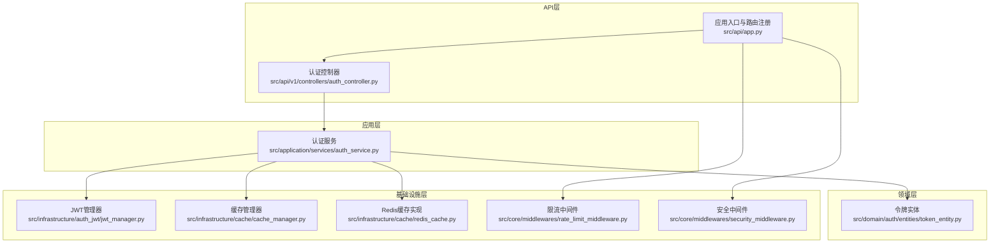
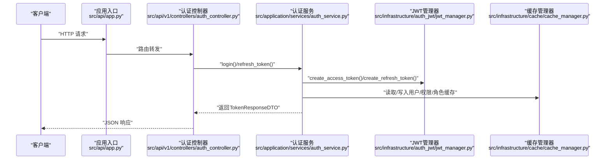
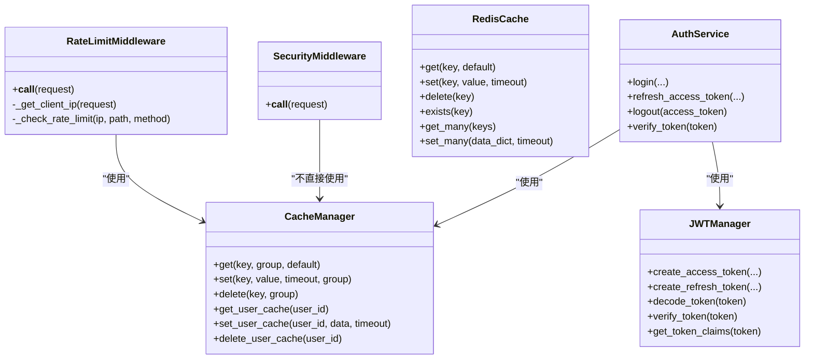
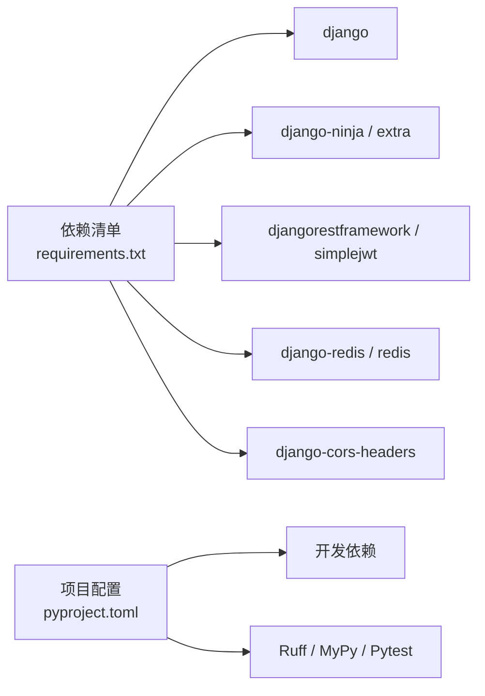

# 扩展开发指南

<cite>
**本文引用的文件**
- [开发指南](file://docs/DEVELOPMENT.md)
- [应用入口与路由注册](file://src/api/app.py)
- [基础设置](file://config/settings/base.py)
- [中间件导出](file://src/core/middlewares/__init__.py)
- [限流中间件](file://src/core/middlewares/rate_limit_middleware.py)
- [安全中间件](file://src/core/middlewares/security_middleware.py)
- [缓存管理器](file://src/infrastructure/cache/cache_manager.py)
- [Redis缓存实现](file://src/infrastructure/cache/redis_cache.py)
- [JWT管理器](file://src/infrastructure/auth_jwt/jwt_manager.py)
- [认证控制器](file://src/api/v1/controllers/auth_controller.py)
- [认证服务](file://src/application/services/auth_service.py)
- [令牌实体](file://src/domain/auth/entities/token_entity.py)
- [项目配置（pyproject.toml）](file://pyproject.toml)
- [依赖清单（requirements.txt）](file://requirements.txt)
- [代码规范检查脚本](file://scripts/lint.sh)
- [测试脚本](file://scripts/test.sh)
</cite>

## 目录
1. [简介](#简介)
2. [项目结构](#项目结构)
3. [核心组件](#核心组件)
4. [架构总览](#架构总览)
5. [详细组件分析](#详细组件分析)
6. [依赖关系分析](#依赖关系分析)
7. [性能考量](#性能考量)
8. [故障排查指南](#故障排查指南)
9. [结论](#结论)
10. [附录](#附录)

## 简介
本指南面向希望在现有 Django + Django-Ninja-Extra 项目基础上进行扩展开发的工程师，覆盖从需求分析、架构设计、代码实现到测试验证的全流程；重点阐述插件系统的扩展机制（自定义中间件、缓存策略、认证后端）、第三方集成最佳实践（外部 API、数据库、消息队列）、配置系统的扩展方法（新增配置项、校验、热更新），以及代码规范、贡献流程、调试与排错、模板与示例、向后兼容与破坏性变更处理。

## 项目结构
项目采用分层架构与领域驱动设计（DDD）风格，主要分为四层：
- API 层：负责对外暴露 REST 接口，使用 NinjaExtra 控制器组织路由。
- 应用层：封装业务服务，协调领域与基础设施。
- 领域层：承载核心业务实体与服务，保持与技术细节解耦。
- 基础设施层：提供缓存、持久化、认证、限流、IP 管理等技术能力。

图表来源
- [应用入口与路由注册:1-48](file://src/api/app.py#L1-L48)
- [认证控制器:1-133](file://src/api/v1/controllers/auth_controller.py#L1-L133)
- [认证服务:1-233](file://src/application/services/auth_service.py#L1-L233)
- [JWT管理器:1-147](file://src/infrastructure/auth_jwt/jwt_manager.py#L1-L147)
- [缓存管理器:1-149](file://src/infrastructure/cache/cache_manager.py#L1-L149)
- [Redis缓存实现:1-169](file://src/infrastructure/cache/redis_cache.py#L1-L169)
- [令牌实体:1-105](file://src/domain/auth/entities/token_entity.py#L1-L105)
- [限流中间件:1-112](file://src/core/middlewares/rate_limit_middleware.py#L1-L112)
- [安全中间件:1-54](file://src/core/middlewares/security_middleware.py#L1-L54)

章节来源
- [开发指南:115-163](file://docs/DEVELOPMENT.md#L115-L163)
- [应用入口与路由注册:1-48](file://src/api/app.py#L1-L48)

## 核心组件
- 应用入口与路由注册：集中创建 API 实例并注册控制器，提供健康检查与根路径。
- 中间件体系：统一导出限流、安全等中间件，便于在设置中启用/禁用与调整顺序。
- 缓存体系：提供统一缓存管理器与 Redis 缓存封装，支持分组键空间与常用读写方法。
- 认证体系：基于 JWT 的访问/刷新令牌生成与验证，配合令牌黑名单与登录日志。
- 配置系统：通过 Django settings 与环境变量组合，支持多环境与运行时开关。

章节来源
- [应用入口与路由注册:1-48](file://src/api/app.py#L1-L48)
- [中间件导出:1-17](file://src/core/middlewares/__init__.py#L1-L17)
- [缓存管理器:1-149](file://src/infrastructure/cache/cache_manager.py#L1-L149)
- [Redis缓存实现:1-169](file://src/infrastructure/cache/redis_cache.py#L1-L169)
- [JWT管理器:1-147](file://src/infrastructure/auth_jwt/jwt_manager.py#L1-L147)
- [基础设置:1-235](file://config/settings/base.py#L1-L235)

## 架构总览
下图展示扩展开发的关键交互路径：控制器调用应用服务，应用服务协调领域与基础设施，基础设施通过中间件、缓存、认证等能力支撑业务。

图表来源
- [应用入口与路由注册:1-48](file://src/api/app.py#L1-L48)
- [认证控制器:1-133](file://src/api/v1/controllers/auth_controller.py#L1-L133)
- [认证服务:1-233](file://src/application/services/auth_service.py#L1-L233)
- [JWT管理器:1-147](file://src/infrastructure/auth_jwt/jwt_manager.py#L1-L147)
- [缓存管理器:1-149](file://src/infrastructure/cache/cache_manager.py#L1-L149)

## 详细组件分析

### 插件系统与扩展机制
- 自定义中间件开发
  - 在 core/middlewares 下新增中间件类，遵循 Django 中间件模式（__call__ 处理请求/响应）。
  - 在中间件导出模块中统一导出，以便在基础设置中按需启用。
  - 在基础设置中将新中间件加入 MIDDLEWARE 列表，并控制执行顺序。
  - 示例参考：限流中间件与安全中间件的实现与配置方式。
  
  章节来源
  - [限流中间件:1-112](file://src/core/middlewares/rate_limit_middleware.py#L1-L112)
  - [安全中间件:1-54](file://src/core/middlewares/security_middleware.py#L1-L54)
  - [中间件导出:1-17](file://src/core/middlewares/__init__.py#L1-L17)
  - [基础设置:39-52](file://config/settings/base.py#L39-L52)

- 缓存策略扩展
  - 使用缓存管理器提供的分组键空间与便捷方法，避免键冲突与重复序列化。
  - 如需 Redis 特性（如原子递增、批量操作），可直接使用 Redis 缓存封装。
  - 对于复杂对象，统一走 JSON 序列化，保证跨进程/跨服务一致性。
  
  章节来源
  - [缓存管理器:1-149](file://src/infrastructure/cache/cache_manager.py#L1-L149)
  - [Redis缓存实现:1-169](file://src/infrastructure/cache/redis_cache.py#L1-L169)

- 认证后端扩展
  - JWT 管理器提供令牌生成、验证、载荷提取等能力，可按需扩展额外声明字段。
  - 认证服务通过依赖注入与 DTO 解耦，便于替换底层认证实现。
  - 令牌实体定义了令牌与黑名单的核心属性，可作为扩展点增加审计字段。
  
  章节来源
  - [JWT管理器:1-147](file://src/infrastructure/auth_jwt/jwt_manager.py#L1-L147)
  - [认证服务:1-233](file://src/application/services/auth_service.py#L1-L233)
  - [令牌实体:1-105](file://src/domain/auth/entities/token_entity.py#L1-L105)

图表来源
- [限流中间件:1-112](file://src/core/middlewares/rate_limit_middleware.py#L1-L112)
- [安全中间件:1-54](file://src/core/middlewares/security_middleware.py#L1-L54)
- [缓存管理器:1-149](file://src/infrastructure/cache/cache_manager.py#L1-L149)
- [Redis缓存实现:1-169](file://src/infrastructure/cache/redis_cache.py#L1-L169)
- [JWT管理器:1-147](file://src/infrastructure/auth_jwt/jwt_manager.py#L1-L147)
- [认证服务:1-233](file://src/application/services/auth_service.py#L1-L233)

### 第三方集成最佳实践
- 外部 API 集成
  - 使用异步/同步适配器封装外部调用，统一异常处理与重试策略。
  - 在应用服务中以依赖注入方式接入，便于替换与测试。
- 数据库扩展
  - 通过 Django ORM 与迁移系统管理结构演进，新增模型与仓储实现。
  - 保持模型与 DTO 的边界清晰，避免跨层直接依赖。
- 消息队列集成
  - 使用任务队列（如 Celery）异步处理耗时任务，避免阻塞请求链路。
  - 在基础设施层提供消息适配器，统一序列化与反序列化。

[本节为概念性指导，无需列出章节来源]

### 配置系统的扩展方法
- 新增配置项
  - 在基础设置中定义默认值与类型约束，优先从环境变量读取。
  - 对敏感配置使用 python-decouple 或 python-dotenv 管理。
- 配置验证
  - 在应用启动前进行关键配置校验（如数据库连接、缓存可用性）。
- 配置热更新
  - 对于运行时可变配置（如限流规则、白名单开关），通过缓存或内存状态持有。
  - 对于不可变配置（如数据库引擎、认证算法），建议重启生效。

章节来源
- [基础设置:1-235](file://config/settings/base.py#L1-L235)
- [项目配置（pyproject.toml）:1-131](file://pyproject.toml#L1-L131)
- [依赖清单（requirements.txt）:1-38](file://requirements.txt#L1-L38)

### 代码规范与最佳实践
- 命名约定
  - 模块与类使用帕斯卡命名，函数与变量使用下划线命名。
  - DTO、实体、服务、仓储等职责明确，避免混用。
- 代码结构
  - 严格分层：API 控制器只做参数绑定与响应包装；应用服务编排业务；领域与基础设施各司其职。
  - 依赖注入：通过构造函数注入服务与仓储，提升可测试性。
- 注释标准
  - 函数/方法提供简明摘要、参数说明、返回值与异常说明。
  - 关键流程与边界条件补充注释，便于维护。

章节来源
- [开发指南:68-113](file://docs/DEVELOPMENT.md#L68-L113)
- [认证控制器:1-133](file://src/api/v1/controllers/auth_controller.py#L1-L133)
- [认证服务:1-233](file://src/application/services/auth_service.py#L1-L233)

### 贡献流程与代码审查
- 分支策略
  - 主分支保护，特性开发在 feature/* 分支，修复在 hotfix/* 分支。
- 提交规范
  - 使用清晰的提交信息描述变更目的与影响范围。
- 代码审查
  - 覆盖率达标，遵循统一的代码风格与静态检查。
- 开发工具
  - 使用 Ruff 格式化与检查，MyPy 类型检查，Pytest 测试与覆盖率报告。

章节来源
- [开发指南:221-227](file://docs/DEVELOPMENT.md#L221-L227)
- [代码规范检查脚本:1-23](file://scripts/lint.sh#L1-L23)
- [测试脚本:1-14](file://scripts/test.sh#L1-L14)
- [项目配置（pyproject.toml）:92-131](file://pyproject.toml#L92-L131)

### 调试与问题排查
- 日志配置
  - 通过 Django LOGGING 配置输出到文件与控制台，区分不同级别与模块。
- 常见问题
  - 数据库迁移失败：清理迁移文件后重新生成。
  - Redis 连接失败：确认服务状态与连接字符串。
  - 端口被占用：修改 runserver 端口。
- 性能诊断
  - 使用缓存命中率与慢查询日志定位瓶颈。
  - 结合限流与安全中间件观察异常流量。

章节来源
- [基础设置:174-226](file://config/settings/base.py#L174-L226)
- [开发指南:188-219](file://docs/DEVELOPMENT.md#L188-L219)

### 扩展开发模板与示例
- 新增中间件模板
  - 在 core/middlewares 下新建文件，实现 __call__ 方法，必要时读取配置与使用缓存。
  - 在中间件导出模块中注册，并在基础设置中启用。
- 新增缓存键模板
  - 使用缓存管理器的分组前缀与生成键方法，避免冲突。
- 新增认证流程模板
  - 在 API 层新增控制器方法，在应用服务中编排业务逻辑，必要时扩展 DTO 与实体。

章节来源
- [中间件导出:1-17](file://src/core/middlewares/__init__.py#L1-L17)
- [缓存管理器:1-149](file://src/infrastructure/cache/cache_manager.py#L1-L149)
- [认证控制器:1-133](file://src/api/v1/controllers/auth_controller.py#L1-L133)
- [认证服务:1-233](file://src/application/services/auth_service.py#L1-L233)

### 向后兼容性与破坏性变更
- 向后兼容
  - API 层通过版本化路由（如 v1）隔离变更，旧版本保持稳定。
  - DTO 字段新增可选，避免强制迁移。
- 破坏性变更
  - 明确标注版本号与迁移步骤，提供兼容层与降级策略。
  - 在配置系统中引入开关，逐步灰度发布。

章节来源
- [应用入口与路由注册:1-48](file://src/api/app.py#L1-L48)
- [项目配置（pyproject.toml）:1-131](file://pyproject.toml#L1-L131)

## 依赖关系分析

图表来源
- [依赖清单（requirements.txt）:1-38](file://requirements.txt#L1-L38)
- [项目配置（pyproject.toml）:1-131](file://pyproject.toml#L1-L131)

章节来源
- [依赖清单（requirements.txt）:1-38](file://requirements.txt#L1-L38)
- [项目配置（pyproject.toml）:1-131](file://pyproject.toml#L1-L131)

## 性能考量
- 缓存策略
  - 合理设置过期时间与分组键空间，避免热点键竞争。
  - 对高频读取的数据（用户信息、权限/角色）启用缓存。
- 中间件开销
  - 限流与安全中间件应尽量轻量化，避免阻塞主请求链路。
- 数据库与 ORM
  - 使用 select_related/ prefetch_related 降低 N+1 查询。
  - 对写密集场景使用批量插入与事务优化。

[本节提供一般性指导，无需列出章节来源]

## 故障排查指南
- 本地开发
  - 使用开发脚本一键运行检查与测试，快速发现规范与缺陷。
- 配置问题
  - 检查环境变量与 Django settings 的合并顺序，确认默认值与覆盖关系。
- 中间件异常
  - 临时关闭可疑中间件定位问题，逐步恢复启用以精确定位。
- 缓存异常
  - 检查 Redis 连接与键空间前缀，确认序列化/反序列化一致性。

章节来源
- [代码规范检查脚本:1-23](file://scripts/lint.sh#L1-L23)
- [测试脚本:1-14](file://scripts/test.sh#L1-L14)
- [基础设置:153-163](file://config/settings/base.py#L153-L163)

## 结论
通过明确的分层架构与可扩展的中间件、缓存、认证体系，本项目为二次开发提供了清晰的扩展点。遵循本文的流程与规范，可在保证向后兼容与质量的前提下高效迭代新功能，并平滑集成第三方能力。

## 附录
- 快速开始与工具链参见开发指南中的环境准备、命令与脚本说明。
- API 文档地址：Swagger UI 与 ReDoc，便于联调与验证。

章节来源
- [开发指南:1-227](file://docs/DEVELOPMENT.md#L1-L227)