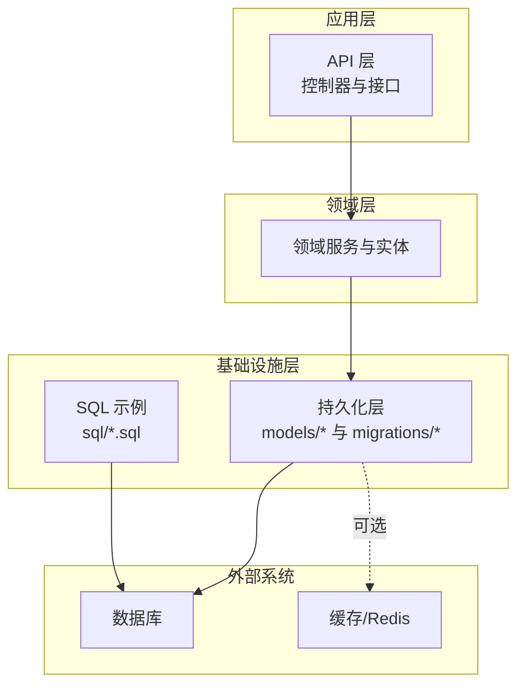
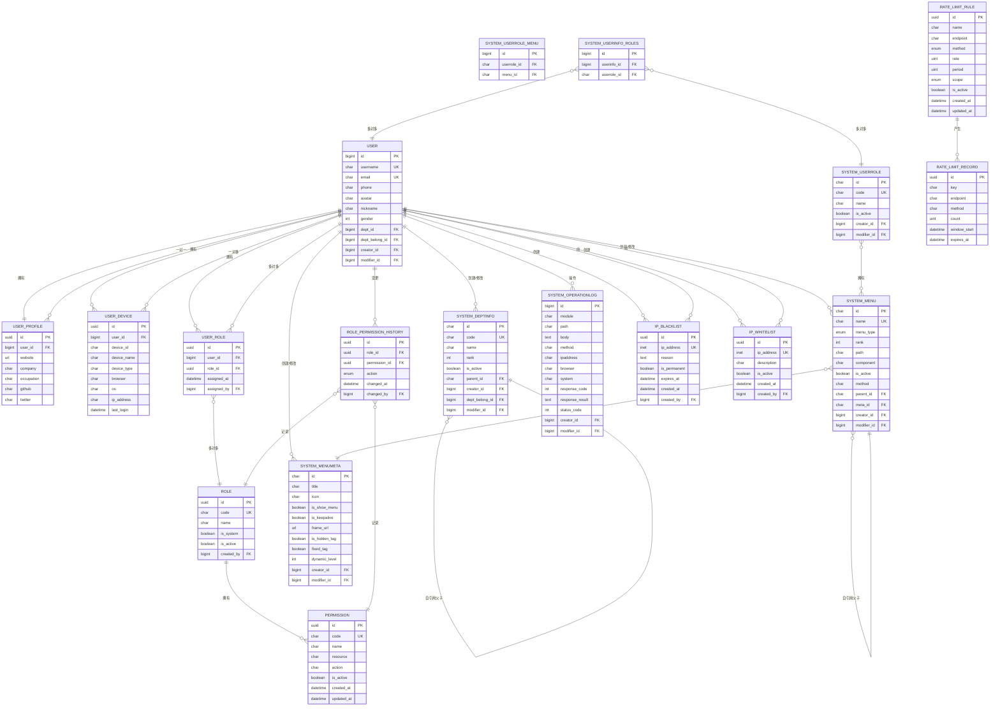
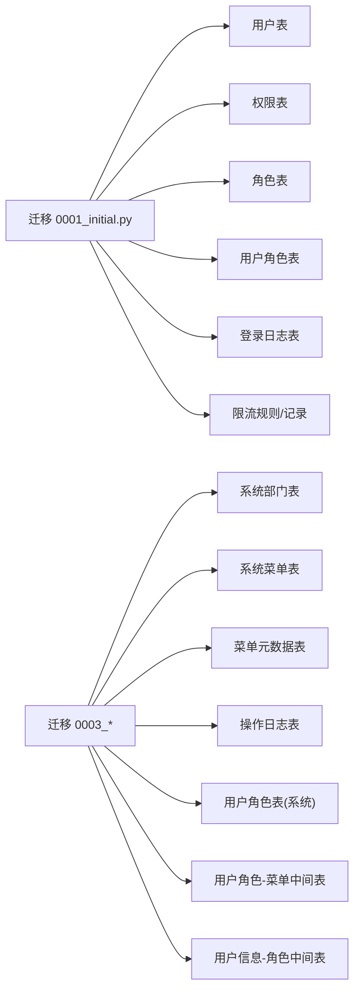

# 数据库设计

<cite>
**本文引用的文件**
- [rbac_models.py](file://src/infrastructure/persistence/models/rbac_models.py)
- [user_models.py](file://src/infrastructure/persistence/models/user_models.py)
- [system_models.py](file://src/infrastructure/persistence/models/system_models.py)
- [security_models.py](file://src/infrastructure/persistence/models/security_models.py)
- [0001_initial.py](file://src/infrastructure/persistence/migrations/0001_initial.py)
- [0002_auto_20260314_0921.py](file://src/infrastructure/persistence/migrations/0002_auto_20260314_0921.py)
- [0003_systemdeptinfo_systemmenu_systemmenumeta_and_more.py](file://src/infrastructure/persistence/migrations/0003_systemdeptinfo_systemmenu_systemmenumeta_and_more.py)
- [rbac.sql](file://sql/rbac.sql)
- [migrate_database.py](file://scripts/migrate_database.py)
</cite>

## 目录
1. [简介](#简介)
2. [项目结构](#项目结构)
3. [核心组件](#核心组件)
4. [架构总览](#架构总览)
5. [详细组件分析](#详细组件分析)
6. [依赖分析](#依赖分析)
7. [性能考虑](#性能考虑)
8. [故障排查指南](#故障排查指南)
9. [结论](#结论)
10. [附录](#附录)

## 简介
本文件面向数据库管理员与开发者，系统化梳理 Hello-Django-Ninja-Api 项目的数据库设计与实现。内容涵盖：
- 数据模型定义、字段语义与约束
- ER 关系图与表关系图
- 迁移策略与版本管理
- 索引设计、查询优化与性能建议
- 数据验证规则、业务规则与完整性约束
- 初始化脚本与示例数据
- 备份、恢复与监控策略

## 项目结构
项目采用分层与按功能域划分的组织方式，数据库相关代码集中在基础设施层的持久化模块中，迁移文件位于 migrations 目录，SQL 示例位于 sql 目录。

图表来源
- [rbac_models.py:1-148](file://src/infrastructure/persistence/models/rbac_models.py#L1-L148)
- [user_models.py:1-147](file://src/infrastructure/persistence/models/user_models.py#L1-L147)
- [system_models.py:1-395](file://src/infrastructure/persistence/models/system_models.py#L1-L395)
- [security_models.py:1-162](file://src/infrastructure/persistence/models/security_models.py#L1-L162)
- [0001_initial.py:1-973](file://src/infrastructure/persistence/migrations/0001_initial.py#L1-L973)
- [rbac.sql:1-232](file://sql/rbac.sql#L1-L232)

章节来源
- [rbac_models.py:1-148](file://src/infrastructure/persistence/models/rbac_models.py#L1-L148)
- [user_models.py:1-147](file://src/infrastructure/persistence/models/user_models.py#L1-L147)
- [system_models.py:1-395](file://src/infrastructure/persistence/models/system_models.py#L1-L395)
- [security_models.py:1-162](file://src/infrastructure/persistence/models/security_models.py#L1-L162)
- [0001_initial.py:1-973](file://src/infrastructure/persistence/migrations/0001_initial.py#L1-L973)
- [rbac.sql:1-232](file://sql/rbac.sql#L1-L232)

## 核心组件
本项目数据库围绕“用户、角色、权限、菜单、部门、安全”六大主题域构建，采用 Django ORM 的模型定义与迁移机制进行版本化演进。

- 用户域：用户基本信息、档案、设备、登录日志
- RBAC 域：权限、角色、用户角色关联、角色权限历史
- 系统域：部门、菜单与菜单元数据、操作日志、用户角色与菜单关联
- 安全域：IP 黑/白名单、速率限制规则与记录

章节来源
- [user_models.py:12-147](file://src/infrastructure/persistence/models/user_models.py#L12-L147)
- [rbac_models.py:13-148](file://src/infrastructure/persistence/models/rbac_models.py#L13-L148)
- [system_models.py:12-395](file://src/infrastructure/persistence/models/system_models.py#L12-L395)
- [security_models.py:13-162](file://src/infrastructure/persistence/models/security_models.py#L13-L162)

## 架构总览
下图展示核心实体及其关系，包括一对一、一对多、多对多与自引用父子关系。

图表来源
- [user_models.py:12-147](file://src/infrastructure/persistence/models/user_models.py#L12-L147)
- [rbac_models.py:13-148](file://src/infrastructure/persistence/models/rbac_models.py#L13-L148)
- [system_models.py:12-395](file://src/infrastructure/persistence/models/system_models.py#L12-L395)
- [security_models.py:13-162](file://src/infrastructure/persistence/models/security_models.py#L13-L162)
- [0001_initial.py:1-973](file://src/infrastructure/persistence/migrations/0001_initial.py#L1-L973)
- [0003_systemdeptinfo_systemmenu_systemmenumeta_and_more.py:1-880](file://src/infrastructure/persistence/migrations/0003_systemdeptinfo_systemmenu_systemmenumeta_and_more.py#L1-L880)

## 详细组件分析

### 用户与档案、设备
- 用户模型扩展 Django 内置用户，新增部门、创建者/修改者、基础个人信息等字段；并定义了基于 username/email/phone 的索引以提升查询效率。
- 用户档案为一对一扩展信息；用户设备记录登录设备与 IP，避免重复设备绑定。

章节来源
- [user_models.py:12-147](file://src/infrastructure/persistence/models/user_models.py#L12-L147)
- [0001_initial.py:1-973](file://src/infrastructure/persistence/migrations/0001_initial.py#L1-L973)

### RBAC 权限与角色
- 权限模型包含资源类型与操作类型组合，便于细粒度授权；提供唯一索引与复合索引。
- 角色模型支持系统角色标记与激活状态；通过多对多关联权限。
- 用户角色关联表实现用户与角色的多对多映射，并记录分配时间与分配者。
- 角色权限历史记录角色权限的增删变更，便于审计追踪。

章节来源
- [rbac_models.py:13-148](file://src/infrastructure/persistence/models/rbac_models.py#L13-L148)
- [0001_initial.py:1-973](file://src/infrastructure/persistence/migrations/0001_initial.py#L1-L973)

### 系统部门、菜单与操作日志
- 部门模型支持树形结构（自引用父子），具备排序、激活、自动绑定等属性。
- 菜单模型与菜单元数据模型分离，菜单包含类型、路径、组件、方法等；菜单元数据包含显示配置。
- 操作日志模型记录请求路径、方法、响应状态、客户端信息等，便于审计与排障。
- 用户角色与菜单的多对多关系通过中间表维护，支持角色权限矩阵。

章节来源
- [system_models.py:12-395](file://src/infrastructure/persistence/models/system_models.py#L12-L395)
- [0003_systemdeptinfo_systemmenu_systemmenumeta_and_more.py:1-880](file://src/infrastructure/persistence/migrations/0003_systemdeptinfo_systemmenu_systemmenumeta_and_more.py#L1-L880)

### 安全模型（IP 黑/白名单、限流）
- IP 黑/白名单模型分别记录封禁与放行的 IP，支持永久封禁与到期判断。
- 限流规则与记录模型定义限流策略与实际计数窗口，支持按 IP/用户/全局维度限流。

章节来源
- [security_models.py:13-162](file://src/infrastructure/persistence/models/security_models.py#L13-L162)
- [0001_initial.py:1-973](file://src/infrastructure/persistence/migrations/0001_initial.py#L1-L973)

### 登录日志与刷新令牌
- 登录日志模型记录登录尝试、设备与失败原因等信息。
- 刷新令牌模型用于 JWT 刷新流程，支持撤销与过期控制。

章节来源
- [0001_initial.py:1-973](file://src/infrastructure/persistence/migrations/0001_initial.py#L1-L973)

## 依赖分析
- 模型间依赖：用户与部门、菜单与菜单元数据、角色与权限、用户角色与菜单等均通过外键关联。
- 自引用关系：部门与菜单均支持父子层级，形成树形结构。
- 中间表：用户角色、角色权限历史、用户角色菜单等中间表承担多对多关系与审计职责。
- 迁移演进：初始迁移包含用户、权限、角色、登录日志、限流等核心表；后续迁移补充系统部门、菜单、操作日志等表，并调整字段与索引。

图表来源
- [0001_initial.py:1-973](file://src/infrastructure/persistence/migrations/0001_initial.py#L1-L973)
- [0003_systemdeptinfo_systemmenu_systemmenumeta_and_more.py:1-880](file://src/infrastructure/persistence/migrations/0003_systemdeptinfo_systemmenu_systemmenumeta_and_more.py#L1-L880)

章节来源
- [0001_initial.py:1-973](file://src/infrastructure/persistence/migrations/0001_initial.py#L1-L973)
- [0002_auto_20260314_0921.py:1-13](file://src/infrastructure/persistence/migrations/0002_auto_20260314_0921.py#L1-L13)
- [0003_systemdeptinfo_systemmenu_systemmenumeta_and_more.py:1-880](file://src/infrastructure/persistence/migrations/0003_systemdeptinfo_systemmenu_systemmenumeta_and_more.py#L1-L880)

## 性能考虑
- 索引设计
  - 用户：username、email、phone 唯一性与查询索引
  - 权限：code、resource 复合索引
  - 角色：code 唯一索引
  - 菜单：name、parent 索引
  - 部门：code、parent 索引
  - 操作日志：creator、module、created_time 索引
  - 限流：key+endpoint+method 复合索引
- 查询优化建议
  - 使用 select_related/ prefetch_related 减少 N+1 查询
  - 对高频过滤字段（如用户、角色、菜单）建立合适索引
  - 控制返回字段长度，避免 SELECT *
  - 对大表分页查询时使用覆盖索引
- 缓存策略
  - 将热点菜单树、角色权限集合放入缓存，结合失效策略
  - 限流规则与白名单可缓存于内存，定期同步
- 数据量增长
  - 操作日志按月/季归档清理
  - 登录日志定期清理过期记录

## 故障排查指南
- 迁移失败
  - 检查依赖顺序与冲突，确保迁移顺序正确
  - 核对数据库权限与连接配置
- 字段缺失或类型不匹配
  - 对照迁移文件逐项核对字段定义
  - 使用数据库对比工具比对实际表结构
- 权限不足
  - 确认用户角色与菜单/权限映射正确
  - 检查角色权限历史是否遗漏
- 性能问题
  - 分析慢查询日志，确认索引使用情况
  - 对高频查询建立复合索引
- 安全事件
  - 核对 IP 黑/白名单生效状态
  - 检查限流规则与记录是否命中

章节来源
- [migrate_database.py:1-147](file://scripts/migrate_database.py#L1-L147)
- [0001_initial.py:1-973](file://src/infrastructure/persistence/migrations/0001_initial.py#L1-L973)

## 结论
本项目数据库设计遵循 RBAC 与系统管理需求，通过清晰的模型分层与完善的迁移机制，支撑用户、角色、权限、菜单、部门与安全能力。建议在生产环境中配合缓存、索引优化与定期归档策略，持续保障性能与稳定性。

## 附录

### 数据库迁移策略与版本管理
- 迁移生成与应用
  - 使用 Django 的 makemigrations 与 migrate 命令生成并应用迁移
  - 初始迁移包含用户、权限、角色、登录日志、限流等核心表
  - 后续迁移补充系统部门、菜单、操作日志等表，并调整字段与索引
- 版本回滚
  - 建议在测试环境充分验证后再执行生产迁移
  - 如需回滚，使用 migrate <迁移名> 或 migrate zero 回退到指定版本
- 迁移脚本
  - 提供一键迁移与初始化脚本，自动创建迁移、应用迁移、创建超级管理员并清理临时文件

章节来源
- [0001_initial.py:1-973](file://src/infrastructure/persistence/migrations/0001_initial.py#L1-L973)
- [0002_auto_20260314_0921.py:1-13](file://src/infrastructure/persistence/migrations/0002_auto_20260314_0921.py#L1-L13)
- [0003_systemdeptinfo_systemmenu_systemmenumeta_and_more.py:1-880](file://src/infrastructure/persistence/migrations/0003_systemdeptinfo_systemmenu_systemmenumeta_and_more.py#L1-L880)
- [migrate_database.py:1-147](file://scripts/migrate_database.py#L1-L147)

### 索引设计与查询优化要点
- 用户：username、email、phone 唯一性与查询索引
- 权限：code、resource 复合索引
- 角色：code 唯一索引
- 菜单：name、parent 索引
- 部门：code、parent 索引
- 操作日志：creator、module、created_time 索引
- 限流：key+endpoint+method 复合索引

章节来源
- [user_models.py:76-80](file://src/infrastructure/persistence/models/user_models.py#L76-L80)
- [rbac_models.py:34-37](file://src/infrastructure/persistence/models/rbac_models.py#L34-L37)
- [system_models.py:204-207](file://src/infrastructure/persistence/models/system_models.py#L204-L207)
- [system_models.py:65-73](file://src/infrastructure/persistence/models/system_models.py#L65-L73)
- [system_models.py:263-267](file://src/infrastructure/persistence/models/system_models.py#L263-L267)
- [security_models.py:156-158](file://src/infrastructure/persistence/models/security_models.py#L156-L158)

### 数据验证规则与业务规则
- 唯一性约束：用户名、邮箱、手机号、权限 code、角色 code、菜单 name、部门 code、IP 地址等
- 外键约束：部门与菜单的自引用父子关系、用户与部门/角色/菜单的关联
- 激活状态：角色、权限、部门、菜单、用户角色、白名单等支持激活/停用
- 审计字段：创建时间、更新时间、创建者、修改者贯穿多数实体
- 限流规则：endpoint+method 唯一，支持通配符“*”

章节来源
- [user_models.py:18-70](file://src/infrastructure/persistence/models/user_models.py#L18-L70)
- [rbac_models.py:19-76](file://src/infrastructure/persistence/models/rbac_models.py#L19-L76)
- [system_models.py:24-63](file://src/infrastructure/persistence/models/system_models.py#L24-L63)
- [system_models.py:157-197](file://src/infrastructure/persistence/models/system_models.py#L157-L197)
- [security_models.py:19-70](file://src/infrastructure/persistence/models/security_models.py#L19-L70)

### 数据库初始化脚本与示例数据
- 初始化脚本
  - 自动创建迁移、应用迁移、创建超级管理员账户、清理临时文件
  - 支持通过环境变量配置管理员账号与密码
- 示例数据
  - 初始迁移包含用户、权限、角色、登录日志、限流等表结构
  - SQL 示例文件包含部门、菜单、操作日志等表结构与索引定义

章节来源
- [migrate_database.py:1-147](file://scripts/migrate_database.py#L1-L147)
- [0001_initial.py:1-973](file://src/infrastructure/persistence/migrations/0001_initial.py#L1-L973)
- [rbac.sql:1-232](file://sql/rbac.sql#L1-L232)

### 备份、恢复与监控策略
- 备份
  - 生产环境建议每日全量备份+增量备份
  - SQLite 文件可直接复制；MySQL/PG 建议使用官方工具导出
- 恢复
  - 在隔离环境验证备份可用性
  - 使用迁移脚本恢复结构，再导入数据
- 监控
  - 监控数据库连接数、慢查询、锁等待
  - 关注操作日志与登录日志异常波动
  - 定期检查索引使用率与碎片

[本节为通用实践建议，无需特定文件引用]