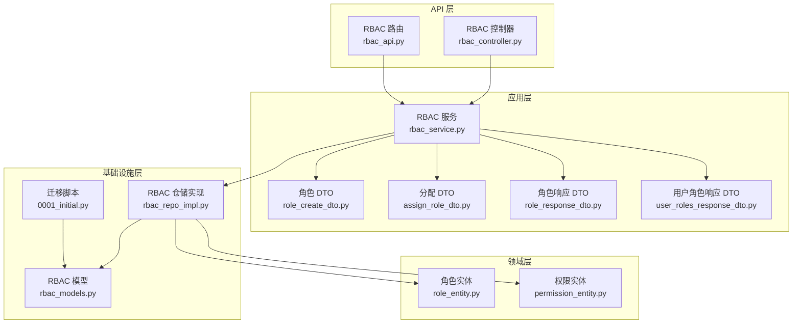
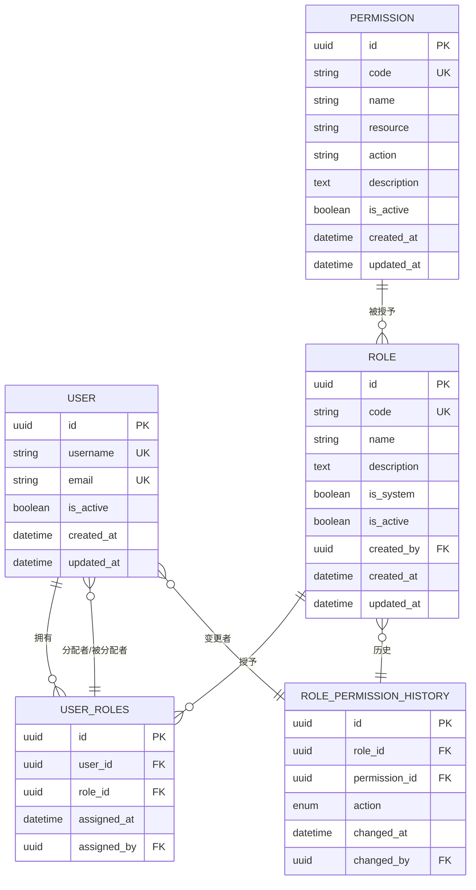
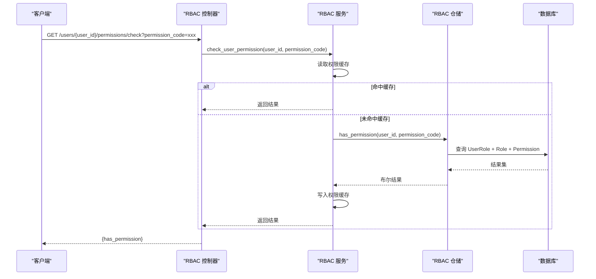
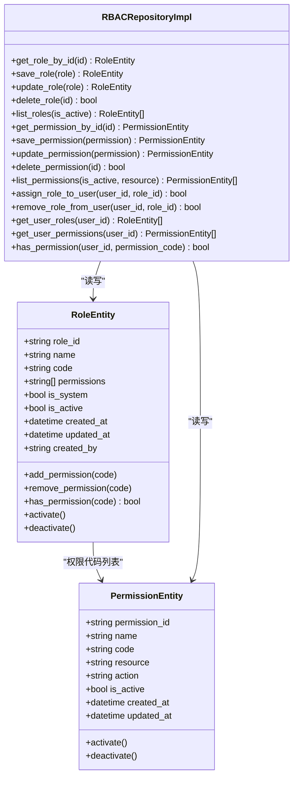
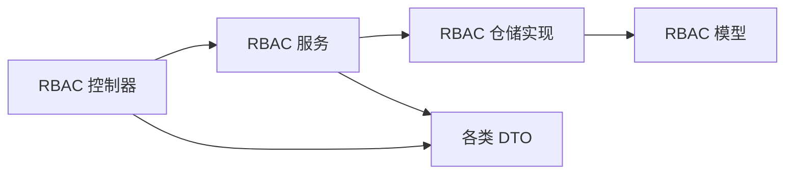

# RBAC 权限数据模型

<cite>
**本文档引用的文件**
- [rbac_models.py](file://src/infrastructure/persistence/models/rbac_models.py)
- [role_entity.py](file://src/domain/rbac/entities/role_entity.py)
- [permission_entity.py](file://src/domain/rbac/entities/permission_entity.py)
- [rbac_repo_impl.py](file://src/infrastructure/repositories/rbac_repo_impl.py)
- [rbac_domain_service.py](file://src/domain/rbac/services/rbac_domain_service.py)
- [rbac_service.py](file://src/application/services/rbac_service.py)
- [rbac_controller.py](file://src/api/v1/controllers/rbac_controller.py)
- [rbac_api.py](file://src/api/v1/rbac_api.py)
- [role_create_dto.py](file://src/application/dto/rbac/role_create_dto.py)
- [assign_role_dto.py](file://src/application/dto/rbac/assign_role_dto.py)
- [role_response_dto.py](file://src/application/dto/rbac/role_response_dto.py)
- [user_roles_response_dto.py](file://src/application/dto/rbac/user_roles_response_dto.py)
- [test_rbac_models.py](file://tests/test_models/test_rbac_models.py)
- [0001_initial.py](file://src/infrastructure/persistence/migrations/0001_initial.py)
- [rbac.sql](file://sql/rbac.sql)
</cite>

## 目录
1. [简介](#简介)
2. [项目结构](#项目结构)
3. [核心组件](#核心组件)
4. [架构总览](#架构总览)
5. [详细组件分析](#详细组件分析)
6. [依赖关系分析](#依赖关系分析)
7. [性能考量](#性能考量)
8. [故障排查指南](#故障排查指南)
9. [结论](#结论)
10. [附录：使用示例](#附录使用示例)

## 简介
本文件系统化梳理了基于 Django Ninja 的 RBAC 权限数据模型，覆盖角色（Role）、权限（Permission）、用户角色关联（UserRole）及权限继承机制的数据结构设计、数据库实现、查询路径与性能优化策略。文档同时给出权限验证的数据库层面实现原理、ER 关系图、以及权限分配与角色管理的实践示例。

## 项目结构
围绕 RBAC 的代码按分层组织：
- 领域层：角色与权限实体定义，封装业务语义与校验
- 应用层：服务编排与 DTO 映射，负责业务流程与外部接口交互
- 基础设施层：ORM 模型、仓储实现、迁移脚本与缓存策略
- API 层：控制器与路由，暴露 REST 接口

图表来源
- [rbac_controller.py:38-351](file://src/api/v1/controllers/rbac_controller.py#L38-L351)
- [rbac_api.py:19-184](file://src/api/v1/rbac_api.py#L19-L184)
- [rbac_service.py:22-286](file://src/application/services/rbac_service.py#L22-L286)
- [rbac_repo_impl.py:15-253](file://src/infrastructure/repositories/rbac_repo_impl.py#L15-L253)
- [rbac_models.py:13-148](file://src/infrastructure/persistence/models/rbac_models.py#L13-L148)
- [role_entity.py:11-80](file://src/domain/rbac/entities/role_entity.py#L11-L80)
- [permission_entity.py:11-85](file://src/domain/rbac/entities/permission_entity.py#L11-L85)
- [0001_initial.py:345-716](file://src/infrastructure/persistence/migrations/0001_initial.py#L345-L716)

章节来源
- [rbac_controller.py:38-351](file://src/api/v1/controllers/rbac_controller.py#L38-L351)
- [rbac_api.py:19-184](file://src/api/v1/rbac_api.py#L19-L184)
- [rbac_service.py:22-286](file://src/application/services/rbac_service.py#L22-L286)
- [rbac_repo_impl.py:15-253](file://src/infrastructure/repositories/rbac_repo_impl.py#L15-L253)
- [rbac_models.py:13-148](file://src/infrastructure/persistence/models/rbac_models.py#L13-L148)
- [role_entity.py:11-80](file://src/domain/rbac/entities/role_entity.py#L11-L80)
- [permission_entity.py:11-85](file://src/domain/rbac/entities/permission_entity.py#L11-L85)
- [0001_initial.py:345-716](file://src/infrastructure/persistence/migrations/0001_initial.py#L345-L716)

## 核心组件
- 角色模型（Role）
  - 字段与约束：UUID 主键、唯一角色代码（带索引）、角色名称、描述、系统角色标记、激活状态、创建者外键、权限多对多关联、时间戳
  - 设计要点：通过多对多关系维护角色-权限映射；支持系统角色标记与激活控制
- 权限模型（Permission）
  - 字段与约束：UUID 主键、唯一权限代码（带索引）、权限名称、资源类型（带索引）、操作类型、描述、激活状态、时间戳
  - 设计要点：资源类型与操作类型可从代码自动解析，便于统一治理
- 用户角色关联（UserRole）
  - 字段与约束：UUID 主键、用户外键、角色外键、唯一约束（user, role）、分配时间、分配者外键、索引
  - 设计要点：实现用户与角色的多对多关系，支持分配者追踪与去重

章节来源
- [rbac_models.py:13-114](file://src/infrastructure/persistence/models/rbac_models.py#L13-L114)
- [0001_initial.py:345-716](file://src/infrastructure/persistence/migrations/0001_initial.py#L345-L716)

## 架构总览
下图展示 RBAC 数据模型的 ER 关系与关键索引：

图表来源
- [rbac_models.py:13-148](file://src/infrastructure/persistence/models/rbac_models.py#L13-L148)
- [0001_initial.py:345-716](file://src/infrastructure/persistence/migrations/0001_initial.py#L345-L716)
- [rbac.sql:196-231](file://sql/rbac.sql#L196-L231)

## 详细组件分析

### 角色模型（Role）设计
- 字段说明
  - code：角色代码，唯一且带索引，便于快速查找
  - name：角色名称
  - permissions：多对多关联到权限集合
  - is_system：系统角色标记，不可删除/修改
  - is_active：激活状态，影响权限验证
  - created_by：创建者外键，支持审计
- 约束与索引
  - 唯一约束：code
  - 索引：code（db_index）
  - 排序：按创建时间倒序
- 业务行为
  - 支持增删改查、批量权限赋权与去权
  - 系统角色不可修改或删除

章节来源
- [rbac_models.py:43-77](file://src/infrastructure/persistence/models/rbac_models.py#L43-L77)
- [0001_initial.py:588-656](file://src/infrastructure/persistence/migrations/0001_initial.py#L588-L656)

### 权限模型（Permission）设计
- 字段说明
  - code：权限代码，唯一且带索引；建议采用“资源:动作”格式
  - resource、action：资源类型与操作类型，支持按资源维度筛选
  - name：权限名称
  - is_active：激活状态
- 约束与索引
  - 唯一约束：code
  - 索引：resource、code
- 实体解析
  - 权限实体可在初始化时从 code 解析 resource 与 action，便于统一治理

章节来源
- [rbac_models.py:13-41](file://src/infrastructure/persistence/models/rbac_models.py#L13-L41)
- [permission_entity.py:11-85](file://src/domain/rbac/entities/permission_entity.py#L11-L85)
- [0001_initial.py:345-398](file://src/infrastructure/persistence/migrations/0001_initial.py#L345-L398)

### 用户角色关联（UserRole）设计
- 字段说明
  - user、role：多对多关系的连接表
  - assigned_at：分配时间
  - assigned_by：分配者
- 约束与索引
  - 唯一约束：(user, role)，防止重复分配
  - 索引：user、role
- 业务行为
  - 提供分配、移除、查询用户角色与权限的能力
  - 查询用户权限时会级联获取用户角色及其权限集合

章节来源
- [rbac_models.py:79-114](file://src/infrastructure/persistence/models/rbac_models.py#L79-L114)
- [rbac_repo_impl.py:186-205](file://src/infrastructure/repositories/rbac_repo_impl.py#L186-L205)
- [0001_initial.py:768-800](file://src/infrastructure/persistence/migrations/0001_initial.py#L768-L800)

### 权限继承机制的数据模型体现
- 当前模型未直接体现“父子权限”的层次关系
- 继承可通过以下方式在数据层面表达：
  - 在权限实体中增加父权限外键，形成权限树
  - 或在角色-权限映射中引入权重/层级字段，配合查询时进行聚合判断
- 若采用前者，需在迁移中新增字段并建立索引；若采用后者，则在查询侧通过聚合逻辑实现

章节来源
- [rbac_models.py:13-114](file://src/infrastructure/persistence/models/rbac_models.py#L13-L114)
- [rbac_repo_impl.py:206-248](file://src/infrastructure/repositories/rbac_repo_impl.py#L206-L248)

### 权限验证的数据库层面实现原理
- 用户权限获取路径
  - 通过 UserRole 连接查询用户的角色集合
  - 对每个角色，获取其激活的权限集合
  - 合并去重后返回权限代码列表
- 查询优化
  - 使用 select_related + prefetch_related 减少 N+1 查询
  - 利用索引加速 code、resource、user、role 等常用过滤字段
- 缓存策略
  - 应用服务层在首次查询后将用户权限写入缓存，后续直接命中
  - 变更角色/权限时清理对应用户缓存，保证一致性

图表来源
- [rbac_controller.py:321-350](file://src/api/v1/controllers/rbac_controller.py#L321-L350)
- [rbac_service.py:233-251](file://src/application/services/rbac_service.py#L233-L251)
- [rbac_repo_impl.py:230-248](file://src/infrastructure/repositories/rbac_repo_impl.py#L230-L248)

章节来源
- [rbac_controller.py:321-350](file://src/api/v1/controllers/rbac_controller.py#L321-L350)
- [rbac_service.py:233-251](file://src/application/services/rbac_service.py#L233-L251)
- [rbac_repo_impl.py:230-248](file://src/infrastructure/repositories/rbac_repo_impl.py#L230-L248)

### 类与实体关系图

图表来源
- [role_entity.py:11-80](file://src/domain/rbac/entities/role_entity.py#L11-L80)
- [permission_entity.py:11-85](file://src/domain/rbac/entities/permission_entity.py#L11-L85)
- [rbac_repo_impl.py:15-253](file://src/infrastructure/repositories/rbac_repo_impl.py#L15-L253)

章节来源
- [role_entity.py:11-80](file://src/domain/rbac/entities/role_entity.py#L11-L80)
- [permission_entity.py:11-85](file://src/domain/rbac/entities/permission_entity.py#L11-L85)
- [rbac_repo_impl.py:15-253](file://src/infrastructure/repositories/rbac_repo_impl.py#L15-L253)

## 依赖关系分析
- 控制器层依赖应用服务层，应用服务层依赖仓储接口与实体模型
- 仓储实现依赖 ORM 模型与用户模型，提供数据库操作
- DTO 作为接口契约，贯穿 API 层与应用层

图表来源
- [rbac_controller.py:38-351](file://src/api/v1/controllers/rbac_controller.py#L38-L351)
- [rbac_service.py:22-286](file://src/application/services/rbac_service.py#L22-L286)
- [rbac_repo_impl.py:15-253](file://src/infrastructure/repositories/rbac_repo_impl.py#L15-L253)
- [rbac_models.py:13-148](file://src/infrastructure/persistence/models/rbac_models.py#L13-L148)

章节来源
- [rbac_controller.py:38-351](file://src/api/v1/controllers/rbac_controller.py#L38-L351)
- [rbac_service.py:22-286](file://src/application/services/rbac_service.py#L22-L286)
- [rbac_repo_impl.py:15-253](file://src/infrastructure/repositories/rbac_repo_impl.py#L15-L253)
- [rbac_models.py:13-148](file://src/infrastructure/persistence/models/rbac_models.py#L13-L148)

## 性能考量
- 索引设计
  - 权限：code（唯一+索引）、resource（索引）
  - 角色：code（唯一+索引）
  - 用户角色：user、role（联合/单列索引），user+role 唯一约束
- 查询优化
  - 使用 select_related + prefetch_related 避免 N+1 查询
  - 按资源类型过滤权限时利用 resource 索引
- 缓存策略
  - 用户权限缓存：首次查询后写入缓存，变更角色/权限时清理
  - 缓存键：基于用户 ID，值为权限代码集合
- 批量操作
  - 角色权限赋权使用 filter(code__in=...) + aset(...)，减少多次往返

章节来源
- [rbac_models.py:34-37](file://src/infrastructure/persistence/models/rbac_models.py#L34-L37)
- [rbac_repo_impl.py:206-248](file://src/infrastructure/repositories/rbac_repo_impl.py#L206-L248)
- [rbac_service.py:233-251](file://src/application/services/rbac_service.py#L233-L251)
- [0001_initial.py:393-397](file://src/infrastructure/persistence/migrations/0001_initial.py#L393-L397)

## 故障排查指南
- 角色/权限唯一性冲突
  - 现象：创建角色或权限时报唯一约束错误
  - 排查：确认 code 是否重复；检查迁移是否正确生成唯一索引
- 角色停用导致权限不可用
  - 现象：用户无法获得预期权限
  - 排查：确认角色 is_active 状态；查询 UserRole + Role + Permission 链路
- 用户无角色或权限
  - 现象：has_permission 返回 false
  - 排查：确认 UserRole 是否存在；确认角色与权限均处于激活状态；检查缓存是否陈旧
- 分配角色重复
  - 现象：分配时报错或无效果
  - 排查：确认 user+role 唯一约束是否生效；检查分配逻辑

章节来源
- [test_rbac_models.py:33-38](file://tests/test_models/test_rbac_models.py#L33-L38)
- [rbac_repo_impl.py:230-248](file://src/infrastructure/repositories/rbac_repo_impl.py#L230-L248)
- [rbac_service.py:171-205](file://src/application/services/rbac_service.py#L171-L205)

## 结论
该 RBAC 数据模型以清晰的三元组（用户-角色-权限）为核心，结合多对多关系与唯一约束，实现了灵活而稳定的权限管理体系。通过合理的索引与缓存策略，能够在高并发场景下保持良好的查询性能。当前模型未直接建模“父子权限”继承，但可通过扩展权限实体或在查询侧聚合实现继承语义。

## 附录：使用示例

### 示例一：创建系统权限
- 步骤
  - 调用初始化接口创建系统预定义权限
  - 校验返回列表包含所需权限代码
- 接口
  - GET /v1/rbac/permissions/init
- 说明
  - 服务层会遍历系统权限清单，若不存在则创建

章节来源
- [rbac_controller.py:224-235](file://src/api/v1/controllers/rbac_controller.py#L224-L235)
- [rbac_service.py:152-167](file://src/application/services/rbac_service.py#L152-L167)
- [permission_entity.py:64-85](file://src/domain/rbac/entities/permission_entity.py#L64-L85)

### 示例二：创建角色并分配权限
- 步骤
  - POST /v1/rbac/roles：传入 name、code、permissions
  - 校验返回角色包含对应权限代码
- 接口
  - POST /v1/rbac/roles
- DTO
  - RoleCreateDTO：包含 name、code、description、permissions

章节来源
- [rbac_controller.py:60-82](file://src/api/v1/controllers/rbac_controller.py#L60-L82)
- [rbac_service.py:33-56](file://src/application/services/rbac_service.py#L33-L56)
- [role_create_dto.py:9-29](file://src/application/dto/rbac/role_create_dto.py#L9-L29)

### 示例三：为用户分配角色
- 步骤
  - POST /v1/rbac/users/{user_id}/roles：传入 user_id、role_id
  - 校验返回成功消息
- 接口
  - POST /v1/rbac/users/{user_id}/roles
- DTO
  - AssignRoleDTO：包含 user_id、role_id

章节来源
- [rbac_controller.py:239-267](file://src/api/v1/controllers/rbac_controller.py#L239-L267)
- [rbac_service.py:171-205](file://src/application/services/rbac_service.py#L171-L205)
- [assign_role_dto.py:9-21](file://src/application/dto/rbac/assign_role_dto.py#L9-L21)

### 示例四：检查用户权限
- 步骤
  - GET /v1/rbac/users/{user_id}/permissions/check?permission_code=xxx
  - 校验返回 has_permission 字段
- 接口
  - GET /v1/rbac/users/{user_id}/permissions/check

章节来源
- [rbac_controller.py:321-350](file://src/api/v1/controllers/rbac_controller.py#L321-L350)
- [rbac_service.py:233-251](file://src/application/services/rbac_service.py#L233-L251)