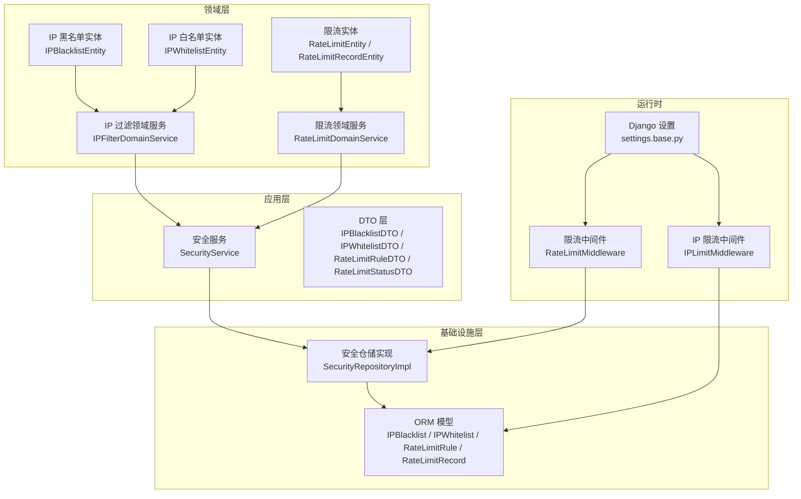
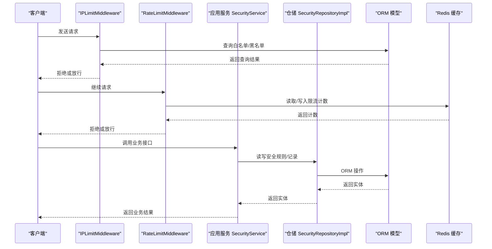
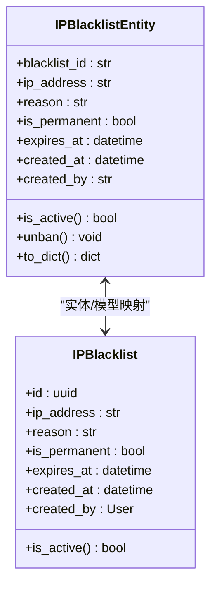
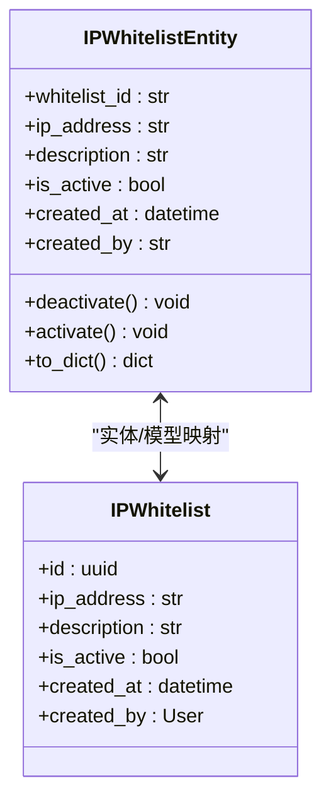
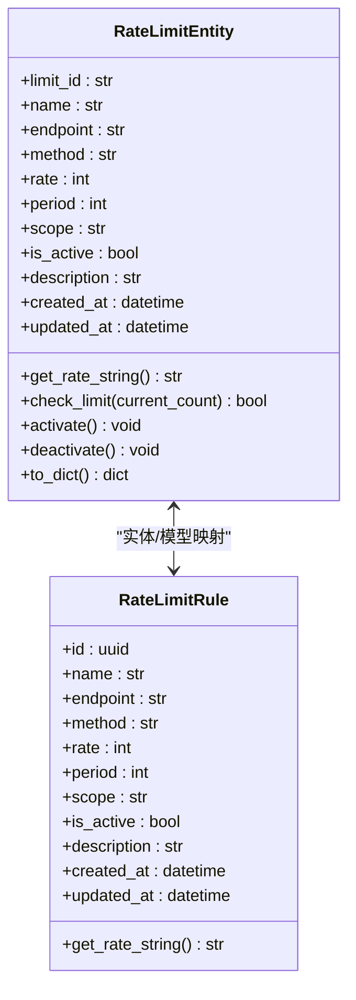
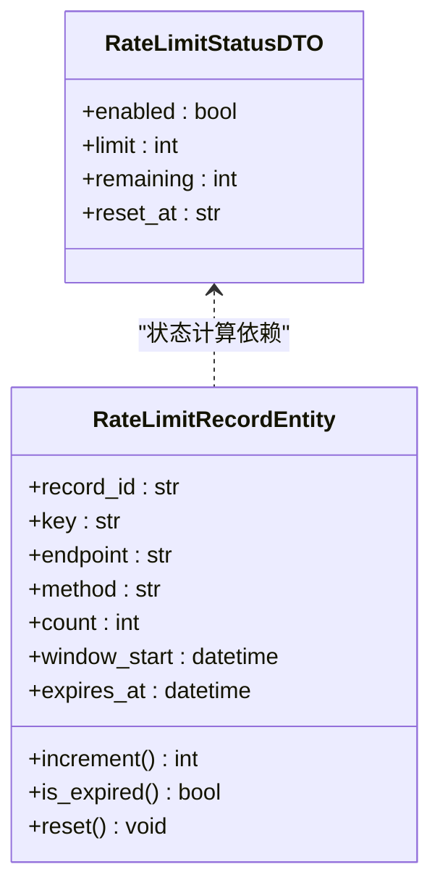
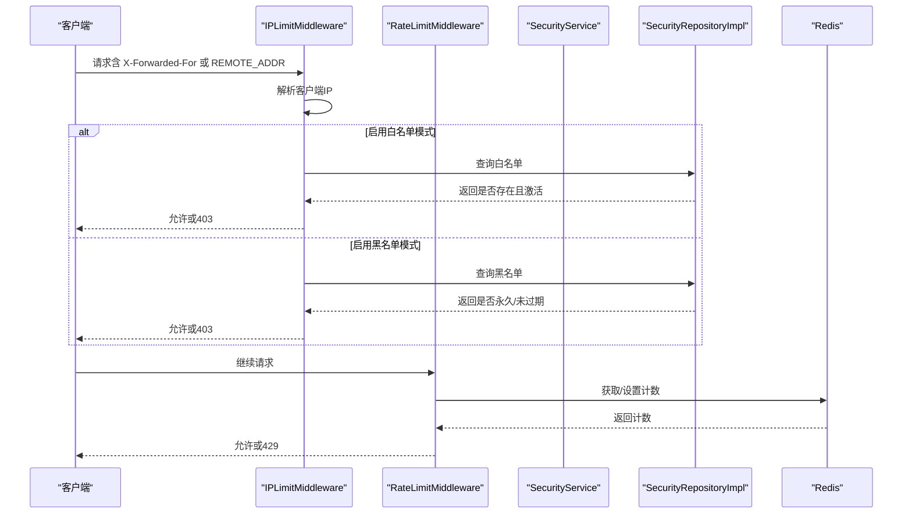
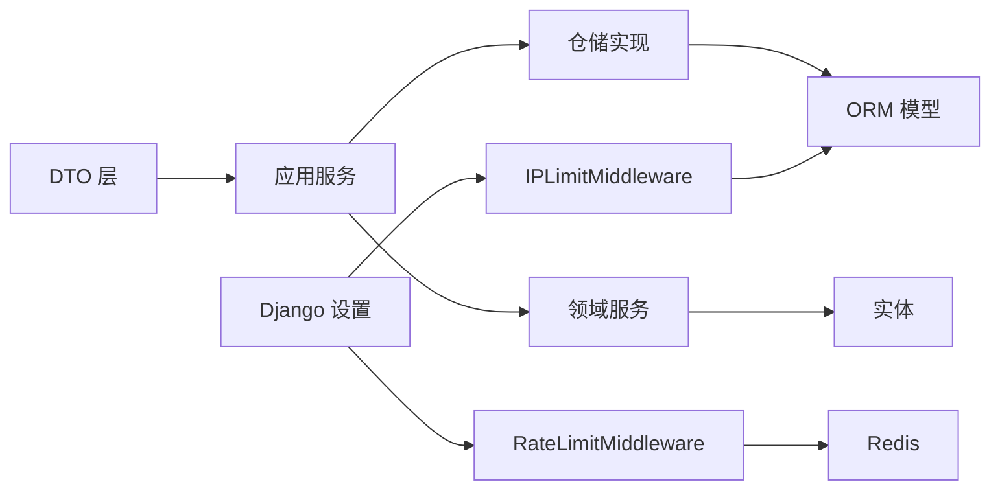

# 安全防护数据模型

<cite>
**本文档引用的文件**
- [src/domain/security/entities/ip_blacklist_entity.py](file://src/domain/security/entities/ip_blacklist_entity.py)
- [src/domain/security/entities/ip_whitelist_entity.py](file://src/domain/security/entities/ip_whitelist_entity.py)
- [src/domain/security/entities/rate_limit_entity.py](file://src/domain/security/entities/rate_limit_entity.py)
- [src/infrastructure/persistence/models/security_models.py](file://src/infrastructure/persistence/models/security_models.py)
- [src/application/dto/security/ip_blacklist_dto.py](file://src/application/dto/security/ip_blacklist_dto.py)
- [src/application/dto/security/ip_whitelist_dto.py](file://src/application/dto/security/ip_whitelist_dto.py)
- [src/application/dto/security/rate_limit_rule_dto.py](file://src/application/dto/security/rate_limit_rule_dto.py)
- [src/application/dto/security/rate_limit_status_dto.py](file://src/application/dto/security/rate_limit_status_dto.py)
- [src/application/services/security_service.py](file://src/application/services/security_service.py)
- [src/infrastructure/repositories/security_repo_impl.py](file://src/infrastructure/repositories/security_repo_impl.py)
- [src/domain/security/services/ip_filter_service.py](file://src/domain/security/services/ip_filter_service.py)
- [src/domain/security/services/rate_limit_service.py](file://src/domain/security/services/rate_limit_service.py)
- [src/core/middlewares/ip_limit_middleware.py](file://src/core/middlewares/ip_limit_middleware.py)
- [src/core/middlewares/rate_limit_middleware.py](file://src/core/middlewares/rate_limit_middleware.py)
- [config/settings/base.py](file://config/settings/base.py)
</cite>

## 目录
1. [简介](#简介)
2. [项目结构](#项目结构)
3. [核心组件](#核心组件)
4. [架构总览](#架构总览)
5. [详细组件分析](#详细组件分析)
6. [依赖关系分析](#依赖关系分析)
7. [性能考量](#性能考量)
8. [故障排查指南](#故障排查指南)
9. [结论](#结论)
10. [附录](#附录)

## 简介
本文件系统化梳理项目中的安全防护数据模型与实现，覆盖以下主题：
- IP 黑名单模型（SecurityIpBlacklist）：字段设计、封禁原因、封禁时间、状态管理与校验
- IP 白名单模型（SecurityIpWhitelist）：白名单机制、允许的 IP 范围、优先级设置、有效期管理
- 限流规则模型（SecurityRateLimitRule）：限流键、请求次数、时间窗口、策略类型与范围
- 限流状态模型（SecurityRateLimitStatus）：实时状态跟踪、当前计数、重置时间、用户标识
- 整体架构：IP 管理、限流控制、安全监控的协作关系
- 数据库实现原理、性能优化与并发控制
- 安全配置、IP 管理、限流规则的实际使用示例与最佳实践

## 项目结构
围绕安全防护的数据模型与实现，代码按“领域层-应用层-基础设施层”的分层组织，配合中间件与配置实现运行时的安全控制。

图表来源
- [src/domain/security/entities/ip_blacklist_entity.py:11-53](file://src/domain/security/entities/ip_blacklist_entity.py#L11-L53)
- [src/domain/security/entities/ip_whitelist_entity.py:11-47](file://src/domain/security/entities/ip_whitelist_entity.py#L11-L47)
- [src/domain/security/entities/rate_limit_entity.py:11-106](file://src/domain/security/entities/rate_limit_entity.py#L11-L106)
- [src/domain/security/services/ip_filter_service.py:12-149](file://src/domain/security/services/ip_filter_service.py#L12-L149)
- [src/domain/security/services/rate_limit_service.py:11-126](file://src/domain/security/services/rate_limit_service.py#L11-L126)
- [src/application/services/security_service.py:24-225](file://src/application/services/security_service.py#L24-L225)
- [src/infrastructure/repositories/security_repo_impl.py:21-260](file://src/infrastructure/repositories/security_repo_impl.py#L21-L260)
- [src/infrastructure/persistence/models/security_models.py:13-162](file://src/infrastructure/persistence/models/security_models.py#L13-L162)
- [src/core/middlewares/ip_limit_middleware.py:15-130](file://src/core/middlewares/ip_limit_middleware.py#L15-L130)
- [src/core/middlewares/rate_limit_middleware.py:15-112](file://src/core/middlewares/rate_limit_middleware.py#L15-L112)
- [config/settings/base.py:40-52](file://config/settings/base.py#L40-L52)

章节来源
- [config/settings/base.py:40-52](file://config/settings/base.py#L40-L52)
- [src/infrastructure/persistence/models/security_models.py:13-162](file://src/infrastructure/persistence/models/security_models.py#L13-L162)

## 核心组件
本节聚焦四大核心数据模型及其职责边界与关键字段。

- IP 黑名单实体（IPBlacklistEntity）
  - 关键字段：唯一标识、IP 地址、封禁原因、是否永久封禁、过期时间、创建时间、创建人
  - 校验与状态：构造时校验 IP 非空；提供 is_active/unban 等状态与操作
  - 字段用途：用于判定某 IP 是否处于封禁状态，支持永久封禁与临时封禁

- IP 白名单实体（IPWhitelistEntity）
  - 关键字段：唯一标识、IP 地址、描述、是否激活、创建时间、创建人
  - 校验与状态：构造时校验 IP 非空；提供激活/停用操作
  - 字段用途：用于白名单模式下的放行控制

- 限流实体（RateLimitEntity）
  - 关键字段：规则标识、规则名、端点、方法、速率、周期、作用域、是否激活、描述、创建/更新时间
  - 校验：规则名、端点非空，速率与周期必须大于 0
  - 行为：生成速率字符串、检查是否超限、激活/停用、序列化

- 限流记录实体（RateLimitRecordEntity）
  - 关键字段：记录标识、限流键、端点、方法、计数、窗口起始时间、过期时间
  - 行为：计数递增、过期判断、重置窗口

章节来源
- [src/domain/security/entities/ip_blacklist_entity.py:11-53](file://src/domain/security/entities/ip_blacklist_entity.py#L11-L53)
- [src/domain/security/entities/ip_whitelist_entity.py:11-47](file://src/domain/security/entities/ip_whitelist_entity.py#L11-L47)
- [src/domain/security/entities/rate_limit_entity.py:11-106](file://src/domain/security/entities/rate_limit_entity.py#L11-L106)

## 架构总览
下图展示了安全模型在系统中的整体协作关系：应用服务负责编排业务流程，仓储层负责持久化，ORM 模型映射数据库表，领域服务承载核心业务规则，中间件在运行时执行安全控制，配置文件决定中间件开关与默认行为。

图表来源
- [src/core/middlewares/ip_limit_middleware.py:15-130](file://src/core/middlewares/ip_limit_middleware.py#L15-L130)
- [src/core/middlewares/rate_limit_middleware.py:15-112](file://src/core/middlewares/rate_limit_middleware.py#L15-L112)
- [src/application/services/security_service.py:24-225](file://src/application/services/security_service.py#L24-L225)
- [src/infrastructure/repositories/security_repo_impl.py:21-260](file://src/infrastructure/repositories/security_repo_impl.py#L21-L260)
- [src/infrastructure/persistence/models/security_models.py:13-162](file://src/infrastructure/persistence/models/security_models.py#L13-L162)
- [config/settings/base.py:228-235](file://config/settings/base.py#L228-L235)

## 详细组件分析

### IP 黑名单模型（SecurityIpBlacklist）
- 字段设计与约束
  - IP 地址：唯一索引，确保重复封禁不会产生冗余
  - 是否永久封禁：永久封禁直接视为有效
  - 过期时间：临时封禁的有效期判定
  - 创建者：外键关联用户模型，便于审计
- 状态管理
  - is_active：综合判断是否仍处于封禁状态
  - unban：主动解除封禁（设置过期时间为当前时间）
- 数据库映射
  - ORM 模型字段与实体一致，提供 is_active 方法复用业务逻辑

图表来源
- [src/domain/security/entities/ip_blacklist_entity.py:11-53](file://src/domain/security/entities/ip_blacklist_entity.py#L11-L53)
- [src/infrastructure/persistence/models/security_models.py:13-50](file://src/infrastructure/persistence/models/security_models.py#L13-L50)

章节来源
- [src/domain/security/entities/ip_blacklist_entity.py:11-53](file://src/domain/security/entities/ip_blacklist_entity.py#L11-L53)
- [src/infrastructure/persistence/models/security_models.py:13-50](file://src/infrastructure/persistence/models/security_models.py#L13-L50)

### IP 白名单模型（SecurityIpWhitelist）
- 字段设计与约束
  - IP 地址：唯一索引，确保重复添加不会产生冗余
  - 是否激活：白名单仅对激活项生效
  - 创建者：外键关联用户模型，便于审计
- 优先级与模式
  - 白名单优先：当启用白名单模式时，仅允许白名单内的 IP 访问
  - 黑名单模式：当启用黑名单模式时，拒绝黑名单内的 IP 访问
- 数据库映射
  - ORM 模型字段与实体一致，提供 is_active 属性

图表来源
- [src/domain/security/entities/ip_whitelist_entity.py:11-47](file://src/domain/security/entities/ip_whitelist_entity.py#L11-L47)
- [src/infrastructure/persistence/models/security_models.py:52-80](file://src/infrastructure/persistence/models/security_models.py#L52-L80)

章节来源
- [src/domain/security/entities/ip_whitelist_entity.py:11-47](file://src/domain/security/entities/ip_whitelist_entity.py#L11-L47)
- [src/infrastructure/persistence/models/security_models.py:52-80](file://src/infrastructure/persistence/models/security_models.py#L52-L80)

### 限流规则模型（SecurityRateLimitRule）
- 字段设计与约束
  - 规则名、端点、方法：构成规则标识，端点+方法联合唯一
  - 速率与周期：定义时间窗口内的最大请求数
  - 作用域：支持按 IP、用户、全局三种粒度
  - 是否激活：动态启停规则
- 速率字符串与校验
  - 提供人类可读的速率字符串表示
  - 构造时校验规则名、端点非空，速率与周期必须大于 0
- 数据库映射
  - ORM 模型字段与实体一致，提供速率字符串生成

图表来源
- [src/domain/security/entities/rate_limit_entity.py:11-75](file://src/domain/security/entities/rate_limit_entity.py#L11-L75)
- [src/infrastructure/persistence/models/security_models.py:82-136](file://src/infrastructure/persistence/models/security_models.py#L82-L136)

章节来源
- [src/domain/security/entities/rate_limit_entity.py:11-75](file://src/domain/security/entities/rate_limit_entity.py#L11-L75)
- [src/infrastructure/persistence/models/security_models.py:82-136](file://src/infrastructure/persistence/models/security_models.py#L82-L136)

### 限流状态模型（SecurityRateLimitStatus）
- 字段设计
  - enabled：规则是否启用
  - limit：最大请求数
  - remaining：剩余请求数
  - reset_at：重置时间
- 生成逻辑
  - 由应用服务根据规则与记录计算剩余与重置时间
  - 当规则未启用或不存在时，返回禁用状态

图表来源
- [src/application/dto/security/rate_limit_status_dto.py:9-16](file://src/application/dto/security/rate_limit_status_dto.py#L9-L16)
- [src/domain/security/entities/rate_limit_entity.py:77-106](file://src/domain/security/entities/rate_limit_entity.py#L77-L106)

章节来源
- [src/application/dto/security/rate_limit_status_dto.py:9-16](file://src/application/dto/security/rate_limit_status_dto.py#L9-L16)
- [src/domain/security/entities/rate_limit_entity.py:77-106](file://src/domain/security/entities/rate_limit_entity.py#L77-L106)

### IP 管理与限流控制的运行时协作
- IP 白名单/黑名单中间件
  - 在请求进入时解析客户端 IP，依据配置决定是否启用白名单/黑名单模式
  - 白名单优先：仅允许白名单内 IP 访问
  - 黑名单拒绝：对黑名单内 IP 直接拒绝
- 限流中间件
  - 基于 Redis 缓存进行计数与过期控制，默认每分钟 100 次
  - 可通过设置调整默认限流策略
- 领域服务与应用服务
  - 领域服务维护内存中的规则与记录，提供检查与状态查询
  - 应用服务编排业务流程，调用仓储层持久化与查询

图表来源
- [src/core/middlewares/ip_limit_middleware.py:41-77](file://src/core/middlewares/ip_limit_middleware.py#L41-L77)
- [src/core/middlewares/rate_limit_middleware.py:41-69](file://src/core/middlewares/rate_limit_middleware.py#L41-L69)
- [src/application/services/security_service.py:145-166](file://src/application/services/security_service.py#L145-L166)
- [src/infrastructure/repositories/security_repo_impl.py:162-203](file://src/infrastructure/repositories/security_repo_impl.py#L162-L203)
- [config/settings/base.py:228-235](file://config/settings/base.py#L228-L235)

章节来源
- [src/core/middlewares/ip_limit_middleware.py:15-130](file://src/core/middlewares/ip_limit_middleware.py#L15-L130)
- [src/core/middlewares/rate_limit_middleware.py:15-112](file://src/core/middlewares/rate_limit_middleware.py#L15-L112)
- [src/application/services/security_service.py:145-166](file://src/application/services/security_service.py#L145-L166)
- [src/infrastructure/repositories/security_repo_impl.py:162-203](file://src/infrastructure/repositories/security_repo_impl.py#L162-L203)
- [config/settings/base.py:228-235](file://config/settings/base.py#L228-L235)

## 依赖关系分析
- 组件耦合
  - 领域服务与实体强绑定，职责清晰
  - 应用服务通过仓储接口解耦具体实现
  - 中间件依赖配置与缓存，运行时控制安全策略
- 外部依赖
  - Redis 用于限流中间件的计数缓存
  - Django ORM 映射数据库表，提供异步 CRUD 能力
- 循环依赖规避
  - DTO 通过延迟重建避免循环导入

图表来源
- [src/application/dto/security/ip_blacklist_dto.py:11-27](file://src/application/dto/security/ip_blacklist_dto.py#L11-L27)
- [src/application/dto/security/ip_whitelist_dto.py:9-21](file://src/application/dto/security/ip_whitelist_dto.py#L9-L21)
- [src/application/dto/security/rate_limit_rule_dto.py:9-36](file://src/application/dto/security/rate_limit_rule_dto.py#L9-L36)
- [src/application/dto/security/rate_limit_status_dto.py:9-16](file://src/application/dto/security/rate_limit_status_dto.py#L9-L16)
- [src/application/services/security_service.py:24-225](file://src/application/services/security_service.py#L24-L225)
- [src/infrastructure/repositories/security_repo_impl.py:21-260](file://src/infrastructure/repositories/security_repo_impl.py#L21-L260)
- [src/infrastructure/persistence/models/security_models.py:13-162](file://src/infrastructure/persistence/models/security_models.py#L13-L162)
- [src/core/middlewares/ip_limit_middleware.py:15-130](file://src/core/middlewares/ip_limit_middleware.py#L15-L130)
- [src/core/middlewares/rate_limit_middleware.py:15-112](file://src/core/middlewares/rate_limit_middleware.py#L15-L112)
- [config/settings/base.py:228-235](file://config/settings/base.py#L228-L235)

章节来源
- [src/application/services/security_service.py:24-225](file://src/application/services/security_service.py#L24-L225)
- [src/infrastructure/repositories/security_repo_impl.py:21-260](file://src/infrastructure/repositories/security_repo_impl.py#L21-L260)
- [src/infrastructure/persistence/models/security_models.py:13-162](file://src/infrastructure/persistence/models/security_models.py#L13-L162)
- [src/core/middlewares/ip_limit_middleware.py:15-130](file://src/core/middlewares/ip_limit_middleware.py#L15-L130)
- [src/core/middlewares/rate_limit_middleware.py:15-112](file://src/core/middlewares/rate_limit_middleware.py#L15-L112)
- [config/settings/base.py:228-235](file://config/settings/base.py#L228-L235)

## 性能考量
- 数据库索引与查询
  - IP 黑名单/白名单：IP 字段建立唯一索引与数据库索引，加速查找
  - 限流规则：端点+方法联合唯一，避免重复规则；限流记录按复合索引优化
- 缓存策略
  - 限流中间件使用 Redis 缓存，键空间包含 IP、方法、端点，TTL 控制在周期内
  - 限流记录实体提供过期判断与重置，避免无限增长
- 并发控制
  - 限流中间件基于缓存原子性操作，减少锁竞争
  - 仓储层提供异步 ORM 能力，降低数据库阻塞
- 中间件顺序
  - 限流中间件置于更靠前位置，尽早拒绝高频请求，减轻后端压力

[本节为通用性能讨论，不直接分析具体文件]

## 故障排查指南
- 常见错误与定位
  - IP 黑名单/白名单：构造时若 IP 为空会抛出异常，需检查输入 DTO
  - 限流规则：速率或周期小于等于 0 会抛出异常，需检查 DTO 校验
  - 中间件返回 403：检查白名单/黑名单配置与对应表数据
  - 中间件返回 429：检查 Redis 连通性与默认限流配置
- 排查步骤
  - 查看中间件日志输出，确认 IP 解析与命中规则
  - 核对数据库中对应表的记录状态（是否激活、是否过期）
  - 检查缓存键值与 TTL，确认限流计数是否正确递增与重置

章节来源
- [src/domain/security/entities/ip_blacklist_entity.py:26-28](file://src/domain/security/entities/ip_blacklist_entity.py#L26-L28)
- [src/domain/security/entities/rate_limit_entity.py:30-39](file://src/domain/security/entities/rate_limit_entity.py#L30-L39)
- [src/core/middlewares/ip_limit_middleware.py:55-76](file://src/core/middlewares/ip_limit_middleware.py#L55-L76)
- [src/core/middlewares/rate_limit_middleware.py:58-66](file://src/core/middlewares/rate_limit_middleware.py#L58-L66)

## 结论
本安全防护数据模型通过清晰的分层设计与严格的字段约束，实现了 IP 黑白名单与限流控制的统一管理。ORM 模型与实体映射保证了数据一致性，应用服务与仓储层解耦提升了可维护性，运行时中间件提供了高效的策略执行。结合 Redis 缓存与数据库索引，系统在高并发场景下具备良好的性能与可扩展性。

[本节为总结性内容，不直接分析具体文件]

## 附录

### 数据库实现原理
- IP 黑名单/白名单
  - 采用 GenericIPAddressField 存储 IP，建立唯一索引与数据库索引，支持 IPv4/IPv6
  - 白名单仅对 is_active=True 生效；黑名单通过 is_permanent 或 expires_at 判断有效性
- 限流规则
  - 端点与方法联合唯一，避免重复规则
  - 限流记录按 key+endpoint+method 建立复合索引，提升查询效率
- 异步 ORM
  - 使用 acreate/aget/adelete/alist 等异步方法，提升高并发下的吞吐量

章节来源
- [src/infrastructure/persistence/models/security_models.py:13-162](file://src/infrastructure/persistence/models/security_models.py#L13-L162)

### 并发控制机制
- 限流中间件
  - 基于 Redis 的原子计数与过期控制，避免竞态条件
- 仓储层
  - 异步 ORM 操作减少数据库锁持有时间
- 领域服务
  - 内存中的规则与记录在单进程内避免跨进程竞争

章节来源
- [src/core/middlewares/rate_limit_middleware.py:87-111](file://src/core/middlewares/rate_limit_middleware.py#L87-L111)
- [src/infrastructure/repositories/security_repo_impl.py:162-203](file://src/infrastructure/repositories/security_repo_impl.py#L162-L203)

### 安全配置与最佳实践
- 配置项
  - IP 黑名单/白名单开关：通过设置控制中间件是否启用
  - 限流开关与默认策略：通过设置控制是否启用及默认速率
- 最佳实践
  - 白名单优先：生产环境建议启用白名单模式，仅放行受信任网段
  - 限流粒度：按端点与方法分别配置限流规则，避免过度限制
  - 审计追踪：利用创建者字段与日志记录，保留操作轨迹
  - 缓存健康：定期检查 Redis 连通性与键空间清理策略

章节来源
- [config/settings/base.py:228-235](file://config/settings/base.py#L228-L235)
- [src/core/middlewares/ip_limit_middleware.py:25-28](file://src/core/middlewares/ip_limit_middleware.py#L25-L28)
- [src/core/middlewares/rate_limit_middleware.py:25-28](file://src/core/middlewares/rate_limit_middleware.py#L25-L28)