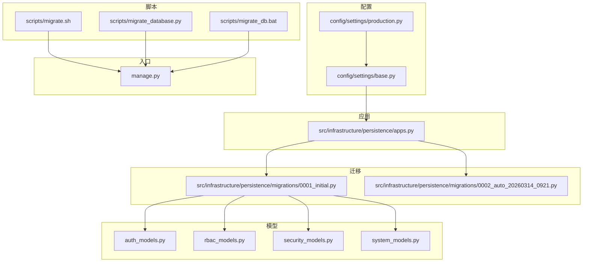
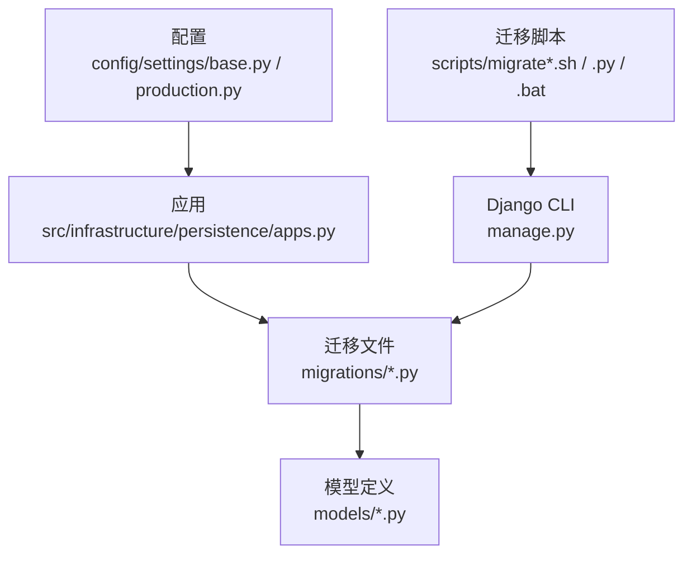
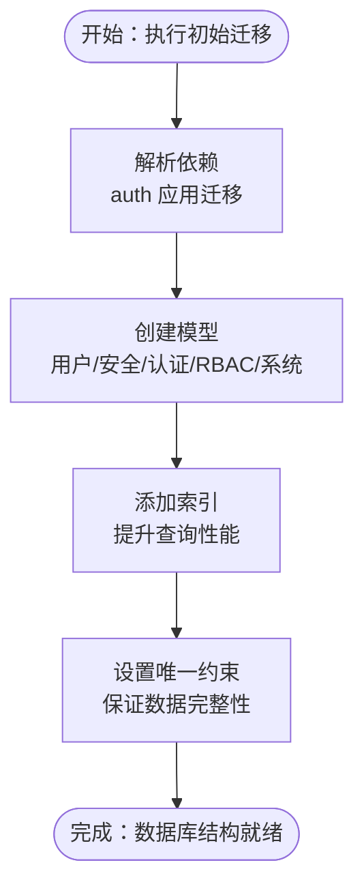
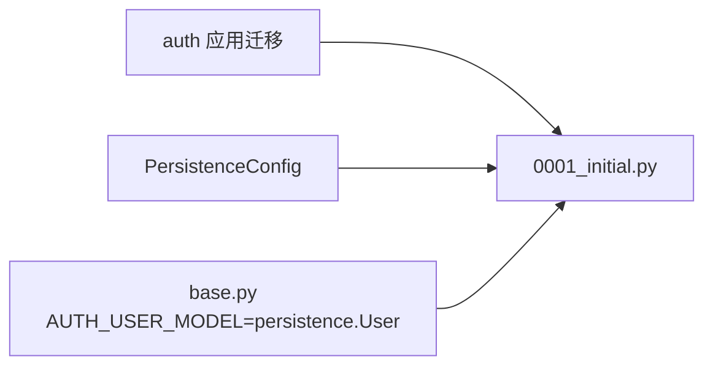
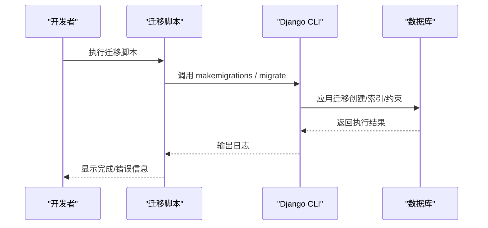

# 数据库迁移策略

<cite>
**本文引用的文件**
- [0001_initial.py](file://src/infrastructure/persistence/migrations/0001_initial.py)
- [0002_auto_20260314_0921.py](file://src/infrastructure/persistence/migrations/0002_auto_20260314_0921.py)
- [base.py](file://config/settings/base.py)
- [production.py](file://config/settings/production.py)
- [apps.py](file://src/infrastructure/persistence/apps.py)
- [manage.py](file://manage.py)
- [migrate.sh](file://scripts/migrate.sh)
- [migrate_database.py](file://scripts/migrate_database.py)
- [migrate_db.bat](file://scripts/migrate_db.bat)
- [auth_models.py](file://src/infrastructure/persistence/models/auth_models.py)
- [rbac_models.py](file://src/infrastructure/persistence/models/rbac_models.py)
- [security_models.py](file://src/infrastructure/persistence/models/security_models.py)
- [system_models.py](file://src/infrastructure/persistence/models/system_models.py)
- [test_user_models.py](file://tests/test_models/test_user_models.py)
- [test_rbac_models.py](file://tests/test_models/test_rbac_models.py)
</cite>

## 目录
1. [引言](#引言)
2. [项目结构](#项目结构)
3. [核心组件](#核心组件)
4. [架构总览](#架构总览)
5. [详细组件分析](#详细组件分析)
6. [依赖分析](#依赖分析)
7. [性能考量](#性能考量)
8. [故障排查指南](#故障排查指南)
9. [结论](#结论)
10. [附录](#附录)

## 引言
本文件系统化阐述该 Django 项目的数据库迁移策略，覆盖迁移文件生成机制、依赖关系管理、版本控制策略；深入解析初始迁移与后续迁移的变更内容；给出迁移执行最佳实践（含生产环境安全策略、回滚机制、数据备份要求）；总结迁移脚本编写规范（可逆性、数据完整性、性能影响评估）；并提供迁移故障排查指南与完整迁移流程示例（从开发到生产）。

## 项目结构
- 迁移文件位于应用持久化层的 migrations 目录，采用标准 Django 迁移命名与结构。
- 应用注册于配置中，确保迁移命令能正确识别目标应用。
- 提供多套环境配置，生产默认使用 PostgreSQL，开发默认 SQLite。
- 提供自动化迁移脚本，便于本地与 CI/CD 流水线集成。

图表来源
- [base.py:1-235](file://config/settings/base.py#L1-L235)
- [production.py:1-39](file://config/settings/production.py#L1-L39)
- [apps.py:1-14](file://src/infrastructure/persistence/apps.py#L1-L14)
- [0001_initial.py:1-973](file://src/infrastructure/persistence/migrations/0001_initial.py#L1-L973)
- [0002_auto_20260314_0921.py:1-13](file://src/infrastructure/persistence/migrations/0002_auto_20260314_0921.py#L1-L13)
- [auth_models.py:1-114](file://src/infrastructure/persistence/models/auth_models.py#L1-L114)
- [rbac_models.py:1-148](file://src/infrastructure/persistence/models/rbac_models.py#L1-L148)
- [security_models.py:1-162](file://src/infrastructure/persistence/models/security_models.py#L1-L162)
- [system_models.py:1-395](file://src/infrastructure/persistence/models/system_models.py#L1-L395)
- [migrate.sh:1-12](file://scripts/migrate.sh#L1-L12)
- [migrate_database.py:1-146](file://scripts/migrate_database.py#L1-L146)
- [migrate_db.bat:1-48](file://scripts/migrate_db.bat#L1-L48)
- [manage.py:1-23](file://manage.py#L1-L23)

章节来源
- [base.py:1-235](file://config/settings/base.py#L1-L235)
- [production.py:1-39](file://config/settings/production.py#L1-L39)
- [apps.py:1-14](file://src/infrastructure/persistence/apps.py#L1-L14)
- [0001_initial.py:1-973](file://src/infrastructure/persistence/migrations/0001_initial.py#L1-L973)
- [0002_auto_20260314_0921.py:1-13](file://src/infrastructure/persistence/migrations/0002_auto_20260314_0921.py#L1-L13)
- [migrate.sh:1-12](file://scripts/migrate.sh#L1-L12)
- [migrate_database.py:1-146](file://scripts/migrate_database.py#L1-L146)
- [migrate_db.bat:1-48](file://scripts/migrate_db.bat#L1-L48)
- [manage.py:1-23](file://manage.py#L1-L23)

## 核心组件
- 迁移文件
  - 初始迁移：0001_initial.py，负责创建全部业务模型与索引、唯一约束等。
  - 后续迁移：0002_auto_20260314_0921.py，当前为空操作，作为占位或未来扩展基线。
- 应用与配置
  - 应用注册：PersistenceConfig 确保迁移扫描与执行范围。
  - 环境配置：base.py 指定 INSTALLED_APPS 与 AUTH_USER_MODEL；production.py 指定 PostgreSQL。
- 模型层
  - 认证与安全：用户、登录日志、刷新令牌、Token 黑名单、IP 黑/白名单、限流规则与记录。
  - RBAC：权限、角色、用户角色、角色权限历史。
  - 系统：部门、菜单、操作日志、用户角色（系统角色）等。
- 迁移脚本
  - Bash/Shell：migrate.sh 执行 makemigrations 与 migrate，并尝试创建超级用户。
  - Python：migrate_database.py 将数据库迁移至 sql 目录并初始化。
  - Windows：migrate_db.bat 提供 Windows 下的迁移与数据库移动流程。

章节来源
- [0001_initial.py:1-973](file://src/infrastructure/persistence/migrations/0001_initial.py#L1-L973)
- [0002_auto_20260314_0921.py:1-13](file://src/infrastructure/persistence/migrations/0002_auto_20260314_0921.py#L1-L13)
- [apps.py:1-14](file://src/infrastructure/persistence/apps.py#L1-L14)
- [base.py:1-235](file://config/settings/base.py#L1-L235)
- [production.py:1-39](file://config/settings/production.py#L1-L39)
- [migrate.sh:1-12](file://scripts/migrate.sh#L1-L12)
- [migrate_database.py:1-146](file://scripts/migrate_database.py#L1-L146)
- [migrate_db.bat:1-48](file://scripts/migrate_db.bat#L1-L48)

## 架构总览
下图展示迁移系统在项目中的位置与交互：配置驱动应用注册，应用注册驱动迁移扫描，迁移文件定义数据库结构，脚本驱动迁移执行。

图表来源
- [base.py:1-235](file://config/settings/base.py#L1-L235)
- [production.py:1-39](file://config/settings/production.py#L1-L39)
- [apps.py:1-14](file://src/infrastructure/persistence/apps.py#L1-L14)
- [0001_initial.py:1-973](file://src/infrastructure/persistence/migrations/0001_initial.py#L1-L973)
- [migrate.sh:1-12](file://scripts/migrate.sh#L1-L12)
- [migrate_database.py:1-146](file://scripts/migrate_database.py#L1-L146)
- [migrate_db.bat:1-48](file://scripts/migrate_db.bat#L1-L48)
- [manage.py:1-23](file://manage.py#L1-L23)

## 详细组件分析

### 初始迁移 0001_initial.py 设计解析
- 生成机制
  - 由 Django 的迁移框架根据模型定义生成，包含 CreateModel、AddIndex、AlterUniqueTogether 等操作。
- 依赖关系
  - 依赖 Django auth 应用的特定迁移，确保用户模型具备最新字段与约束。
- 版本控制策略
  - 作为初始迁移，应保持稳定，避免后续修改；如需变更，建议新增迁移而非修改此文件。
- 模型创建与索引建立
  - 用户模型：包含 UUID 主键、唯一索引字段（用户名、邮箱、UID）、时间戳字段、多对多组与权限等。
  - 安全与认证：登录日志、刷新令牌、Token 黑名单、IP 黑/白名单、限流规则与记录。
  - RBAC：权限、角色、用户角色、角色权限历史。
  - 系统：部门、菜单、操作日志、系统角色与关联表。
- 约束与索引
  - 多处 AddIndex 为高频查询字段建立索引。
  - AlterUniqueTogether 为用户设备与用户角色建立联合唯一约束，保证数据一致性。

图表来源
- [0001_initial.py:16-18](file://src/infrastructure/persistence/migrations/0001_initial.py#L16-L18)
- [0001_initial.py:20-973](file://src/infrastructure/persistence/migrations/0001_initial.py#L20-L973)

章节来源
- [0001_initial.py:1-973](file://src/infrastructure/persistence/migrations/0001_initial.py#L1-L973)

### 后续迁移 0002_auto_20260314_0921.py 变更解析
- 当前状态
  - 依赖初始迁移，操作列表为空，不执行任何数据库变更。
- 用途
  - 可作为未来扩展的基线迁移，便于后续以“自动生成”方式追加变更，同时保留初始迁移不变。
- 版本控制建议
  - 若通过 Django 自动生成迁移，请确保仅包含必要操作，避免冗余。

章节来源
- [0002_auto_20260314_0921.py:1-13](file://src/infrastructure/persistence/migrations/0002_auto_20260314_0921.py#L1-L13)

### 迁移执行最佳实践
- 开发环境
  - 使用 manage.py 执行迁移；配合 migrate.sh 自动化脚本进行本地初始化。
- 生产环境
  - 使用生产配置（PostgreSQL），确保连接池参数与安全设置生效。
  - 在维护窗口执行迁移，提前备份数据库。
  - 先在预生产环境验证，再灰度发布。
- 回滚机制
  - 保留初始迁移不变，后续变更均通过新增迁移实现；回滚可通过反向迁移或手动恢复备份。
- 数据备份
  - 迁移前导出数据库快照；迁移后验证关键数据完整性与索引有效性。

章节来源
- [base.py:77-88](file://config/settings/base.py#L77-L88)
- [production.py:12-23](file://config/settings/production.py#L12-L23)
- [migrate.sh:1-12](file://scripts/migrate.sh#L1-L12)

### 迁移脚本编写规范
- 可逆性设计
  - 每个迁移应尽量可逆；若不可逆，应在迁移注释中明确风险与前置条件。
- 数据完整性保证
  - 对涉及唯一性与外键的字段，优先使用 AddIndex、AlterUniqueTogether 等操作确保约束。
- 性能影响评估
  - 大表建索引需评估锁表与 IO 影响；建议在低峰时段执行。
- 脚本健壮性
  - 脚本中捕获异常并输出明确提示；提供清理与重试逻辑。

章节来源
- [0001_initial.py:928-972](file://src/infrastructure/persistence/migrations/0001_initial.py#L928-L972)
- [migrate.sh:1-12](file://scripts/migrate.sh#L1-L12)
- [migrate_database.py:1-146](file://scripts/migrate_database.py#L1-L146)
- [migrate_db.bat:1-48](file://scripts/migrate_db.bat#L1-L48)

### 模型与迁移一致性校验
- 单元测试
  - 用户模型与档案测试覆盖创建、唯一性与关联关系。
  - RBAC 模型测试覆盖角色、权限与多对多关系。
- 建议
  - 在迁移后运行测试，确保模型与迁移一致，索引与约束按预期工作。

章节来源
- [test_user_models.py:1-82](file://tests/test_models/test_user_models.py#L1-L82)
- [test_rbac_models.py:1-99](file://tests/test_models/test_rbac_models.py#L1-L99)

## 依赖分析
- 应用与迁移
  - PersistenceConfig 注册应用，使迁移扫描与执行生效。
- 迁移依赖
  - 初始迁移依赖 Django auth 应用的特定迁移，确保用户模型具备最新字段。
- 环境依赖
  - base.py 指定 AUTH_USER_MODEL 为 persistence.User，确保迁移与模型一致。

图表来源
- [0001_initial.py:16-18](file://src/infrastructure/persistence/migrations/0001_initial.py#L16-L18)
- [apps.py:1-14](file://src/infrastructure/persistence/apps.py#L1-L14)
- [base.py:98-99](file://config/settings/base.py#L98-L99)

章节来源
- [apps.py:1-14](file://src/infrastructure/persistence/apps.py#L1-L14)
- [0001_initial.py:16-18](file://src/infrastructure/persistence/migrations/0001_initial.py#L16-L18)
- [base.py:98-99](file://config/settings/base.py#L98-L99)

## 性能考量
- 索引策略
  - 初始迁移对高频查询字段建立索引，有助于查询性能；但需关注写入性能与存储开销。
- 唯一约束
  - 联合唯一约束可避免重复数据，但会增加写入成本与死锁概率，需结合业务场景评估。
- 大表迁移
  - 建议分批处理与低峰时段执行；必要时使用在线 DDL 或第三方工具降低锁表时间。

章节来源
- [0001_initial.py:928-972](file://src/infrastructure/persistence/migrations/0001_initial.py#L928-L972)

## 故障排查指南
- 迁移失败
  - 检查依赖链是否完整；确认 AUTH_USER_MODEL 与模型一致。
  - 查看数据库连接配置（开发/生产差异）。
- 数据不一致
  - 核对唯一约束与索引是否按预期创建；必要时回滚至上一个可用迁移并修复。
- 脚本问题
  - migrate.sh/migrate_database.py/migrate_db.bat 输出详细日志，定位失败步骤并重试。
- 测试验证
  - 运行模型测试，确保迁移后功能正常。

章节来源
- [base.py:77-88](file://config/settings/base.py#L77-L88)
- [production.py:12-23](file://config/settings/production.py#L12-L23)
- [migrate.sh:1-12](file://scripts/migrate.sh#L1-L12)
- [migrate_database.py:1-146](file://scripts/migrate_database.py#L1-L146)
- [migrate_db.bat:1-48](file://scripts/migrate_db.bat#L1-L48)
- [test_user_models.py:1-82](file://tests/test_models/test_user_models.py#L1-L82)
- [test_rbac_models.py:1-99](file://tests/test_models/test_rbac_models.py#L1-L99)

## 结论
本项目采用标准 Django 迁移体系，初始迁移定义了完整的业务数据库结构，后续迁移以“占位+扩展”的方式演进。通过严格的依赖管理、环境配置与自动化脚本，实现了从开发到生产的平滑迁移。建议在生产环境遵循“先备份、后迁移、再验证”的流程，并持续完善迁移脚本的健壮性与可观测性。

## 附录

### 迁移流程示例（开发 → 生产）
- 开发环境
  - 初始化：执行 migrate.sh 或手动调用 manage.py 进行迁移。
  - 验证：运行测试，确保模型与迁移一致。
- 预生产环境
  - 使用生产配置（PostgreSQL），在隔离环境中执行迁移并验证。
- 生产环境
  - 维护窗口内执行迁移，迁移前后进行备份与校验。
  - 回滚预案：准备反向迁移或数据库快照恢复。

图表来源
- [migrate.sh:1-12](file://scripts/migrate.sh#L1-L12)
- [manage.py:1-23](file://manage.py#L1-L23)