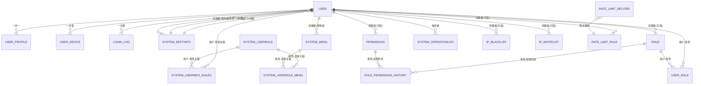
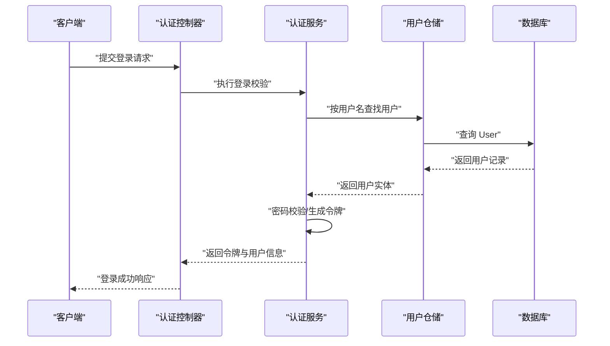
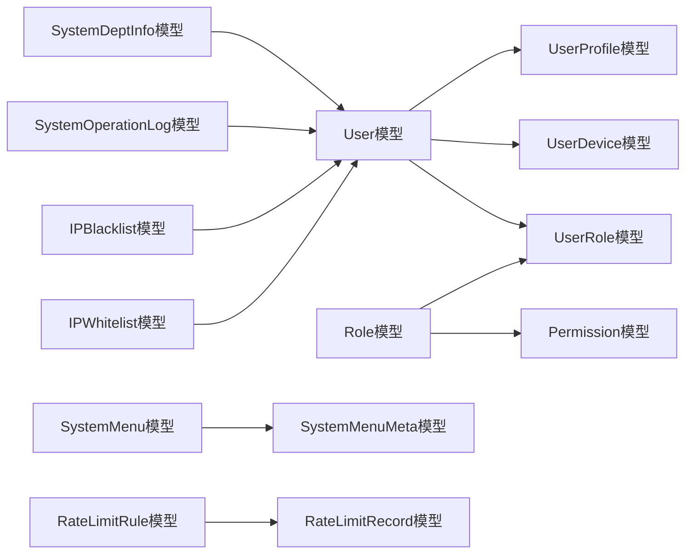

# 数据模型设计

<cite>
**本文引用的文件**
- [src/infrastructure/persistence/models/user_models.py](file://src/infrastructure/persistence/models/user_models.py)
- [src/infrastructure/persistence/models/rbac_models.py](file://src/infrastructure/persistence/models/rbac_models.py)
- [src/infrastructure/persistence/models/system_models.py](file://src/infrastructure/persistence/models/system_models.py)
- [src/infrastructure/persistence/models/security_models.py](file://src/infrastructure/persistence/models/security_models.py)
- [src/infrastructure/persistence/models/auth_models.py](file://src/infrastructure/persistence/models/auth_models.py)
- [src/domain/user/entities/user_entity.py](file://src/domain/user/entities/user_entity.py)
- [src/domain/rbac/entities/role_entity.py](file://src/domain/rbac/entities/role_entity.py)
- [src/domain/rbac/entities/permission_entity.py](file://src/domain/rbac/entities/permission_entity.py)
- [src/domain/security/entities/ip_blacklist_entity.py](file://src/domain/security/entities/ip_blacklist_entity.py)
- [src/domain/security/entities/ip_whitelist_entity.py](file://src/domain/security/entities/ip_whitelist_entity.py)
- [src/domain/security/entities/rate_limit_entity.py](file://src/domain/security/entities/rate_limit_entity.py)
- [src/infrastructure/repositories/user_repo_impl.py](file://src/infrastructure/repositories/user_repo_impl.py)
- [src/infrastructure/persistence/migrations/0001_initial.py](file://src/infrastructure/persistence/migrations/0001_initial.py)
- [src/infrastructure/persistence/migrations/0002_auto_20260314_0921.py](file://src/infrastructure/persistence/migrations/0002_auto_20260314_0921.py)
- [sql/rbac.sql](file://sql/rbac.sql)
</cite>

## 目录
1. [简介](#简介)
2. [项目结构](#项目结构)
3. [核心组件](#核心组件)
4. [架构总览](#架构总览)
5. [详细组件分析](#详细组件分析)
6. [依赖分析](#依赖分析)
7. [性能考量](#性能考量)
8. [故障排查指南](#故障排查指南)
9. [结论](#结论)
10. [附录](#附录)

## 简介
本文件系统性梳理本项目的“数据模型设计”，覆盖用户与档案、RBAC 权限体系、系统配置（部门/菜单/日志）、安全控制（IP 黑/白名单、限流规则）等核心领域，并结合迁移脚本与实体定义，给出 ER 关系图、ORM 映射设计原则、索引与性能优化建议、以及常见问题与使用示例。

## 项目结构
项目采用分层清晰的 DDD 架构：
- 领域层（Domain）：以 dataclass 表达实体，封装业务规则与不变量。
- 基础设施层（Infrastructure）：ORM 模型、仓储实现、中间件、缓存、持久化迁移等。
- 应用层（Application）：DTO、服务编排、控制器 API。
- 核心层（Core）：异常、装饰器、常量、工具等。

```mermaid
graph TB
subgraph "领域层(Domain)"
UEnt["UserEntity<br/>用户实体"]
REnt["RoleEntity<br/>角色实体"]
PEnt["PermissionEntity<br/>权限实体"]
IPBEnt["IPBlacklistEntity<br/>IP黑名单实体"]
IPWEnt["IPWhitelistEntity<br/>IP白名单实体"]
RLEnt["RateLimitEntity<br/>限流实体"]
end
subgraph "基础设施层(Infrastructure)"
subgraph "ORM模型"
UM["User<br/>用户模型"]
UP["UserProfile<br/>用户档案模型"]
UR["UserRole<br/>用户角色关联"]
PM["Permission<br/>权限模型"]
RM["Role<br/>角色模型"]
RLH["RolePermissionHistory<br/>角色权限变更历史"]
SDI["SystemDeptInfo<br/>部门信息"]
SM["SystemMenu<br/>菜单/权限"]
SMM["SystemMenuMeta<br/>菜单元数据"]
SOL["SystemOperationLog<br/>操作日志"]
IBL["IPBlacklist<br/>IP黑名单"]
IWL["IPWhitelist<br/>IP白名单"]
RLR["RateLimitRule<br/>限流规则"]
RLRD["RateLimitRecord<br/>限流记录"]
RT["RefreshToken<br/>刷新令牌"]
TBL["TokenBlacklist<br/>Token黑名单"]
LGL["LoginLog<br/>登录日志"]
end
Repo["UserRepositoryImpl<br/>用户仓储实现"]
end
UEnt --> UM
REnt --> RM
PEnt --> PM
IPBEnt --> IBL
IPWEnt --> IWL
RLEnt --> RLR
Repo --> UM
Repo --> UP
```

图表来源
- [src/domain/user/entities/user_entity.py:11-120](file://src/domain/user/entities/user_entity.py#L11-L120)
- [src/domain/rbac/entities/role_entity.py:11-80](file://src/domain/rbac/entities/role_entity.py#L11-L80)
- [src/domain/rbac/entities/permission_entity.py:11-85](file://src/domain/rbac/entities/permission_entity.py#L11-L85)
- [src/domain/security/entities/ip_blacklist_entity.py:11-53](file://src/domain/security/entities/ip_blacklist_entity.py#L11-L53)
- [src/domain/security/entities/ip_whitelist_entity.py:11-47](file://src/domain/security/entities/ip_whitelist_entity.py#L11-L47)
- [src/domain/security/entities/rate_limit_entity.py:11-106](file://src/domain/security/entities/rate_limit_entity.py#L11-L106)
- [src/infrastructure/persistence/models/user_models.py:12-147](file://src/infrastructure/persistence/models/user_models.py#L12-L147)
- [src/infrastructure/persistence/models/rbac_models.py:13-148](file://src/infrastructure/persistence/models/rbac_models.py#L13-L148)
- [src/infrastructure/persistence/models/system_models.py:12-395](file://src/infrastructure/persistence/models/system_models.py#L12-L395)
- [src/infrastructure/persistence/models/security_models.py:13-162](file://src/infrastructure/persistence/models/security_models.py#L13-L162)
- [src/infrastructure/persistence/models/auth_models.py:12-114](file://src/infrastructure/persistence/models/auth_models.py#L12-L114)
- [src/infrastructure/repositories/user_repo_impl.py:13-138](file://src/infrastructure/repositories/user_repo_impl.py#L13-L138)

章节来源
- [src/infrastructure/persistence/models/user_models.py:12-147](file://src/infrastructure/persistence/models/user_models.py#L12-L147)
- [src/infrastructure/persistence/models/rbac_models.py:13-148](file://src/infrastructure/persistence/models/rbac_models.py#L13-L148)
- [src/infrastructure/persistence/models/system_models.py:12-395](file://src/infrastructure/persistence/models/system_models.py#L12-L395)
- [src/infrastructure/persistence/models/security_models.py:13-162](file://src/infrastructure/persistence/models/security_models.py#L13-L162)
- [src/infrastructure/persistence/models/auth_models.py:12-114](file://src/infrastructure/persistence/models/auth_models.py#L12-L114)
- [src/domain/user/entities/user_entity.py:11-120](file://src/domain/user/entities/user_entity.py#L11-L120)
- [src/domain/rbac/entities/role_entity.py:11-80](file://src/domain/rbac/entities/role_entity.py#L11-L80)
- [src/domain/rbac/entities/permission_entity.py:11-85](file://src/domain/rbac/entities/permission_entity.py#L11-L85)
- [src/domain/security/entities/ip_blacklist_entity.py:11-53](file://src/domain/security/entities/ip_blacklist_entity.py#L11-L53)
- [src/domain/security/entities/ip_whitelist_entity.py:11-47](file://src/domain/security/entities/ip_whitelist_entity.py#L11-L47)
- [src/domain/security/entities/rate_limit_entity.py:11-106](file://src/domain/security/entities/rate_limit_entity.py#L11-L106)
- [src/infrastructure/repositories/user_repo_impl.py:13-138](file://src/infrastructure/repositories/user_repo_impl.py#L13-L138)

## 核心组件
本节聚焦关键数据模型的字段、关系、约束与索引策略，帮助快速掌握数据结构。

- 用户与档案
  - User：继承自 Django 内置用户，扩展头像、昵称、性别、手机、邮箱、部门/归属部门、创建者/修改者等；具备 username/email/phone 的唯一性与索引；支持软/硬删除（通过外键 SET_NULL）。
  - UserProfile：一对一扩展档案，包含个人网站、公司、职业、社交账号等；具备创建/更新时间戳。
  - UserDevice：记录用户登录设备信息，唯一约束 user+device_id，便于设备级会话管理。
- RBAC 权限体系
  - Permission：权限代码唯一且带索引，资源类型与操作类型分离；支持启用/停用。
  - Role：角色代码唯一且带索引；多对多关联 Permission；记录创建者。
  - UserRole：用户与角色的多对多关联，唯一约束 user+role，记录分配时间/分配者。
  - RolePermissionHistory：记录角色权限变更历史，含操作类型（新增/移除）与变更人。
- 系统配置
  - SystemDeptInfo：部门树形结构（parent），支持自动绑定、排序、激活状态；具备 code、parent 索引。
  - SystemMenu/SystemMenuMeta：菜单/权限与元数据分离；菜单支持目录/菜单/按钮三类；具备 name、parent 索引。
  - SystemOperationLog：操作日志，记录请求路径、方法、响应码、设备/浏览器/系统等；具备 creator/module/time 索引。
  - SystemUserRole/SystemUserRoleMenu：传统角色-菜单关联（兼容旧版 rbac.sql），与 Role/Permission 不同路径。
  - SystemUserInfoRoles：用户-角色关联。
- 安全控制
  - IPBlacklist：IP 地址唯一且带索引；支持永久封禁与过期时间；提供 is_active 检查。
  - IPWhitelist：IP 地址唯一且带索引；支持启用/停用。
  - RateLimitRule：API 端点+方法唯一；支持按 IP/用户/全局限流；具备 endpoint/method 唯一约束。
  - RateLimitRecord：限流计数与时间窗口；具备 key+endpoint+method 组合索引。
  - RefreshToken/TokenBlacklist/LoginLog：认证相关，支持刷新令牌、撤销黑名单、登录日志。

章节来源
- [src/infrastructure/persistence/models/user_models.py:12-147](file://src/infrastructure/persistence/models/user_models.py#L12-L147)
- [src/infrastructure/persistence/models/rbac_models.py:13-148](file://src/infrastructure/persistence/models/rbac_models.py#L13-L148)
- [src/infrastructure/persistence/models/system_models.py:12-395](file://src/infrastructure/persistence/models/system_models.py#L12-L395)
- [src/infrastructure/persistence/models/security_models.py:13-162](file://src/infrastructure/persistence/models/security_models.py#L13-L162)
- [src/infrastructure/persistence/models/auth_models.py:12-114](file://src/infrastructure/persistence/models/auth_models.py#L12-L114)

## 架构总览
下图展示数据模型之间的核心关系与约束，帮助理解跨模块的数据流转与一致性要求。

图表来源
- [src/infrastructure/persistence/models/user_models.py:12-147](file://src/infrastructure/persistence/models/user_models.py#L12-L147)
- [src/infrastructure/persistence/models/system_models.py:12-395](file://src/infrastructure/persistence/models/system_models.py#L12-L395)
- [src/infrastructure/persistence/models/rbac_models.py:13-148](file://src/infrastructure/persistence/models/rbac_models.py#L13-L148)
- [src/infrastructure/persistence/models/security_models.py:13-162](file://src/infrastructure/persistence/models/security_models.py#L13-L162)
- [src/infrastructure/persistence/models/auth_models.py:12-114](file://src/infrastructure/persistence/models/auth_models.py#L12-L114)

## 详细组件分析

### 用户与档案模型
- 字段要点
  - User：主键自增整型；扩展字段 avatar/nickname/gender/phone/email；部门/归属部门外键；创建者/修改者自引用外键；索引覆盖 username/email/phone。
  - UserProfile：UUID 主键；OneToOne 关联 User；扩展社交与站点信息；创建/更新时间戳。
  - UserDevice：UUID 主键；唯一约束 user+device_id；记录设备信息与最近登录时间。
- 设计原则
  - 使用 OneToOne 保证档案唯一性；唯一约束避免重复设备记录；索引提升查询效率。
- 性能与约束
  - 外键 SET_NULL 支持软删除；索引加速高频查询；UUID 主键避免序列号暴露。

章节来源
- [src/infrastructure/persistence/models/user_models.py:12-147](file://src/infrastructure/persistence/models/user_models.py#L12-L147)
- [src/domain/user/entities/user_entity.py:11-120](file://src/domain/user/entities/user_entity.py#L11-L120)

### RBAC 权限模型
- 字段要点
  - Permission：code 唯一且带索引；resource/action 分离；启用/停用；创建/更新时间。
  - Role：code 唯一且带索引；多对多关联 Permission；记录创建者；系统角色标记。
  - UserRole：唯一约束 user+role；记录分配时间/分配者。
  - RolePermissionHistory：记录角色权限变更（新增/移除）与变更人。
- 设计原则
  - 权限代码唯一，便于精确授权；角色与权限解耦，支持灵活组合。
- 性能与约束
  - 多对多中间表唯一约束避免重复赋权；索引加速权限查询与分配记录检索。

章节来源
- [src/infrastructure/persistence/models/rbac_models.py:13-148](file://src/infrastructure/persistence/models/rbac_models.py#L13-L148)
- [src/domain/rbac/entities/role_entity.py:11-80](file://src/domain/rbac/entities/role_entity.py#L11-L80)
- [src/domain/rbac/entities/permission_entity.py:11-85](file://src/domain/rbac/entities/permission_entity.py#L11-L85)

### 系统配置模型
- 字段要点
  - SystemDeptInfo：树形结构 parent；code 唯一；排序 rank；激活状态；创建者/修改者。
  - SystemMenu/SystemMenuMeta：菜单类型（目录/菜单/按钮）；name 唯一；parent 关联；meta 一对一。
  - SystemOperationLog：请求路径/方法/响应码/设备/系统等；索引 creator/module/time。
  - SystemUserRole/SystemUserRoleMenu：传统角色-菜单关联；唯一约束 userrole+menu。
  - SystemUserInfoRoles：用户-角色关联。
- 设计原则
  - 菜单与元数据分离，便于前端渲染；树形结构支持多级组织；日志索引支撑审计与追踪。
- 性能与约束
  - name/code/parent 索引提升导航与搜索效率；唯一约束避免重复配置。

章节来源
- [src/infrastructure/persistence/models/system_models.py:12-395](file://src/infrastructure/persistence/models/system_models.py#L12-L395)
- [sql/rbac.sql:19-232](file://sql/rbac.sql#L19-L232)

### 安全模型
- 字段要点
  - IPBlacklist：IP 唯一且带索引；永久封禁或过期时间；创建者。
  - IPWhitelist：IP 唯一且带索引；启用/停用；创建者。
  - RateLimitRule：endpoint+method 唯一；按 IP/用户/全局限流；rate/period/scope。
  - RateLimitRecord：计数与时间窗口；key+endpoint+method 组合索引。
  - RefreshToken/TokenBlacklist/LoginLog：认证生命周期与审计。
- 设计原则
  - 限流规则与记录分离，便于统计与可视化；黑白名单独立管理，降低误伤风险。
- 性能与约束
  - 唯一约束避免重复规则；组合索引加速限流判定。

章节来源
- [src/infrastructure/persistence/models/security_models.py:13-162](file://src/infrastructure/persistence/models/security_models.py#L13-L162)
- [src/infrastructure/persistence/models/auth_models.py:12-114](file://src/infrastructure/persistence/models/auth_models.py#L12-L114)
- [src/domain/security/entities/ip_blacklist_entity.py:11-53](file://src/domain/security/entities/ip_blacklist_entity.py#L11-L53)
- [src/domain/security/entities/ip_whitelist_entity.py:11-47](file://src/domain/security/entities/ip_whitelist_entity.py#L11-L47)
- [src/domain/security/entities/rate_limit_entity.py:11-106](file://src/domain/security/entities/rate_limit_entity.py#L11-L106)

### 数据模型与实体映射
- 映射关系
  - UserEntity ↔ User 模型：字段一一对应，含业务校验与状态变更。
  - RoleEntity ↔ Role 模型：权限代码集合映射到 Permission 多对多。
  - PermissionEntity ↔ Permission 模型：资源/动作解析与激活状态。
  - IPBlacklistEntity/IPWhitelistEntity/RLEntity ↔ 对应 ORM 模型：状态检查/激活/停用。
- 仓储实现
  - UserRepositoryImpl：负责 User/UserProfile 的实体与模型互转、CRUD 操作与存在性检查。

章节来源
- [src/domain/user/entities/user_entity.py:11-120](file://src/domain/user/entities/user_entity.py#L11-L120)
- [src/domain/rbac/entities/role_entity.py:11-80](file://src/domain/rbac/entities/role_entity.py#L11-L80)
- [src/domain/rbac/entities/permission_entity.py:11-85](file://src/domain/rbac/entities/permission_entity.py#L11-L85)
- [src/domain/security/entities/ip_blacklist_entity.py:11-53](file://src/domain/security/entities/ip_blacklist_entity.py#L11-L53)
- [src/domain/security/entities/ip_whitelist_entity.py:11-47](file://src/domain/security/entities/ip_whitelist_entity.py#L11-L47)
- [src/domain/security/entities/rate_limit_entity.py:11-106](file://src/domain/security/entities/rate_limit_entity.py#L11-L106)
- [src/infrastructure/repositories/user_repo_impl.py:13-138](file://src/infrastructure/repositories/user_repo_impl.py#L13-L138)

### API 工作流（示例）
以下序列图展示“用户登录”场景中模型与仓储的交互，体现数据模型在真实调用链中的作用。

图表来源
- [src/infrastructure/repositories/user_repo_impl.py:72-106](file://src/infrastructure/repositories/user_repo_impl.py#L72-L106)
- [src/infrastructure/persistence/models/user_models.py:12-147](file://src/infrastructure/persistence/models/user_models.py#L12-L147)

## 依赖分析
- 模块内聚与耦合
  - User/Profile/Device 低耦合，职责清晰；RBAC 通过中间表解耦用户与权限。
  - 系统配置与用户模型通过外键建立强约束，确保组织与操作日志的完整性。
  - 安全模型独立于业务模型，通过规则与记录进行策略控制。
- 外部依赖
  - Django ORM 提供模型定义、索引与约束；settings.AUTH_USER_MODEL 引用统一认证用户模型。
- 循环依赖
  - 未发现直接循环依赖；跨模块通过外键与中间表连接。

图表来源
- [src/infrastructure/persistence/models/user_models.py:12-147](file://src/infrastructure/persistence/models/user_models.py#L12-L147)
- [src/infrastructure/persistence/models/rbac_models.py:13-148](file://src/infrastructure/persistence/models/rbac_models.py#L13-L148)
- [src/infrastructure/persistence/models/system_models.py:12-395](file://src/infrastructure/persistence/models/system_models.py#L12-L395)
- [src/infrastructure/persistence/models/security_models.py:13-162](file://src/infrastructure/persistence/models/security_models.py#L13-L162)
- [src/infrastructure/persistence/models/auth_models.py:12-114](file://src/infrastructure/persistence/models/auth_models.py#L12-L114)

## 性能考量
- 索引策略
  - 用户：username/email/phone 唯一索引；profile 一对一索引；devices 唯一约束 user+device_id。
  - RBAC：permission.code/resource 唯一索引；role.code 唯一索引；user_role 唯一索引与 user/role 单列索引。
  - 系统：dept.code/dept.parent/menu.name/menu.parent/log.creator/log.module/log.created_time。
  - 安全：ip_blacklist/ip_whitelist.ip_address 唯一索引；rate_limit_rules.endpoint+method 唯一；rate_limit_records.key+endpoint+method 组合索引。
- 查询优化
  - 使用 select_related/ prefetch_related 减少 N+1 查询；对高并发读取场景引入缓存。
- 写入优化
  - 批量写入与事务合并；避免频繁更新导致的索引碎片。
- 存储与归档
  - 日志与登录记录定期归档；限流记录设置合理过期时间。

## 故障排查指南
- 用户相关
  - 用户名/邮箱重复：检查唯一索引冲突；确认用户名长度与邮箱格式。
  - 设备重复登录：检查 user+device_id 唯一约束；清理无效设备记录。
- RBAC 相关
  - 权限代码重复：确认 code 唯一性；避免重复创建。
  - 角色赋权异常：检查 user_role 唯一约束；确认用户与角色存在性。
- 系统配置
  - 菜单名称重复：确认 name 唯一性；检查父子关系是否形成环。
  - 部门树异常：检查 parent 外键；避免自引用或循环引用。
- 安全相关
  - IP 黑名单/白名单冲突：确认 IP 唯一性；检查 is_permanent 与过期时间。
  - 限流规则冲突：确认 endpoint+method 唯一性；核对 rate/period/scope 合理性。
- 认证相关
  - 刷新令牌冲突：确认 token/jti 唯一性；检查撤销状态。
  - 登录日志缺失：确认中间件拦截与入库逻辑。

章节来源
- [src/infrastructure/persistence/models/user_models.py:76-80](file://src/infrastructure/persistence/models/user_models.py#L76-L80)
- [src/infrastructure/persistence/models/rbac_models.py:107-110](file://src/infrastructure/persistence/models/rbac_models.py#L107-L110)
- [src/infrastructure/persistence/models/system_models.py:204-207](file://src/infrastructure/persistence/models/system_models.py#L204-L207)
- [src/infrastructure/persistence/models/security_models.py:126-127](file://src/infrastructure/persistence/models/security_models.py#L126-L127)
- [src/infrastructure/persistence/models/auth_models.py:38-41](file://src/infrastructure/persistence/models/auth_models.py#L38-L41)

## 结论
本项目数据模型遵循 DDD 与 ORM 最佳实践，通过清晰的实体边界、严格的索引与约束、以及完善的中间表设计，实现了用户、RBAC、系统配置与安全控制的高内聚低耦合。配合迁移脚本与领域实体，既满足开发期快速演进，也保障生产环境的稳定性与可维护性。

## 附录

### 数据库迁移策略
- 初始迁移
  - 0001_initial：创建用户、权限、角色、安全、认证、日志等核心表；定义索引与唯一约束；包含字段与关系的首次落地。
- 版本升级
  - 0002_auto_20260314_0921：当前为空操作，预留后续迁移扩展。
- 迁移注意事项
  - 新增字段建议使用非空默认值或允许空值并补充校验；修改字段需评估数据迁移成本。
  - 唯一索引变更需先清理重复数据；外键变更需考虑级联策略。
- 历史 SQL 参考
  - rbac.sql 展示了早期版本的系统菜单/部门/角色/权限等表结构与外键关系，可用于对比与回溯。

章节来源
- [src/infrastructure/persistence/migrations/0001_initial.py:13-800](file://src/infrastructure/persistence/migrations/0001_initial.py#L13-L800)
- [src/infrastructure/persistence/migrations/0002_auto_20260314_0921.py:6-12](file://src/infrastructure/persistence/migrations/0002_auto_20260314_0921.py#L6-L12)
- [sql/rbac.sql:19-232](file://sql/rbac.sql#L19-L232)

### ORM 映射设计原则与最佳实践
- 原则
  - 一对一/一对多使用外键；多对多使用中间表并加唯一约束。
  - 字段命名与注释保持一致；索引覆盖高频查询字段。
  - 外键约束保证参照完整性；必要时使用 SET_NULL 或 CASCADE。
- 最佳实践
  - 使用 UUID 主键避免序列号泄露；对敏感字段（如密码）不在模型中存储明文。
  - 在仓储层统一做实体与模型的转换，保持领域层与基础设施层解耦。
  - 对高并发场景引入缓存与批量操作，减少数据库压力。

### 数据验证规则与索引策略清单
- 用户与档案
  - 验证：用户名长度、邮箱格式；Phone/Avatar/Bio 可空。
  - 索引：username/email/phone；user_device 唯一约束。
- RBAC
  - 验证：权限 code 唯一；角色 code 唯一；权限资源/动作解析。
  - 索引：permission.code/resource；role.code；user_role 唯一索引。
- 系统配置
  - 验证：菜单 name 唯一；部门 code 唯一；日志字段长度与类型。
  - 索引：dept.code/dept.parent；menu.name/menu.parent；log.creator/log.module/log.created_time。
- 安全
  - 验证：IP 唯一；限流规则 endpoint+method 唯一；rate/period 正数。
  - 索引：ip_blacklist/ip_whitelist.ip_address；rate_limit_rules.endpoint+method；rate_limit_records.key+endpoint+method。

### 使用示例与常见问题
- 使用示例
  - 创建用户并绑定部门：先创建 User，再设置 dept/dept_belong，最后保存。
  - 分配角色给用户：创建 UserRole 记录，确保 user+role 唯一。
  - 设置限流规则：创建 RateLimitRule，选择 scope（ip/user/global），设置 rate/period。
- 常见问题
  - “无法创建重复角色/权限”：检查 code 唯一性；确认是否已有相同 code。
  - “菜单名称重复”：检查 name 唯一性；确认是否误用已有名称。
  - “IP 黑名单未生效”：检查 is_permanent 与过期时间；确认 IP 格式正确。