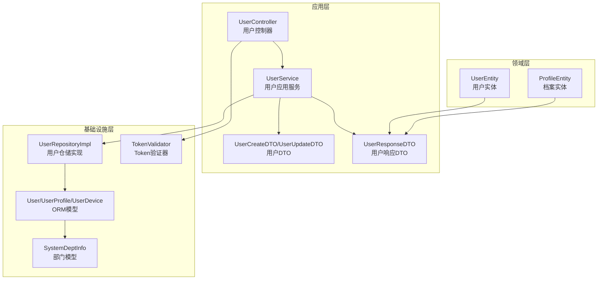
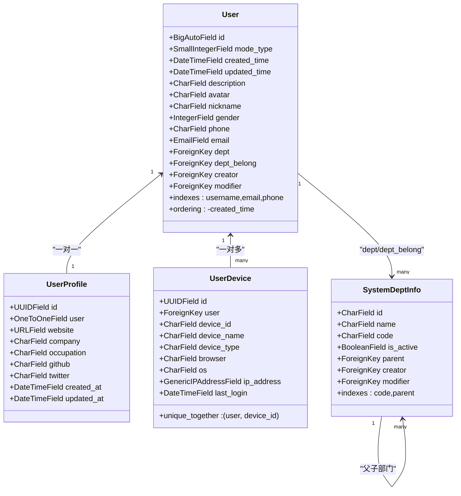
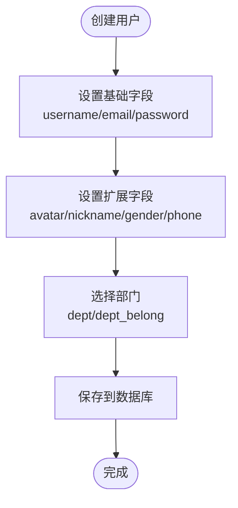
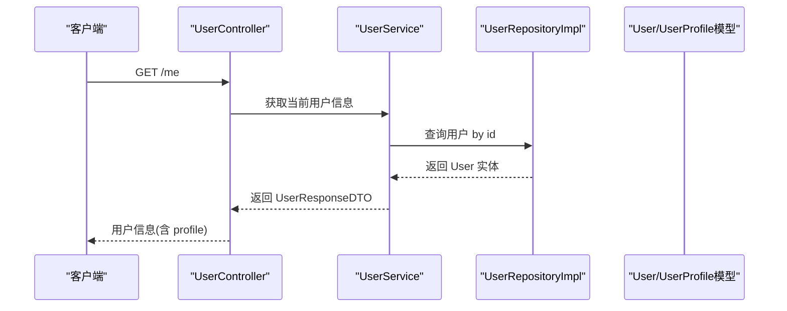
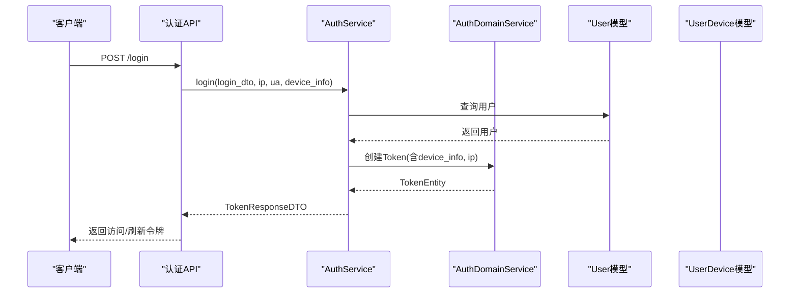
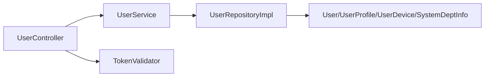

# 用户数据模型

<cite>
**本文档引用的文件**
- [src/infrastructure/persistence/models/user_models.py](file://src/infrastructure/persistence/models/user_models.py)
- [src/domain/user/entities/user_entity.py](file://src/domain/user/entities/user_entity.py)
- [src/domain/user/entities/profile_entity.py](file://src/domain/user/entities/profile_entity.py)
- [src/application/services/user_service.py](file://src/application/services/user_service.py)
- [src/application/dto/user/user_create_dto.py](file://src/application/dto/user/user_create_dto.py)
- [src/application/dto/user/user_update_dto.py](file://src/application/dto/user/user_update_dto.py)
- [src/application/dto/user/user_response_dto.py](file://src/application/dto/user/user_response_dto.py)
- [src/api/v1/controllers/user_controller.py](file://src/api/v1/controllers/user_controller.py)
- [src/infrastructure/repositories/user_repo_impl.py](file://src/infrastructure/repositories/user_repo_impl.py)
- [src/infrastructure/persistence/models/system_models.py](file://src/infrastructure/persistence/models/system_models.py)
- [src/infrastructure/auth_jwt/token_validator.py](file://src/infrastructure/auth_jwt/token_validator.py)
- [src/api/v1/auth_api.py](file://src/api/v1/auth_api.py)
- [src/domain/auth/services/auth_domain_service.py](file://src/domain/auth/services/auth_domain_service.py)
- [tests/test_models/test_user_models.py](file://tests/test_models/test_user_models.py)
</cite>

## 目录
1. [简介](#简介)
2. [项目结构](#项目结构)
3. [核心组件](#核心组件)
4. [架构总览](#架构总览)
5. [详细组件分析](#详细组件分析)
6. [依赖分析](#依赖分析)
7. [性能考量](#性能考量)
8. [故障排查指南](#故障排查指南)
9. [结论](#结论)
10. [附录：使用示例与最佳实践](#附录使用示例与最佳实践)

## 简介
本文件聚焦于用户数据模型的设计与实现，覆盖以下主题：
- User 模型：为何继承 Django AbstractUser、扩展字段的语义与用途、与部门 SystemDeptInfo 的关联关系设计。
- UserProfile 模型：扩展信息存储机制（个人网站、公司、职业等）的设计考虑与与 User 的一对一关系。
- UserDevice 模型：设备管理功能（设备ID、设备类型、浏览器、操作系统、IP地址、最后登录时间）的存储与唯一性约束。
- 模型间关系图与外键约束说明。
- 字段验证规则、索引策略与性能优化建议。
- 实际使用示例：创建用户、更新档案信息、管理设备登录等常见操作。

## 项目结构
用户相关模型位于基础设施层的 ORM 模型定义中，配合应用层的服务与 DTO、控制器，形成清晰的分层架构。下图展示了与用户模型直接相关的文件与职责映射：

图表来源
- [src/api/v1/controllers/user_controller.py:33-283](file://src/api/v1/controllers/user_controller.py#L33-L283)
- [src/application/services/user_service.py:15-172](file://src/application/services/user_service.py#L15-L172)
- [src/application/dto/user/user_create_dto.py:9-34](file://src/application/dto/user/user_create_dto.py#L9-L34)
- [src/application/dto/user/user_update_dto.py:9-32](file://src/application/dto/user/user_update_dto.py#L9-L32)
- [src/application/dto/user/user_response_dto.py:11-30](file://src/application/dto/user/user_response_dto.py#L11-L30)
- [src/infrastructure/repositories/user_repo_impl.py:13-138](file://src/infrastructure/repositories/user_repo_impl.py#L13-L138)
- [src/infrastructure/persistence/models/user_models.py:12-147](file://src/infrastructure/persistence/models/user_models.py#L12-L147)
- [src/infrastructure/persistence/models/system_models.py:12-83](file://src/infrastructure/persistence/models/system_models.py#L12-L83)
- [src/infrastructure/auth_jwt/token_validator.py:11-108](file://src/infrastructure/auth_jwt/token_validator.py#L11-L108)

章节来源
- [src/api/v1/controllers/user_controller.py:33-283](file://src/api/v1/controllers/user_controller.py#L33-L283)
- [src/application/services/user_service.py:15-172](file://src/application/services/user_service.py#L15-L172)
- [src/infrastructure/persistence/models/user_models.py:12-147](file://src/infrastructure/persistence/models/user_models.py#L12-L147)
- [src/infrastructure/persistence/models/system_models.py:12-83](file://src/infrastructure/persistence/models/system_models.py#L12-L83)

## 核心组件
本节对三个核心模型进行深入解析：User、UserProfile、UserDevice。

- User 模型
  - 继承 Django AbstractUser，保留标准认证字段（username、email、is_active 等），同时新增业务字段（头像、昵称、性别、手机、描述、模式类型、时间戳等）。
  - 关联部门：dept（所属部门）、dept_belong（归属部门），均指向 SystemDeptInfo，支持 RBAC 场景下的组织架构管理。
  - 自引用外键：creator、modifier 指向 User.self，用于审计追踪（谁创建/修改了该用户）。
  - 索引：对 username、email、phone 建立独立索引，提升查询效率。
  - 排序：默认按创建时间倒序。

- UserProfile 模型
  - 一对一关联到 User，主键为 UUID，便于跨系统引用与安全标识。
  - 扩展信息字段：个人网站、公司、职业、社交账号（GitHub、Twitter）等，满足个性化档案管理需求。
  - 时间戳：created_at、updated_at 自动维护。

- UserDevice 模型
  - 多对一关联到 User，记录用户登录设备信息。
  - 设备标识：device_id（唯一性约束与 user 组合），device_name、device_type。
  - 浏览器与操作系统：browser、os。
  - 网络信息：ip_address（通用IP字段）。
  - 行为记录：last_login（每次登录自动更新）。

章节来源
- [src/infrastructure/persistence/models/user_models.py:12-147](file://src/infrastructure/persistence/models/user_models.py#L12-L147)
- [src/infrastructure/persistence/models/system_models.py:12-83](file://src/infrastructure/persistence/models/system_models.py#L12-L83)

## 架构总览
下图展示用户模型在整体架构中的位置与交互关系：

图表来源
- [src/infrastructure/persistence/models/user_models.py:12-147](file://src/infrastructure/persistence/models/user_models.py#L12-L147)
- [src/infrastructure/persistence/models/system_models.py:12-83](file://src/infrastructure/persistence/models/system_models.py#L12-L83)

## 详细组件分析

### User 模型分析
- 继承 AbstractUser 的原因
  - 保持 Django 内置用户认证体系（密码哈希、权限字段、is_active 等），同时允许扩展业务字段，避免重新造轮子。
- 扩展字段的含义与用途
  - 基本信息：头像、昵称、性别、手机号、邮箱（email 作为登录凭据之一）。
  - 描述与模式：description、mode_type 用于业务场景标记。
  - 审计字段：created_time、updated_time、creator、modifier 支持审计追踪。
- 部门关联关系设计
  - dept：用户所属部门（实际工作归属）。
  - dept_belong：用户归属部门（组织架构层级上的归属）。
  - 两者均指向 SystemDeptInfo，支持树形结构与层级查询。
- 索引与排序
  - 对 username、email、phone 建立索引，提升登录与检索性能。
  - 默认按创建时间倒序，便于新用户优先展示。

图表来源
- [src/application/services/user_service.py:28-51](file://src/application/services/user_service.py#L28-L51)
- [src/application/dto/user/user_create_dto.py:9-34](file://src/application/dto/user/user_create_dto.py#L9-L34)

章节来源
- [src/infrastructure/persistence/models/user_models.py:12-84](file://src/infrastructure/persistence/models/user_models.py#L12-L84)
- [src/infrastructure/persistence/models/system_models.py:12-83](file://src/infrastructure/persistence/models/system_models.py#L12-L83)
- [src/application/services/user_service.py:28-51](file://src/application/services/user_service.py#L28-L51)

### UserProfile 模型分析
- 设计考虑
  - 使用 UUID 主键，避免暴露自增 ID；与 User 建立 OneToOneField，保证一对一关系。
  - 扩展信息字段覆盖个人网站、公司、职业、社交账号等，满足个性化档案管理。
  - 时间戳字段自动维护，便于审计与统计。
- 与 User 的关系
  - 通过 related_name="profile" 与 User 建立反向关联，便于从用户对象访问档案。

图表来源
- [src/api/v1/controllers/user_controller.py:234-261](file://src/api/v1/controllers/user_controller.py#L234-L261)
- [src/application/services/user_service.py:52-81](file://src/application/services/user_service.py#L52-L81)
- [src/infrastructure/repositories/user_repo_impl.py:72-94](file://src/infrastructure/repositories/user_repo_impl.py#L72-L94)
- [src/infrastructure/persistence/models/user_models.py:90-119](file://src/infrastructure/persistence/models/user_models.py#L90-L119)

章节来源
- [src/infrastructure/persistence/models/user_models.py:90-119](file://src/infrastructure/persistence/models/user_models.py#L90-L119)
- [tests/test_models/test_user_models.py:48-82](file://tests/test_models/test_user_models.py#L48-L82)

### UserDevice 模型分析
- 设备管理功能
  - 记录用户登录设备信息：device_id（唯一性约束与 user 组合）、device_name、device_type。
  - 浏览器与操作系统：browser、os。
  - 网络与行为：ip_address、last_login（每次登录自动更新）。
- 唯一性约束
  - unique_together = [["user", "device_id"]]，确保同一用户在同一设备上仅有一条记录，便于设备识别与风控。
- 与认证流程的衔接
  - 登录接口会收集客户端 IP 与 UA，并结合设备信息调用认证服务，最终生成 Token 并可能写入设备记录（由认证服务实现负责）。

图表来源
- [src/api/v1/auth_api.py:22-48](file://src/api/v1/auth_api.py#L22-L48)
- [src/application/services/auth_service.py:26-42](file://src/application/services/auth_service.py#L26-L42)
- [src/domain/auth/services/auth_domain_service.py:20-51](file://src/domain/auth/services/auth_domain_service.py#L20-L51)
- [src/infrastructure/persistence/models/user_models.py:121-147](file://src/infrastructure/persistence/models/user_models.py#L121-L147)

章节来源
- [src/infrastructure/persistence/models/user_models.py:121-147](file://src/infrastructure/persistence/models/user_models.py#L121-L147)
- [src/api/v1/auth_api.py:22-48](file://src/api/v1/auth_api.py#L22-L48)
- [src/application/services/auth_service.py:26-42](file://src/application/services/auth_service.py#L26-L42)
- [src/domain/auth/services/auth_domain_service.py:20-51](file://src/domain/auth/services/auth_domain_service.py#L20-L51)

## 依赖分析
- 控制器到服务：UserController 通过依赖注入使用 UserService，遵循 SOLID 的依赖倒置原则。
- 服务到仓储：UserService 通过 UserRepositoryImpl 访问 ORM 模型，实现业务逻辑与数据访问分离。
- 仓储到模型：UserRepositoryImpl 在 UserEntity 与 User 模型之间进行转换，保证领域层与基础设施层解耦。
- 模型到模型：User 与 SystemDeptInfo、UserProfile、UserDevice 形成清晰的外键关系，支撑 RBAC 与用户画像。

图表来源
- [src/api/v1/controllers/user_controller.py:44-51](file://src/api/v1/controllers/user_controller.py#L44-L51)
- [src/application/services/user_service.py:21-22](file://src/application/services/user_service.py#L21-L22)
- [src/infrastructure/repositories/user_repo_impl.py:13-138](file://src/infrastructure/repositories/user_repo_impl.py#L13-L138)
- [src/infrastructure/persistence/models/user_models.py:12-147](file://src/infrastructure/persistence/models/user_models.py#L12-L147)
- [src/infrastructure/auth_jwt/token_validator.py:11-108](file://src/infrastructure/auth_jwt/token_validator.py#L11-L108)

章节来源
- [src/api/v1/controllers/user_controller.py:44-51](file://src/api/v1/controllers/user_controller.py#L44-L51)
- [src/application/services/user_service.py:21-22](file://src/application/services/user_service.py#L21-L22)
- [src/infrastructure/repositories/user_repo_impl.py:13-138](file://src/infrastructure/repositories/user_repo_impl.py#L13-L138)

## 性能考量
- 索引策略
  - User 模型对 username、email、phone 建立索引，有利于登录与检索。
  - SystemDeptInfo 对 code、parent 建立索引，支持树形查询与层级检索。
- 查询优化
  - 列表接口使用分页参数，避免一次性加载大量数据。
  - 用户详情接口使用缓存（UserService 中对用户信息进行缓存），减少数据库压力。
- 写入优化
  - UserProfile 采用 UUID 主键，避免序列竞争；UserDevice 的 unique_together 保证幂等写入。
- 审计与日志
  - UserDevice 的 last_login 自动更新，便于设备登录趋势分析。

章节来源
- [src/infrastructure/persistence/models/user_models.py:76-80](file://src/infrastructure/persistence/models/user_models.py#L76-L80)
- [src/infrastructure/persistence/models/system_models.py:70-73](file://src/infrastructure/persistence/models/system_models.py#L70-L73)
- [src/application/services/user_service.py:54-66](file://src/application/services/user_service.py#L54-L66)

## 故障排查指南
- 用户名/邮箱重复
  - 现象：创建用户时报错“用户名/邮箱已存在”。
  - 排查：确认 DTO 中字段长度与格式符合要求；检查数据库索引是否生效。
- 用户不存在
  - 现象：查询用户或更新用户时报错“用户不存在”。
  - 排查：确认传入的 user_id 是否正确；检查缓存是否命中。
- 密码错误
  - 现象：登录失败或修改密码失败。
  - 排查：确认密码哈希算法一致性；检查 is_active 状态。
- 设备记录冲突
  - 现象：同一用户在同一设备上重复登录导致唯一性冲突。
  - 排查：确认 device_id 的生成与传递；若需更换设备，应先清理旧记录或更新 device_id。

章节来源
- [src/application/services/user_service.py:30-36](file://src/application/services/user_service.py#L30-L36)
- [src/application/services/user_service.py:84-86](file://src/application/services/user_service.py#L84-L86)
- [src/application/services/user_service.py:120-126](file://src/application/services/user_service.py#L120-L126)
- [src/infrastructure/persistence/models/user_models.py:143-143](file://src/infrastructure/persistence/models/user_models.py#L143-L143)

## 结论
本用户数据模型通过继承 AbstractUser 与扩展字段相结合的方式，在保持 Django 认证体系完整性的同时，提供了丰富的业务能力。UserProfile 与 UserDevice 分别承担“档案信息”和“设备登录”的扩展存储，配合 SystemDeptInfo 的部门关联，构建了完整的 RBAC 用户管理体系。通过合理的索引、缓存与唯一性约束，兼顾了易用性与性能。

## 附录：使用示例与最佳实践
- 创建用户
  - 步骤：构造 UserCreateDTO，调用 UserController.create_user，服务层校验重复后保存。
  - 关键点：用户名长度与邮箱格式校验；密码哈希处理；必要时设置部门字段。
- 更新用户档案信息
  - 步骤：通过 UserProfile 的 OneToOne 关系访问档案，更新扩展字段并保存。
  - 关键点：字段变更后及时同步，注意隐私字段的可见性控制。
- 管理设备登录
  - 步骤：登录时收集设备信息与 IP/UA，认证服务创建 Token 并记录设备信息。
  - 关键点：device_id 唯一性；last_login 自动更新；异常登录检测与风控策略。

章节来源
- [src/api/v1/controllers/user_controller.py:53-76](file://src/api/v1/controllers/user_controller.py#L53-L76)
- [src/application/dto/user/user_create_dto.py:9-34](file://src/application/dto/user/user_create_dto.py#L9-L34)
- [src/application/services/user_service.py:28-51](file://src/application/services/user_service.py#L28-L51)
- [src/infrastructure/persistence/models/user_models.py:90-147](file://src/infrastructure/persistence/models/user_models.py#L90-L147)
- [src/api/v1/auth_api.py:22-48](file://src/api/v1/auth_api.py#L22-L48)