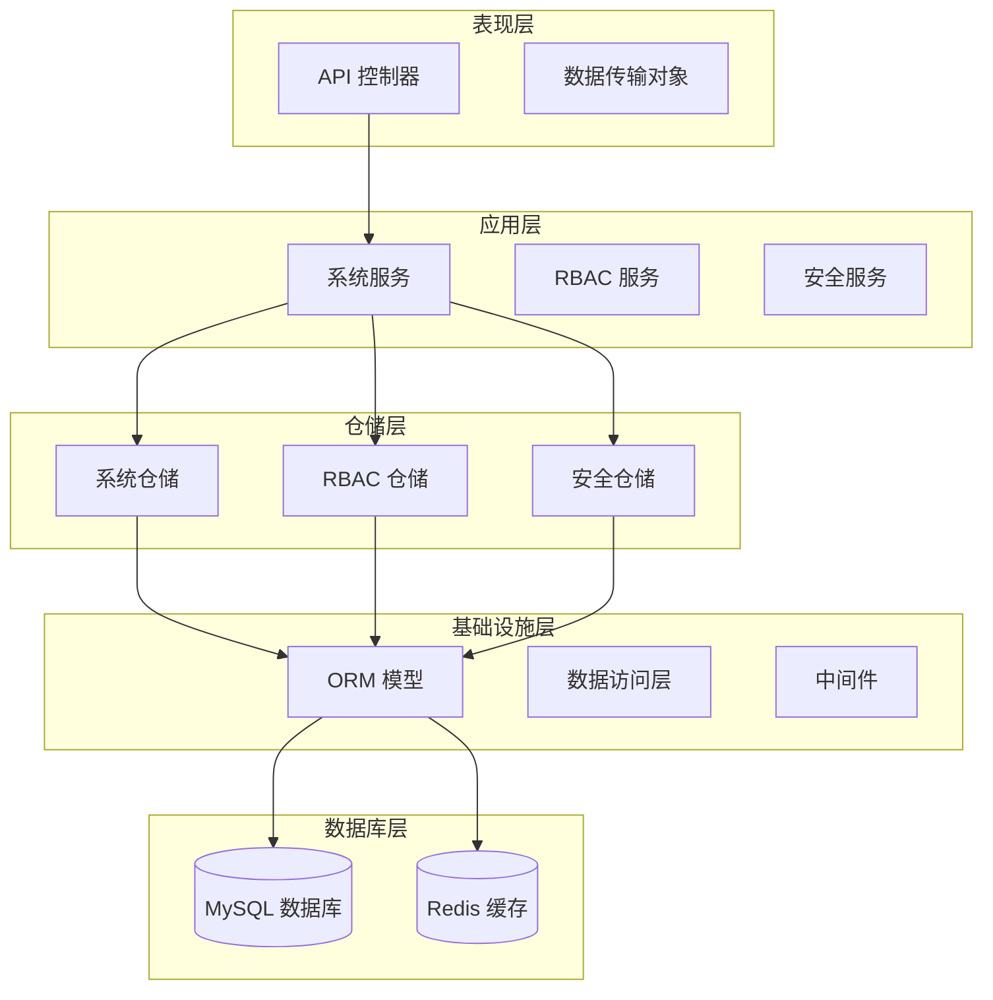
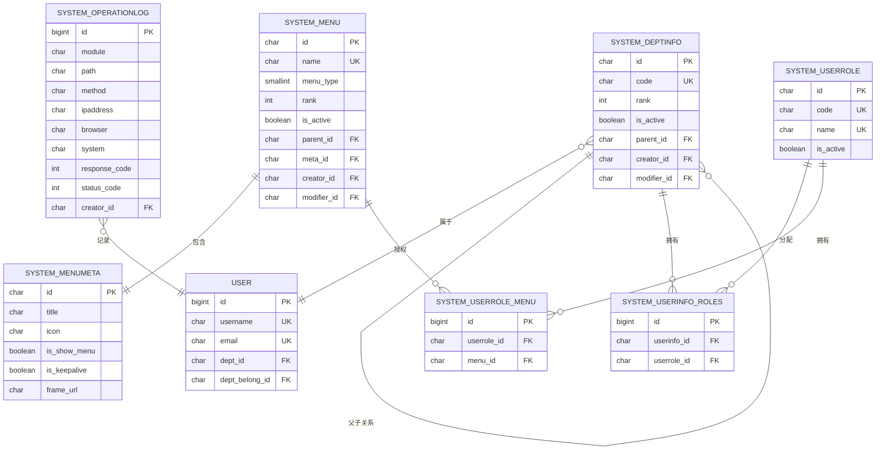
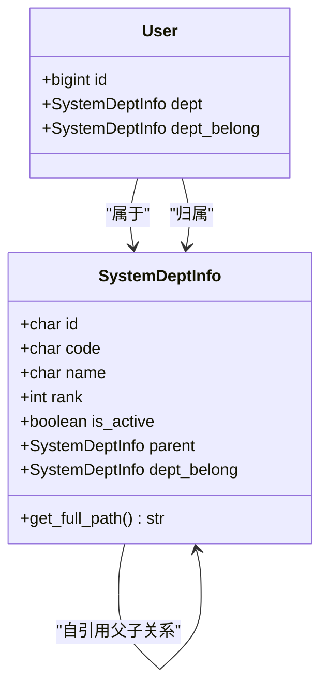
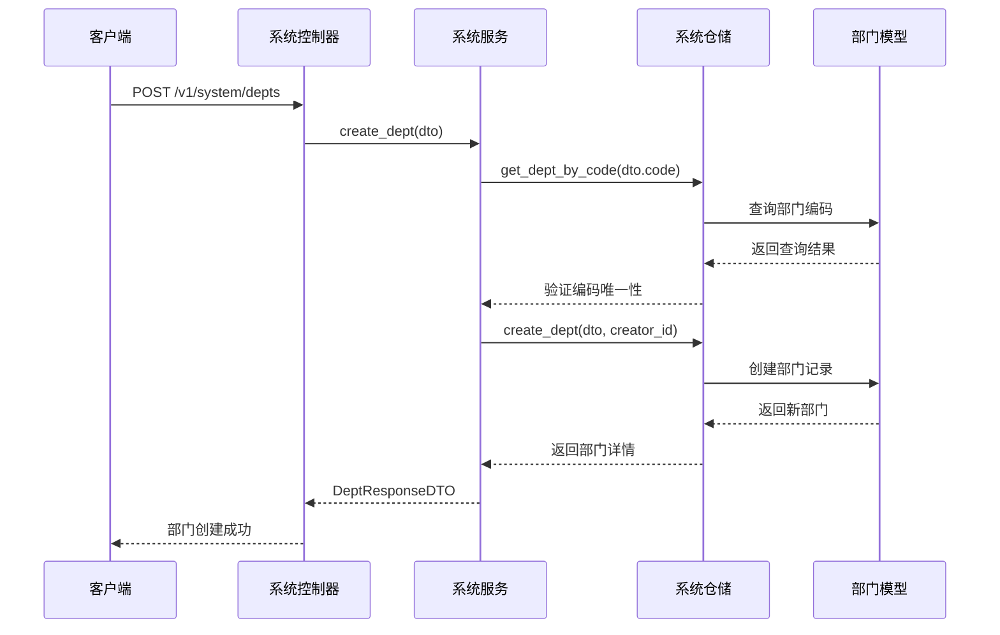
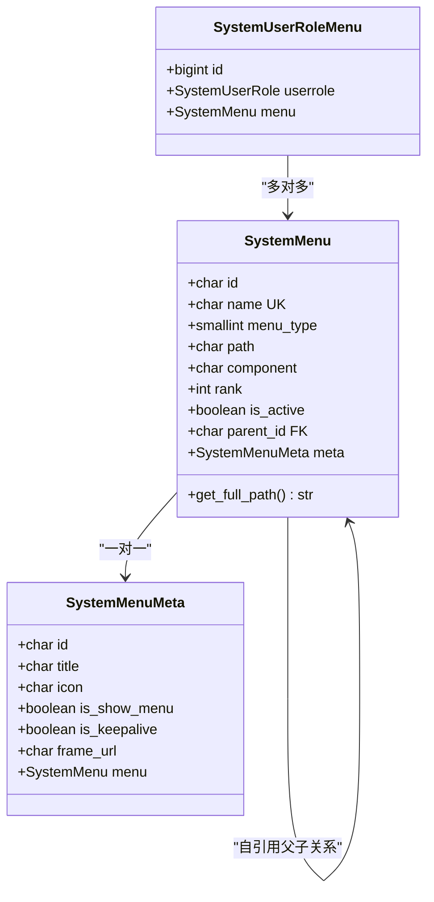
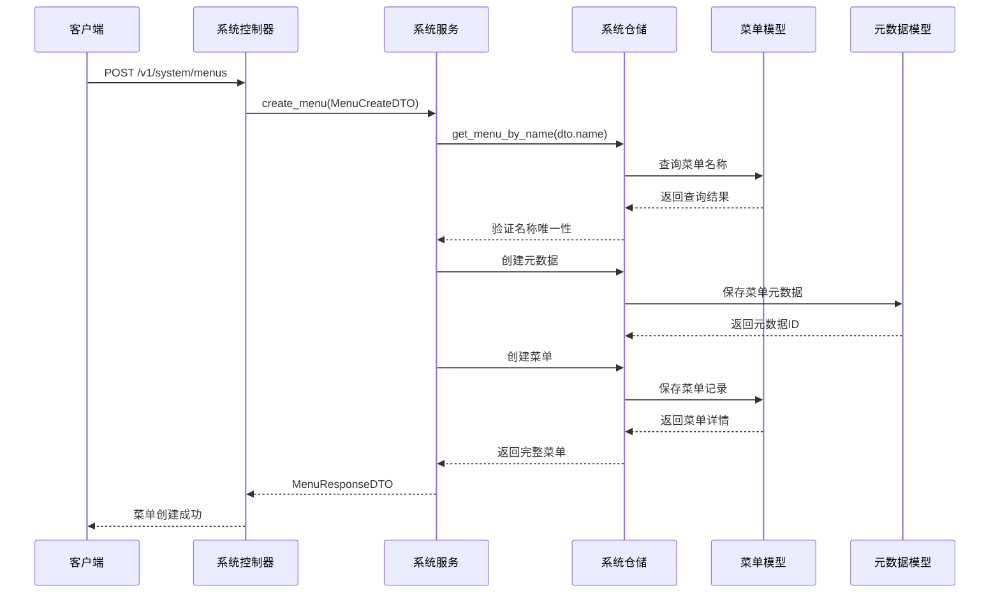
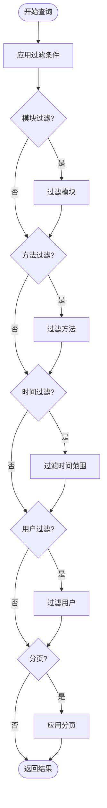
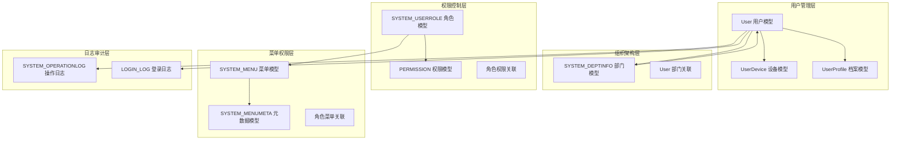
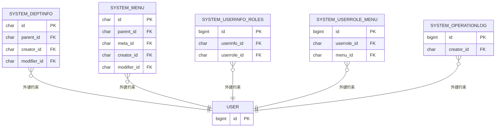
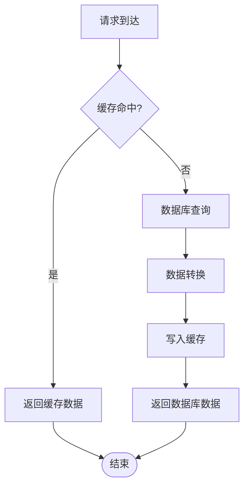

# 系统配置数据模型

<cite>
**本文档引用的文件**
- [system_models.py](file://src/infrastructure/persistence/models/system_models.py)
- [dept_dto.py](file://src/application/dto/system/dept_dto.py)
- [menu_dto.py](file://src/application/dto/system/menu_dto.py)
- [log_dto.py](file://src/application/dto/system/log_dto.py)
- [system_service.py](file://src/application/services/system_service.py)
- [system_repo_impl.py](file://src/infrastructure/repositories/system_repo_impl.py)
- [system_controller.py](file://src/api/v1/controllers/system_controller.py)
- [user_models.py](file://src/infrastructure/persistence/models/user_models.py)
- [rbac_models.py](file://src/infrastructure/persistence/models/rbac_models.py)
- [security_models.py](file://src/infrastructure/persistence/models/security_models.py)
- [auth_models.py](file://src/infrastructure/persistence/models/auth_models.py)
- [rbac.sql](file://sql/rbac.sql)
- [0001_initial.py](file://src/infrastructure/persistence/migrations/0001_initial.py)
</cite>

## 目录
1. [项目概述](#项目概述)
2. [系统架构总览](#系统架构总览)
3. [核心数据模型详解](#核心数据模型详解)
4. [部门管理模型](#部门管理模型)
5. [菜单权限模型](#菜单权限模型)
6. [日志记录模型](#日志记录模型)
7. [系统关系图谱](#系统关系图谱)
8. [数据完整性约束](#数据完整性约束)
9. [性能优化策略](#性能优化策略)
10. [使用示例与最佳实践](#使用示例与最佳实践)
11. [故障排除指南](#故障排除指南)
12. [总结](#总结)

## 项目概述

Hello-Django-Ninja-Api 是一个基于 Django Ninja 构建的企业级 API 服务框架，专注于 RBAC 权限管理和系统配置管理。本项目采用分层架构设计，将业务逻辑、数据访问和表现层清晰分离，提供了完整的系统配置数据模型解决方案。

项目的核心特点包括：
- **模块化设计**：按功能域划分目录结构，便于维护和扩展
- **类型安全**：使用 Pydantic DTO 进行数据验证和序列化
- **异步支持**：全面采用 async/await 模式提升并发性能
- **权限控制**：完善的 RBAC 权限管理体系
- **审计追踪**：完整的操作日志和登录日志记录

## 系统架构总览



**图表来源**
- [system_controller.py:60-734](file://src/api/v1/controllers/system_controller.py#L60-L734)
- [system_service.py:25-435](file://src/application/services/system_service.py#L25-L435)
- [system_repo_impl.py:22-505](file://src/infrastructure/repositories/system_repo_impl.py#L22-L505)

## 核心数据模型详解

### 系统配置数据模型概览

系统配置数据模型是整个应用的核心基础，主要包含以下关键组件：

1. **部门管理模型**：支持树形结构的组织架构管理
2. **菜单权限模型**：完整的菜单和权限管理系统
3. **日志记录模型**：全面的操作审计和监控
4. **用户角色模型**：基于 RBAC 的权限控制体系

### 数据模型关系图



**图表来源**
- [system_models.py:12-395](file://src/infrastructure/persistence/models/system_models.py#L12-L395)
- [user_models.py:12-147](file://src/infrastructure/persistence/models/user_models.py#L12-L147)
- [rbac_models.py:13-148](file://src/infrastructure/persistence/models/rbac_models.py#L13-L148)

## 部门管理模型

### SystemDeptInfo 模型设计

SystemDeptInfo 是部门管理的核心模型，采用了先进的树形结构设计来支持复杂的组织架构管理。

#### 核心属性设计

| 属性名 | 类型 | 约束 | 描述 |
|--------|------|------|------|
| id | CharField | 主键, 32字符 | 部门唯一标识符 |
| code | CharField | 唯一, 索引 | 部门编码, 全局唯一 |
| name | CharField | 必填 | 部门名称 |
| rank | IntegerField | 默认0 | 排序权重, 数值越小排前面 |
| is_active | BooleanField | 默认True | 部门状态, 控制启用/停用 |
| parent | ForeignKey | 自引用, 级联设置NULL | 上级部门, 支持多级嵌套 |
| dept_belong | ForeignKey | 自引用, 级联设置NULL | 归属部门, 用于跨部门协作 |

#### 树形结构实现



**图表来源**
- [system_models.py:12-83](file://src/infrastructure/persistence/models/system_models.py#L12-L83)
- [user_models.py:32-49](file://src/infrastructure/persistence/models/user_models.py#L32-L49)

#### 关键特性

1. **完整的树形遍历**：支持无限层级的部门嵌套
2. **路径生成**：自动计算部门完整路径
3. **双重关联**：支持正式部门和归属部门的双重关系
4. **状态管理**：通过 is_active 字段控制部门启用状态

**章节来源**
- [system_models.py:12-83](file://src/infrastructure/persistence/models/system_models.py#L12-L83)
- [dept_dto.py:11-94](file://src/application/dto/system/dept_dto.py#L11-L94)

### 部门管理流程



**图表来源**
- [system_controller.py:107-130](file://src/api/v1/controllers/system_controller.py#L107-L130)
- [system_service.py:36-48](file://src/application/services/system_service.py#L36-L48)
- [system_repo_impl.py:27-44](file://src/infrastructure/repositories/system_repo_impl.py#L27-L44)

## 菜单权限模型

### SystemMenu 和 SystemMenuMeta 模型设计

菜单权限模型采用"菜单 + 元数据"的分离设计，实现了灵活的前端配置和后端权限控制。

#### SystemMenu 模型

| 属性名 | 类型 | 约束 | 描述 |
|--------|------|------|------|
| id | CharField | 主键, 32字符 | 菜单唯一标识符 |
| name | CharField | 唯一, 必填 | 菜单名称, 全局唯一 |
| menu_type | SmallIntegerField | 枚举: 0-目录,1-菜单,2-按钮 | 菜单类型 |
| path | CharField | 必填 | 路由路径 |
| component | CharField | 可选 | Vue 组件路径 |
| rank | IntegerField | 默认0 | 排序权重 |
| is_active | BooleanField | 默认True | 菜单状态 |
| method | CharField | 可选 | HTTP 方法 (GET/POST/PUT/DELETE) |

#### SystemMenuMeta 模型

SystemMenuMeta 专门存储前端展示相关的配置信息：

| 属性名 | 类型 | 约束 | 描述 |
|--------|------|------|------|
| title | CharField | 可选 | 菜单标题 |
| icon | CharField | 可选 | 图标名称 |
| is_show_menu | BooleanField | 默认True | 是否显示菜单 |
| is_keepalive | BooleanField | 默认True | 是否缓存页面 |
| frame_url | URLField | 可选 | iframe 地址 |
| transition_enter | CharField | 可选 | 进入动画 |
| transition_leave | CharField | 可选 | 离开动画 |

#### 菜单树形结构实现



**图表来源**
- [system_models.py:141-217](file://src/infrastructure/persistence/models/system_models.py#L141-L217)
- [system_models.py:85-139](file://src/infrastructure/persistence/models/system_models.py#L85-L139)

#### 菜单类型枚举

```mermaid
flowchart TD
MenuType[菜单类型] --> Directory[0 - 目录]
MenuType --> Menu[1 - 菜单]
MenuType --> Button[2 - 按钮]
Directory --> "用于分组导航<br/>无路由跳转"
Menu --> "可路由的页面<br/>包含组件路径"
Button --> "页面内的操作按钮<br/>用于细粒度权限"
```

**图表来源**
- [system_models.py:147-151](file://src/infrastructure/persistence/models/system_models.py#L147-L151)

**章节来源**
- [system_models.py:85-217](file://src/infrastructure/persistence/models/system_models.py#L85-L217)
- [menu_dto.py:11-158](file://src/application/dto/system/menu_dto.py#L11-L158)

### 菜单权限管理流程



**图表来源**
- [system_controller.py:256-281](file://src/api/v1/controllers/system_controller.py#L256-L281)
- [system_service.py:147-159](file://src/application/services/system_service.py#L147-L159)
- [system_repo_impl.py:129-166](file://src/infrastructure/repositories/system_repo_impl.py#L129-L166)

## 日志记录模型

### 操作日志模型

系统提供了两套完整的日志记录机制：操作日志和登录日志。

#### SystemOperationLog 模型

操作日志记录用户在系统中的所有操作行为：

| 属性名 | 类型 | 约束 | 描述 |
|--------|------|------|------|
| id | BigAutoField | 主键 | 日志唯一标识符 |
| module | CharField | 可选 | 模块名称 |
| path | CharField | 可选 | 请求路径 |
| method | CharField | 可选 | HTTP 方法 |
| body | TextField | 可选 | 请求体内容 |
| ipaddress | CharField | 可选 | IP 地址 |
| browser | CharField | 可选 | 浏览器信息 |
| system | CharField | 可选 | 操作系统 |
| response_code | IntegerField | 可选 | 响应状态码 |
| response_result | TextField | 可选 | 响应结果 |
| status_code | IntegerField | 可选 | 业务状态码 |
| description | TextField | 可选 | 描述信息 |

#### 登录日志模型

登录日志专门记录用户的登录行为：

| 属性名 | 类型 | 约束 | 描述 |
|--------|------|------|------|
| id | UUIDField | 主键 | 登录日志唯一标识符 |
| username | CharField | 必填 | 用户名 |
| ip_address | GenericIPAddressField | 必填 | 登录IP地址 |
| user_agent | TextField | 可选 | 用户代理信息 |
| device_info | CharField | 可选 | 设备信息 |
| browser | CharField | 可选 | 浏览器信息 |
| os | CharField | 可选 | 操作系统 |
| login_status | BooleanField | 默认True | 登录状态 |
| fail_reason | CharField | 可选 | 失败原因 |
| login_time | DateTimeField | 自动添加 | 登录时间 |

#### 日志查询流程



**图表来源**
- [system_repo_impl.py:465-497](file://src/infrastructure/repositories/system_repo_impl.py#L465-L497)
- [log_dto.py:34-57](file://src/application/dto/system/log_dto.py#L34-L57)

**章节来源**
- [system_models.py:219-271](file://src/infrastructure/persistence/models/system_models.py#L219-L271)
- [auth_models.py:79-113](file://src/infrastructure/persistence/models/auth_models.py#L79-L113)
- [log_dto.py:11-57](file://src/application/dto/system/log_dto.py#L11-L57)

## 系统关系图谱

### 完整的数据模型关系图



**图表来源**
- [user_models.py:12-147](file://src/infrastructure/persistence/models/user_models.py#L12-L147)
- [system_models.py:12-395](file://src/infrastructure/persistence/models/system_models.py#L12-L395)
- [rbac_models.py:13-148](file://src/infrastructure/persistence/models/rbac_models.py#L13-L148)
- [auth_models.py:79-113](file://src/infrastructure/persistence/models/auth_models.py#L79-L113)

## 数据完整性约束

### 数据库约束设计

系统在数据库层面实施了严格的完整性约束，确保数据的一致性和准确性。

#### 主键和唯一性约束

| 表名 | 主键列 | 唯一约束 | 说明 |
|------|--------|----------|------|
| system_deptinfo | id | code | 部门编码全局唯一 |
| system_menu | id | name, meta_id | 菜单名称和元数据唯一 |
| system_userinfo | id | username, email | 用户名和邮箱唯一 |
| system_userrole | id | code, name | 角色编码和名称唯一 |
| permissions | id | code | 权限代码唯一 |
| user_roles | (user, role) | 复合唯一 | 用户角色关系唯一 |

#### 外键约束



**图表来源**
- [rbac.sql:41-138](file://sql/rbac.sql#L41-L138)

#### 级联操作策略

| 操作类型 | 父表删除 | 子表删除 | 更新操作 |
|----------|----------|----------|----------|
| 部门删除 | 设置为空 | 级联删除 | 级联更新 |
| 菜单删除 | 设置为空 | 级联删除 | 级联更新 |
| 用户删除 | 级联删除 | 级联删除 | 级联更新 |
| 角色删除 | 级联删除 | 级联删除 | 级联更新 |

**章节来源**
- [rbac.sql:41-138](file://sql/rbac.sql#L41-L138)

## 性能优化策略

### 索引优化设计

系统在关键查询字段上建立了合理的索引策略，平衡查询性能和写入性能。

#### 核心索引策略

| 表名 | 索引字段 | 索引类型 | 使用场景 |
|------|----------|----------|----------|
| system_deptinfo | code | 唯一索引 | 部门编码查询 |
| system_deptinfo | parent_id | 普通索引 | 部门树查询 |
| system_menu | name | 唯一索引 | 菜单名称查询 |
| system_menu | parent_id | 普通索引 | 菜单树查询 |
| system_operationlog | creator_id | 普通索引 | 用户日志查询 |
| system_operationlog | created_time | 普通索引 | 时间范围查询 |
| system_userinfo | username | 普通索引 | 用户名查询 |
| system_userinfo | email | 普通索引 | 邮箱查询 |

#### 查询性能优化

1. **选择性查询**：优先使用高选择性的字段进行过滤
2. **复合索引**：为常用组合查询建立复合索引
3. **延迟加载**：使用 select_related 和 prefetch_related 减少查询次数
4. **分页查询**：对大数据量查询实施分页策略

### 缓存策略



**图表来源**
- [system_repo_impl.py:129-166](file://src/infrastructure/repositories/system_repo_impl.py#L129-L166)

## 使用示例与最佳实践

### 系统初始化配置

#### 部门初始化示例

```python
# 创建根部门
root_dept = await system_service.create_dept(
    DeptCreateDTO(
        name="总公司",
        code="ROOT_COMPANY",
        rank=0,
        is_active=True,
        description="集团总部"
    )
)

# 创建子公司部门
sub_company = await system_service.create_dept(
    DeptCreateDTO(
        name="技术子公司",
        code="TECH_SUB",
        rank=1,
        parent_id=root_dept.id,
        is_active=True,
        description="技术开发子公司"
    )
)
```

#### 菜单权限配置示例

```python
# 创建用户管理菜单
user_menu = await system_service.create_menu(
    MenuCreateDTO(
        name="user_management",
        menu_type=1,
        path="/system/user",
        component="system/user/index",
        rank=1,
        is_active=True,
        method="GET",
        meta=MenuMetaCreateDTO(
            title="用户管理",
            icon="user",
            is_show_menu=True,
            is_keepalive=True
        )
    )
)
```

#### 角色权限分配示例

```python
# 创建管理员角色并分配菜单权限
admin_role = await system_service.create_role(
    RoleCreateDTO(
        name="系统管理员",
        code="ADMIN",
        is_active=True,
        description="系统超级管理员",
        menu_ids=[user_menu.id, ...]  # 分配菜单权限
    )
)

# 为用户分配角色
await system_service.assign_roles_to_user(
    user_id=1,
    role_ids=[admin_role.id]
)
```

#### 日志查询示例

```python
# 查询操作日志
filters = LogFilterDTO(
    module="用户管理",
    method="POST",
    start_time=datetime(2024, 1, 1),
    end_time=datetime(2024, 12, 31),
    page=1,
    page_size=20
)

logs, total = await system_service.list_operation_logs(filters)
```

### 最佳实践建议

1. **数据验证**：始终使用 DTO 进行输入验证
2. **异常处理**：合理处理业务异常和数据库异常
3. **事务管理**：复杂操作使用事务保证数据一致性
4. **性能监控**：定期监控查询性能和数据库负载
5. **安全审计**：重要操作必须记录审计日志

**章节来源**
- [system_controller.py:107-252](file://src/api/v1/controllers/system_controller.py#L107-L252)
- [system_service.py:36-435](file://src/application/services/system_service.py#L36-L435)

## 故障排除指南

### 常见问题及解决方案

#### 部门相关问题

| 问题类型 | 症状 | 原因分析 | 解决方案 |
|----------|------|----------|----------|
| 部门编码重复 | 创建失败，抛出重复错误 | 数据库唯一约束 | 修改部门编码或删除重复数据 |
| 删除部门失败 | 抛出"存在子部门"错误 | 存在子部门关联 | 先删除子部门再删除父部门 |
| 部门树查询慢 | 树形结构查询耗时较长 | 缺少索引或N+1查询 | 添加parent_id索引，使用select_related |

#### 菜单权限问题

| 问题类型 | 症状 | 原因分析 | 解决方案 |
|----------|------|----------|----------|
| 菜单名称重复 | 创建失败 | 唯一约束冲突 | 修改菜单名称或删除重复菜单 |
| 权限分配失败 | 角色权限不生效 | 菜单权限关联异常 | 检查角色菜单关联表数据 |
| 菜单树显示异常 | 子菜单显示错误 | 父子关系配置错误 | 检查parent_id字段配置 |

#### 日志查询问题

| 问题类型 | 症状 | 原因分析 | 解决方案 |
|----------|------|----------|----------|
| 日志查询超时 | 大数据量查询缓慢 | 缺少时间索引 | 为created_time建立索引 |
| 日志数据丢失 | 查询结果为空 | 分页参数错误 | 检查page和page_size参数 |
| 日志格式异常 | 字段显示乱码 | 编码问题 | 确保数据库字符集正确 |

### 调试技巧

1. **SQL 日志**：开启 Django SQL 日志查看执行的 SQL 语句
2. **性能分析**：使用 Django Debug Toolbar 分析查询性能
3. **异常追踪**：查看系统异常日志定位问题根源
4. **数据验证**：使用 Pydantic 验证器检查数据格式

**章节来源**
- [system_service.py:72-86](file://src/application/services/system_service.py#L72-L86)
- [system_repo_impl.py:465-497](file://src/infrastructure/repositories/system_repo_impl.py#L465-L497)

## 总结

Hello-Django-Ninja-Api 的系统配置数据模型设计体现了现代企业级应用的最佳实践：

### 核心优势

1. **完整的权限体系**：基于 RBAC 的细粒度权限控制
2. **灵活的组织架构**：支持多层级部门管理和跨部门协作
3. **全面的审计功能**：操作日志和登录日志的完整记录
4. **高性能设计**：合理的索引策略和查询优化
5. **类型安全**：Pydantic DTO 提供编译时类型检查

### 技术亮点

- **异步架构**：全面支持 async/await 提升并发性能
- **模块化设计**：清晰的分层架构便于维护和扩展
- **数据完整性**：严格的数据库约束保证数据一致性
- **监控审计**：完整的日志记录支持合规要求

### 发展方向

随着业务的发展，系统可以在以下方面进一步优化：
- 引入缓存层提升查询性能
- 增加数据备份和恢复机制
- 扩展更多类型的权限控制
- 集成更丰富的监控和告警功能

这个系统配置数据模型为构建企业级应用提供了坚实的基础，通过合理的架构设计和完善的权限控制，能够满足大多数企业的管理需求。