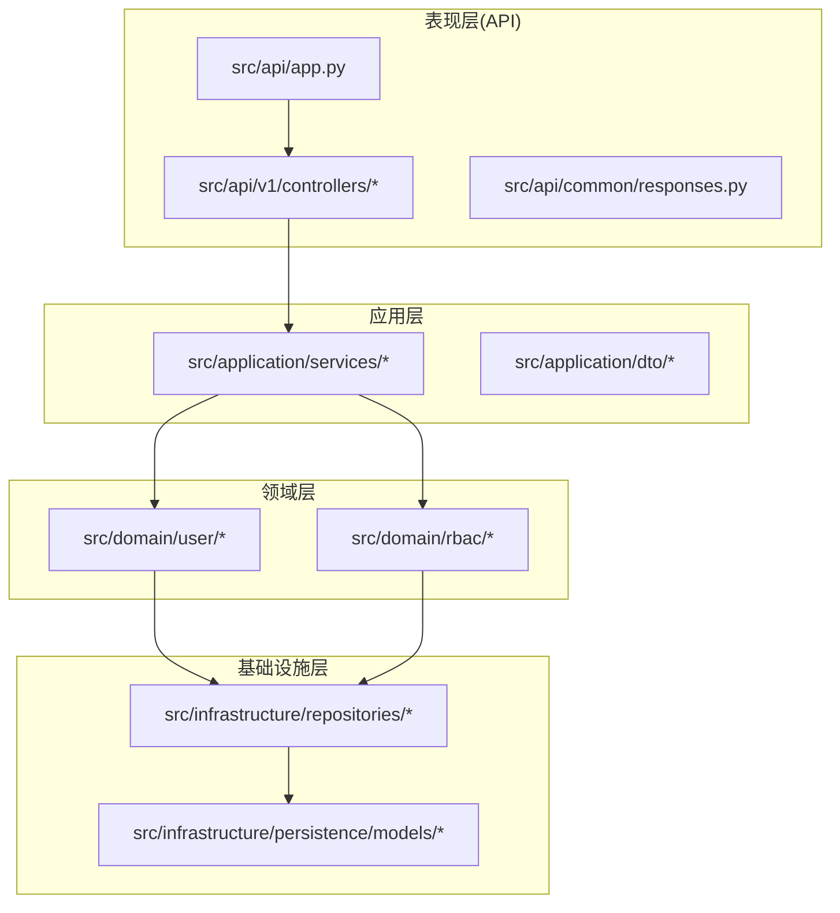
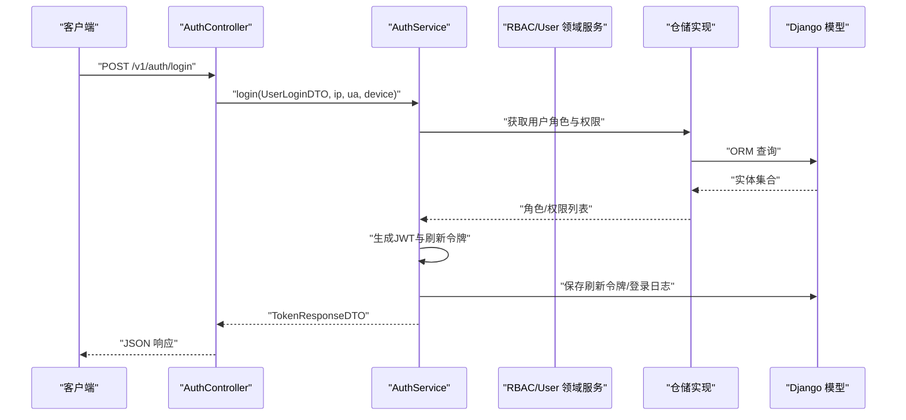
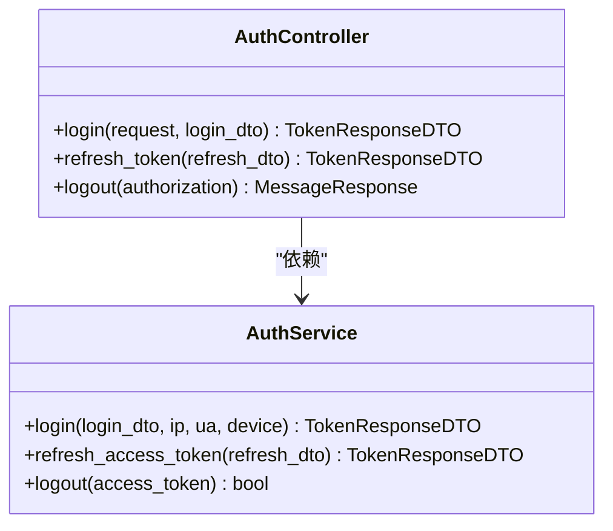
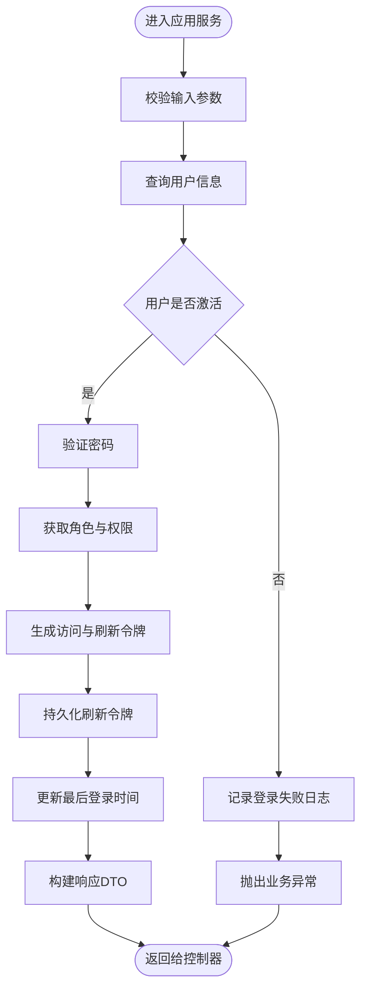
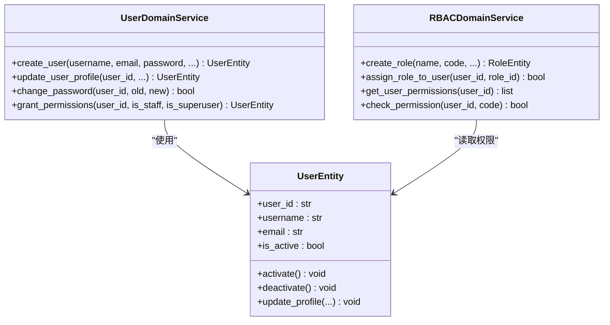
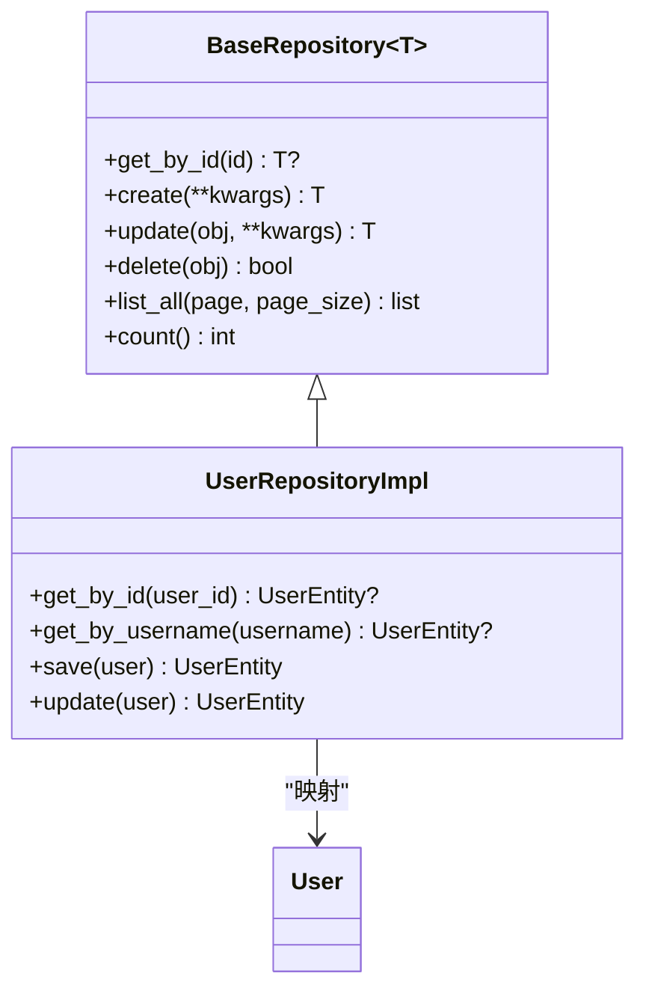
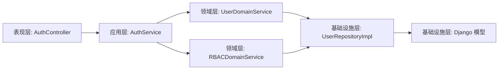

# DDD 分层架构

<cite>
**本文引用的文件**
- [src/api/app.py](file://src/api/app.py)
- [src/api/v1/controllers/__init__.py](file://src/api/v1/controllers/__init__.py)
- [src/api/v1/controllers/auth_controller.py](file://src/api/v1/controllers/auth_controller.py)
- [src/api/common/responses.py](file://src/api/common/responses.py)
- [src/application/services/auth_service.py](file://src/application/services/auth_service.py)
- [src/application/dto/auth/token_response_dto.py](file://src/application/dto/auth/token_response_dto.py)
- [src/domain/rbac/services/rbac_domain_service.py](file://src/domain/rbac/services/rbac_domain_service.py)
- [src/domain/user/entities/user_entity.py](file://src/domain/user/entities/user_entity.py)
- [src/domain/user/services/user_domain_service.py](file://src/domain/user/services/user_domain_service.py)
- [src/infrastructure/repositories/base_repository.py](file://src/infrastructure/repositories/base_repository.py)
- [src/infrastructure/repositories/user_repo_impl.py](file://src/infrastructure/repositories/user_repo_impl.py)
- [src/infrastructure/persistence/models/user_models.py](file://src/infrastructure/persistence/models/user_models.py)
</cite>

## 目录
1. [引言](#引言)
2. [项目结构](#项目结构)
3. [核心组件](#核心组件)
4. [架构总览](#架构总览)
5. [详细组件分析](#详细组件分析)
6. [依赖分析](#依赖分析)
7. [性能考虑](#性能考虑)
8. [故障排查指南](#故障排查指南)
9. [结论](#结论)
10. [附录](#附录)

## 引言
本文件面向 Hello-Django-Ninja-Api 项目，系统性阐述其采用的领域驱动设计（DDD）四层架构：表现层（API 层）、应用层、领域层与基础设施层。文档旨在帮助开发者理解每层职责边界、组件组织方式与层间通信机制，并通过具体代码示例展示控制器如何调用应用服务、应用服务如何协调领域服务、仓储模式如何实现数据访问。

## 项目结构
项目采用按层分包的组织方式，清晰划分职责：
- 表现层（API 层）：负责 HTTP 请求处理、路由注册与响应格式化
- 应用层：封装业务用例与协调领域对象
- 领域层：包含核心业务逻辑与实体
- 基础设施层：提供技术支撑，如数据库访问、缓存与外部服务集成

**图表来源**
- [src/api/app.py:1-48](file://src/api/app.py#L1-L48)
- [src/api/v1/controllers/auth_controller.py:1-133](file://src/api/v1/controllers/auth_controller.py#L1-L133)
- [src/application/services/auth_service.py:1-233](file://src/application/services/auth_service.py#L1-L233)
- [src/domain/user/services/user_domain_service.py:1-117](file://src/domain/user/services/user_domain_service.py#L1-L117)
- [src/domain/rbac/services/rbac_domain_service.py:1-144](file://src/domain/rbac/services/rbac_domain_service.py#L1-L144)
- [src/infrastructure/repositories/user_repo_impl.py:1-140](file://src/infrastructure/repositories/user_repo_impl.py#L1-L140)
- [src/infrastructure/persistence/models/user_models.py:1-147](file://src/infrastructure/persistence/models/user_models.py#L1-L147)

**章节来源**
- [src/api/app.py:1-48](file://src/api/app.py#L1-L48)
- [src/api/v1/controllers/__init__.py:1-19](file://src/api/v1/controllers/__init__.py#L1-L19)

## 核心组件
- 表现层（API 层）
  - API 实例与路由注册：在应用入口创建 API 实例并注册控制器，提供健康检查与根路径响应。
  - 控制器：以装饰器方式声明路由，接收请求体与头部参数，调用应用服务并返回 DTO 或统一响应对象。
  - 统一响应：提供消息响应、分页响应与响应工厂，保证输出一致性。
- 应用层（Application）
  - 应用服务：封装业务用例，协调领域服务与基础设施组件，处理业务流程与异常。
  - DTO：定义输入输出的数据结构，确保跨层数据契约稳定。
- 领域层（Domain）
  - 实体：承载核心业务状态与行为，如用户实体。
  - 领域服务：处理跨实体的业务规则与流程，如用户领域服务与 RBAC 领域服务。
  - 仓储接口：抽象数据访问契约，隔离实现细节。
- 基础设施层（Infrastructure）
  - 仓储实现：基于 Django ORM 的具体实现，完成实体与模型之间的映射与持久化。
  - 模型：定义数据库表结构与索引，支撑领域实体的持久化。
  - 缓存与 JWT：提供令牌管理与缓存策略，支撑认证与会话管理。

**章节来源**
- [src/api/app.py:16-36](file://src/api/app.py#L16-L36)
- [src/api/v1/controllers/auth_controller.py:16-35](file://src/api/v1/controllers/auth_controller.py#L16-L35)
- [src/api/common/responses.py:13-110](file://src/api/common/responses.py#L13-L110)
- [src/application/services/auth_service.py:20-233](file://src/application/services/auth_service.py#L20-L233)
- [src/application/dto/auth/token_response_dto.py:9-32](file://src/application/dto/auth/token_response_dto.py#L9-L32)
- [src/domain/user/entities/user_entity.py:11-120](file://src/domain/user/entities/user_entity.py#L11-L120)
- [src/domain/user/services/user_domain_service.py:10-117](file://src/domain/user/services/user_domain_service.py#L10-L117)
- [src/domain/rbac/services/rbac_domain_service.py:11-144](file://src/domain/rbac/services/rbac_domain_service.py#L11-L144)
- [src/infrastructure/repositories/base_repository.py:13-90](file://src/infrastructure/repositories/base_repository.py#L13-L90)
- [src/infrastructure/repositories/user_repo_impl.py:13-140](file://src/infrastructure/repositories/user_repo_impl.py#L13-L140)
- [src/infrastructure/persistence/models/user_models.py:12-147](file://src/infrastructure/persistence/models/user_models.py#L12-L147)

## 架构总览
下图展示了从 HTTP 请求到数据持久化的完整链路，体现四层职责与依赖方向：

**图表来源**
- [src/api/v1/controllers/auth_controller.py:42-78](file://src/api/v1/controllers/auth_controller.py#L42-L78)
- [src/application/services/auth_service.py:26-112](file://src/application/services/auth_service.py#L26-L112)
- [src/domain/rbac/services/rbac_domain_service.py:119-139](file://src/domain/rbac/services/rbac_domain_service.py#L119-L139)
- [src/domain/user/services/user_domain_service.py:19-40](file://src/domain/user/services/user_domain_service.py#L19-L40)
- [src/infrastructure/repositories/user_repo_impl.py:72-106](file://src/infrastructure/repositories/user_repo_impl.py#L72-L106)
- [src/infrastructure/persistence/models/user_models.py:12-84](file://src/infrastructure/persistence/models/user_models.py#L12-84)

## 详细组件分析

### 表现层（API 层）
- API 实例与路由注册
  - 在应用入口创建 API 实例并注册控制器，提供健康检查与根路径响应，便于快速验证服务可用性。
- 控制器职责
  - 仅处理 HTTP 请求与响应格式化，不包含业务逻辑。
  - 通过依赖注入获取应用服务实例，调用其业务方法并返回 DTO 或统一响应对象。
- 统一响应
  - 提供消息响应、分页响应与响应工厂，保证输出结构一致，便于前端消费。

**图表来源**
- [src/api/v1/controllers/auth_controller.py:16-133](file://src/api/v1/controllers/auth_controller.py#L16-L133)
- [src/application/services/auth_service.py:20-233](file://src/application/services/auth_service.py#L20-L233)

**章节来源**
- [src/api/app.py:16-36](file://src/api/app.py#L16-L36)
- [src/api/v1/controllers/auth_controller.py:16-133](file://src/api/v1/controllers/auth_controller.py#L16-L133)
- [src/api/common/responses.py:13-110](file://src/api/common/responses.py#L13-L110)

### 应用层（Application）
- 业务用例封装
  - 应用服务聚合多个领域服务与基础设施组件，形成完整的业务流程。
  - 示例：认证服务在登录流程中校验凭据、获取用户角色与权限、生成令牌、记录日志与持久化刷新令牌。
- DTO 设计
  - 输入 DTO（如登录 DTO）与输出 DTO（如令牌响应 DTO）明确数据契约，避免跨层耦合。
- 异常处理
  - 将底层异常转换为业务语义明确的错误，便于上层统一处理。

**图表来源**
- [src/application/services/auth_service.py:26-112](file://src/application/services/auth_service.py#L26-L112)
- [src/application/dto/auth/token_response_dto.py:9-32](file://src/application/dto/auth/token_response_dto.py#L9-L32)

**章节来源**
- [src/application/services/auth_service.py:20-233](file://src/application/services/auth_service.py#L20-L233)
- [src/application/dto/auth/token_response_dto.py:9-32](file://src/application/dto/auth/token_response_dto.py#L9-L32)

### 领域层（Domain）
- 实体与值对象
  - 用户实体包含业务状态与行为，如激活/停用、更新资料、生成全名等。
- 领域服务
  - 用户领域服务：封装创建用户、更新资料、修改密码、授权等核心业务逻辑。
  - RBAC 领域服务：封装角色与权限的创建、查询、分配与校验等业务规则。
- 仓储接口
  - 抽象数据访问契约，隔离实现细节，使领域对象专注于业务逻辑。

**图表来源**
- [src/domain/user/entities/user_entity.py:11-120](file://src/domain/user/entities/user_entity.py#L11-L120)
- [src/domain/user/services/user_domain_service.py:10-117](file://src/domain/user/services/user_domain_service.py#L10-L117)
- [src/domain/rbac/services/rbac_domain_service.py:11-144](file://src/domain/rbac/services/rbac_domain_service.py#L11-L144)

**章节来源**
- [src/domain/user/entities/user_entity.py:11-120](file://src/domain/user/entities/user_entity.py#L11-L120)
- [src/domain/user/services/user_domain_service.py:10-117](file://src/domain/user/services/user_domain_service.py#L10-L117)
- [src/domain/rbac/services/rbac_domain_service.py:11-144](file://src/domain/rbac/services/rbac_domain_service.py#L11-L144)

### 基础设施层（Infrastructure）
- 仓储实现
  - 基础仓储提供通用 CRUD 方法，具体仓储实现负责实体与模型之间的映射与持久化。
  - 用户仓储实现：将领域实体映射为 Django 模型，支持异步查询与保存。
- 模型定义
  - 用户模型扩展 Django 内置用户模型，支持 RBAC 与部门管理，定义索引与元信息。
- 缓存与 JWT
  - 应用服务通过缓存管理器与 JWT 管理器进行令牌缓存与校验，支撑认证流程。

**图表来源**
- [src/infrastructure/repositories/base_repository.py:13-90](file://src/infrastructure/repositories/base_repository.py#L13-L90)
- [src/infrastructure/repositories/user_repo_impl.py:13-140](file://src/infrastructure/repositories/user_repo_impl.py#L13-L140)
- [src/infrastructure/persistence/models/user_models.py:12-147](file://src/infrastructure/persistence/models/user_models.py#L12-L147)

**章节来源**
- [src/infrastructure/repositories/base_repository.py:13-90](file://src/infrastructure/repositories/base_repository.py#L13-L90)
- [src/infrastructure/repositories/user_repo_impl.py:13-140](file://src/infrastructure/repositories/user_repo_impl.py#L13-L140)
- [src/infrastructure/persistence/models/user_models.py:12-147](file://src/infrastructure/persistence/models/user_models.py#L12-L147)

## 依赖分析
- 层内职责清晰，层间依赖单向向下（表现层 → 应用层 → 领域层 → 基础设施层）
- 控制器仅依赖应用服务接口，应用服务依赖领域服务与基础设施组件
- 领域层通过仓储接口隔离实现，避免直接依赖具体 ORM

**图表来源**
- [src/api/v1/controllers/auth_controller.py:16-133](file://src/api/v1/controllers/auth_controller.py#L16-L133)
- [src/application/services/auth_service.py:20-233](file://src/application/services/auth_service.py#L20-L233)
- [src/domain/user/services/user_domain_service.py:10-117](file://src/domain/user/services/user_domain_service.py#L10-L117)
- [src/domain/rbac/services/rbac_domain_service.py:11-144](file://src/domain/rbac/services/rbac_domain_service.py#L11-L144)
- [src/infrastructure/repositories/user_repo_impl.py:13-140](file://src/infrastructure/repositories/user_repo_impl.py#L13-L140)
- [src/infrastructure/persistence/models/user_models.py:12-147](file://src/infrastructure/persistence/models/user_models.py#L12-L147)

**章节来源**
- [src/api/v1/controllers/auth_controller.py:16-133](file://src/api/v1/controllers/auth_controller.py#L16-L133)
- [src/application/services/auth_service.py:20-233](file://src/application/services/auth_service.py#L20-L233)
- [src/domain/user/services/user_domain_service.py:10-117](file://src/domain/user/services/user_domain_service.py#L10-L117)
- [src/domain/rbac/services/rbac_domain_service.py:11-144](file://src/domain/rbac/services/rbac_domain_service.py#L11-L144)
- [src/infrastructure/repositories/user_repo_impl.py:13-140](file://src/infrastructure/repositories/user_repo_impl.py#L13-L140)
- [src/infrastructure/persistence/models/user_models.py:12-147](file://src/infrastructure/persistence/models/user_models.py#L12-L147)

## 性能考虑
- 异步 ORM：应用服务与仓储实现广泛使用异步 ORM 方法，降低并发场景下的阻塞开销。
- 分页与过滤：基础仓储提供分页与过滤方法，建议在应用层合理设置分页大小，避免一次性加载过多数据。
- 缓存策略：应用服务在登出与令牌撤销时清理用户相关缓存，减少重复计算与数据库压力。
- 索引优化：模型定义了常用查询字段的索引，有助于提升查询性能。

## 故障排查指南
- 认证失败
  - 检查用户是否激活、密码是否正确，查看登录日志记录。
  - 关注应用服务中的登录失败分支与异常抛出点。
- 令牌刷新失败
  - 校验刷新令牌有效性与过期状态，确认用户角色与权限重新加载。
- 用户不存在或重复
  - 在创建用户时检查用户名与邮箱唯一性，关注领域服务与仓储实现的校验逻辑。
- 数据库查询异常
  - 检查模型索引与查询条件，确认异步查询方法使用正确。

**章节来源**
- [src/application/services/auth_service.py:36-56](file://src/application/services/auth_service.py#L36-L56)
- [src/domain/user/services/user_domain_service.py:23-29](file://src/domain/user/services/user_domain_service.py#L23-L29)
- [src/infrastructure/repositories/user_repo_impl.py:125-131](file://src/infrastructure/repositories/user_repo_impl.py#L125-L131)

## 结论
本项目通过 DDD 四层架构实现了清晰的职责分离与高内聚低耦合的代码组织。表现层专注请求处理与响应格式化，应用层封装业务用例，领域层聚焦核心业务逻辑与实体，基础设施层提供数据持久化与外部服务支撑。该架构有利于长期演进、测试隔离与团队协作。

## 附录
- 关键流程路径参考
  - 控制器调用应用服务：[src/api/v1/controllers/auth_controller.py:72-78](file://src/api/v1/controllers/auth_controller.py#L72-L78)
  - 应用服务登录流程：[src/application/services/auth_service.py:26-112](file://src/application/services/auth_service.py#L26-L112)
  - 领域服务创建用户：[src/domain/user/services/user_domain_service.py:19-40](file://src/domain/user/services/user_domain_service.py#L19-L40)
  - 仓储实现保存用户：[src/infrastructure/repositories/user_repo_impl.py:96-106](file://src/infrastructure/repositories/user_repo_impl.py#L96-L106)
  - 模型定义与索引：[src/infrastructure/persistence/models/user_models.py:71-80](file://src/infrastructure/persistence/models/user_models.py#L71-L80)