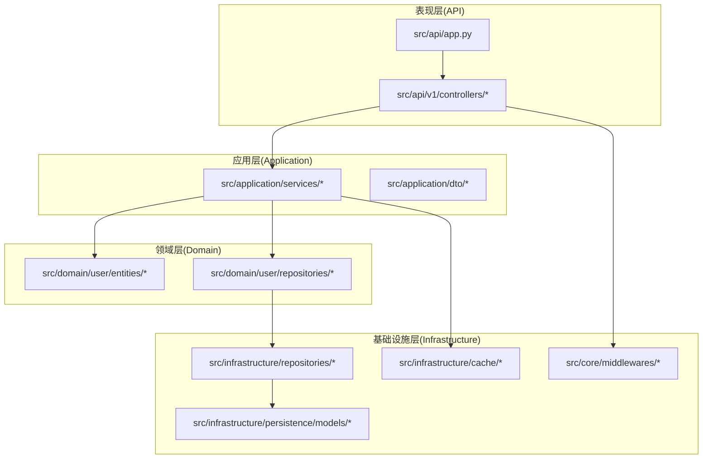
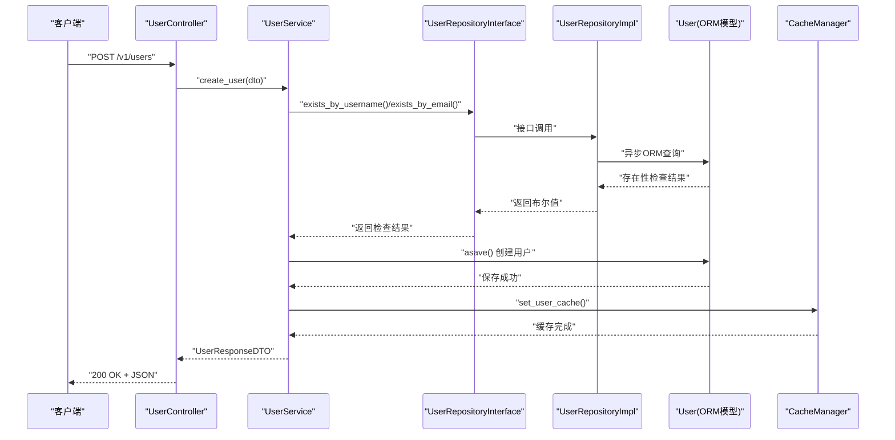
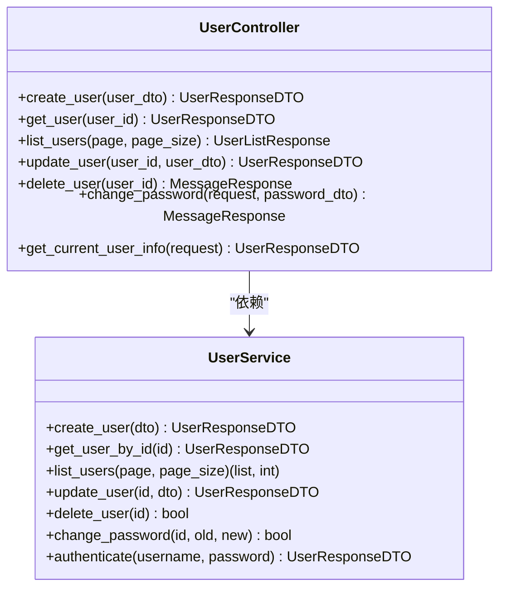
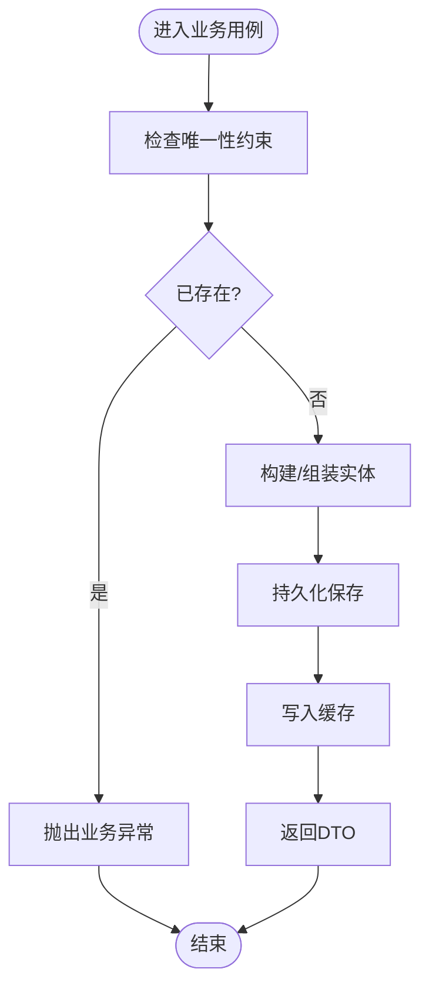
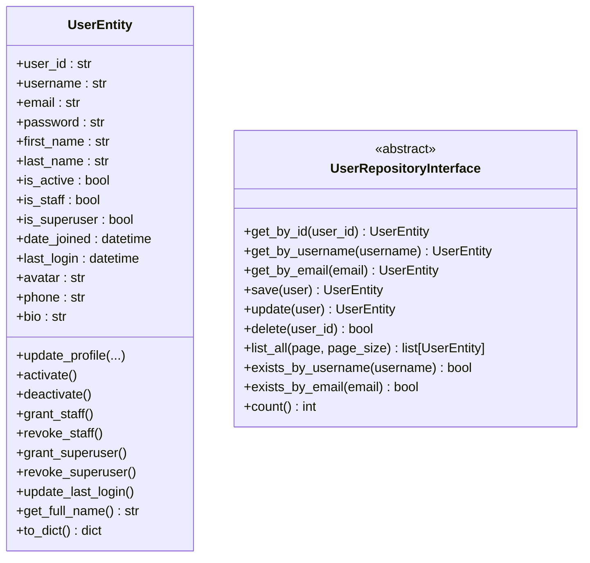
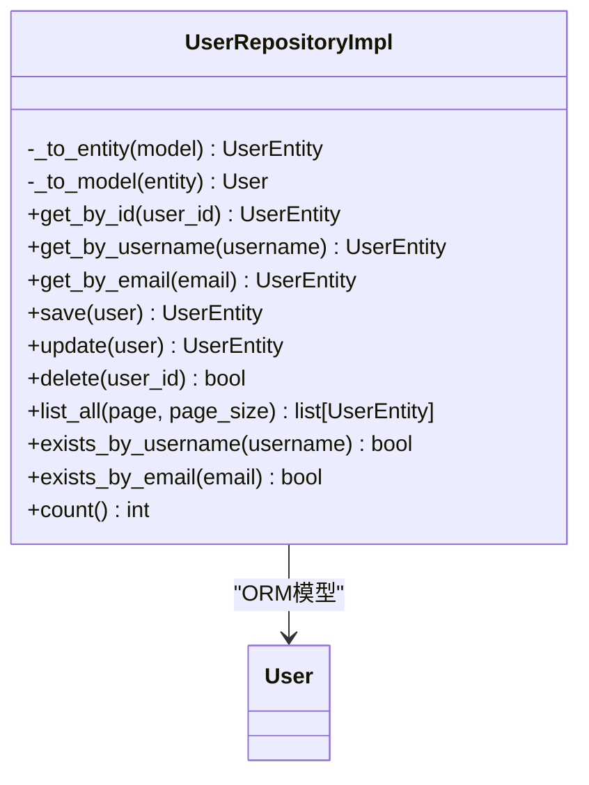
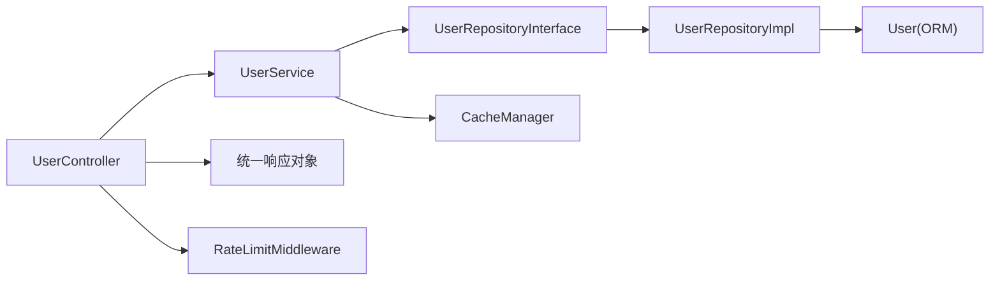

# DDD 分层架构

<cite>
**本文引用的文件**
- [src/api/app.py](file://src/api/app.py)
- [src/api/v1/controllers/user_controller.py](file://src/api/v1/controllers/user_controller.py)
- [src/application/services/user_service.py](file://src/application/services/user_service.py)
- [src/domain/user/entities/user_entity.py](file://src/domain/user/entities/user_entity.py)
- [src/domain/user/repositories/user_repository.py](file://src/domain/user/repositories/user_repository.py)
- [src/infrastructure/repositories/user_repo_impl.py](file://src/infrastructure/repositories/user_repo_impl.py)
- [src/infrastructure/persistence/models/user_models.py](file://src/infrastructure/persistence/models/user_models.py)
- [src/application/dto/user/user_create_dto.py](file://src/application/dto/user/user_create_dto.py)
- [src/application/dto/user/user_response_dto.py](file://src/application/dto/user/user_response_dto.py)
- [src/api/common/responses.py](file://src/api/common/responses.py)
- [src/core/middlewares/rate_limit_middleware.py](file://src/core/middlewares/rate_limit_middleware.py)
- [src/infrastructure/cache/cache_manager.py](file://src/infrastructure/cache/cache_manager.py)
- [src/infrastructure/repositories/base_repository.py](file://src/infrastructure/repositories/base_repository.py)
</cite>

## 目录
1. [引言](#引言)
2. [项目结构](#项目结构)
3. [核心组件](#核心组件)
4. [架构总览](#架构总览)
5. [详细组件分析](#详细组件分析)
6. [依赖分析](#依赖分析)
7. [性能考虑](#性能考虑)
8. [故障排查指南](#故障排查指南)
9. [结论](#结论)
10. [附录](#附录)

## 引言
本文件面向“Hello-Django-Ninja-Api”项目，系统阐述其采用的领域驱动设计（DDD）四层架构：表现层（API 控制器）、应用层（服务）、领域层（实体与领域服务）、基础设施层（仓储与持久化）。我们将明确每层职责边界、依赖方向与接口设计，解释依赖倒置原则在项目中的落地方式，并通过序列图与类图展示控制器调用服务、服务操作领域实体、仓储接口实现等交互模式。同时总结该架构在可测试性、可维护性与可扩展性方面的优势。

## 项目结构
项目采用按层次划分的目录组织方式，清晰体现 DDD 四层：
- 表现层：src/api，包含 API 应用入口与控制器
- 应用层：src/application，包含 DTO 与服务
- 领域层：src/domain，包含实体、仓储接口与领域服务
- 基础设施层：src/infrastructure，包含仓储实现、ORM 模型、缓存与中间件

图表来源
- [src/api/app.py:1-48](file://src/api/app.py#L1-L48)
- [src/api/v1/controllers/user_controller.py:1-283](file://src/api/v1/controllers/user_controller.py#L1-L283)
- [src/application/services/user_service.py:1-172](file://src/application/services/user_service.py#L1-L172)
- [src/domain/user/entities/user_entity.py:1-120](file://src/domain/user/entities/user_entity.py#L1-L120)
- [src/domain/user/repositories/user_repository.py:1-68](file://src/domain/user/repositories/user_repository.py#L1-L68)
- [src/infrastructure/repositories/user_repo_impl.py:1-138](file://src/infrastructure/repositories/user_repo_impl.py#L1-L138)
- [src/infrastructure/persistence/models/user_models.py:1-147](file://src/infrastructure/persistence/models/user_models.py#L1-L147)
- [src/infrastructure/cache/cache_manager.py:1-149](file://src/infrastructure/cache/cache_manager.py#L1-L149)
- [src/core/middlewares/rate_limit_middleware.py:1-112](file://src/core/middlewares/rate_limit_middleware.py#L1-L112)

章节来源
- [src/api/app.py:1-48](file://src/api/app.py#L1-L48)
- [src/api/v1/controllers/user_controller.py:1-283](file://src/api/v1/controllers/user_controller.py#L1-L283)

## 核心组件
- 表现层（API 控制器）
  - 负责 HTTP 请求处理、参数校验、响应格式化与权限控制
  - 示例：用户控制器接收请求、调用应用服务、返回统一响应对象
- 应用层（服务）
  - 封装业务用例，编排领域对象与基础设施，进行跨实体的业务协调
  - 示例：用户服务执行创建、查询、更新、删除、认证等业务流程
- 领域层（实体与仓储接口）
  - 实体承载核心业务状态与行为，仓储接口定义数据访问契约
  - 示例：用户实体包含业务规则与行为；用户仓储接口定义 CRUD 与查询方法
- 基础设施层（仓储实现与持久化）
  - 提供具体的数据访问实现，连接 ORM 模型与缓存
  - 示例：用户仓储实现将实体与模型互转，执行异步 ORM 操作；缓存管理器提供统一缓存能力

章节来源
- [src/api/v1/controllers/user_controller.py:33-52](file://src/api/v1/controllers/user_controller.py#L33-L52)
- [src/application/services/user_service.py:15-23](file://src/application/services/user_service.py#L15-L23)
- [src/domain/user/entities/user_entity.py:11-38](file://src/domain/user/entities/user_entity.py#L11-L38)
- [src/domain/user/repositories/user_repository.py:11-68](file://src/domain/user/repositories/user_repository.py#L11-L68)
- [src/infrastructure/repositories/user_repo_impl.py:13-70](file://src/infrastructure/repositories/user_repo_impl.py#L13-L70)
- [src/infrastructure/cache/cache_manager.py:16-145](file://src/infrastructure/cache/cache_manager.py#L16-L145)

## 架构总览
下图展示了从 HTTP 请求到数据持久化的完整链路，体现依赖倒置与分层职责：

图表来源
- [src/api/v1/controllers/user_controller.py:59-75](file://src/api/v1/controllers/user_controller.py#L59-L75)
- [src/application/services/user_service.py:28-50](file://src/application/services/user_service.py#L28-L50)
- [src/domain/user/repositories/user_repository.py:19-37](file://src/domain/user/repositories/user_repository.py#L19-L37)
- [src/infrastructure/repositories/user_repo_impl.py:72-100](file://src/infrastructure/repositories/user_repo_impl.py#L72-L100)
- [src/infrastructure/persistence/models/user_models.py:12-87](file://src/infrastructure/persistence/models/user_models.py#L12-L87)
- [src/infrastructure/cache/cache_manager.py:98-105](file://src/infrastructure/cache/cache_manager.py#L98-L105)

## 详细组件分析

### 表现层（API 控制器）
- 职责边界
  - 接收 HTTP 请求，进行参数校验与权限控制
  - 调用应用服务执行业务用例
  - 使用统一响应对象封装返回数据
- 关键交互
  - 控制器通过构造函数注入应用服务，遵循依赖倒置
  - 对外暴露 REST 接口，使用 DTO 作为输入输出载体
- 示例路径
  - 控制器初始化与依赖注入：[src/api/v1/controllers/user_controller.py:44-51](file://src/api/v1/controllers/user_controller.py#L44-L51)
  - 创建用户流程：[src/api/v1/controllers/user_controller.py:59-75](file://src/api/v1/controllers/user_controller.py#L59-L75)
  - 统一响应对象：[src/api/common/responses.py:13-20](file://src/api/common/responses.py#L13-L20)

图表来源
- [src/api/v1/controllers/user_controller.py:33-283](file://src/api/v1/controllers/user_controller.py#L33-L283)
- [src/application/services/user_service.py:15-172](file://src/application/services/user_service.py#L15-L172)

章节来源
- [src/api/v1/controllers/user_controller.py:33-283](file://src/api/v1/controllers/user_controller.py#L33-L283)
- [src/api/common/responses.py:13-110](file://src/api/common/responses.py#L13-L110)

### 应用层（服务）
- 职责边界
  - 封装业务用例，协调领域对象与基础设施
  - 进行业务规则校验、缓存读写与异常处理
- 依赖倒置
  - 服务依赖仓储接口而非具体实现
  - 通过构造函数注入仓储实现，便于替换与测试
- 示例路径
  - 用户服务初始化与仓储注入：[src/application/services/user_service.py:21-22](file://src/application/services/user_service.py#L21-L22)
  - 创建用户流程与缓存策略：[src/application/services/user_service.py:28-66](file://src/application/services/user_service.py#L28-L66)
  - 更新与删除后的缓存清理：[src/application/services/user_service.py:95-108](file://src/application/services/user_service.py#L95-L108)

图表来源
- [src/application/services/user_service.py:28-50](file://src/application/services/user_service.py#L28-L50)
- [src/infrastructure/cache/cache_manager.py:98-105](file://src/infrastructure/cache/cache_manager.py#L98-L105)

章节来源
- [src/application/services/user_service.py:15-172](file://src/application/services/user_service.py#L15-L172)
- [src/infrastructure/cache/cache_manager.py:16-149](file://src/infrastructure/cache/cache_manager.py#L16-L149)

### 领域层（实体与仓储接口）
- 用户实体
  - 承载用户的核心状态与行为，包含业务规则与验证逻辑
  - 示例：用户名与邮箱的验证、权限变更、最后登录时间更新等
- 仓储接口
  - 定义数据访问契约，屏蔽底层存储细节
  - 支持 CRUD 与查询条件，异步方法签名
- 示例路径
  - 用户实体验证与行为：[src/domain/user/entities/user_entity.py:33-98](file://src/domain/user/entities/user_entity.py#L33-L98)
  - 仓储接口定义：[src/domain/user/repositories/user_repository.py:19-67](file://src/domain/user/repositories/user_repository.py#L19-L67)

图表来源
- [src/domain/user/entities/user_entity.py:11-120](file://src/domain/user/entities/user_entity.py#L11-L120)
- [src/domain/user/repositories/user_repository.py:11-68](file://src/domain/user/repositories/user_repository.py#L11-L68)

章节来源
- [src/domain/user/entities/user_entity.py:11-120](file://src/domain/user/entities/user_entity.py#L11-L120)
- [src/domain/user/repositories/user_repository.py:11-68](file://src/domain/user/repositories/user_repository.py#L11-L68)

### 基础设施层（仓储实现与持久化）
- 仓储实现
  - 将领域实体与 ORM 模型互转，执行异步 ORM 操作
  - 实现仓储接口定义的方法，提供具体的数据访问能力
- ORM 模型
  - 定义用户及相关扩展表结构，包含索引与元信息
- 缓存管理
  - 提供统一的缓存键空间与操作接口，支持用户、RBAC、安全等分组
- 示例路径
  - 实体与模型互转：[src/infrastructure/repositories/user_repo_impl.py:19-70](file://src/infrastructure/repositories/user_repo_impl.py#L19-L70)
  - 异步 ORM 查询与保存：[src/infrastructure/repositories/user_repo_impl.py:72-133](file://src/infrastructure/repositories/user_repo_impl.py#L72-L133)
  - 用户模型定义：[src/infrastructure/persistence/models/user_models.py:12-87](file://src/infrastructure/persistence/models/user_models.py#L12-L87)
  - 缓存管理器：[src/infrastructure/cache/cache_manager.py:16-149](file://src/infrastructure/cache/cache_manager.py#L16-L149)

图表来源
- [src/infrastructure/repositories/user_repo_impl.py:13-138](file://src/infrastructure/repositories/user_repo_impl.py#L13-L138)
- [src/infrastructure/persistence/models/user_models.py:12-87](file://src/infrastructure/persistence/models/user_models.py#L12-L87)

章节来源
- [src/infrastructure/repositories/user_repo_impl.py:13-138](file://src/infrastructure/repositories/user_repo_impl.py#L13-L138)
- [src/infrastructure/persistence/models/user_models.py:12-147](file://src/infrastructure/persistence/models/user_models.py#L12-L147)
- [src/infrastructure/cache/cache_manager.py:16-149](file://src/infrastructure/cache/cache_manager.py#L16-L149)

### 中间件与横切关注点
- 速率限制中间件
  - 基于 IP 的请求频率限制，支持配置开关与默认规则
  - 在请求进入控制器之前生效，统一处理限流场景
- 示例路径
  - 中间件实现与限流逻辑：[src/core/middlewares/rate_limit_middleware.py:15-112](file://src/core/middlewares/rate_limit_middleware.py#L15-L112)

章节来源
- [src/core/middlewares/rate_limit_middleware.py:15-112](file://src/core/middlewares/rate_limit_middleware.py#L15-L112)

## 依赖分析
- 层间依赖方向
  - 表现层 → 应用层：控制器调用服务
  - 应用层 → 领域层：服务依赖仓储接口
  - 领域层 → 基础设施层：仓储接口由实现类对接 ORM 模型
- 依赖倒置
  - 应用层与表现层仅依赖抽象（服务接口与仓储接口），不直接依赖具体实现
  - 通过构造函数注入实现类，便于替换与单元测试
- 循环依赖
  - 未发现循环导入；DTO 位于应用层，被控制器与服务使用，但不反向依赖服务或控制器

图表来源
- [src/api/v1/controllers/user_controller.py:20-21](file://src/api/v1/controllers/user_controller.py#L20-L21)
- [src/application/services/user_service.py:12](file://src/application/services/user_service.py#L12)
- [src/infrastructure/repositories/user_repo_impl.py:9](file://src/infrastructure/repositories/user_repo_impl.py#L9)
- [src/infrastructure/persistence/models/user_models.py:12](file://src/infrastructure/persistence/models/user_models.py#L12)
- [src/infrastructure/cache/cache_manager.py:16](file://src/infrastructure/cache/cache_manager.py#L16)
- [src/api/common/responses.py:13](file://src/api/common/responses.py#L13)
- [src/core/middlewares/rate_limit_middleware.py:30](file://src/core/middlewares/rate_limit_middleware.py#L30)

章节来源
- [src/api/v1/controllers/user_controller.py:20-21](file://src/api/v1/controllers/user_controller.py#L20-L21)
- [src/application/services/user_service.py:12](file://src/application/services/user_service.py#L12)
- [src/infrastructure/repositories/user_repo_impl.py:9](file://src/infrastructure/repositories/user_repo_impl.py#L9)
- [src/infrastructure/cache/cache_manager.py:16](file://src/infrastructure/cache/cache_manager.py#L16)

## 性能考虑
- 缓存策略
  - 用户信息与权限、角色缓存分组，降低重复查询与计算开销
  - 更新与删除后主动清理相关缓存，保证一致性
- 异步 ORM
  - 仓储与服务广泛使用异步 ORM 方法，提升并发处理能力
- 速率限制
  - 中间件在入口处拦截高频请求，保护下游服务
- 建议
  - 对热点查询引入多级缓存（本地缓存+分布式缓存）
  - 对复杂聚合查询使用批量加载与预取，减少 N+1 查询

章节来源
- [src/infrastructure/cache/cache_manager.py:92-137](file://src/infrastructure/cache/cache_manager.py#L92-L137)
- [src/infrastructure/repositories/base_repository.py:30-89](file://src/infrastructure/repositories/base_repository.py#L30-L89)
- [src/core/middlewares/rate_limit_middleware.py:41-68](file://src/core/middlewares/rate_limit_middleware.py#L41-L68)

## 故障排查指南
- 常见异常与定位
  - 用户不存在/未登录：控制器与服务中对空值进行显式判断并抛出业务异常
  - 密码错误/认证失败：服务侧进行密码哈希比对与状态校验
  - 唯一性冲突：服务侧先检查用户名/邮箱是否存在，避免 ORM 冲突
- 日志与监控
  - 中间件记录限流告警，便于定位异常流量
  - 缓存读写异常有日志兜底，便于排查缓存层问题
- 示例路径
  - 用户不存在与未登录处理：[src/api/v1/controllers/user_controller.py:99-101](file://src/api/v1/controllers/user_controller.py#L99-L101), [src/api/v1/controllers/user_controller.py:217-225](file://src/api/v1/controllers/user_controller.py#L217-L225)
  - 密码错误与状态校验：[src/application/services/user_service.py:120-126](file://src/application/services/user_service.py#L120-L126), [src/application/services/user_service.py:137-139](file://src/application/services/user_service.py#L137-L139)
  - 唯一性检查：[src/application/services/user_service.py:31-36](file://src/application/services/user_service.py#L31-L36)

章节来源
- [src/api/v1/controllers/user_controller.py:99-101](file://src/api/v1/controllers/user_controller.py#L99-L101)
- [src/api/v1/controllers/user_controller.py:217-225](file://src/api/v1/controllers/user_controller.py#L217-L225)
- [src/application/services/user_service.py:120-126](file://src/application/services/user_service.py#L120-L126)
- [src/application/services/user_service.py:137-139](file://src/application/services/user_service.py#L137-L139)
- [src/application/services/user_service.py:31-36](file://src/application/services/user_service.py#L31-L36)

## 结论
本项目通过 DDD 四层架构实现了清晰的职责分离与依赖倒置，使系统具备良好的可测试性、可维护性与可扩展性。表现层专注于请求与响应，应用层编排业务，领域层沉淀核心规则，基础设施层提供稳定的数据与外部服务支撑。结合缓存、异步 ORM 与中间件等手段，整体架构在性能与可靠性方面也得到显著增强。

## 附录
- 代码示例路径参考
  - API 应用与控制器注册：[src/api/app.py:17-30](file://src/api/app.py#L17-L30)
  - 控制器调用服务示例：[src/api/v1/controllers/user_controller.py:74](file://src/api/v1/controllers/user_controller.py#L74)
  - 服务调用仓储接口示例：[src/application/services/user_service.py:31](file://src/application/services/user_service.py#L31)
  - 仓储实现与 ORM 互转：[src/infrastructure/repositories/user_repo_impl.py:19-70](file://src/infrastructure/repositories/user_repo_impl.py#L19-L70)
  - DTO 定义与使用：[src/application/dto/user/user_create_dto.py:9](file://src/application/dto/user/user_create_dto.py#L9), [src/application/dto/user/user_response_dto.py:11](file://src/application/dto/user/user_response_dto.py#L11)
  - 统一响应对象：[src/api/common/responses.py:13](file://src/api/common/responses.py#L13)
  - 中间件配置与限流：[src/core/middlewares/rate_limit_middleware.py:30-68](file://src/core/middlewares/rate_limit_middleware.py#L30-L68)
  - 缓存管理器使用：[src/infrastructure/cache/cache_manager.py:98-105](file://src/infrastructure/cache/cache_manager.py#L98-L105)