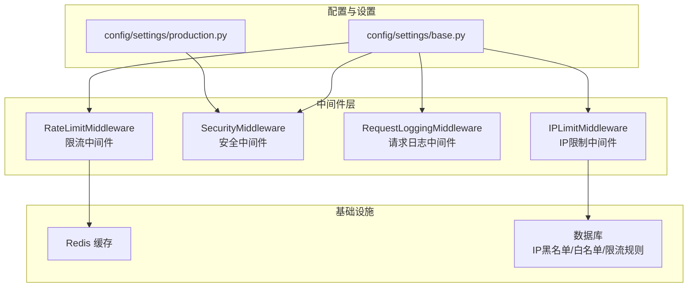
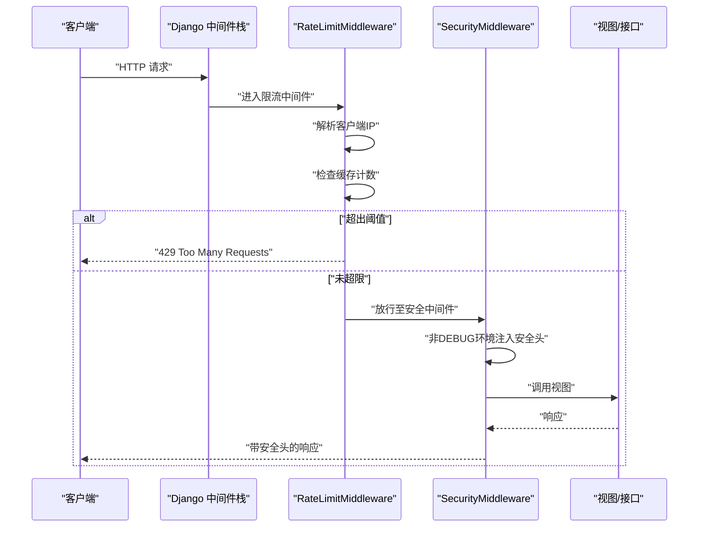
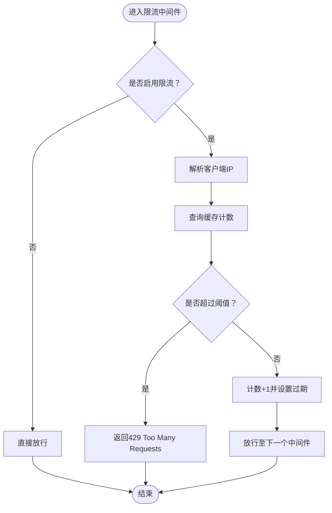
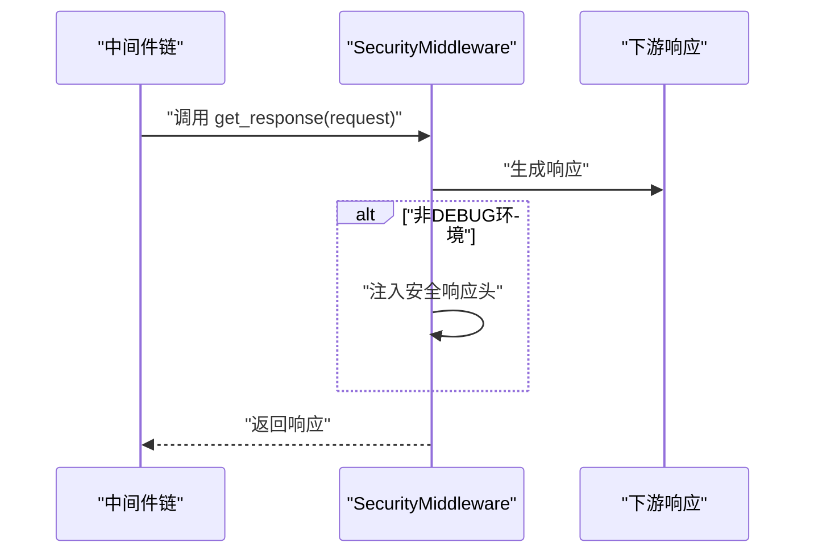
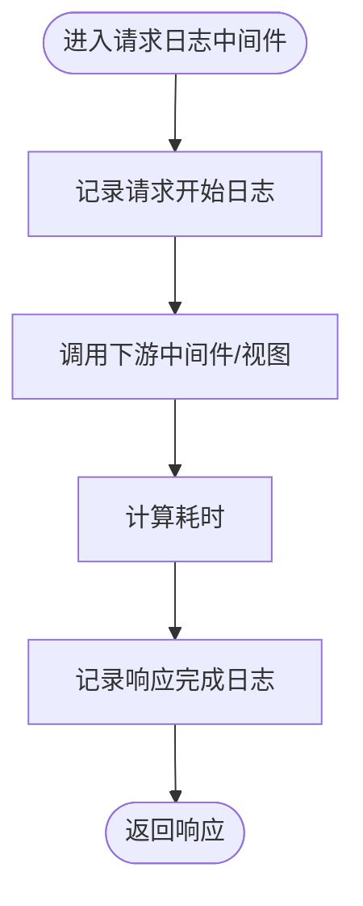
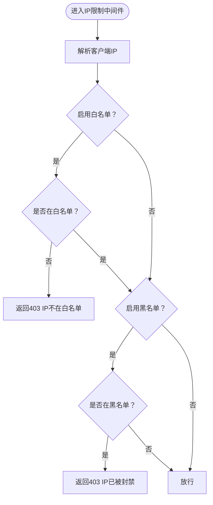
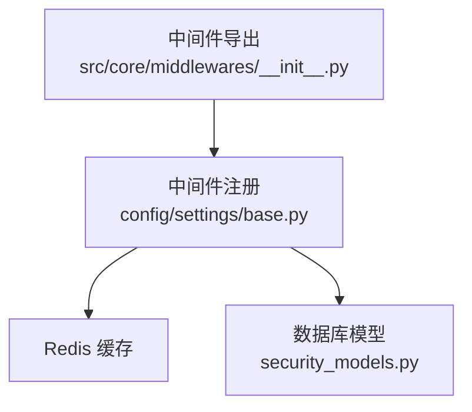

# 中间件系统

<cite>
**本文引用的文件**
- [src/core/middlewares/__init__.py](file://src/core/middlewares/__init__.py)
- [src/core/middlewares/rate_limit_middleware.py](file://src/core/middlewares/rate_limit_middleware.py)
- [src/core/middlewares/security_middleware.py](file://src/core/middlewares/security_middleware.py)
- [src/core/middlewares/request_logging_middleware.py](file://src/core/middlewares/request_logging_middleware.py)
- [src/core/middlewares/ip_limit_middleware.py](file://src/core/middlewares/ip_limit_middleware.py)
- [config/settings/base.py](file://config/settings/base.py)
- [config/settings/production.py](file://config/settings/production.py)
- [tests/test_middlewares/test_rate_limit_middleware.py](file://tests/test_middlewares/test_rate_limit_middleware.py)
- [tests/test_middleware/test_rate_limit_middleware.py](file://tests/test_middleware/test_rate_limit_middleware.py)
- [src/core/exceptions/rate_limit_error.py](file://src/core/exceptions/rate_limit_error.py)
- [src/core/exceptions/ip_blocked_error.py](file://src/core/exceptions/ip_blocked_error.py)
- [src/infrastructure/persistence/models/security_models.py](file://src/infrastructure/persistence/models/security_models.py)
- [src/application/services/security_service.py](file://src/application/services/security_service.py)
- [src/domain/security/services/ip_filter_service.py](file://src/domain/security/services/ip_filter_service.py)
- [src/core/decorators/operation_log.py](file://src/core/decorators/operation_log.py)
</cite>

## 目录
1. [简介](#简介)
2. [项目结构](#项目结构)
3. [核心组件](#核心组件)
4. [架构总览](#架构总览)
5. [详细组件分析](#详细组件分析)
6. [依赖分析](#依赖分析)
7. [性能考虑](#性能考虑)
8. [故障排除指南](#故障排除指南)
9. [结论](#结论)
10. [附录](#附录)

## 简介
本文件系统性阐述 Hello-Django-Ninja-Api 项目的中间件体系，重点覆盖以下四类中间件的设计与实现：
- 限流中间件（RateLimitMiddleware）：基于 IP 的请求频率控制与防刷机制
- 安全中间件（SecurityMiddleware）：统一注入安全响应头，强化生产环境防护
- 请求日志中间件（RequestLoggingMiddleware）：记录请求生命周期与关键指标
- IP 限制中间件（IPLimitMiddleware）：基于白名单/黑名单的访问控制

文档同时解释中间件的执行顺序与优先级、横切关注点的实现方式、配置项与性能影响，并提供自定义中间件的开发指南、使用示例与故障排除方法。

## 项目结构
中间件位于 src/core/middlewares 目录，统一导出并在 Django 中间件栈中按序加载。核心文件包括：
- 中间件导出入口：src/core/middlewares/__init__.py
- 四大中间件实现：rate_limit_middleware.py、security_middleware.py、request_logging_middleware.py、ip_limit_middleware.py
- 配置文件：config/settings/base.py、config/settings/production.py
- 测试文件：tests/test_middlewares/test_rate_limit_middleware.py、tests/test_middleware/test_rate_limit_middleware.py
- 异常定义：src/core/exceptions/rate_limit_error.py、src/core/exceptions/ip_blocked_error.py
- 安全模型：src/infrastructure/persistence/models/security_models.py
- 安全服务：src/application/services/security_service.py
- IP 过滤领域服务：src/domain/security/services/ip_filter_service.py
- 操作日志装饰器：src/core/decorators/operation_log.py

图表来源
- [config/settings/base.py:39-52](file://config/settings/base.py#L39-L52)
- [src/core/middlewares/rate_limit_middleware.py:15-112](file://src/core/middlewares/rate_limit_middleware.py#L15-L112)
- [src/core/middlewares/security_middleware.py:14-54](file://src/core/middlewares/security_middleware.py#L14-L54)
- [src/core/middlewares/request_logging_middleware.py:14-86](file://src/core/middlewares/request_logging_middleware.py#L14-L86)
- [src/core/middlewares/ip_limit_middleware.py:15-130](file://src/core/middlewares/ip_limit_middleware.py#L15-L130)

章节来源
- [config/settings/base.py:39-52](file://config/settings/base.py#L39-L52)
- [src/core/middlewares/__init__.py:6-16](file://src/core/middlewares/__init__.py#L6-L16)

## 核心组件
- 限流中间件（RateLimitMiddleware）
  - 功能：基于 IP 的请求频率限制，默认每分钟 100 次；支持通过环境变量开启/关闭与自定义默认规则
  - 关键点：使用 Redis 缓存统计请求次数，60 秒窗口；超过阈值返回 429
  - 配置：RATE_LIMIT_ENABLED、RATE_LIMIT_DEFAULT
- 安全中间件（SecurityMiddleware）
  - 功能：在非调试环境下统一注入安全响应头（X-Content-Type-Options、X-Frame-Options、X-XSS-Protection、Strict-Transport-Security）
  - 配置：由 settings.base.py 和 settings.production.py 控制
- 请求日志中间件（RequestLoggingMiddleware）
  - 功能：记录请求开始/完成、耗时、用户与来源 IP；便于审计与监控
  - 关键点：统一解析 X-Forwarded-For 或 REMOTE_ADDR 获取真实 IP
- IP 限制中间件（IPLimitMiddleware）
  - 功能：支持白名单/黑名单模式；支持永久与临时封禁；拒绝未授权访问
  - 配置：IP_BLACKLIST_ENABLED、IP_WHITELIST_ENABLED
  - 数据源：IPBlacklist/IPWhitelist 模型

章节来源
- [src/core/middlewares/rate_limit_middleware.py:15-112](file://src/core/middlewares/rate_limit_middleware.py#L15-L112)
- [src/core/middlewares/security_middleware.py:14-54](file://src/core/middlewares/security_middleware.py#L14-L54)
- [src/core/middlewares/request_logging_middleware.py:14-86](file://src/core/middlewares/request_logging_middleware.py#L14-L86)
- [src/core/middlewares/ip_limit_middleware.py:15-130](file://src/core/middlewares/ip_limit_middleware.py#L15-L130)
- [config/settings/base.py:228-235](file://config/settings/base.py#L228-L235)

## 架构总览
中间件在 Django 中间件栈中的执行顺序如下（从上到下）：
1. Django 内置安全中间件
2. CORS 中间件
3. Session 中间件
4. 常见中间件
5. CSRF 中间件
6. 认证中间件
7. 消息中间件
8. 点击劫持中间件
9. 自定义限流中间件
10. 自定义安全中间件

图表来源
- [config/settings/base.py:40-52](file://config/settings/base.py#L40-L52)
- [src/core/middlewares/rate_limit_middleware.py:41-68](file://src/core/middlewares/rate_limit_middleware.py#L41-L68)
- [src/core/middlewares/security_middleware.py:33-53](file://src/core/middlewares/security_middleware.py#L33-L53)

## 详细组件分析

### 限流中间件（RateLimitMiddleware）
- 设计要点
  - 基于 IP + 方法 + 路径的复合键进行限流统计
  - 使用 Redis 缓存存储计数与过期时间，避免进程内状态丢失
  - 可通过环境变量动态开关与调整默认规则
- 执行流程
  - 若未启用则直接放行
  - 解析客户端真实 IP（优先 X-Forwarded-For）
  - 查询缓存计数，超过阈值返回 429
  - 未超限则递增计数并设置过期时间，继续后续中间件/视图
- 性能与扩展
  - 单次请求仅一次缓存读写，开销极低
  - 当前实现为简单固定阈值，建议结合业务场景引入更细粒度的规则模型与动态阈值

图表来源
- [src/core/middlewares/rate_limit_middleware.py:41-111](file://src/core/middlewares/rate_limit_middleware.py#L41-L111)
- [config/settings/base.py:228-230](file://config/settings/base.py#L228-L230)

章节来源
- [src/core/middlewares/rate_limit_middleware.py:15-112](file://src/core/middlewares/rate_limit_middleware.py#L15-L112)
- [config/settings/base.py:228-230](file://config/settings/base.py#L228-L230)
- [tests/test_middlewares/test_rate_limit_middleware.py:33-58](file://tests/test_middlewares/test_rate_limit_middleware.py#L33-L58)
- [tests/test_middleware/test_rate_limit_middleware.py:33-58](file://tests/test_middleware/test_rate_limit_middleware.py#L33-L58)

### 安全中间件（SecurityMiddleware）
- 设计要点
  - 在非调试环境下统一注入安全响应头，提升 XSS、点击劫持、嗅探等攻击成本
  - 生产环境配置进一步强化（HSTS、安全 Cookie 等）
- 执行流程
  - 先调用下游中间件/视图生成响应
  - 在非 DEBUG 环境下追加安全头后返回

图表来源
- [src/core/middlewares/security_middleware.py:33-53](file://src/core/middlewares/security_middleware.py#L33-L53)
- [config/settings/production.py:29-39](file://config/settings/production.py#L29-L39)

章节来源
- [src/core/middlewares/security_middleware.py:14-54](file://src/core/middlewares/security_middleware.py#L14-L54)
- [config/settings/production.py:29-39](file://config/settings/production.py#L29-L39)

### 请求日志中间件（RequestLoggingMiddleware）
- 设计要点
  - 记录请求开始与完成、耗时、用户与来源 IP
  - 统一解析真实 IP，便于审计与定位问题
- 执行流程
  - 记录开始日志
  - 调用下游生成响应
  - 计算耗时并记录完成日志

图表来源
- [src/core/middlewares/request_logging_middleware.py:34-68](file://src/core/middlewares/request_logging_middleware.py#L34-L68)

章节来源
- [src/core/middlewares/request_logging_middleware.py:14-86](file://src/core/middlewares/request_logging_middleware.py#L14-L86)

### IP 限制中间件（IPLimitMiddleware）
- 设计要点
  - 支持白名单与黑名单两种模式，白名单优先
  - 支持永久封禁与到期自动解封
  - 通过数据库模型持久化封禁/放行规则
- 执行流程
  - 解析客户端 IP
  - 若启用白名单且不在白名单，直接 403
  - 若启用黑名单且命中黑名单，直接 403
  - 否则放行

图表来源
- [src/core/middlewares/ip_limit_middleware.py:41-76](file://src/core/middlewares/ip_limit_middleware.py#L41-L76)
- [src/infrastructure/persistence/models/security_models.py:13-50](file://src/infrastructure/persistence/models/security_models.py#L13-L50)
- [src/infrastructure/persistence/models/security_models.py:52-80](file://src/infrastructure/persistence/models/security_models.py#L52-L80)

章节来源
- [src/core/middlewares/ip_limit_middleware.py:15-130](file://src/core/middlewares/ip_limit_middleware.py#L15-L130)
- [config/settings/base.py:232-234](file://config/settings/base.py#L232-L234)
- [src/infrastructure/persistence/models/security_models.py:13-162](file://src/infrastructure/persistence/models/security_models.py#L13-L162)

### 横切关注点与集成点
- 认证与授权
  - 认证：Django 认证中间件负责会话与用户绑定
  - 授权：业务层通过权限装饰器与服务层实现
- 日志记录
  - 请求日志中间件：统一记录请求生命周期
  - 操作日志装饰器：对关键 API 操作进行详细记录（含用户、IP、UA、响应码等）
- 审计与监控
  - 结合日志中间件与操作日志装饰器，形成完整的审计链路

章节来源
- [src/core/decorators/operation_log.py:15-175](file://src/core/decorators/operation_log.py#L15-L175)

## 依赖分析
- 中间件导出与注册
  - 中间件统一导出并通过 settings.base.py 注册到 MIDDLEWARE 列表
- 外部依赖
  - Redis 缓存：限流中间件使用
  - 数据库：IP 黑/白名单与限流规则模型
- 内聚与耦合
  - 中间件职责单一，耦合度低
  - 与业务层通过 DTO/实体解耦，便于替换实现

图表来源
- [src/core/middlewares/__init__.py:6-16](file://src/core/middlewares/__init__.py#L6-L16)
- [config/settings/base.py:39-52](file://config/settings/base.py#L39-L52)
- [src/infrastructure/persistence/models/security_models.py:13-162](file://src/infrastructure/persistence/models/security_models.py#L13-L162)

章节来源
- [src/core/middlewares/__init__.py:6-16](file://src/core/middlewares/__init__.py#L6-L16)
- [config/settings/base.py:39-52](file://config/settings/base.py#L39-L52)

## 性能考虑
- 限流中间件
  - 缓存读写为 O(1)，对延迟影响可忽略
  - 建议根据业务峰值合理设置默认阈值，避免误伤正常流量
- 安全中间件
  - 仅在响应阶段追加头，开销极小
- 请求日志中间件
  - IO 开销取决于日志级别与输出目标，建议生产环境使用异步/批量写入
- IP 限制中间件
  - 数据库查询为 O(1)（索引），建议在高并发场景下增加缓存层或预热热点 IP

## 故障排除指南
- 429 请求过于频繁
  - 现象：限流中间件返回 429
  - 排查：确认 RATE_LIMIT_ENABLED 与 RATE_LIMIT_DEFAULT 设置；检查 Redis 连接与键过期
  - 参考：[src/core/middlewares/rate_limit_middleware.py:58-66](file://src/core/middlewares/rate_limit_middleware.py#L58-L66)
- 403 IP 不在白名单/已被封禁
  - 现象：IP 限制中间件返回 403
  - 排查：确认 IP_BLACKLIST_ENABLED 与 IP_WHITELIST_ENABLED；检查数据库中对应条目状态与有效期
  - 参考：[src/core/middlewares/ip_limit_middleware.py:55-74](file://src/core/middlewares/ip_limit_middleware.py#L55-L74)
- 安全头缺失
  - 现象：浏览器提示缺少安全头
  - 排查：确认非 DEBUG 环境；检查生产配置与中间件顺序
  - 参考：[src/core/middlewares/security_middleware.py:47-51](file://src/core/middlewares/security_middleware.py#L47-L51)
- 日志不完整
  - 现象：缺少请求开始/完成信息
  - 排查：确认中间件顺序；检查日志配置与级别
  - 参考：[src/core/middlewares/request_logging_middleware.py:53-66](file://src/core/middlewares/request_logging_middleware.py#L53-L66)

章节来源
- [src/core/middlewares/rate_limit_middleware.py:58-66](file://src/core/middlewares/rate_limit_middleware.py#L58-L66)
- [src/core/middlewares/ip_limit_middleware.py:55-74](file://src/core/middlewares/ip_limit_middleware.py#L55-L74)
- [src/core/middlewares/security_middleware.py:47-51](file://src/core/middlewares/security_middleware.py#L47-L51)
- [src/core/middlewares/request_logging_middleware.py:53-66](file://src/core/middlewares/request_logging_middleware.py#L53-L66)

## 结论
本中间件体系以“单一职责、低耦合”为核心设计原则，通过限流、安全、日志与 IP 控制四大中间件协同工作，有效提升了系统的安全性、可观测性与稳定性。建议在生产环境中结合业务场景对限流规则与 IP 策略进行精细化配置，并持续优化日志与缓存策略以获得最佳性能与体验。

## 附录

### 中间件配置选项
- 限流相关
  - RATE_LIMIT_ENABLED：是否启用限流（默认 True）
  - RATE_LIMIT_DEFAULT：默认限流规则（默认 100/minute）
  - 参考：[config/settings/base.py:228-230](file://config/settings/base.py#L228-L230)
- IP 黑/白名单相关
  - IP_BLACKLIST_ENABLED：是否启用黑名单（默认 False）
  - IP_WHITELIST_ENABLED：是否启用白名单（默认 False）
  - 参考：[config/settings/base.py:232-234](file://config/settings/base.py#L232-L234)
- 安全相关
  - 生产环境安全头与 HSTS 等由生产配置决定
  - 参考：[config/settings/production.py:29-39](file://config/settings/production.py#L29-L39)

### 中间件执行顺序与优先级
- 顺序：Django 内置中间件 → CORS → Session → Common → CSRF → Authentication → Messages → XFrame → 自定义限流 → 自定义安全
- 说明：自定义中间件位于 CSRF 之后、安全之前，确保在业务处理前完成限流与安全加固
- 参考：[config/settings/base.py:40-52](file://config/settings/base.py#L40-L52)

### 自定义中间件开发指南
- 基本结构
  - 实现构造函数接收 get_response
  - 实现 __call__ 处理请求与响应
  - 在 __call__ 中先调用 get_response，再对响应进行后处理
- 最佳实践
  - 尽量减少阻塞操作，必要时使用异步或后台任务
  - 明确异常处理与日志记录
  - 通过环境变量或配置文件控制开关与参数
- 参考实现
  - [src/core/middlewares/rate_limit_middleware.py:30-68](file://src/core/middlewares/rate_limit_middleware.py#L30-L68)
  - [src/core/middlewares/security_middleware.py:24-53](file://src/core/middlewares/security_middleware.py#L24-L53)
  - [src/core/middlewares/request_logging_middleware.py:25-68](file://src/core/middlewares/request_logging_middleware.py#L25-L68)
  - [src/core/middlewares/ip_limit_middleware.py:30-76](file://src/core/middlewares/ip_limit_middleware.py#L30-L76)

### 使用示例
- 启用限流
  - 设置环境变量 RATE_LIMIT_ENABLED=1 并按需调整 RATE_LIMIT_DEFAULT
  - 参考：[config/settings/base.py:228-230](file://config/settings/base.py#L228-L230)
- 启用 IP 白名单
  - 设置 IP_WHITELIST_ENABLED=1，并在数据库中添加白名单条目
  - 参考：[config/settings/base.py:232-234](file://config/settings/base.py#L232-L234)、[src/infrastructure/persistence/models/security_models.py:52-80](file://src/infrastructure/persistence/models/security_models.py#L52-L80)
- 启用 IP 黑名单
  - 设置 IP_BLACKLIST_ENABLED=1，并在数据库中添加黑名单条目
  - 参考：[config/settings/base.py:232-234](file://config/settings/base.py#L232-L234)、[src/infrastructure/persistence/models/security_models.py:13-50](file://src/infrastructure/persistence/models/security_models.py#L13-L50)

### 相关异常类型
- 限流异常：RateLimitError
  - 参考：[src/core/exceptions/rate_limit_error.py:9-25](file://src/core/exceptions/rate_limit_error.py#L9-L25)
- IP 被封禁异常：IPBlockedError
  - 参考：[src/core/exceptions/ip_blocked_error.py:9-25](file://src/core/exceptions/ip_blocked_error.py#L9-L25)