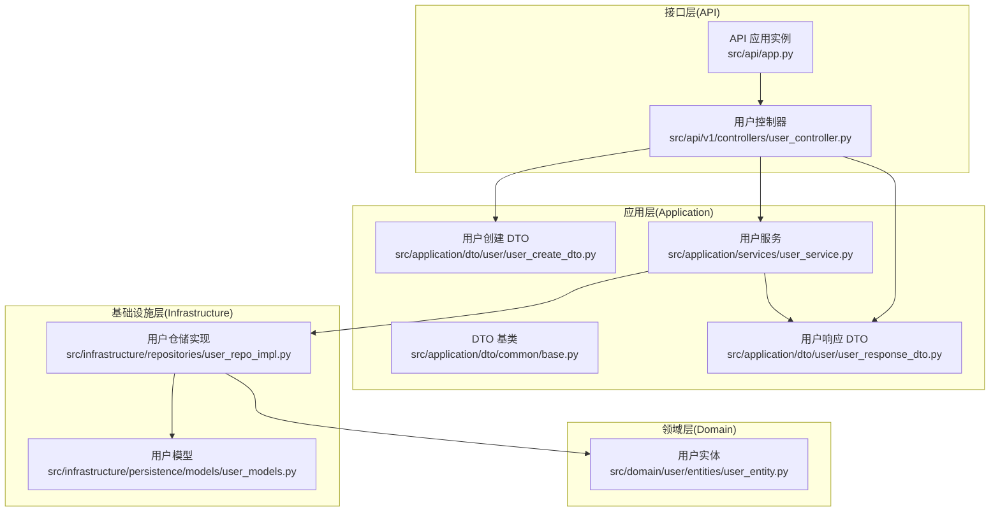
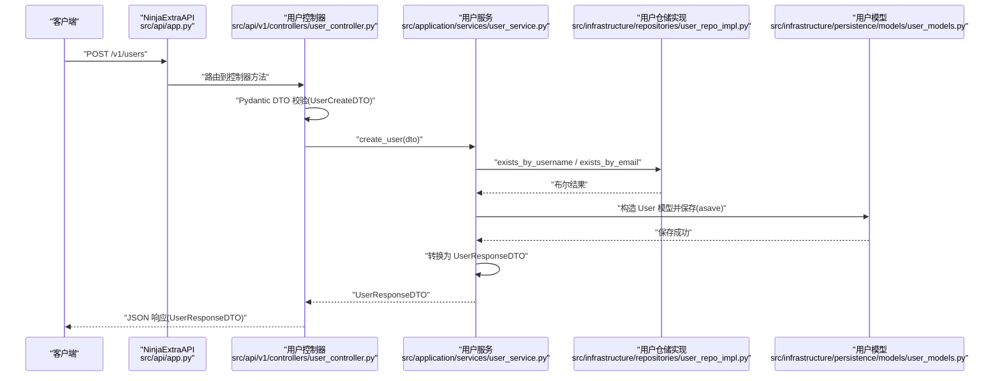
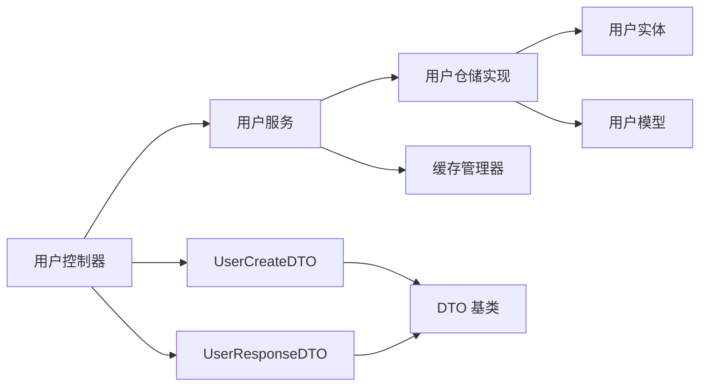
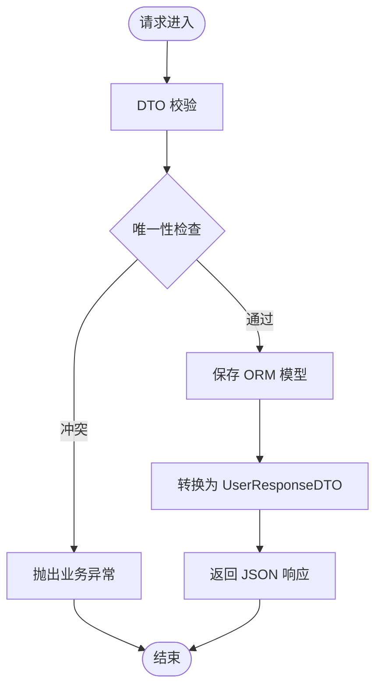
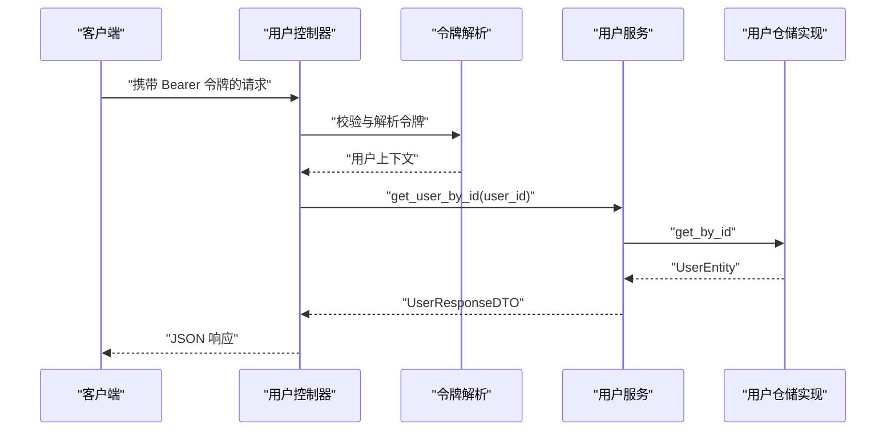
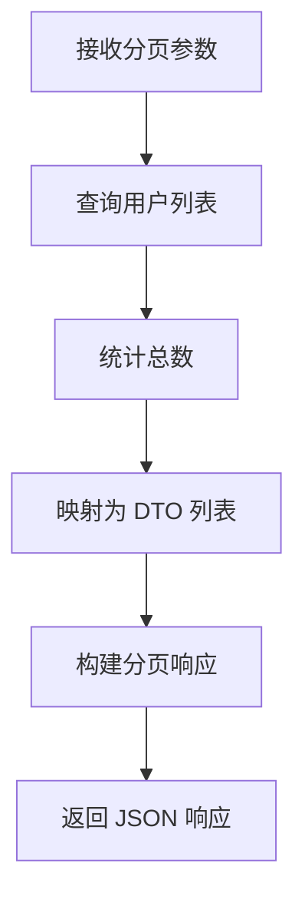

# 数据流设计

<cite>
**本文引用的文件**
- [src/api/app.py](file://src/api/app.py)
- [src/api/v1/controllers/user_controller.py](file://src/api/v1/controllers/user_controller.py)
- [src/application/dto/common/base.py](file://src/application/dto/common/base.py)
- [src/application/dto/user/user_create_dto.py](file://src/application/dto/user/user_create_dto.py)
- [src/application/dto/user/user_response_dto.py](file://src/application/dto/user/user_response_dto.py)
- [src/application/services/user_service.py](file://src/application/services/user_service.py)
- [src/domain/user/entities/user_entity.py](file://src/domain/user/entities/user_entity.py)
- [src/infrastructure/repositories/user_repo_impl.py](file://src/infrastructure/repositories/user_repo_impl.py)
- [src/infrastructure/persistence/models/user_models.py](file://src/infrastructure/persistence/models/user_models.py)
- [src/api/common/responses.py](file://src/api/common/responses.py)
- [src/core/middlewares/rate_limit_middleware.py](file://src/core/middlewares/rate_limit_middleware.py)
- [src/core/exceptions/validation_error.py](file://src/core/exceptions/validation_error.py)
</cite>

## 目录
1. [引言](#引言)
2. [项目结构](#项目结构)
3. [核心组件](#核心组件)
4. [架构总览](#架构总览)
5. [详细组件分析](#详细组件分析)
6. [依赖分析](#依赖分析)
7. [性能考量](#性能考量)
8. [故障排查指南](#故障排查指南)
9. [结论](#结论)
10. [附录](#附录)

## 引言
本文件面向 Hello-Django-Ninja-Api 项目的“数据流设计”，系统性阐述从 HTTP 请求到数据库持久化的完整数据流转过程。重点覆盖以下方面：
- 请求进入 API 控制器后如何通过 Pydantic DTO 进行参数验证与序列化
- 应用服务如何调用仓储层并返回领域/实体对象
- 仓储层如何访问数据库 ORM 并返回实体对象
- 响应如何通过 DTO 转换为标准 JSON 格式
- 数据在各层之间的传递方式、转换规则与验证机制
- 典型业务场景（用户注册、权限检查、资源访问）的完整数据流示例
- 错误处理与异常传播机制
- 性能优化的数据流设计考虑

## 项目结构
该项目采用分层架构（API → 应用服务 → 领域/仓储 → 基础设施），并结合 Django-Ninja-Extra 的控制器与路由机制组织入口。

图表来源
- [src/api/app.py:17-30](file://src/api/app.py#L17-L30)
- [src/api/v1/controllers/user_controller.py:33-51](file://src/api/v1/controllers/user_controller.py#L33-L51)
- [src/application/dto/common/base.py:14-27](file://src/application/dto/common/base.py#L14-L27)
- [src/application/dto/user/user_create_dto.py:9-34](file://src/application/dto/user/user_create_dto.py#L9-L34)
- [src/application/dto/user/user_response_dto.py:11-30](file://src/application/dto/user/user_response_dto.py#L11-L30)
- [src/application/services/user_service.py:16-24](file://src/application/services/user_service.py#L16-L24)
- [src/domain/user/entities/user_entity.py:11-32](file://src/domain/user/entities/user_entity.py#L11-L32)
- [src/infrastructure/repositories/user_repo_impl.py:13-17](file://src/infrastructure/repositories/user_repo_impl.py#L13-L17)
- [src/infrastructure/persistence/models/user_models.py:12-80](file://src/infrastructure/persistence/models/user_models.py#L12-L80)

章节来源
- [src/api/app.py:17-30](file://src/api/app.py#L17-L30)
- [src/api/v1/controllers/user_controller.py:33-51](file://src/api/v1/controllers/user_controller.py#L33-L51)

## 核心组件
- API 应用实例与路由注册：负责创建 NinjaExtraAPI 实例并注册控制器，提供健康检查等基础路由。
- 控制器层：以用户控制器为例，接收 HTTP 请求，使用 DTO 进行参数校验，调用应用服务，并将结果转换为响应 DTO。
- 应用服务层：封装业务逻辑，协调仓储层进行数据访问，负责缓存读写与密码哈希等。
- 领域层：用户实体承载业务规则与行为，如用户名/邮箱验证、权限变更、最后登录时间更新等。
- 仓储层：实现用户仓储接口，负责实体与 ORM 模型之间的双向转换，并执行异步数据库操作。
- 基础设施层：Django ORM 用户模型定义，包含索引、外键与扩展字段；Redis 缓存策略由应用服务调用缓存管理器实现。
- 中间件与异常：限流中间件对请求频率进行控制；统一的验证错误异常类型用于标准化错误传播。

章节来源
- [src/api/app.py:17-30](file://src/api/app.py#L17-L30)
- [src/api/v1/controllers/user_controller.py:33-51](file://src/api/v1/controllers/user_controller.py#L33-L51)
- [src/application/services/user_service.py:16-24](file://src/application/services/user_service.py#L16-L24)
- [src/domain/user/entities/user_entity.py:11-32](file://src/domain/user/entities/user_entity.py#L11-L32)
- [src/infrastructure/repositories/user_repo_impl.py:13-17](file://src/infrastructure/repositories/user_repo_impl.py#L13-L17)
- [src/infrastructure/persistence/models/user_models.py:12-80](file://src/infrastructure/persistence/models/user_models.py#L12-L80)
- [src/core/middlewares/rate_limit_middleware.py:15-40](file://src/core/middlewares/rate_limit_middleware.py#L15-L40)
- [src/core/exceptions/validation_error.py:9-26](file://src/core/exceptions/validation_error.py#L9-L26)

## 架构总览
下图展示一次典型的“用户注册”请求从进入 API 控制器到完成数据库持久化的完整数据流。

图表来源
- [src/api/app.py:17-30](file://src/api/app.py#L17-L30)
- [src/api/v1/controllers/user_controller.py:53-75](file://src/api/v1/controllers/user_controller.py#L53-L75)
- [src/application/dto/user/user_create_dto.py:9-34](file://src/application/dto/user/user_create_dto.py#L9-L34)
- [src/application/services/user_service.py:29-50](file://src/application/services/user_service.py#L29-L50)
- [src/infrastructure/repositories/user_repo_impl.py:125-131](file://src/infrastructure/repositories/user_repo_impl.py#L125-L131)
- [src/infrastructure/persistence/models/user_models.py:12-80](file://src/infrastructure/persistence/models/user_models.py#L12-L80)
- [src/application/dto/user/user_response_dto.py:11-30](file://src/application/dto/user/user_response_dto.py#L11-L30)

## 详细组件分析

### API 应用与控制器
- API 应用实例创建并注册控制器，提供健康检查与根路径响应。
- 用户控制器通过装饰器声明路由、权限与响应类型，使用 Pydantic DTO 接收与返回数据。
- 控制器内部通过 JWT 令牌解析获取当前用户上下文，用于需要认证的接口。

章节来源
- [src/api/app.py:17-30](file://src/api/app.py#L17-L30)
- [src/api/v1/controllers/user_controller.py:33-51](file://src/api/v1/controllers/user_controller.py#L33-L51)
- [src/api/v1/controllers/user_controller.py:262-282](file://src/api/v1/controllers/user_controller.py#L262-L282)

### DTO 与参数验证
- DTO 基类提供统一的 Pydantic 配置（如 from_attributes、日期编码），确保与 ORM 字段兼容。
- 用户创建 DTO 对用户名、邮箱、密码等字段进行长度与格式约束；响应 DTO 明确输出字段与类型。
- 控制器方法签名直接使用 DTO 作为输入参数，由框架自动进行反序列化与校验。

章节来源
- [src/application/dto/common/base.py:14-27](file://src/application/dto/common/base.py#L14-L27)
- [src/application/dto/user/user_create_dto.py:9-34](file://src/application/dto/user/user_create_dto.py#L9-L34)
- [src/application/dto/user/user_response_dto.py:11-30](file://src/application/dto/user/user_response_dto.py#L11-L30)

### 应用服务：业务编排与缓存
- 用户服务负责业务编排：重复性检查（用户名/邮箱）、密码哈希、缓存读写、ORM 模型保存与转换。
- 查询用户时优先从缓存读取，命中则直接返回 DTO；未命中再访问仓储层并回填缓存。
- 更新与删除操作会清理相关缓存键，保证一致性。

章节来源
- [src/application/services/user_service.py:29-50](file://src/application/services/user_service.py#L29-L50)
- [src/application/services/user_service.py:52-66](file://src/application/services/user_service.py#L52-L66)
- [src/application/services/user_service.py:82-98](file://src/application/services/user_service.py#L82-L98)
- [src/application/services/user_service.py:100-108](file://src/application/services/user_service.py#L100-L108)
- [src/application/services/user_service.py:110-116](file://src/application/services/user_service.py#L110-L116)
- [src/application/services/user_service.py:118-130](file://src/application/services/user_service.py#L118-L130)
- [src/application/services/user_service.py:132-151](file://src/application/services/user_service.py#L132-L151)
- [src/application/services/user_service.py:153-188](file://src/application/services/user_service.py#L153-L188)

### 领域实体与仓储实现
- 用户实体承载业务规则与行为，如用户名/邮箱验证、权限变更、最后登录时间更新等。
- 仓储实现负责实体与 ORM 模型之间的双向转换，并提供异步数据库操作（查询、保存、更新、删除、分页、计数）。
- 仓储层屏蔽 ORM 细节，向上层暴露领域实体。

章节来源
- [src/domain/user/entities/user_entity.py:11-32](file://src/domain/user/entities/user_entity.py#L11-L32)
- [src/domain/user/entities/user_entity.py:33-49](file://src/domain/user/entities/user_entity.py#L33-L49)
- [src/infrastructure/repositories/user_repo_impl.py:19-36](file://src/infrastructure/repositories/user_repo_impl.py#L19-L36)
- [src/infrastructure/repositories/user_repo_impl.py:38-70](file://src/infrastructure/repositories/user_repo_impl.py#L38-L70)
- [src/infrastructure/repositories/user_repo_impl.py:72-135](file://src/infrastructure/repositories/user_repo_impl.py#L72-L135)

### 数据库模型与索引
- 用户模型扩展 Django 内置用户，新增头像、昵称、性别、手机号、部门关联等字段，并建立索引提升查询效率。
- 仓储层通过 ORM 异步接口进行数据访问，支持分页与计数。

章节来源
- [src/infrastructure/persistence/models/user_models.py:12-80](file://src/infrastructure/persistence/models/user_models.py#L12-L80)

### 响应与统一消息
- 控制器方法通过 response 指定响应 DTO 类型，框架自动序列化为 JSON。
- 通用消息响应与分页响应工具类提供一致的响应结构。

章节来源
- [src/api/v1/controllers/user_controller.py:53-75](file://src/api/v1/controllers/user_controller.py#L53-L75)
- [src/api/common/responses.py:13-110](file://src/api/common/responses.py#L13-L110)

### 中间件与异常处理
- 限流中间件基于 IP 与路径统计请求频率，超过阈值返回 429。
- 验证错误异常类型继承统一的 API 错误基类，便于全局捕获与格式化。

章节来源
- [src/core/middlewares/rate_limit_middleware.py:15-40](file://src/core/middlewares/rate_limit_middleware.py#L15-L40)
- [src/core/middlewares/rate_limit_middleware.py:41-68](file://src/core/middlewares/rate_limit_middleware.py#L41-L68)
- [src/core/exceptions/validation_error.py:9-26](file://src/core/exceptions/validation_error.py#L9-L26)

## 依赖分析
- 控制器依赖应用服务与 DTO；应用服务依赖仓储实现与缓存管理器；仓储实现依赖领域实体与 ORM 模型。
- DTO 基类提供 from_attributes 与日期编码配置，确保与 ORM 字段兼容。
- 中间件与异常处理独立于业务层，通过 Django 设置与全局异常捕获机制集成。

图表来源
- [src/api/v1/controllers/user_controller.py:53-75](file://src/api/v1/controllers/user_controller.py#L53-L75)
- [src/application/dto/user/user_create_dto.py:9-34](file://src/application/dto/user/user_create_dto.py#L9-L34)
- [src/application/dto/user/user_response_dto.py:11-30](file://src/application/dto/user/user_response_dto.py#L11-L30)
- [src/application/services/user_service.py:16-24](file://src/application/services/user_service.py#L16-L24)
- [src/infrastructure/repositories/user_repo_impl.py:13-17](file://src/infrastructure/repositories/user_repo_impl.py#L13-L17)
- [src/domain/user/entities/user_entity.py:11-32](file://src/domain/user/entities/user_entity.py#L11-L32)
- [src/infrastructure/persistence/models/user_models.py:12-80](file://src/infrastructure/persistence/models/user_models.py#L12-L80)
- [src/application/dto/common/base.py:14-27](file://src/application/dto/common/base.py#L14-L27)

## 性能考量
- 缓存策略：应用服务在查询用户时优先读取缓存，减少数据库压力；更新/删除后主动清理缓存键，避免脏读。
- 异步 ORM：仓储层使用异步 ORM 接口（aget/asave/adelete/acount/aexists），提升并发性能。
- 分页与索引：仓储层通过切片实现分页，模型层面建立用户名/邮箱/手机号索引，降低查询成本。
- DTO 序列化：DTO 基类开启 from_attributes，避免显式映射开销；统一日期编码减少额外处理。
- 限流中间件：基于内存缓存的简单限流，防止突发流量击穿系统。

章节来源
- [src/application/services/user_service.py:54-66](file://src/application/services/user_service.py#L54-L66)
- [src/infrastructure/repositories/user_repo_impl.py:121-123](file://src/infrastructure/repositories/user_repo_impl.py#L121-L123)
- [src/infrastructure/persistence/models/user_models.py:76-80](file://src/infrastructure/persistence/models/user_models.py#L76-L80)
- [src/application/dto/common/base.py:20-26](file://src/application/dto/common/base.py#L20-L26)
- [src/core/middlewares/rate_limit_middleware.py:99-111](file://src/core/middlewares/rate_limit_middleware.py#L99-L111)

## 故障排查指南
- 参数校验失败：当 DTO 字段不符合约束（如长度、格式）时，框架将返回校验错误；可在控制器或全局异常处理器中捕获并格式化。
- 资源不存在：仓储层查询不到对应记录时返回空值，应用服务需抛出相应异常或返回错误响应。
- 权限不足：受保护接口需携带有效 JWT 令牌，控制器通过令牌解析获取用户上下文；若无效则返回认证错误。
- 速率限制：当触发限流中间件阈值时，返回 429 与统一错误结构，便于前端重试策略与用户提示。
- 密码错误：认证或修改密码时若旧密码不匹配，服务层抛出错误，控制器返回相应消息。

章节来源
- [src/api/v1/controllers/user_controller.py:98-101](file://src/api/v1/controllers/user_controller.py#L98-L101)
- [src/api/v1/controllers/user_controller.py:185-188](file://src/api/v1/controllers/user_controller.py#L185-L188)
- [src/api/v1/controllers/user_controller.py:217-225](file://src/api/v1/controllers/user_controller.py#L217-L225)
- [src/api/v1/controllers/user_controller.py:252-260](file://src/api/v1/controllers/user_controller.py#L252-L260)
- [src/application/services/user_service.py:121-127](file://src/application/services/user_service.py#L121-L127)
- [src/core/middlewares/rate_limit_middleware.py:58-66](file://src/core/middlewares/rate_limit_middleware.py#L58-L66)
- [src/core/exceptions/validation_error.py:9-26](file://src/core/exceptions/validation_error.py#L9-L26)

## 结论
本项目通过清晰的分层架构与严格的 DTO/实体转换机制，实现了从 HTTP 请求到数据库持久化的高内聚、低耦合数据流。Pydantic DTO 提供强类型的参数校验与序列化，应用服务承担业务编排与缓存策略，仓储层屏蔽底层 ORM 细节，基础设施层提供高性能的异步数据库访问。配合限流中间件与统一异常处理，整体具备良好的可维护性与可扩展性。

## 附录

### 典型业务场景数据流示例

#### 场景一：用户注册
- 输入：用户控制器接收 UserCreateDTO，框架自动校验
- 应用服务：检查用户名/邮箱唯一性，生成哈希密码，保存 ORM 模型
- 输出：返回 UserResponseDTO，框架序列化为 JSON

图表来源
- [src/api/v1/controllers/user_controller.py:53-75](file://src/api/v1/controllers/user_controller.py#L53-L75)
- [src/application/dto/user/user_create_dto.py:9-34](file://src/application/dto/user/user_create_dto.py#L9-L34)
- [src/application/services/user_service.py:29-50](file://src/application/services/user_service.py#L29-L50)
- [src/application/dto/user/user_response_dto.py:11-30](file://src/application/dto/user/user_response_dto.py#L11-L30)

#### 场景二：权限检查与资源访问
- 输入：受保护接口携带 JWT 令牌
- 控制器：解析令牌获取用户上下文
- 应用服务：按需查询用户信息并返回 DTO
- 输出：返回 JSON 响应

图表来源
- [src/api/v1/controllers/user_controller.py:262-282](file://src/api/v1/controllers/user_controller.py#L262-L282)
- [src/application/services/user_service.py:52-66](file://src/application/services/user_service.py#L52-L66)
- [src/infrastructure/repositories/user_repo_impl.py:72-78](file://src/infrastructure/repositories/user_repo_impl.py#L72-L78)
- [src/application/dto/user/user_response_dto.py:11-30](file://src/application/dto/user/user_response_dto.py#L11-L30)

#### 场景三：资源列表与分页
- 输入：控制器接收页码与页大小参数
- 应用服务：查询列表与总数，转换为 DTO 列表
- 输出：返回分页响应 DTO

图表来源
- [src/api/v1/controllers/user_controller.py:109-133](file://src/api/v1/controllers/user_controller.py#L109-L133)
- [src/application/services/user_service.py:110-116](file://src/application/services/user_service.py#L110-L116)
- [src/infrastructure/repositories/user_repo_impl.py:117-135](file://src/infrastructure/repositories/user_repo_impl.py#L117-L135)