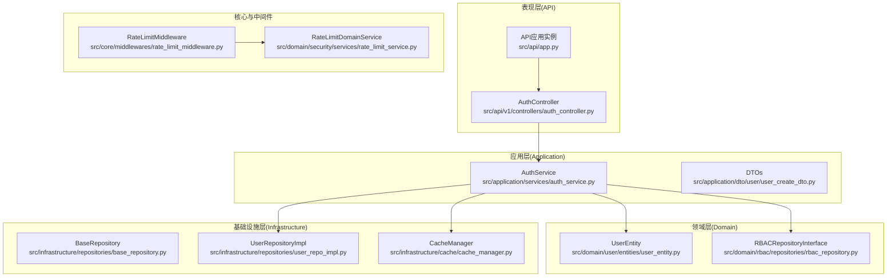
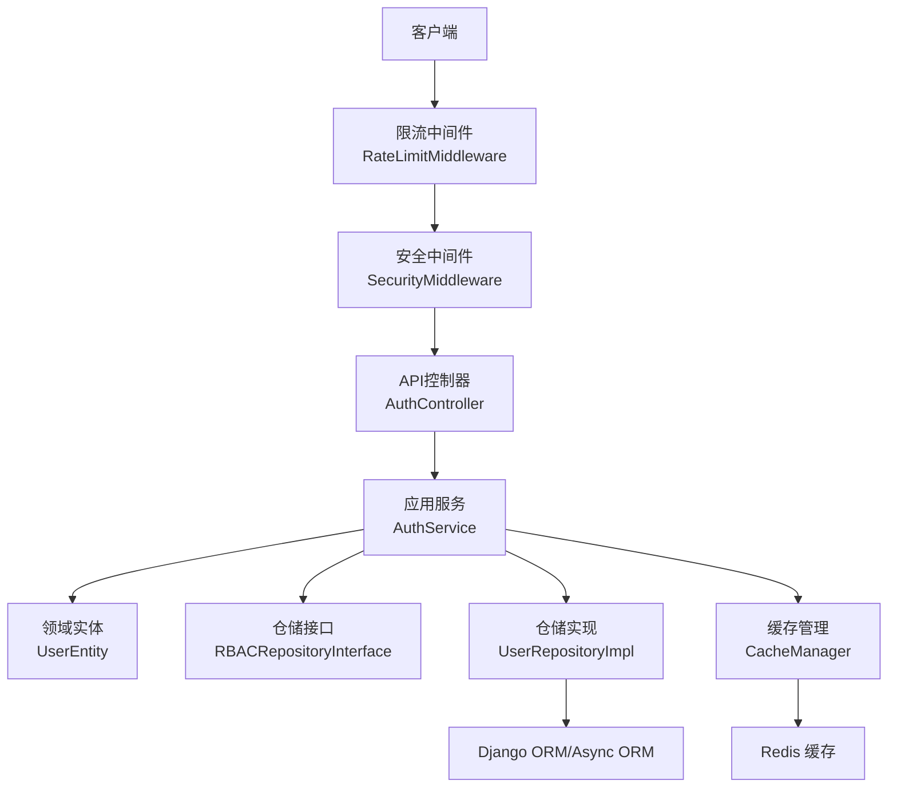
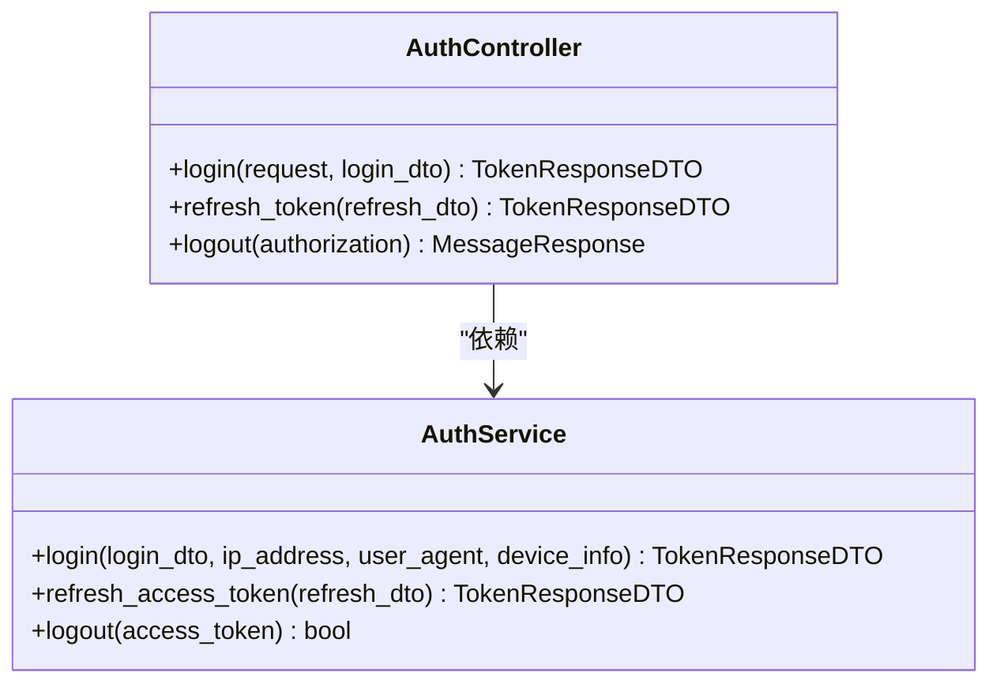
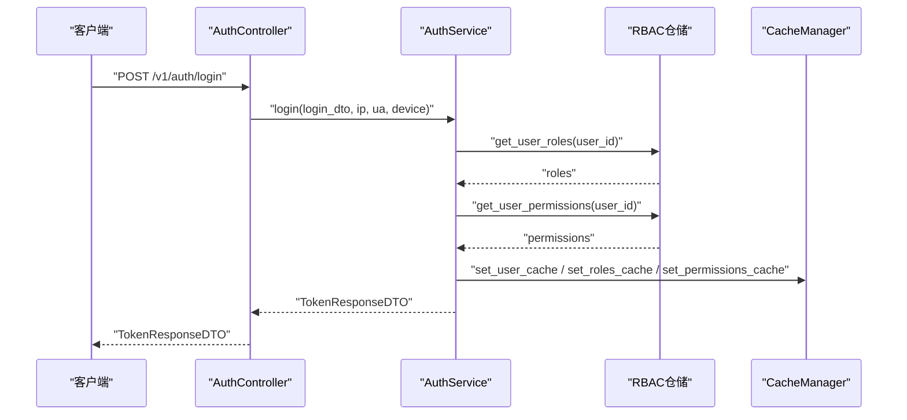
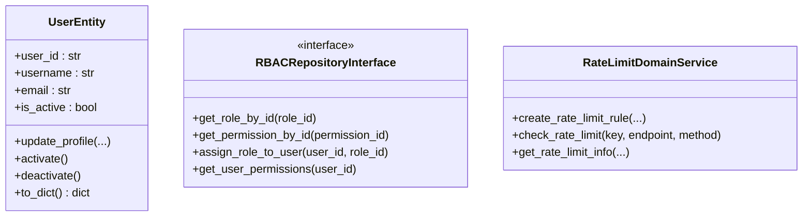
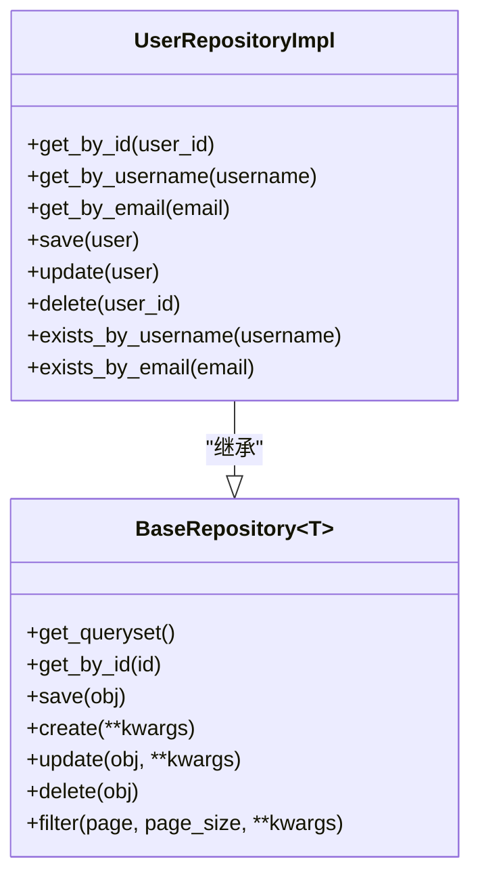
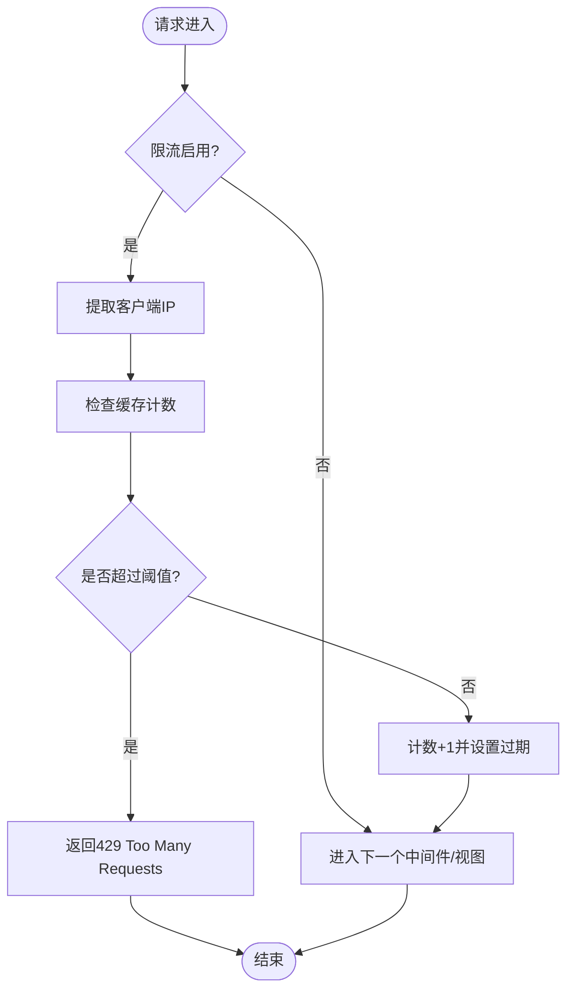
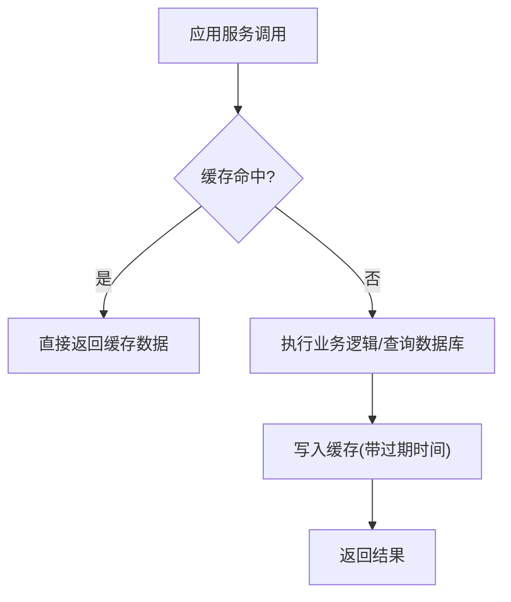
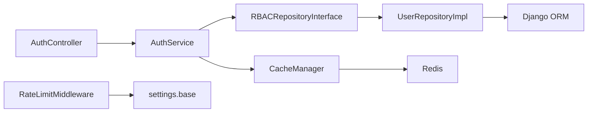

# 架构设计

<cite>
**本文引用的文件**   
- [src/api/app.py](file://src/api/app.py)
- [src/api/common/decorators.py](file://src/api/common/decorators.py)
- [src/api/v1/controllers/auth_controller.py](file://src/api/v1/controllers/auth_controller.py)
- [src/application/services/auth_service.py](file://src/application/services/auth_service.py)
- [src/application/dto/user/user_create_dto.py](file://src/application/dto/user/user_create_dto.py)
- [src/domain/user/entities/user_entity.py](file://src/domain/user/entities/user_entity.py)
- [src/domain/rbac/repositories/rbac_repository.py](file://src/domain/rbac/repositories/rbac_repository.py)
- [src/infrastructure/repositories/base_repository.py](file://src/infrastructure/repositories/base_repository.py)
- [src/infrastructure/repositories/user_repo_impl.py](file://src/infrastructure/repositories/user_repo_impl.py)
- [src/infrastructure/cache/cache_manager.py](file://src/infrastructure/cache/cache_manager.py)
- [src/core/middlewares/rate_limit_middleware.py](file://src/core/middlewares/rate_limit_middleware.py)
- [src/domain/security/services/rate_limit_service.py](file://src/domain/security/services/rate_limit_service.py)
- [config/settings/base.py](file://config/settings/base.py)
- [requirements.txt](file://requirements.txt)
</cite>

## 目录
1. [引言](#引言)
2. [项目结构](#项目结构)
3. [核心组件](#核心组件)
4. [架构总览](#架构总览)
5. [详细组件分析](#详细组件分析)
6. [依赖分析](#依赖分析)
7. [性能考量](#性能考量)
8. [故障排查指南](#故障排查指南)
9. [结论](#结论)
10. [附录](#附录)

## 引言
本项目采用领域驱动设计（DDD）与分层架构相结合的方式，构建一个基于 Django-Ninja 的 RESTful API。四层架构清晰划分职责：
- 表现层（API Controllers）：负责接收请求、封装响应、调用应用服务
- 应用层（Services）：编排业务流程、协调领域服务与仓储
- 领域层（Entities/Domain Services）：承载核心业务规则与不变量
- 基础设施层（Repositories/Persistence）：提供数据持久化与外部集成能力

同时，系统通过中间件实现认证、安全与限流等横切关注点；通过缓存层提升性能与降低数据库压力。本文将深入解析各层职责、依赖关系、控制流与数据流，并给出系统边界图与组件交互图，帮助开发者快速理解整体架构。

## 项目结构
项目采用按“能力/特性”组织的模块化布局，结合 DDD 分层与 Django 应用结构：
- 表现层：src/api/v1/controllers 与 src/api/app.py
- 应用层：src/application/services 与 DTO
- 领域层：src/domain 下的 entities、services、repositories 接口
- 基础设施层：src/infrastructure 下的 repositories、cache、persistence、auth_jwt 等
- 核心与中间件：src/core/middlewares
- 配置：config/settings/base.py

图表来源
- [src/api/app.py:70-84](file://src/api/app.py#L70-L84)
- [src/api/v1/controllers/auth_controller.py:16-35](file://src/api/v1/controllers/auth_controller.py#L16-L35)
- [src/application/services/auth_service.py:20-233](file://src/application/services/auth_service.py#L20-L233)
- [src/domain/user/entities/user_entity.py:11-120](file://src/domain/user/entities/user_entity.py#L11-L120)
- [src/domain/rbac/repositories/rbac_repository.py:12-112](file://src/domain/rbac/repositories/rbac_repository.py#L12-L112)
- [src/infrastructure/repositories/base_repository.py:13-90](file://src/infrastructure/repositories/base_repository.py#L13-L90)
- [src/infrastructure/repositories/user_repo_impl.py:13-138](file://src/infrastructure/repositories/user_repo_impl.py#L13-L138)
- [src/infrastructure/cache/cache_manager.py:16-149](file://src/infrastructure/cache/cache_manager.py#L16-L149)
- [src/core/middlewares/rate_limit_middleware.py:15-112](file://src/core/middlewares/rate_limit_middleware.py#L15-L112)
- [src/domain/security/services/rate_limit_service.py:11-126](file://src/domain/security/services/rate_limit_service.py#L11-L126)

章节来源
- [src/api/app.py:70-102](file://src/api/app.py#L70-L102)
- [config/settings/base.py:21-52](file://config/settings/base.py#L21-L52)

## 核心组件
- API 应用实例与路由注册：在应用启动时注册控制器并提供健康检查与根路径响应
- 控制器：以 AuthController 为例，负责接收请求、绑定 DTO、调用应用服务并返回响应
- 应用服务：AuthService 封装认证业务流程，协调 JWT、缓存、仓储与日志
- 领域实体与接口：UserEntity 承载用户业务不变量；RBACRepositoryInterface 定义角色/权限数据访问契约
- 仓储实现：UserRepositoryImpl 实现用户数据的模型与实体互转与 CRUD
- 基础仓储：BaseRepository 提供通用的异步 ORM 操作
- 缓存管理：CacheManager 提供统一的缓存键命名、分组与用户/权限/角色缓存接口
- 中间件：RateLimitMiddleware 基于 IP 的请求频率限制；SecurityMiddleware 提供安全相关处理（由配置注册）
- 限流领域服务：RateLimitDomainService 提供规则管理与计数窗口逻辑

章节来源
- [src/api/app.py:70-102](file://src/api/app.py#L70-L102)
- [src/api/v1/controllers/auth_controller.py:16-133](file://src/api/v1/controllers/auth_controller.py#L16-L133)
- [src/application/services/auth_service.py:20-233](file://src/application/services/auth_service.py#L20-L233)
- [src/domain/user/entities/user_entity.py:11-120](file://src/domain/user/entities/user_entity.py#L11-L120)
- [src/domain/rbac/repositories/rbac_repository.py:12-112](file://src/domain/rbac/repositories/rbac_repository.py#L12-L112)
- [src/infrastructure/repositories/base_repository.py:13-90](file://src/infrastructure/repositories/base_repository.py#L13-L90)
- [src/infrastructure/repositories/user_repo_impl.py:13-138](file://src/infrastructure/repositories/user_repo_impl.py#L13-L138)
- [src/infrastructure/cache/cache_manager.py:16-149](file://src/infrastructure/cache/cache_manager.py#L16-L149)
- [src/core/middlewares/rate_limit_middleware.py:15-112](file://src/core/middlewares/rate_limit_middleware.py#L15-L112)
- [src/domain/security/services/rate_limit_service.py:11-126](file://src/domain/security/services/rate_limit_service.py#L11-L126)

## 架构总览
下图展示系统边界与组件交互：API 控制器作为入口，调用应用服务；应用服务编排领域与基础设施；中间件在请求进入时进行限流与安全处理；缓存贯穿应用层与基础设施层以提升性能。

图表来源
- [src/api/v1/controllers/auth_controller.py:16-133](file://src/api/v1/controllers/auth_controller.py#L16-L133)
- [src/application/services/auth_service.py:20-233](file://src/application/services/auth_service.py#L20-L233)
- [src/domain/user/entities/user_entity.py:11-120](file://src/domain/user/entities/user_entity.py#L11-L120)
- [src/domain/rbac/repositories/rbac_repository.py:12-112](file://src/domain/rbac/repositories/rbac_repository.py#L12-L112)
- [src/infrastructure/repositories/user_repo_impl.py:13-138](file://src/infrastructure/repositories/user_repo_impl.py#L13-L138)
- [src/infrastructure/cache/cache_manager.py:16-149](file://src/infrastructure/cache/cache_manager.py#L16-L149)
- [src/core/middlewares/rate_limit_middleware.py:15-112](file://src/core/middlewares/rate_limit_middleware.py#L15-L112)

## 详细组件分析

### 表现层（API Controllers）
- 职责：接收 HTTP 请求、绑定 DTO、调用应用服务、返回标准化响应
- 关键点：控制器通过构造函数注入应用服务，遵循依赖倒置原则；使用装饰器进行统一错误处理与权限校验
- 示例路径：[src/api/v1/controllers/auth_controller.py:16-133](file://src/api/v1/controllers/auth_controller.py#L16-L133)

图表来源
- [src/api/v1/controllers/auth_controller.py:16-133](file://src/api/v1/controllers/auth_controller.py#L16-L133)
- [src/application/services/auth_service.py:20-233](file://src/application/services/auth_service.py#L20-L233)

章节来源
- [src/api/v1/controllers/auth_controller.py:16-133](file://src/api/v1/controllers/auth_controller.py#L16-L133)
- [src/api/common/decorators.py:13-191](file://src/api/common/decorators.py#L13-L191)

### 应用层（Services）
- 职责：编排业务流程，协调领域服务与仓储，处理跨实体的业务规则
- 关键点：AuthService 负责登录、刷新令牌、登出等流程；使用缓存管理器进行用户/权限/角色缓存；调用 RBAC 仓储获取用户角色与权限
- 示例路径：[src/application/services/auth_service.py:20-233](file://src/application/services/auth_service.py#L20-L233)

图表来源
- [src/api/v1/controllers/auth_controller.py:42-78](file://src/api/v1/controllers/auth_controller.py#L42-L78)
- [src/application/services/auth_service.py:26-111](file://src/application/services/auth_service.py#L26-L111)
- [src/infrastructure/cache/cache_manager.py:93-137](file://src/infrastructure/cache/cache_manager.py#L93-L137)

章节来源
- [src/application/services/auth_service.py:20-233](file://src/application/services/auth_service.py#L20-L233)

### 领域层（Entities/Domain Services）
- 领域实体：UserEntity 承载用户业务不变量与行为（如激活/停用、更新资料、全名拼接等）
- 领域服务：RateLimitDomainService 提供限流规则管理与计数窗口逻辑
- 仓储接口：RBACRepositoryInterface 定义角色/权限数据访问契约，确保应用服务只依赖抽象
- 示例路径：
  - [src/domain/user/entities/user_entity.py:11-120](file://src/domain/user/entities/user_entity.py#L11-L120)
  - [src/domain/security/services/rate_limit_service.py:11-126](file://src/domain/security/services/rate_limit_service.py#L11-L126)
  - [src/domain/rbac/repositories/rbac_repository.py:12-112](file://src/domain/rbac/repositories/rbac_repository.py#L12-L112)

图表来源
- [src/domain/user/entities/user_entity.py:11-120](file://src/domain/user/entities/user_entity.py#L11-L120)
- [src/domain/rbac/repositories/rbac_repository.py:12-112](file://src/domain/rbac/repositories/rbac_repository.py#L12-L112)
- [src/domain/security/services/rate_limit_service.py:11-126](file://src/domain/security/services/rate_limit_service.py#L11-L126)

章节来源
- [src/domain/user/entities/user_entity.py:11-120](file://src/domain/user/entities/user_entity.py#L11-L120)
- [src/domain/security/services/rate_limit_service.py:11-126](file://src/domain/security/services/rate_limit_service.py#L11-L126)
- [src/domain/rbac/repositories/rbac_repository.py:12-112](file://src/domain/rbac/repositories/rbac_repository.py#L12-L112)

### 基础设施层（Repositories/Persistence）
- 基础仓储：BaseRepository 提供通用的异步 ORM 查询与 CRUD 方法
- 仓储实现：UserRepositoryImpl 实现用户实体与模型之间的双向转换，并提供常用查询
- 缓存集成：CacheManager 提供统一的缓存键前缀、分组与用户/权限/角色缓存接口
- 示例路径：
  - [src/infrastructure/repositories/base_repository.py:13-90](file://src/infrastructure/repositories/base_repository.py#L13-L90)
  - [src/infrastructure/repositories/user_repo_impl.py:13-138](file://src/infrastructure/repositories/user_repo_impl.py#L13-L138)
  - [src/infrastructure/cache/cache_manager.py:16-149](file://src/infrastructure/cache/cache_manager.py#L16-L149)

图表来源
- [src/infrastructure/repositories/base_repository.py:13-90](file://src/infrastructure/repositories/base_repository.py#L13-L90)
- [src/infrastructure/repositories/user_repo_impl.py:13-138](file://src/infrastructure/repositories/user_repo_impl.py#L13-L138)

章节来源
- [src/infrastructure/repositories/base_repository.py:13-90](file://src/infrastructure/repositories/base_repository.py#L13-L90)
- [src/infrastructure/repositories/user_repo_impl.py:13-138](file://src/infrastructure/repositories/user_repo_impl.py#L13-L138)
- [src/infrastructure/cache/cache_manager.py:16-149](file://src/infrastructure/cache/cache_manager.py#L16-L149)

### 中间件架构设计
- 限流中间件：基于 IP 的请求频率限制，默认每分钟 100 次，可通过设置项启用/禁用与自定义规则
- 安全中间件：由配置注册，提供安全相关处理（具体实现位于 core/middlewares）
- 示例路径：
  - [src/core/middlewares/rate_limit_middleware.py:15-112](file://src/core/middlewares/rate_limit_middleware.py#L15-L112)
  - [config/settings/base.py:49-52](file://config/settings/base.py#L49-L52)

图表来源
- [src/core/middlewares/rate_limit_middleware.py:41-112](file://src/core/middlewares/rate_limit_middleware.py#L41-L112)

章节来源
- [src/core/middlewares/rate_limit_middleware.py:15-112](file://src/core/middlewares/rate_limit_middleware.py#L15-L112)
- [config/settings/base.py:228-235](file://config/settings/base.py#L228-L235)

### 缓存架构设计
- 缓存键前缀与分组：统一前缀与分组（user/rbac/auth/security/system），便于清理与管理
- 用户/权限/角色缓存：提供专用接口，支持设置、获取与删除
- JSON 序列化：对非原生类型进行序列化存储，保证缓存一致性
- Redis 集成：通过 Django 缓存后端连接 Redis，实现高性能缓存
- 示例路径：[src/infrastructure/cache/cache_manager.py:16-149](file://src/infrastructure/cache/cache_manager.py#L16-L149)

图表来源
- [src/infrastructure/cache/cache_manager.py:42-82](file://src/infrastructure/cache/cache_manager.py#L42-L82)

章节来源
- [src/infrastructure/cache/cache_manager.py:16-149](file://src/infrastructure/cache/cache_manager.py#L16-L149)
- [config/settings/base.py:153-163](file://config/settings/base.py#L153-L163)

## 依赖分析
- 控制器依赖应用服务：通过构造函数注入，遵循依赖倒置
- 应用服务依赖抽象（仓储接口）而非具体实现，确保可替换性
- 仓储实现依赖 Django ORM，向上提供领域实体
- 中间件与配置解耦，通过 settings 控制行为
- 缓存通过 Django 缓存后端与 Redis 集成，对外暴露统一接口

图表来源
- [src/api/v1/controllers/auth_controller.py:27-34](file://src/api/v1/controllers/auth_controller.py#L27-L34)
- [src/application/services/auth_service.py:17-17](file://src/application/services/auth_service.py#L17-L17)
- [src/infrastructure/repositories/user_repo_impl.py:13-138](file://src/infrastructure/repositories/user_repo_impl.py#L13-L138)
- [src/infrastructure/cache/cache_manager.py:16-149](file://src/infrastructure/cache/cache_manager.py#L16-L149)
- [src/core/middlewares/rate_limit_middleware.py:30-40](file://src/core/middlewares/rate_limit_middleware.py#L30-L40)
- [config/settings/base.py:228-235](file://config/settings/base.py#L228-L235)

章节来源
- [src/api/v1/controllers/auth_controller.py:27-34](file://src/api/v1/controllers/auth_controller.py#L27-L34)
- [src/application/services/auth_service.py:17-17](file://src/application/services/auth_service.py#L17-L17)
- [src/infrastructure/repositories/user_repo_impl.py:13-138](file://src/infrastructure/repositories/user_repo_impl.py#L13-L138)
- [src/infrastructure/cache/cache_manager.py:16-149](file://src/infrastructure/cache/cache_manager.py#L16-L149)
- [src/core/middlewares/rate_limit_middleware.py:30-40](file://src/core/middlewares/rate_limit_middleware.py#L30-L40)
- [config/settings/base.py:228-235](file://config/settings/base.py#L228-L235)

## 性能考量
- 异步 ORM：仓储与模型均采用异步方法，减少阻塞，提升并发吞吐
- 缓存策略：用户信息、角色与权限缓存配合短 TTL，降低数据库压力
- 限流控制：基于 IP 的简单限流，防止突发流量冲击；可扩展为更细粒度的规则
- 连接池与长连接：数据库连接池配置（CONN_MAX_AGE）提升连接复用效率
- 建议：引入更精细的限流算法（如令牌桶/漏桶）与分布式锁；对热点数据增加本地缓存与批量读取

## 故障排查指南
- 认证失败：检查登录 DTO 字段约束与用户状态；查看登录日志模型记录
- 权限不足：确认用户角色与权限是否正确写入缓存；核对权限缓存键与 TTL
- 限流触发：检查限流中间件配置与 Redis 连接；确认 IP 提取逻辑
- 缓存异常：验证缓存键前缀与分组；检查序列化/反序列化逻辑
- 中间件顺序：确保限流与安全中间件在认证中间件之前生效

章节来源
- [src/application/services/auth_service.py:210-229](file://src/application/services/auth_service.py#L210-L229)
- [src/core/middlewares/rate_limit_middleware.py:51-68](file://src/core/middlewares/rate_limit_middleware.py#L51-L68)
- [src/infrastructure/cache/cache_manager.py:42-82](file://src/infrastructure/cache/cache_manager.py#L42-L82)

## 结论
本项目通过 DDD 四层架构与中间件、缓存等横切能力，实现了高内聚、低耦合的系统设计。表现层仅负责请求与响应，应用层编排业务，领域层保持业务不变量，基础设施层提供可替换的数据访问与外部集成。中间件与缓存提升了系统的安全性与性能。建议后续引入更细粒度的限流策略与本地缓存优化，持续提升系统稳定性与扩展性。

## 附录
- 技术选型与权衡
  - Django-Ninja：简洁的声明式 API 定义，与 Pydantic DTO 集成良好，适合快速构建高性能 API
  - Django：成熟的 ORM、中间件体系与生态，便于集成缓存、认证与安全组件
  - Redis 缓存：高性能键值存储，适配 Django 缓存后端，满足用户与权限缓存需求
  - JWT：轻量级认证方案，配合刷新令牌与黑名单实现安全会话管理
  - 限流中间件：基于设置项灵活控制，易于部署与运维

章节来源
- [requirements.txt:1-38](file://requirements.txt#L1-L38)
- [config/settings/base.py:153-163](file://config/settings/base.py#L153-L163)