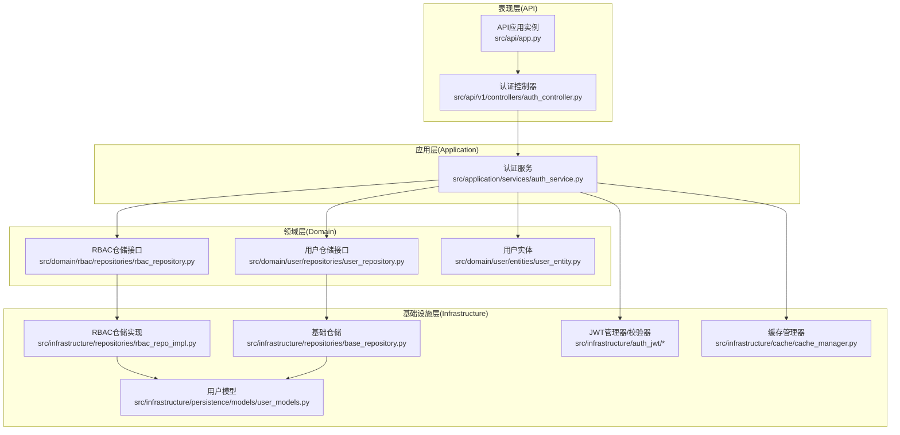
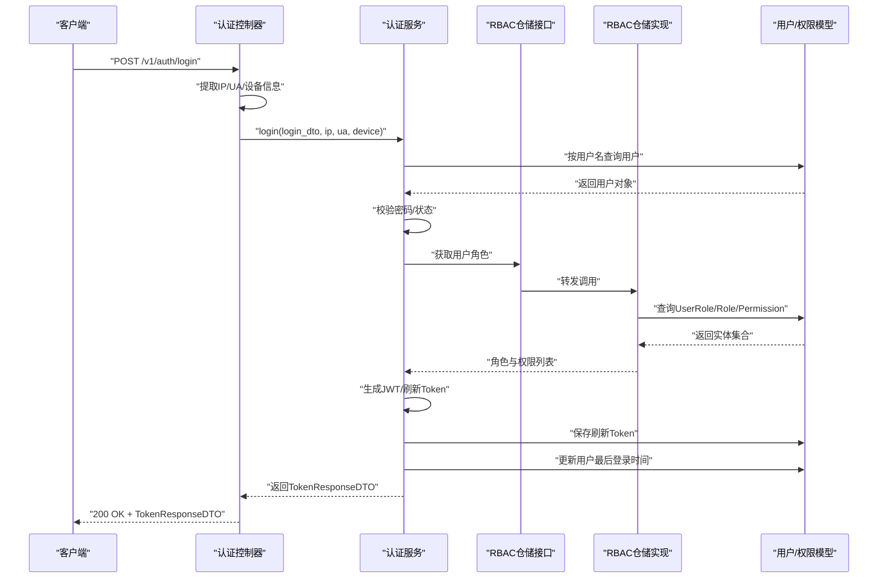
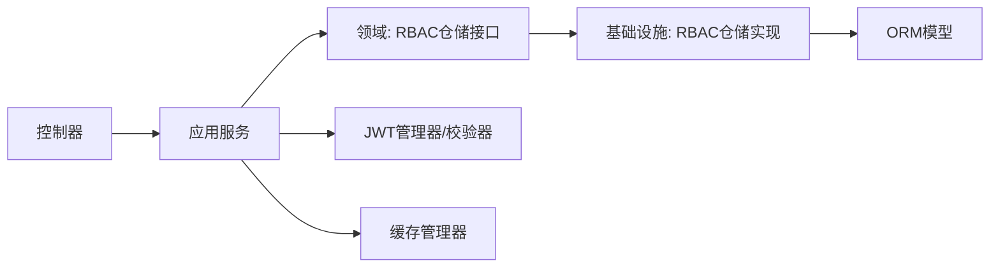

# 架构设计

<cite>
**本文档引用的文件**
- [src/api/app.py](file://src/api/app.py)
- [src/api/v1/controllers/auth_controller.py](file://src/api/v1/controllers/auth_controller.py)
- [src/application/services/auth_service.py](file://src/application/services/auth_service.py)
- [src/domain/rbac/repositories/rbac_repository.py](file://src/domain/rbac/repositories/rbac_repository.py)
- [src/infrastructure/repositories/rbac_repo_impl.py](file://src/infrastructure/repositories/rbac_repo_impl.py)
- [src/domain/user/repositories/user_repository.py](file://src/domain/user/repositories/user_repository.py)
- [src/infrastructure/repositories/base_repository.py](file://src/infrastructure/repositories/base_repository.py)
- [src/infrastructure/persistence/models/user_models.py](file://src/infrastructure/persistence/models/user_models.py)
- [src/application/dto/auth/token_response_dto.py](file://src/application/dto/auth/token_response_dto.py)
- [src/domain/user/entities/user_entity.py](file://src/domain/user/entities/user_entity.py)
- [config/settings/base.py](file://config/settings/base.py)
</cite>

## 目录
1. [引言](#引言)
2. [项目结构](#项目结构)
3. [核心组件](#核心组件)
4. [架构总览](#架构总览)
5. [详细组件分析](#详细组件分析)
6. [依赖分析](#依赖分析)
7. [性能考虑](#性能考虑)
8. [故障排查指南](#故障排查指南)
9. [结论](#结论)
10. [附录](#附录)

## 引言
本项目采用领域驱动设计（DDD）的四层架构模式，结合依赖倒置原则，将系统划分为表现层（API 层）、应用层、领域层与基础设施层。该设计旨在提升系统的可维护性、可测试性与扩展性，同时通过接口抽象降低层间耦合，确保业务逻辑集中在应用层与领域层，避免表现层直接依赖底层实现细节。

## 项目结构
项目采用按“层”组织的模块化结构，配合按“功能域”分包的组织方式，使职责清晰、边界明确：
- 表现层（API 层）：负责接收 HTTP 请求、参数绑定与响应封装，调用应用层服务完成业务处理。
- 应用层（Application）：编排业务用例，协调领域对象与基础设施，处理跨领域的事务性需求。
- 领域层（Domain）：承载核心业务规则与不变量，定义仓储接口与领域实体，保持对技术细节的无感知。
- 基础设施层（Infrastructure）：提供具体的数据访问实现、缓存、JWT 管理、ORM 模型等技术实现。

**图表来源**
- [src/api/app.py:1-48](file://src/api/app.py#L1-L48)
- [src/api/v1/controllers/auth_controller.py:1-133](file://src/api/v1/controllers/auth_controller.py#L1-L133)
- [src/application/services/auth_service.py:1-233](file://src/application/services/auth_service.py#L1-L233)
- [src/domain/rbac/repositories/rbac_repository.py:1-112](file://src/domain/rbac/repositories/rbac_repository.py#L1-L112)
- [src/infrastructure/repositories/rbac_repo_impl.py:1-251](file://src/infrastructure/repositories/rbac_repo_impl.py#L1-L251)
- [src/domain/user/repositories/user_repository.py:1-68](file://src/domain/user/repositories/user_repository.py#L1-L68)
- [src/infrastructure/repositories/base_repository.py:1-90](file://src/infrastructure/repositories/base_repository.py#L1-L90)
- [src/infrastructure/persistence/models/user_models.py:1-147](file://src/infrastructure/persistence/models/user_models.py#L1-L147)

**章节来源**
- [src/api/app.py:1-48](file://src/api/app.py#L1-L48)
- [config/settings/base.py:1-235](file://config/settings/base.py#L1-L235)

## 核心组件
- API 应用实例与路由注册：集中式创建 NinjaExtraAPI 实例并注册控制器，统一对外暴露接口。
- 认证控制器：作为表现层入口，接收请求、提取上下文信息（如 IP、UA），并将请求委派给应用层服务。
- 认证服务：应用层的核心业务编排者，负责用户凭据验证、角色/权限加载、JWT 生成与刷新、登出与令牌撤销、登录日志记录等。
- 领域仓储接口：定义角色、权限、用户等数据访问契约，约束应用层与基础设施层之间的依赖方向。
- 基础设施仓储实现：基于 Django ORM 的具体实现，负责模型映射、异步 CRUD、关联查询与聚合计算。
- DTO 与实体：DTO 用于 API 层与应用层之间的数据传输，实体承载领域不变量与业务行为。

**章节来源**
- [src/api/app.py:17-30](file://src/api/app.py#L17-L30)
- [src/api/v1/controllers/auth_controller.py:16-35](file://src/api/v1/controllers/auth_controller.py#L16-L35)
- [src/application/services/auth_service.py:20-111](file://src/application/services/auth_service.py#L20-L111)
- [src/domain/rbac/repositories/rbac_repository.py:12-112](file://src/domain/rbac/repositories/rbac_repository.py#L12-L112)
- [src/infrastructure/repositories/rbac_repo_impl.py:15-251](file://src/infrastructure/repositories/rbac_repo_impl.py#L15-L251)
- [src/application/dto/auth/token_response_dto.py:9-32](file://src/application/dto/auth/token_response_dto.py#L9-L32)
- [src/domain/user/entities/user_entity.py:11-120](file://src/domain/user/entities/user_entity.py#L11-L120)

## 架构总览
下图展示了从 API 控制器到仓储层的完整数据流，涵盖参数解析、业务处理、领域查询与数据持久化：

**图表来源**
- [src/api/v1/controllers/auth_controller.py:42-78](file://src/api/v1/controllers/auth_controller.py#L42-L78)
- [src/application/services/auth_service.py:26-111](file://src/application/services/auth_service.py#L26-L111)
- [src/domain/rbac/repositories/rbac_repository.py:88-111](file://src/domain/rbac/repositories/rbac_repository.py#L88-L111)
- [src/infrastructure/repositories/rbac_repo_impl.py:201-227](file://src/infrastructure/repositories/rbac_repo_impl.py#L201-L227)
- [src/infrastructure/persistence/models/user_models.py:12-88](file://src/infrastructure/persistence/models/user_models.py#L12-L88)

## 详细组件分析

### 表现层（API 层）
- 职责：接收 HTTP 请求、进行基本的请求头与上下文提取、调用应用层服务、封装响应 DTO。
- 关键点：控制器通过构造函数注入应用服务，遵循依赖倒置；使用装饰器声明路由与响应类型，保证接口契约清晰。
- 示例路径：
  - [API 应用与路由注册:17-30](file://src/api/app.py#L17-L30)
  - [认证控制器登录接口:42-78](file://src/api/v1/controllers/auth_controller.py#L42-L78)

**章节来源**
- [src/api/app.py:17-30](file://src/api/app.py#L17-L30)
- [src/api/v1/controllers/auth_controller.py:16-35](file://src/api/v1/controllers/auth_controller.py#L16-L35)

### 应用层（Application）
- 职责：编排业务流程，协调领域对象与基础设施，处理跨领域的事务性需求（如 JWT 生成、登录日志、缓存清理）。
- 关键点：认证服务在登录时进行用户状态校验、角色/权限加载、令牌生成与持久化，并记录登录日志；在刷新令牌时进行有效性校验并重新生成访问令牌。
- 示例路径：
  - [认证服务登录流程:26-111](file://src/application/services/auth_service.py#L26-111)
  - [认证服务刷新令牌流程:113-162](file://src/application/services/auth_service.py#L113-162)
  - [认证服务登出与缓存清理:164-180](file://src/application/services/auth_service.py#L164-180)

**章节来源**
- [src/application/services/auth_service.py:20-180](file://src/application/services/auth_service.py#L20-L180)

### 领域层（Domain）
- 职责：定义业务不变量与规则，提供仓储接口以约束数据访问契约，确保业务逻辑集中在领域层。
- 关键点：RBAC 仓储接口定义了角色、权限与用户角色关联的抽象操作；用户仓储接口定义了用户数据访问契约；用户实体包含业务行为与验证逻辑。
- 示例路径：
  - [RBAC 仓储接口:12-112](file://src/domain/rbac/repositories/rbac_repository.py#L12-112)
  - [用户仓储接口:11-68](file://src/domain/user/repositories/user_repository.py#L11-68)
  - [用户实体与验证:11-120](file://src/domain/user/entities/user_entity.py#L11-120)

**章节来源**
- [src/domain/rbac/repositories/rbac_repository.py:12-112](file://src/domain/rbac/repositories/rbac_repository.py#L12-L112)
- [src/domain/user/repositories/user_repository.py:11-68](file://src/domain/user/repositories/user_repository.py#L11-L68)
- [src/domain/user/entities/user_entity.py:11-120](file://src/domain/user/entities/user_entity.py#L11-L120)

### 基础设施层（Infrastructure）
- 职责：提供具体的技术实现，包括 ORM 模型、仓储实现、JWT 管理、缓存、中间件等。
- 关键点：RBAC 仓储实现基于 Django ORM 进行异步查询与关联加载；基础仓储提供通用 CRUD 方法；用户模型扩展了 Django 内置用户模型并增加索引与外键关系。
- 示例路径：
  - [RBAC 仓储实现:15-251](file://src/infrastructure/repositories/rbac_repo_impl.py#L15-251)
  - [基础仓储:13-90](file://src/infrastructure/repositories/base_repository.py#L13-90)
  - [用户模型:12-147](file://src/infrastructure/persistence/models/user_models.py#L12-147)

**章节来源**
- [src/infrastructure/repositories/rbac_repo_impl.py:15-251](file://src/infrastructure/repositories/rbac_repo_impl.py#L15-L251)
- [src/infrastructure/repositories/base_repository.py:13-90](file://src/infrastructure/repositories/base_repository.py#L13-L90)
- [src/infrastructure/persistence/models/user_models.py:12-147](file://src/infrastructure/persistence/models/user_models.py#L12-L147)

### 数据传输对象与实体
- DTO：用于 API 层与应用层之间的数据传输，确保接口契约与序列化一致性。
- 实体：承载业务不变量与行为，例如用户实体的验证逻辑与权限变更方法。
- 示例路径：
  - [Token 响应 DTO:9-32](file://src/application/dto/auth/token_response_dto.py#L9-32)
  - [用户实体:11-120](file://src/domain/user/entities/user_entity.py#L11-120)

**章节来源**
- [src/application/dto/auth/token_response_dto.py:9-32](file://src/application/dto/auth/token_response_dto.py#L9-L32)
- [src/domain/user/entities/user_entity.py:11-120](file://src/domain/user/entities/user_entity.py#L11-L120)

## 依赖分析
- 依赖倒置：表现层仅依赖应用层服务接口；应用层依赖领域仓储接口；基础设施层实现领域接口，从而降低上层对下层的耦合。
- 组件耦合：控制器与服务之间通过接口解耦；服务与仓储之间通过接口解耦；仓储实现与 ORM 模型之间存在直接依赖，但被封装在基础设施层内部。
- 外部依赖：系统依赖 Django、Django-Ninja-Extra、Redis 缓存、JWT 等第三方组件；配置集中在 settings 中。

**图表来源**
- [src/api/v1/controllers/auth_controller.py:27-34](file://src/api/v1/controllers/auth_controller.py#L27-L34)
- [src/application/services/auth_service.py:12-17](file://src/application/services/auth_service.py#L12-L17)
- [src/domain/rbac/repositories/rbac_repository.py:12-18](file://src/domain/rbac/repositories/rbac_repository.py#L12-L18)
- [src/infrastructure/repositories/rbac_repo_impl.py:15-19](file://src/infrastructure/repositories/rbac_repo_impl.py#L15-L19)
- [src/infrastructure/persistence/models/user_models.py:12-88](file://src/infrastructure/persistence/models/user_models.py#L12-L88)

**章节来源**
- [config/settings/base.py:22-52](file://config/settings/base.py#L22-L52)

## 性能考虑
- 异步 ORM：仓储实现广泛使用 Django 的异步 ORM 方法（如 aget、asave、acreate 等），有助于提升高并发场景下的吞吐能力。
- 查询优化：仓储实现中使用 select_related 与 prefetch_related 减少 N+1 查询；模型建立复合索引以加速查询。
- 缓存策略：通过缓存管理器对用户角色、权限等热点数据进行缓存，减少数据库压力；登出时主动清理相关缓存键。
- JWT 生命周期：通过配置项控制访问令牌与刷新令牌的生命周期，平衡安全性与用户体验。
- 中间件与限流：集成速率限制与安全中间件，防止滥用与攻击。

**章节来源**
- [src/infrastructure/repositories/rbac_repo_impl.py:203-227](file://src/infrastructure/repositories/rbac_repo_impl.py#L203-L227)
- [src/infrastructure/persistence/models/user_models.py:76-80](file://src/infrastructure/persistence/models/user_models.py#L76-L80)
- [src/application/services/auth_service.py:164-180](file://src/application/services/auth_service.py#L164-L180)
- [config/settings/base.py:138-151](file://config/settings/base.py#L138-L151)
- [config/settings/base.py:228-235](file://config/settings/base.py#L228-L235)

## 故障排查指南
- 认证失败：检查用户是否存在、密码是否正确、账户是否激活；查看登录日志记录与失败原因。
- 令牌刷新失败：确认刷新令牌是否有效、是否过期、是否已被撤销；检查 JWT 配置与签名密钥。
- 权限不足：确认用户角色与权限是否正确分配；检查权限代码与资源匹配关系。
- 数据库连接问题：核对数据库配置、连接池参数与连接超时设置；关注连接复用与长连接策略。
- 缓存异常：检查 Redis 连接配置与可用性；确认缓存键命名与过期策略。

**章节来源**
- [src/application/services/auth_service.py:36-56](file://src/application/services/auth_service.py#L36-L56)
- [src/application/services/auth_service.py:113-120](file://src/application/services/auth_service.py#L113-L120)
- [config/settings/base.py:77-88](file://config/settings/base.py#L77-L88)
- [config/settings/base.py:153-163](file://config/settings/base.py#L153-L163)

## 结论
本项目通过 DDD 四层架构与依赖倒置原则，实现了清晰的职责分离与良好的可维护性。表现层专注于接口契约与响应封装，应用层编排业务流程，领域层承载业务不变量，基础设施层提供具体实现。通过 DTO 与实体的分离、仓储接口的抽象以及异步 ORM 与缓存策略，系统在性能、可维护性与扩展性方面取得了良好平衡。建议在后续迭代中持续完善领域模型与用例编排，增强测试覆盖，并根据实际负载调整缓存与限流策略。

## 附录
- 配置参考：Django、Django-Ninja-Extra、JWT、Redis、CORS、日志与限流等配置项集中于 settings 基础配置文件中，便于环境差异化管理。
- 示例路径：
  - [基础配置:138-163](file://config/settings/base.py#L138-L163)

**章节来源**
- [config/settings/base.py:138-163](file://config/settings/base.py#L138-L163)