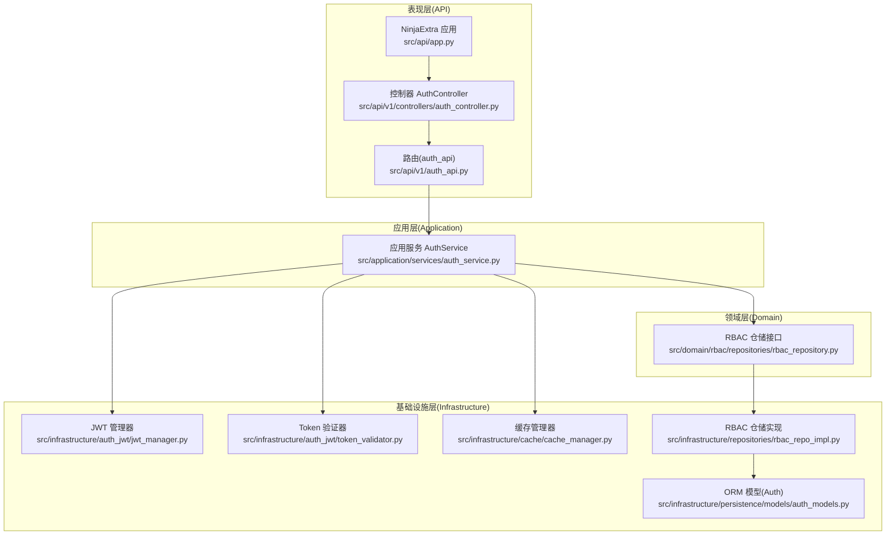
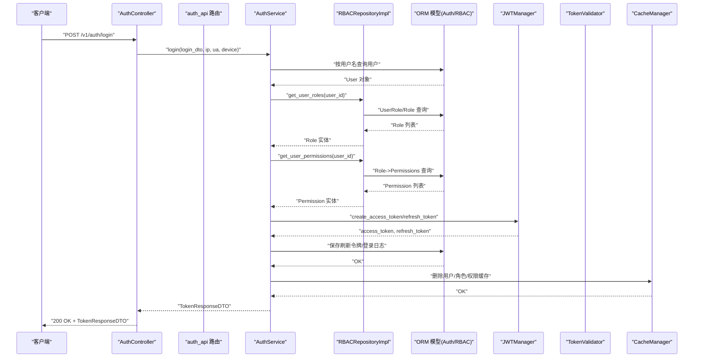
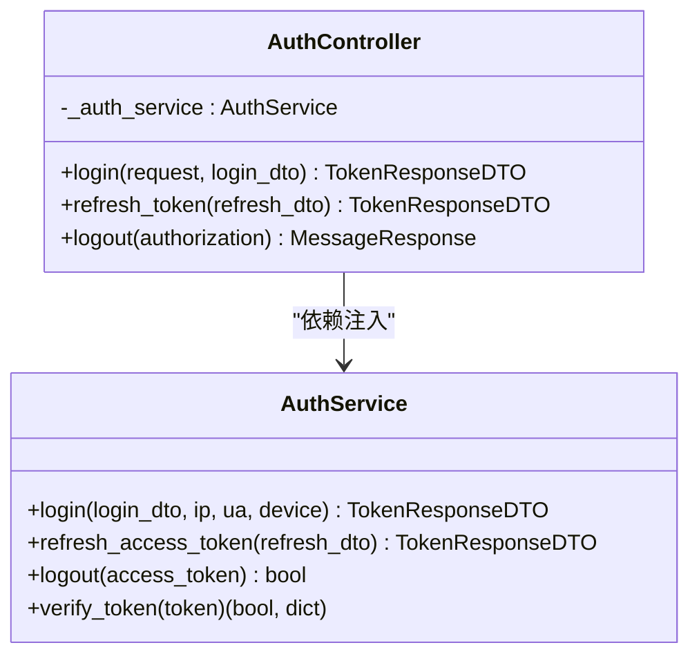
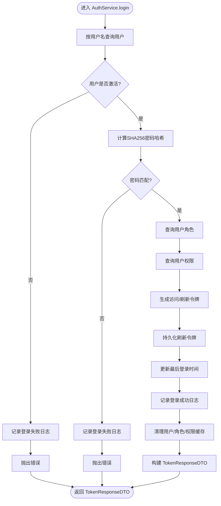
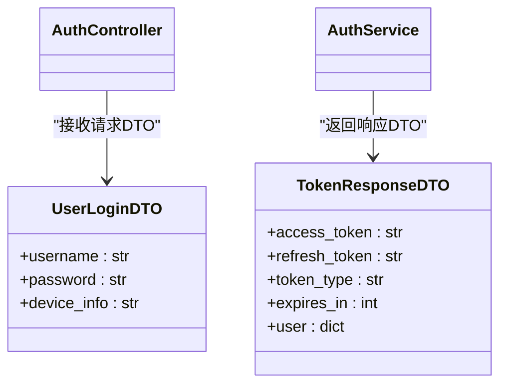
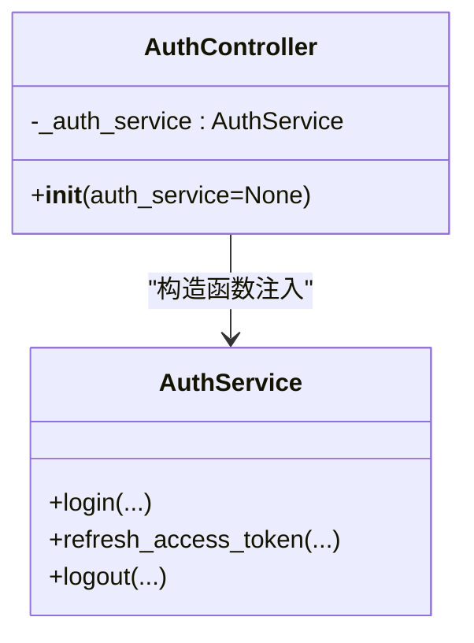
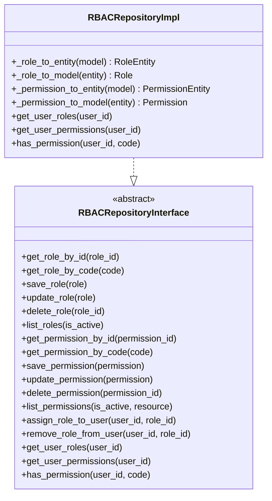
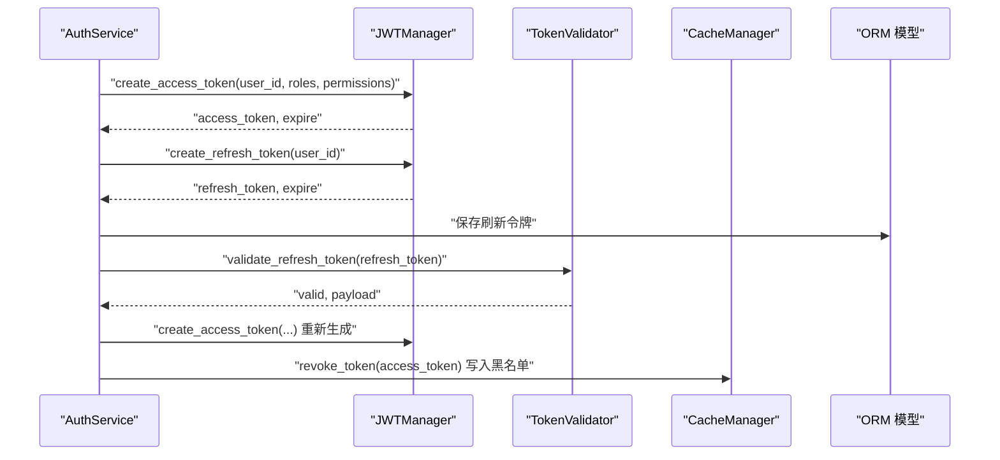
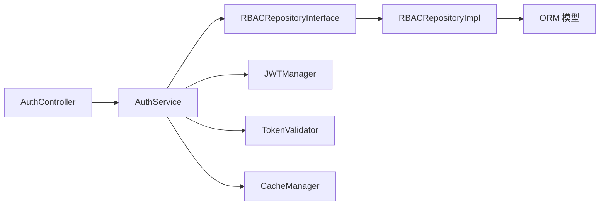

# 组件交互与数据流

<cite>
**本文档引用的文件**
- [src/api/app.py](file://src/api/app.py)
- [src/api/v1/auth_api.py](file://src/api/v1/auth_api.py)
- [src/api/v1/controllers/auth_controller.py](file://src/api/v1/controllers/auth_controller.py)
- [src/application/services/auth_service.py](file://src/application/services/auth_service.py)
- [src/application/dto/auth/token_response_dto.py](file://src/application/dto/auth/token_response_dto.py)
- [src/application/dto/user/user_login_dto.py](file://src/application/dto/user/user_login_dto.py)
- [src/domain/rbac/repositories/rbac_repository.py](file://src/domain/rbac/repositories/rbac_repository.py)
- [src/infrastructure/repositories/rbac_repo_impl.py](file://src/infrastructure/repositories/rbac_repo_impl.py)
- [src/infrastructure/auth_jwt/jwt_manager.py](file://src/infrastructure/auth_jwt/jwt_manager.py)
- [src/infrastructure/auth_jwt/token_validator.py](file://src/infrastructure/auth_jwt/token_validator.py)
- [src/infrastructure/cache/cache_manager.py](file://src/infrastructure/cache/cache_manager.py)
- [src/infrastructure/persistence/models/auth_models.py](file://src/infrastructure/persistence/models/auth_models.py)
- [src/api/common/responses.py](file://src/api/common/responses.py)
- [src/core/middlewares/request_logging_middleware.py](file://src/core/middlewares/request_logging_middleware.py)
- [config/settings/base.py](file://config/settings/base.py)
</cite>

## 目录
1. [引言](#引言)
2. [项目结构](#项目结构)
3. [核心组件](#核心组件)
4. [架构总览](#架构总览)
5. [详细组件分析](#详细组件分析)
6. [依赖分析](#依赖分析)
7. [性能考虑](#性能考虑)
8. [故障排查指南](#故障排查指南)
9. [结论](#结论)
10. [附录](#附录)

## 引言
本文件面向 Hello-Django-Ninja-Api 项目的开发者与架构师，系统梳理“从 HTTP 请求到数据库操作”的完整数据流，解释控制器、应用服务、领域对象、仓储接口与持久化层之间的交互关系；阐述 DTO 在各层之间的传递与转换；说明依赖注入的实现方式与松耦合设计；给出调用链路图与时序图；分析异常传播路径与错误处理策略；并提出性能监控点与关键指标收集建议。

## 项目结构
项目采用分层架构与依赖倒置原则：
- 表现层（API）：Ninja/NinjaExtra 控制器与路由，负责接收 HTTP 请求、封装响应。
- 应用层（Application）：应用服务编排业务流程，协调领域对象与基础设施。
- 领域层（Domain）：领域实体与仓储接口，定义业务契约。
- 基础设施层（Infrastructure）：仓储实现、JWT 管理、缓存、ORM 模型等。
- 配置层（Config）：Django 设置、中间件、缓存与安全配置。

图表来源
- [src/api/app.py:17-30](file://src/api/app.py#L17-L30)
- [src/api/v1/controllers/auth_controller.py:16-34](file://src/api/v1/controllers/auth_controller.py#L16-L34)
- [src/api/v1/auth_api.py:22-73](file://src/api/v1/auth_api.py#L22-L73)
- [src/application/services/auth_service.py:20-232](file://src/application/services/auth_service.py#L20-L232)
- [src/domain/rbac/repositories/rbac_repository.py:12-112](file://src/domain/rbac/repositories/rbac_repository.py#L12-L112)
- [src/infrastructure/repositories/rbac_repo_impl.py:15-252](file://src/infrastructure/repositories/rbac_repo_impl.py#L15-L252)
- [src/infrastructure/auth_jwt/jwt_manager.py:13-146](file://src/infrastructure/auth_jwt/jwt_manager.py#L13-L146)
- [src/infrastructure/auth_jwt/token_validator.py:11-107](file://src/infrastructure/auth_jwt/token_validator.py#L11-L107)
- [src/infrastructure/cache/cache_manager.py:16-148](file://src/infrastructure/cache/cache_manager.py#L16-L148)
- [src/infrastructure/persistence/models/auth_models.py:12-114](file://src/infrastructure/persistence/models/auth_models.py#L12-L114)

章节来源
- [src/api/app.py:17-30](file://src/api/app.py#L17-L30)
- [src/api/v1/controllers/auth_controller.py:16-34](file://src/api/v1/controllers/auth_controller.py#L16-L34)
- [src/api/v1/auth_api.py:22-73](file://src/api/v1/auth_api.py#L22-L73)
- [src/application/services/auth_service.py:20-232](file://src/application/services/auth_service.py#L20-L232)
- [src/domain/rbac/repositories/rbac_repository.py:12-112](file://src/domain/rbac/repositories/rbac_repository.py#L12-L112)
- [src/infrastructure/repositories/rbac_repo_impl.py:15-252](file://src/infrastructure/repositories/rbac_repo_impl.py#L15-L252)
- [src/infrastructure/auth_jwt/jwt_manager.py:13-146](file://src/infrastructure/auth_jwt/jwt_manager.py#L13-L146)
- [src/infrastructure/auth_jwt/token_validator.py:11-107](file://src/infrastructure/auth_jwt/token_validator.py#L11-L107)
- [src/infrastructure/cache/cache_manager.py:16-148](file://src/infrastructure/cache/cache_manager.py#L16-L148)
- [src/infrastructure/persistence/models/auth_models.py:12-114](file://src/infrastructure/persistence/models/auth_models.py#L12-L114)

## 核心组件
- API 应用与控制器
  - NinjaExtra 应用注册控制器，提供健康检查与根路径。
  - 控制器负责解析请求、提取头部与元数据，并调用应用服务。
- 应用服务
  - AuthService 编排认证流程：校验凭据、查询用户角色与权限、生成/刷新令牌、持久化登录日志与刷新令牌、清理缓存。
- 领域与仓储
  - RBACRepositoryInterface 定义角色/权限与用户关联的抽象。
  - RBACRepositoryImpl 实现数据库读写与实体/模型转换。
- 基础设施
  - JWTManager：生成访问/刷新令牌、解码与过期判断。
  - TokenValidator：验证令牌有效性、黑名单检查、撤销令牌。
  - CacheManager：统一缓存键空间与用户角色/权限缓存。
  - ORM 模型：RefreshToken、TokenBlacklist、LoginLog。

章节来源
- [src/api/app.py:17-30](file://src/api/app.py#L17-L30)
- [src/api/v1/controllers/auth_controller.py:16-34](file://src/api/v1/controllers/auth_controller.py#L16-L34)
- [src/application/services/auth_service.py:20-232](file://src/application/services/auth_service.py#L20-L232)
- [src/domain/rbac/repositories/rbac_repository.py:12-112](file://src/domain/rbac/repositories/rbac_repository.py#L12-L112)
- [src/infrastructure/repositories/rbac_repo_impl.py:15-252](file://src/infrastructure/repositories/rbac_repo_impl.py#L15-L252)
- [src/infrastructure/auth_jwt/jwt_manager.py:13-146](file://src/infrastructure/auth_jwt/jwt_manager.py#L13-L146)
- [src/infrastructure/auth_jwt/token_validator.py:11-107](file://src/infrastructure/auth_jwt/token_validator.py#L11-L107)
- [src/infrastructure/cache/cache_manager.py:16-148](file://src/infrastructure/cache/cache_manager.py#L16-L148)
- [src/infrastructure/persistence/models/auth_models.py:12-114](file://src/infrastructure/persistence/models/auth_models.py#L12-L114)

## 架构总览
下图展示从 HTTP 请求到数据库的完整数据流，涵盖 DTO 转换、服务编排、仓储访问与持久化。

图表来源
- [src/api/v1/controllers/auth_controller.py:72-78](file://src/api/v1/controllers/auth_controller.py#L72-L78)
- [src/api/v1/auth_api.py:38-45](file://src/api/v1/auth_api.py#L38-L45)
- [src/application/services/auth_service.py:26-111](file://src/application/services/auth_service.py#L26-L111)
- [src/infrastructure/repositories/rbac_repo_impl.py:201-228](file://src/infrastructure/repositories/rbac_repo_impl.py#L201-L228)
- [src/infrastructure/auth_jwt/jwt_manager.py:25-80](file://src/infrastructure/auth_jwt/jwt_manager.py#L25-L80)
- [src/infrastructure/persistence/models/auth_models.py:12-44](file://src/infrastructure/persistence/models/auth_models.py#L12-L44)
- [src/infrastructure/cache/cache_manager.py:103-137](file://src/infrastructure/cache/cache_manager.py#L103-L137)

## 详细组件分析

### 认证控制器与路由
- 控制器通过构造函数注入 AuthService，支持外部传入实例以实现测试与替换。
- 路由层负责解析请求头与元数据（如 IP、UA），并将 DTO 传入应用服务。
- 控制器对异常进行捕获并返回统一响应对象。

图表来源
- [src/api/v1/controllers/auth_controller.py:27-132](file://src/api/v1/controllers/auth_controller.py#L27-L132)
- [src/application/services/auth_service.py:20-232](file://src/application/services/auth_service.py#L20-L232)

章节来源
- [src/api/v1/controllers/auth_controller.py:27-132](file://src/api/v1/controllers/auth_controller.py#L27-L132)
- [src/api/v1/auth_api.py:22-73](file://src/api/v1/auth_api.py#L22-L73)

### 应用服务：认证流程
- 登录流程
  - 校验用户存在与激活状态。
  - 校验密码哈希。
  - 查询用户角色与权限。
  - 生成访问/刷新令牌并持久化刷新令牌。
  - 更新用户最后登录时间。
  - 记录登录日志。
  - 清理相关缓存。
- 刷新流程
  - 验证刷新令牌有效性与类型。
  - 重新生成访问令牌。
  - 返回响应 DTO。
- 登出流程
  - 撤销访问令牌（加入黑名单）。
  - 清理用户缓存。

图表来源
- [src/application/services/auth_service.py:26-111](file://src/application/services/auth_service.py#L26-L111)
- [src/infrastructure/repositories/rbac_repo_impl.py:201-228](file://src/infrastructure/repositories/rbac_repo_impl.py#L201-L228)
- [src/infrastructure/persistence/models/auth_models.py:12-44](file://src/infrastructure/persistence/models/auth_models.py#L12-L44)
- [src/infrastructure/cache/cache_manager.py:103-137](file://src/infrastructure/cache/cache_manager.py#L103-L137)

章节来源
- [src/application/services/auth_service.py:26-162](file://src/application/services/auth_service.py#L26-L162)

### DTO 设计与转换
- 请求 DTO
  - UserLoginDTO：封装登录所需的用户名、密码与设备信息。
- 响应 DTO
  - TokenResponseDTO：封装访问令牌、刷新令牌、令牌类型、过期时间与用户信息。
- 转换原则
  - 控制器接收请求 DTO 并传递给应用服务。
  - 应用服务在业务完成后构建响应 DTO 返回给控制器。
  - DTO 作为跨层边界对象，避免直接暴露领域实体与 ORM 模型。

图表来源
- [src/api/v1/controllers/auth_controller.py:42-78](file://src/api/v1/controllers/auth_controller.py#L42-L78)
- [src/application/services/auth_service.py:101-111](file://src/application/services/auth_service.py#L101-L111)
- [src/application/dto/user/user_login_dto.py:9-27](file://src/application/dto/user/user_login_dto.py#L9-L27)
- [src/application/dto/auth/token_response_dto.py:9-31](file://src/application/dto/auth/token_response_dto.py#L9-L31)

章节来源
- [src/application/dto/user/user_login_dto.py:9-27](file://src/application/dto/user/user_login_dto.py#L9-L27)
- [src/application/dto/auth/token_response_dto.py:9-31](file://src/application/dto/auth/token_response_dto.py#L9-L31)

### 依赖注入与松耦合
- 控制器通过构造函数注入 AuthService，支持默认实例或外部传入实例，便于测试与替换。
- 应用服务内部组合使用 JWT 管理器、Token 验证器、缓存管理器与仓储实现，但通过接口与全局实例解耦。
- 仓储接口与实现分离，应用服务仅依赖抽象，降低对具体实现的耦合。

图表来源
- [src/api/v1/controllers/auth_controller.py:27-34](file://src/api/v1/controllers/auth_controller.py#L27-L34)
- [src/application/services/auth_service.py:20-232](file://src/application/services/auth_service.py#L20-L232)

章节来源
- [src/api/v1/controllers/auth_controller.py:27-34](file://src/api/v1/controllers/auth_controller.py#L27-L34)

### 仓储接口与实现
- 接口定义了角色/权限与用户关联的抽象方法，确保业务规则与数据访问分离。
- 实现类负责 ORM 查询、实体与模型的双向转换，并处理复杂关联查询（如用户角色与权限集合）。

图表来源
- [src/domain/rbac/repositories/rbac_repository.py:12-112](file://src/domain/rbac/repositories/rbac_repository.py#L12-L112)
- [src/infrastructure/repositories/rbac_repo_impl.py:15-252](file://src/infrastructure/repositories/rbac_repo_impl.py#L15-L252)

章节来源
- [src/domain/rbac/repositories/rbac_repository.py:12-112](file://src/domain/rbac/repositories/rbac_repository.py#L12-L112)
- [src/infrastructure/repositories/rbac_repo_impl.py:15-252](file://src/infrastructure/repositories/rbac_repo_impl.py#L15-L252)

### JWT 与 Token 管理
- JWTManager：生成访问/刷新令牌、解码与过期判断、提取声明。
- TokenValidator：验证访问/刷新令牌、黑名单检查、撤销令牌并写入缓存。
- 登录/刷新流程中，应用服务调用 JWTManager 生成令牌，使用 TokenValidator 验证刷新令牌与撤销访问令牌。

图表来源
- [src/application/services/auth_service.py:66-87](file://src/application/services/auth_service.py#L66-L87)
- [src/application/services/auth_service.py:113-162](file://src/application/services/auth_service.py#L113-L162)
- [src/infrastructure/auth_jwt/jwt_manager.py:25-80](file://src/infrastructure/auth_jwt/jwt_manager.py#L25-L80)
- [src/infrastructure/auth_jwt/token_validator.py:62-103](file://src/infrastructure/auth_jwt/token_validator.py#L62-L103)
- [src/infrastructure/cache/cache_manager.py:103-137](file://src/infrastructure/cache/cache_manager.py#L103-L137)
- [src/infrastructure/persistence/models/auth_models.py:12-44](file://src/infrastructure/persistence/models/auth_models.py#L12-L44)

章节来源
- [src/infrastructure/auth_jwt/jwt_manager.py:13-146](file://src/infrastructure/auth_jwt/jwt_manager.py#L13-L146)
- [src/infrastructure/auth_jwt/token_validator.py:11-107](file://src/infrastructure/auth_jwt/token_validator.py#L11-L107)

### 缓存与持久化
- 缓存管理器提供统一键空间与用户角色/权限缓存接口，减少重复查询。
- 登录成功后清理相关缓存，登出时撤销令牌并清理缓存。
- 刷新令牌与登录日志持久化至数据库。

章节来源
- [src/infrastructure/cache/cache_manager.py:16-148](file://src/infrastructure/cache/cache_manager.py#L16-L148)
- [src/application/services/auth_service.py:94-95](file://src/application/services/auth_service.py#L94-L95)
- [src/application/services/auth_service.py:172-178](file://src/application/services/auth_service.py#L172-L178)
- [src/infrastructure/persistence/models/auth_models.py:12-114](file://src/infrastructure/persistence/models/auth_models.py#L12-L114)

## 依赖分析
- 组件内聚与耦合
  - 控制器与应用服务高内聚、低耦合：控制器只负责请求解析与响应封装。
  - 应用服务通过接口依赖仓储，避免对具体实现的直接依赖。
  - JWT 与缓存通过全局实例被应用服务组合使用，保持简单与可测试性。
- 外部依赖
  - Django ORM、Redis 缓存、Ninja/NinjaExtra、Pydantic DTO。
- 循环依赖
  - 未发现循环导入；DTO 位于应用层，控制器与服务通过 DTO 交互。

图表来源
- [src/api/v1/controllers/auth_controller.py:16-34](file://src/api/v1/controllers/auth_controller.py#L16-L34)
- [src/application/services/auth_service.py:20-232](file://src/application/services/auth_service.py#L20-L232)
- [src/domain/rbac/repositories/rbac_repository.py:12-112](file://src/domain/rbac/repositories/rbac_repository.py#L12-L112)
- [src/infrastructure/repositories/rbac_repo_impl.py:15-252](file://src/infrastructure/repositories/rbac_repo_impl.py#L15-L252)
- [src/infrastructure/auth_jwt/jwt_manager.py:13-146](file://src/infrastructure/auth_jwt/jwt_manager.py#L13-L146)
- [src/infrastructure/auth_jwt/token_validator.py:11-107](file://src/infrastructure/auth_jwt/token_validator.py#L11-L107)
- [src/infrastructure/cache/cache_manager.py:16-148](file://src/infrastructure/cache/cache_manager.py#L16-L148)
- [src/infrastructure/persistence/models/auth_models.py:12-114](file://src/infrastructure/persistence/models/auth_models.py#L12-L114)

章节来源
- [src/api/v1/controllers/auth_controller.py:16-34](file://src/api/v1/controllers/auth_controller.py#L16-L34)
- [src/application/services/auth_service.py:20-232](file://src/application/services/auth_service.py#L20-L232)
- [src/domain/rbac/repositories/rbac_repository.py:12-112](file://src/domain/rbac/repositories/rbac_repository.py#L12-L112)
- [src/infrastructure/repositories/rbac_repo_impl.py:15-252](file://src/infrastructure/repositories/rbac_repo_impl.py#L15-L252)
- [src/infrastructure/auth_jwt/jwt_manager.py:13-146](file://src/infrastructure/auth_jwt/jwt_manager.py#L13-L146)
- [src/infrastructure/auth_jwt/token_validator.py:11-107](file://src/infrastructure/auth_jwt/token_validator.py#L11-L107)
- [src/infrastructure/cache/cache_manager.py:16-148](file://src/infrastructure/cache/cache_manager.py#L16-L148)
- [src/infrastructure/persistence/models/auth_models.py:12-114](file://src/infrastructure/persistence/models/auth_models.py#L12-L114)

## 性能考虑
- 缓存策略
  - 用户角色与权限缓存：通过 CacheManager 的用户维度键空间存储，减少重复查询。
  - 登录成功与刷新令牌场景：及时清理相关缓存，保证一致性。
- 数据库访问
  - 关联查询使用 select_related/prefetch_related，降低 N+1 查询风险。
  - 使用异步 ORM 方法（aget/alist/adelete/asave）提升并发性能。
- 中间件与日志
  - RequestLoggingMiddleware 记录请求耗时与状态，便于定位慢请求。
  - 配置日志级别与输出格式，生产环境建议控制日志量。
- JWT 与黑名单
  - TokenValidator 将黑名单写入缓存，避免频繁数据库查询。
- 指标建议
  - 请求 QPS、P95/P99 延迟、错误率、缓存命中率、数据库慢查询数、Redis 命中率。

章节来源
- [src/infrastructure/cache/cache_manager.py:93-137](file://src/infrastructure/cache/cache_manager.py#L93-L137)
- [src/infrastructure/repositories/rbac_repo_impl.py:201-228](file://src/infrastructure/repositories/rbac_repo_impl.py#L201-L228)
- [src/core/middlewares/request_logging_middleware.py:14-86](file://src/core/middlewares/request_logging_middleware.py#L14-L86)
- [config/settings/base.py:174-226](file://config/settings/base.py#L174-L226)

## 故障排查指南
- 常见异常与传播
  - 登录失败：用户未激活或密码错误会记录登录日志并抛出异常。
  - 刷新令牌无效：TokenValidator 校验失败或类型不正确。
  - 缓存异常：CacheManager 在异常时记录日志并返回默认值，不影响主流程。
- 排查步骤
  - 查看请求日志中间件输出，确认请求耗时与状态码。
  - 检查 Redis 缓存键空间是否存在黑名单与用户缓存。
  - 核对 JWT 配置（算法、密钥、过期时间）与 SIMPLE_JWT 设置。
  - 确认数据库连接与迁移状态，检查 ORM 模型索引与查询计划。
- 错误处理策略
  - 控制器捕获 ValueError 并返回统一消息响应。
  - 应用服务在业务失败时记录日志并抛出明确错误。

章节来源
- [src/application/services/auth_service.py:40-56](file://src/application/services/auth_service.py#L40-L56)
- [src/application/services/auth_service.py:118-120](file://src/application/services/auth_service.py#L118-L120)
- [src/infrastructure/cache/cache_manager.py:42-58](file://src/infrastructure/cache/cache_manager.py#L42-L58)
- [src/core/middlewares/request_logging_middleware.py:44-66](file://src/core/middlewares/request_logging_middleware.py#L44-L66)
- [src/api/common/responses.py:13-110](file://src/api/common/responses.py#L13-L110)

## 结论
本项目通过清晰的分层架构与依赖倒置，实现了从 HTTP 请求到数据库操作的稳定数据流。控制器与应用服务职责明确，DTO 在各层之间传递与转换，仓储接口与实现分离，JWT 与缓存协同保障性能与安全。建议在生产环境中完善监控指标、优化慢查询与缓存策略，并持续演进领域模型与业务规则。

## 附录
- 统一响应与消息对象
  - MessageResponse：用于返回简单消息。
  - ResponseFactory：提供成功/错误/分页等通用响应工厂方法。
- 配置要点
  - Django 设置中启用 NinjaExtra、CORS、Redis 缓存与 SIMPLE_JWT。
  - 中间件顺序影响限流、安全与日志记录效果。

章节来源
- [src/api/common/responses.py:13-110](file://src/api/common/responses.py#L13-L110)
- [config/settings/base.py:22-37](file://config/settings/base.py#L22-L37)
- [config/settings/base.py:49-52](file://config/settings/base.py#L49-L52)
- [config/settings/base.py:153-163](file://config/settings/base.py#L153-L163)
- [config/settings/base.py:137-151](file://config/settings/base.py#L137-L151)