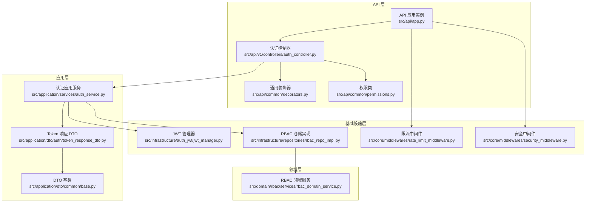
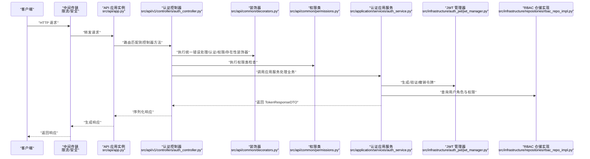
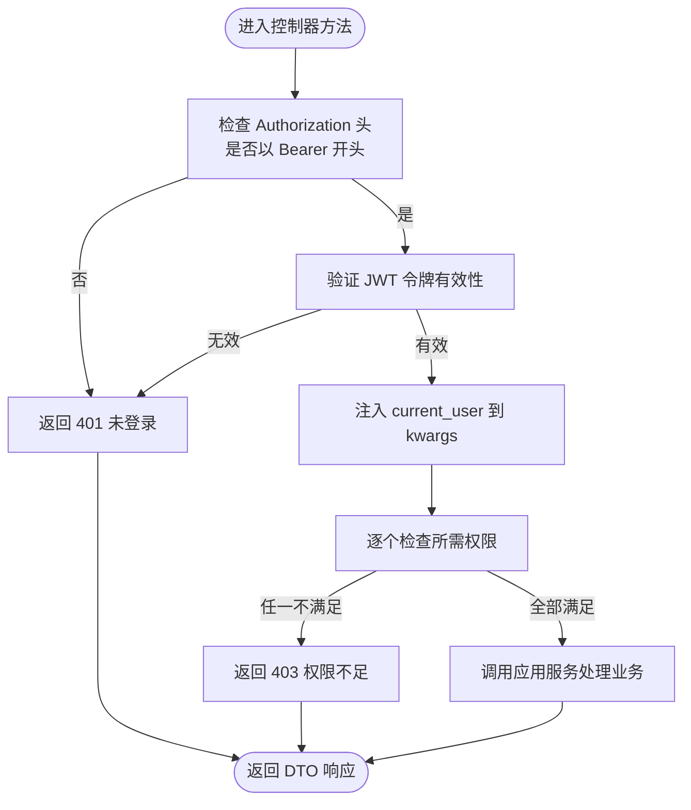
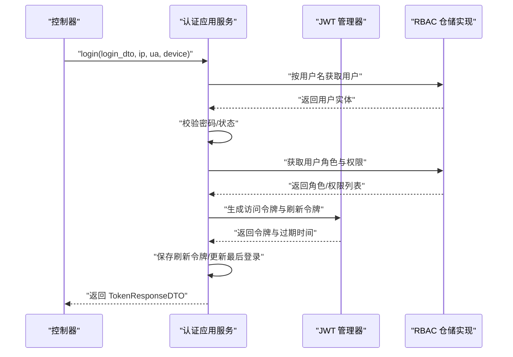
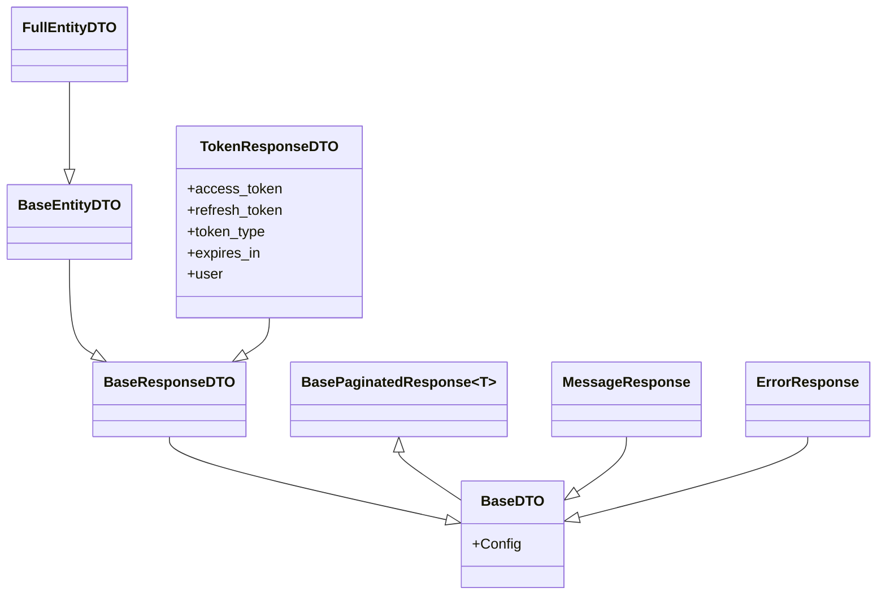
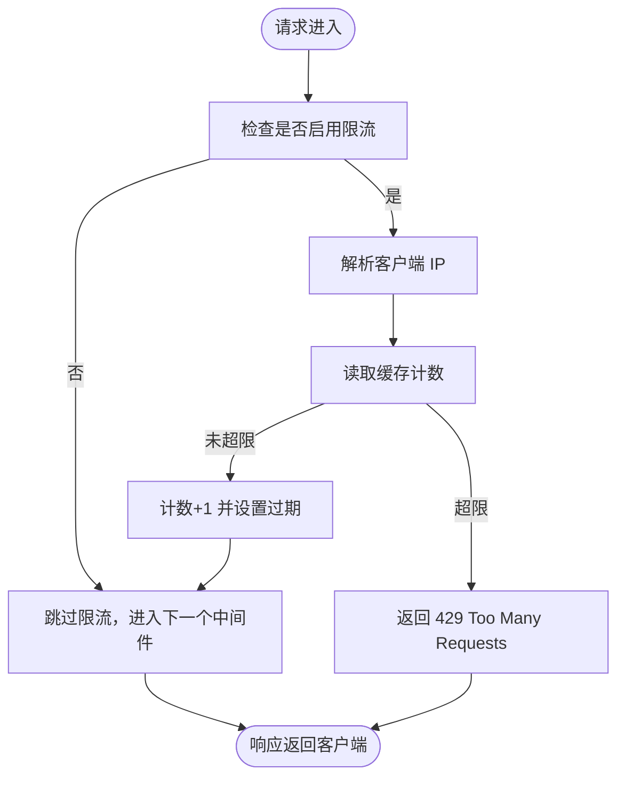
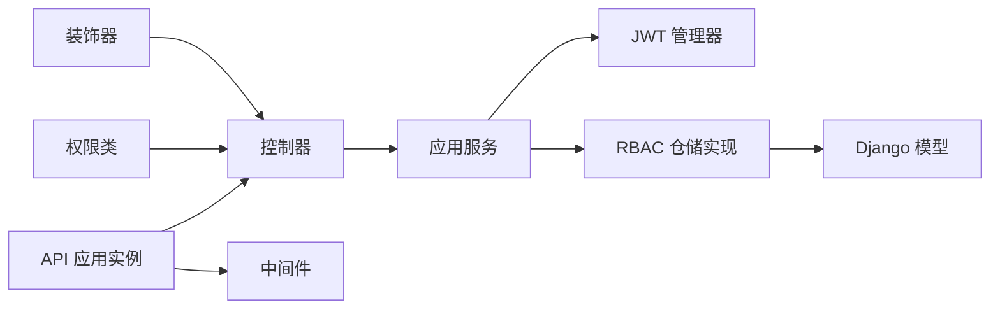

# 组件交互机制

<cite>
**本文引用的文件**
- [src/api/app.py](file://src/api/app.py)
- [src/api/common/decorators.py](file://src/api/common/decorators.py)
- [src/api/common/permissions.py](file://src/api/common/permissions.py)
- [src/api/v1/controllers/auth_controller.py](file://src/api/v1/controllers/auth_controller.py)
- [src/application/services/auth_service.py](file://src/application/services/auth_service.py)
- [src/application/dto/auth/token_response_dto.py](file://src/application/dto/auth/token_response_dto.py)
- [src/application/dto/common/base.py](file://src/application/dto/common/base.py)
- [src/core/middlewares/__init__.py](file://src/core/middlewares/__init__.py)
- [src/core/middlewares/rate_limit_middleware.py](file://src/core/middlewares/rate_limit_middleware.py)
- [src/core/middlewares/security_middleware.py](file://src/core/middlewares/security_middleware.py)
- [src/infrastructure/auth_jwt/jwt_manager.py](file://src/infrastructure/auth_jwt/jwt_manager.py)
- [src/domain/rbac/services/rbac_domain_service.py](file://src/domain/rbac/services/rbac_domain_service.py)
- [src/infrastructure/repositories/rbac_repo_impl.py](file://src/infrastructure/repositories/rbac_repo_impl.py)
- [config/settings/base.py](file://config/settings/base.py)
</cite>

## 目录
1. [引言](#引言)
2. [项目结构](#项目结构)
3. [核心组件](#核心组件)
4. [架构总览](#架构总览)
5. [详细组件分析](#详细组件分析)
6. [依赖分析](#依赖分析)
7. [性能考虑](#性能考虑)
8. [故障排查指南](#故障排查指南)
9. [结论](#结论)
10. [附录](#附录)

## 引言
本文件聚焦 Hello-Django-Ninja-Api 的“组件交互机制”，系统性阐述以下主题：
- API 控制器如何接收请求并通过装饰器与权限类进行预处理
- 应用服务如何协调领域服务与仓储层并处理业务逻辑
- DTO 对象如何在各层之间传递数据
- 中间件如何在请求处理流程中插入横切功能
- 依赖注入的实现方式与组件生命周期管理
- 通过时序图与交互图展示典型请求的完整处理流程（认证、权限检查、业务处理、响应生成）
- 组件解耦的最佳实践与常见问题的解决方案

## 项目结构
项目采用分层架构与清晰的模块划分：
- API 层：暴露 REST 接口，负责请求解析、装饰器与权限类预处理、响应序列化
- 应用层：编排业务流程，协调领域服务与仓储层
- 领域层：核心业务规则与实体
- 基础设施层：JWT、缓存、数据库访问、中间件等基础设施能力
- 配置层：Django 设置与中间件注册

图表来源
- [src/api/app.py:1-48](file://src/api/app.py#L1-L48)
- [src/api/v1/controllers/auth_controller.py:1-133](file://src/api/v1/controllers/auth_controller.py#L1-L133)
- [src/api/common/decorators.py:1-191](file://src/api/common/decorators.py#L1-L191)
- [src/api/common/permissions.py:1-245](file://src/api/common/permissions.py#L1-L245)
- [src/application/services/auth_service.py:1-233](file://src/application/services/auth_service.py#L1-L233)
- [src/application/dto/auth/token_response_dto.py:1-32](file://src/application/dto/auth/token_response_dto.py#L1-L32)
- [src/application/dto/common/base.py:1-206](file://src/application/dto/common/base.py#L1-L206)
- [src/infrastructure/auth_jwt/jwt_manager.py:1-147](file://src/infrastructure/auth_jwt/jwt_manager.py#L1-L147)
- [src/domain/rbac/services/rbac_domain_service.py:1-144](file://src/domain/rbac/services/rbac_domain_service.py#L1-L144)
- [src/infrastructure/repositories/rbac_repo_impl.py:1-251](file://src/infrastructure/repositories/rbac_repo_impl.py#L1-L251)
- [src/core/middlewares/rate_limit_middleware.py:1-112](file://src/core/middlewares/rate_limit_middleware.py#L1-L112)
- [src/core/middlewares/security_middleware.py:1-54](file://src/core/middlewares/security_middleware.py#L1-L54)

章节来源
- [src/api/app.py:1-48](file://src/api/app.py#L1-L48)
- [config/settings/base.py:1-235](file://config/settings/base.py#L1-L235)

## 核心组件
- API 应用实例与路由注册：统一创建 NinjaExtraAPI 实例并注册控制器，提供健康检查与根路径接口
- 控制器：面向具体业务的 HTTP 入口，负责参数绑定、调用应用服务、返回 DTO
- 通用装饰器：统一错误处理、认证注入、权限校验、实体存在性校验
- 权限类：适配 NinjaExtra 的权限体系，支持同步与异步权限检查
- 应用服务：编排业务逻辑，协调 JWT、缓存、仓储与领域服务
- DTO：标准化输入输出，提供分页、审计、状态等混入类
- 中间件：限流、安全头注入等横切关注点
- 领域与仓储：RBAC 领域服务与仓储实现，完成角色、权限与用户关联的持久化与查询

章节来源
- [src/api/app.py:1-48](file://src/api/app.py#L1-L48)
- [src/api/v1/controllers/auth_controller.py:1-133](file://src/api/v1/controllers/auth_controller.py#L1-L133)
- [src/api/common/decorators.py:1-191](file://src/api/common/decorators.py#L1-L191)
- [src/api/common/permissions.py:1-245](file://src/api/common/permissions.py#L1-L245)
- [src/application/services/auth_service.py:1-233](file://src/application/services/auth_service.py#L1-L233)
- [src/application/dto/common/base.py:1-206](file://src/application/dto/common/base.py#L1-L206)
- [src/application/dto/auth/token_response_dto.py:1-32](file://src/application/dto/auth/token_response_dto.py#L1-L32)
- [src/core/middlewares/rate_limit_middleware.py:1-112](file://src/core/middlewares/rate_limit_middleware.py#L1-L112)
- [src/core/middlewares/security_middleware.py:1-54](file://src/core/middlewares/security_middleware.py#L1-L54)
- [src/domain/rbac/services/rbac_domain_service.py:1-144](file://src/domain/rbac/services/rbac_domain_service.py#L1-L144)
- [src/infrastructure/repositories/rbac_repo_impl.py:1-251](file://src/infrastructure/repositories/rbac_repo_impl.py#L1-L251)

## 架构总览
系统遵循“控制器-应用服务-领域/仓储-基础设施”的分层交互模式。请求通过中间件链路进入，控制器进行参数绑定与装饰器/权限类预处理，随后调用应用服务执行业务逻辑，应用服务再协调 JWT、缓存与仓储层，最终返回 DTO 响应。

图表来源
- [src/api/app.py:1-48](file://src/api/app.py#L1-L48)
- [src/api/v1/controllers/auth_controller.py:1-133](file://src/api/v1/controllers/auth_controller.py#L1-L133)
- [src/api/common/decorators.py:1-191](file://src/api/common/decorators.py#L1-L191)
- [src/api/common/permissions.py:1-245](file://src/api/common/permissions.py#L1-L245)
- [src/application/services/auth_service.py:1-233](file://src/application/services/auth_service.py#L1-L233)
- [src/infrastructure/auth_jwt/jwt_manager.py:1-147](file://src/infrastructure/auth_jwt/jwt_manager.py#L1-L147)
- [src/infrastructure/repositories/rbac_repo_impl.py:1-251](file://src/infrastructure/repositories/rbac_repo_impl.py#L1-L251)

## 详细组件分析

### API 控制器与装饰器/权限类
- 控制器通过装饰器与权限类实现横切处理：
  - 统一错误处理：捕获业务异常并转换为 HTTP 错误
  - 认证注入：从 Authorization 头解析 Bearer 令牌，验证后将用户信息注入 kwargs
  - 权限检查：基于用户角色与权限集合进行授权判断
  - 实体存在性校验：在执行 CRUD 前验证实体存在
- 权限类适配 NinjaExtra 的权限体系，支持同步与异步权限检查，并将用户信息注入请求对象

图表来源
- [src/api/common/decorators.py:53-143](file://src/api/common/decorators.py#L53-L143)
- [src/api/common/permissions.py:14-245](file://src/api/common/permissions.py#L14-L245)

章节来源
- [src/api/v1/controllers/auth_controller.py:1-133](file://src/api/v1/controllers/auth_controller.py#L1-L133)
- [src/api/common/decorators.py:1-191](file://src/api/common/decorators.py#L1-L191)
- [src/api/common/permissions.py:1-245](file://src/api/common/permissions.py#L1-L245)

### 应用服务与领域/仓储协作
- 认证应用服务负责登录、刷新令牌、登出与令牌验证：
  - 登录：校验用户凭据、获取角色与权限、生成访问/刷新令牌、持久化刷新令牌、记录登录日志
  - 刷新：验证刷新令牌、重新生成访问令牌
  - 登出：撤销访问令牌、清理用户相关缓存
  - 协作：使用 JWT 管理器生成/验证令牌，使用 RBAC 仓储查询用户角色与权限
- RBAC 领域服务与仓储实现共同完成角色、权限与用户关联的业务规则与持久化

图表来源
- [src/application/services/auth_service.py:26-112](file://src/application/services/auth_service.py#L26-L112)
- [src/infrastructure/auth_jwt/jwt_manager.py:25-80](file://src/infrastructure/auth_jwt/jwt_manager.py#L25-L80)
- [src/infrastructure/repositories/rbac_repo_impl.py:201-227](file://src/infrastructure/repositories/rbac_repo_impl.py#L201-L227)

章节来源
- [src/application/services/auth_service.py:1-233](file://src/application/services/auth_service.py#L1-L233)
- [src/domain/rbac/services/rbac_domain_service.py:1-144](file://src/domain/rbac/services/rbac_domain_service.py#L1-L144)
- [src/infrastructure/repositories/rbac_repo_impl.py:1-251](file://src/infrastructure/repositories/rbac_repo_impl.py#L1-L251)

### DTO 对象在各层之间传递
- DTO 基类提供统一配置与混入类（ID、时间戳、审计、状态），保证跨层一致性
- Token 响应 DTO 作为认证流程的输出载体，承载访问令牌、刷新令牌、过期时间与用户信息
- 分页响应基类用于列表查询的统一包装

图表来源
- [src/application/dto/common/base.py:14-206](file://src/application/dto/common/base.py#L14-L206)
- [src/application/dto/auth/token_response_dto.py:9-32](file://src/application/dto/auth/token_response_dto.py#L9-L32)

章节来源
- [src/application/dto/common/base.py:1-206](file://src/application/dto/common/base.py#L1-L206)
- [src/application/dto/auth/token_response_dto.py:1-32](file://src/application/dto/auth/token_response_dto.py#L1-L32)

### 中间件的横切功能
- 限流中间件：基于 IP 与路径统计请求频次，超过阈值返回 429
- 安全中间件：生产环境注入安全响应头，增强浏览器安全策略
- 中间件在 Django 中间件栈中顺序执行，贯穿请求生命周期

图表来源
- [src/core/middlewares/rate_limit_middleware.py:41-112](file://src/core/middlewares/rate_limit_middleware.py#L41-L112)
- [src/core/middlewares/security_middleware.py:33-54](file://src/core/middlewares/security_middleware.py#L33-L54)

章节来源
- [src/core/middlewares/__init__.py:1-17](file://src/core/middlewares/__init__.py#L1-L17)
- [src/core/middlewares/rate_limit_middleware.py:1-112](file://src/core/middlewares/rate_limit_middleware.py#L1-L112)
- [src/core/middlewares/security_middleware.py:1-54](file://src/core/middlewares/security_middleware.py#L1-L54)
- [config/settings/base.py:39-52](file://config/settings/base.py#L39-L52)

### 依赖注入与组件生命周期
- 控制器通过构造函数注入应用服务实例，便于测试与替换
- 应用服务内部组合 JWT 管理器、仓储实现与 Django 模型，形成稳定的业务边界
- 中间件通过 Django 设置注册，生命周期由 Django 中间件栈管理
- 配置层集中管理中间件顺序、JWT 参数与缓存策略

章节来源
- [src/api/v1/controllers/auth_controller.py:27-34](file://src/api/v1/controllers/auth_controller.py#L27-L34)
- [src/application/services/auth_service.py:10-17](file://src/application/services/auth_service.py#L10-L17)
- [config/settings/base.py:137-151](file://config/settings/base.py#L137-L151)

## 依赖分析
- 控制器依赖应用服务与通用装饰器/权限类
- 应用服务依赖 JWT 管理器与 RBAC 仓储实现
- 仓储实现依赖 Django ORM 模型与领域实体
- 中间件依赖 Django 设置与缓存后端
- API 应用实例统一注册控制器并挂载中间件

图表来源
- [src/api/v1/controllers/auth_controller.py:1-133](file://src/api/v1/controllers/auth_controller.py#L1-L133)
- [src/application/services/auth_service.py:1-233](file://src/application/services/auth_service.py#L1-L233)
- [src/infrastructure/auth_jwt/jwt_manager.py:1-147](file://src/infrastructure/auth_jwt/jwt_manager.py#L1-L147)
- [src/infrastructure/repositories/rbac_repo_impl.py:1-251](file://src/infrastructure/repositories/rbac_repo_impl.py#L1-L251)
- [src/api/app.py:1-48](file://src/api/app.py#L1-L48)
- [src/core/middlewares/rate_limit_middleware.py:1-112](file://src/core/middlewares/rate_limit_middleware.py#L1-L112)

章节来源
- [src/api/app.py:1-48](file://src/api/app.py#L1-L48)
- [config/settings/base.py:39-52](file://config/settings/base.py#L39-L52)

## 性能考虑
- 缓存与限流：利用 Redis 缓存与限流中间件降低数据库压力与防刷
- 异步 ORM：仓储与应用服务广泛使用异步 ORM，提升并发吞吐
- JWT 参数：合理设置访问/刷新令牌有效期，平衡安全性与用户体验
- 分页与审计：统一的分页与审计混入减少重复代码，提高可维护性

## 故障排查指南
- 认证失败
  - 检查 Authorization 头格式与令牌有效性
  - 核对用户状态与角色/权限集合
- 权限不足
  - 确认权限类配置与用户实际权限
  - 检查异步权限检查流程
- 限流触发
  - 调整限流阈值与时间窗口
  - 检查客户端 IP 解析与缓存配置
- 响应异常
  - 统一使用装饰器捕获异常并返回标准 HTTP 错误
  - 核对 DTO 字段与序列化配置

章节来源
- [src/api/common/decorators.py:13-50](file://src/api/common/decorators.py#L13-L50)
- [src/api/common/permissions.py:103-120](file://src/api/common/permissions.py#L103-L120)
- [src/core/middlewares/rate_limit_middleware.py:57-66](file://src/core/middlewares/rate_limit_middleware.py#L57-L66)

## 结论
本项目通过清晰的分层与模块化设计，实现了控制器、应用服务、领域/仓储与基础设施之间的高内聚低耦合。装饰器与权限类提供了统一的横切处理能力，中间件保障了系统的安全与稳定性，DTO 标准化提升了数据传递的一致性。整体架构易于扩展与维护，适合在复杂业务场景中演进。

## 附录
- 关键配置要点
  - 中间件顺序与启用状态
  - JWT 参数与缓存后端
  - CORS 与静态/媒体文件配置

章节来源
- [config/settings/base.py:39-52](file://config/settings/base.py#L39-L52)
- [config/settings/base.py:137-151](file://config/settings/base.py#L137-L151)
- [config/settings/base.py:158-163](file://config/settings/base.py#L158-L163)