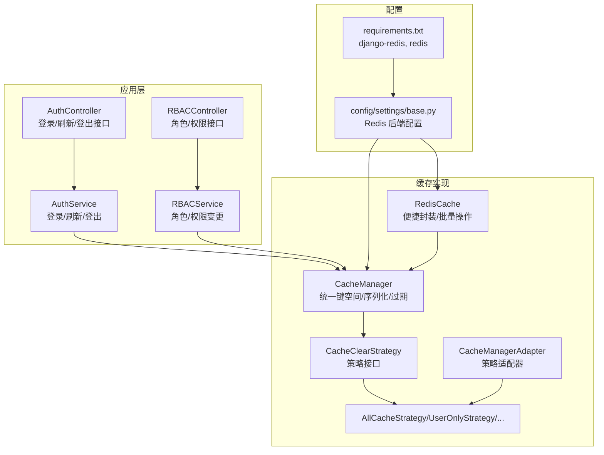
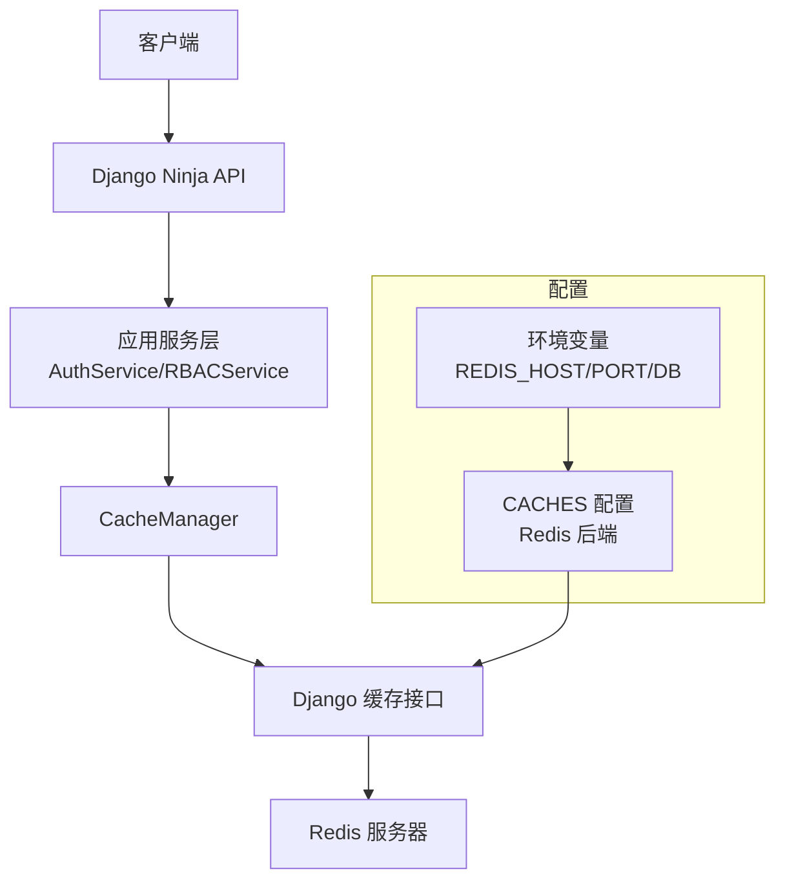
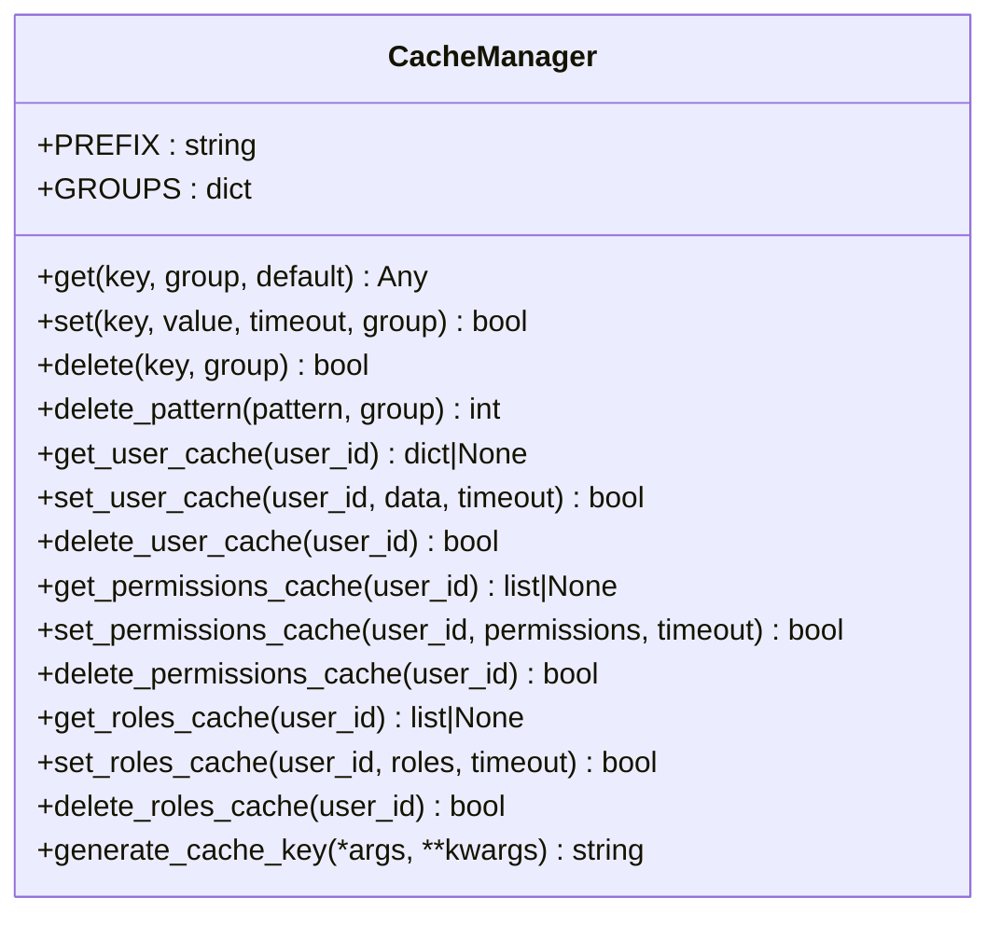
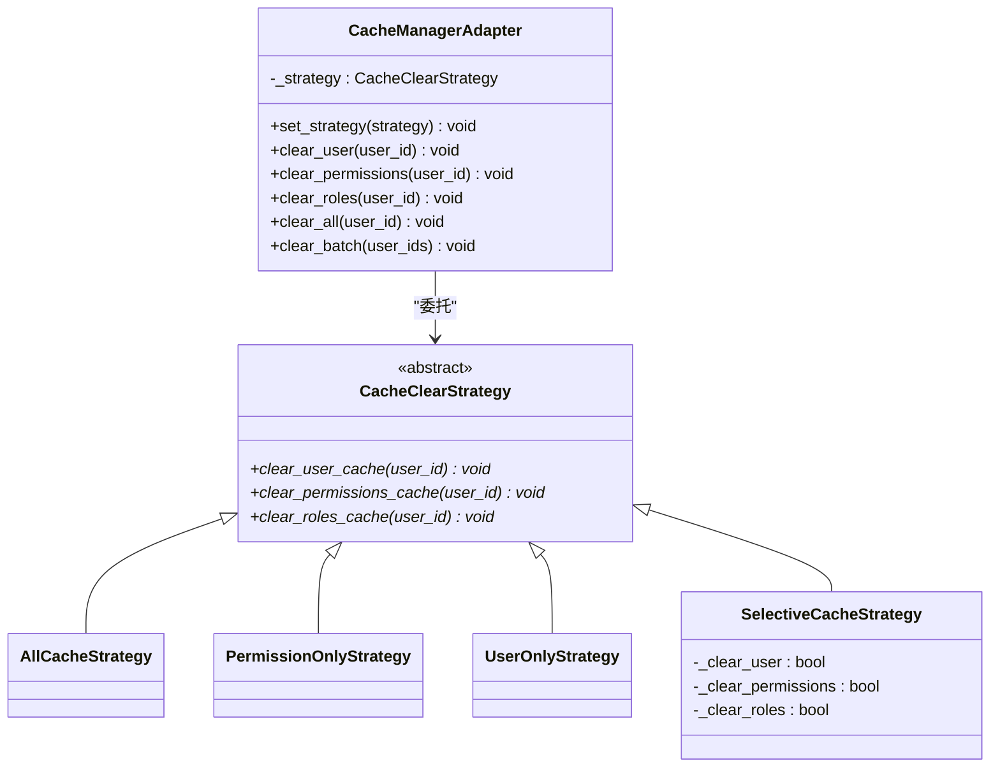
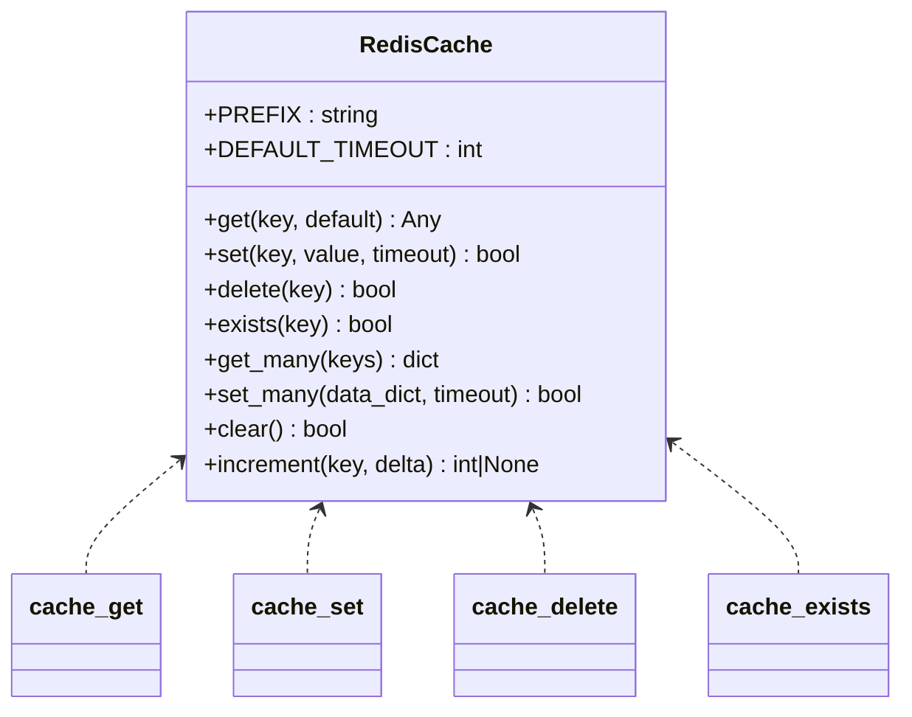
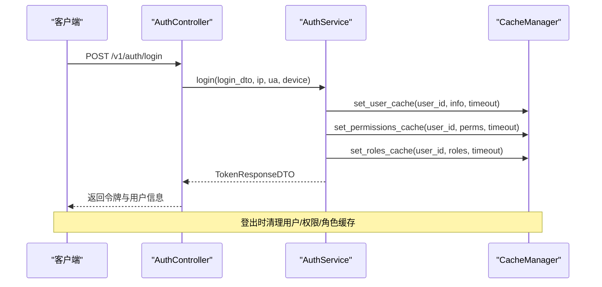
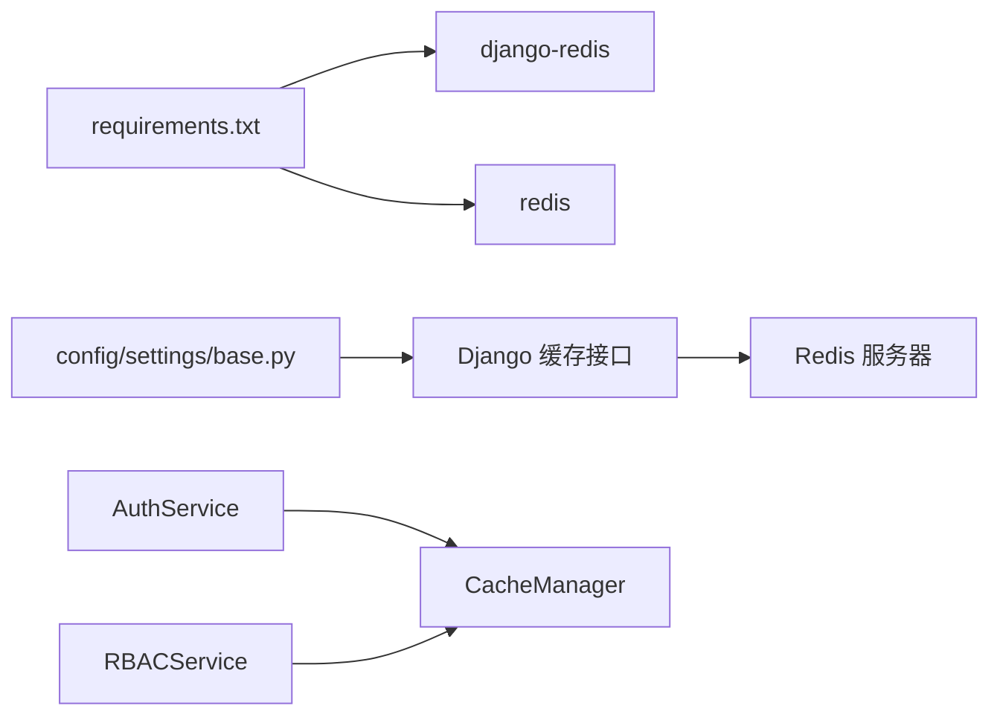

# 缓存架构

<cite>
**本文引用的文件**
- [cache_manager.py](file://src/infrastructure/cache/cache_manager.py)
- [cache_strategies.py](file://src/infrastructure/cache/cache_strategies.py)
- [redis_cache.py](file://src/infrastructure/cache/redis_cache.py)
- [base.py](file://config/settings/base.py)
- [requirements.txt](file://requirements.txt)
- [auth_service.py](file://src/application/services/auth_service.py)
- [rbac_service.py](file://src/application/services/rbac_service.py)
- [auth_controller.py](file://src/api/v1/controllers/auth_controller.py)
- [rbac_controller.py](file://src/api/v1/controllers/rbac_controller.py)
</cite>

## 目录
1. [简介](#简介)
2. [项目结构](#项目结构)
3. [核心组件](#核心组件)
4. [架构总览](#架构总览)
5. [详细组件分析](#详细组件分析)
6. [依赖分析](#依赖分析)
7. [性能考虑](#性能考虑)
8. [故障排查指南](#故障排查指南)
9. [结论](#结论)
10. [附录](#附录)

## 简介
本文件系统性阐述 Hello-Django-Ninja-Api 的缓存架构与实现，重点覆盖以下方面：
- 缓存策略设计与实现：统一缓存管理器、缓存清理策略与适配器模式。
- Redis 集成方案：基于 Django 缓存后端的 Redis 配置、序列化策略、过期时间与批量操作。
- 缓存使用场景：用户信息、权限数据、角色数据的缓存与失效策略。
- 性能优化：缓存预热、批量操作、内存管理与键空间组织。
- 监控与调试：日志记录、错误处理与一致性保障。

## 项目结构
缓存相关代码集中在基础设施层的缓存包中，并在应用服务与控制器中被广泛使用：
- 缓存管理与策略：src/infrastructure/cache/cache_manager.py、cache_strategies.py、redis_cache.py
- 配置与依赖：config/settings/base.py、requirements.txt
- 使用示例：src/application/services/auth_service.py、rbac_service.py；API 控制器中触发业务流程

图表来源
- [base.py:153-163](file://config/settings/base.py#L153-L163)
- [requirements.txt:17-19](file://requirements.txt#L17-L19)
- [cache_manager.py:16-148](file://src/infrastructure/cache/cache_manager.py#L16-L148)
- [cache_strategies.py:9-244](file://src/infrastructure/cache/cache_strategies.py#L9-L244)
- [redis_cache.py:15-169](file://src/infrastructure/cache/redis_cache.py#L15-L169)
- [auth_service.py:14-180](file://src/application/services/auth_service.py#L14-L180)
- [rbac_service.py:16-200](file://src/application/services/rbac_service.py#L16-L200)
- [auth_controller.py:27-132](file://src/api/v1/controllers/auth_controller.py#L27-L132)
- [rbac_controller.py:49-200](file://src/api/v1/controllers/rbac_controller.py#L49-L200)

章节来源
- [base.py:153-163](file://config/settings/base.py#L153-L163)
- [requirements.txt:17-19](file://requirements.txt#L17-L19)
- [cache_manager.py:16-148](file://src/infrastructure/cache/cache_manager.py#L16-L148)
- [cache_strategies.py:9-244](file://src/infrastructure/cache/cache_strategies.py#L9-L244)
- [redis_cache.py:15-169](file://src/infrastructure/cache/redis_cache.py#L15-L169)
- [auth_service.py:14-180](file://src/application/services/auth_service.py#L14-L180)
- [rbac_service.py:16-200](file://src/application/services/rbac_service.py#L16-L200)
- [auth_controller.py:27-132](file://src/api/v1/controllers/auth_controller.py#L27-L132)
- [rbac_controller.py:49-200](file://src/api/v1/controllers/rbac_controller.py#L49-L200)

## 核心组件
- 缓存管理器（CacheManager）
  - 统一键空间前缀与分组，提供通用 get/set/delete 接口与 JSON 序列化兼容。
  - 针对用户、权限、角色提供专用方法与默认过期时间。
  - 提供基于参数生成稳定缓存键的工具方法。
- 缓存清理策略（CacheClearStrategy）
  - 抽象接口定义三类缓存清理能力：用户、权限、角色。
  - 内置多种策略：全量清理、仅权限、仅用户、选择性清理。
  - 适配器（CacheManagerAdapter）以策略模式统一调用入口，支持批量清理。
- Redis 缓存封装（RedisCache）
  - 基于 Django 缓存后端的 Redis 实现，提供便捷函数与批量操作。
  - 统一前缀与默认过期时间，支持增量计数等原子操作。
- 配置与依赖
  - Redis 后端通过环境变量配置，Django 缓存系统统一调度。
  - 依赖 django-redis 与 redis Python 客户端。

章节来源
- [cache_manager.py:16-148](file://src/infrastructure/cache/cache_manager.py#L16-L148)
- [cache_strategies.py:9-244](file://src/infrastructure/cache/cache_strategies.py#L9-L244)
- [redis_cache.py:15-169](file://src/infrastructure/cache/redis_cache.py#L15-L169)
- [base.py:153-163](file://config/settings/base.py#L153-L163)
- [requirements.txt:17-19](file://requirements.txt#L17-L19)

## 架构总览
下图展示缓存在系统中的位置与交互：

图表来源
- [base.py:153-163](file://config/settings/base.py#L153-L163)
- [auth_service.py:14-180](file://src/application/services/auth_service.py#L14-L180)
- [rbac_service.py:16-200](file://src/application/services/rbac_service.py#L16-L200)
- [cache_manager.py:16-148](file://src/infrastructure/cache/cache_manager.py#L16-L148)

## 详细组件分析

### 缓存管理器（CacheManager）设计与实现
- 设计要点
  - 键空间组织：统一前缀与分组，避免键冲突；提供便捷的用户/权限/角色专用方法。
  - 序列化策略：自动识别复杂对象并进行 JSON 序列化；读取时尝试 JSON 反序列化，提升兼容性。
  - 过期时间：针对不同业务设置差异化默认超时，兼顾性能与一致性。
  - 生命周期管理：提供生成稳定键的工具方法，便于参数化查询的缓存命中。
- 关键接口
  - get/set/delete：通用缓存 CRUD。
  - get_user_cache/set_user_cache/delete_user_cache：用户信息缓存。
  - get_permissions_cache/set_permissions_cache/delete_permissions_cache：权限缓存。
  - get_roles_cache/set_roles_cache/delete_roles_cache：角色缓存。
  - generate_cache_key：基于参数生成稳定哈希键。
- 错误处理
  - 对异常进行捕获与日志记录，返回默认值或失败标识，确保业务不中断。

图表来源
- [cache_manager.py:16-148](file://src/infrastructure/cache/cache_manager.py#L16-L148)

章节来源
- [cache_manager.py:16-148](file://src/infrastructure/cache/cache_manager.py#L16-L148)

### 缓存清理策略（CacheClearStrategy）与适配器
- 设计模式
  - 策略模式：抽象出统一的清理接口，支持多种清理策略组合。
  - 适配器模式：通过适配器统一对外清理入口，内部委托具体策略。
- 策略类型
  - AllCacheStrategy：清理用户、权限、角色全部相关缓存。
  - PermissionOnlyStrategy：仅清理权限与角色缓存。
  - UserOnlyStrategy：仅清理用户信息缓存。
  - SelectiveCacheStrategy：按配置选择性清理。
- 适配器能力
  - clear_user/clear_permissions/clear_roles：委托策略执行。
  - clear_all：一次清理三类缓存。
  - clear_batch：批量用户 ID 的清理。

图表来源
- [cache_strategies.py:9-244](file://src/infrastructure/cache/cache_strategies.py#L9-L244)

章节来源
- [cache_strategies.py:9-244](file://src/infrastructure/cache/cache_strategies.py#L9-L244)

### Redis 缓存集成方案（RedisCache）
- 集成方式
  - 通过 Django CACHES 配置使用 Redis 后端，统一由 Django 缓存接口调度。
  - 本模块提供 RedisCache 类作为便捷封装，补充批量操作与增量计数等常用能力。
- 序列化与过期
  - 自动序列化复杂对象为 JSON；读取时尝试反序列化。
  - 默认过期时间可按需传入，未指定则采用类内默认值。
- 批量操作
  - get_many/set_many：批量读写，减少网络往返。
- 原子操作
  - increment：基于现有值进行原子递增，适合计数类场景。

图表来源
- [redis_cache.py:15-169](file://src/infrastructure/cache/redis_cache.py#L15-L169)

章节来源
- [redis_cache.py:15-169](file://src/infrastructure/cache/redis_cache.py#L15-L169)
- [base.py:153-163](file://config/settings/base.py#L153-L163)

### 缓存策略（CacheStrategies）设计
- 读写策略
  - 写入：统一前缀+分组+业务键，避免冲突；复杂对象自动序列化；按业务设置合理过期时间。
  - 读取：优先命中缓存；未命中返回默认值；字符串值尝试 JSON 解析，提升兼容性。
- 缓存穿透防护
  - 对不存在的键可采用短 TTL 或布隆过滤器前置校验（本项目未内置，可在上层业务层扩展）。
- 缓存雪崩预防
  - 不同业务键设置差异化过期时间，加入随机抖动；控制批量过期时间集中度。
- 缓存击穿保护
  - 热点键设置互斥锁或热点保护（本项目未内置，可在上层业务层扩展）。

章节来源
- [cache_manager.py:42-82](file://src/infrastructure/cache/cache_manager.py#L42-L82)
- [cache_strategies.py:46-168](file://src/infrastructure/cache/cache_strategies.py#L46-L168)

### 缓存使用场景
- 用户信息缓存
  - 登录成功后可写入用户信息缓存；登出时清理用户缓存。
- 权限数据缓存
  - 登录与刷新令牌时写入权限列表；角色/权限变更后按策略清理。
- 角色数据缓存
  - 登录与刷新令牌时写入角色列表；角色变更后按策略清理。
- 会话数据缓存
  - 本项目主要通过 JWT 实现会话状态管理，缓存主要用于加速权限/角色查询。

图表来源
- [auth_controller.py:72-78](file://src/api/v1/controllers/auth_controller.py#L72-L78)
- [auth_service.py:164-180](file://src/application/services/auth_service.py#L164-L180)
- [cache_manager.py:93-137](file://src/infrastructure/cache/cache_manager.py#L93-L137)

章节来源
- [auth_controller.py:72-78](file://src/api/v1/controllers/auth_controller.py#L72-L78)
- [auth_service.py:164-180](file://src/application/services/auth_service.py#L164-L180)
- [cache_manager.py:93-137](file://src/infrastructure/cache/cache_manager.py#L93-L137)

## 依赖分析
- 配置依赖
  - Redis 后端通过 CACHES.default 指定，使用 django.core.cache.backends.redis.RedisCache。
  - 环境变量 REDIS_HOST/REDIS_PORT/REDIS_DB 控制连接地址。
- 运行时依赖
  - django-redis 与 redis 客户端负责与 Redis 通信。
- 业务依赖
  - AuthService 在登出时调用缓存清理。
  - RBACService 在角色/权限变更后可配合策略清理缓存（当前未显式调用，建议在变更处增加清理）。

图表来源
- [requirements.txt:17-19](file://requirements.txt#L17-L19)
- [base.py:153-163](file://config/settings/base.py#L153-L163)
- [auth_service.py:164-180](file://src/application/services/auth_service.py#L164-L180)
- [rbac_service.py:16-200](file://src/application/services/rbac_service.py#L16-L200)

章节来源
- [requirements.txt:17-19](file://requirements.txt#L17-L19)
- [base.py:153-163](file://config/settings/base.py#L153-L163)
- [auth_service.py:164-180](file://src/application/services/auth_service.py#L164-L180)
- [rbac_service.py:16-200](file://src/application/services/rbac_service.py#L16-L200)

## 性能考虑
- 缓存预热
  - 在系统启动或定时任务中预热热点用户/权限/角色数据，降低首次访问延迟。
- 批量操作
  - 使用 get_many/set_many 减少网络往返；批量清理使用适配器的 clear_batch。
- 内存管理
  - 合理设置过期时间，避免长期占用内存；对大对象进行序列化存储时注意体积。
- 键空间组织
  - 使用统一前缀与分组，便于后续维护与清理；避免键名冲突。
- 并发与一致性
  - 对热点键采用互斥锁或分布式锁，防止击穿；对关键写入采用幂等设计。

## 故障排查指南
- 常见问题
  - 缓存不可用：检查 Redis 连接配置与网络连通性。
  - 序列化失败：确认写入对象可被 JSON 序列化；读取时注意类型转换。
  - 清理不生效：确认策略是否正确设置；检查键前缀与分组是否一致。
- 调试方法
  - 查看日志：CacheManager/RedisCache 在异常时记录错误日志。
  - 单元测试：对缓存 CRUD 与策略清理进行单元测试覆盖。
  - 监控指标：结合 Redis 自身监控与应用日志统计缓存命中率与错误率。

章节来源
- [cache_manager.py:42-82](file://src/infrastructure/cache/cache_manager.py#L42-L82)
- [redis_cache.py:28-147](file://src/infrastructure/cache/redis_cache.py#L28-L147)
- [base.py:175-226](file://config/settings/base.py#L175-L226)

## 结论
本项目采用 Django 缓存接口统一调度 Redis 后端，结合 CacheManager 的键空间组织与序列化策略，实现了用户、权限、角色的高效缓存。通过策略模式的缓存清理适配器，提供了灵活的一致性保障手段。建议在角色/权限变更路径上增加显式的缓存清理调用，并结合批量操作与合理的过期策略进一步优化性能与稳定性。

## 附录
- 配置示例（环境变量）
  - REDIS_HOST、REDIS_PORT、REDIS_DB：用于构建 Redis 连接字符串。
- 最佳实践
  - 为不同业务设置差异化过期时间；对热点键增加互斥锁或布隆过滤器。
  - 在变更敏感数据时，优先使用 SelectiveCacheStrategy 精准清理。
  - 使用 clear_batch 对批量用户进行一致性清理。