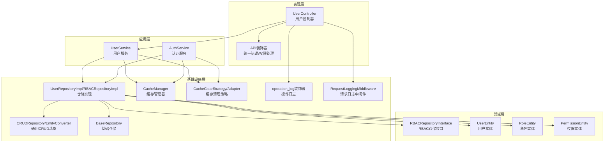
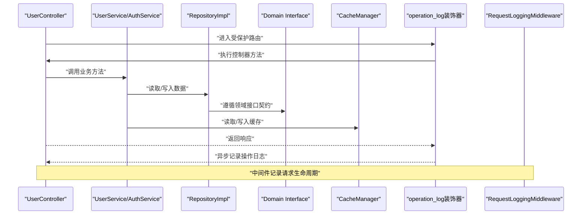
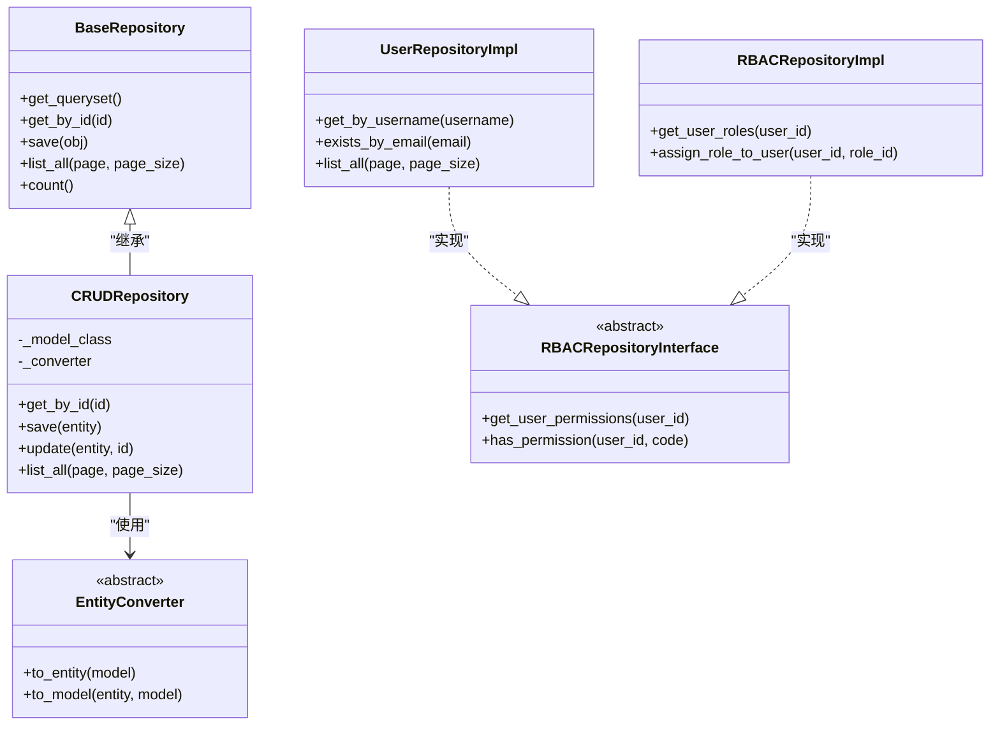
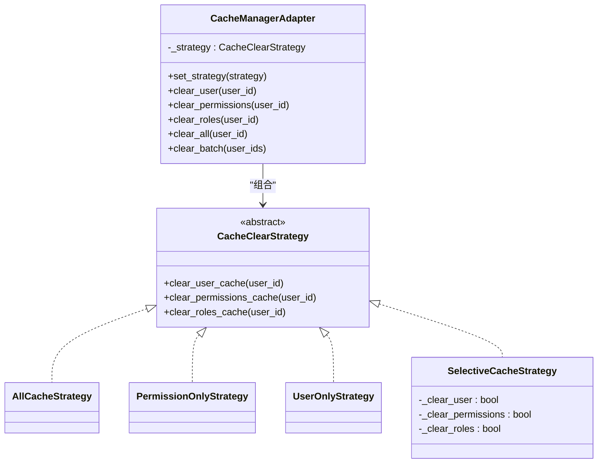
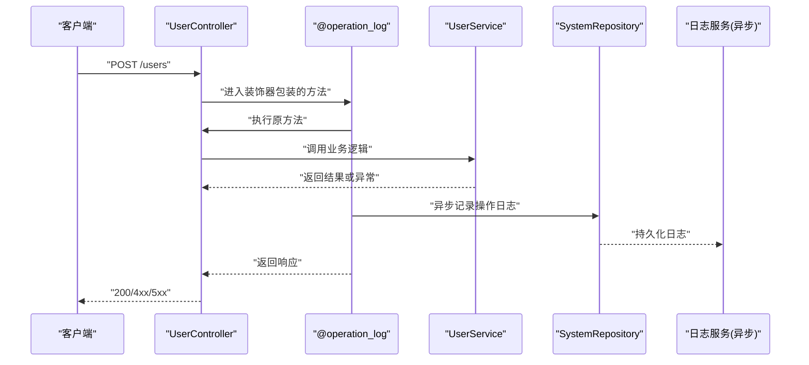
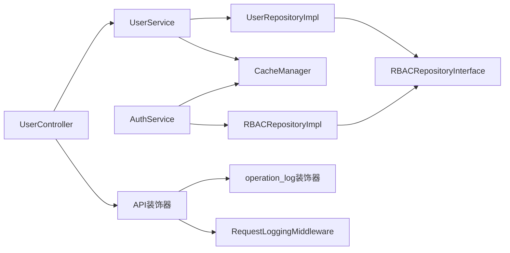

# 设计模式应用

<cite>
**本文引用的文件**
- [base_repository.py](file://src/infrastructure/repositories/base_repository.py)
- [crud_repository.py](file://src/infrastructure/repositories/crud_repository.py)
- [user_repo_impl.py](file://src/infrastructure/repositories/user_repo_impl.py)
- [rbac_repo_impl.py](file://src/infrastructure/repositories/rbac_repo_impl.py)
- [rbac_repository.py](file://src/domain/rbac/repositories/rbac_repository.py)
- [cache_manager.py](file://src/infrastructure/cache/cache_manager.py)
- [cache_strategies.py](file://src/infrastructure/cache/cache_strategies.py)
- [operation_log.py](file://src/core/decorators/operation_log.py)
- [decorators.py](file://src/api/common/decorators.py)
- [user_service.py](file://src/application/services/user_service.py)
- [auth_service.py](file://src/application/services/auth_service.py)
- [user_controller.py](file://src/api/v1/controllers/user_controller.py)
- [request_logging_middleware.py](file://src/core/middlewares/request_logging_middleware.py)
</cite>

## 目录
1. [引言](#引言)
2. [项目结构](#项目结构)
3. [核心组件](#核心组件)
4. [架构总览](#架构总览)
5. [详细组件分析](#详细组件分析)
6. [依赖分析](#依赖分析)
7. [性能考量](#性能考量)
8. [故障排查指南](#故障排查指南)
9. [结论](#结论)
10. [附录](#附录)

## 引言
本文件聚焦于 Hello-Django-Ninja-Api 项目中的设计模式应用，围绕以下主题展开：
- 仓储模式：抽象数据访问逻辑，实现领域层与基础设施层解耦
- 策略模式：实现可替换的缓存清理策略
- 装饰器模式：横切关注点（操作日志、统一错误处理、权限校验）
- 工厂模式：在 DTO/实体默认值与响应对象中体现（辅助说明）

目标是通过具体代码路径与图示，解释每种模式的实现方式、优势与适用场景，并总结如何借助这些模式提升系统的可维护性、可扩展性与可测试性。

## 项目结构
项目采用分层架构：
- 表现层：Ninja 控制器与公共装饰器
- 应用层：应用服务封装业务流程
- 领域层：实体、值对象与仓储接口
- 基础设施层：仓储实现、缓存、JWT、中间件与Django模型

图表来源
- [user_controller.py:33-51](file://src/api/v1/controllers/user_controller.py#L33-L51)
- [user_service.py:16-24](file://src/application/services/user_service.py#L16-L24)
- [auth_service.py:20-24](file://src/application/services/auth_service.py#L20-L24)
- [rbac_repository.py:12-112](file://src/domain/rbac/repositories/rbac_repository.py#L12-L112)
- [user_repo_impl.py:13-139](file://src/infrastructure/repositories/user_repo_impl.py#L13-L139)
- [rbac_repo_impl.py:15-251](file://src/infrastructure/repositories/rbac_repo_impl.py#L15-L251)
- [crud_repository.py:50-70](file://src/infrastructure/repositories/crud_repository.py#L50-L70)
- [base_repository.py:13-21](file://src/infrastructure/repositories/base_repository.py#L13-L21)
- [cache_manager.py:16-32](file://src/infrastructure/cache/cache_manager.py#L16-L32)
- [cache_strategies.py:9-24](file://src/infrastructure/cache/cache_strategies.py#L9-L24)
- [operation_log.py:15-27](file://src/core/decorators/operation_log.py#L15-L27)
- [request_logging_middleware.py:14-32](file://src/core/middlewares/request_logging_middleware.py#L14-L32)

章节来源
- [user_controller.py:33-51](file://src/api/v1/controllers/user_controller.py#L33-L51)
- [user_service.py:16-24](file://src/application/services/user_service.py#L16-L24)
- [auth_service.py:20-24](file://src/application/services/auth_service.py#L20-L24)
- [rbac_repository.py:12-112](file://src/domain/rbac/repositories/rbac_repository.py#L12-L112)
- [user_repo_impl.py:13-139](file://src/infrastructure/repositories/user_repo_impl.py#L13-L139)
- [rbac_repo_impl.py:15-251](file://src/infrastructure/repositories/rbac_repo_impl.py#L15-L251)
- [crud_repository.py:50-70](file://src/infrastructure/repositories/crud_repository.py#L50-L70)
- [base_repository.py:13-21](file://src/infrastructure/repositories/base_repository.py#L13-L21)
- [cache_manager.py:16-32](file://src/infrastructure/cache/cache_manager.py#L16-L32)
- [cache_strategies.py:9-24](file://src/infrastructure/cache/cache_strategies.py#L9-L24)
- [operation_log.py:15-27](file://src/core/decorators/operation_log.py#L15-L27)
- [request_logging_middleware.py:14-32](file://src/core/middlewares/request_logging_middleware.py#L14-L32)

## 核心组件
- 仓储模式
  - 基础仓储与通用CRUD基类：提供统一的数据库操作能力，屏蔽Django ORM细节
  - 领域接口与实现分离：领域层定义接口，基础设施层提供实现，降低耦合
- 策略模式
  - 缓存清理策略：多种策略可插拔，按需选择清理范围
  - 适配器统一调用：通过适配器屏蔽策略差异
- 装饰器模式
  - 操作日志装饰器：自动记录请求/响应与错误信息
  - API统一错误处理与权限校验装饰器：集中处理异常与鉴权
- 中间件
  - 请求日志中间件：全局记录请求生命周期信息

章节来源
- [base_repository.py:13-90](file://src/infrastructure/repositories/base_repository.py#L13-L90)
- [crud_repository.py:50-240](file://src/infrastructure/repositories/crud_repository.py#L50-L240)
- [rbac_repository.py:12-112](file://src/domain/rbac/repositories/rbac_repository.py#L12-L112)
- [user_repo_impl.py:13-140](file://src/infrastructure/repositories/user_repo_impl.py#L13-L140)
- [rbac_repo_impl.py:15-251](file://src/infrastructure/repositories/rbac_repo_impl.py#L15-L251)
- [cache_strategies.py:9-245](file://src/infrastructure/cache/cache_strategies.py#L9-L245)
- [cache_manager.py:16-149](file://src/infrastructure/cache/cache_manager.py#L16-L149)
- [operation_log.py:15-175](file://src/core/decorators/operation_log.py#L15-L175)
- [decorators.py:13-191](file://src/api/common/decorators.py#L13-L191)
- [request_logging_middleware.py:14-86](file://src/core/middlewares/request_logging_middleware.py#L14-L86)

## 架构总览
下图展示“控制器-应用服务-仓储实现-领域接口”的典型调用链路，以及横切关注点（装饰器与中间件）的介入位置。

图表来源
- [user_controller.py:53-75](file://src/api/v1/controllers/user_controller.py#L53-L75)
- [user_service.py:29-50](file://src/application/services/user_service.py#L29-L50)
- [auth_service.py:26-112](file://src/application/services/auth_service.py#L26-L112)
- [user_repo_impl.py:72-100](file://src/infrastructure/repositories/user_repo_impl.py#L72-L100)
- [rbac_repo_impl.py:201-227](file://src/infrastructure/repositories/rbac_repo_impl.py#L201-L227)
- [cache_manager.py:93-137](file://src/infrastructure/cache/cache_manager.py#L93-L137)
- [operation_log.py:29-72](file://src/core/decorators/operation_log.py#L29-L72)
- [request_logging_middleware.py:34-68](file://src/core/middlewares/request_logging_middleware.py#L34-L68)

## 详细组件分析

### 仓储模式：抽象数据访问，解耦领域与基础设施
- 基础仓储与通用CRUD基类
  - 基础仓储提供通用的增删改查与分页统计能力，屏蔽ORM细节
  - 通用CRUD基类引入实体转换器，将Django模型与领域实体解耦
- 领域接口与实现分离
  - 领域层定义仓储接口，约束数据访问契约
  - 基础设施层提供具体实现，面向不同聚合根（用户、RBAC）
- 优势
  - 易于替换存储后端（如切换ORM或引入缓存）
  - 单元测试可用内存对象替代仓储实现
- 适用场景
  - 需要稳定的数据访问契约、跨模块复用数据操作

图表来源
- [base_repository.py:13-90](file://src/infrastructure/repositories/base_repository.py#L13-L90)
- [crud_repository.py:50-240](file://src/infrastructure/repositories/crud_repository.py#L50-L240)
- [user_repo_impl.py:13-140](file://src/infrastructure/repositories/user_repo_impl.py#L13-L140)
- [rbac_repo_impl.py:15-251](file://src/infrastructure/repositories/rbac_repo_impl.py#L15-L251)
- [rbac_repository.py:12-112](file://src/domain/rbac/repositories/rbac_repository.py#L12-L112)

章节来源
- [base_repository.py:13-90](file://src/infrastructure/repositories/base_repository.py#L13-L90)
- [crud_repository.py:50-240](file://src/infrastructure/repositories/crud_repository.py#L50-L240)
- [rbac_repository.py:12-112](file://src/domain/rbac/repositories/rbac_repository.py#L12-L112)
- [user_repo_impl.py:13-140](file://src/infrastructure/repositories/user_repo_impl.py#L13-L140)
- [rbac_repo_impl.py:15-251](file://src/infrastructure/repositories/rbac_repo_impl.py#L15-L251)

### 策略模式：可替换的缓存清理策略
- 策略接口与多种实现
  - 定义统一的缓存清理接口，提供“清理全部”“仅权限”“仅用户”“选择性清理”等策略
- 适配器统一入口
  - 通过适配器持有策略并对外暴露一致的清理方法
- 优势
  - 面向变更开放：新增策略无需改动调用方
  - 面向使用方友好：统一API，按需切换
- 适用场景
  - 需要在用户资料、权限、角色等维度进行差异化缓存管理

图表来源
- [cache_strategies.py:9-245](file://src/infrastructure/cache/cache_strategies.py#L9-L245)
- [cache_manager.py:16-149](file://src/infrastructure/cache/cache_manager.py#L16-L149)

章节来源
- [cache_strategies.py:9-245](file://src/infrastructure/cache/cache_strategies.py#L9-L245)
- [cache_manager.py:16-149](file://src/infrastructure/cache/cache_manager.py#L16-L149)

### 装饰器模式：横切关注点（操作日志、统一错误处理、权限校验）
- 操作日志装饰器
  - 自动捕获请求上下文、响应状态与异常，异步记录到系统日志仓储
  - 对主流程影响最小，失败不影响业务
- API统一错误处理与权限校验装饰器
  - 将业务异常映射为标准化HTTP错误
  - 统一鉴权与权限检查，减少重复代码
- 优势
  - 关注点分离：业务逻辑与横切逻辑解耦
  - 可组合：多个装饰器可叠加使用
- 适用场景
  - 需要统一审计、安全与错误处理的REST API

图表来源
- [operation_log.py:15-72](file://src/core/decorators/operation_log.py#L15-L72)
- [user_controller.py:53-75](file://src/api/v1/controllers/user_controller.py#L53-L75)
- [user_service.py:29-50](file://src/application/services/user_service.py#L29-L50)

章节来源
- [operation_log.py:15-175](file://src/core/decorators/operation_log.py#L15-L175)
- [decorators.py:13-191](file://src/api/common/decorators.py#L13-L191)
- [user_controller.py:53-75](file://src/api/v1/controllers/user_controller.py#L53-L75)

### 中间件：全局横切（请求日志）
- 请求日志中间件
  - 记录请求开始/结束、耗时、用户与IP等信息
  - 作为全局横切，无需在每个控制器重复编写
- 优势
  - 统一日志格式与粒度
  - 便于监控与排障
- 适用场景
  - 需要统一追踪请求生命周期的系统

章节来源
- [request_logging_middleware.py:14-86](file://src/core/middlewares/request_logging_middleware.py#L14-L86)

### 工厂模式：在DTO与响应对象中的应用
- 默认工厂：大量DTO使用默认工厂初始化集合字段，避免重复赋值
- 适用场景
  - 快速构建轻量级数据对象，降低样板代码
- 注意
  - 工厂仅用于对象初始化，非复杂创建逻辑建议通过应用服务或专用工厂类承载

章节来源
- [user_service.py:16-24](file://src/application/services/user_service.py#L16-L24)

## 依赖分析
- 控制器依赖应用服务，应用服务依赖仓储实现与缓存管理器
- 仓储实现遵循领域接口，保证领域层不受基础设施变化影响
- 装饰器与中间件以横切方式介入，不改变原有调用链

图表来源
- [user_controller.py:33-51](file://src/api/v1/controllers/user_controller.py#L33-L51)
- [user_service.py:16-24](file://src/application/services/user_service.py#L16-L24)
- [auth_service.py:20-24](file://src/application/services/auth_service.py#L20-L24)
- [user_repo_impl.py:13-139](file://src/infrastructure/repositories/user_repo_impl.py#L13-L139)
- [rbac_repo_impl.py:15-251](file://src/infrastructure/repositories/rbac_repo_impl.py#L15-L251)
- [rbac_repository.py:12-112](file://src/domain/rbac/repositories/rbac_repository.py#L12-L112)
- [cache_manager.py:16-32](file://src/infrastructure/cache/cache_manager.py#L16-L32)
- [operation_log.py:15-27](file://src/core/decorators/operation_log.py#L15-L27)
- [request_logging_middleware.py:14-32](file://src/core/middlewares/request_logging_middleware.py#L14-L32)

章节来源
- [user_controller.py:33-51](file://src/api/v1/controllers/user_controller.py#L33-L51)
- [user_service.py:16-24](file://src/application/services/user_service.py#L16-L24)
- [auth_service.py:20-24](file://src/application/services/auth_service.py#L20-L24)
- [user_repo_impl.py:13-139](file://src/infrastructure/repositories/user_repo_impl.py#L13-L139)
- [rbac_repo_impl.py:15-251](file://src/infrastructure/repositories/rbac_repo_impl.py#L15-L251)
- [rbac_repository.py:12-112](file://src/domain/rbac/repositories/rbac_repository.py#L12-L112)
- [cache_manager.py:16-32](file://src/infrastructure/cache/cache_manager.py#L16-L32)
- [operation_log.py:15-27](file://src/core/decorators/operation_log.py#L15-L27)
- [request_logging_middleware.py:14-32](file://src/core/middlewares/request_logging_middleware.py#L14-L32)

## 性能考量
- 缓存策略
  - 合理选择清理范围，避免过度清理导致频繁回源
  - 对热点数据设置合适超时，平衡一致性与性能
- 仓储查询
  - 使用分页与过滤，避免一次性加载过多数据
  - 对复杂关联查询使用 select_related/prefetch_related 优化
- 日志与中间件
  - 异步记录日志，避免阻塞请求主线程
  - 中间件日志级别与采样策略需结合生产环境流量评估

## 故障排查指南
- 操作日志装饰器
  - 若日志未记录，检查装饰器是否正确包裹控制器方法，确认异步日志写入未抛出异常
- 统一错误处理装饰器
  - 确认异常类型映射是否覆盖预期场景，避免未捕获异常导致500
- 权限校验装饰器
  - 核对令牌格式与签发方，确保权限服务可用且缓存未污染
- 请求日志中间件
  - 检查日志输出级别与目标，定位慢请求与异常请求

章节来源
- [operation_log.py:45-68](file://src/core/decorators/operation_log.py#L45-L68)
- [decorators.py:13-50](file://src/api/common/decorators.py#L13-L50)
- [request_logging_middleware.py:44-68](file://src/core/middlewares/request_logging_middleware.py#L44-L68)

## 结论
本项目通过仓储模式、策略模式与装饰器模式，有效实现了领域与基础设施的解耦、横切关注点的统一处理与业务流程的清晰划分。这些设计模式共同提升了系统的可维护性、可扩展性与可测试性。建议在后续演进中：
- 保持领域接口稳定，持续完善仓储实现
- 按场景灵活切换缓存策略，配合监控指标优化
- 将更复杂的对象创建逻辑迁移到专用工厂类，保持DTO简洁

## 附录
- 模式选择决策指南
  - 仓储模式：当需要稳定的领域数据访问契约、跨模块复用数据操作时优先考虑
  - 策略模式：当同一功能存在多种可替换实现且需按运行时条件切换时采用
  - 装饰器模式：当横切关注点（日志、鉴权、异常）需要在多处复用且保持一致行为时采用
- 最佳实践
  - 领域层只依赖接口，不依赖具体实现
  - 横切逻辑尽量无副作用，失败不影响主流程
  - 为策略与装饰器提供明确的配置入口与可观测性