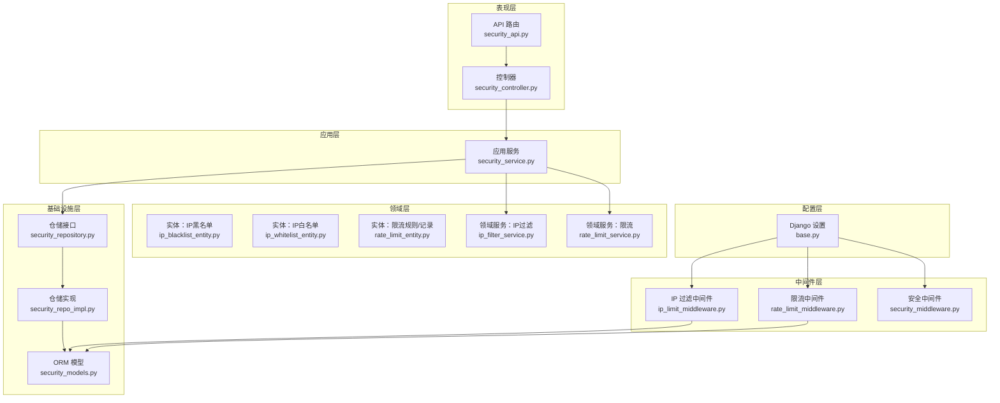
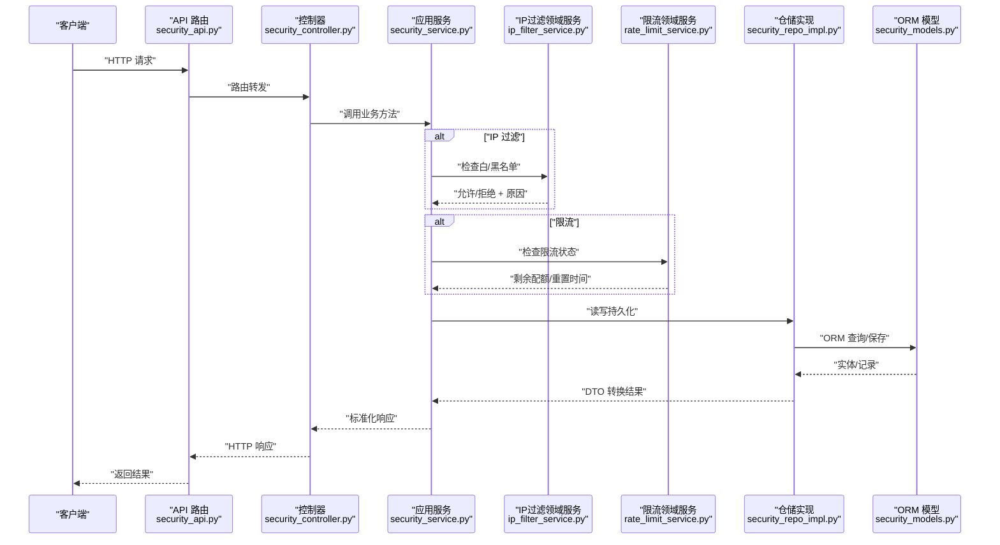
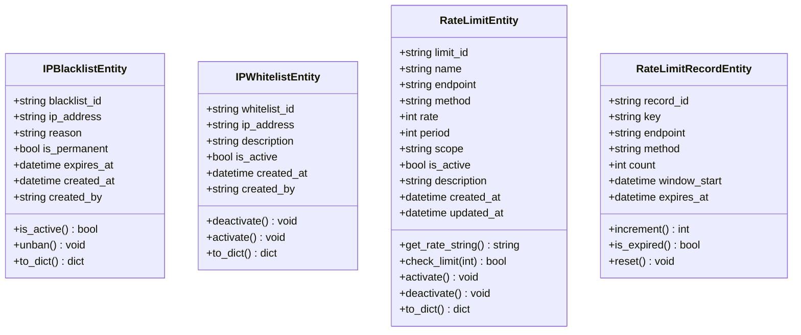
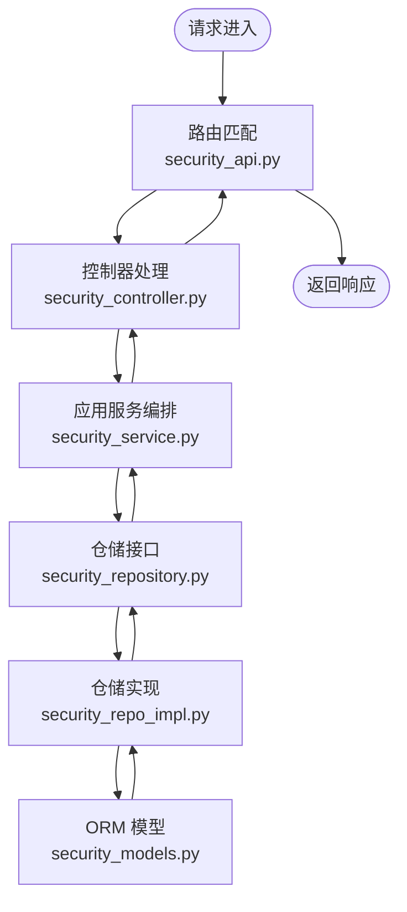
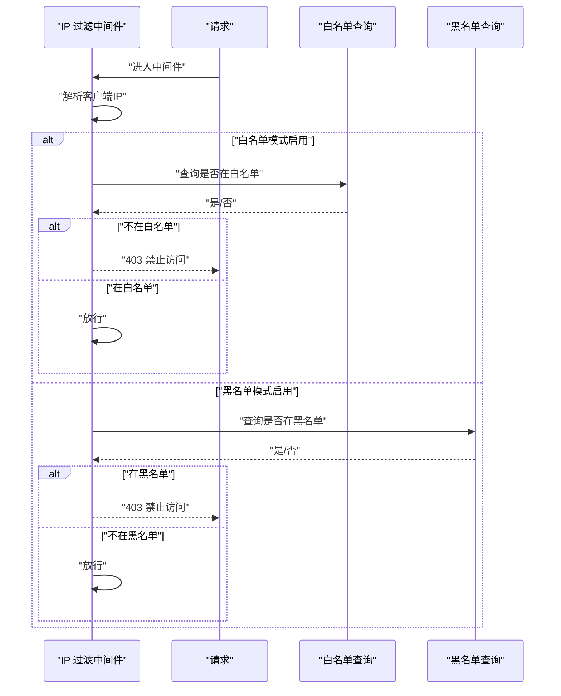
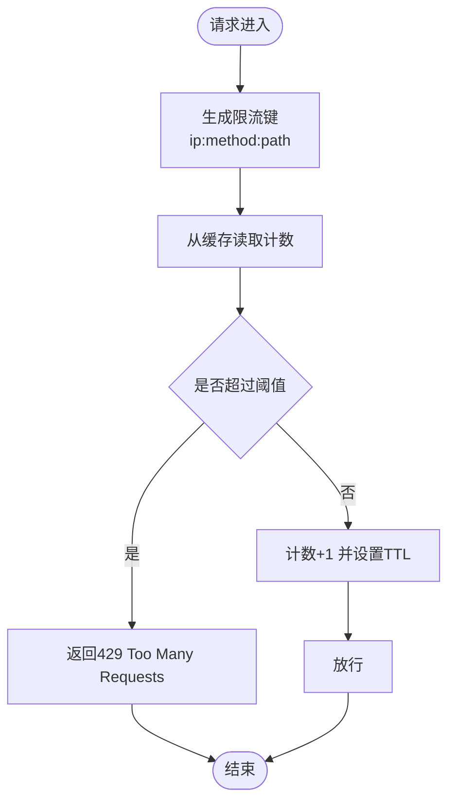
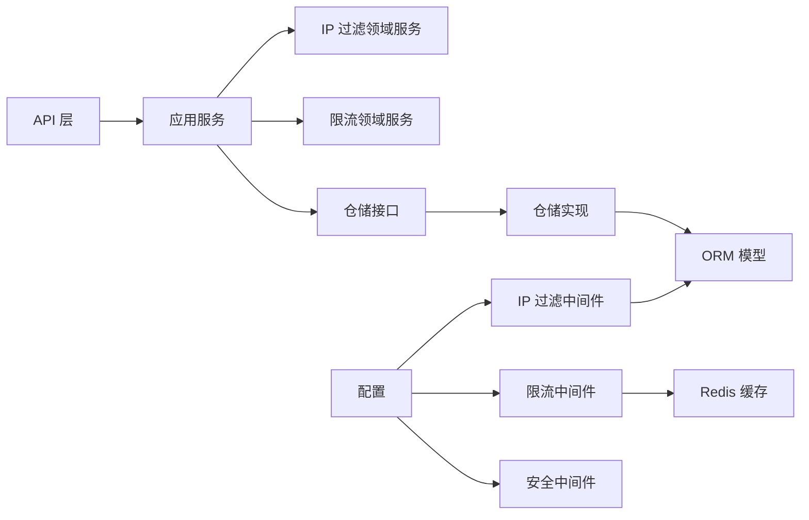

# 安全防护系统

<cite>
**本文引用的文件**
- [security_api.py](file://src/api/v1/security_api.py)
- [security_controller.py](file://src/api/v1/controllers/security_controller.py)
- [security_service.py](file://src/application/services/security_service.py)
- [ip_blacklist_entity.py](file://src/domain/security/entities/ip_blacklist_entity.py)
- [ip_whitelist_entity.py](file://src/domain/security/entities/ip_whitelist_entity.py)
- [rate_limit_entity.py](file://src/domain/security/entities/rate_limit_entity.py)
- [security_repository.py](file://src/domain/security/repositories/security_repository.py)
- [security_repo_impl.py](file://src/infrastructure/repositories/security_repo_impl.py)
- [ip_filter_service.py](file://src/domain/security/services/ip_filter_service.py)
- [rate_limit_service.py](file://src/domain/security/services/rate_limit_service.py)
- [ip_limit_middleware.py](file://src/core/middlewares/ip_limit_middleware.py)
- [rate_limit_middleware.py](file://src/core/middlewares/rate_limit_middleware.py)
- [security_middleware.py](file://src/core/middlewares/security_middleware.py)
- [security_models.py](file://src/infrastructure/persistence/models/security_models.py)
- [base.py](file://config/settings/base.py)
</cite>

## 目录
1. [简介](#简介)
2. [项目结构](#项目结构)
3. [核心组件](#核心组件)
4. [架构总览](#架构总览)
5. [详细组件分析](#详细组件分析)
6. [依赖分析](#依赖分析)
7. [性能考虑](#性能考虑)
8. [故障排除指南](#故障排除指南)
9. [结论](#结论)
10. [附录](#附录)

## 简介
本文件为安全防护系统的全面技术文档，覆盖 IP 黑白名单管理、请求限流与安全过滤机制的实现细节。文档从系统架构、组件关系、数据流、处理逻辑、集成点、错误处理与性能特征等方面进行深入解析，并提供安全配置选项、中间件执行流程、防护策略、监控机制、常见攻击防护方案、性能影响评估、安全最佳实践以及调试与故障排除指南。

## 项目结构
安全子系统采用分层架构设计，遵循 DDD（领域驱动设计）与分层解耦原则：
- 表现层：API 路由与控制器，负责请求接入与响应封装
- 应用层：应用服务，编排业务流程，协调仓储与领域服务
- 领域层：实体与领域服务，封装核心业务规则与状态
- 基础设施层：仓储实现与持久化模型，提供数据访问能力
- 中间件层：运行时安全过滤与防护（IP 过滤、限流、安全头）
- 配置层：Django 设置与环境变量，控制安全开关与行为

图表来源
- [security_api.py:1-285](file://src/api/v1/security_api.py#L1-L285)
- [security_controller.py:1-302](file://src/api/v1/controllers/security_controller.py#L1-L302)
- [security_service.py:1-225](file://src/application/services/security_service.py#L1-L225)
- [ip_blacklist_entity.py:1-53](file://src/domain/security/entities/ip_blacklist_entity.py#L1-L53)
- [ip_whitelist_entity.py:1-47](file://src/domain/security/entities/ip_whitelist_entity.py#L1-L47)
- [rate_limit_entity.py:1-106](file://src/domain/security/entities/rate_limit_entity.py#L1-L106)
- [security_repository.py:1-118](file://src/domain/security/repositories/security_repository.py#L1-L118)
- [security_repo_impl.py:1-260](file://src/infrastructure/repositories/security_repo_impl.py#L1-L260)
- [ip_filter_service.py:1-149](file://src/domain/security/services/ip_filter_service.py#L1-L149)
- [rate_limit_service.py:1-126](file://src/domain/security/services/rate_limit_service.py#L1-L126)
- [ip_limit_middleware.py:1-130](file://src/core/middlewares/ip_limit_middleware.py#L1-L130)
- [rate_limit_middleware.py:1-112](file://src/core/middlewares/rate_limit_middleware.py#L1-L112)
- [security_middleware.py:1-54](file://src/core/middlewares/security_middleware.py#L1-L54)
- [security_models.py:1-162](file://src/infrastructure/persistence/models/security_models.py#L1-L162)
- [base.py:1-235](file://config/settings/base.py#L1-L235)

章节来源
- [security_api.py:1-285](file://src/api/v1/security_api.py#L1-L285)
- [security_controller.py:1-302](file://src/api/v1/controllers/security_controller.py#L1-L302)
- [security_service.py:1-225](file://src/application/services/security_service.py#L1-L225)
- [base.py:1-235](file://config/settings/base.py#L1-L235)

## 核心组件
- API 层：提供安全相关的 REST 接口，支持黑名单、白名单与限流规则的增删改查与状态查询。
- 应用服务：编排业务流程，校验 DTO，调用仓储与领域服务，返回标准化响应 DTO。
- 领域实体与服务：封装业务规则（有效期、封禁状态、限流阈值、滑动窗口等），提供状态查询与变更。
- 仓储接口与实现：抽象数据访问，实现类对接 Django ORM 模型，完成持久化与查询。
- 中间件：运行时拦截请求，执行 IP 过滤、限流与安全头注入，保障系统入口安全。
- 配置：通过环境变量控制安全开关与默认策略，结合 Django 设置统一生效。

章节来源
- [security_api.py:35-284](file://src/api/v1/security_api.py#L35-L284)
- [security_controller.py:21-302](file://src/api/v1/controllers/security_controller.py#L21-L302)
- [security_service.py:24-225](file://src/application/services/security_service.py#L24-L225)
- [ip_blacklist_entity.py:11-53](file://src/domain/security/entities/ip_blacklist_entity.py#L11-L53)
- [ip_whitelist_entity.py:11-47](file://src/domain/security/entities/ip_whitelist_entity.py#L11-L47)
- [rate_limit_entity.py:11-106](file://src/domain/security/entities/rate_limit_entity.py#L11-L106)
- [security_repository.py:13-118](file://src/domain/security/repositories/security_repository.py#L13-L118)
- [security_repo_impl.py:21-260](file://src/infrastructure/repositories/security_repo_impl.py#L21-L260)
- [ip_filter_service.py:12-149](file://src/domain/security/services/ip_filter_service.py#L12-L149)
- [rate_limit_service.py:11-126](file://src/domain/security/services/rate_limit_service.py#L11-L126)
- [ip_limit_middleware.py:15-130](file://src/core/middlewares/ip_limit_middleware.py#L15-L130)
- [rate_limit_middleware.py:15-112](file://src/core/middlewares/rate_limit_middleware.py#L15-L112)
- [security_middleware.py:14-54](file://src/core/middlewares/security_middleware.py#L14-L54)
- [base.py:228-235](file://config/settings/base.py#L228-L235)

## 架构总览
系统采用“路由/控制器 → 应用服务 → 领域服务/仓储 → ORM 持久化”的分层架构；同时在中间件层对每个请求进行实时安全过滤与防护，确保入口安全。

图表来源
- [security_api.py:35-284](file://src/api/v1/security_api.py#L35-L284)
- [security_controller.py:32-302](file://src/api/v1/controllers/security_controller.py#L32-L302)
- [security_service.py:35-182](file://src/application/services/security_service.py#L35-L182)
- [ip_filter_service.py:120-139](file://src/domain/security/services/ip_filter_service.py#L120-L139)
- [rate_limit_service.py:50-105](file://src/domain/security/services/rate_limit_service.py#L50-L105)
- [security_repo_impl.py:29-203](file://src/infrastructure/repositories/security_repo_impl.py#L29-L203)
- [security_models.py:13-162](file://src/infrastructure/persistence/models/security_models.py#L13-L162)

## 详细组件分析

### 安全实体设计
- IP 黑名单实体：包含唯一标识、IP 地址、封禁原因、永久封禁标志、过期时间、创建时间与创建者。提供封禁状态判断与解除封禁操作。
- IP 白名单实体：包含唯一标识、IP 地址、描述、激活状态、创建时间与创建者。提供激活/停用操作。
- 限流实体：包含规则标识、名称、端点、方法、速率、周期、作用域（IP/用户/全局）、激活状态、描述与时间戳。提供速率字符串格式化与规则启停。
- 限流记录实体：记录键（如 IP 或用户 ID）、端点、方法、计数、窗口起始时间与过期时间，提供计数递增、过期检测与重置。

图表来源
- [ip_blacklist_entity.py:11-53](file://src/domain/security/entities/ip_blacklist_entity.py#L11-L53)
- [ip_whitelist_entity.py:11-47](file://src/domain/security/entities/ip_whitelist_entity.py#L11-L47)
- [rate_limit_entity.py:11-106](file://src/domain/security/entities/rate_limit_entity.py#L11-L106)

章节来源
- [ip_blacklist_entity.py:11-53](file://src/domain/security/entities/ip_blacklist_entity.py#L11-L53)
- [ip_whitelist_entity.py:11-47](file://src/domain/security/entities/ip_whitelist_entity.py#L11-L47)
- [rate_limit_entity.py:11-106](file://src/domain/security/entities/rate_limit_entity.py#L11-L106)

### 仓储实现与 API 接口规范
- 仓储接口定义了黑名单、白名单与限流规则/记录的 CRUD 与查询方法，保证应用服务与领域服务的稳定依赖。
- 仓储实现对接 Django ORM 模型，完成实体与模型之间的双向转换，支持异步查询与保存。
- API 提供以下接口：
  - 黑名单：新增、删除、列表查询
  - 白名单：新增、删除、列表查询
  - 限流规则：新增、启用/禁用、删除、列表查询
  - 安全状态：统计黑白名单与活跃限流规则数量

图表来源
- [security_api.py:35-284](file://src/api/v1/security_api.py#L35-L284)
- [security_controller.py:32-302](file://src/api/v1/controllers/security_controller.py#L32-L302)
- [security_service.py:35-182](file://src/application/services/security_service.py#L35-L182)
- [security_repository.py:19-117](file://src/domain/security/repositories/security_repository.py#L19-L117)
- [security_repo_impl.py:29-203](file://src/infrastructure/repositories/security_repo_impl.py#L29-L203)
- [security_models.py:13-162](file://src/infrastructure/persistence/models/security_models.py#L13-L162)

章节来源
- [security_repository.py:13-118](file://src/domain/security/repositories/security_repository.py#L13-L118)
- [security_repo_impl.py:21-260](file://src/infrastructure/repositories/security_repo_impl.py#L21-L260)
- [security_api.py:35-284](file://src/api/v1/security_api.py#L35-L284)
- [security_controller.py:43-302](file://src/api/v1/controllers/security_controller.py#L43-L302)

### IP 过滤服务与中间件
- IP 过滤领域服务：维护内存中的黑白名单映射，支持白名单优先策略与黑名单检查，提供状态查询。
- IP 过滤中间件：基于 Django 设置中的开关，对请求进行白名单/黑名单检查，支持 X-Forwarded-For 与 REMOTE_ADDR 获取真实 IP。

图表来源
- [ip_filter_service.py:120-139](file://src/domain/security/services/ip_filter_service.py#L120-L139)
- [ip_limit_middleware.py:41-76](file://src/core/middlewares/ip_limit_middleware.py#L41-L76)

章节来源
- [ip_filter_service.py:12-149](file://src/domain/security/services/ip_filter_service.py#L12-L149)
- [ip_limit_middleware.py:15-130](file://src/core/middlewares/ip_limit_middleware.py#L15-L130)

### 速率限制服务与中间件
- 限流领域服务：维护内存中的规则与记录，支持滑动窗口计数、过期重置与剩余配额计算。
- 限流中间件：基于 Redis 缓存实现简单限流，默认每分钟 100 次，可通过环境变量调整；当超过阈值返回 429。

图表来源
- [rate_limit_service.py:50-82](file://src/domain/security/services/rate_limit_service.py#L50-L82)
- [rate_limit_middleware.py:87-111](file://src/core/middlewares/rate_limit_middleware.py#L87-L111)

章节来源
- [rate_limit_service.py:11-126](file://src/domain/security/services/rate_limit_service.py#L11-L126)
- [rate_limit_middleware.py:15-112](file://src/core/middlewares/rate_limit_middleware.py#L15-L112)

### 安全中间件与防护策略
- 安全中间件：生产环境下自动注入安全响应头（X-Content-Type-Options、X-Frame-Options、X-XSS-Protection、Strict-Transport-Security），提升浏览器安全防护等级。

章节来源
- [security_middleware.py:14-54](file://src/core/middlewares/security_middleware.py#L14-L54)

## 依赖分析
- 组件内聚性高：各层职责清晰，应用服务聚合业务流程，领域服务封装规则，仓储抽象数据访问。
- 组件耦合度低：通过接口隔离与依赖注入降低耦合；中间件与配置层通过环境变量解耦。
- 外部依赖：Redis 缓存用于限流中间件；Django ORM 用于持久化；Django 设置控制安全开关。

图表来源
- [base.py:228-235](file://config/settings/base.py#L228-L235)
- [security_repo_impl.py:21-260](file://src/infrastructure/repositories/security_repo_impl.py#L21-L260)
- [security_models.py:13-162](file://src/infrastructure/persistence/models/security_models.py#L13-L162)
- [ip_limit_middleware.py:15-130](file://src/core/middlewares/ip_limit_middleware.py#L15-L130)
- [rate_limit_middleware.py:15-112](file://src/core/middlewares/rate_limit_middleware.py#L15-L112)
- [security_middleware.py:14-54](file://src/core/middlewares/security_middleware.py#L14-L54)

章节来源
- [base.py:228-235](file://config/settings/base.py#L228-L235)
- [security_repo_impl.py:21-260](file://src/infrastructure/repositories/security_repo_impl.py#L21-L260)

## 性能考虑
- 缓存与存储分离：限流中间件使用 Redis 缓存，避免数据库压力；仓储实现基于 ORM 异步查询，减少阻塞。
- 内存规则表：领域服务在内存维护规则与记录，降低频繁 IO；注意在高并发场景下的内存占用与过期清理。
- 索引优化：ORM 模型对关键字段建立索引（如 IP、端点、方法组合索引），提升查询效率。
- 中间件顺序：限流中间件位于更靠前的位置，尽早拒绝超限请求，减少后续处理开销。
- 配置建议：根据业务流量调整默认限流阈值与周期；在生产环境开启安全头以降低安全风险带来的额外处理成本。

## 故障排除指南
- 常见问题
  - IP 被误封/未生效：检查中间件开关与实体有效期；确认数据库封禁记录状态。
  - 限流不生效：确认限流中间件开关与缓存可用性；核对规则端点与方法匹配。
  - API 返回异常：查看应用服务异常处理与 DTO 映射；检查仓储实现与模型字段。
- 调试步骤
  - 查看日志：Django 日志配置输出到文件与控制台，定位中间件与服务异常。
  - 环境变量：核对安全开关与默认限流配置，确保与预期一致。
  - 数据一致性：通过 ORM 模型直接查询数据库，比对实体状态与记录。
- 建议工具
  - Redis 客户端：检查限流键是否存在与 TTL。
  - 浏览器开发者工具：观察安全响应头是否正确注入。
  - 单元测试：针对关键流程编写测试用例，覆盖边界条件与异常分支。

章节来源
- [base.py:174-226](file://config/settings/base.py#L174-L226)
- [rate_limit_middleware.py:30-40](file://src/core/middlewares/rate_limit_middleware.py#L30-L40)
- [ip_limit_middleware.py:30-40](file://src/core/middlewares/ip_limit_middleware.py#L30-L40)

## 结论
本安全防护系统通过清晰的分层架构与中间件拦截，在入口层即实现 IP 黑白名单过滤与请求限流，配合领域服务与仓储实现，形成从配置、规则、实体到持久化的完整闭环。系统具备良好的扩展性与可维护性，适合在生产环境中部署与演进。

## 附录

### 安全配置选项
- 限流配置
  - 开关：通过环境变量控制是否启用限流
  - 默认规则：可通过环境变量设置默认限流阈值与周期
- IP 黑白名单配置
  - 开关：分别控制黑名单与白名单模式启用
- 安全头配置
  - 生产环境自动注入安全响应头，提升浏览器安全防护

章节来源
- [base.py:228-235](file://config/settings/base.py#L228-L235)

### API 接口规范（摘要）
- 黑名单管理
  - 新增：POST /security/blacklist
  - 删除：DELETE /security/blacklist/{ip_address}
  - 列表：GET /security/blacklist
- 白名单管理
  - 新增：POST /security/whitelist
  - 删除：DELETE /security/whitelist/{ip_address}
  - 列表：GET /security/whitelist
- 限流规则管理
  - 新增：POST /security/rate-limit
  - 启用/禁用：PUT /security/rate-limit/{rule_id}/toggle
  - 删除：DELETE /security/rate-limit/{rule_id}
  - 列表：GET /security/rate-limit
- 安全状态
  - 状态：GET /security/status

章节来源
- [security_api.py:35-284](file://src/api/v1/security_api.py#L35-L284)
- [security_controller.py:43-302](file://src/api/v1/controllers/security_controller.py#L43-L302)