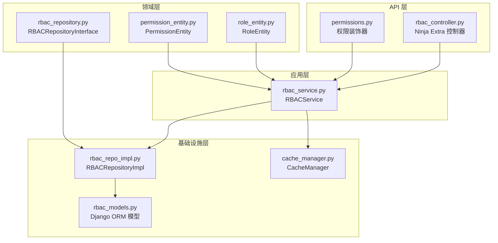
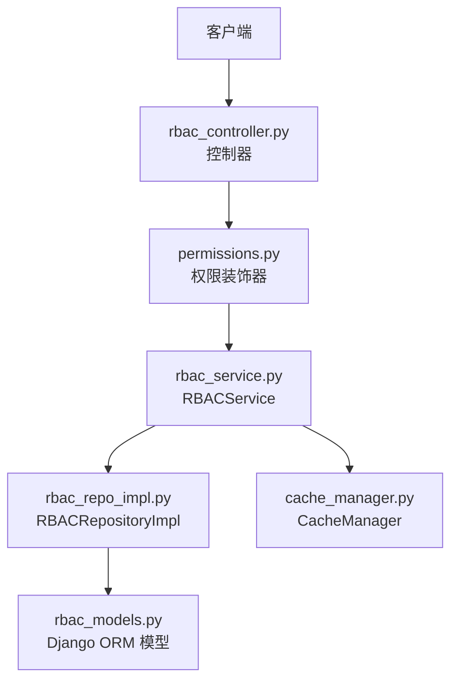
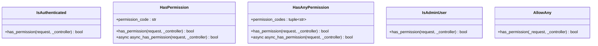
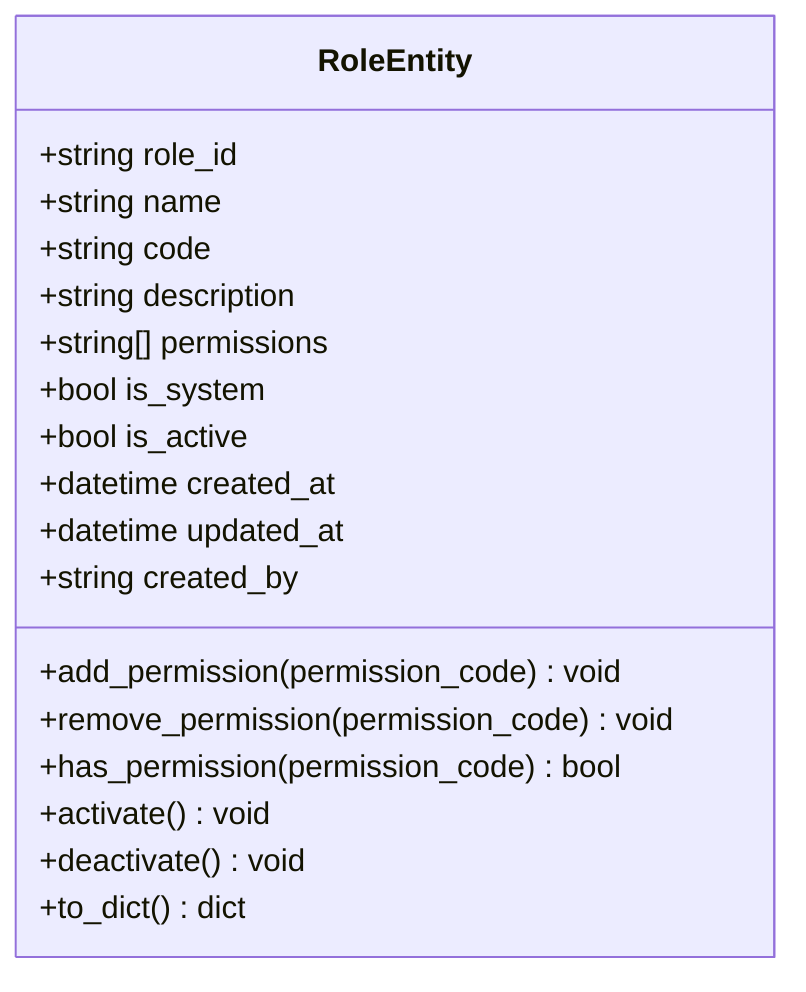
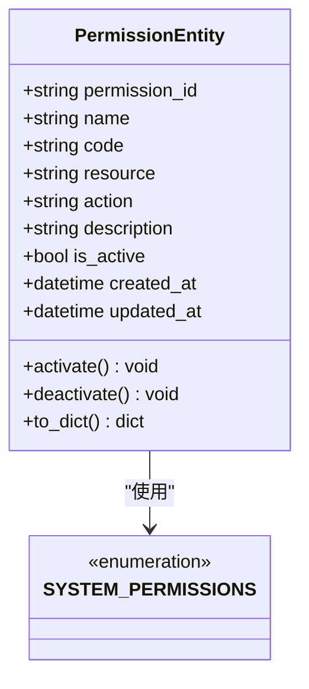
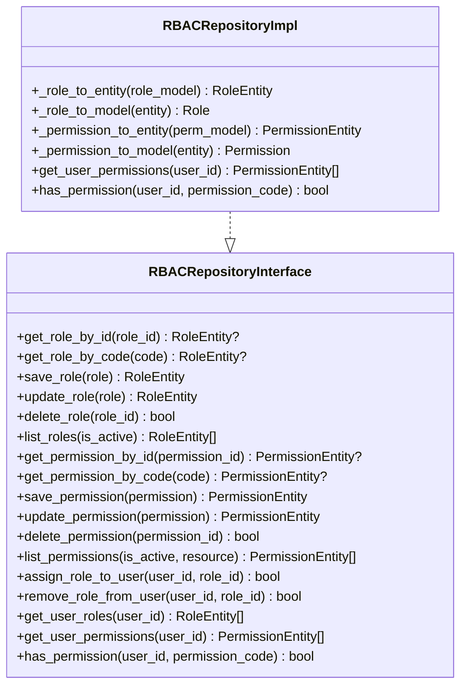
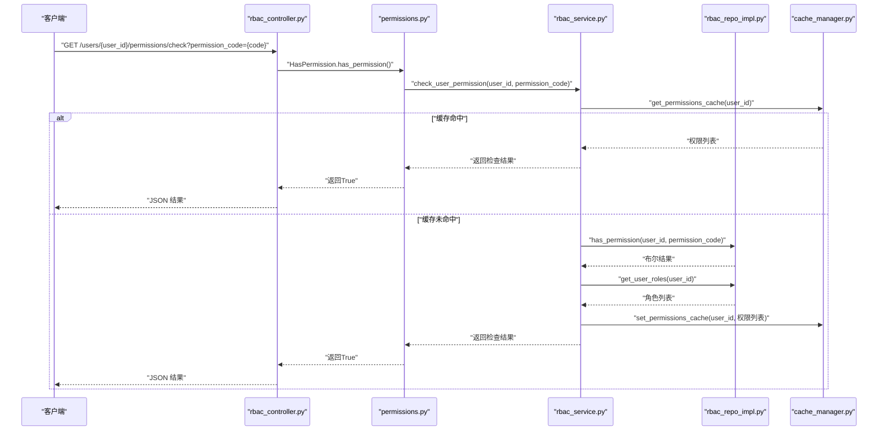
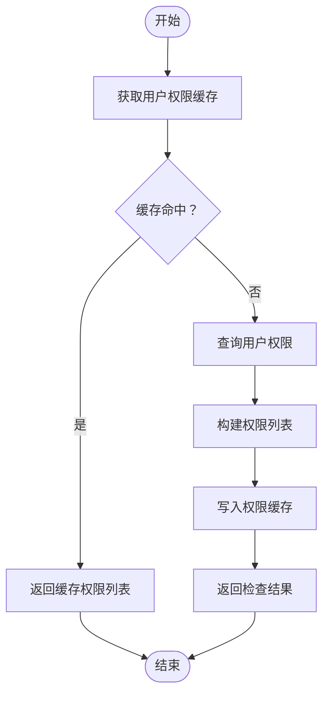
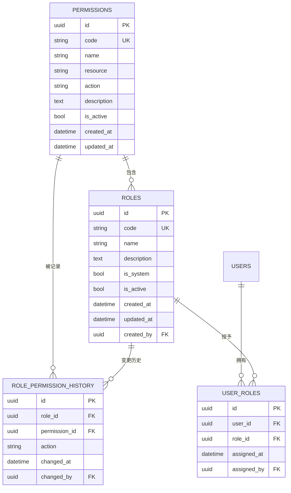
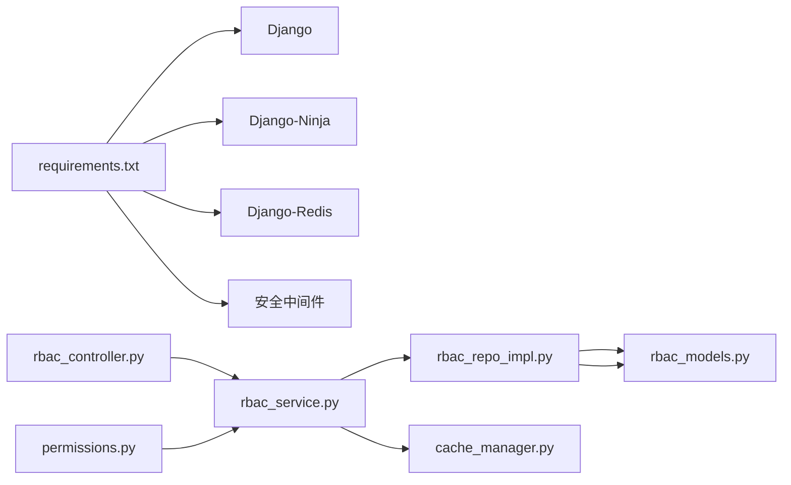

# 权限管理系统

<cite>
**本文档引用的文件**
- [permissions.py](file://src/api/common/permissions.py)
- [rbac_controller.py](file://src/api/v1/controllers/rbac_controller.py)
- [rbac_service.py](file://src/application/services/rbac_service.py)
- [rbac_repo_impl.py](file://src/infrastructure/repositories/rbac_repo_impl.py)
- [rbac_repository.py](file://src/domain/rbac/repositories/rbac_repository.py)
- [role_entity.py](file://src/domain/rbac/entities/role_entity.py)
- [permission_entity.py](file://src/domain/rbac/entities/permission_entity.py)
- [rbac_models.py](file://src/infrastructure/persistence/models/rbac_models.py)
- [cache_manager.py](file://src/infrastructure/cache/cache_manager.py)
- [role_create_dto.py](file://src/application/dto/rbac/role_create_dto.py)
- [assign_role_dto.py](file://src/application/dto/rbac/assign_role_dto.py)
- [role_response_dto.py](file://src/application/dto/rbac/role_response_dto.py)
- [user_roles_response_dto.py](file://src/application/dto/rbac/user_roles_response_dto.py)
- [requirements.txt](file://requirements.txt)
- [rbac.sql](file://sql/rbac.sql)
</cite>

## 更新摘要
**所做更改**
- 更新权限系统参数说明：修正权限类方法签名参数从 view 改为 controller
- 补充权限系统参数修正的详细说明
- 更新相关章节以反映最新的权限系统实现细节

## 目录
1. [简介](#简介)
2. [项目结构](#项目结构)
3. [核心组件](#核心组件)
4. [架构总览](#架构总览)
5. [详细组件分析](#详细组件分析)
6. [依赖关系分析](#依赖关系分析)
7. [性能考虑](#性能考虑)
8. [故障排查指南](#故障排查指南)
9. [结论](#结论)
10. [附录：RBAC API 接口规范](#附录rbac-api-接口规范)

## 简介
本项目是一个基于 Django-Ninja 的 RBAC（基于角色的访问控制）权限管理系统。系统采用分层架构，包含领域层、应用层、基础设施层与 API 层，实现了角色、权限与用户之间的解耦管理。核心能力包括：
- 角色管理：创建、查询、更新、删除角色，支持系统角色保护与激活状态控制
- 权限管理：权限创建、查询、初始化系统权限
- 用户角色分配：为用户分配或移除角色，支持批量权限聚合
- 权限检查：支持按用户与权限代码进行快速校验
- 权限缓存：基于 Redis 的用户权限缓存，提升权限检查性能
- 安全中间件：集成速率限制、IP 黑白名单、请求日志等安全策略

## 项目结构
系统采用"按层次+按功能"的混合组织方式：
- API 层：提供 RESTful 接口，分别在 v1 路由与控制器中实现
- 应用层：封装业务逻辑，协调仓储与缓存
- 领域层：定义角色与权限实体及仓储接口契约
- 基础设施层：ORM 模型、仓储实现、缓存管理、数据库迁移等
- DTO 层：输入输出数据结构定义
- 配置与依赖：Django、Ninja、Redis、安全中间件等



**图表来源**
- [rbac_controller.py:1-259](file://src/api/v1/controllers/rbac_controller.py#L1-L259)
- [permissions.py:1-244](file://src/api/common/permissions.py#L1-L244)
- [rbac_service.py:1-280](file://src/application/services/rbac_service.py#L1-L280)
- [rbac_repo_impl.py:1-240](file://src/infrastructure/repositories/rbac_repo_impl.py#L1-L240)
- [rbac_repository.py:1-112](file://src/domain/rbac/repositories/rbac_repository.py#L1-L112)
- [rbac_models.py:1-148](file://src/infrastructure/persistence/models/rbac_models.py#L1-L148)
- [cache_manager.py:1-149](file://src/infrastructure/cache/cache_manager.py#L1-L149)

**章节来源**
- [rbac_controller.py:1-259](file://src/api/v1/controllers/rbac_controller.py#L1-L259)
- [permissions.py:1-244](file://src/api/common/permissions.py#L1-L244)
- [rbac_service.py:1-280](file://src/application/services/rbac_service.py#L1-L280)
- [rbac_repo_impl.py:1-240](file://src/infrastructure/repositories/rbac_repo_impl.py#L1-L240)
- [rbac_repository.py:1-112](file://src/domain/rbac/repositories/rbac_repository.py#L1-L112)
- [rbac_models.py:1-148](file://src/infrastructure/persistence/models/rbac_models.py#L1-L148)
- [cache_manager.py:1-149](file://src/infrastructure/cache/cache_manager.py#L1-L149)

## 核心组件
- 角色实体（RoleEntity）：描述角色的属性与行为，支持权限增删、激活/停用、序列化等
- 权限实体（PermissionEntity）：描述权限的属性与行为，支持资源/动作解析、激活/停用、序列化等
- RBAC 仓储接口（RBACRepositoryInterface）：定义角色、权限与用户角色关联的数据访问契约
- RBAC 仓储实现（RBACRepositoryImpl）：基于 Django ORM 的具体实现，负责数据持久化与查询
- RBAC 服务（RBACService）：封装业务逻辑，协调仓储与缓存，提供角色、权限、用户角色管理与权限检查
- 缓存管理（CacheManager）：统一管理用户权限与角色缓存，提供缓存读写与失效策略
- 权限系统（permissions.py）：提供认证与权限检查的装饰器，支持同步和异步权限验证

**章节来源**
- [role_entity.py:1-80](file://src/domain/rbac/entities/role_entity.py#L1-L80)
- [permission_entity.py:1-85](file://src/domain/rbac/entities/permission_entity.py#L1-L85)
- [rbac_repository.py:1-112](file://src/domain/rbac/repositories/rbac_repository.py#L1-L112)
- [rbac_repo_impl.py:1-240](file://src/infrastructure/repositories/rbac_repo_impl.py#L1-L240)
- [rbac_service.py:1-280](file://src/application/services/rbac_service.py#L1-L280)
- [cache_manager.py:1-149](file://src/infrastructure/cache/cache_manager.py#L1-L149)
- [permissions.py:1-244](file://src/api/common/permissions.py#L1-L244)

## 架构总览
系统遵循分层架构与依赖倒置原则：
- API 层仅依赖应用服务接口，不直接操作仓储
- 应用服务依赖仓储接口，通过仓储实现访问数据库
- 领域实体独立于基础设施，便于测试与复用
- 缓存作为横切关注点，被应用服务统一调用
- 权限系统提供统一的权限检查机制，支持同步和异步验证



**图表来源**
- [rbac_controller.py:1-259](file://src/api/v1/controllers/rbac_controller.py#L1-L259)
- [permissions.py:1-244](file://src/api/common/permissions.py#L1-L244)
- [rbac_service.py:1-280](file://src/application/services/rbac_service.py#L1-L280)
- [rbac_repo_impl.py:1-240](file://src/infrastructure/repositories/rbac_repo_impl.py#L1-L240)
- [rbac_repository.py:1-112](file://src/domain/rbac/repositories/rbac_repository.py#L1-L112)
- [rbac_models.py:1-148](file://src/infrastructure/persistence/models/rbac_models.py#L1-L148)
- [cache_manager.py:1-149](file://src/infrastructure/cache/cache_manager.py#L1-L149)

## 详细组件分析

### 权限系统（permissions.py）
**更新** 权限类方法签名参数从 view 改为 controller

权限系统提供多种权限检查装饰器，支持同步和异步权限验证：

- **IsAuthenticated**：认证权限类，验证用户是否已登录
- **HasPermission**：单权限检查类，验证用户是否拥有指定权限
- **HasAnyPermission**：任一权限检查类，验证用户是否拥有指定权限中的任意一个
- **IsAdminUser**：管理员权限类，验证用户是否为管理员
- **AllowAny**：允许所有用户访问

所有权限类的方法签名均使用 `_controller` 参数替代原有的 `view` 参数，确保与 Django-Ninja-Extra 的权限系统兼容。



**图表来源**
- [permissions.py:13-44](file://src/api/common/permissions.py#L13-L44)
- [permissions.py:46-120](file://src/api/common/permissions.py#L46-L120)
- [permissions.py:122-195](file://src/api/common/permissions.py#L122-L195)
- [permissions.py:197-233](file://src/api/common/permissions.py#L197-L233)
- [permissions.py:235-244](file://src/api/common/permissions.py#L235-L244)

**章节来源**
- [permissions.py:1-244](file://src/api/common/permissions.py#L1-L244)

### 角色实体（RoleEntity）
- 关键属性：角色 ID、名称、代码、描述、权限代码列表、系统角色标记、激活状态、创建/更新时间、创建者
- 核心方法：添加/移除权限、检查权限、激活/停用、序列化为字典
- 设计要点：使用 dataclass 简化实体定义；权限以代码列表存储，便于快速检查与缓存



**图表来源**
- [role_entity.py:1-80](file://src/domain/rbac/entities/role_entity.py#L1-L80)

**章节来源**
- [role_entity.py:1-80](file://src/domain/rbac/entities/role_entity.py#L1-L80)

### 权限实体（PermissionEntity）
- 关键属性：权限 ID、名称、代码、资源、动作、描述、激活状态、创建/更新时间
- 核心方法：激活/停用、序列化为字典
- 设计要点：支持从代码自动解析资源与动作；内置系统权限常量集合



**图表来源**
- [permission_entity.py:1-85](file://src/domain/rbac/entities/permission_entity.py#L1-L85)

**章节来源**
- [permission_entity.py:1-85](file://src/domain/rbac/entities/permission_entity.py#L1-L85)

### RBAC 仓储接口与实现
- 仓储接口定义了角色、权限与用户角色关联的抽象方法，确保应用服务不依赖具体实现
- 仓储实现基于 Django ORM，提供异步查询、关联加载与权限聚合
- 查询优化：使用 select_related/prefetch_related 减少 N+1 查询；索引覆盖常用查询字段



**图表来源**
- [rbac_repository.py:1-112](file://src/domain/rbac/repositories/rbac_repository.py#L1-L112)
- [rbac_repo_impl.py:1-240](file://src/infrastructure/repositories/rbac_repo_impl.py#L1-L240)

**章节来源**
- [rbac_repository.py:1-112](file://src/domain/rbac/repositories/rbac_repository.py#L1-L112)
- [rbac_repo_impl.py:1-240](file://src/infrastructure/repositories/rbac_repo_impl.py#L1-L240)

### RBAC 服务（RBACService）
- 角色管理：创建、查询、更新、删除角色，系统角色保护，权限批量赋权
- 权限管理：创建权限、查询权限、初始化系统权限
- 用户角色：分配角色、移除角色、获取用户角色与权限、检查用户权限
- 权限检查：优先从缓存读取，未命中则查询数据库并回填缓存
- 缓存策略：用户权限与角色分别缓存，角色变更时主动失效



**图表来源**
- [rbac_controller.py:243-259](file://src/api/v1/controllers/rbac_controller.py#L243-L259)
- [permissions.py:66](file://src/api/common/permissions.py#L66)
- [rbac_service.py:194-212](file://src/application/services/rbac_service.py#L194-L212)
- [rbac_repo_impl.py:226-236](file://src/infrastructure/repositories/rbac_repo_impl.py#L226-L236)
- [cache_manager.py:108-122](file://src/infrastructure/cache/cache_manager.py#L108-L122)

**章节来源**
- [rbac_service.py:1-280](file://src/application/services/rbac_service.py#L1-L280)

### 缓存管理（CacheManager）
- 缓存键前缀与分组：统一前缀 + 分组命名空间，避免键冲突
- 用户权限缓存：按用户维度缓存权限代码列表，默认有效期较短
- 用户角色缓存：按用户维度缓存角色详情，默认有效期适中
- 异常处理：缓存读写异常记录日志，不影响主流程



**图表来源**
- [cache_manager.py:108-122](file://src/infrastructure/cache/cache_manager.py#L108-L122)
- [rbac_service.py:194-212](file://src/application/services/rbac_service.py#L194-L212)

**章节来源**
- [cache_manager.py:1-149](file://src/infrastructure/cache/cache_manager.py#L1-L149)

### 数据模型（Django ORM）
- 权限模型（Permission）：唯一权限代码、资源、动作、激活状态、索引优化
- 角色模型（Role）：唯一角色代码、多对多权限关联、系统角色标记、创建者外键
- 用户角色关联（UserRole）：用户与角色多对多，唯一约束防止重复分配
- 角色权限历史（RolePermissionHistory）：记录角色权限变更历史



**图表来源**
- [rbac_models.py:13-148](file://src/infrastructure/persistence/models/rbac_models.py#L13-L148)

**章节来源**
- [rbac_models.py:1-148](file://src/infrastructure/persistence/models/rbac_models.py#L1-L148)

## 依赖关系分析
- 外部依赖：Django、Django-Ninja、Redis、安全中间件等
- 内部依赖：API 层依赖应用服务；应用服务依赖仓储接口与缓存；仓储实现依赖 ORM 模型
- 循环依赖：通过接口与 DTO 解耦，避免循环导入
- 权限系统依赖：权限装饰器依赖 Django-Ninja-Extra 的 BasePermission 类



**图表来源**
- [requirements.txt:1-38](file://requirements.txt#L1-L38)
- [rbac_controller.py:1-259](file://src/api/v1/controllers/rbac_controller.py#L1-L259)
- [permissions.py:1-244](file://src/api/common/permissions.py#L1-L244)
- [rbac_service.py:1-280](file://src/application/services/rbac_service.py#L1-L280)
- [rbac_repo_impl.py:1-240](file://src/infrastructure/repositories/rbac_repo_impl.py#L1-L240)
- [rbac_models.py:1-148](file://src/infrastructure/persistence/models/rbac_models.py#L1-L148)
- [cache_manager.py:1-149](file://src/infrastructure/cache/cache_manager.py#L1-L149)

**章节来源**
- [requirements.txt:1-38](file://requirements.txt#L1-L38)
- [rbac_controller.py:1-259](file://src/api/v1/controllers/rbac_controller.py#L1-L259)
- [permissions.py:1-244](file://src/api/common/permissions.py#L1-L244)
- [rbac_service.py:1-280](file://src/application/services/rbac_service.py#L1-L280)
- [rbac_repo_impl.py:1-240](file://src/infrastructure/repositories/rbac_repo_impl.py#L1-L240)
- [rbac_models.py:1-148](file://src/infrastructure/persistence/models/rbac_models.py#L1-L148)
- [cache_manager.py:1-149](file://src/infrastructure/cache/cache_manager.py#L1-L149)

## 性能考虑
- 查询优化
  - 使用 select_related/prefetch_related 避免 N+1 查询
  - 为常用查询字段建立数据库索引（如权限代码、角色代码、用户/角色索引）
- 缓存策略
  - 用户权限缓存默认有效期较短，保证权限变更及时生效
  - 用户角色缓存默认有效期适中，减少频繁查询
  - 角色变更时主动清理相关缓存键
- 异步操作
  - 所有数据库操作采用异步 ORM 方法，提升并发性能
- 依赖与部署
  - Redis 作为缓存后端，建议与应用服务分离部署，确保低延迟
- 权限检查优化
  - 权限装饰器支持异步权限检查，避免阻塞请求处理

## 故障排查指南
- 常见错误与处理
  - 角色/权限不存在：在查询不到实体时抛出明确错误信息
  - 系统角色不可修改/删除：系统角色标记为不可变更
  - 用户已拥有角色：分配角色前检查唯一性约束
  - 用户无此角色：移除角色时若未找到记录返回相应提示
- 缓存问题
  - 缓存读写异常会记录日志但不影响主流程；可通过日志定位问题
  - 权限变更后需等待缓存过期或触发失效逻辑
- 数据库问题
  - 确认索引是否存在，特别是权限代码与角色代码的唯一索引
  - 检查外键约束与唯一约束是否满足业务要求
- 权限系统问题
  - 权限装饰器参数签名必须使用 `_controller` 而非 `view`
  - 确保权限检查的异步方法正确实现

**章节来源**
- [rbac_service.py:82-92](file://src/application/services/rbac_service.py#L82-L92)
- [rbac_service.py:142-150](file://src/application/services/rbac_service.py#L142-L150)
- [rbac_service.py:172-182](file://src/application/services/rbac_service.py#L172-L182)
- [cache_manager.py:42-58](file://src/infrastructure/cache/cache_manager.py#L42-L58)
- [rbac_models.py:106-110](file://src/infrastructure/persistence/models/rbac_models.py#L106-L110)
- [permissions.py:66](file://src/api/common/permissions.py#L66)

## 结论
本 RBAC 权限管理系统通过清晰的分层设计与接口隔离，实现了角色、权限与用户关系的灵活管理。结合缓存与异步 ORM，系统在保证正确性的同时具备良好的性能表现。权限系统经过参数修正后，确保了与 Django-Ninja-Extra 的完全兼容性，提供了稳定可靠的权限检查机制。建议在生产环境中配合完善的监控与日志体系，持续优化缓存策略与数据库索引。

## 附录：RBAC API 接口规范

### 角色管理
- 创建角色
  - 方法与路径：POST /api/v1/rbac/roles
  - 请求体：RoleCreateDTO（名称、代码、描述、权限代码列表）
  - 响应：RoleResponseDTO
- 获取角色详情
  - 方法与路径：GET /api/v1/rbac/roles/{role_id}
  - 路径参数：role_id
  - 响应：RoleResponseDTO
- 获取角色列表
  - 方法与路径：GET /api/v1/rbac/roles
  - 查询参数：is_active（可选）
  - 响应：RoleListResponse（roles、total）
- 更新角色
  - 方法与路径：PUT /api/v1/rbac/roles/{role_id}
  - 路径参数：role_id
  - 请求体：RoleUpdateDTO（名称、描述、权限代码列表）
  - 响应：RoleResponseDTO
- 删除角色
  - 方法与路径：DELETE /api/v1/rbac/roles/{role_id}
  - 路径参数：role_id
  - 响应：MessageResponse

**章节来源**
- [rbac_controller.py:53-147](file://src/api/v1/controllers/rbac_controller.py#L53-L147)
- [role_create_dto.py:1-30](file://src/application/dto/rbac/role_create_dto.py#L1-L30)
- [role_response_dto.py:1-26](file://src/application/dto/rbac/role_response_dto.py#L1-L26)

### 权限管理
- 获取权限列表
  - 方法与路径：GET /api/v1/rbac/permissions
  - 查询参数：is_active（可选）、resource（可选）
  - 响应：PermissionListResponse（permissions、total）
- 初始化系统权限
  - 方法与路径：POST /api/v1/rbac/permissions/init
  - 响应：MessageResponse

**章节来源**
- [rbac_controller.py:150-180](file://src/api/v1/controllers/rbac_controller.py#L150-L180)

### 用户角色管理
- 分配角色给用户
  - 方法与路径：POST /api/v1/rbac/users/{user_id}/roles
  - 路径参数：user_id
  - 请求体：AssignRoleDTO（user_id、role_id）
  - 响应：MessageResponse
- 从用户移除角色
  - 方法与路径：DELETE /api/v1/rbac/users/{user_id}/roles/{role_id}
  - 路径参数：user_id、role_id
  - 响应：MessageResponse
- 获取用户角色与权限
  - 方法与路径：GET /api/v1/rbac/users/{user_id}/roles
  - 路径参数：user_id
  - 响应：UserRolesResponseDTO（user_id、roles、permissions）
- 检查用户权限
  - 方法与路径：GET /api/v1/rbac/users/{user_id}/permissions/check
  - 路径参数：user_id
  - 查询参数：permission_code
  - 响应：字典（包含 user_id、permission_code、has_permission）

**章节来源**
- [rbac_controller.py:184-259](file://src/api/v1/controllers/rbac_controller.py#L184-L259)
- [assign_role_dto.py:1-21](file://src/application/dto/rbac/assign_role_dto.py#L1-L21)
- [user_roles_response_dto.py:1-17](file://src/application/dto/rbac/user_roles_response_dto.py#L1-L17)

### 权限系统使用示例
- 基础认证权限
  ```python
  @api_controller("/users", permissions=[IsAuthenticated])
  class UserController:
      pass
  ```
- 单权限检查
  ```python
  @api_controller("/users", permissions=[IsAuthenticated, HasPermission("user:read")])
  class UserController:
      pass
  ```
- 任一权限检查
  ```python
  @api_controller("/users", permissions=[IsAuthenticated, HasAnyPermission("user:read", "user:write")])
  class UserController:
      pass
  ```

**章节来源**
- [permissions.py:51-54](file://src/api/common/permissions.py#L51-L54)
- [permissions.py:127-130](file://src/api/common/permissions.py#L127-L130)

### 数据模型与初始化脚本
- 数据模型
  - 权限表：包含权限代码、资源、动作、激活状态等字段
  - 角色表：包含角色代码、名称、描述、系统角色标记、创建者等字段
  - 用户角色关联表：用户与角色的多对多关系，唯一约束
- 初始化脚本
  - 可参考 SQL 文件中的表结构定义，确保数据库迁移与索引完整

**章节来源**
- [rbac_models.py:13-148](file://src/infrastructure/persistence/models/rbac_models.py#L13-L148)
- [rbac.sql:1-232](file://sql/rbac.sql#L1-L232)