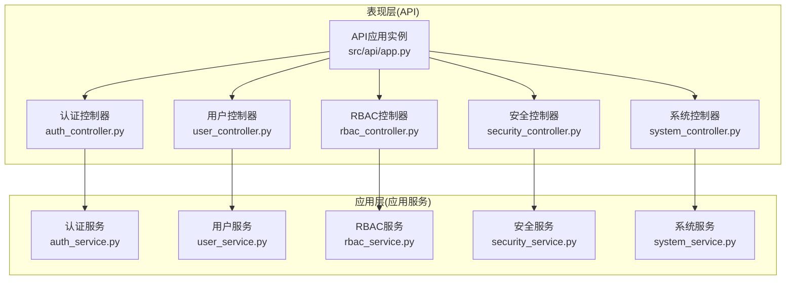
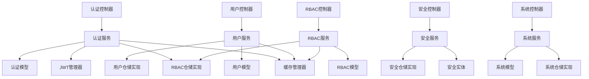
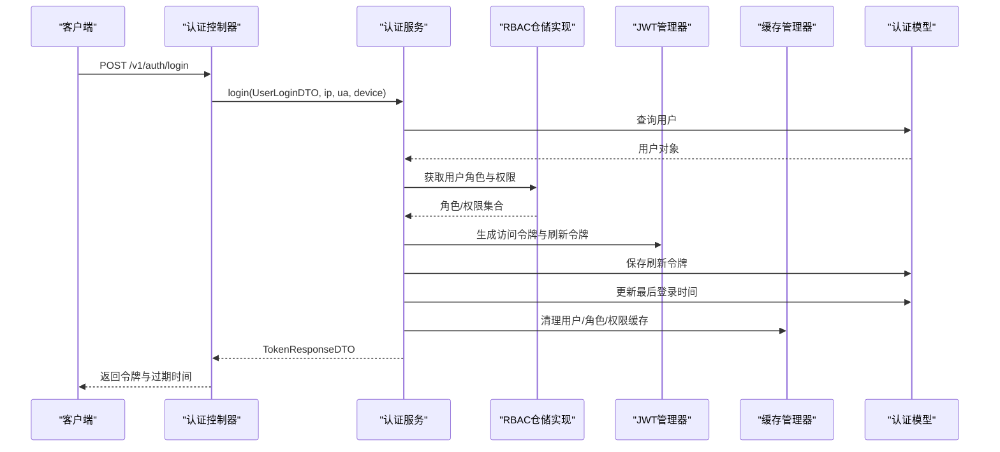
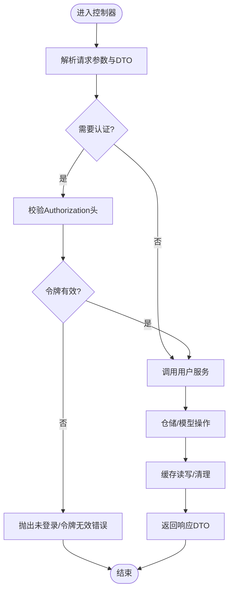
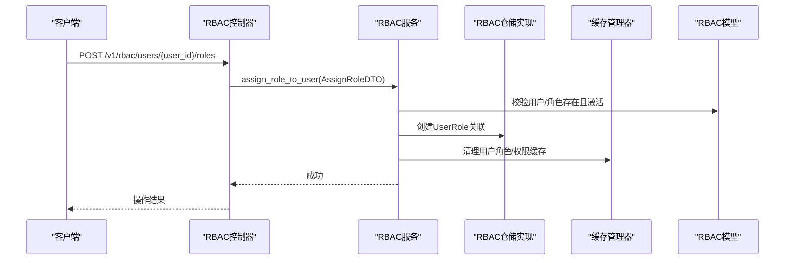
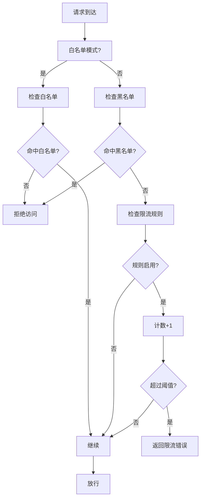
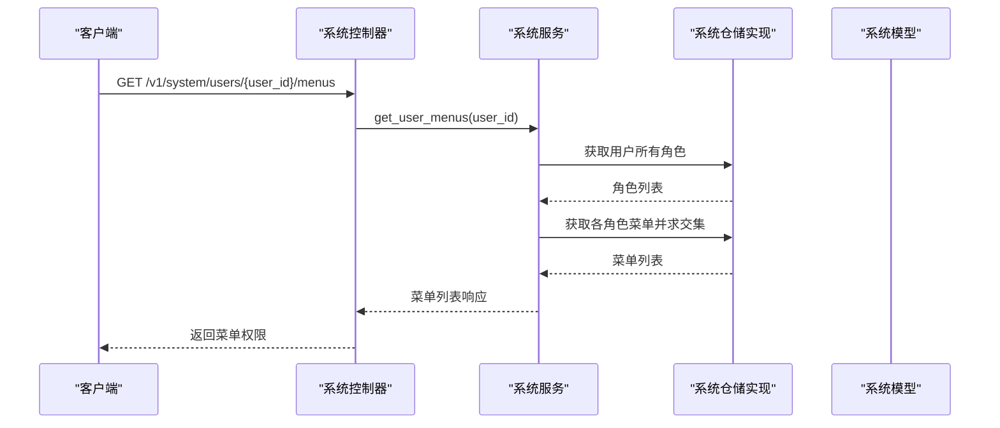
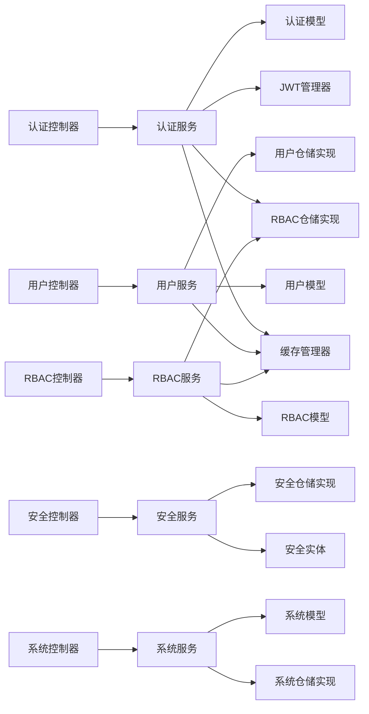

# 核心模块

<cite>
**本文引用的文件**
- [src/api/app.py](file://src/api/app.py)
- [src/api/v1/controllers/auth_controller.py](file://src/api/v1/controllers/auth_controller.py)
- [src/api/v1/controllers/user_controller.py](file://src/api/v1/controllers/user_controller.py)
- [src/api/v1/controllers/rbac_controller.py](file://src/api/v1/controllers/rbac_controller.py)
- [src/api/v1/controllers/security_controller.py](file://src/api/v1/controllers/security_controller.py)
- [src/api/v1/controllers/system_controller.py](file://src/api/v1/controllers/system_controller.py)
- [src/application/services/auth_service.py](file://src/application/services/auth_service.py)
- [src/application/services/user_service.py](file://src/application/services/user_service.py)
- [src/application/services/rbac_service.py](file://src/application/services/rbac_service.py)
- [src/application/services/security_service.py](file://src/application/services/security_service.py)
- [src/application/services/system_service.py](file://src/application/services/system_service.py)
</cite>

## 目录
1. [简介](#简介)
2. [项目结构](#项目结构)
3. [核心组件](#核心组件)
4. [架构总览](#架构总览)
5. [详细组件分析](#详细组件分析)
6. [依赖分析](#依赖分析)
7. [性能考量](#性能考量)
8. [故障排查指南](#故障排查指南)
9. [结论](#结论)
10. [附录](#附录)

## 简介
本项目基于 Django-Ninja-Extra 构建，提供 RESTful API 服务，集成 JWT 认证与 RBAC 权限管理，并内置安全防护（IP 黑/白名单、限流）与系统管理能力（部门、菜单、角色、操作日志）。本文档聚焦核心模块：认证、用户管理、权限管理（RBAC）、安全防护、系统管理，阐述其职责边界、接口设计、内部实现逻辑、模块间协作与数据传递机制，并给出使用示例、最佳实践、错误处理策略、性能优化与扩展性建议。

## 项目结构
项目采用分层架构与领域驱动设计（DDD）风格：
- 表现层：API 应用实例与控制器（Controllers），负责接收请求、参数校验、调用应用服务、返回统一响应。
- 应用层：应用服务（Services），封装业务流程，协调基础设施与仓储，保证用例的完整性。
- 领域层：实体与值对象，定义业务规则与不变量。
- 基础设施层：仓储实现、缓存、JWT、持久化模型、中间件等。

图表来源
- [src/api/app.py:1-48](file://src/api/app.py#L1-L48)
- [src/api/v1/controllers/auth_controller.py:16-133](file://src/api/v1/controllers/auth_controller.py#L16-L133)
- [src/api/v1/controllers/user_controller.py:33-283](file://src/api/v1/controllers/user_controller.py#L33-L283)
- [src/api/v1/controllers/rbac_controller.py:38-351](file://src/api/v1/controllers/rbac_controller.py#L38-L351)
- [src/api/v1/controllers/security_controller.py:21-302](file://src/api/v1/controllers/security_controller.py#L21-L302)
- [src/api/v1/controllers/system_controller.py:60-734](file://src/api/v1/controllers/system_controller.py#L60-L734)
- [src/application/services/auth_service.py:20-233](file://src/application/services/auth_service.py#L20-L233)
- [src/application/services/user_service.py:16-193](file://src/application/services/user_service.py#L16-L193)
- [src/application/services/rbac_service.py:22-319](file://src/application/services/rbac_service.py#L22-L319)
- [src/application/services/security_service.py:24-225](file://src/application/services/security_service.py#L24-L225)
- [src/application/services/system_service.py:25-435](file://src/application/services/system_service.py#L25-L435)

章节来源
- [src/api/app.py:1-48](file://src/api/app.py#L1-L48)

## 核心组件
- 认证模块：负责用户登录、刷新令牌、登出、令牌验证与登录日志记录；集成 JWT 管理器与刷新令牌持久化。
- 用户管理模块：负责用户增删改查、密码修改、认证与缓存；提供 DTO 转换与缓存策略。
- 权限管理模块（RBAC）：负责角色与权限的创建、查询、更新、删除；支持用户角色分配、权限检查与缓存；提供系统权限初始化。
- 安全防护模块：负责 IP 黑/白名单管理、限流规则创建/切换/删除与状态查询；提供安全状态概览。
- 系统管理模块：负责部门、菜单、角色、用户角色与菜单权限映射、操作日志的查询与统计；提供树形结构与权限交集计算。

章节来源
- [src/api/v1/controllers/auth_controller.py:16-133](file://src/api/v1/controllers/auth_controller.py#L16-L133)
- [src/api/v1/controllers/user_controller.py:33-283](file://src/api/v1/controllers/user_controller.py#L33-L283)
- [src/api/v1/controllers/rbac_controller.py:38-351](file://src/api/v1/controllers/rbac_controller.py#L38-L351)
- [src/api/v1/controllers/security_controller.py:21-302](file://src/api/v1/controllers/security_controller.py#L21-L302)
- [src/api/v1/controllers/system_controller.py:60-734](file://src/api/v1/controllers/system_controller.py#L60-L734)

## 架构总览
整体采用“控制器-应用服务-仓储/基础设施”的分层，控制器仅做参数解析与权限控制，应用服务编排业务，仓储负责数据持久化与查询，基础设施提供 JWT、缓存、模型等支撑。

图表来源
- [src/api/v1/controllers/auth_controller.py:16-133](file://src/api/v1/controllers/auth_controller.py#L16-L133)
- [src/api/v1/controllers/user_controller.py:33-283](file://src/api/v1/controllers/user_controller.py#L33-L283)
- [src/api/v1/controllers/rbac_controller.py:38-351](file://src/api/v1/controllers/rbac_controller.py#L38-L351)
- [src/api/v1/controllers/security_controller.py:21-302](file://src/api/v1/controllers/security_controller.py#L21-L302)
- [src/api/v1/controllers/system_controller.py:60-734](file://src/api/v1/controllers/system_controller.py#L60-L734)
- [src/application/services/auth_service.py:20-233](file://src/application/services/auth_service.py#L20-L233)
- [src/application/services/user_service.py:16-193](file://src/application/services/user_service.py#L16-L193)
- [src/application/services/rbac_service.py:22-319](file://src/application/services/rbac_service.py#L22-L319)
- [src/application/services/security_service.py:24-225](file://src/application/services/security_service.py#L24-L225)
- [src/application/services/system_service.py:25-435](file://src/application/services/system_service.py#L25-L435)

## 详细组件分析

### 认证模块
- 职责边界
  - 处理登录、刷新令牌、登出与令牌验证。
  - 维护登录日志与刷新令牌持久化。
  - 与 RBAC 服务联动获取用户角色与权限，生成带角色/权限的访问令牌。
- 关键接口
  - POST /v1/auth/login：用户名+密码登录，返回访问令牌与刷新令牌。
  - POST /v1/auth/refresh：使用刷新令牌换取新的访问令牌。
  - POST /v1/auth/logout：撤销访问令牌，清理用户相关缓存。
- 内部实现要点
  - 登录：校验用户存在与激活状态、验证密码；获取用户角色与权限；生成访问/刷新令牌；持久化刷新令牌；更新最后登录时间；记录登录日志。
  - 刷新：验证刷新令牌有效性；重新拉取用户角色/权限；生成新的访问令牌。
  - 登出：撤销访问令牌；按用户ID清理角色、权限、用户信息缓存。
- 错误处理
  - 用户名或密码错误、用户被停用、刷新令牌无效或过期、令牌无效或已撤销等场景均抛出明确错误。
- 性能与扩展
  - 使用缓存管理器缓存用户与权限；登录日志异步写入；刷新令牌持久化避免内存态丢失。
  - 可扩展：支持多设备登录、并发刷新令牌、令牌吊销列表（RTLR）等。

图表来源
- [src/api/v1/controllers/auth_controller.py:42-78](file://src/api/v1/controllers/auth_controller.py#L42-L78)
- [src/application/services/auth_service.py:26-111](file://src/application/services/auth_service.py#L26-L111)
- [src/application/services/auth_service.py:191-208](file://src/application/services/auth_service.py#L191-L208)

章节来源
- [src/api/v1/controllers/auth_controller.py:16-133](file://src/api/v1/controllers/auth_controller.py#L16-L133)
- [src/application/services/auth_service.py:20-233](file://src/application/services/auth_service.py#L20-L233)

### 用户管理模块
- 职责边界
  - 用户生命周期管理：创建、查询、列表、更新、软删除。
  - 密码修改与认证；当前用户信息查询。
  - 缓存策略：用户信息缓存、权限/角色缓存清理。
- 关键接口
  - POST /v1/users：创建用户（校验用户名/邮箱唯一）。
  - GET /v1/users/{user_id}：按ID获取用户详情。
  - GET /v1/users：分页获取用户列表。
  - PUT /v1/users/{user_id}：更新用户。
  - DELETE /v1/users/{user_id}：删除用户。
  - POST /v1/users/change-password：修改密码（需认证）。
  - GET /v1/me：获取当前登录用户信息（需认证）。
- 内部实现要点
  - 密码哈希使用 Django 密码哈希；更新/删除后清理缓存；认证时更新最后登录时间。
  - 当前用户解析通过 Authorization Bearer Token，经由 JWT 验证器解码载荷。
- 错误处理
  - 用户不存在、用户名/邮箱重复、原密码不正确、未登录或令牌无效等。
- 性能与扩展
  - 缓存命中优先；批量分页查询；可扩展头像上传、个人资料扩展字段。

图表来源
- [src/api/v1/controllers/user_controller.py:196-283](file://src/api/v1/controllers/user_controller.py#L196-L283)
- [src/application/services/user_service.py:29-151](file://src/application/services/user_service.py#L29-L151)

章节来源
- [src/api/v1/controllers/user_controller.py:33-283](file://src/api/v1/controllers/user_controller.py#L33-L283)
- [src/application/services/user_service.py:16-193](file://src/application/services/user_service.py#L16-L193)

### 权限管理（RBAC）模块
- 职责边界
  - 角色管理：创建、查询、列表、更新、删除。
  - 权限管理：创建、查询、列表、初始化系统权限。
  - 用户角色关联：分配/移除角色、查询用户角色与权限、检查用户权限。
- 关键接口
  - 角色：POST/GET/PUT/DELETE /v1/rbac/roles
  - 权限：GET /v1/rbac/permissions 与 POST /v1/rbac/permissions/init
  - 用户角色：POST/DELETE/GET /v1/rbac/users/{user_id}/roles
  - 权限检查：GET /v1/rbac/users/{user_id}/permissions/check
- 内部实现要点
  - 角色/权限持久化；系统角色不可修改/删除；分配角色后清理用户缓存。
  - 权限检查优先从缓存读取，未命中再查询数据库并回填缓存。
  - 系统权限初始化从领域实体常量批量创建。
- 错误处理
  - 角色/权限代码重复、角色已被停用、用户/角色不存在、用户已拥有角色等。
- 性能与扩展
  - 权限缓存提升检查效率；支持批量分配与去重；可扩展权限继承与动态权限。

图表来源
- [src/api/v1/controllers/rbac_controller.py:245-267](file://src/api/v1/controllers/rbac_controller.py#L245-L267)
- [src/application/services/rbac_service.py:171-205](file://src/application/services/rbac_service.py#L171-L205)

章节来源
- [src/api/v1/controllers/rbac_controller.py:38-351](file://src/api/v1/controllers/rbac_controller.py#L38-L351)
- [src/application/services/rbac_service.py:22-319](file://src/application/services/rbac_service.py#L22-L319)

### 安全防护模块
- 职责边界
  - IP 黑名单：新增、移除、查询；支持永久/限时。
  - IP 白名单：新增、移除、查询。
  - 限流规则：创建、启用/禁用、删除、查询；提供限流状态查询。
  - 安全状态：统计黑名单/白名单/限流规则数量与开关状态。
- 关键接口
  - 黑名单：POST/DELETE/GET /v1/security/blacklist
  - 白名单：POST/DELETE/GET /v1/security/whitelist
  - 限流：POST/PUT/DELETE/GET /v1/security/rate-limit
  - 状态：GET /v1/security/status
- 内部实现要点
  - 限流状态查询：根据端点与方法匹配规则，计算剩余次数与重置时间。
  - 安全状态聚合：统计各维度数量与开关状态。
- 错误处理
  - IP 已在名单中、规则不存在、端点规则重复等。
- 性能与扩展
  - 限流记录窗口化存储；可扩展 Redis 计数器；支持更细粒度的限流维度（用户/IP/路由）。

图表来源
- [src/api/v1/controllers/security_controller.py:21-302](file://src/api/v1/controllers/security_controller.py#L21-L302)
- [src/application/services/security_service.py:145-165](file://src/application/services/security_service.py#L145-L165)

章节来源
- [src/api/v1/controllers/security_controller.py:21-302](file://src/api/v1/controllers/security_controller.py#L21-L302)
- [src/application/services/security_service.py:24-225](file://src/application/services/security_service.py#L24-L225)

### 系统管理模块
- 职责边界
  - 部门：创建、查询、更新、删除、列表、树形结构。
  - 菜单：创建、查询、更新、删除、列表、树形结构；菜单即权限。
  - 角色：创建、查询、更新、删除、列表；支持分配菜单权限。
  - 用户角色与菜单：为用户分配角色、查询用户角色与菜单权限（多角色取交集）。
  - 操作日志：按模块/方法/时间/状态等多条件分页查询与详情。
- 关键接口
  - 部门：POST/GET/PUT/DELETE/GET /v1/system/depts 与 /v1/system/depts/tree
  - 菜单：POST/GET/PUT/DELETE/GET /v1/system/menus 与 /v1/system/menus/tree
  - 角色：POST/GET/PUT/DELETE/GET /v1/system/roles
  - 用户角色与菜单：POST/GET /v1/system/users/{user_id}/roles 与 /v1/system/users/{user_id}/menus
  - 操作日志：GET /v1/system/operation-logs 与 /v1/system/operation-logs/{log_id}
- 内部实现要点
  - 树形结构递归构建；菜单即权限，多角色权限取交集；用户菜单权限为各角色菜单的交集。
  - 操作日志查询支持多条件过滤与分页。
- 错误处理
  - 存在子项/被使用时不可删除、角色/菜单不存在、用户不存在等。
- 性能与扩展
  - 菜单树构建与权限交集计算可结合缓存；日志查询支持索引优化。

图表来源
- [src/api/v1/controllers/system_controller.py:644-659](file://src/api/v1/controllers/system_controller.py#L644-L659)
- [src/application/services/system_service.py:397-400](file://src/application/services/system_service.py#L397-L400)

章节来源
- [src/api/v1/controllers/system_controller.py:60-734](file://src/api/v1/controllers/system_controller.py#L60-L734)
- [src/application/services/system_service.py:25-435](file://src/application/services/system_service.py#L25-L435)

## 依赖分析
- 控制器到应用服务：控制器通过依赖注入或直接实例化应用服务，集中处理业务流程。
- 应用服务到仓储/模型：应用服务通过仓储实现访问数据库，必要时进行 DTO 转换与缓存交互。
- 基础设施：JWT 管理器、缓存管理器、ORM 模型、验证器等作为横切关注点被应用服务复用。
- 中间件：项目包含限流、IP 限制、请求日志与安全中间件，可在请求进入控制器前拦截与处理。

图表来源
- [src/api/v1/controllers/auth_controller.py:16-133](file://src/api/v1/controllers/auth_controller.py#L16-L133)
- [src/api/v1/controllers/user_controller.py:33-283](file://src/api/v1/controllers/user_controller.py#L33-L283)
- [src/api/v1/controllers/rbac_controller.py:38-351](file://src/api/v1/controllers/rbac_controller.py#L38-L351)
- [src/api/v1/controllers/security_controller.py:21-302](file://src/api/v1/controllers/security_controller.py#L21-L302)
- [src/api/v1/controllers/system_controller.py:60-734](file://src/api/v1/controllers/system_controller.py#L60-L734)
- [src/application/services/auth_service.py:20-233](file://src/application/services/auth_service.py#L20-L233)
- [src/application/services/user_service.py:16-193](file://src/application/services/user_service.py#L16-L193)
- [src/application/services/rbac_service.py:22-319](file://src/application/services/rbac_service.py#L22-L319)
- [src/application/services/security_service.py:24-225](file://src/application/services/security_service.py#L24-L225)
- [src/application/services/system_service.py:25-435](file://src/application/services/system_service.py#L25-L435)

## 性能考量
- 缓存策略
  - 用户信息、角色、权限分别缓存，变更时主动清理；权限检查优先走缓存。
- 异步与并发
  - 使用 Django ORM 异步接口（a* 方法）减少阻塞；令牌刷新与登录日志异步写入。
- 数据库与查询
  - 列表查询支持分页与过滤；树形结构递归构建注意 N+1 查询，可通过预取或一次性查询优化。
- 限流与安全
  - 限流规则按端点/方法维度管理；白名单优先于黑名单；黑名单/白名单命中快速拒绝。
- 扩展性
  - 可引入 Redis 作为限流计数器与缓存后端；支持更细粒度的限流维度（用户/IP/路由）；权限检查可扩展为动态权限表达式。

## 故障排查指南
- 认证相关
  - 登录失败：检查用户名/密码、用户是否激活、登录日志原因；确认刷新令牌是否过期。
  - 刷新令牌无效：核对刷新令牌签名与有效期；确认用户角色/权限是否变更导致缓存不一致。
  - 登出后仍可访问：确认令牌撤销与缓存清理是否执行。
- 用户管理
  - 用户不存在/重复：检查用户名/邮箱唯一约束；确认缓存是否脏读。
  - 修改密码失败：核对旧密码校验与新密码强度。
- RBAC
  - 分配角色失败：确认用户/角色存在且未重复分配；系统角色不可修改/删除。
  - 权限检查异常：清理用户权限缓存后重试。
- 安全
  - IP 被拒绝：检查是否命中黑名单/白名单；白名单模式下仅允许白名单内访问。
  - 限流频繁：调整规则速率/周期或扩大作用域；查看限流状态接口定位问题。
- 系统管理
  - 删除失败：确认是否存在子项/被使用；多角色菜单权限交集可能为空但不影响查询。

章节来源
- [src/application/services/auth_service.py:36-56](file://src/application/services/auth_service.py#L36-L56)
- [src/application/services/user_service.py:118-130](file://src/application/services/user_service.py#L118-L130)
- [src/application/services/rbac_service.py:171-205](file://src/application/services/rbac_service.py#L171-L205)
- [src/application/services/security_service.py:145-165](file://src/application/services/security_service.py#L145-L165)
- [src/application/services/system_service.py:72-86](file://src/application/services/system_service.py#L72-L86)

## 结论
本项目通过清晰的分层与职责划分，实现了认证、用户、RBAC、安全与系统管理的完整能力。控制器轻薄、应用服务编排业务、仓储与基础设施提供稳定的数据与工具支持。建议在生产环境中进一步完善缓存策略、限流计数器与权限动态扩展，持续优化查询与树形构建性能，并加强监控与可观测性以提升稳定性与可维护性。

## 附录
- API 使用示例（路径）
  - 登录：POST /api/v1/auth/login
  - 刷新：POST /api/v1/auth/refresh
  - 登出：POST /api/v1/auth/logout
  - 创建用户：POST /api/v1/users
  - 获取当前用户：GET /api/v1/me
  - 创建角色：POST /api/v1/rbac/roles
  - 初始化系统权限：POST /api/v1/rbac/permissions/init
  - 分配用户角色：POST /api/v1/rbac/users/{user_id}/roles
  - 添加IP到黑名单：POST /api/v1/security/blacklist
  - 创建限流规则：POST /api/v1/security/rate-limit
  - 创建部门：POST /api/v1/system/depts
  - 创建菜单：POST /api/v1/system/menus
  - 创建角色：POST /api/v1/system/roles
  - 获取用户菜单权限：GET /api/v1/system/users/{user_id}/menus
  - 获取操作日志列表：GET /api/v1/system/operation-logs
- 最佳实践
  - 使用 Bearer Token 进行认证；在高并发场景下合理设置令牌过期时间与刷新策略。
  - 对敏感操作开启限流与白名单；定期审计黑名单与权限分配。
  - 利用缓存降低数据库压力；变更后及时清理相关缓存。
  - 对树形结构与权限交集计算进行性能评估与优化。
- 错误处理策略
  - 明确区分业务错误与系统错误；对用户可感知的错误返回清晰提示。
  - 对未认证/权限不足场景统一返回相应状态码与错误信息。
- 配置选项说明（节选）
  - JWT 过期时间：通过 ACCESS_TOKEN_LIFETIME 设置访问令牌过期分钟数。
  - 限流周期与速率：按端点/方法配置 rate 与 period。
  - 白名单/黑名单开关：安全状态接口返回当前启用状态与数量统计。