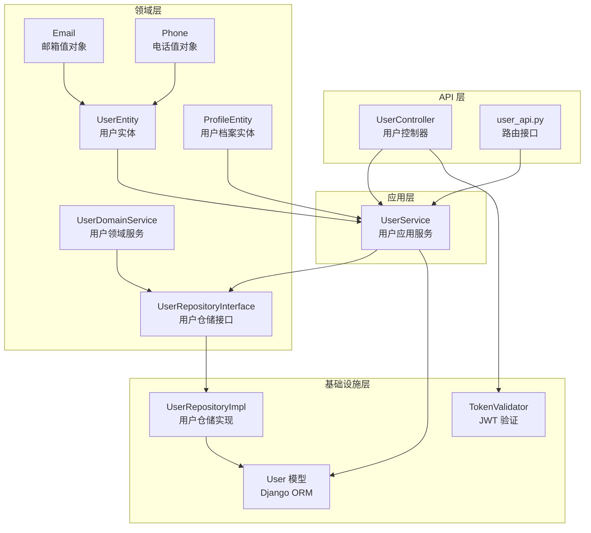
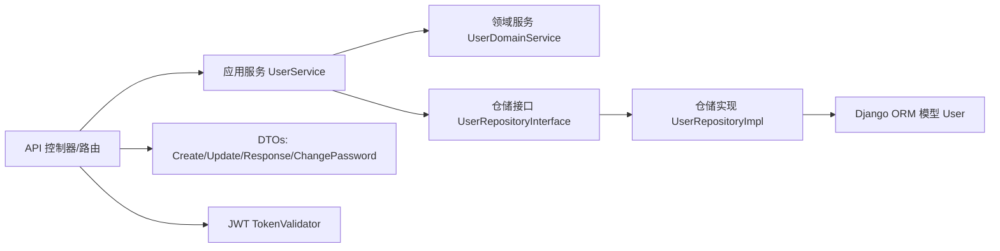
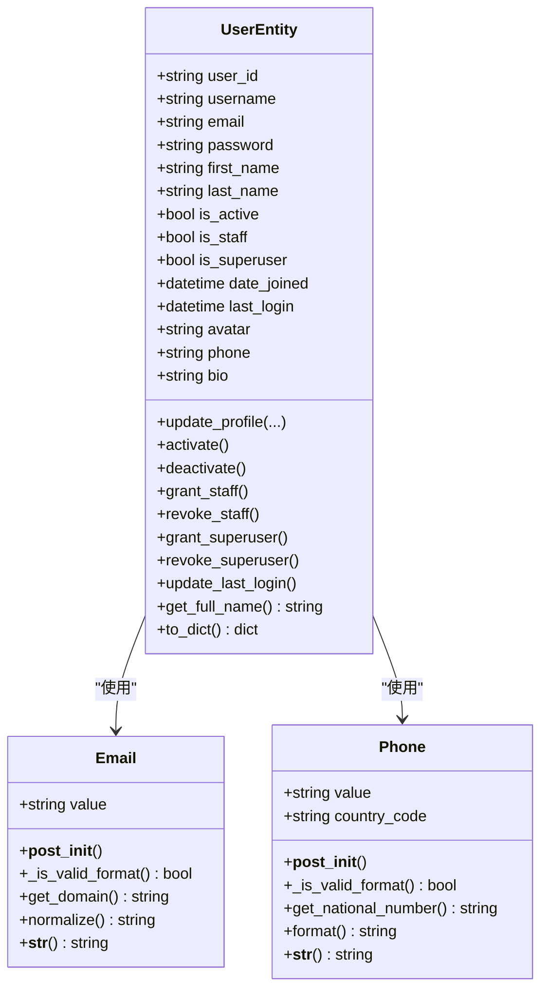
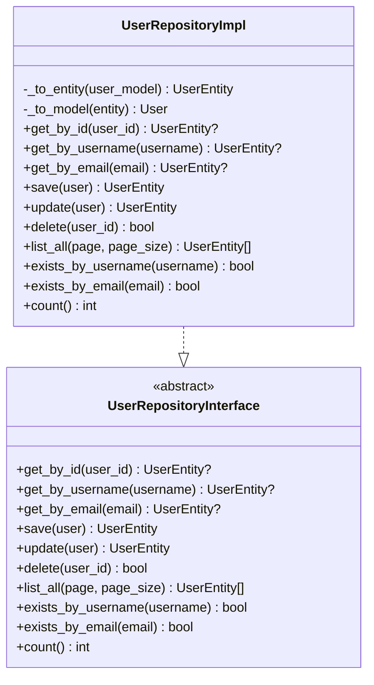
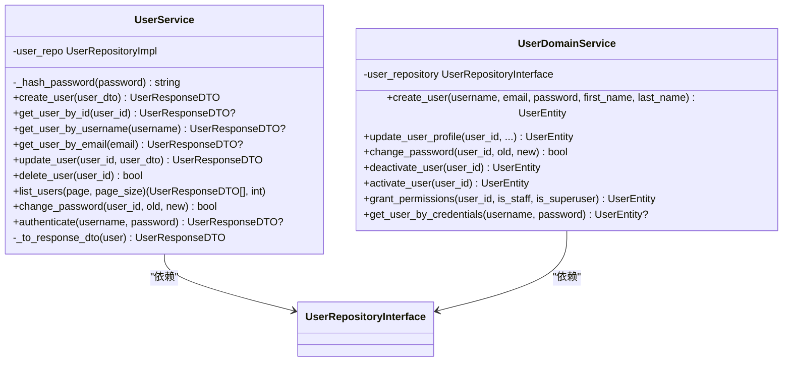
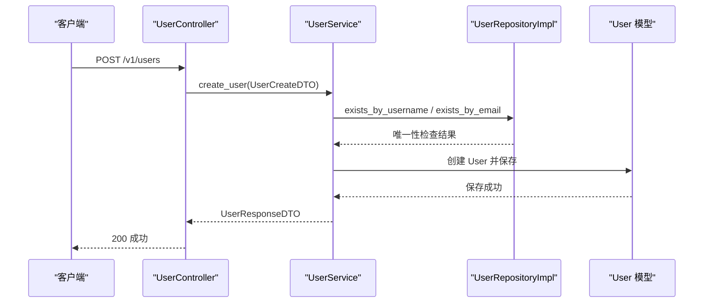
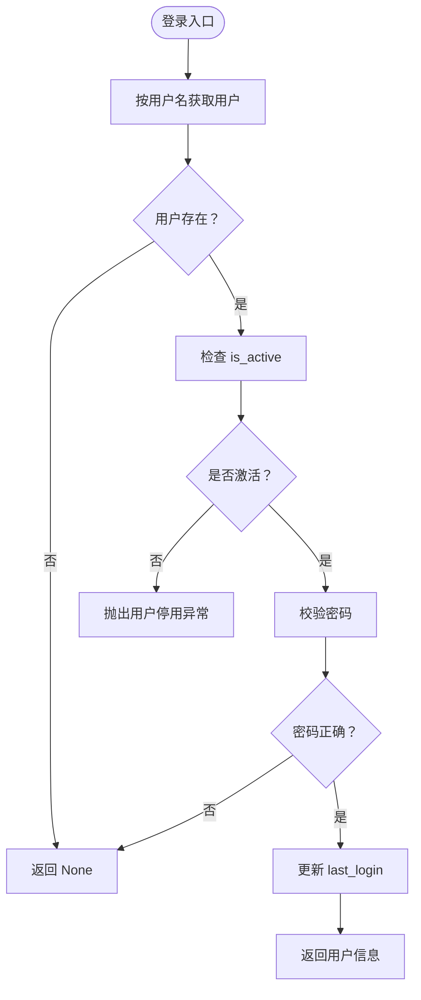
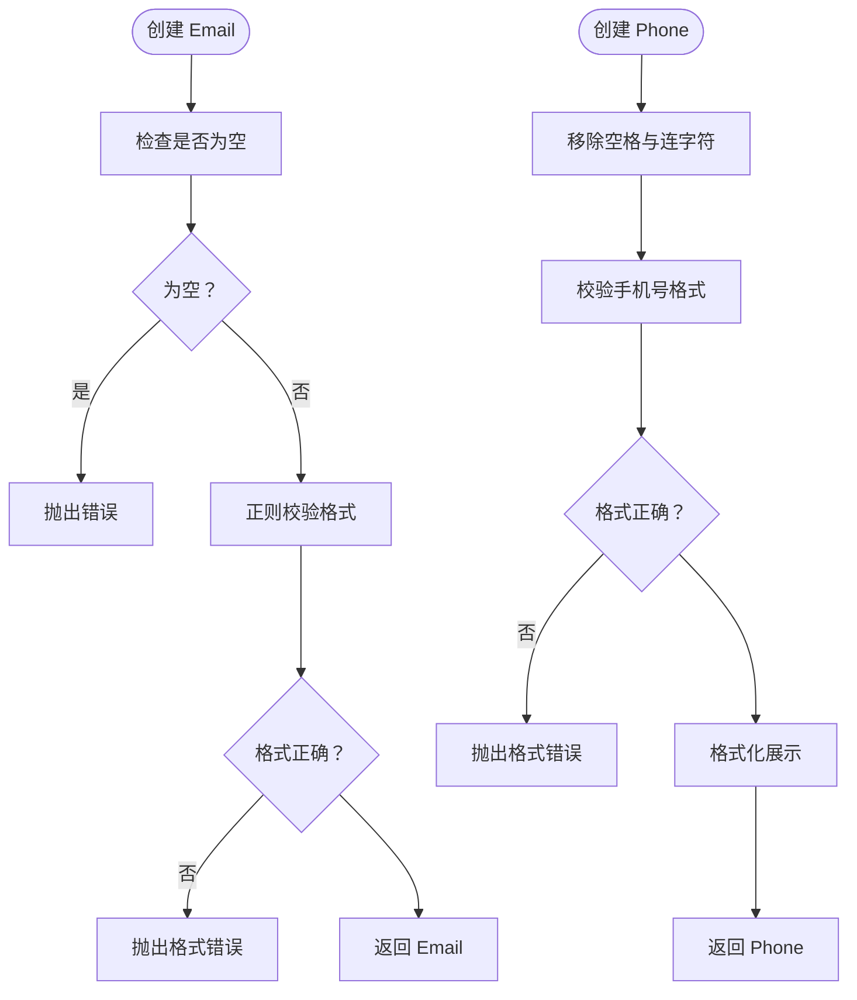
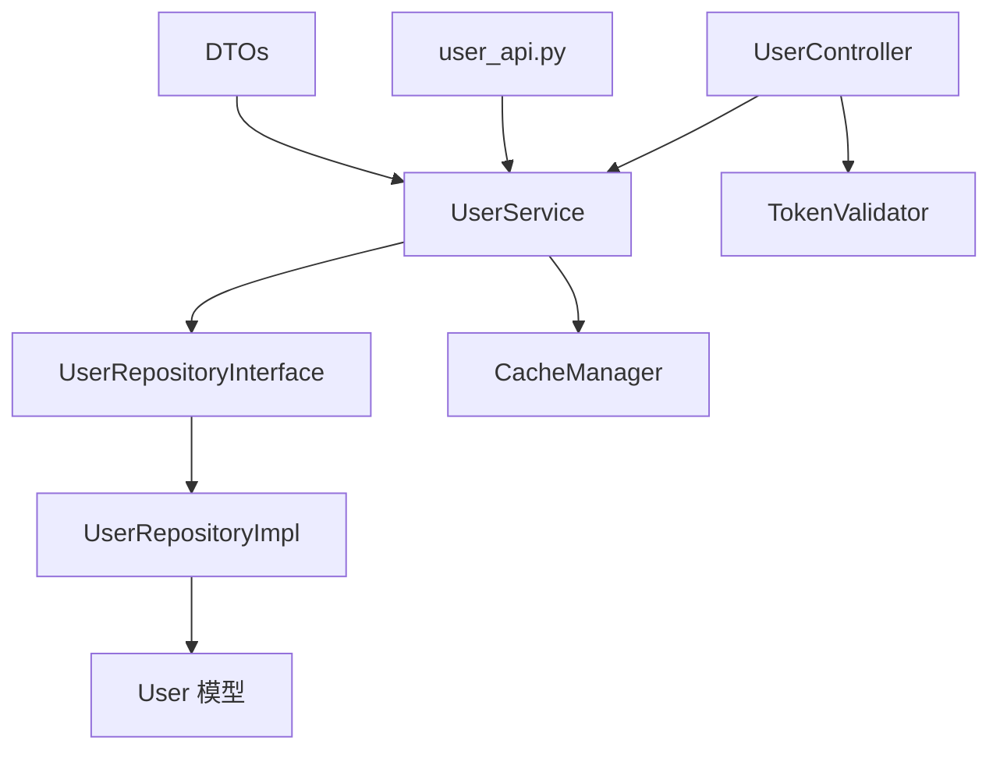

# 用户管理系统

<cite>
**本文档引用的文件**
- [src/domain/user/entities/user_entity.py](file://src/domain/user/entities/user_entity.py)
- [src/domain/user/entities/profile_entity.py](file://src/domain/user/entities/profile_entity.py)
- [src/domain/user/value_objects/email.py](file://src/domain/user/value_objects/email.py)
- [src/domain/user/value_objects/phone.py](file://src/domain/user/value_objects/phone.py)
- [src/application/services/user_service.py](file://src/application/services/user_service.py)
- [src/domain/user/repositories/user_repository.py](file://src/domain/user/repositories/user_repository.py)
- [src/infrastructure/repositories/user_repo_impl.py](file://src/infrastructure/repositories/user_repo_impl.py)
- [src/api/v1/controllers/user_controller.py](file://src/api/v1/controllers/user_controller.py)
- [src/api/v1/user_api.py](file://src/api/v1/user_api.py)
- [src/application/dto/user/user_create_dto.py](file://src/application/dto/user/user_create_dto.py)
- [src/application/dto/user/user_update_dto.py](file://src/application/dto/user/user_update_dto.py)
- [src/application/dto/user/user_response_dto.py](file://src/application/dto/user/user_response_dto.py)
- [src/application/dto/user/change_password_dto.py](file://src/application/dto/user/change_password_dto.py)
- [src/infrastructure/persistence/models/user_models.py](file://src/infrastructure/persistence/models/user_models.py)
- [src/domain/user/services/user_domain_service.py](file://src/domain/user/services/user_domain_service.py)
</cite>

## 目录
1. [引言](#引言)
2. [项目结构](#项目结构)
3. [核心组件](#核心组件)
4. [架构总览](#架构总览)
5. [详细组件分析](#详细组件分析)
6. [依赖分析](#依赖分析)
7. [性能考虑](#性能考虑)
8. [故障排查指南](#故障排查指南)
9. [结论](#结论)
10. [附录](#附录)

## 引言
本文件为用户管理系统的完整技术文档，覆盖用户实体设计、值对象设计、仓储模式实现、应用服务与领域服务逻辑，以及 API 接口规范。文档重点解释用户注册、登录、信息管理、密码修改等核心功能的实现机制，并提供用户 CRUD 的请求参数、响应格式与错误处理说明。同时包含用户状态管理、邮箱与手机号验证机制、性能优化建议、安全考虑与扩展性设计。

## 项目结构
系统采用分层架构，遵循领域驱动设计（DDD）思想：
- 领域层：用户实体、值对象、仓储接口与领域服务
- 应用层：应用服务封装业务流程
- 基础设施层：ORM 模型、仓储实现、缓存与 JWT 验证
- API 层：Ninja 控制器与路由，负责请求解析与响应

图表来源
- [src/api/v1/controllers/user_controller.py:33-283](file://src/api/v1/controllers/user_controller.py#L33-L283)
- [src/api/v1/user_api.py:1-150](file://src/api/v1/user_api.py#L1-L150)
- [src/application/services/user_service.py:16-193](file://src/application/services/user_service.py#L16-L193)
- [src/domain/user/entities/user_entity.py:11-120](file://src/domain/user/entities/user_entity.py#L11-L120)
- [src/domain/user/entities/profile_entity.py:10-76](file://src/domain/user/entities/profile_entity.py#L10-L76)
- [src/domain/user/value_objects/email.py:10-40](file://src/domain/user/value_objects/email.py#L10-L40)
- [src/domain/user/value_objects/phone.py:10-50](file://src/domain/user/value_objects/phone.py#L10-L50)
- [src/domain/user/repositories/user_repository.py:11-68](file://src/domain/user/repositories/user_repository.py#L11-L68)
- [src/domain/user/services/user_domain_service.py:10-117](file://src/domain/user/services/user_domain_service.py#L10-L117)
- [src/infrastructure/repositories/user_repo_impl.py:13-140](file://src/infrastructure/repositories/user_repo_impl.py#L13-L140)
- [src/infrastructure/persistence/models/user_models.py:12-147](file://src/infrastructure/persistence/models/user_models.py#L12-L147)

章节来源
- [src/api/v1/controllers/user_controller.py:33-283](file://src/api/v1/controllers/user_controller.py#L33-L283)
- [src/api/v1/user_api.py:1-150](file://src/api/v1/user_api.py#L1-L150)
- [src/application/services/user_service.py:16-193](file://src/application/services/user_service.py#L16-L193)
- [src/domain/user/entities/user_entity.py:11-120](file://src/domain/user/entities/user_entity.py#L11-L120)
- [src/domain/user/entities/profile_entity.py:10-76](file://src/domain/user/entities/profile_entity.py#L10-L76)
- [src/domain/user/value_objects/email.py:10-40](file://src/domain/user/value_objects/email.py#L10-L40)
- [src/domain/user/value_objects/phone.py:10-50](file://src/domain/user/value_objects/phone.py#L10-L50)
- [src/domain/user/repositories/user_repository.py:11-68](file://src/domain/user/repositories/user_repository.py#L11-L68)
- [src/domain/user/services/user_domain_service.py:10-117](file://src/domain/user/services/user_domain_service.py#L10-L117)
- [src/infrastructure/repositories/user_repo_impl.py:13-140](file://src/infrastructure/repositories/user_repo_impl.py#L13-L140)
- [src/infrastructure/persistence/models/user_models.py:12-147](file://src/infrastructure/persistence/models/user_models.py#L12-L147)

## 核心组件
- 用户实体：包含用户标识、认证凭据、基本信息、状态标志与时间戳；提供业务方法如激活/停用、权限授予/撤销、最后登录时间更新、信息更新等。
- 值对象：邮箱值对象（不可变、格式校验、标准化）、电话值对象（格式校验、国家区号、格式化展示）。
- 仓储接口与实现：定义数据访问契约并提供异步 ORM 实现，完成实体与模型之间的转换。
- 应用服务：封装用户注册、登录、更新、删除、列表、密码修改等业务流程，集成缓存与 DTO 转换。
- 领域服务：处理跨实体的业务规则（如用户状态变更、权限授予、凭据认证）。
- API 控制器与路由：暴露 REST 接口，进行参数校验、鉴权与响应封装。

章节来源
- [src/domain/user/entities/user_entity.py:11-120](file://src/domain/user/entities/user_entity.py#L11-L120)
- [src/domain/user/value_objects/email.py:10-40](file://src/domain/user/value_objects/email.py#L10-L40)
- [src/domain/user/value_objects/phone.py:10-50](file://src/domain/user/value_objects/phone.py#L10-L50)
- [src/domain/user/repositories/user_repository.py:11-68](file://src/domain/user/repositories/user_repository.py#L11-L68)
- [src/infrastructure/repositories/user_repo_impl.py:13-140](file://src/infrastructure/repositories/user_repo_impl.py#L13-L140)
- [src/application/services/user_service.py:16-193](file://src/application/services/user_service.py#L16-L193)
- [src/domain/user/services/user_domain_service.py:10-117](file://src/domain/user/services/user_domain_service.py#L10-L117)
- [src/api/v1/controllers/user_controller.py:33-283](file://src/api/v1/controllers/user_controller.py#L33-L283)
- [src/api/v1/user_api.py:1-150](file://src/api/v1/user_api.py#L1-L150)

## 架构总览
系统采用分层与依赖倒置原则：
- API 层仅依赖应用服务接口，不直接依赖基础设施
- 应用服务依赖仓储接口，具体实现由基础设施提供
- 领域层保持纯业务逻辑，避免受框架影响
- DTO 作为跨层数据载体，确保接口稳定与清晰

图表来源
- [src/api/v1/controllers/user_controller.py:33-283](file://src/api/v1/controllers/user_controller.py#L33-L283)
- [src/api/v1/user_api.py:1-150](file://src/api/v1/user_api.py#L1-L150)
- [src/application/services/user_service.py:16-193](file://src/application/services/user_service.py#L16-L193)
- [src/domain/user/services/user_domain_service.py:10-117](file://src/domain/user/services/user_domain_service.py#L10-L117)
- [src/domain/user/repositories/user_repository.py:11-68](file://src/domain/user/repositories/user_repository.py#L11-L68)
- [src/infrastructure/repositories/user_repo_impl.py:13-140](file://src/infrastructure/repositories/user_repo_impl.py#L13-L140)
- [src/infrastructure/persistence/models/user_models.py:12-147](file://src/infrastructure/persistence/models/user_models.py#L12-L147)

## 详细组件分析

### 用户实体与值对象
- 用户实体：包含用户标识、用户名、邮箱、密码、姓名、状态、时间戳、头像、手机、简介等字段；提供业务方法如激活/停用、权限授予/撤销、最后登录时间更新、信息更新与字典序列化。
- 邮箱值对象：不可变对象，负责邮箱格式校验、标准化（小写）与域名提取。
- 电话值对象：不可变对象，支持默认中国区号，移除空格与连字符后校验手机号格式，提供国家号码与格式化展示。

图表来源
- [src/domain/user/entities/user_entity.py:11-120](file://src/domain/user/entities/user_entity.py#L11-L120)
- [src/domain/user/value_objects/email.py:10-40](file://src/domain/user/value_objects/email.py#L10-L40)
- [src/domain/user/value_objects/phone.py:10-50](file://src/domain/user/value_objects/phone.py#L10-L50)

章节来源
- [src/domain/user/entities/user_entity.py:11-120](file://src/domain/user/entities/user_entity.py#L11-L120)
- [src/domain/user/value_objects/email.py:10-40](file://src/domain/user/value_objects/email.py#L10-L40)
- [src/domain/user/value_objects/phone.py:10-50](file://src/domain/user/value_objects/phone.py#L10-L50)

### 仓储接口与实现
- 仓储接口：定义用户实体的增删改查、存在性检查、计数与分页等抽象方法。
- 仓储实现：将实体与 Django ORM 模型相互转换，提供异步 ORM 查询与保存。

图表来源
- [src/domain/user/repositories/user_repository.py:11-68](file://src/domain/user/repositories/user_repository.py#L11-L68)
- [src/infrastructure/repositories/user_repo_impl.py:13-140](file://src/infrastructure/repositories/user_repo_impl.py#L13-L140)

章节来源
- [src/domain/user/repositories/user_repository.py:11-68](file://src/domain/user/repositories/user_repository.py#L11-L68)
- [src/infrastructure/repositories/user_repo_impl.py:13-140](file://src/infrastructure/repositories/user_repo_impl.py#L13-L140)

### 应用服务与领域服务
- 应用服务：封装用户注册（用户名/邮箱唯一性检查、密码哈希）、登录（状态校验、密码校验、最后登录时间更新）、更新、删除、列表、密码修改等流程；集成缓存读写与 DTO 转换。
- 领域服务：处理用户状态变更、权限授予、凭据认证等核心业务规则，保证业务一致性。

图表来源
- [src/application/services/user_service.py:16-193](file://src/application/services/user_service.py#L16-L193)
- [src/domain/user/services/user_domain_service.py:10-117](file://src/domain/user/services/user_domain_service.py#L10-L117)
- [src/domain/user/repositories/user_repository.py:11-68](file://src/domain/user/repositories/user_repository.py#L11-L68)

章节来源
- [src/application/services/user_service.py:16-193](file://src/application/services/user_service.py#L16-L193)
- [src/domain/user/services/user_domain_service.py:10-117](file://src/domain/user/services/user_domain_service.py#L10-L117)

### API 接口与请求/响应规范
- 控制器与路由：提供用户注册、详情、列表、更新、删除、密码修改、当前用户信息等接口；部分接口需要鉴权。
- DTO 规范：
  - 用户创建：用户名（3-50）、邮箱、密码（6-100）、可选名/姓/手机
  - 用户更新：可选名/姓/手机/头像/简介
  - 用户响应：用户ID、用户名、邮箱、名、姓、状态、头像、手机、简介、注册时间、最后登录
  - 修改密码：旧密码、新密码（6-100）

图表来源
- [src/api/v1/controllers/user_controller.py:53-76](file://src/api/v1/controllers/user_controller.py#L53-L76)
- [src/application/services/user_service.py:29-51](file://src/application/services/user_service.py#L29-L51)
- [src/infrastructure/repositories/user_repo_impl.py:125-131](file://src/infrastructure/repositories/user_repo_impl.py#L125-L131)
- [src/infrastructure/persistence/models/user_models.py:12-88](file://src/infrastructure/persistence/models/user_models.py#L12-L88)

章节来源
- [src/api/v1/controllers/user_controller.py:53-76](file://src/api/v1/controllers/user_controller.py#L53-L76)
- [src/api/v1/user_api.py:50-61](file://src/api/v1/user_api.py#L50-L61)
- [src/application/dto/user/user_create_dto.py:9-34](file://src/application/dto/user/user_create_dto.py#L9-L34)
- [src/application/dto/user/user_update_dto.py:9-32](file://src/application/dto/user/user_update_dto.py#L9-L32)
- [src/application/dto/user/user_response_dto.py:11-30](file://src/application/dto/user/user_response_dto.py#L11-L30)
- [src/application/dto/user/change_password_dto.py:9-23](file://src/application/dto/user/change_password_dto.py#L9-L23)

### 用户状态管理与权限控制
- 状态管理：用户实体提供激活/停用、员工权限与超级管理员权限的授予/撤销方法。
- 权限控制：控制器对“修改密码”和“获取当前用户信息”接口设置鉴权；应用服务在登录时检查用户状态。

图表来源
- [src/application/services/user_service.py:132-151](file://src/application/services/user_service.py#L132-L151)
- [src/domain/user/entities/user_entity.py:71-97](file://src/domain/user/entities/user_entity.py#L71-L97)

章节来源
- [src/domain/user/entities/user_entity.py:71-97](file://src/domain/user/entities/user_entity.py#L71-L97)
- [src/application/services/user_service.py:132-151](file://src/application/services/user_service.py#L132-L151)

### 邮箱与手机号验证机制
- 邮箱值对象：构造时执行非空与格式校验，提供标准化（小写）与域名提取。
- 电话值对象：构造时移除空格与连字符，校验中国手机号格式，提供国家号码与格式化展示。
- 用户实体：用户名与邮箱在初始化后进行基础校验。

图表来源
- [src/domain/user/value_objects/email.py:19-39](file://src/domain/user/value_objects/email.py#L19-L39)
- [src/domain/user/value_objects/phone.py:21-50](file://src/domain/user/value_objects/phone.py#L21-L50)
- [src/domain/user/entities/user_entity.py:33-49](file://src/domain/user/entities/user_entity.py#L33-L49)

章节来源
- [src/domain/user/value_objects/email.py:19-39](file://src/domain/user/value_objects/email.py#L19-L39)
- [src/domain/user/value_objects/phone.py:21-50](file://src/domain/user/value_objects/phone.py#L21-L50)
- [src/domain/user/entities/user_entity.py:33-49](file://src/domain/user/entities/user_entity.py#L33-L49)

### 用户 CRUD 示例与错误处理
- 创建用户
  - 请求：UserCreateDTO（用户名、邮箱、密码、可选名/姓/手机）
  - 响应：UserResponseDTO
  - 错误：用户名/邮箱已存在、参数校验失败
- 获取用户详情
  - 请求：路径参数 user_id
  - 响应：UserResponseDTO
  - 错误：用户不存在
- 获取用户列表
  - 请求：查询参数 page（≥1）、page_size（1-100）
  - 响应：包含 users、total、page、page_size 的列表响应
- 更新用户
  - 请求：路径参数 user_id + UserUpdateDTO（可选字段）
  - 响应：UserResponseDTO
  - 错误：用户不存在、参数校验失败
- 删除用户
  - 请求：路径参数 user_id
  - 响应：MessageResponse（删除成功）
  - 错误：用户不存在
- 修改密码
  - 请求：ChangePasswordDTO（旧密码、新密码）
  - 响应：MessageResponse（修改成功）
  - 错误：未登录/令牌无效、原密码不正确
- 获取当前用户信息
  - 请求：Authorization: Bearer <token>
  - 响应：UserResponseDTO
  - 错误：未登录/令牌无效、用户不存在

章节来源
- [src/api/v1/controllers/user_controller.py:53-283](file://src/api/v1/controllers/user_controller.py#L53-L283)
- [src/api/v1/user_api.py:50-150](file://src/api/v1/user_api.py#L50-L150)
- [src/application/dto/user/user_create_dto.py:9-34](file://src/application/dto/user/user_create_dto.py#L9-L34)
- [src/application/dto/user/user_update_dto.py:9-32](file://src/application/dto/user/user_update_dto.py#L9-L32)
- [src/application/dto/user/user_response_dto.py:11-30](file://src/application/dto/user/user_response_dto.py#L11-L30)
- [src/application/dto/user/change_password_dto.py:9-23](file://src/application/dto/user/change_password_dto.py#L9-L23)

## 依赖分析
- 组件耦合与内聚：API 层通过应用服务解耦，应用服务通过仓储接口解耦，领域服务保持高内聚的业务逻辑。
- 外部依赖：Django ORM、Pydantic DTO、Django 密码哈希与校验、Redis 缓存（通过缓存管理器）、JWT 验证。
- 循环依赖：DTO 通过 model_rebuild 解决循环引用问题。

图表来源
- [src/api/v1/controllers/user_controller.py:33-283](file://src/api/v1/controllers/user_controller.py#L33-L283)
- [src/api/v1/user_api.py:1-150](file://src/api/v1/user_api.py#L1-L150)
- [src/application/services/user_service.py:16-193](file://src/application/services/user_service.py#L16-L193)
- [src/infrastructure/repositories/user_repo_impl.py:13-140](file://src/infrastructure/repositories/user_repo_impl.py#L13-L140)
- [src/infrastructure/persistence/models/user_models.py:12-147](file://src/infrastructure/persistence/models/user_models.py#L12-L147)

章节来源
- [src/application/services/user_service.py:16-193](file://src/application/services/user_service.py#L16-L193)
- [src/infrastructure/repositories/user_repo_impl.py:13-140](file://src/infrastructure/repositories/user_repo_impl.py#L13-L140)

## 性能考虑
- 缓存策略：应用服务在获取用户详情时优先从缓存读取，写入时清理相关缓存键，降低数据库压力。
- 分页与索引：用户列表分页查询，模型建立 username、email、phone 索引以提升查询性能。
- 异步 ORM：仓储实现使用 Django 的异步 ORM 方法，提高并发场景下的吞吐量。
- DTO 序列化：统一使用 Pydantic DTO 进行序列化，减少重复逻辑与错误。

## 故障排查指南
- 用户不存在：在获取、更新、删除、修改密码等操作中，若用户不存在会抛出相应错误；请确认 user_id 或用户名是否正确。
- 未登录/令牌无效：修改密码与获取当前用户信息需携带有效 Bearer 令牌；请检查 Authorization 头格式与令牌有效性。
- 用户被停用：登录时若用户 is_active 为假，会抛出用户停用异常；请先激活用户。
- 参数校验失败：创建/更新/修改密码时，若字段不符合 DTO 规范（长度、格式），会抛出校验错误；请参考 DTO 字段约束。

章节来源
- [src/api/v1/controllers/user_controller.py:98-101](file://src/api/v1/controllers/user_controller.py#L98-L101)
- [src/api/v1/controllers/user_controller.py:185-188](file://src/api/v1/controllers/user_controller.py#L185-L188)
- [src/api/v1/controllers/user_controller.py:217-225](file://src/api/v1/controllers/user_controller.py#L217-L225)
- [src/api/v1/controllers/user_controller.py:252-260](file://src/api/v1/controllers/user_controller.py#L252-L260)
- [src/application/services/user_service.py:138-143](file://src/application/services/user_service.py#L138-L143)

## 结论
本系统通过 DDD 分层与仓储模式实现了清晰的职责分离与良好的扩展性。用户实体与值对象确保了数据与业务规则的一致性；应用服务与领域服务分别承担流程编排与核心业务规则；API 层提供稳定的接口契约。结合缓存、索引与异步 ORM，系统具备较好的性能表现。后续可在邮箱/手机验证流程中引入更完善的校验与重试机制，并扩展用户档案与设备管理能力。

## 附录
- 数据模型概览（简化）
  - 用户表：主键、用户名、邮箱、密码、头像、手机、部门关联、创建/修改者、时间戳等
  - 用户档案表：UUID 主键、一对一关联用户、扩展信息、时间戳
  - 用户设备表：UUID 主键、多对一关联用户、设备信息、IP 地址、最后登录时间

章节来源
- [src/infrastructure/persistence/models/user_models.py:12-147](file://src/infrastructure/persistence/models/user_models.py#L12-L147)