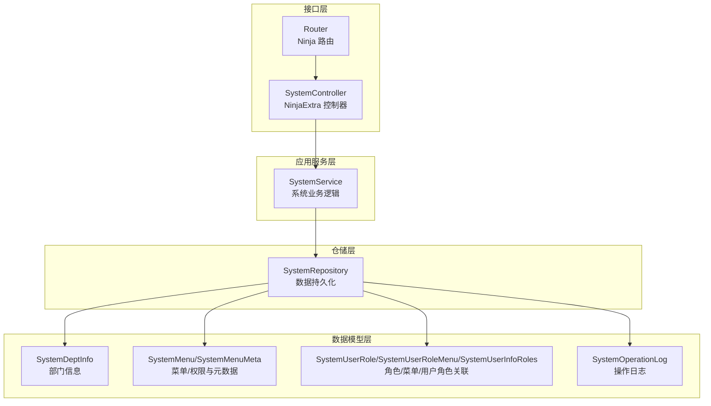
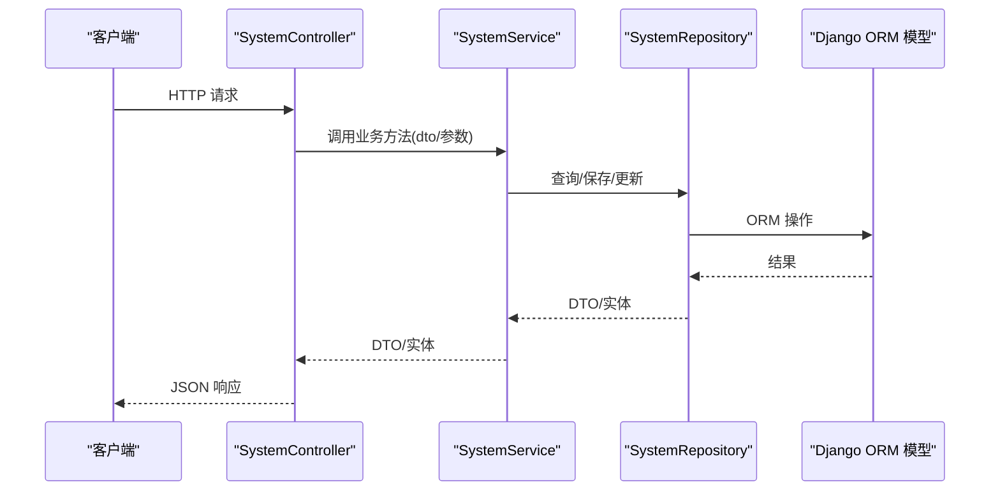
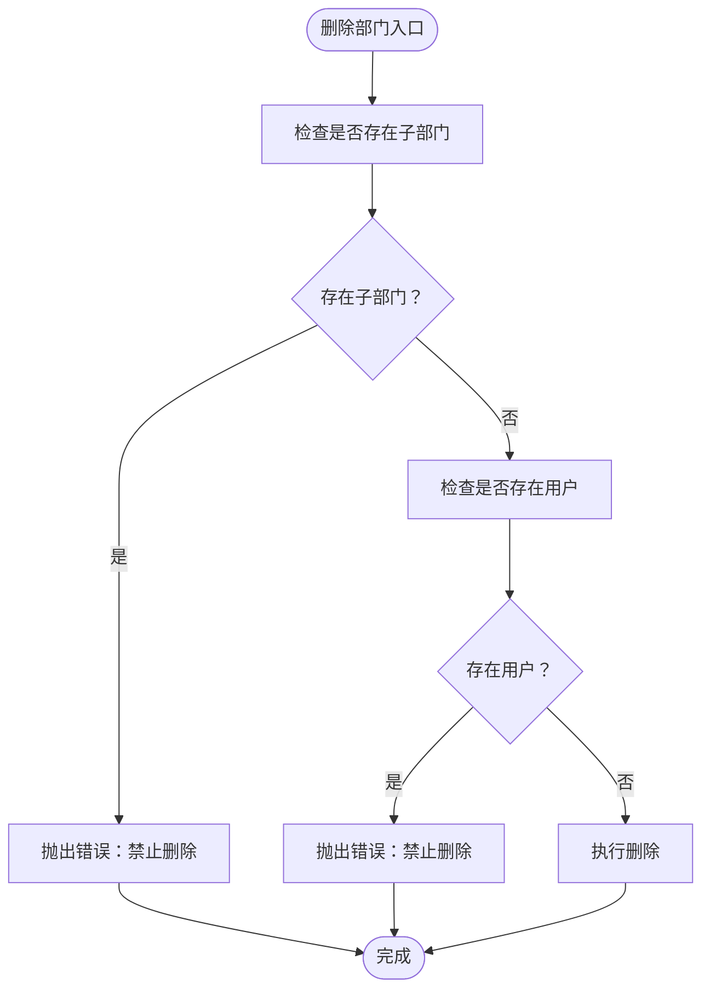
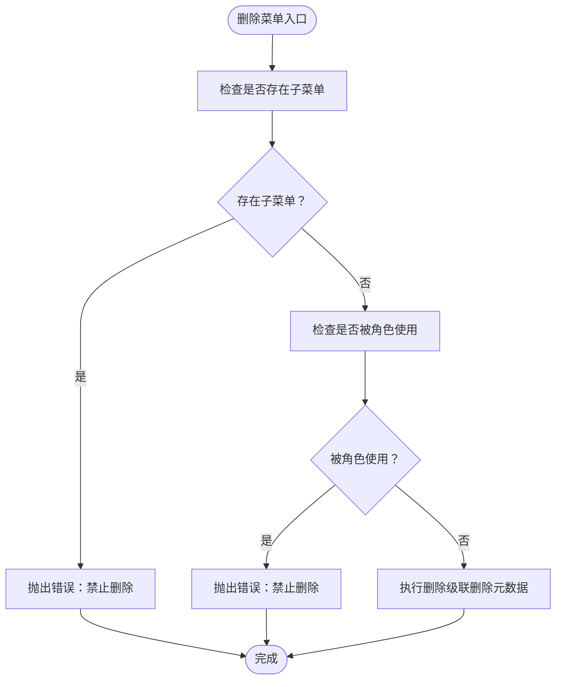
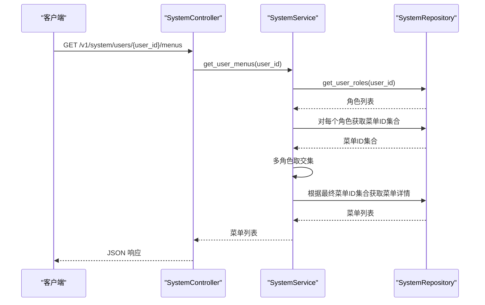
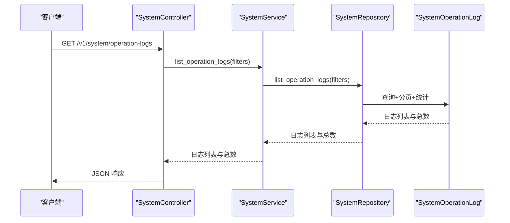
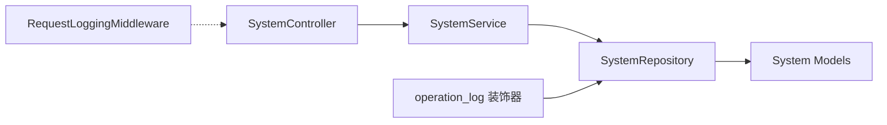

# 系统管理模块

<cite>
**本文档引用的文件**
- [src/api/v1/controllers/system_controller.py](file://src/api/v1/controllers/system_controller.py)
- [src/api/v1/system_api.py](file://src/api/v1/system_api.py)
- [src/application/services/system_service.py](file://src/application/services/system_service.py)
- [src/infrastructure/repositories/system_repo_impl.py](file://src/infrastructure/repositories/system_repo_impl.py)
- [src/application/dto/system/dept_dto.py](file://src/application/dto/system/dept_dto.py)
- [src/application/dto/system/menu_dto.py](file://src/application/dto/system/menu_dto.py)
- [src/application/dto/system/log_dto.py](file://src/application/dto/system/log_dto.py)
- [src/infrastructure/persistence/models/system_models.py](file://src/infrastructure/persistence/models/system_models.py)
- [src/core/decorators/operation_log.py](file://src/core/decorators/operation_log.py)
- [src/core/middlewares/request_logging_middleware.py](file://src/core/middlewares/request_logging_middleware.py)
- [src/api/app.py](file://src/api/app.py)
</cite>

## 目录
1. [简介](#简介)
2. [项目结构](#项目结构)
3. [核心组件](#核心组件)
4. [架构总览](#架构总览)
5. [详细组件分析](#详细组件分析)
6. [依赖关系分析](#依赖关系分析)
7. [性能考虑](#性能考虑)
8. [故障排查指南](#故障排查指南)
9. [结论](#结论)
10. [附录](#附录)

## 简介
本文件为系统管理模块的深度技术文档，聚焦于部门管理、菜单管理与日志管理的实现机制，阐述系统服务设计架构（组织结构管理、菜单权限控制与操作日志记录），并提供完整的系统管理 API 接口规范、实体设计、仓储实现与最佳实践。同时覆盖系统配置管理、数据同步机制、性能优化策略、监控指标、日志分析与故障诊断方法。

## 项目结构
系统管理模块采用分层架构，遵循清晰的职责分离：
- 控制器层：负责 HTTP 请求接收与响应封装，统一暴露 RESTful 接口
- 应用服务层：封装业务规则与流程编排，协调仓储与领域服务
- 仓储层：负责数据持久化与查询，屏蔽 ORM 细节
- DTO 层：定义输入输出的数据结构与校验规则
- 模型层：Django ORM 模型，承载数据库表结构与索引
- 中间件与装饰器：提供横切关注点（日志、安全、限流等）



图表来源
- [src/api/v1/controllers/system_controller.py:60-734](file://src/api/v1/controllers/system_controller.py#L60-L734)
- [src/api/v1/system_api.py:27-409](file://src/api/v1/system_api.py#L27-L409)
- [src/application/services/system_service.py:25-435](file://src/application/services/system_service.py#L25-L435)
- [src/infrastructure/repositories/system_repo_impl.py:22-505](file://src/infrastructure/repositories/system_repo_impl.py#L22-L505)
- [src/infrastructure/persistence/models/system_models.py:12-395](file://src/infrastructure/persistence/models/system_models.py#L12-L395)

章节来源
- [src/api/app.py:17-30](file://src/api/app.py#L17-L30)
- [src/api/v1/controllers/system_controller.py:60-734](file://src/api/v1/controllers/system_controller.py#L60-L734)
- [src/api/v1/system_api.py:27-409](file://src/api/v1/system_api.py#L27-L409)

## 核心组件
- 系统控制器：提供部门、菜单、角色与操作日志的完整 CRUD 与权限查询接口，并统一返回格式
- 系统服务：封装业务规则（如唯一性校验、父子约束、权限交集计算）、调用仓储执行数据操作
- 系统仓储：实现具体的数据访问逻辑，包括树形结构构建、批量关联写入、分页查询与过滤
- DTO 与模型：明确输入输出结构、字段约束与数据库索引设计
- 操作日志装饰器：自动采集请求上下文并异步写入操作日志，不影响主流程
- 请求日志中间件：记录请求生命周期与耗时，便于性能分析与问题定位

章节来源
- [src/application/services/system_service.py:25-435](file://src/application/services/system_service.py#L25-L435)
- [src/infrastructure/repositories/system_repo_impl.py:22-505](file://src/infrastructure/repositories/system_repo_impl.py#L22-L505)
- [src/application/dto/system/dept_dto.py:11-94](file://src/application/dto/system/dept_dto.py#L11-L94)
- [src/application/dto/system/menu_dto.py:62-158](file://src/application/dto/system/menu_dto.py#L62-L158)
- [src/application/dto/system/log_dto.py:11-57](file://src/application/dto/system/log_dto.py#L11-L57)
- [src/infrastructure/persistence/models/system_models.py:12-395](file://src/infrastructure/persistence/models/system_models.py#L12-L395)
- [src/core/decorators/operation_log.py:15-175](file://src/core/decorators/operation_log.py#L15-L175)
- [src/core/middlewares/request_logging_middleware.py:14-86](file://src/core/middlewares/request_logging_middleware.py#L14-L86)

## 架构总览
系统管理模块遵循“控制器-应用服务-仓储-模型”的分层设计，配合装饰器与中间件实现横切能力。整体流程如下：



图表来源
- [src/api/v1/controllers/system_controller.py:113-130](file://src/api/v1/controllers/system_controller.py#L113-L130)
- [src/application/services/system_service.py:36-47](file://src/application/services/system_service.py#L36-L47)
- [src/infrastructure/repositories/system_repo_impl.py:27-43](file://src/infrastructure/repositories/system_repo_impl.py#L27-L43)
- [src/infrastructure/persistence/models/system_models.py:12-76](file://src/infrastructure/persistence/models/system_models.py#L12-L76)

## 详细组件分析

### 部门管理
- 功能范围：创建、查询、更新、删除、列表与树形结构
- 业务规则：
  - 编码唯一性校验
  - 删除前检查是否存在子部门或用户
  - 树形结构通过递归构建
- 关键接口：
  - POST /v1/system/depts
  - GET /v1/system/depts/{dept_id}
  - PUT /v1/system/depts/{dept_id}
  - DELETE /v1/system/depts/{dept_id}
  - GET /v1/system/depts
  - GET /v1/system/depts/tree



图表来源
- [src/application/services/system_service.py:72-86](file://src/application/services/system_service.py#L72-L86)
- [src/infrastructure/repositories/system_repo_impl.py:100-107](file://src/infrastructure/repositories/system_repo_impl.py#L100-L107)

章节来源
- [src/api/v1/controllers/system_controller.py:107-252](file://src/api/v1/controllers/system_controller.py#L107-L252)
- [src/application/services/system_service.py:36-143](file://src/application/services/system_service.py#L36-L143)
- [src/infrastructure/repositories/system_repo_impl.py:27-125](file://src/infrastructure/repositories/system_repo_impl.py#L27-L125)
- [src/application/dto/system/dept_dto.py:11-94](file://src/application/dto/system/dept_dto.py#L11-L94)
- [src/infrastructure/persistence/models/system_models.py:12-83](file://src/infrastructure/persistence/models/system_models.py#L12-L83)

### 菜单管理
- 功能范围：创建、查询、更新、删除、列表与树形结构
- 业务规则：
  - 名称唯一性校验
  - 删除前检查是否存在子菜单或被角色使用
  - 菜单类型：目录、菜单、按钮
  - 菜单即权限，权限通过菜单体现
- 关键接口：
  - POST /v1/system/menus
  - GET /v1/system/menus/{menu_id}
  - PUT /v1/system/menus/{menu_id}
  - DELETE /v1/system/menus/{menu_id}
  - GET /v1/system/menus
  - GET /v1/system/menus/tree



图表来源
- [src/application/services/system_service.py:183-197](file://src/application/services/system_service.py#L183-L197)
- [src/infrastructure/repositories/system_repo_impl.py:226-235](file://src/infrastructure/repositories/system_repo_impl.py#L226-L235)

章节来源
- [src/api/v1/controllers/system_controller.py:256-402](file://src/api/v1/controllers/system_controller.py#L256-L402)
- [src/application/services/system_service.py:147-268](file://src/application/services/system_service.py#L147-L268)
- [src/infrastructure/repositories/system_repo_impl.py:129-255](file://src/infrastructure/repositories/system_repo_impl.py#L129-L255)
- [src/application/dto/system/menu_dto.py:62-158](file://src/application/dto/system/menu_dto.py#L62-L158)
- [src/infrastructure/persistence/models/system_models.py:141-216](file://src/infrastructure/persistence/models/system_models.py#L141-L216)

### 角色管理与权限分配
- 功能范围：角色 CRUD、角色菜单分配、用户角色分配、用户菜单权限查询（多角色取交集）
- 业务规则：
  - 角色编码唯一性校验
  - 删除前检查是否被用户使用
  - 用户菜单权限为各角色权限集合的交集
- 关键接口：
  - POST /v1/system/roles
  - GET /v1/system/roles/{role_id}
  - PUT /v1/system/roles/{role_id}
  - DELETE /v1/system/roles/{role_id}
  - GET /v1/system/roles
  - POST /v1/system/roles/{role_id}/menus
  - GET /v1/system/roles/{role_id}/menus
  - POST /v1/system/users/{user_id}/roles
  - GET /v1/system/users/{user_id}/roles
  - GET /v1/system/users/{user_id}/menus



图表来源
- [src/api/v1/controllers/system_controller.py:639-659](file://src/api/v1/controllers/system_controller.py#L639-L659)
- [src/application/services/system_service.py:397-400](file://src/application/services/system_service.py#L397-L400)
- [src/infrastructure/repositories/system_repo_impl.py:396-428](file://src/infrastructure/repositories/system_repo_impl.py#L396-L428)

章节来源
- [src/api/v1/controllers/system_controller.py:406-659](file://src/api/v1/controllers/system_controller.py#L406-L659)
- [src/application/services/system_service.py:272-400](file://src/application/services/system_service.py#L272-L400)
- [src/infrastructure/repositories/system_repo_impl.py:265-428](file://src/infrastructure/repositories/system_repo_impl.py#L265-L428)
- [src/infrastructure/persistence/models/system_models.py:273-394](file://src/infrastructure/persistence/models/system_models.py#L273-L394)

### 操作日志管理
- 功能范围：日志列表查询（支持模块、方法、操作人、时间范围、响应码过滤与分页）、日志详情查看
- 业务规则：
  - 异步记录，不影响主流程
  - 自动解析浏览器与操作系统
  - 限制请求体长度
- 关键接口：
  - GET /v1/system/operation-logs
  - GET /v1/system/operation-logs/{log_id}



图表来源
- [src/api/v1/controllers/system_controller.py:669-707](file://src/api/v1/controllers/system_controller.py#L669-L707)
- [src/application/services/system_service.py:404-407](file://src/application/services/system_service.py#L404-L407)
- [src/infrastructure/repositories/system_repo_impl.py:465-497](file://src/infrastructure/repositories/system_repo_impl.py#L465-L497)

章节来源
- [src/api/v1/controllers/system_controller.py:661-734](file://src/api/v1/controllers/system_controller.py#L661-L734)
- [src/application/services/system_service.py:404-434](file://src/application/services/system_service.py#L404-L434)
- [src/infrastructure/repositories/system_repo_impl.py:432-505](file://src/infrastructure/repositories/system_repo_impl.py#L432-L505)
- [src/application/dto/system/log_dto.py:11-57](file://src/application/dto/system/log_dto.py#L11-L57)
- [src/core/decorators/operation_log.py:15-175](file://src/core/decorators/operation_log.py#L15-L175)

### 系统实体设计与仓储实现
- 实体关系图（部门、菜单、角色、日志、用户角色关联）

```mermaid
erDiagram
SYSTEM_DEPTINFO {
char id PK
char name
char code UK
int rank
boolean is_active
char parent_id FK
char dept_belong_id FK
}
SYSTEM_MENU {
char id PK
char name UK
smallint menu_type
char path
char component
boolean is_active
char meta_id FK
char parent_id FK
}
SYSTEM_MENUMETA {
char id PK
char title
char icon
boolean is_show_menu
boolean is_keepalive
}
SYSTEM_USERROLE {
char id PK
char name UK
char code UK
boolean is_active
}
SYSTEM_USERROLEMENU {
bigint id PK
char userrole_id FK
char menu_id FK
}
SYSTEM_USERINFO_ROLES {
bigint id PK
int userinfo_id FK
char userrole_id FK
}
SYSTEM_OPERATIONLOG {
bigint id PK
char module
char path
char method
text body
char ipaddress
char browser
char system
int response_code
int status_code
int creator_id FK
}
USER {
int id PK
char username
}
SYSTEM_DEPTINFO }o--|| SYSTEM_DEPTINFO : "parent/children"
SYSTEM_DEPTINFO }o--|| SYSTEM_DEPTINFO : "dept_belong/belong_depts"
SYSTEM_MENU }o--|| SYSTEM_MENUMETA : "meta"
SYSTEM_MENU }o--|| SYSTEM_MENU : "parent/children"
SYSTEM_USERROLE }o|--o{ SYSTEM_USERROLEMENU : "has"
SYSTEM_MENU }o|--o{ SYSTEM_USERROLEMENU : "has"
SYSTEM_USERINFO_ROLES }o--|| USER : "userinfo"
SYSTEM_USERINFO_ROLES }o--|| SYSTEM_USERROLE : "userrole"
SYSTEM_OPERATIONLOG }o--|| USER : "creator"
```

图表来源
- [src/infrastructure/persistence/models/system_models.py:12-394](file://src/infrastructure/persistence/models/system_models.py#L12-L394)

章节来源
- [src/infrastructure/repositories/system_repo_impl.py:22-505](file://src/infrastructure/repositories/system_repo_impl.py#L22-L505)
- [src/infrastructure/persistence/models/system_models.py:12-394](file://src/infrastructure/persistence/models/system_models.py#L12-L394)

## 依赖关系分析
- 控制器依赖应用服务；应用服务依赖仓储；仓储依赖模型
- 操作日志装饰器独立于控制器，通过仓储异步写入日志
- 请求日志中间件提供全局请求追踪



图表来源
- [src/api/v1/controllers/system_controller.py:71-78](file://src/api/v1/controllers/system_controller.py#L71-L78)
- [src/application/services/system_service.py:31-32](file://src/application/services/system_service.py#L31-L32)
- [src/infrastructure/repositories/system_repo_impl.py](file://src/infrastructure/repositories/system_repo_impl.py#L12)
- [src/core/decorators/operation_log.py](file://src/core/decorators/operation_log.py#L12)
- [src/core/middlewares/request_logging_middleware.py](file://src/core/middlewares/request_logging_middleware.py#L14)

章节来源
- [src/api/v1/controllers/system_controller.py:60-78](file://src/api/v1/controllers/system_controller.py#L60-L78)
- [src/application/services/system_service.py:25-32](file://src/application/services/system_service.py#L25-L32)
- [src/infrastructure/repositories/system_repo_impl.py:22-23](file://src/infrastructure/repositories/system_repo_impl.py#L22-L23)
- [src/core/decorators/operation_log.py:15-72](file://src/core/decorators/operation_log.py#L15-L72)
- [src/core/middlewares/request_logging_middleware.py:14-68](file://src/core/middlewares/request_logging_middleware.py#L14-L68)

## 性能考虑
- 查询优化
  - 为高频查询字段建立索引（部门编码、菜单名称、角色编码、日志创建时间等）
  - 使用 select_related 预加载关联（菜单元数据、父级菜单、用户）
- 分页与过滤
  - 日志查询支持多条件过滤与分页，避免一次性加载大量数据
- 异步写入
  - 操作日志异步记录，降低对主流程影响
- 缓存策略
  - 用户权限与角色缓存（参考 RBAC 模块），可借鉴到菜单权限交集计算场景
- 批量操作
  - 角色与菜单关联采用批量插入，减少数据库往返

章节来源
- [src/infrastructure/persistence/models/system_models.py:70-73](file://src/infrastructure/persistence/models/system_models.py#L70-L73)
- [src/infrastructure/persistence/models/system_models.py:204-207](file://src/infrastructure/persistence/models/system_models.py#L204-L207)
- [src/infrastructure/persistence/models/system_models.py:263-267](file://src/infrastructure/persistence/models/system_models.py#L263-L267)
- [src/infrastructure/repositories/system_repo_impl.py:343-356](file://src/infrastructure/repositories/system_repo_impl.py#L343-L356)
- [src/core/decorators/operation_log.py:54-62](file://src/core/decorators/operation_log.py#L54-L62)

## 故障排查指南
- 常见错误与定位
  - 删除受限：部门/菜单/角色删除前需满足无子项/无用户/未被角色使用等约束
  - 资源不存在：查询接口返回空或抛错，检查 ID 或名称是否正确
  - 参数校验失败：DTO 字段长度、枚举值、数值范围不合法
- 日志与监控
  - 启用请求日志中间件，观察请求耗时与状态码分布
  - 使用操作日志接口检索异常时间段内的操作记录
  - 结合数据库慢查询日志与索引缺失告警进行优化
- 快速验证
  - 健康检查：GET /health 或 /v1/system/health
  - 列表接口：先用 GET /.../depts?is_active=true 验证数据与过滤
  - 树形接口：GET /.../depts/tree 与 /.../menus/tree 验证父子关系

章节来源
- [src/api/v1/controllers/system_controller.py:82-103](file://src/api/v1/controllers/system_controller.py#L82-L103)
- [src/core/middlewares/request_logging_middleware.py:14-68](file://src/core/middlewares/request_logging_middleware.py#L14-L68)
- [src/api/v1/controllers/system_controller.py:361-402](file://src/api/v1/controllers/system_controller.py#L361-L402)
- [src/infrastructure/repositories/system_repo_impl.py:100-107](file://src/infrastructure/repositories/system_repo_impl.py#L100-L107)

## 结论
系统管理模块通过清晰的分层设计与完善的业务规则，实现了组织结构、菜单权限与操作日志的全链路管理。依托装饰器与中间件，系统具备良好的可观测性与可维护性。建议在生产环境中结合索引优化、分页过滤与异步日志策略，持续监控关键指标并定期审计权限配置。

## 附录

### 系统管理 API 接口规范（摘要）
- 部门管理
  - POST /v1/system/depts
  - GET /v1/system/depts/{dept_id}
  - PUT /v1/system/depts/{dept_id}
  - DELETE /v1/system/depts/{dept_id}
  - GET /v1/system/depts
  - GET /v1/system/depts/tree
- 菜单管理
  - POST /v1/system/menus
  - GET /v1/system/menus/{menu_id}
  - PUT /v1/system/menus/{menu_id}
  - DELETE /v1/system/menus/{menu_id}
  - GET /v1/system/menus
  - GET /v1/system/menus/tree
- 角色管理与权限
  - POST /v1/system/roles
  - GET /v1/system/roles/{role_id}
  - PUT /v1/system/roles/{role_id}
  - DELETE /v1/system/roles/{role_id}
  - GET /v1/system/roles
  - POST /v1/system/roles/{role_id}/menus
  - GET /v1/system/roles/{role_id}/menus
  - POST /v1/system/users/{user_id}/roles
  - GET /v1/system/users/{user_id}/roles
  - GET /v1/system/users/{user_id}/menus
- 操作日志
  - GET /v1/system/operation-logs
  - GET /v1/system/operation-logs/{log_id}

章节来源
- [src/api/v1/controllers/system_controller.py:107-734](file://src/api/v1/controllers/system_controller.py#L107-L734)
- [src/api/v1/system_api.py:73-409](file://src/api/v1/system_api.py#L73-L409)