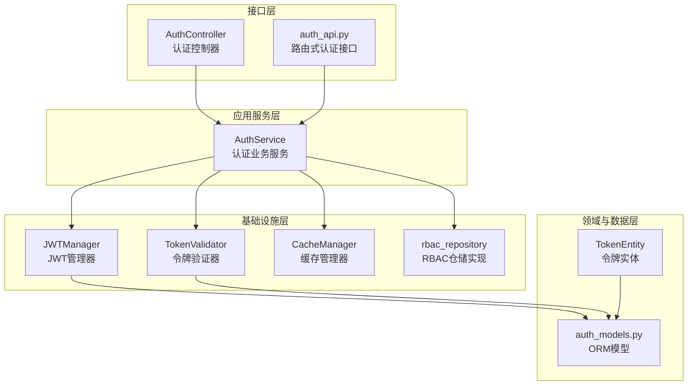
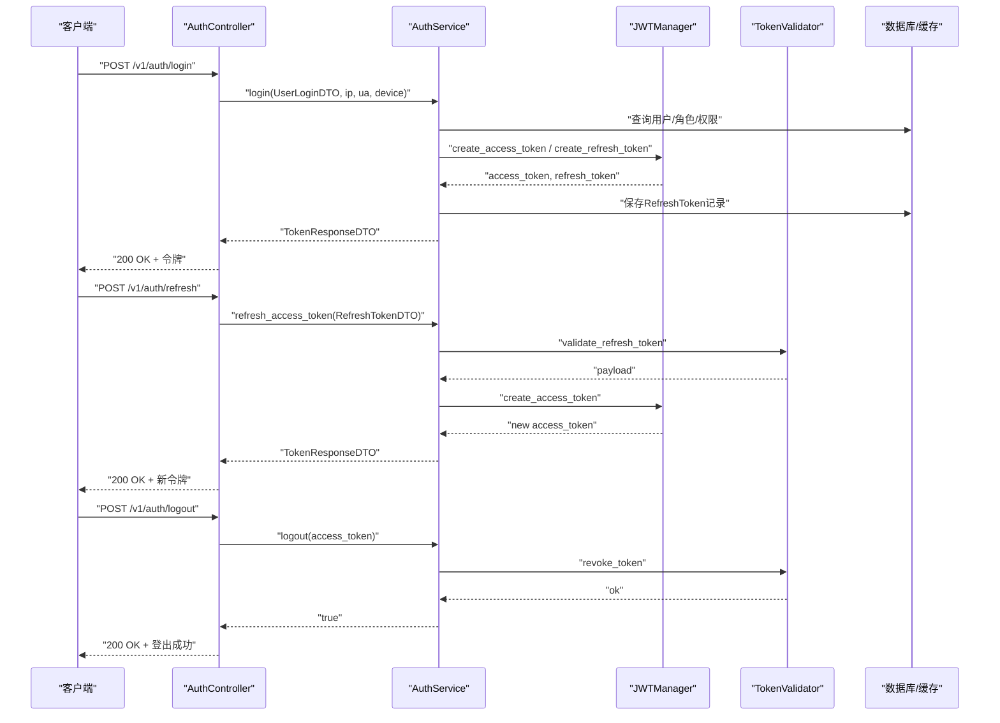
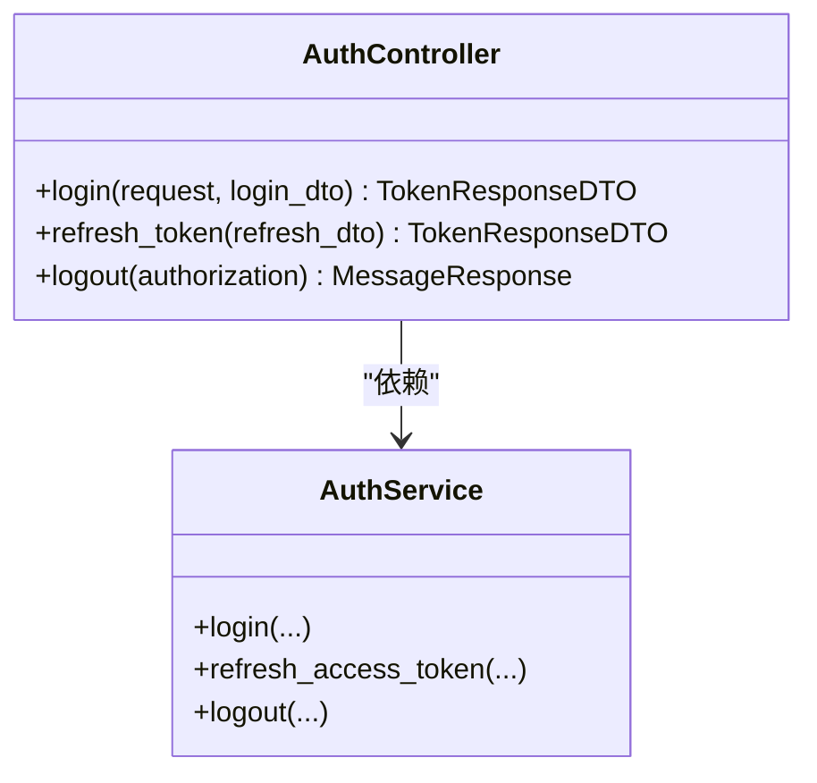
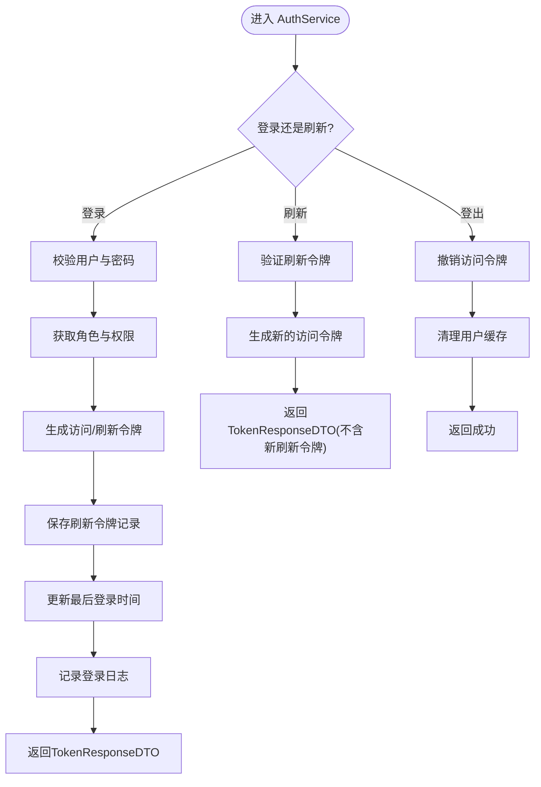
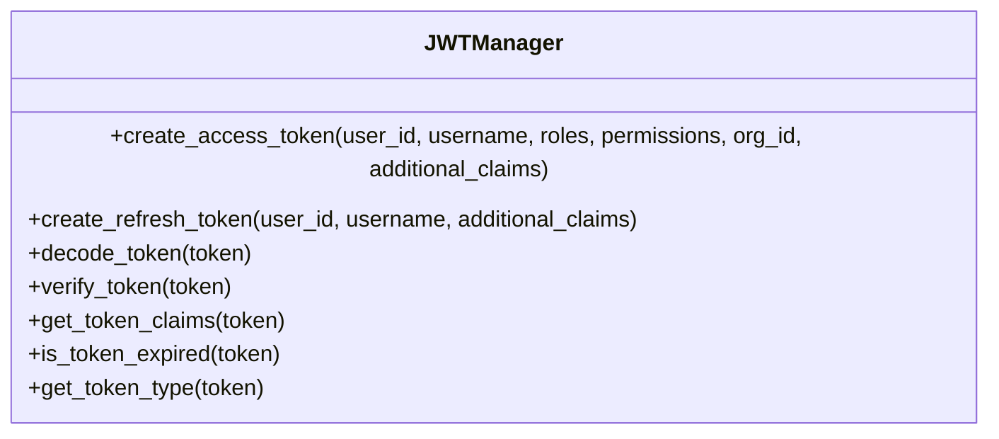
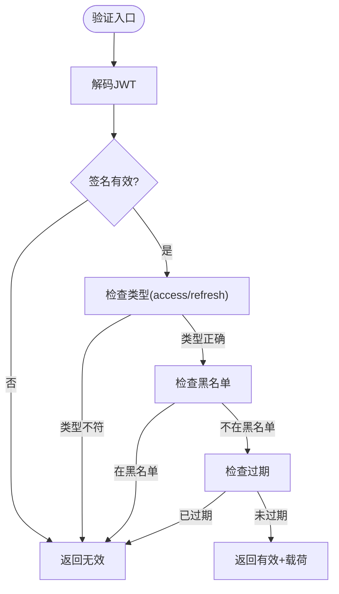
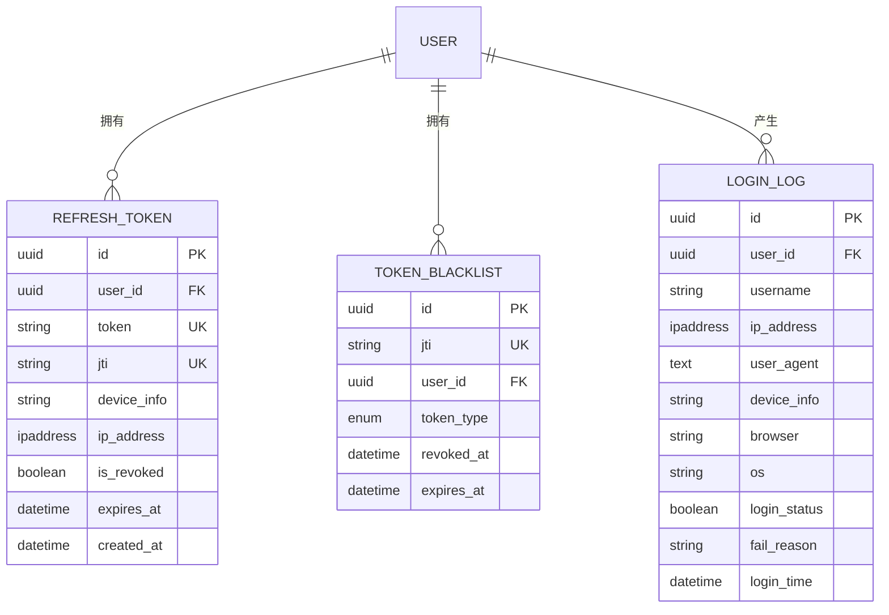
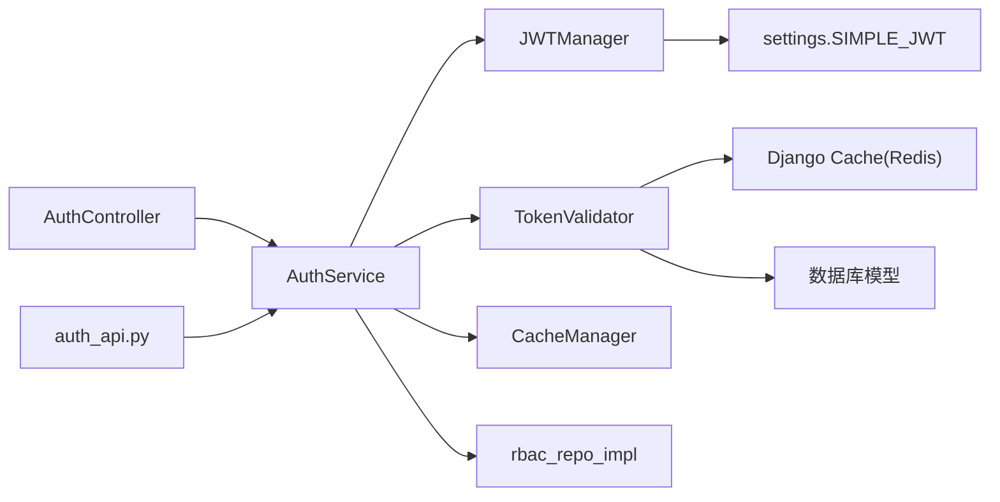

# 认证系统

<cite>
**本文档引用的文件**
- [src/api/v1/controllers/auth_controller.py](file://src/api/v1/controllers/auth_controller.py)
- [src/api/v1/auth_api.py](file://src/api/v1/auth_api.py)
- [src/application/services/auth_service.py](file://src/application/services/auth_service.py)
- [src/domain/auth/entities/token_entity.py](file://src/domain/auth/entities/token_entity.py)
- [src/infrastructure/auth_jwt/jwt_manager.py](file://src/infrastructure/auth_jwt/jwt_manager.py)
- [src/infrastructure/auth_jwt/token_validator.py](file://src/infrastructure/auth_jwt/token_validator.py)
- [src/application/dto/auth/token_response_dto.py](file://src/application/dto/auth/token_response_dto.py)
- [src/application/dto/auth/refresh_token_dto.py](file://src/application/dto/auth/refresh_token_dto.py)
- [src/application/dto/user/user_login_dto.py](file://src/application/dto/user/user_login_dto.py)
- [src/infrastructure/persistence/models/auth_models.py](file://src/infrastructure/persistence/models/auth_models.py)
- [config/settings/base.py](file://config/settings/base.py)
- [src/api/common/responses.py](file://src/api/common/responses.py)
- [tests/test_api/test_auth_api.py](file://tests/test_api/test_auth_api.py)
- [src/core/exceptions/authentication_error.py](file://src/core/exceptions/authentication_error.py)
- [src/core/middlewares/security_middleware.py](file://src/core/middlewares/security_middleware.py)
- [src/infrastructure/cache/cache_manager.py](file://src/infrastructure/cache/cache_manager.py)
</cite>

## 目录
1. [简介](#简介)
2. [项目结构](#项目结构)
3. [核心组件](#核心组件)
4. [架构总览](#架构总览)
5. [详细组件分析](#详细组件分析)
6. [依赖分析](#依赖分析)
7. [性能考虑](#性能考虑)
8. [故障排除指南](#故障排除指南)
9. [结论](#结论)
10. [附录：认证API接口规范](#附录认证api接口规范)

## 简介
本文件面向认证系统的开发者与运维人员，系统化阐述基于 JWT 的认证机制实现，覆盖令牌生成、验证与刷新流程；认证控制器接口设计（登录、刷新令牌、登出）；令牌实体与 JWT 管理器、令牌验证器的工作原理；认证 API 的请求参数、响应格式与错误处理；认证中间件的安全策略与会话管理；以及令牌过期处理、并发登录控制与安全最佳实践。同时提供故障排除与性能优化建议。

## 项目结构
认证系统采用分层架构，围绕“接口层-应用服务层-基础设施层-领域与数据层”组织代码，确保关注点分离与高内聚低耦合。

图表来源
- [src/api/v1/controllers/auth_controller.py:16-133](file://src/api/v1/controllers/auth_controller.py#L16-L133)
- [src/api/v1/auth_api.py:13-74](file://src/api/v1/auth_api.py#L13-L74)
- [src/application/services/auth_service.py:20-233](file://src/application/services/auth_service.py#L20-L233)
- [src/infrastructure/auth_jwt/jwt_manager.py:13-147](file://src/infrastructure/auth_jwt/jwt_manager.py#L13-L147)
- [src/infrastructure/auth_jwt/token_validator.py:11-108](file://src/infrastructure/auth_jwt/token_validator.py#L11-L108)
- [src/infrastructure/cache/cache_manager.py:16-149](file://src/infrastructure/cache/cache_manager.py#L16-L149)
- [src/domain/auth/entities/token_entity.py:11-105](file://src/domain/auth/entities/token_entity.py#L11-L105)
- [src/infrastructure/persistence/models/auth_models.py:12-114](file://src/infrastructure/persistence/models/auth_models.py#L12-L114)

章节来源
- [src/api/v1/controllers/auth_controller.py:16-133](file://src/api/v1/controllers/auth_controller.py#L16-L133)
- [src/api/v1/auth_api.py:13-74](file://src/api/v1/auth_api.py#L13-L74)
- [src/application/services/auth_service.py:20-233](file://src/application/services/auth_service.py#L20-L233)

## 核心组件
- 认证控制器：提供登录、刷新令牌、登出三个接口，负责参数接收、请求头解析与调用应用服务。
- 认证服务：封装业务逻辑，协调 JWT 管理器、令牌验证器、缓存与持久化模型，完成登录、刷新与登出。
- JWT 管理器：负责访问令牌与刷新令牌的生成、解码、校验与过期判断。
- 令牌验证器：负责访问令牌有效性校验、刷新令牌校验、黑名单检查与令牌撤销。
- DTO 与实体：定义登录、令牌响应、刷新令牌 DTO，以及领域层令牌实体与黑名单实体。
- ORM 模型：持久化刷新令牌、黑名单与登录日志。
- 配置与中间件：JWT 配置、Redis 缓存、安全中间件等。

章节来源
- [src/application/services/auth_service.py:20-233](file://src/application/services/auth_service.py#L20-L233)
- [src/infrastructure/auth_jwt/jwt_manager.py:13-147](file://src/infrastructure/auth_jwt/jwt_manager.py#L13-L147)
- [src/infrastructure/auth_jwt/token_validator.py:11-108](file://src/infrastructure/auth_jwt/token_validator.py#L11-L108)
- [src/application/dto/auth/token_response_dto.py:9-32](file://src/application/dto/auth/token_response_dto.py#L9-L32)
- [src/application/dto/auth/refresh_token_dto.py:9-22](file://src/application/dto/auth/refresh_token_dto.py#L9-L22)
- [src/application/dto/user/user_login_dto.py:9-28](file://src/application/dto/user/user_login_dto.py#L9-L28)
- [src/domain/auth/entities/token_entity.py:11-105](file://src/domain/auth/entities/token_entity.py#L11-L105)
- [src/infrastructure/persistence/models/auth_models.py:12-114](file://src/infrastructure/persistence/models/auth_models.py#L12-L114)
- [config/settings/base.py:137-151](file://config/settings/base.py#L137-L151)

## 架构总览
认证系统遵循清晰的分层与职责分离，接口层仅做参数绑定与调用转发，应用服务层承载业务规则，基础设施层提供底层能力（JWT、缓存、数据库），领域与数据层负责实体与持久化。

图表来源
- [src/api/v1/controllers/auth_controller.py:36-133](file://src/api/v1/controllers/auth_controller.py#L36-L133)
- [src/application/services/auth_service.py:26-180](file://src/application/services/auth_service.py#L26-L180)
- [src/infrastructure/auth_jwt/jwt_manager.py:25-80](file://src/infrastructure/auth_jwt/jwt_manager.py#L25-L80)
- [src/infrastructure/auth_jwt/token_validator.py:21-103](file://src/infrastructure/auth_jwt/token_validator.py#L21-L103)
- [src/infrastructure/persistence/models/auth_models.py:12-45](file://src/infrastructure/persistence/models/auth_models.py#L12-L45)

## 详细组件分析

### 认证控制器（AuthController）
- 职责：暴露登录、刷新令牌、登出三个接口，负责提取客户端 IP、UA、设备信息，解析 Authorization 头，调用 AuthService 执行业务逻辑。
- 设计要点：使用依赖注入，便于替换与测试；对异常进行统一处理与返回。

图表来源
- [src/api/v1/controllers/auth_controller.py:16-133](file://src/api/v1/controllers/auth_controller.py#L16-L133)
- [src/application/services/auth_service.py:20-233](file://src/application/services/auth_service.py#L20-L233)

章节来源
- [src/api/v1/controllers/auth_controller.py:16-133](file://src/api/v1/controllers/auth_controller.py#L16-L133)

### 认证服务（AuthService）
- 登录流程：校验用户存在与激活状态、验证密码；获取用户角色与权限；生成访问令牌与刷新令牌；持久化刷新令牌；更新最后登录时间；记录登录日志；返回 TokenResponseDTO。
- 刷新流程：验证刷新令牌有效性；重新生成访问令牌；返回 TokenResponseDTO（不含新刷新令牌）。
- 登出流程：撤销访问令牌（加入黑名单）；清理用户相关缓存（角色、权限、用户信息）。
- 验证流程：委托 TokenValidator 校验访问令牌有效性与黑名单状态。

图表来源
- [src/application/services/auth_service.py:26-180](file://src/application/services/auth_service.py#L26-L180)

章节来源
- [src/application/services/auth_service.py:20-233](file://src/application/services/auth_service.py#L20-L233)

### JWT 管理器（JWTManager）
- 负责访问令牌与刷新令牌的生成、解码、验证、过期判断与载荷提取。
- 令牌类型通过 payload 中的 type 字段区分（access/refresh）。
- 过期时间由配置项 ACCESS_TOKEN_LIFETIME、REFRESH_TOKEN_LIFETIME 控制。

图表来源
- [src/infrastructure/auth_jwt/jwt_manager.py:13-147](file://src/infrastructure/auth_jwt/jwt_manager.py#L13-L147)

章节来源
- [src/infrastructure/auth_jwt/jwt_manager.py:13-147](file://src/infrastructure/auth_jwt/jwt_manager.py#L13-L147)
- [config/settings/base.py:137-151](file://config/settings/base.py#L137-L151)

### 令牌验证器（TokenValidator）
- 验证访问令牌：检查签名、类型、黑名单、过期。
- 验证刷新令牌：检查签名、类型、黑名单。
- 撤销令牌：将 jti 加入黑名单，存活时间与原令牌剩余有效期一致。
- 黑名单存储：使用 Django 缓存（Redis）存储，键前缀为 token_blacklist:jti。

图表来源
- [src/infrastructure/auth_jwt/token_validator.py:21-103](file://src/infrastructure/auth_jwt/token_validator.py#L21-L103)

章节来源
- [src/infrastructure/auth_jwt/token_validator.py:11-108](file://src/infrastructure/auth_jwt/token_validator.py#L11-L108)
- [src/infrastructure/cache/cache_manager.py:16-149](file://src/infrastructure/cache/cache_manager.py#L16-L149)

### 令牌实体与模型
- 领域实体 TokenEntity：描述令牌的结构与行为（过期、撤销、载荷、序列化）。
- ORM 模型 RefreshToken：持久化刷新令牌、jti、设备信息、IP、过期时间等。
- ORM 模型 TokenBlacklist：持久化已撤销的令牌（支持访问/刷新两类）。
- 登录日志 LoginLog：记录登录尝试的 IP、UA、设备、状态与失败原因。

图表来源
- [src/domain/auth/entities/token_entity.py:11-105](file://src/domain/auth/entities/token_entity.py#L11-L105)
- [src/infrastructure/persistence/models/auth_models.py:12-114](file://src/infrastructure/persistence/models/auth_models.py#L12-L114)

章节来源
- [src/domain/auth/entities/token_entity.py:11-105](file://src/domain/auth/entities/token_entity.py#L11-L105)
- [src/infrastructure/persistence/models/auth_models.py:12-114](file://src/infrastructure/persistence/models/auth_models.py#L12-L114)

### DTO 与响应
- UserLoginDTO：登录请求参数（用户名、密码、设备信息）。
- RefreshTokenDTO：刷新令牌请求参数（刷新令牌）。
- TokenResponseDTO：令牌响应（访问令牌、刷新令牌、令牌类型、过期秒数、用户信息）。
- 通用响应：MessageResponse 用于简单消息返回。

章节来源
- [src/application/dto/user/user_login_dto.py:9-28](file://src/application/dto/user/user_login_dto.py#L9-L28)
- [src/application/dto/auth/refresh_token_dto.py:9-22](file://src/application/dto/auth/refresh_token_dto.py#L9-L22)
- [src/application/dto/auth/token_response_dto.py:9-32](file://src/application/dto/auth/token_response_dto.py#L9-L32)
- [src/api/common/responses.py:13-110](file://src/api/common/responses.py#L13-L110)

### 认证中间件与安全策略
- 安全中间件：生产环境自动添加安全响应头（X-Content-Type-Options、X-Frame-Options、Strict-Transport-Security 等）。
- 会话管理：使用 Django Session 与 REST Framework SimpleJWT 认证类，结合 CSRF 保护与 CORS 配置。
- 速率限制与 IP 白黑名单：通过全局开关与中间件实现（在配置中启用）。

章节来源
- [src/core/middlewares/security_middleware.py:14-54](file://src/core/middlewares/security_middleware.py#L14-L54)
- [config/settings/base.py:39-52](file://config/settings/base.py#L39-L52)
- [config/settings/base.py:165-173](file://config/settings/base.py#L165-L173)

## 依赖分析
- 控制器依赖应用服务；应用服务依赖 JWT 管理器、令牌验证器、缓存管理器与 RBAC 仓储实现。
- JWT 管理器与令牌验证器共享密钥与算法配置，依赖 Django 配置 SIMPLE_JWT。
- 令牌撤销依赖缓存（Redis）与数据库（TokenBlacklist/RefreshToken）。
- DTO 与实体相互独立，分别服务于接口层与领域层。

图表来源
- [src/api/v1/controllers/auth_controller.py:16-133](file://src/api/v1/controllers/auth_controller.py#L16-L133)
- [src/api/v1/auth_api.py:13-74](file://src/api/v1/auth_api.py#L13-L74)
- [src/application/services/auth_service.py:10-18](file://src/application/services/auth_service.py#L10-L18)
- [src/infrastructure/auth_jwt/jwt_manager.py:19-24](file://src/infrastructure/auth_jwt/jwt_manager.py#L19-L24)
- [src/infrastructure/auth_jwt/token_validator.py:17-20](file://src/infrastructure/auth_jwt/token_validator.py#L17-L20)
- [config/settings/base.py:137-151](file://config/settings/base.py#L137-L151)

章节来源
- [src/application/services/auth_service.py:10-18](file://src/application/services/auth_service.py#L10-L18)
- [src/infrastructure/auth_jwt/jwt_manager.py:19-24](file://src/infrastructure/auth_jwt/jwt_manager.py#L19-L24)
- [src/infrastructure/auth_jwt/token_validator.py:17-20](file://src/infrastructure/auth_jwt/token_validator.py#L17-L20)

## 性能考虑
- 缓存策略：使用 Redis 缓存提升令牌黑名单查询与用户权限/角色缓存命中率；合理设置超时时间。
- 数据库索引：RefreshToken 的 user 与 jti 字段建立索引，加速查询与去重。
- 异步访问：应用服务与仓储均采用异步 ORM 方法，降低阻塞。
- JWT 载荷精简：避免在 payload 中存放大对象，减少签名与传输开销。
- 过期时间与轮换：合理设置 ACCESS/REFRESH 过期时间，开启刷新令牌轮换与黑名单策略，平衡安全性与用户体验。

## 故障排除指南
- 登录失败（用户名或密码错误）：检查用户是否存在、是否激活；查看登录日志；确认密码校验逻辑。
- 刷新令牌无效或已过期：确认刷新令牌类型正确、未被撤销；检查令牌剩余有效期与黑名单状态。
- 登出后仍可访问：确认撤销流程已执行（加入黑名单）且缓存已清理；检查客户端是否正确携带 Bearer Token。
- 并发登录冲突：当前实现未强制多处登录互斥；如需并发登录控制，可在登录时清理旧刷新令牌或引入会话维度的 jti 策略。
- 性能问题：检查 Redis 连接与键空间大小；优化数据库索引；评估令牌黑名单命中率。

章节来源
- [tests/test_api/test_auth_api.py:23-182](file://tests/test_api/test_auth_api.py#L23-L182)
- [src/application/services/auth_service.py:42-56](file://src/application/services/auth_service.py#L42-L56)
- [src/infrastructure/auth_jwt/token_validator.py:81-103](file://src/infrastructure/auth_jwt/token_validator.py#L81-L103)
- [src/infrastructure/persistence/models/auth_models.py:12-45](file://src/infrastructure/persistence/models/auth_models.py#L12-L45)

## 结论
本认证系统通过清晰的分层设计与完善的基础设施组件，实现了安全、可扩展的 JWT 认证方案。登录、刷新与登出流程完备，配合缓存与数据库持久化，满足生产级需求。建议在实际部署中结合业务场景完善并发登录控制与审计日志策略，并持续监控令牌黑名单与缓存命中情况以优化性能。

## 附录：认证API接口规范

- 基础信息
  - 基础路径：/api/v1/auth
  - 认证方式：Bearer Token（访问令牌）
  - 内容类型：application/json

- 登录
  - 方法：POST
  - 路径：/login
  - 请求体：UserLoginDTO
    - 字段：
      - username：字符串，必填
      - password：字符串，必填
      - device_info：字符串，可选
  - 响应体：TokenResponseDTO
    - 字段：
      - access_token：字符串，必填
      - refresh_token：字符串，可选
      - token_type：字符串，默认 Bearer
      - expires_in：整数，单位秒，必填
      - user：对象，可选，包含 user_id、username、email
  - 错误：
    - 用户名或密码错误
    - 用户已被停用
    - 其他业务异常

- 刷新令牌
  - 方法：POST
  - 路径：/refresh
  - 请求体：RefreshTokenDTO
    - 字段：
      - refresh_token：字符串，必填
  - 响应体：TokenResponseDTO
    - 字段：
      - access_token：字符串，必填
      - refresh_token：可为 null
      - token_type：字符串，默认 Bearer
      - expires_in：整数，单位秒，必填
      - user：对象，可选
  - 错误：
    - 刷新令牌无效或已过期
    - 刷新令牌类型不正确
    - 刷新令牌已失效

- 登出
  - 方法：POST
  - 路径：/logout
  - 请求头：Authorization: Bearer <access_token>
  - 响应体：MessageResponse
    - 字段：
      - message：字符串，例如“登出成功”
  - 错误：
    - 无特定业务错误，总是返回成功消息

- 通用响应
  - 成功响应：包含 success=true 与 message
  - 错误响应：包含 success=false 与 message，可选 code

章节来源
- [src/api/v1/controllers/auth_controller.py:36-133](file://src/api/v1/controllers/auth_controller.py#L36-L133)
- [src/api/v1/auth_api.py:22-74](file://src/api/v1/auth_api.py#L22-L74)
- [src/application/dto/user/user_login_dto.py:9-28](file://src/application/dto/user/user_login_dto.py#L9-L28)
- [src/application/dto/auth/refresh_token_dto.py:9-22](file://src/application/dto/auth/refresh_token_dto.py#L9-L22)
- [src/application/dto/auth/token_response_dto.py:9-32](file://src/application/dto/auth/token_response_dto.py#L9-L32)
- [src/api/common/responses.py:78-110](file://src/api/common/responses.py#L78-L110)