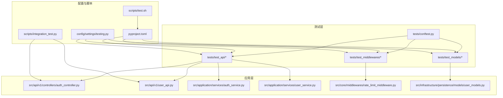
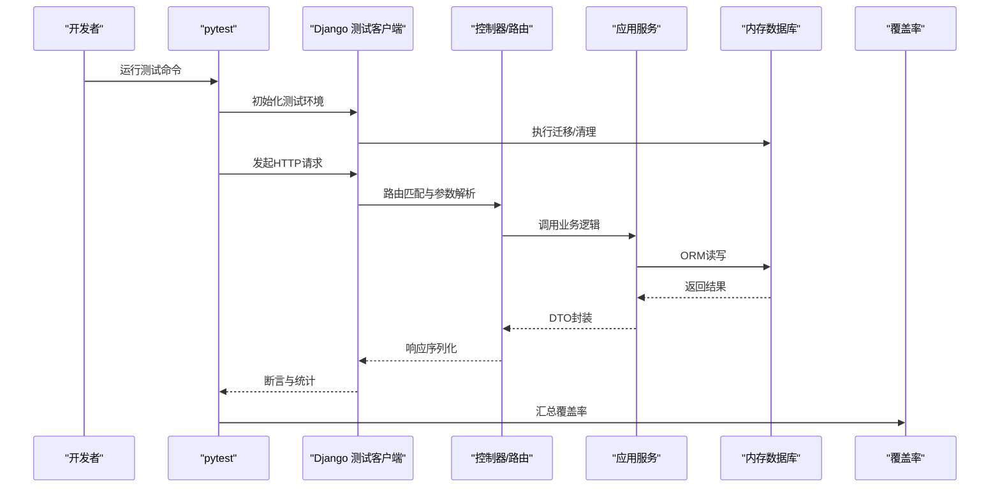
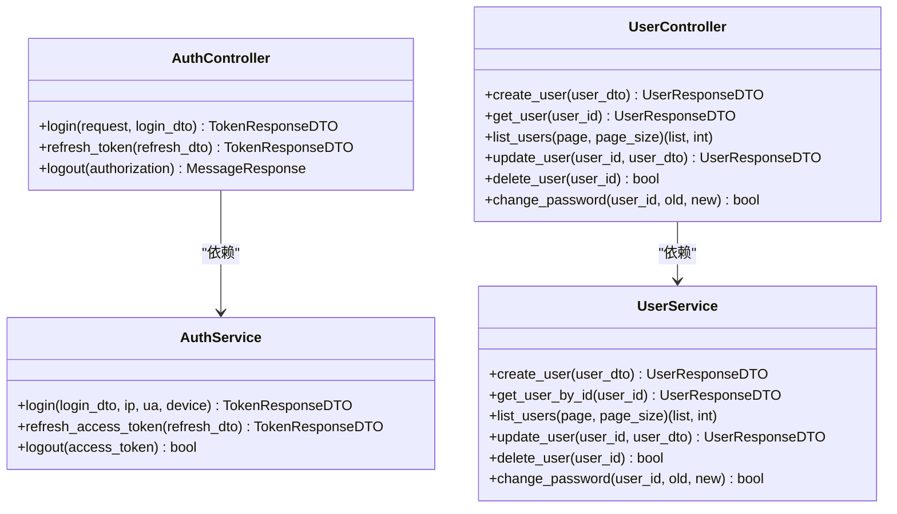
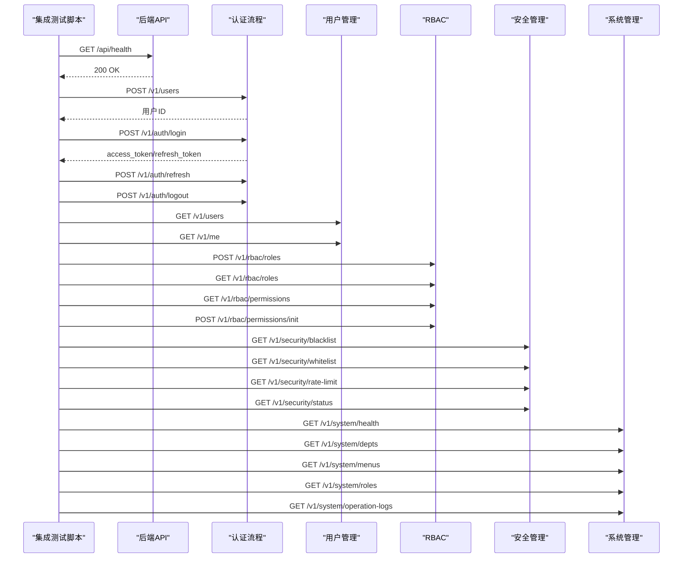
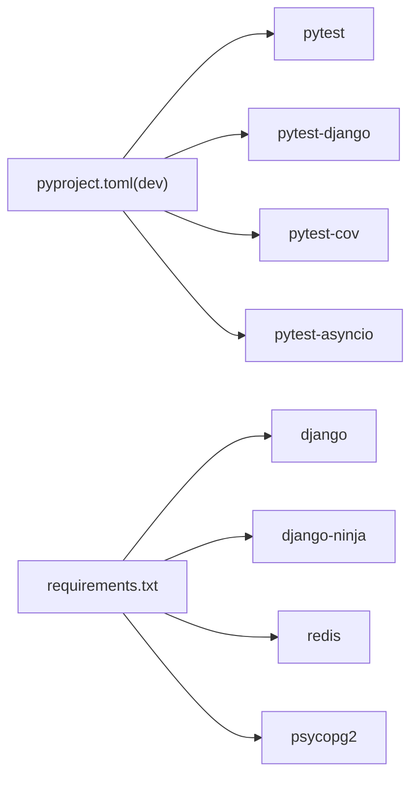

# 测试策略

<cite>
**本文档引用的文件**
- [pyproject.toml](file://pyproject.toml)
- [config/settings/testing.py](file://config/settings/testing.py)
- [tests/conftest.py](file://tests/conftest.py)
- [scripts/test.sh](file://scripts/test.sh)
- [scripts/integration_test.py](file://scripts/integration_test.py)
- [tests/test_api/test_auth_api.py](file://tests/test_api/test_auth_api.py)
- [tests/test_api/test_user_api.py](file://tests/test_api/test_user_api.py)
- [tests/test_middlewares/test_rate_limit_middleware.py](file://tests/test_middlewares/test_rate_limit_middleware.py)
- [tests/test_models/test_user_models.py](file://tests/test_models/test_user_models.py)
- [src/api/v1/controllers/auth_controller.py](file://src/api/v1/controllers/auth_controller.py)
- [src/api/v1/user_api.py](file://src/api/v1/user_api.py)
- [src/application/services/auth_service.py](file://src/application/services/auth_service.py)
- [src/application/services/user_service.py](file://src/application/services/user_service.py)
- [src/core/middlewares/rate_limit_middleware.py](file://src/core/middlewares/rate_limit_middleware.py)
- [src/infrastructure/persistence/models/user_models.py](file://src/infrastructure/persistence/models/user_models.py)
- [requirements.txt](file://requirements.txt)
</cite>

## 目录
1. [引言](#引言)
2. [项目结构](#项目结构)
3. [核心组件](#核心组件)
4. [架构总览](#架构总览)
5. [详细组件分析](#详细组件分析)
6. [依赖分析](#依赖分析)
7. [性能考虑](#性能考虑)
8. [故障排查指南](#故障排查指南)
9. [结论](#结论)
10. [附录](#附录)

## 引言
本测试策略文档面向 Hello-Django-Ninja-Api 项目，系统化阐述单元测试、集成测试与端到端测试的实施方法，覆盖测试框架配置、测试标记体系、测试数据管理、模拟对象使用、测试环境配置、持续集成与自动化流程、测试覆盖率与质量度量，以及性能与负载测试策略。目标是帮助开发者建立稳定、可维护且高效的测试体系。

## 项目结构
项目采用 Django + Django-Ninja 的分层架构，测试代码集中在 tests 目录，按功能域划分 API 测试、中间件测试、模型测试等；同时提供独立的集成测试脚本与测试覆盖率生成脚本。

图表来源
- [pyproject.toml:92-109](file://pyproject.toml#L92-L109)
- [config/settings/testing.py:1-32](file://config/settings/testing.py#L1-L32)
- [tests/conftest.py:1-66](file://tests/conftest.py#L1-L66)
- [scripts/test.sh:1-14](file://scripts/test.sh#L1-L14)
- [scripts/integration_test.py:1-264](file://scripts/integration_test.py#L1-L264)
- [src/api/v1/controllers/auth_controller.py:1-133](file://src/api/v1/controllers/auth_controller.py#L1-L133)
- [src/api/v1/user_api.py:1-150](file://src/api/v1/user_api.py#L1-L150)
- [src/application/services/auth_service.py:1-233](file://src/application/services/auth_service.py#L1-L233)
- [src/application/services/user_service.py:1-193](file://src/application/services/user_service.py#L1-L193)
- [src/core/middlewares/rate_limit_middleware.py:1-112](file://src/core/middlewares/rate_limit_middleware.py#L1-L112)
- [src/infrastructure/persistence/models/user_models.py:1-147](file://src/infrastructure/persistence/models/user_models.py#L1-L147)

章节来源
- [pyproject.toml:92-109](file://pyproject.toml#L92-L109)
- [config/settings/testing.py:1-32](file://config/settings/testing.py#L1-L32)
- [tests/conftest.py:1-66](file://tests/conftest.py#L1-L66)
- [scripts/test.sh:1-14](file://scripts/test.sh#L1-L14)
- [scripts/integration_test.py:1-264](file://scripts/integration_test.py#L1-L264)

## 核心组件
- 测试框架与配置
  - 使用 pytest、pytest-django、pytest-cov、pytest-asyncio
  - 严格标记与配置：单位测试、集成测试、慢测试标记
  - 测试路径、文件命名规范、回溯风格、异步模式
- 测试环境
  - testing.py 使用内存数据库、禁用缓存、快速密码哈希器、关闭速率限制
- 测试夹具
  - 数据库迁移夹具、User 模型夹具、用户与管理员数据夹具、角色与权限数据夹具
- 覆盖率
  - 覆盖源码目录、忽略迁移与测试与配置文件

章节来源
- [pyproject.toml:26-36](file://pyproject.toml#L26-L36)
- [pyproject.toml:92-109](file://pyproject.toml#L92-L109)
- [pyproject.toml:111-131](file://pyproject.toml#L111-L131)
- [config/settings/testing.py:1-32](file://config/settings/testing.py#L1-L32)
- [tests/conftest.py:10-66](file://tests/conftest.py#L10-L66)

## 架构总览
测试架构围绕“夹具—断言—覆盖率”展开，结合 Django 的测试客户端与 requests 的真实 HTTP 调用，形成从单元到端到端的完整测试金字塔。

图表来源
- [pyproject.toml:92-109](file://pyproject.toml#L92-L109)
- [config/settings/testing.py:10-16](file://config/settings/testing.py#L10-L16)
- [src/api/v1/controllers/auth_controller.py:36-78](file://src/api/v1/controllers/auth_controller.py#L36-L78)
- [src/api/v1/user_api.py:50-149](file://src/api/v1/user_api.py#L50-L149)
- [src/application/services/auth_service.py:26-111](file://src/application/services/auth_service.py#L26-L111)
- [src/application/services/user_service.py:29-50](file://src/application/services/user_service.py#L29-L50)

## 详细组件分析

### 单元测试策略
- 测试范围
  - 控制器与路由：认证控制器、用户路由
  - 应用服务：认证服务、用户服务
  - 模型与仓储：用户模型、用户档案模型
  - 中间件：速率限制中间件
- 测试夹具
  - 使用 pytest-django 的数据库夹具与自定义数据夹具
  - 通过 conftest 提供用户、管理员、角色、权限数据
- 断言要点
  - 响应状态码、JSON 结构、业务异常抛出
  - DTO 字段校验、权限与角色返回
- 异步与并发
  - 使用 pytest-asyncio，确保异步服务与控制器测试通过

图表来源
- [src/api/v1/controllers/auth_controller.py:16-133](file://src/api/v1/controllers/auth_controller.py#L16-L133)
- [src/application/services/auth_service.py:20-233](file://src/application/services/auth_service.py#L20-L233)
- [src/api/v1/user_api.py:50-149](file://src/api/v1/user_api.py#L50-L149)
- [src/application/services/user_service.py:16-193](file://src/application/services/user_service.py#L16-L193)

章节来源
- [tests/test_api/test_auth_api.py:11-182](file://tests/test_api/test_auth_api.py#L11-L182)
- [tests/test_api/test_user_api.py:11-220](file://tests/test_api/test_user_api.py#L11-L220)
- [tests/test_models/test_user_models.py:8-82](file://tests/test_models/test_user_models.py#L8-L82)
- [tests/test_middlewares/test_rate_limit_middleware.py:29-76](file://tests/test_middlewares/test_rate_limit_middleware.py#L29-L76)

### 集成测试策略
- 目标
  - 使用 requests 对各模块接口进行端到端验证
  - 覆盖健康检查、认证流程、用户管理、RBAC、安全管理、系统管理
- 流程
  - 健康检查 → 认证（注册/登录/刷新/登出）→ 用户管理 → RBAC → 安全管理 → 系统管理
  - 统计通过/失败数量，输出结果文件
- 关键点
  - 使用统一 BASE_URL 与超时控制
  - 对鉴权接口传入 Bearer Token
  - 对非 200 状态记录错误详情

图表来源
- [scripts/integration_test.py:74-231](file://scripts/integration_test.py#L74-L231)
- [src/api/v1/controllers/auth_controller.py:36-133](file://src/api/v1/controllers/auth_controller.py#L36-L133)
- [src/api/v1/user_api.py:50-149](file://src/api/v1/user_api.py#L50-L149)

章节来源
- [scripts/integration_test.py:1-264](file://scripts/integration_test.py#L1-L264)

### 端到端测试策略
- 目标
  - 在真实环境中验证完整业务链路
- 方法
  - 通过 requests 直连后端，绕过 Django 测试客户端
  - 顺序执行多模块接口，确保跨模块协作正确
- 输出
  - 控制台实时结果与文件落盘

章节来源
- [scripts/integration_test.py:19-264](file://scripts/integration_test.py#L19-L264)

### 测试数据管理与模拟对象
- 测试数据
  - 使用 fixtures 提供用户、管理员、角色、权限数据
  - 自动迁移数据库，保证测试前状态一致
- 模拟对象
  - 中间件测试中使用 Mock 替代缓存与 get_response
  - 通过 RequestFactory 构造请求对象
- 环境隔离
  - 测试环境使用内存数据库与本地缓存
  - 禁用速率限制，避免干扰测试

章节来源
- [tests/conftest.py:10-66](file://tests/conftest.py#L10-L66)
- [config/settings/testing.py:10-32](file://config/settings/testing.py#L10-L32)
- [tests/test_middlewares/test_rate_limit_middleware.py:13-27](file://tests/test_middlewares/test_rate_limit_middleware.py#L13-L27)

### 测试标记系统
- 标记
  - unit：单元测试
  - integration：集成测试
  - slow：慢测试
- 使用
  - 通过 pytest.ini_options 的 markers 定义
  - 在测试类/方法上标注，便于选择性执行

章节来源
- [pyproject.toml:104-108](file://pyproject.toml#L104-L108)

### 测试覆盖率与质量度量
- 覆盖率
  - 使用 pytest-cov，源码目录为 src，忽略 migrations/tests/config/manage.py
  - 生成 HTML 与终端缺失报告
- 质量度量
  - 结合 Ruff 与 MyPy 的静态检查
  - 通过 CI 统一执行

章节来源
- [pyproject.toml:111-131](file://pyproject.toml#L111-L131)
- [pyproject.toml:42-85](file://pyproject.toml#L42-L85)

### 性能测试与负载测试
- 当前现状
  - 项目未提供专用性能/负载测试脚本
- 建议策略
  - 使用独立工具（如 Locust、JMeter 或 wrk）针对高频接口进行压力测试
  - 在 CI 中加入性能回归阈值（如 P95/P99 延迟）
  - 结合速率限制中间件配置评估系统承载能力

[本节为通用建议，无需特定文件引用]

## 依赖分析
- 测试依赖
  - pytest、pytest-django、pytest-cov、pytest-asyncio
  - faker（开发依赖）用于生成测试数据
- 运行时依赖
  - Django、Django-Ninja、Redis、PostgreSQL 等
- 测试与生产依赖分离
  - requirements.txt 仅包含运行时依赖
  - 开发依赖在 pyproject.toml 的 dev 分组中

图表来源
- [pyproject.toml:26-36](file://pyproject.toml#L26-L36)
- [requirements.txt:1-38](file://requirements.txt#L1-L38)

章节来源
- [pyproject.toml:26-36](file://pyproject.toml#L26-L36)
- [requirements.txt:1-38](file://requirements.txt#L1-L38)

## 性能考虑
- 测试性能
  - 使用内存数据库与本地缓存，提升测试速度
  - 合理拆分测试用例，避免长串依赖
- 生产性能
  - 速率限制中间件默认开启，测试环境显式关闭
  - Redis 缓存与数据库连接池需在生产配置中优化

章节来源
- [config/settings/testing.py:10-32](file://config/settings/testing.py#L10-L32)
- [src/core/middlewares/rate_limit_middleware.py:30-40](file://src/core/middlewares/rate_limit_middleware.py#L30-L40)

## 故障排查指南
- 常见问题
  - 数据库迁移失败：确认 django_db_setup 夹具已执行
  - Token 相关失败：检查登录流程与鉴权头
  - 速率限制导致 429：确认测试环境已关闭速率限制
- 排查步骤
  - 使用 --tb=short 查看简要回溯
  - 使用 -v 与 -k 标记筛选用例
  - 生成覆盖率报告定位未覆盖路径

章节来源
- [pyproject.toml:97-102](file://pyproject.toml#L97-L102)
- [config/settings/testing.py:30-32](file://config/settings/testing.py#L30-L32)
- [tests/test_middlewares/test_rate_limit_middleware.py:46-58](file://tests/test_middlewares/test_rate_limit_middleware.py#L46-L58)

## 结论
本测试策略以 pytest 为核心，结合 Django 测试客户端与 requests 真实调用，构建了从单元到端到端的测试体系。通过严格的夹具与标记管理、内存数据库与禁用速率限制的测试环境、以及覆盖率与静态检查，确保代码质量与可维护性。建议后续补充性能与负载测试，并在 CI 中固化执行流程。

## 附录
- 快速开始
  - 运行测试：使用脚本生成覆盖率报告
  - 执行集成测试：直接运行集成测试脚本
- 最佳实践
  - 为每个业务模块编写单元测试与集成测试
  - 使用 DTO 与模型测试确保数据一致性
  - 通过标记选择性执行测试，提升效率

章节来源
- [scripts/test.sh:1-14](file://scripts/test.sh#L1-L14)
- [scripts/integration_test.py:261-264](file://scripts/integration_test.py#L261-L264)