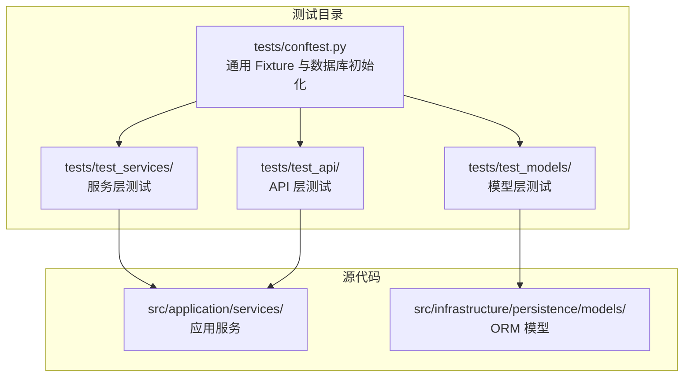
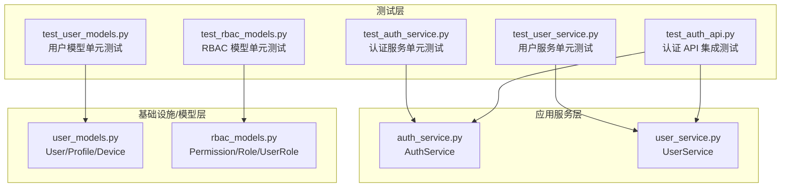
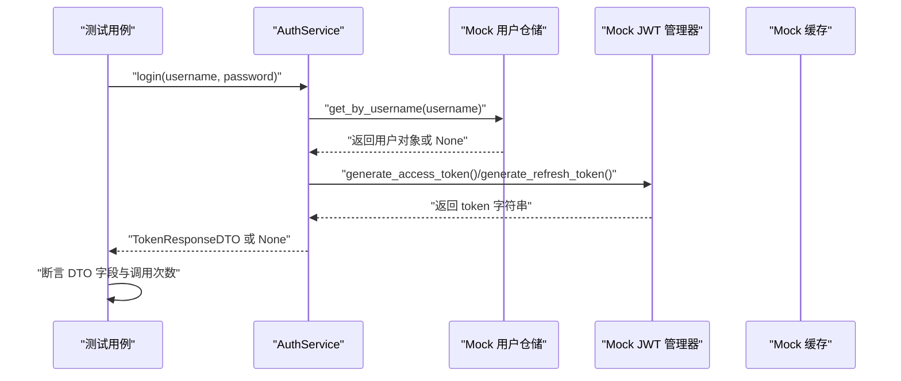
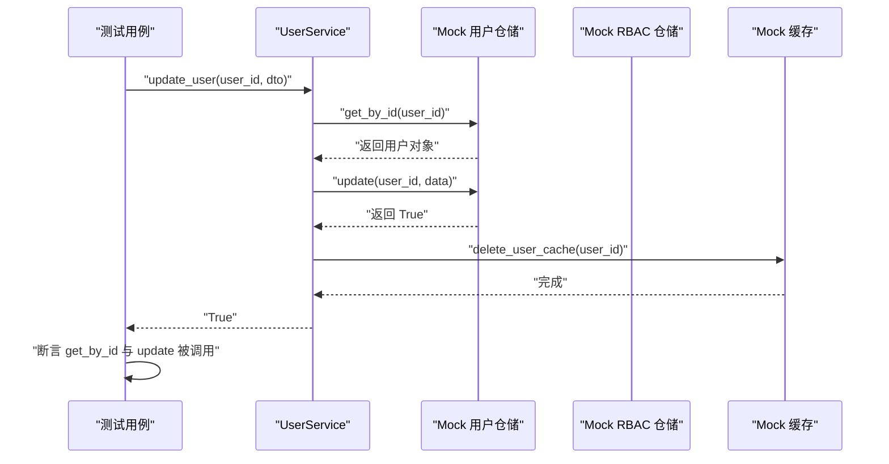
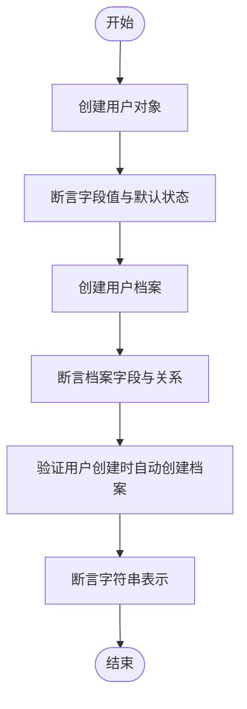
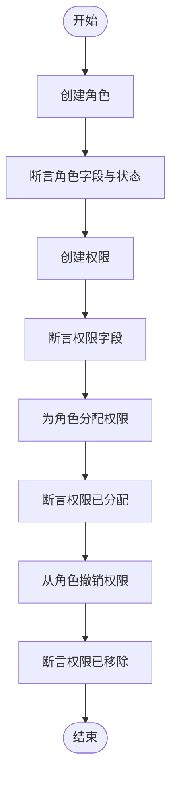
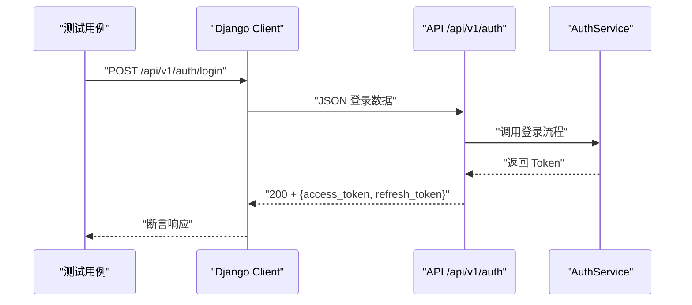
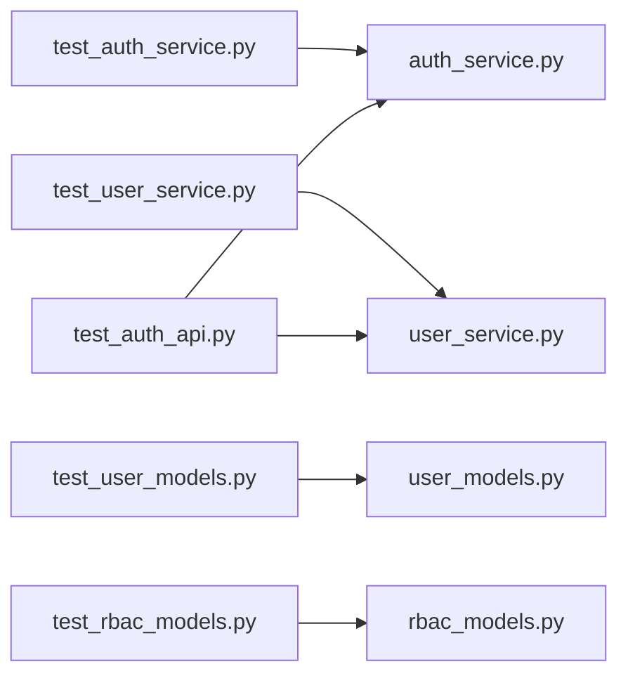

# 单元测试

<cite>
**本文引用的文件**
- [tests/conftest.py](file://tests/conftest.py)
- [tests/test_services/test_auth_service.py](file://tests/test_services/test_auth_service.py)
- [tests/test_services/test_user_service.py](file://tests/test_services/test_user_service.py)
- [tests/test_models/test_user_models.py](file://tests/test_models/test_user_models.py)
- [tests/test_models/test_rbac_models.py](file://tests/test_models/test_rbac_models.py)
- [tests/test_api/test_auth_api.py](file://tests/test_api/test_auth_api.py)
- [src/application/services/auth_service.py](file://src/application/services/auth_service.py)
- [src/application/services/user_service.py](file://src/application/services/user_service.py)
- [src/infrastructure/persistence/models/user_models.py](file://src/infrastructure/persistence/models/user_models.py)
- [src/infrastructure/persistence/models/rbac_models.py](file://src/infrastructure/persistence/models/rbac_models.py)
- [config/settings/testing.py](file://config/settings/testing.py)
- [scripts/test.sh](file://scripts/test.sh)
- [pyproject.toml](file://pyproject.toml)
- [ruff.toml](file://ruff.toml)
</cite>

## 目录
1. [引言](#引言)
2. [项目结构](#项目结构)
3. [核心组件](#核心组件)
4. [架构总览](#架构总览)
5. [详细组件分析](#详细组件分析)
6. [依赖分析](#依赖分析)
7. [性能考虑](#性能考虑)
8. [故障排查指南](#故障排查指南)
9. [结论](#结论)
10. [附录](#附录)

## 引言
本文件系统性阐述本项目的单元测试体系，覆盖服务层与模型层的测试设计、Mock 对象使用、断言最佳实践、异步函数与协程测试方法、测试覆盖率计算与分析，以及测试命名与组织规范。目标是帮助开发者编写高质量、可维护、可扩展的单元测试，保障核心业务逻辑（如认证、用户管理、RBAC 权限）的稳定性。

## 项目结构
测试目录按“功能域”组织，分为：
- 服务层测试：覆盖认证服务、用户服务等应用层业务逻辑
- 模型层测试：覆盖用户模型、角色权限模型等持久化实体
- API 层测试：通过 Django Client 发起请求，验证接口行为
- 配置与工具：pytest 配置、测试环境设置、覆盖率统计脚本

图表来源
- [tests/conftest.py:1-66](file://tests/conftest.py#L1-L66)
- [tests/test_services/test_auth_service.py:1-143](file://tests/test_services/test_auth_service.py#L1-L143)
- [tests/test_models/test_user_models.py:1-82](file://tests/test_models/test_user_models.py#L1-L82)
- [tests/test_models/test_rbac_models.py:1-99](file://tests/test_models/test_rbac_models.py#L1-L99)
- [tests/test_api/test_auth_api.py:1-87](file://tests/test_api/test_auth_api.py#L1-L87)
- [src/application/services/auth_service.py:1-233](file://src/application/services/auth_service.py#L1-L233)
- [src/application/services/user_service.py:1-172](file://src/application/services/user_service.py#L1-L172)
- [src/infrastructure/persistence/models/user_models.py:1-147](file://src/infrastructure/persistence/models/user_models.py#L1-L147)
- [src/infrastructure/persistence/models/rbac_models.py:1-148](file://src/infrastructure/persistence/models/rbac_models.py#L1-L148)

章节来源
- [tests/conftest.py:1-66](file://tests/conftest.py#L1-L66)
- [pyproject.toml:92-110](file://pyproject.toml#L92-L110)

## 核心组件
- 测试框架与配置
  - 使用 pytest，启用 Django 集成、标记系统、覆盖率统计
  - 测试环境配置为 SQLite 内存库、禁用缓存、简化密码哈希器
- 通用 Fixture
  - 数据库迁移初始化、用户与管理员数据、角色与权限数据
- 覆盖率与脚本
  - 通过脚本运行测试并生成 HTML 与终端缺失报告

章节来源
- [config/settings/testing.py:1-32](file://config/settings/testing.py#L1-L32)
- [tests/conftest.py:10-66](file://tests/conftest.py#L10-L66)
- [scripts/test.sh:1-14](file://scripts/test.sh#L1-L14)
- [pyproject.toml:92-110](file://pyproject.toml#L92-L110)

## 架构总览
下图展示测试与被测模块之间的交互关系，突出服务层与模型层的测试边界与依赖注入点。

图表来源
- [tests/test_services/test_auth_service.py:1-143](file://tests/test_services/test_auth_service.py#L1-L143)
- [tests/test_services/test_user_service.py:1-112](file://tests/test_services/test_user_service.py#L1-L112)
- [tests/test_models/test_user_models.py:1-82](file://tests/test_models/test_user_models.py#L1-L82)
- [tests/test_models/test_rbac_models.py:1-99](file://tests/test_models/test_rbac_models.py#L1-L99)
- [tests/test_api/test_auth_api.py:1-87](file://tests/test_api/test_auth_api.py#L1-L87)
- [src/application/services/auth_service.py:1-233](file://src/application/services/auth_service.py#L1-L233)
- [src/application/services/user_service.py:1-172](file://src/application/services/user_service.py#L1-L172)
- [src/infrastructure/persistence/models/user_models.py:1-147](file://src/infrastructure/persistence/models/user_models.py#L1-L147)
- [src/infrastructure/persistence/models/rbac_models.py:1-148](file://src/infrastructure/persistence/models/rbac_models.py#L1-L148)

## 详细组件分析

### 服务层单元测试：认证服务
- 测试范围
  - 登录（成功/密码错误/用户不存在/非活跃用户）
  - 注册（成功）
  - 刷新 Token（成功）
  - 登出（成功）
- Mock 策略
  - 使用 unittest.mock.Mock 替换用户仓储、JWT 管理器、缓存管理器
  - 通过返回值与副作用（side_effect）模拟业务分支
- 断言策略
  - 结果对象字段断言
  - 依赖调用次数与参数断言（如 get_by_username、generate_access_token）
  - 异常场景断言（None 返回或抛出异常）
- 异步与协程
  - 应用服务方法为 async，测试通过直接调用并断言返回值；Mock 的属性与方法天然支持同步/异步调用语义

图表来源
- [tests/test_services/test_auth_service.py:27-52](file://tests/test_services/test_auth_service.py#L27-L52)
- [src/application/services/auth_service.py:26-112](file://src/application/services/auth_service.py#L26-L112)

章节来源
- [tests/test_services/test_auth_service.py:1-143](file://tests/test_services/test_auth_service.py#L1-L143)
- [src/application/services/auth_service.py:1-233](file://src/application/services/auth_service.py#L1-L233)

### 服务层单元测试：用户服务
- 测试范围
  - 查询用户（存在/不存在）
  - 列表查询（分页）
  - 更新用户（成功）
  - 删除用户（成功）
- Mock 策略
  - 用户仓储与 RBAC 仓储均以 Mock 注入
  - 缓存管理器 Mock 用于验证缓存读写行为
- 断言策略
  - DTO 字段断言
  - 仓储调用次数与参数断言
  - 缓存清理断言（删除用户后清理相关缓存键）

图表来源
- [tests/test_services/test_user_service.py:79-96](file://tests/test_services/test_user_service.py#L79-L96)
- [src/application/services/user_service.py:82-98](file://src/application/services/user_service.py#L82-L98)

章节来源
- [tests/test_services/test_user_service.py:1-112](file://tests/test_services/test_user_service.py#L1-L112)
- [src/application/services/user_service.py:1-172](file://src/application/services/user_service.py#L1-L172)

### 模型层单元测试：用户模型与档案
- 测试范围
  - 创建普通用户与超级用户（字段校验、状态断言）
  - 用户字符串表示
  - 用户档案创建、自动创建、字符串表示
- 数据库与事务
  - 使用 pytest.mark.django_db 在真实数据库上下文中执行
  - 通过 fixtures 提供标准化测试数据
- 断言策略
  - 字段值断言
  - 关系完整性断言（OneToOne、外键）

图表来源
- [tests/test_models/test_user_models.py:17-46](file://tests/test_models/test_user_models.py#L17-L46)
- [tests/test_models/test_user_models.py:60-82](file://tests/test_models/test_user_models.py#L60-L82)
- [src/infrastructure/persistence/models/user_models.py:12-84](file://src/infrastructure/persistence/models/user_models.py#L12-L84)
- [src/infrastructure/persistence/models/user_models.py:90-118](file://src/infrastructure/persistence/models/user_models.py#L90-L118)

章节来源
- [tests/test_models/test_user_models.py:1-82](file://tests/test_models/test_user_models.py#L1-L82)
- [src/infrastructure/persistence/models/user_models.py:1-147](file://src/infrastructure/persistence/models/user_models.py#L1-L147)

### 模型层单元测试：RBAC 模型
- 测试范围
  - 角色创建、字符串表示、唯一性约束
  - 权限创建、字符串表示
  - 角色与权限的多对多分配与撤销
- 断言策略
  - 唯一性约束触发异常
  - 多对多集合断言（包含/排除）

图表来源
- [tests/test_models/test_rbac_models.py:17-38](file://tests/test_models/test_rbac_models.py#L17-L38)
- [tests/test_models/test_rbac_models.py:75-99](file://tests/test_models/test_rbac_models.py#L75-L99)
- [src/infrastructure/persistence/models/rbac_models.py:13-41](file://src/infrastructure/persistence/models/rbac_models.py#L13-L41)
- [src/infrastructure/persistence/models/rbac_models.py:43-77](file://src/infrastructure/persistence/models/rbac_models.py#L43-L77)

章节来源
- [tests/test_models/test_rbac_models.py:1-99](file://tests/test_models/test_rbac_models.py#L1-L99)
- [src/infrastructure/persistence/models/rbac_models.py:1-148](file://src/infrastructure/persistence/models/rbac_models.py#L1-L148)

### API 层单元测试：认证接口
- 测试范围
  - 登录成功（返回 Token）
  - 登录失败（密码错误）
  - 刷新 Token 成功
- 测试策略
  - 使用 Django Client 发起 JSON 请求
  - 通过数据库创建用户并设置激活状态
  - 断言状态码与响应字段

图表来源
- [tests/test_api/test_auth_api.py:23-43](file://tests/test_api/test_auth_api.py#L23-L43)
- [tests/test_api/test_auth_api.py:58-87](file://tests/test_api/test_auth_api.py#L58-L87)
- [src/application/services/auth_service.py:26-112](file://src/application/services/auth_service.py#L26-L112)

章节来源
- [tests/test_api/test_auth_api.py:1-87](file://tests/test_api/test_auth_api.py#L1-L87)
- [src/application/services/auth_service.py:1-233](file://src/application/services/auth_service.py#L1-L233)

## 依赖分析
- 测试与被测模块耦合
  - 服务层测试通过构造函数注入 Mock 依赖，降低与真实存储/缓存的耦合
  - 模型层测试依赖 Django ORM 与数据库，但通过内存数据库与 fixtures 保持隔离
- 外部依赖与集成点
  - JWT 管理器、缓存管理器、RBAC 仓储、登录日志与刷新 Token 持久化
- 可能的循环依赖
  - 当前测试结构清晰，未见循环依赖迹象

图表来源
- [tests/test_services/test_auth_service.py:1-143](file://tests/test_services/test_auth_service.py#L1-L143)
- [tests/test_services/test_user_service.py:1-112](file://tests/test_services/test_user_service.py#L1-L112)
- [tests/test_models/test_user_models.py:1-82](file://tests/test_models/test_user_models.py#L1-L82)
- [tests/test_models/test_rbac_models.py:1-99](file://tests/test_models/test_rbac_models.py#L1-L99)
- [tests/test_api/test_auth_api.py:1-87](file://tests/test_api/test_auth_api.py#L1-L87)
- [src/application/services/auth_service.py:1-233](file://src/application/services/auth_service.py#L1-L233)
- [src/application/services/user_service.py:1-172](file://src/application/services/user_service.py#L1-L172)
- [src/infrastructure/persistence/models/user_models.py:1-147](file://src/infrastructure/persistence/models/user_models.py#L1-L147)
- [src/infrastructure/persistence/models/rbac_models.py:1-148](file://src/infrastructure/persistence/models/rbac_models.py#L1-L148)

## 性能考虑
- 测试速度
  - 使用 SQLite 内存数据库与禁用缓存，提升测试执行效率
  - 通过 Mock 减少真实网络与 IO 开销
- 覆盖率
  - 使用 pytest-cov 统计覆盖率，建议关注热点路径与异常分支
- 并发与异步
  - 测试中避免并发，集中于单线程异步调用以保证断言确定性

## 故障排查指南
- 常见问题
  - 数据库迁移失败：确认会话级数据库初始化 fixture 已正确执行
  - 密码哈希不匹配：测试环境使用简化哈希器，确保测试数据与哈希一致
  - 缓存未生效：测试环境禁用缓存，相关断言需考虑 Mock 行为
- 排查步骤
  - 使用 pytest 标记过滤（如 unit）定位测试范围
  - 查看覆盖率报告定位未覆盖分支
  - 逐步注释/开启 Mock，区分业务逻辑与外部依赖问题

章节来源
- [tests/conftest.py:10-29](file://tests/conftest.py#L10-L29)
- [config/settings/testing.py:18-32](file://config/settings/testing.py#L18-L32)
- [pyproject.toml:92-110](file://pyproject.toml#L92-L110)

## 结论
本项目的单元测试体系以“服务层 Mock + 模型层真实数据库”的组合实现了高内聚、低耦合的测试策略。通过明确的断言策略、完善的异常分支覆盖与覆盖率统计，有效保障了认证、用户与 RBAC 核心业务的稳定性。建议持续补充 API 层与集成测试，并在 CI 中强制执行覆盖率阈值。

## 附录

### 测试命名规范与组织结构
- 文件命名
  - 服务层：test_{service_name}.py
  - 模型层：test_{model_name}.py
  - API 层：test_{api_name}_api.py
- 类命名
  - TestXxx：类名以 Test 开头，驼峰命名
- 方法命名
  - test_xxx_success：成功场景
  - test_xxx_failure / test_xxx_error：失败/异常场景
- 标记
  - pytest.mark.unit：单元测试标记
- 组织
  - tests/test_services、tests/test_models、tests/test_api 下按功能域划分

章节来源
- [pyproject.toml:104-108](file://pyproject.toml#L104-L108)

### Mock 对象使用方法
- 构造 Mock
  - 使用 unittest.mock.Mock 创建依赖替身
  - 通过返回值与 side_effect 控制行为
- 注入与断言
  - 在测试构造函数中注入 Mock
  - 使用 assert_called_once_with/assert_called_with 断言调用参数
  - 使用 assert_called 与 call_count 断言调用次数

章节来源
- [tests/test_services/test_auth_service.py:10-21](file://tests/test_services/test_auth_service.py#L10-L21)
- [tests/test_services/test_user_service.py:10-21](file://tests/test_services/test_user_service.py#L10-L21)

### 断言最佳实践
- 字段断言
  - 对 DTO/模型字段进行精确断言
- 调用断言
  - 对依赖方法调用次数与参数断言
- 异常断言
  - 对异常类型与消息进行断言（若适用）
- 数据断言
  - 对集合大小、关系完整性进行断言

章节来源
- [tests/test_models/test_user_models.py:17-46](file://tests/test_models/test_user_models.py#L17-L46)
- [tests/test_models/test_rbac_models.py:33-38](file://tests/test_models/test_rbac_models.py#L33-L38)

### 异步函数与协程测试
- 测试入口
  - 直接调用 async 方法并断言返回值
- Mock 行为
  - Mock 的属性与方法天然兼容异步调用语义
- 注意事项
  - 避免在测试中引入并发，保持断言确定性

章节来源
- [src/application/services/auth_service.py:26-112](file://src/application/services/auth_service.py#L26-L112)
- [src/application/services/user_service.py:28-149](file://src/application/services/user_service.py#L28-L149)

### 测试覆盖率计算与分析
- 覆盖率命令
  - 使用脚本运行 pytest 并生成 HTML 与终端缺失报告
- 配置
  - 源码目录与忽略路径在配置中定义
- 分析建议
  - 关注未覆盖的异常分支与边界条件
  - 结合单元测试与集成测试共同提升覆盖率

章节来源
- [scripts/test.sh:10-14](file://scripts/test.sh#L10-L14)
- [pyproject.toml:111-131](file://pyproject.toml#L111-L131)