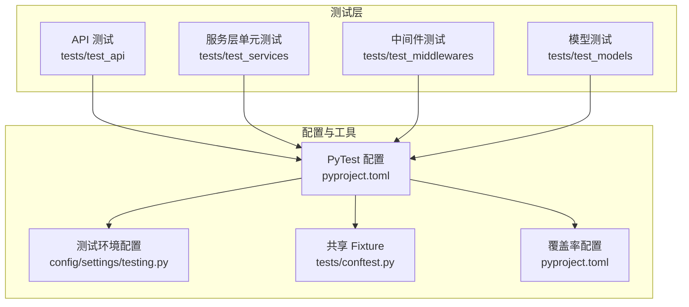
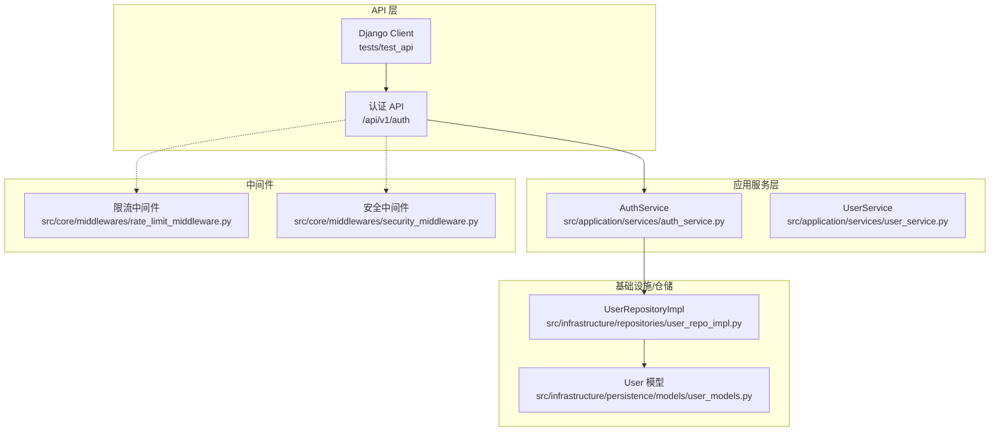
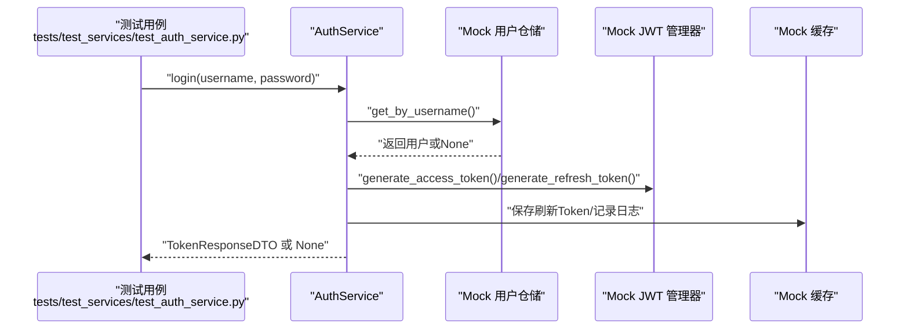
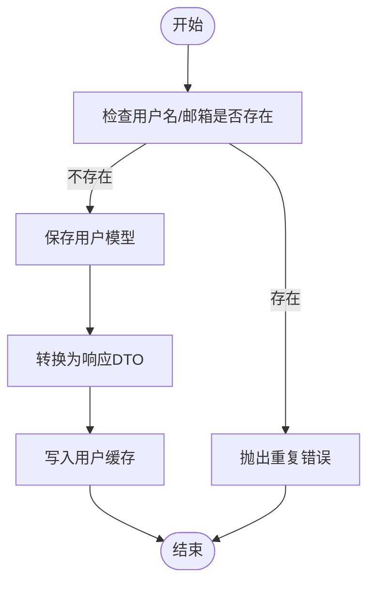
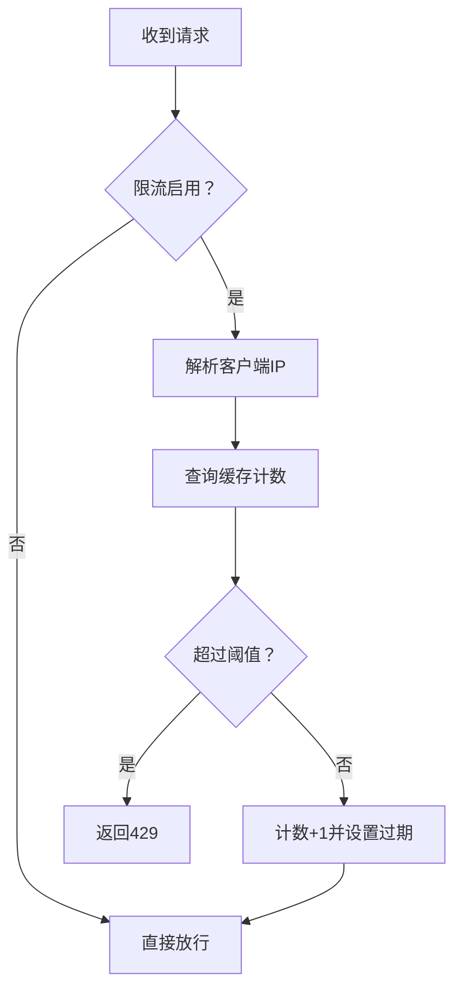
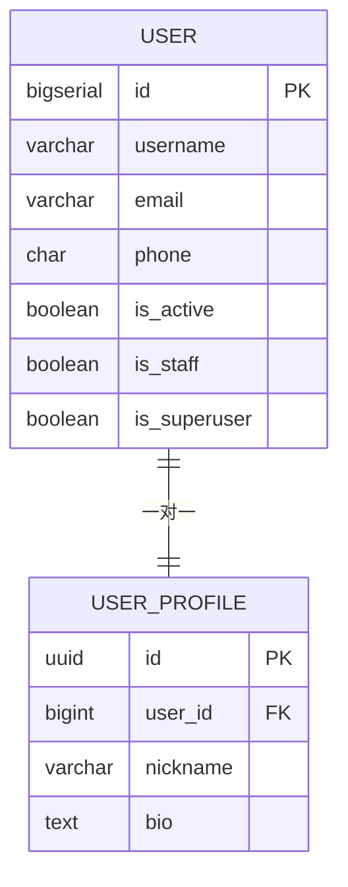
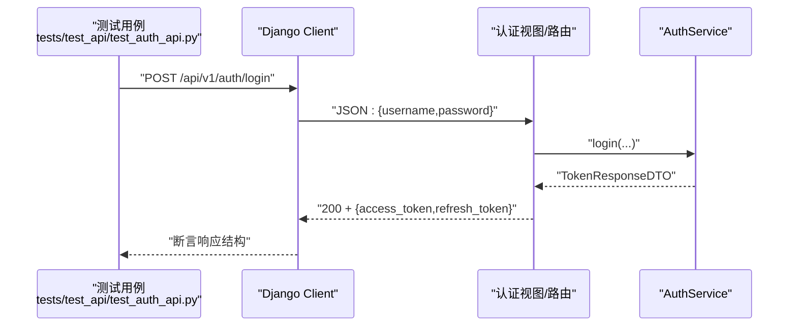
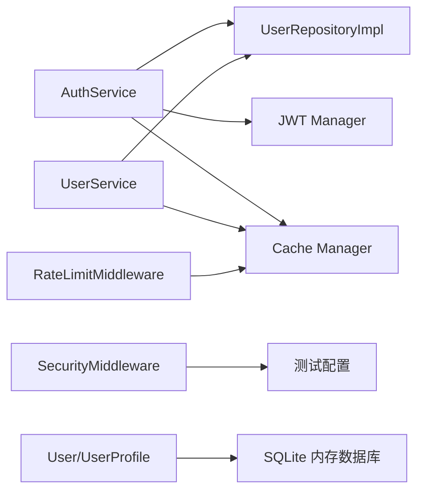

# 测试策略

<cite>
**本文引用的文件**
- [pyproject.toml](file://pyproject.toml)
- [.mypy.ini](file://.mypy.ini)
- [config/settings/testing.py](file://config/settings/testing.py)
- [tests/conftest.py](file://tests/conftest.py)
- [scripts/test.sh](file://scripts/test.sh)
- [tests/test_api/test_auth_api.py](file://tests/test_api/test_auth_api.py)
- [tests/test_services/test_auth_service.py](file://tests/test_services/test_auth_service.py)
- [tests/test_middlewares/test_rate_limit_middleware.py](file://tests/test_middlewares/test_rate_limit_middleware.py)
- [tests/test_models/test_user_models.py](file://tests/test_models/test_user_models.py)
- [src/application/services/auth_service.py](file://src/application/services/auth_service.py)
- [src/application/services/user_service.py](file://src/application/services/user_service.py)
- [src/core/middlewares/rate_limit_middleware.py](file://src/core/middlewares/rate_limit_middleware.py)
- [src/core/middlewares/security_middleware.py](file://src/core/middlewares/security_middleware.py)
- [src/infrastructure/persistence/models/user_models.py](file://src/infrastructure/persistence/models/user_models.py)
- [src/infrastructure/repositories/user_repo_impl.py](file://src/infrastructure/repositories/user_repo_impl.py)
</cite>

## 目录
1. [引言](#引言)
2. [项目结构与测试组织](#项目结构与测试组织)
3. [核心组件与测试金字塔](#核心组件与测试金字塔)
4. [架构总览](#架构总览)
5. [详细组件测试分析](#详细组件测试分析)
6. [依赖关系与耦合分析](#依赖关系与耦合分析)
7. [性能与压力测试指南](#性能与压力测试指南)
8. [测试覆盖率与质量度量](#测试覆盖率与质量度量)
9. [测试环境搭建与管理](#测试环境搭建与管理)
10. [测试自动化与CI/CD集成](#测试自动化与cicd集成)
11. [调试与问题定位](#调试与问题定位)
12. [结论](#结论)

## 引言
本文件面向“Hello-Django-Ninja-Api”项目，系统化阐述测试策略与实践，覆盖测试金字塔的三层设计（单元测试、集成测试、API 测试），并结合项目实际的 PyTest 配置、fixture 设计、测试数据准备、中间件与模型测试、服务层测试、覆盖率要求与分析、测试环境与数据库隔离、性能与压力测试、以及测试自动化与 CI/CD 集成等主题，帮助开发者建立稳定、可维护且高效的测试体系。

## 项目结构与测试组织
- 测试目录按职责分层组织：
  - tests/test_api：API 层接口测试（如认证）
  - tests/test_services：应用服务层单元测试（含 Mock）
  - tests/test_middlewares：中间件测试（速率限制、安全中间件）
  - tests/test_models：领域/ORM 模型测试（Django ORM）
- 核心配置与工具：
  - PyTest 配置与标记、覆盖率、异步模式、测试路径等集中在项目配置中
  - 测试环境配置使用独立 settings，确保数据库、缓存、速率限制等与开发/生产隔离
  - 通过 conftest 提供跨模块共享的 fixture（数据库迁移、用户/角色/权限数据）

图表来源
- [pyproject.toml:92-131](file://pyproject.toml#L92-L131)
- [config/settings/testing.py:1-32](file://config/settings/testing.py#L1-L32)
- [tests/conftest.py:1-64](file://tests/conftest.py#L1-L64)

章节来源
- [pyproject.toml:92-131](file://pyproject.toml#L92-L131)
- [config/settings/testing.py:1-32](file://config/settings/testing.py#L1-L32)
- [tests/conftest.py:1-64](file://tests/conftest.py#L1-L64)

## 核心组件与测试金字塔
- 单元测试（Unit Tests）：以服务层为主，使用 Mock 隔离外部依赖，验证业务逻辑分支与边界条件。例如认证服务、用户服务的登录/注册/刷新/登出、用户增删改查等。
- 集成测试（Integration Tests）：以中间件与数据库交互为主，验证限流、安全头等中间件行为，以及 Django ORM 模型的创建与关联。
- API 测试（API Tests）：通过 Django Client 发起请求，验证认证流程（登录、刷新）、错误场景（密码错误、用户不存在）等端到端行为。

章节来源
- [tests/test_services/test_auth_service.py:1-143](file://tests/test_services/test_auth_service.py#L1-L143)
- [tests/test_middlewares/test_rate_limit_middleware.py:1-76](file://tests/test_middlewares/test_rate_limit_middleware.py#L1-L76)
- [tests/test_models/test_user_models.py:1-82](file://tests/test_models/test_user_models.py#L1-L82)
- [tests/test_api/test_auth_api.py:1-87](file://tests/test_api/test_auth_api.py#L1-L87)

## 架构总览
下图展示测试金字塔中各层的典型调用链与依赖关系，体现从 API 到服务再到仓储/模型的分层解耦与测试策略：

图表来源
- [src/application/services/auth_service.py:20-233](file://src/application/services/auth_service.py#L20-L233)
- [src/application/services/user_service.py:15-172](file://src/application/services/user_service.py#L15-L172)
- [src/infrastructure/repositories/user_repo_impl.py:13-138](file://src/infrastructure/repositories/user_repo_impl.py#L13-L138)
- [src/infrastructure/persistence/models/user_models.py:12-147](file://src/infrastructure/persistence/models/user_models.py#L12-L147)
- [src/core/middlewares/rate_limit_middleware.py:15-112](file://src/core/middlewares/rate_limit_middleware.py#L15-L112)
- [src/core/middlewares/security_middleware.py:14-54](file://src/core/middlewares/security_middleware.py#L14-L54)

## 详细组件测试分析

### 认证服务测试（单元测试）
- 目标：验证 AuthService 的登录、注册、刷新、登出等核心流程，覆盖密码错误、用户不存在、非活跃用户、Token 生成与撤销等边界。
- 方法：通过 Mock 替换用户仓储、JWT 管理器、缓存，断言返回 DTO、调用链与异常抛出。
- 关键断言点：
  - 登录成功返回 TokenResponseDTO，包含 access_token、refresh_token、用户信息与过期时间
  - 密码错误/用户不存在返回空或抛错
  - 刷新 Token 时校验有效性并生成新 access_token
  - 登出后缓存清理与 Token 撤销

图表来源
- [tests/test_services/test_auth_service.py:23-143](file://tests/test_services/test_auth_service.py#L23-L143)
- [src/application/services/auth_service.py:26-111](file://src/application/services/auth_service.py#L26-L111)

章节来源
- [tests/test_services/test_auth_service.py:1-143](file://tests/test_services/test_auth_service.py#L1-L143)
- [src/application/services/auth_service.py:20-233](file://src/application/services/auth_service.py#L20-L233)

### 用户服务测试（单元测试）
- 目标：验证 UserService 的用户 CRUD、分页、密码变更、认证等逻辑，重点覆盖缓存命中/失效、重复性校验、异常处理。
- 方法：Mock 用户仓储与 RBAC 仓储、缓存，断言 DTO 转换、缓存读写、异常抛出。
- 关键断言点：
  - 创建用户前检查用户名/邮箱唯一性
  - 更新/删除用户后清理相关缓存
  - 认证失败与非活跃用户处理

图表来源
- [tests/test_services/test_user_service.py:23-112](file://tests/test_services/test_user_service.py#L23-L112)
- [src/application/services/user_service.py:28-149](file://src/application/services/user_service.py#L28-L149)

章节来源
- [tests/test_services/test_user_service.py:1-112](file://tests/test_services/test_user_service.py#L1-L112)
- [src/application/services/user_service.py:15-172](file://src/application/services/user_service.py#L15-L172)

### 速率限制中间件测试（单元测试）
- 目标：验证基于 IP 的限流逻辑，白名单 IP、超过阈值返回 429。
- 方法：使用 RequestFactory 构造请求，Mock 缓存 get/set，断言响应状态与内容。
- 关键断言点：
  - 当前请求次数小于阈值：放行
  - 超过阈值：返回 429 并提示“请求过于频繁”
  - 白名单 IP：绕过限流检查

图表来源
- [tests/test_middlewares/test_rate_limit_middleware.py:29-76](file://tests/test_middlewares/test_rate_limit_middleware.py#L29-L76)
- [src/core/middlewares/rate_limit_middleware.py:41-111](file://src/core/middlewares/rate_limit_middleware.py#L41-L111)

章节来源
- [tests/test_middlewares/test_rate_limit_middleware.py:1-76](file://tests/test_middlewares/test_rate_limit_middleware.py#L1-L76)
- [src/core/middlewares/rate_limit_middleware.py:15-112](file://src/core/middlewares/rate_limit_middleware.py#L15-L112)

### 安全中间件测试（概念性说明）
- 目标：验证非调试环境下响应头的安全设置（X-Content-Type-Options、X-Frame-Options、X-XSS-Protection、Strict-Transport-Security）。
- 实施建议：通过中间件拦截响应并断言响应头存在与值正确；可在集成测试中结合 API 层发起请求验证。

章节来源
- [src/core/middlewares/security_middleware.py:14-54](file://src/core/middlewares/security_middleware.py#L14-L54)

### 用户模型测试（模型层测试）
- 目标：验证 Django User 及 UserProfile 的创建、字符串表示、外键关联、自动创建档案等行为。
- 方法：使用 Django Client 或 ORM 直接创建，断言字段与关联关系。
- 关键断言点：
  - 创建普通用户/超级用户字段正确
  - 用户档案一对一关联、自动创建、字符串表示

图表来源
- [src/infrastructure/persistence/models/user_models.py:12-147](file://src/infrastructure/persistence/models/user_models.py#L12-L147)

章节来源
- [tests/test_models/test_user_models.py:1-82](file://tests/test_models/test_user_models.py#L1-L82)
- [src/infrastructure/persistence/models/user_models.py:12-147](file://src/infrastructure/persistence/models/user_models.py#L12-L147)

### 认证 API 测试（API 层测试）
- 目标：验证 /api/v1/auth 登录、刷新 Token 的端到端流程，覆盖成功与失败场景。
- 方法：使用 Django Client 发起 JSON 请求，断言状态码与响应结构。
- 关键断言点：
  - 登录成功返回 access_token 与 refresh_token
  - 密码错误返回 500（服务端错误）
  - 刷新 Token 成功生成新 access_token

图表来源
- [tests/test_api/test_auth_api.py:11-87](file://tests/test_api/test_auth_api.py#L11-L87)
- [src/application/services/auth_service.py:26-111](file://src/application/services/auth_service.py#L26-L111)

章节来源
- [tests/test_api/test_auth_api.py:1-87](file://tests/test_api/test_auth_api.py#L1-L87)
- [src/application/services/auth_service.py:20-233](file://src/application/services/auth_service.py#L20-L233)

## 依赖关系与耦合分析
- 服务层依赖仓储与基础设施组件（JWT、缓存、模型），测试通过 Mock 解耦，降低耦合度与执行成本。
- 中间件与配置（settings）耦合，测试通过设置测试环境配置与 Mock 缓存实现可控验证。
- ORM 模型测试依赖 Django 测试数据库，使用内存数据库与自动迁移确保隔离与一致性。

图表来源
- [src/application/services/auth_service.py:10-17](file://src/application/services/auth_service.py#L10-L17)
- [src/application/services/user_service.py:9-12](file://src/application/services/user_service.py#L9-L12)
- [src/core/middlewares/rate_limit_middleware.py:8-38](file://src/core/middlewares/rate_limit_middleware.py#L8-L38)
- [src/core/middlewares/security_middleware.py:8-31](file://src/core/middlewares/security_middleware.py#L8-L31)
- [config/settings/testing.py:10-31](file://config/settings/testing.py#L10-L31)

章节来源
- [src/application/services/auth_service.py:10-17](file://src/application/services/auth_service.py#L10-L17)
- [src/application/services/user_service.py:9-12](file://src/application/services/user_service.py#L9-L12)
- [src/core/middlewares/rate_limit_middleware.py:8-38](file://src/core/middlewares/rate_limit_middleware.py#L8-L38)
- [src/core/middlewares/security_middleware.py:8-31](file://src/core/middlewares/security_middleware.py#L8-L31)
- [config/settings/testing.py:10-31](file://config/settings/testing.py#L10-L31)

## 性能与压力测试指南
- 单元测试阶段：通过减少数据库与网络依赖（Mock）提升执行速度，适合高频回归。
- 集成测试阶段：对中间件限流、缓存命中/失效进行基准测试，评估阈值与过期策略。
- API 测试阶段：使用并发工具（如 Locust、Artillery）对登录/刷新等热点接口进行压力测试，观察 429/5xx 比例与 P95/P99 延迟。
- 建议指标：
  - 吞吐量（TPS/RPS）
  - 响应时间（P50/P95/P99）
  - 错误率（4xx/5xx）
  - 缓存命中率
- 资源隔离：使用测试环境数据库与独立 Redis，避免与生产流量互相影响。

## 测试覆盖率与质量度量
- 覆盖率配置：
  - PyTest 使用覆盖率插件，源代码范围限定为 src，忽略 migrations/tests/config/manage.py
  - 报告输出 HTML 与终端缺失行明细
- 质量度量建议：
  - 行覆盖率、分支覆盖率、函数/类覆盖率
  - 关注关键路径（认证、授权、缓存、限流）
  - 结合静态检查（Ruff、MyPy）与测试共同提升质量

章节来源
- [pyproject.toml:111-131](file://pyproject.toml#L111-L131)
- [.mypy.ini:1-45](file://.mypy.ini#L1-45)

## 测试环境搭建与管理
- 测试环境配置：
  - 使用 SQLite 内存数据库，禁用缓存，使用快速密码哈希器，关闭速率限制
- 数据库初始化：
  - 通过 PyTest fixture 在会话级自动执行迁移，保证测试前数据库结构就绪
- 测试数据准备：
  - 提供 user_data、admin_user_data、role_data、permission_data 等 fixture，便于复用
- 环境变量与命令：
  - 通过脚本统一运行测试，开启覆盖率与报告输出

章节来源
- [config/settings/testing.py:1-32](file://config/settings/testing.py#L1-L32)
- [tests/conftest.py:9-64](file://tests/conftest.py#L9-L64)
- [scripts/test.sh:1-14](file://scripts/test.sh#L1-L14)

## 测试自动化与CI/CD集成
- PyTest 配置：
  - 设置 DJANGO_SETTINGS_MODULE、测试路径、标记（unit/integration/slow）、异步模式等
- 覆盖率与报告：
  - 通过命令行参数启用覆盖率与 HTML 报告
- CI/CD 建议：
  - 触发条件：push/pr 触发测试矩阵（单元/集成/API）
  - 步骤：安装依赖 → 应用迁移 → 运行测试 → 生成覆盖率报告 → 上传报告
  - 缓存：缓存 pip/venv，加速构建
  - 失败保护：失败即停止后续步骤，保留报告 artifacts

章节来源
- [pyproject.toml:92-131](file://pyproject.toml#L92-L131)
- [scripts/test.sh:10-12](file://scripts/test.sh#L10-L12)

## 调试与问题定位
- 调试技巧：
  - 使用 pytest --tb=short 快速定位异常堆栈
  - 在复杂流程（认证/刷新）中拆分断言，逐步缩小范围
  - 对 Mock 的调用进行断言（assert_called_once_with），确认调用顺序与参数
- 常见问题：
  - 速率限制导致 429：检查缓存键、过期时间与阈值
  - 认证失败：核对用户状态、密码哈希、Token 生成与存储
  - 模型测试失败：确认迁移是否执行、字段约束与索引
- 工具与配置：
  - Ruff、MyPy 作为静态检查，提前发现潜在问题
  - 测试报告与覆盖率 HTML 页面便于可视化分析

章节来源
- [pyproject.toml:92-109](file://pyproject.toml#L92-L109)
- [.mypy.ini:1-45](file://.mypy.ini#L1-45)

## 结论
本项目采用清晰的测试金字塔：以单元测试为核心，配合中间件与模型的集成测试，以及 API 端到端测试，形成完整闭环。通过 PyTest 配置、Mock 设计、测试数据 fixture、测试环境隔离与覆盖率分析，能够有效保障功能正确性与质量稳定性。建议在 CI/CD 中固化测试流程，持续产出覆盖率报告，结合性能与压力测试，进一步提升系统的可靠性与可维护性。