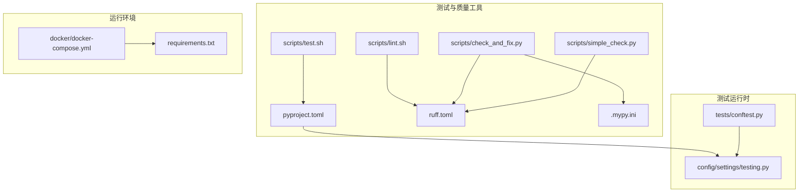
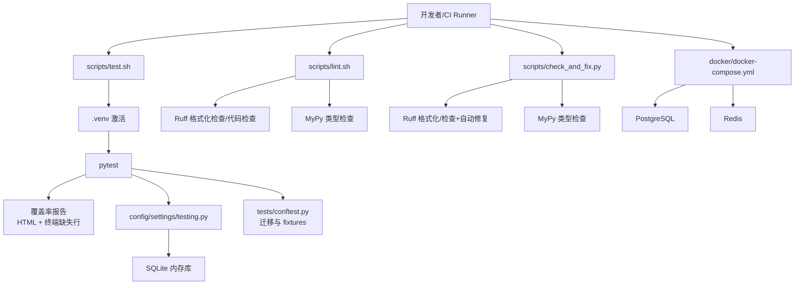
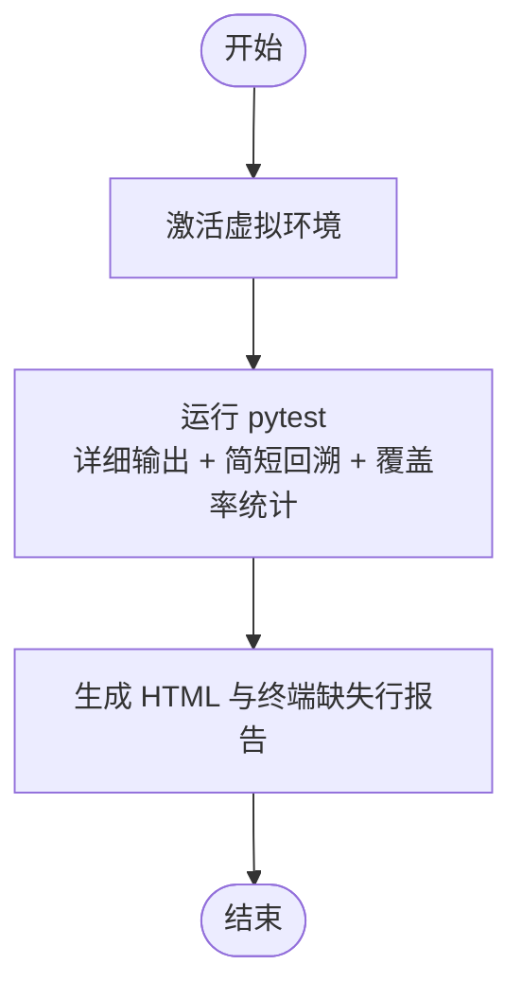
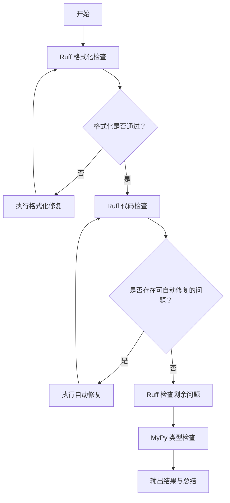
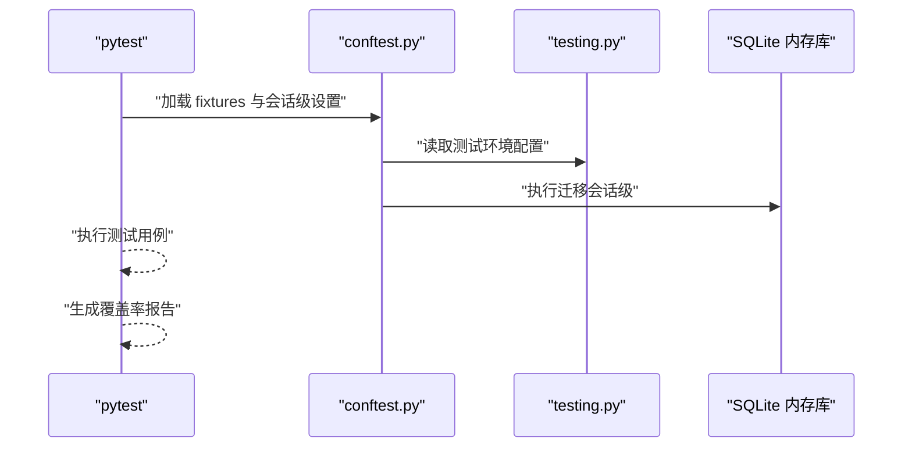
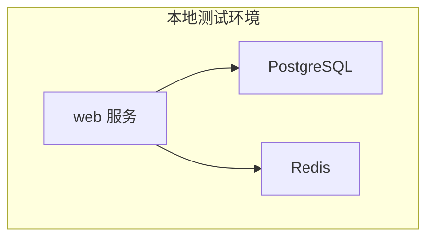
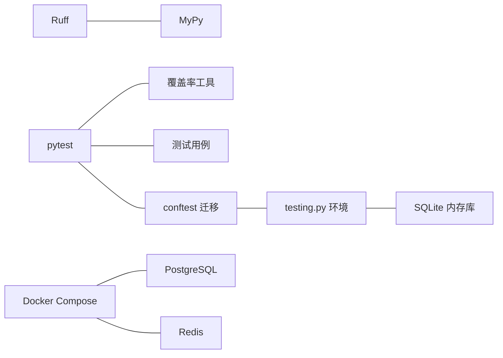

# 测试自动化与CI/CD

<cite>
**本文引用的文件**
- [scripts/test.sh](file://scripts/test.sh)
- [scripts/check_and_fix.py](file://scripts/check_and_fix.py)
- [scripts/simple_check.py](file://scripts/simple_check.py)
- [scripts/lint.sh](file://scripts/lint.sh)
- [config/settings/testing.py](file://config/settings/testing.py)
- [pyproject.toml](file://pyproject.toml)
- [.mypy.ini](file://.mypy.ini)
- [ruff.toml](file://ruff.toml)
- [requirements.txt](file://requirements.txt)
- [docker/docker-compose.yml](file://docker/docker-compose.yml)
- [tests/conftest.py](file://tests/conftest.py)
- [docs/DEVELOPMENT.md](file://docs/DEVELOPMENT.md)
- [scripts/setup_dev.sh](file://scripts/setup_dev.sh)
</cite>

## 目录
1. [简介](#简介)
2. [项目结构](#项目结构)
3. [核心组件](#核心组件)
4. [架构总览](#架构总览)
5. [详细组件分析](#详细组件分析)
6. [依赖分析](#依赖分析)
7. [性能考虑](#性能考虑)
8. [故障排查指南](#故障排查指南)
9. [结论](#结论)
10. [附录](#附录)

## 简介
本文件面向测试自动化与持续集成/持续交付（CI/CD）场景，系统梳理本项目的测试执行策略、代码质量检查工具链、Lint 规则与修复流程、测试报告生成与发布、测试环境自动化部署以及失败诊断与性能优化建议。文档以仓库现有脚本与配置为依据，提供可落地的实践说明与可视化图示。

## 项目结构
围绕测试与质量保障的关键目录与文件如下：
- 脚本与工具
  - scripts/test.sh：本地测试执行入口，启用虚拟环境并运行 pytest，生成覆盖率报告
  - scripts/lint.sh：本地代码规范检查脚本，调用 Ruff 格式化检查、Ruff 代码检查与 MyPy 类型检查
  - scripts/check_and_fix.py：统一的代码检查与自动修复流程（Ruff + MyPy），支持 Windows 终端编码适配
  - scripts/simple_check.py：轻量级检查脚本（Ruff + MyPy），便于快速验证
  - scripts/setup_dev.sh：开发环境初始化脚本，包含依赖安装、格式化、检查、类型检查与测试执行
- 测试配置与环境
  - config/settings/testing.py：测试环境专用配置（SQLite 内存库、禁用缓存、快速密码哈希器、关闭速率限制等）
  - tests/conftest.py：pytest 会话级数据库迁移与常用 fixtures
  - pyproject.toml：pytest、Ruff、MyPy、覆盖率等工具的集中配置
  - .mypy.ini：MyPy 的额外配置覆盖
  - ruff.toml：Ruff 的规则选择、忽略项与格式化策略
- 运行时与依赖
  - requirements.txt：生产与开发依赖清单
  - docker/docker-compose.yml：本地测试环境（PostgreSQL + Redis）编排

图表来源
- [scripts/test.sh:1-14](file://scripts/test.sh#L1-L14)
- [scripts/lint.sh:1-23](file://scripts/lint.sh#L1-L23)
- [scripts/check_and_fix.py:1-67](file://scripts/check_and_fix.py#L1-L67)
- [scripts/simple_check.py:1-46](file://scripts/simple_check.py#L1-L46)
- [pyproject.toml:1-131](file://pyproject.toml#L1-L131)
- [ruff.toml:1-54](file://ruff.toml#L1-L54)
- [.mypy.ini:1-45](file://.mypy.ini#L1-L45)
- [config/settings/testing.py:1-32](file://config/settings/testing.py#L1-L32)
- [tests/conftest.py:1-66](file://tests/conftest.py#L1-L66)
- [docker/docker-compose.yml:1-47](file://docker/docker-compose.yml#L1-L47)
- [requirements.txt:1-38](file://requirements.txt#L1-L38)

章节来源
- [scripts/test.sh:1-14](file://scripts/test.sh#L1-L14)
- [scripts/lint.sh:1-23](file://scripts/lint.sh#L1-L23)
- [scripts/check_and_fix.py:1-67](file://scripts/check_and_fix.py#L1-L67)
- [scripts/simple_check.py:1-46](file://scripts/simple_check.py#L1-L46)
- [config/settings/testing.py:1-32](file://config/settings/testing.py#L1-L32)
- [pyproject.toml:1-131](file://pyproject.toml#L1-L131)
- [.mypy.ini:1-45](file://.mypy.ini#L1-L45)
- [ruff.toml:1-54](file://ruff.toml#L1-L54)
- [docker/docker-compose.yml:1-47](file://docker/docker-compose.yml#L1-L47)
- [requirements.txt:1-38](file://requirements.txt#L1-L38)
- [tests/conftest.py:1-66](file://tests/conftest.py#L1-L66)
- [docs/DEVELOPMENT.md:1-227](file://docs/DEVELOPMENT.md#L1-L227)
- [scripts/setup_dev.sh:1-47](file://scripts/setup_dev.sh#L1-L47)

## 核心组件
- 测试执行与报告
  - 本地测试脚本：激活虚拟环境，运行 pytest 并生成 HTML 与终端缺失行报告
  - 测试环境配置：SQLite 内存库、禁用缓存、快速密码哈希器、关闭速率限制，提升测试速度与稳定性
  - pytest 配置：严格标记与配置、测试路径、自定义标记、异步模式等
- 代码质量检查与 Lint
  - Ruff：规则选择、忽略项、导入排序、格式化策略；提供格式化检查、代码检查与自动修复
  - MyPy：类型检查配置，结合 django-stubs 插件支持 Django 项目
- 测试环境自动化
  - Docker Compose：一键拉起 PostgreSQL 与 Redis，供本地或 CI 使用
  - 开发初始化脚本：自动安装依赖、格式化、检查、类型检查与测试执行

章节来源
- [scripts/test.sh:1-14](file://scripts/test.sh#L1-L14)
- [config/settings/testing.py:1-32](file://config/settings/testing.py#L1-L32)
- [pyproject.toml:92-131](file://pyproject.toml#L92-L131)
- [ruff.toml:1-54](file://ruff.toml#L1-L54)
- [.mypy.ini:1-45](file://.mypy.ini#L1-L45)
- [docker/docker-compose.yml:1-47](file://docker/docker-compose.yml#L1-L47)
- [scripts/setup_dev.sh:1-47](file://scripts/setup_dev.sh#L1-L47)

## 架构总览
下图展示从本地到 CI 的测试与质量检查流水线，涵盖脚本、工具链与测试运行时的关系。

图表来源
- [scripts/test.sh:1-14](file://scripts/test.sh#L1-L14)
- [scripts/lint.sh:1-23](file://scripts/lint.sh#L1-L23)
- [scripts/check_and_fix.py:1-67](file://scripts/check_and_fix.py#L1-L67)
- [config/settings/testing.py:1-32](file://config/settings/testing.py#L1-L32)
- [tests/conftest.py:1-66](file://tests/conftest.py#L1-L66)
- [docker/docker-compose.yml:1-47](file://docker/docker-compose.yml#L1-L47)

## 详细组件分析

### 测试脚本 test.sh
- 功能概述
  - 激活虚拟环境，运行 pytest，启用详细输出、简短回溯、覆盖率统计与报告生成
  - 输出报告位置提示，便于定位覆盖率报告
- 关键行为
  - 虚拟环境激活与测试执行分离，保证隔离性
  - 覆盖率报告同时输出 HTML 与终端缺失行，兼顾可视化与快速审阅
- 使用建议
  - 在 CI 中可直接调用该脚本，或在本地开发机上作为一键测试入口

图表来源
- [scripts/test.sh:1-14](file://scripts/test.sh#L1-L14)

章节来源
- [scripts/test.sh:1-14](file://scripts/test.sh#L1-L14)

### 代码质量检查与 Lint 工具链
- Ruff 配置与规则
  - 规则集合：pycodestyle、pyflakes、isort、pep8-naming、flake8-* 等
  - 忽略项：行长、复杂度、裸异常等，针对测试与迁移文件进行放宽
  - 导入排序：区分 first-party/third-party/local
  - 格式化：双引号、缩进、换行等策略
- MyPy 配置
  - Django 支持：django-stubs 插件与 settings 模块配置
  - 严格性：可按需调整严格级别，忽略迁移与测试模块的类型错误
- 脚本化检查
  - lint.sh：Shell 脚本，顺序执行格式化检查、代码检查与类型检查
  - check_and_fix.py：Python 脚本，统一执行格式化、检查与自动修复，并进行剩余问题提示
  - simple_check.py：轻量级检查，适合快速验证

图表来源
- [scripts/lint.sh:1-23](file://scripts/lint.sh#L1-L23)
- [scripts/check_and_fix.py:1-67](file://scripts/check_and_fix.py#L1-L67)
- [scripts/simple_check.py:1-46](file://scripts/simple_check.py#L1-L46)
- [ruff.toml:1-54](file://ruff.toml#L1-L54)
- [.mypy.ini:1-45](file://.mypy.ini#L1-L45)

章节来源
- [scripts/lint.sh:1-23](file://scripts/lint.sh#L1-L23)
- [scripts/check_and_fix.py:1-67](file://scripts/check_and_fix.py#L1-L67)
- [scripts/simple_check.py:1-46](file://scripts/simple_check.py#L1-L46)
- [ruff.toml:1-54](file://ruff.toml#L1-L54)
- [.mypy.ini:1-45](file://.mypy.ini#L1-L45)

### 测试环境与运行时
- 测试环境配置
  - SQLite 内存库：速度快、无需外部依赖
  - 禁用缓存：避免缓存对测试的影响
  - 快速密码哈希器：加速认证相关测试
  - 关闭速率限制：避免限流干扰测试
- pytest 配置
  - 严格标记与配置、测试路径、自定义标记（单元/集成/慢测试）
  - 异步模式自动，便于异步测试
- conftest 配置
  - 会话级数据库迁移，确保测试前数据库状态一致
  - 常用 fixtures：User、用户数据、管理员数据、角色与权限数据

图表来源
- [tests/conftest.py:1-66](file://tests/conftest.py#L1-L66)
- [config/settings/testing.py:1-32](file://config/settings/testing.py#L1-L32)

章节来源
- [config/settings/testing.py:1-32](file://config/settings/testing.py#L1-L32)
- [pyproject.toml:92-131](file://pyproject.toml#L92-L131)
- [tests/conftest.py:1-66](file://tests/conftest.py#L1-L66)

### 测试报告生成与发布
- 报告类型
  - HTML 报告：直观展示覆盖率分布
  - 终端缺失行报告：快速定位未覆盖代码
- 生成方式
  - 通过 test.sh 调用 pytest 的覆盖率选项生成报告
- 发布建议
  - 在 CI 中将 htmlcov 目录作为 artifact 上传，便于在线查看
  - 结合覆盖率阈值策略，在 CI 中失败阈值触发

章节来源
- [scripts/test.sh:1-14](file://scripts/test.sh#L1-L14)
- [pyproject.toml:111-131](file://pyproject.toml#L111-L131)

### 测试环境自动化部署与管理
- Docker Compose
  - 提供 PostgreSQL 与 Redis 服务，便于与生产相近的测试环境
  - 端口映射与持久化卷，便于调试与数据保留
- 开发初始化脚本
  - 自动安装依赖、格式化、检查、类型检查与测试执行，减少手工步骤

图表来源
- [docker/docker-compose.yml:1-47](file://docker/docker-compose.yml#L1-L47)
- [scripts/setup_dev.sh:1-47](file://scripts/setup_dev.sh#L1-L47)

章节来源
- [docker/docker-compose.yml:1-47](file://docker/docker-compose.yml#L1-L47)
- [scripts/setup_dev.sh:1-47](file://scripts/setup_dev.sh#L1-L47)

### CI/CD 管道中的测试配置（概念性说明）
- GitHub Actions/GitLab CI 集成思路
  - 步骤拆分：安装依赖 → 代码检查（Ruff + MyPy）→ 测试执行（pytest + 覆盖率）→ 产物上传（HTML 报告）
  - 环境准备：使用 Python 3.10.11，复用 requirements.txt 或 pyproject.toml 的 dev 依赖
  - 并行策略：按测试类别分组并行执行，结合 Docker Compose 提供外部依赖
- 参数与配置
  - 严格遵循 pyproject.toml 中的 pytest 与覆盖率配置
  - 将覆盖率阈值纳入 CI 失败条件，确保质量门槛

[本节为概念性说明，不直接分析具体文件，故无“章节来源”]

## 依赖分析
- 工具链耦合
  - Ruff 与 MyPy 独立但互补：前者负责风格与静态问题，后者负责类型安全
  - pytest 与覆盖率工具解耦，可通过命令行参数灵活组合
- 测试运行时依赖
  - 测试环境配置与 conftest 的迁移逻辑强耦合，确保测试一致性
  - Docker Compose 为外部依赖提供稳定基座，降低本地环境差异

图表来源
- [pyproject.toml:92-131](file://pyproject.toml#L92-L131)
- [ruff.toml:1-54](file://ruff.toml#L1-L54)
- [.mypy.ini:1-45](file://.mypy.ini#L1-L45)
- [config/settings/testing.py:1-32](file://config/settings/testing.py#L1-L32)
- [tests/conftest.py:1-66](file://tests/conftest.py#L1-L66)
- [docker/docker-compose.yml:1-47](file://docker/docker-compose.yml#L1-L47)

章节来源
- [pyproject.toml:92-131](file://pyproject.toml#L92-L131)
- [ruff.toml:1-54](file://ruff.toml#L1-L54)
- [.mypy.ini:1-45](file://.mypy.ini#L1-L45)
- [config/settings/testing.py:1-32](file://config/settings/testing.py#L1-L32)
- [tests/conftest.py:1-66](file://tests/conftest.py#L1-L66)
- [docker/docker-compose.yml:1-47](file://docker/docker-compose.yml#L1-L47)

## 性能考虑
- 测试性能优化
  - 使用 SQLite 内存库与禁用缓存，减少 IO 与状态开销
  - 快速密码哈希器与关闭速率限制，缩短认证与限流相关测试时间
  - 将慢测试标记为慢测试，便于在 CI 中单独调度或跳过
- 并行执行
  - pytest 支持并发执行（如使用 xdist 插件），可在 CI 中按测试类别分组并行
  - Docker Compose 提供稳定的外部依赖并行环境

[本节提供一般性指导，不直接分析具体文件，故无“章节来源”]

## 故障排查指南
- 测试失败
  - 检查测试环境配置是否正确加载（testing.py）
  - 确认 conftest 的迁移是否成功执行
  - 查看覆盖率报告定位未覆盖区域
- 代码检查失败
  - 使用 lint.sh 或 check_and_fix.py 逐项修复
  - 对于 Ruff 无法自动修复的问题，参考规则配置进行手动修正
- 环境问题
  - 使用 Docker Compose 启动 PostgreSQL 与 Redis
  - 开发初始化脚本可一键完成依赖安装、格式化、检查与测试

章节来源
- [config/settings/testing.py:1-32](file://config/settings/testing.py#L1-L32)
- [tests/conftest.py:1-66](file://tests/conftest.py#L1-L66)
- [scripts/lint.sh:1-23](file://scripts/lint.sh#L1-L23)
- [scripts/check_and_fix.py:1-67](file://scripts/check_and_fix.py#L1-L67)
- [docker/docker-compose.yml:1-47](file://docker/docker-compose.yml#L1-L47)
- [scripts/setup_dev.sh:1-47](file://scripts/setup_dev.sh#L1-L47)

## 结论
本项目通过统一的脚本与配置，构建了从本地到 CI 的完整测试与质量保障闭环：Ruff + MyPy 的静态检查确保代码规范与类型安全，pytest + 覆盖率工具提供可靠的测试执行与可视化报告，SQLite 内存库与 Docker Compose 降低了测试环境复杂度。建议在 CI 中延续相同的检查与测试流程，并引入覆盖率阈值与并行执行策略，进一步提升效率与质量。

## 附录
- 参考文档与使用示例
  - 开发指南：包含 Ruff、MyPy、pytest 的使用示例与 Docker 部署说明
  - requirements.txt：明确生产与开发依赖，便于在 CI 中复用

章节来源
- [docs/DEVELOPMENT.md:1-227](file://docs/DEVELOPMENT.md#L1-L227)
- [requirements.txt:1-38](file://requirements.txt#L1-L38)