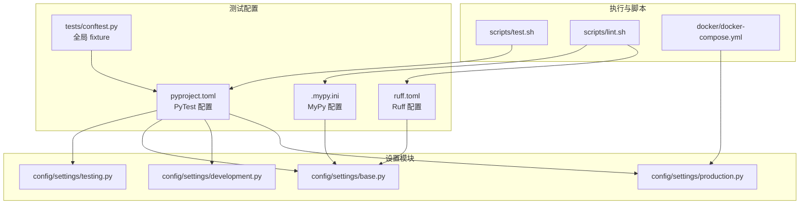
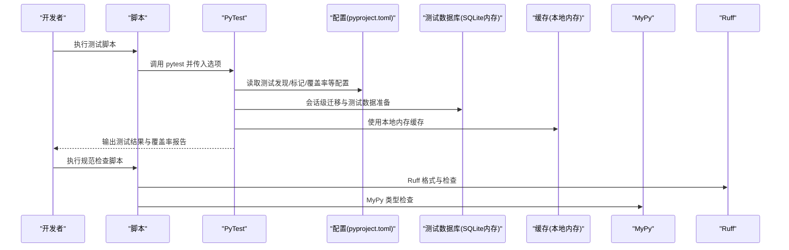
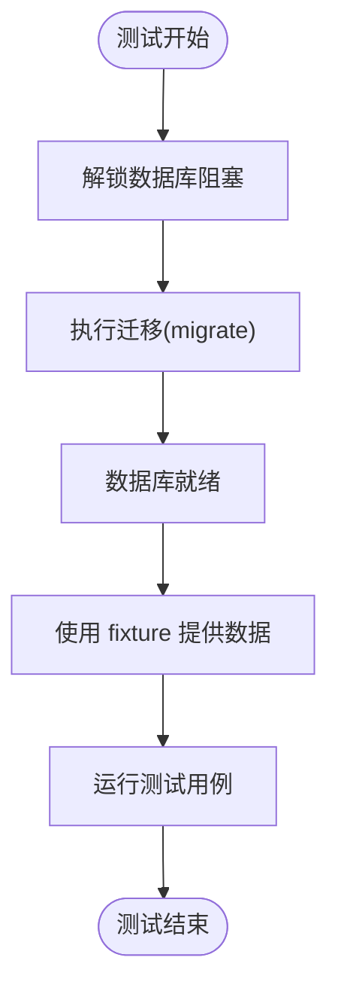
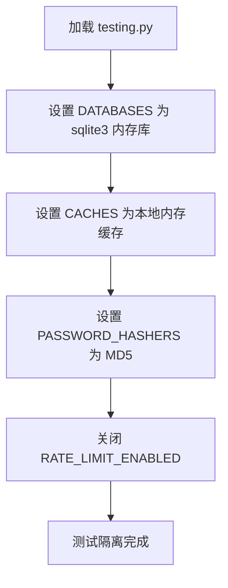
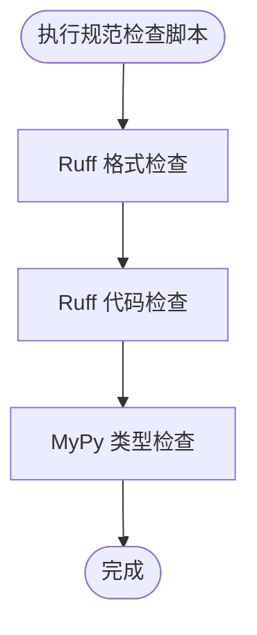
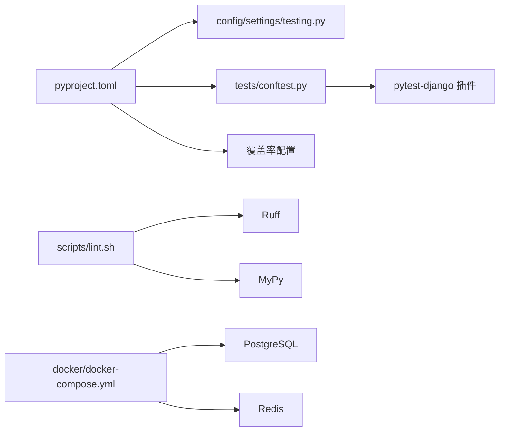

# 测试配置与环境

<cite>
**本文引用的文件**
- [pyproject.toml](file://pyproject.toml)
- [.mypy.ini](file://.mypy.ini)
- [ruff.toml](file://ruff.toml)
- [tests/conftest.py](file://tests/conftest.py)
- [config/settings/testing.py](file://config/settings/testing.py)
- [config/settings/base.py](file://config/settings/base.py)
- [config/settings/development.py](file://config/settings/development.py)
- [config/settings/production.py](file://config/settings/production.py)
- [scripts/test.sh](file://scripts/test.sh)
- [scripts/lint.sh](file://scripts/lint.sh)
- [docker/docker-compose.yml](file://docker/docker-compose.yml)
- [tests/test_api/test_auth_api.py](file://tests/test_api/test_auth_api.py)
- [tests/test_models/test_user_models.py](file://tests/test_models/test_user_models.py)
</cite>

## 目录
1. [引言](#引言)
2. [项目结构](#项目结构)
3. [核心组件](#核心组件)
4. [架构总览](#架构总览)
5. [详细组件分析](#详细组件分析)
6. [依赖分析](#依赖分析)
7. [性能考虑](#性能考虑)
8. [故障排查指南](#故障排查指南)
9. [结论](#结论)
10. [附录](#附录)

## 引言
本文件系统性梳理本项目的测试配置与环境管理，覆盖以下主题：
- PyTest 配置文件结构与选项：测试发现规则、插件配置、命令行参数、覆盖率与标记。
- conftest.py 与 fixture 设计原则：全局与局部 fixture 的作用域与复用。
- 测试数据库配置与隔离：SQLite 内存库、缓存禁用、密码哈希器、速率限制关闭。
- 测试数据准备与管理：fixture 的设计、命名与复用策略。
- 测试环境变量与配置：数据库连接、缓存、Redis、JWT、限流等。
- 静态代码分析在测试中的应用：MyPy 类型检查与 Ruff 代码格式化。
- 测试报告生成与分析：覆盖率 HTML 报告与终端缺失信息报告。
- CI/CD 环境中的测试配置与执行策略：容器化依赖与脚本化执行。

## 项目结构
本项目采用分层组织方式，测试相关的关键位置如下：
- 测试入口与配置：tests/ 目录包含测试用例与全局 conftest.py；PyTest 主配置位于 pyproject.toml 的 tool.pytest.ini_options。
- 设置模块：config/settings/ 下包含 base.py、development.py、production.py、testing.py，分别对应基础、开发、生产与测试环境配置。
- 静态检查：.mypy.ini 与 ruff.toml 提供 MyPy 与 Ruff 的配置。
- 执行脚本：scripts/test.sh 与 scripts/lint.sh 提供测试与规范检查的便捷入口。
- 容器化依赖：docker/docker-compose.yml 提供数据库与缓存服务的容器化支持。

图表来源
- [pyproject.toml:92-109](file://pyproject.toml#L92-L109)
- [tests/conftest.py:1-66](file://tests/conftest.py#L1-L66)
- [.mypy.ini:1-45](file://.mypy.ini#L1-L45)
- [ruff.toml:1-54](file://ruff.toml#L1-L54)
- [config/settings/testing.py:1-32](file://config/settings/testing.py#L1-L32)
- [config/settings/base.py:1-235](file://config/settings/base.py#L1-L235)
- [scripts/test.sh:1-14](file://scripts/test.sh#L1-L14)
- [scripts/lint.sh:1-23](file://scripts/lint.sh#L1-L23)
- [docker/docker-compose.yml:1-47](file://docker/docker-compose.yml#L1-L47)

章节来源
- [pyproject.toml:92-109](file://pyproject.toml#L92-L109)
- [tests/conftest.py:1-66](file://tests/conftest.py#L1-L66)
- [config/settings/testing.py:1-32](file://config/settings/testing.py#L1-L32)
- [config/settings/base.py:1-235](file://config/settings/base.py#L1-L235)
- [scripts/test.sh:1-14](file://scripts/test.sh#L1-L14)
- [scripts/lint.sh:1-23](file://scripts/lint.sh#L1-L23)
- [docker/docker-compose.yml:1-47](file://docker/docker-compose.yml#L1-L47)

## 核心组件
- PyTest 配置与发现规则
  - 测试发现：通过 python_files、python_classes、python_functions 控制文件与类/函数匹配模式。
  - 插件与异步：启用 pytest-django、pytest-asyncio，设置 asyncio_mode。
  - 命令行默认参数：严格标记与配置、简短回溯、显示未捕获异常。
  - 覆盖率：覆盖源码目录，忽略迁移、测试、配置与管理脚本。
  - 标记：unit、integration、slow 三类标记便于选择性执行。
- conftest.py 与 fixture
  - 会话级数据库迁移：在 django_db_blocker 解锁期间执行 migrate，确保测试数据库一致性。
  - 模型与数据 fixture：User 模型、user_data、admin_user_data、role_data、permission_data 等。
  - 可扩展：db_setup 空 fixture 作为占位，便于按需扩展。
- 测试环境配置（testing.py）
  - 数据库：SQLite 内存库，提升速度与隔离性。
  - 缓存：本地内存缓存，避免持久化影响。
  - 密码：MD5 快速哈希器，加速测试。
  - 限流：关闭速率限制，避免干扰测试。
- 静态检查
  - MyPy：启用严格可选与未类型化警告，集成 django-stubs。
  - Ruff：统一风格与规则集，针对测试文件放宽部分规则以提升可读性。
- 执行脚本
  - 测试：pytest 带详细输出、覆盖率与 HTML 报告。
  - 规范检查：Ruff 格式检查、Ruff 代码检查、MyPy 类型检查。

章节来源
- [pyproject.toml:92-131](file://pyproject.toml#L92-L131)
- [tests/conftest.py:10-66](file://tests/conftest.py#L10-L66)
- [config/settings/testing.py:10-32](file://config/settings/testing.py#L10-L32)
- [.mypy.ini:1-45](file://.mypy.ini#L1-L45)
- [ruff.toml:1-54](file://ruff.toml#L1-L54)
- [scripts/test.sh:10-14](file://scripts/test.sh#L10-L14)
- [scripts/lint.sh:10-21](file://scripts/lint.sh#L10-L21)

## 架构总览
下图展示测试执行链路与配置交互关系：

图表来源
- [scripts/test.sh:10-14](file://scripts/test.sh#L10-L14)
- [pyproject.toml:92-131](file://pyproject.toml#L92-L131)
- [config/settings/testing.py:10-32](file://config/settings/testing.py#L10-L32)
- [scripts/lint.sh:10-21](file://scripts/lint.sh#L10-L21)

## 详细组件分析

### PyTest 配置与命令行参数
- 测试发现规则
  - python_files：匹配 test_*.py 与 *_test.py。
  - python_classes：匹配 Test*。
  - python_functions：匹配 test_*。
- 插件与异步
  - pytest-django：Django 测试支持。
  - pytest-asyncio：异步测试支持。
  - asyncio_mode：自动模式。
- 命令行默认参数
  - strict-markers：未声明标记时报错。
  - strict-config：严格配置检查。
  - tb=short：简短回溯。
  - ra：显示未捕获异常。
- 覆盖率
  - source：仅统计 src。
  - omit：忽略 migrations、tests、config 与 manage.py。
- 标记
  - unit、integration、slow：便于分层执行与过滤。
- 设置模块
  - DJANGO_SETTINGS_MODULE：指向 config.settings.testing。

章节来源
- [pyproject.toml:92-109](file://pyproject.toml#L92-L109)
- [pyproject.toml:111-131](file://pyproject.toml#L111-L131)

### conftest.py 与 fixture 设计
- 会话级数据库迁移
  - 在 django_db_blocker 解锁期间执行 migrate，保证测试数据库结构一致。
- 模型与数据 fixture
  - User：返回 Django 用户模型类型。
  - user_data/admin_user_data：标准测试用户与管理员用户数据字典。
  - role_data/permission_data：RBAC 测试所需的基础数据。
- 可扩展性
  - db_setup 占位 fixture，便于后续按需扩展。

图表来源
- [tests/conftest.py:10-16](file://tests/conftest.py#L10-L16)

章节来源
- [tests/conftest.py:10-66](file://tests/conftest.py#L10-L66)

### 测试数据库配置与隔离
- 数据库引擎与名称：sqlite3 与内存数据库，确保每次测试独立且快速。
- 缓存：本地内存缓存，避免持久化影响。
- 密码哈希器：MD5 快速哈希器，加速测试。
- 速率限制：关闭，避免请求被限流。
- 与生产/开发差异：开发使用磁盘 SQLite，生产使用 PostgreSQL；测试使用内存 SQLite。

图表来源
- [config/settings/testing.py:10-32](file://config/settings/testing.py#L10-L32)

章节来源
- [config/settings/testing.py:10-32](file://config/settings/testing.py#L10-L32)
- [config/settings/base.py:77-88](file://config/settings/base.py#L77-L88)
- [config/settings/development.py:10-16](file://config/settings/development.py#L10-L16)
- [config/settings/production.py:12-23](file://config/settings/production.py#L12-L23)

### 测试数据准备与管理
- fixture 设计原则
  - 明确职责：每个 fixture 专注于单一数据或对象。
  - 可复用：user_data、admin_user_data、role_data、permission_data 可跨用例复用。
  - 可扩展：新增数据类型时，遵循现有命名与结构。
- 示例用法
  - 测试认证 API：使用 user_data 创建用户并进行登录与刷新 Token 测试。
  - 测试用户模型：使用 user_data 与 admin_user_data 验证创建、权限与字符串表示。

章节来源
- [tests/conftest.py:32-66](file://tests/conftest.py#L32-L66)
- [tests/test_api/test_auth_api.py:23-87](file://tests/test_api/test_auth_api.py#L23-L87)
- [tests/test_models/test_user_models.py:17-82](file://tests/test_models/test_user_models.py#L17-L82)

### 测试环境变量与配置
- Django 设置模块
  - DJANGO_SETTINGS_MODULE 指向 testing.py，确保测试使用测试环境配置。
- 数据库连接
  - testing.py 使用 sqlite3 内存库；base.py 支持从环境变量读取数据库配置，开发使用磁盘 SQLite，生产使用 PostgreSQL。
- 缓存与 Redis
  - testing.py 使用本地内存缓存；base.py 使用 Redis 缓存，支持从环境变量读取主机、端口与数据库。
- JWT 与限流
  - base.py 提供 JWT 默认配置；testing.py 关闭速率限制。
- CORS 与安全
  - base.py 在非调试模式下启用更严格的安全设置；development.py 开启 CORS 允许所有来源。

章节来源
- [pyproject.toml:92-94](file://pyproject.toml#L92-L94)
- [config/settings/base.py:77-88](file://config/settings/base.py#L77-L88)
- [config/settings/base.py:153-163](file://config/settings/base.py#L153-L163)
- [config/settings/base.py:137-151](file://config/settings/base.py#L137-L151)
- [config/settings/base.py:228-235](file://config/settings/base.py#L228-L235)
- [config/settings/development.py:7-24](file://config/settings/development.py#L7-L24)
- [config/settings/production.py:9-39](file://config/settings/production.py#L9-L39)
- [config/settings/testing.py:7-32](file://config/settings/testing.py#L7-L32)

### 静态代码分析在测试中的应用
- MyPy 类型检查
  - .mypy.ini 启用严格可选与未类型化警告，集成 django-stubs，忽略 migrations、config 与第三方模块的类型错误。
- Ruff 代码格式化与检查
  - ruff.toml 统一风格与规则集，针对测试文件放宽部分规则（如断言、裸异常），迁移与配置文件做特殊处理。
- 脚本化执行
  - scripts/lint.sh 依次执行 Ruff 格式检查、Ruff 代码检查与 MyPy 类型检查。

图表来源
- [scripts/lint.sh:10-21](file://scripts/lint.sh#L10-L21)
- [.mypy.ini:19-45](file://.mypy.ini#L19-L45)
- [ruff.toml:7-54](file://ruff.toml#L7-L54)

章节来源
- [.mypy.ini:1-45](file://.mypy.ini#L1-L45)
- [ruff.toml:1-54](file://ruff.toml#L1-L54)
- [scripts/lint.sh:10-21](file://scripts/lint.sh#L10-L21)

### 测试报告生成与分析
- 覆盖率报告
  - scripts/test.sh 使用 --cov=src 与 --cov-report=html 生成 HTML 报告，同时输出终端缺失信息报告。
- PyTest 报告
  - 通过 addopts 的 -v 与 --tb=short 获取详细输出与简短回溯。
- 分析建议
  - 结合 HTML 报告定位未覆盖路径，结合终端输出快速定位失败用例。

章节来源
- [pyproject.toml:111-118](file://pyproject.toml#L111-L118)
- [scripts/test.sh:10-14](file://scripts/test.sh#L10-L14)

### CI/CD 环境中的测试配置与执行策略
- 容器化依赖
  - docker/docker-compose.yml 提供 web、db（PostgreSQL）与 redis 服务，便于在 CI 环境中复现依赖。
- 环境变量
  - web 服务暴露数据库与缓存连接参数，CI 可通过环境变量注入。
- 执行策略
  - 建议在 CI 中先执行规范检查（Ruff + MyPy），再执行测试（含覆盖率），最后生成报告。
  - 对于需要外部依赖的测试，优先使用 docker-compose 启动依赖服务后再执行测试。

章节来源
- [docker/docker-compose.yml:10-22](file://docker/docker-compose.yml#L10-L22)
- [scripts/test.sh:10-14](file://scripts/test.sh#L10-L14)
- [scripts/lint.sh:10-21](file://scripts/lint.sh#L10-L21)

## 依赖分析
- 配置耦合
  - PyTest 依赖 testing.py 作为 Django 设置模块，确保测试数据库与缓存配置生效。
  - conftest.py 依赖 pytest-django 插件与 Django 管理命令，负责迁移与数据库初始化。
- 外部依赖
  - Ruff 与 MyPy 作为开发依赖，独立于运行时。
  - docker-compose 用于 CI 环境中的数据库与缓存服务。

图表来源
- [pyproject.toml:92-109](file://pyproject.toml#L92-L109)
- [tests/conftest.py:10-16](file://tests/conftest.py#L10-L16)
- [scripts/lint.sh:10-21](file://scripts/lint.sh#L10-L21)
- [docker/docker-compose.yml:26-42](file://docker/docker-compose.yml#L26-L42)

章节来源
- [pyproject.toml:92-109](file://pyproject.toml#L92-L109)
- [tests/conftest.py:10-16](file://tests/conftest.py#L10-L16)
- [scripts/lint.sh:10-21](file://scripts/lint.sh#L10-L21)
- [docker/docker-compose.yml:26-42](file://docker/docker-compose.yml#L26-L42)

## 性能考虑
- 测试数据库：使用 SQLite 内存库减少 IO，提升测试速度。
- 缓存：本地内存缓存避免持久化开销。
- 密码哈希器：MD5 快速哈希器降低用户创建成本。
- 限流关闭：避免请求被限流导致的不稳定。
- 覆盖率范围：仅统计 src，缩小扫描范围，提高覆盖率生成效率。

## 故障排查指南
- 测试数据库迁移失败
  - 确认 conftest.py 中会话级迁移已在 django_db_blocker 解锁后执行。
  - 检查 Django 设置模块是否指向 testing.py。
- 断言与异常
  - Ruff 针对测试文件放宽了断言与裸异常规则，若出现不符合预期的断言，请检查测试逻辑。
- 覆盖率不准确
  - 确认覆盖率源目录与忽略列表符合预期，避免误排除或包含。
- CI 环境依赖
  - 确保 CI 中启动 docker-compose 服务后再执行测试，数据库与缓存可用。

章节来源
- [tests/conftest.py:10-16](file://tests/conftest.py#L10-L16)
- [pyproject.toml:92-94](file://pyproject.toml#L92-L94)
- [ruff.toml:24-38](file://ruff.toml#L24-L38)
- [pyproject.toml:111-118](file://pyproject.toml#L111-L118)
- [docker/docker-compose.yml:26-42](file://docker/docker-compose.yml#L26-L42)

## 结论
本项目的测试配置与环境管理围绕“快速、隔离、可控”展开：通过 PyTest 的严格配置与标记体系、conftest.py 的全局 fixture、testing.py 的隔离数据库与缓存、以及 Ruff/MyPy 的静态检查，构建了高效稳定的测试流水线。配合 docker-compose 的容器化依赖与脚本化的执行流程，可在本地与 CI 环境中一致地运行测试并产出可分析的报告。

## 附录
- 常用命令参考
  - 运行测试：scripts/test.sh
  - 规范检查：scripts/lint.sh
- 关键配置文件路径
  - PyTest：pyproject.toml
  - MyPy：.mypy.ini
  - Ruff：ruff.toml
  - 测试设置：config/settings/testing.py
  - 基础设置：config/settings/base.py
  - 开发设置：config/settings/development.py
  - 生产设置：config/settings/production.py
  - 测试入口：tests/conftest.py
  - 容器依赖：docker/docker-compose.yml