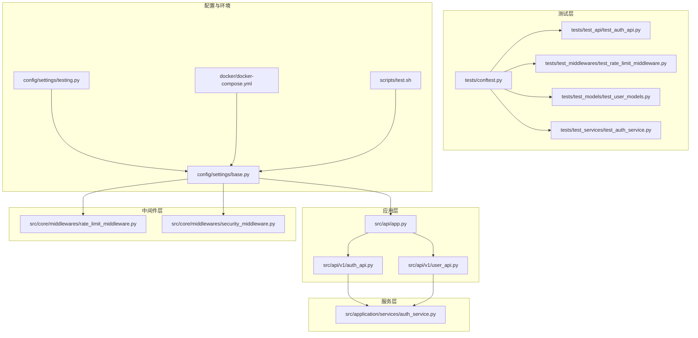
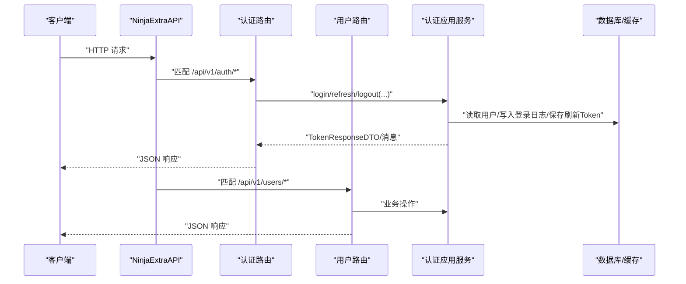
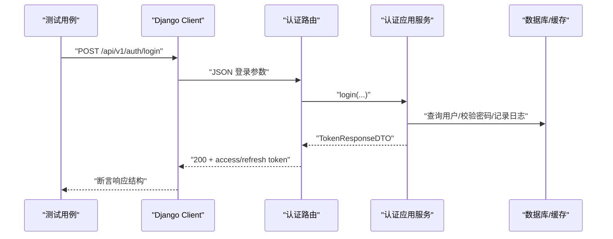
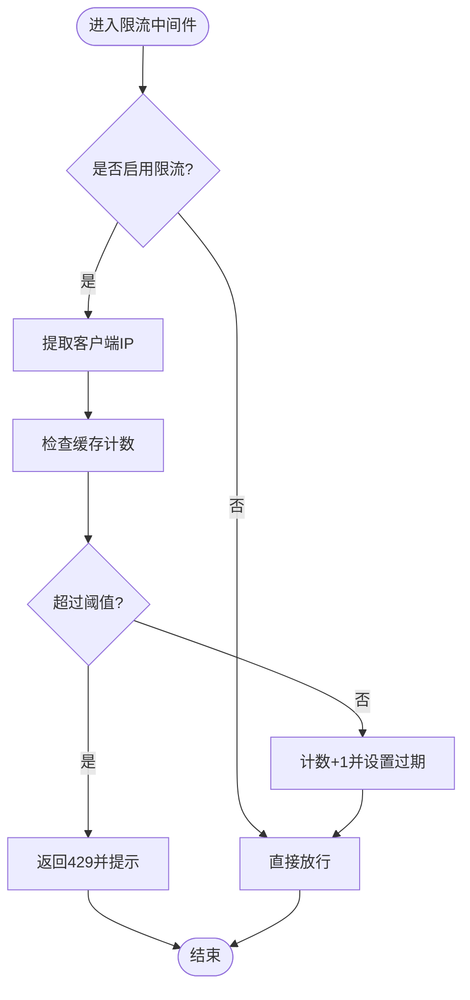
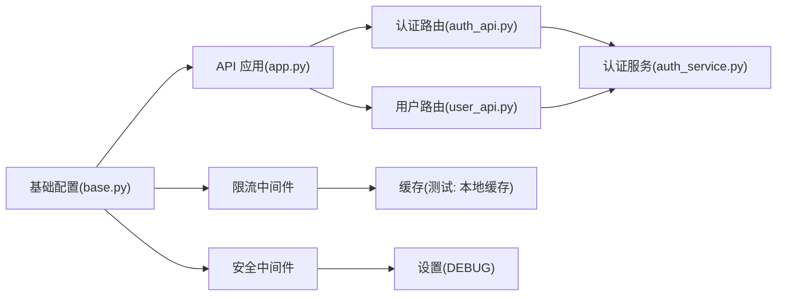

# 集成测试

<cite>
**本文引用的文件**
- [tests/conftest.py](file://tests/conftest.py)
- [config/settings/testing.py](file://config/settings/testing.py)
- [tests/test_api/test_auth_api.py](file://tests/test_api/test_auth_api.py)
- [tests/test_middlewares/test_rate_limit_middleware.py](file://tests/test_middlewares/test_rate_limit_middleware.py)
- [src/api/app.py](file://src/api/app.py)
- [src/api/v1/auth_api.py](file://src/api/v1/auth_api.py)
- [src/api/v1/user_api.py](file://src/api/v1/user_api.py)
- [src/application/services/auth_service.py](file://src/application/services/auth_service.py)
- [src/core/middlewares/rate_limit_middleware.py](file://src/core/middlewares/rate_limit_middleware.py)
- [src/core/middlewares/security_middleware.py](file://src/core/middlewares/security_middleware.py)
- [config/settings/base.py](file://config/settings/base.py)
- [tests/test_models/test_user_models.py](file://tests/test_models/test_user_models.py)
- [tests/test_services/test_auth_service.py](file://tests/test_services/test_auth_service.py)
- [docker/docker-compose.yml](file://docker/docker-compose.yml)
- [scripts/test.sh](file://scripts/test.sh)
- [manage.py](file://manage.py)
</cite>

## 目录
1. [引言](#引言)
2. [项目结构](#项目结构)
3. [核心组件](#核心组件)
4. [架构总览](#架构总览)
5. [详细组件分析](#详细组件分析)
6. [依赖分析](#依赖分析)
7. [性能考虑](#性能考虑)
8. [故障排查指南](#故障排查指南)
9. [结论](#结论)
10. [附录](#附录)

## 引言
本文件面向“集成测试”的目标与范围，覆盖组件间交互与端到端流程测试；重点说明 API 集成测试（认证、用户管理等）的完整流程测试方法；介绍中间件（限流、安全）集成测试设计；说明数据库集成测试（事务与一致性）的实现要点；提供测试环境搭建与配置（含测试数据库与数据隔离策略）、测试数据准备与清理方法；介绍异步集成测试与并发测试思路；并给出调试技巧与问题排查方法。

## 项目结构
该工程采用 Django+Ninja-Extra 的分层架构，测试覆盖 API 层、应用服务层、基础设施层与中间件层。测试组织如下：
- 测试入口与环境：pytest 配置、测试环境设置、Docker 编排
- API 集成测试：认证、用户管理等接口的端到端测试
- 中间件集成测试：限流中间件、安全中间件的行为验证
- 服务与模型测试：应用服务与领域模型的单元/集成特性验证
- 数据库与缓存：基于 SQLite 内存数据库与本地缓存的隔离策略

图表来源
- [tests/conftest.py:1-66](file://tests/conftest.py#L1-L66)
- [src/api/app.py:1-48](file://src/api/app.py#L1-L48)
- [src/api/v1/auth_api.py:1-74](file://src/api/v1/auth_api.py#L1-L74)
- [src/api/v1/user_api.py:1-150](file://src/api/v1/user_api.py#L1-L150)
- [src/application/services/auth_service.py:1-233](file://src/application/services/auth_service.py#L1-L233)
- [src/core/middlewares/rate_limit_middleware.py:1-112](file://src/core/middlewares/rate_limit_middleware.py#L1-L112)
- [src/core/middlewares/security_middleware.py:1-54](file://src/core/middlewares/security_middleware.py#L1-L54)
- [config/settings/base.py:1-235](file://config/settings/base.py#L1-L235)
- [config/settings/testing.py:1-32](file://config/settings/testing.py#L1-L32)
- [docker/docker-compose.yml:1-47](file://docker/docker-compose.yml#L1-L47)
- [scripts/test.sh:1-14](file://scripts/test.sh#L1-L14)

章节来源
- [tests/conftest.py:1-66](file://tests/conftest.py#L1-L66)
- [config/settings/base.py:1-235](file://config/settings/base.py#L1-L235)
- [config/settings/testing.py:1-32](file://config/settings/testing.py#L1-L32)
- [docker/docker-compose.yml:1-47](file://docker/docker-compose.yml#L1-L47)
- [scripts/test.sh:1-14](file://scripts/test.sh#L1-L14)

## 核心组件
- API 应用与路由：统一创建 NinjaExtraAPI 实例并注册控制器，提供健康检查与根路径。
- 认证 API：登录、刷新、登出接口，封装业务服务与 DTO。
- 用户 API：用户增删改查、分页列表、当前用户信息等。
- 应用服务：认证服务负责登录、刷新、登出、令牌校验与登录日志持久化。
- 中间件：限流中间件（基于缓存与 IP 维度统计）、安全中间件（生产环境安全响应头）。
- 测试配置：pytest 固定夹具、测试环境 SQLite 内存库、禁用速率限制、快速密码哈希器。

章节来源
- [src/api/app.py:1-48](file://src/api/app.py#L1-L48)
- [src/api/v1/auth_api.py:1-74](file://src/api/v1/auth_api.py#L1-L74)
- [src/api/v1/user_api.py:1-150](file://src/api/v1/user_api.py#L1-L150)
- [src/application/services/auth_service.py:1-233](file://src/application/services/auth_service.py#L1-L233)
- [src/core/middlewares/rate_limit_middleware.py:1-112](file://src/core/middlewares/rate_limit_middleware.py#L1-L112)
- [src/core/middlewares/security_middleware.py:1-54](file://src/core/middlewares/security_middleware.py#L1-L54)
- [tests/conftest.py:1-66](file://tests/conftest.py#L1-L66)
- [config/settings/testing.py:1-32](file://config/settings/testing.py#L1-L32)

## 架构总览
下图展示从客户端到 API、再到应用服务与基础设施的调用链路，以及中间件在请求生命周期中的作用。

图表来源
- [src/api/app.py:1-48](file://src/api/app.py#L1-L48)
- [src/api/v1/auth_api.py:1-74](file://src/api/v1/auth_api.py#L1-L74)
- [src/api/v1/user_api.py:1-150](file://src/api/v1/user_api.py#L1-L150)
- [src/application/services/auth_service.py:1-233](file://src/application/services/auth_service.py#L1-L233)

## 详细组件分析

### 认证 API 集成测试
目标：验证登录、刷新、登出的端到端流程，包含错误场景（如密码错误、用户未激活）。
- 测试策略
  - 使用 Django Client 发起 JSON 请求，断言状态码与响应结构。
  - 在登录前创建用户并设置为激活状态；断言返回 access_token 与 refresh_token。
  - 错误场景：错误密码导致服务端错误；刷新流程中使用有效/无效刷新令牌。
- 关键路径
  - 登录接口：/api/v1/auth/login
  - 刷新接口：/api/v1/auth/refresh
  - 登出接口：/api/v1/auth/logout（Header 中携带 Bearer Token）

图表来源
- [tests/test_api/test_auth_api.py:1-87](file://tests/test_api/test_auth_api.py#L1-L87)
- [src/api/v1/auth_api.py:1-74](file://src/api/v1/auth_api.py#L1-L74)
- [src/application/services/auth_service.py:1-233](file://src/application/services/auth_service.py#L1-L233)

章节来源
- [tests/test_api/test_auth_api.py:1-87](file://tests/test_api/test_auth_api.py#L1-L87)
- [src/api/v1/auth_api.py:1-74](file://src/api/v1/auth_api.py#L1-L74)
- [src/application/services/auth_service.py:1-233](file://src/application/services/auth_service.py#L1-L233)

### 限流中间件集成测试
目标：验证基于 IP 的请求频率限制、白名单豁免、禁用限流时的行为。
- 测试策略
  - 使用 RequestFactory 构造请求，注入 REMOTE_ADDR。
  - 通过 Mock 替换缓存后端，控制计数与过期行为。
  - 场景：未超限放行、超限返回 429、白名单 IP 直通。
- 关键点
  - 中间件根据设置开关与默认限流规则进行判断。
  - 计数键包含 IP、方法与路径，周期为 60 秒。

图表来源
- [src/core/middlewares/rate_limit_middleware.py:1-112](file://src/core/middlewares/rate_limit_middleware.py#L1-L112)
- [tests/test_middlewares/test_rate_limit_middleware.py:1-76](file://tests/test_middlewares/test_rate_limit_middleware.py#L1-L76)

章节来源
- [src/core/middlewares/rate_limit_middleware.py:1-112](file://src/core/middlewares/rate_limit_middleware.py#L1-L112)
- [tests/test_middlewares/test_rate_limit_middleware.py:1-76](file://tests/test_middlewares/test_rate_limit_middleware.py#L1-L76)

### 安全中间件集成测试（设计）
目标：验证生产环境下的安全响应头注入与开发/测试环境差异。
- 设计要点
  - 开发/测试环境不强制注入严格安全头；生产环境开启安全头。
  - 可通过设置项控制 DEBUG 与安全头注入。
- 测试建议
  - 在不同配置下发起请求，断言响应头存在性与值。
  - 结合中间件顺序验证响应头最终生效。

章节来源
- [src/core/middlewares/security_middleware.py:1-54](file://src/core/middlewares/security_middleware.py#L1-L54)
- [config/settings/base.py:1-235](file://config/settings/base.py#L1-L235)

### 用户管理 API 集成测试（设计）
目标：覆盖用户创建、查询、列表、更新、删除、修改密码、当前用户信息等端到端流程。
- 测试建议
  - 使用认证后的 Token 访问受保护接口。
  - 分页参数校验、非法 ID/权限不足场景。
  - 修改密码需当前用户有效 Token。

章节来源
- [src/api/v1/user_api.py:1-150](file://src/api/v1/user_api.py#L1-L150)

### 数据库集成测试（事务与一致性）
- 测试环境
  - 测试配置使用 SQLite 内存数据库，避免磁盘副作用。
  - 禁用速率限制，加速测试。
- 事务与一致性
  - 使用 Django 的事务隔离与回滚机制保证测试数据独立。
  - 对于跨服务/跨模块的写入，结合缓存与数据库一致性校验。
- 示例场景
  - 用户创建后立即查询；登录日志与用户最后登录时间更新；刷新 Token 的持久化与撤销。

章节来源
- [config/settings/testing.py:1-32](file://config/settings/testing.py#L1-L32)
- [src/application/services/auth_service.py:1-233](file://src/application/services/auth_service.py#L1-L233)
- [tests/test_models/test_user_models.py:1-82](file://tests/test_models/test_user_models.py#L1-L82)

### 测试数据准备与清理
- 夹具（Fixtures）
  - 用户数据、管理员数据、角色与权限数据夹具，便于复用。
  - 会话级数据库迁移与用户模型获取夹具。
- 清理策略
  - 使用测试数据库（内存/临时）与自动回滚，避免污染共享环境。
  - 对于外部资源（Redis），可在测试结束后清空或重启容器。

章节来源
- [tests/conftest.py:1-66](file://tests/conftest.py#L1-L66)
- [docker/docker-compose.yml:1-47](file://docker/docker-compose.yml#L1-L47)

### 异步集成测试与并发测试
- 异步特性
  - 认证服务与 API 均为异步实现，测试中可直接调用异步函数。
- 并发测试
  - 限流中间件基于缓存计数，可通过并发请求触发 429 场景。
  - 建议使用并发客户端或线程池模拟高并发，观察限流与缓存行为。

章节来源
- [src/application/services/auth_service.py:1-233](file://src/application/services/auth_service.py#L1-L233)
- [src/core/middlewares/rate_limit_middleware.py:1-112](file://src/core/middlewares/rate_limit_middleware.py#L1-L112)

## 依赖分析
- 中间件依赖
  - 限流中间件依赖设置项与缓存后端；安全中间件依赖 DEBUG 设置。
- API 依赖
  - 认证与用户路由依赖应用服务；应用服务依赖 JWT 管理器、缓存管理器与持久化模型。
- 配置依赖
  - 基础配置决定中间件顺序、CORS、JWT、缓存与限流开关；测试配置覆盖数据库与缓存行为。

图表来源
- [config/settings/base.py:1-235](file://config/settings/base.py#L1-L235)
- [src/core/middlewares/rate_limit_middleware.py:1-112](file://src/core/middlewares/rate_limit_middleware.py#L1-L112)
- [src/core/middlewares/security_middleware.py:1-54](file://src/core/middlewares/security_middleware.py#L1-L54)
- [src/api/app.py:1-48](file://src/api/app.py#L1-L48)
- [src/api/v1/auth_api.py:1-74](file://src/api/v1/auth_api.py#L1-L74)
- [src/api/v1/user_api.py:1-150](file://src/api/v1/user_api.py#L1-L150)
- [src/application/services/auth_service.py:1-233](file://src/application/services/auth_service.py#L1-L233)

章节来源
- [config/settings/base.py:1-235](file://config/settings/base.py#L1-L235)
- [src/core/middlewares/rate_limit_middleware.py:1-112](file://src/core/middlewares/rate_limit_middleware.py#L1-L112)
- [src/core/middlewares/security_middleware.py:1-54](file://src/core/middlewares/security_middleware.py#L1-L54)
- [src/api/app.py:1-48](file://src/api/app.py#L1-L48)
- [src/api/v1/auth_api.py:1-74](file://src/api/v1/auth_api.py#L1-L74)
- [src/api/v1/user_api.py:1-150](file://src/api/v1/user_api.py#L1-L150)
- [src/application/services/auth_service.py:1-233](file://src/application/services/auth_service.py#L1-L233)

## 性能考虑
- 测试数据库：使用 SQLite 内存库提升速度，避免磁盘 IO。
- 缓存：测试环境使用本地缓存，减少外部依赖延迟。
- 速率限制：测试阶段禁用限流，避免干扰测试结果。
- 并发：通过并发请求验证限流与缓存稳定性，注意控制并发度以避免资源争用。

章节来源
- [config/settings/testing.py:1-32](file://config/settings/testing.py#L1-L32)
- [config/settings/base.py:1-235](file://config/settings/base.py#L1-L235)

## 故障排查指南
- 认证失败
  - 检查用户是否激活、密码是否正确；查看登录日志与错误响应。
- 429 限流
  - 确认限流开关与缓存可用性；核对 IP 与路径键；检查缓存过期时间。
- 安全头缺失
  - 检查 DEBUG 设置与安全中间件是否加载；确认中间件顺序。
- 数据库/缓存异常
  - 使用测试数据库与本地缓存；必要时重置缓存或重启容器。
- 并发问题
  - 观察限流触发时机与缓存计数一致性；调整并发度与限流阈值。

章节来源
- [src/application/services/auth_service.py:1-233](file://src/application/services/auth_service.py#L1-L233)
- [src/core/middlewares/rate_limit_middleware.py:1-112](file://src/core/middlewares/rate_limit_middleware.py#L1-L112)
- [src/core/middlewares/security_middleware.py:1-54](file://src/core/middlewares/security_middleware.py#L1-L54)
- [docker/docker-compose.yml:1-47](file://docker/docker-compose.yml#L1-L47)

## 结论
本项目提供了完善的集成测试框架：API 层端到端验证、中间件行为测试、服务与模型的协同验证，以及基于 SQLite 内存数据库与本地缓存的隔离策略。通过 pytest 夹具与测试配置，能够稳定地复现真实场景并定位问题。建议在持续集成中引入并发与限流压力测试，进一步提升系统的鲁棒性。

## 附录

### 测试环境搭建与配置
- 使用 Docker Compose 启动 Web、PostgreSQL 与 Redis，便于本地与 CI 环境一致化。
- 测试脚本运行 pytest，并生成 HTML 与终端覆盖率报告。

章节来源
- [docker/docker-compose.yml:1-47](file://docker/docker-compose.yml#L1-L47)
- [scripts/test.sh:1-14](file://scripts/test.sh#L1-L14)
- [manage.py:1-23](file://manage.py#L1-L23)