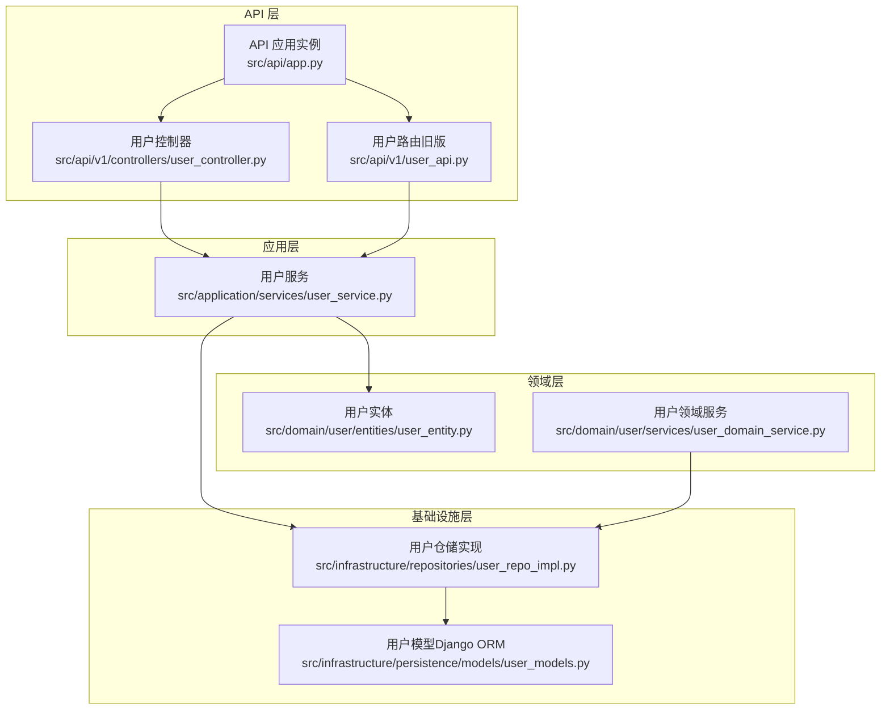
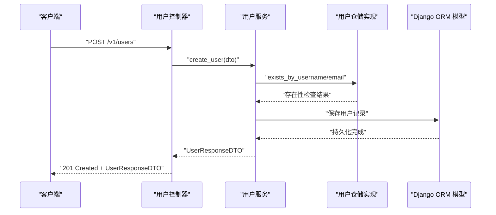
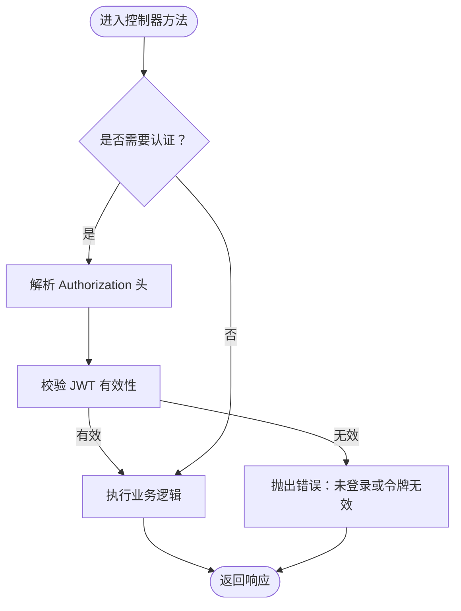
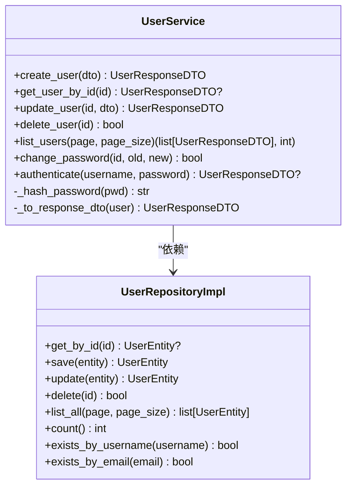
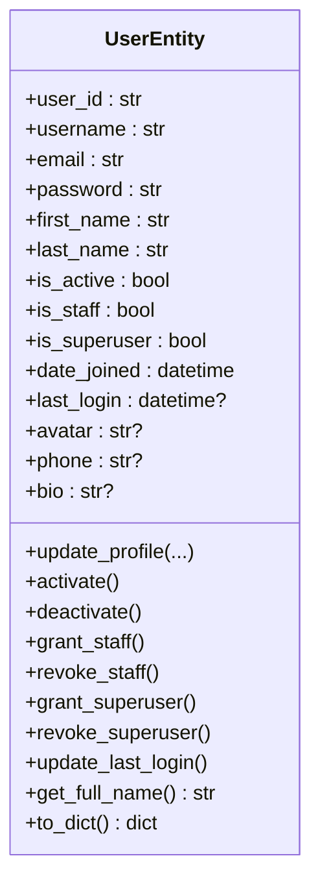
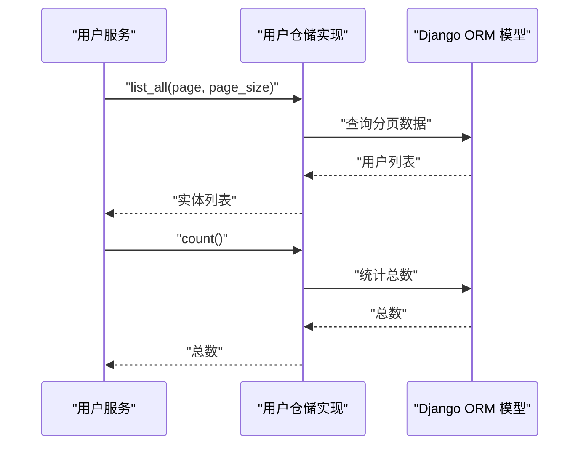
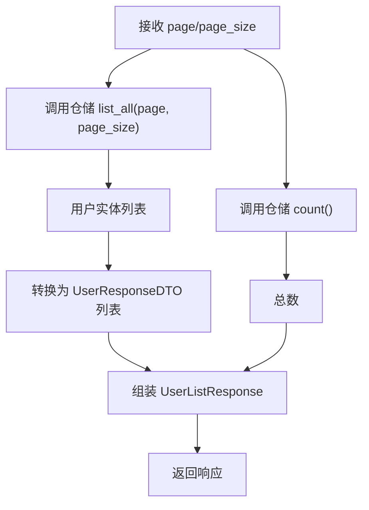
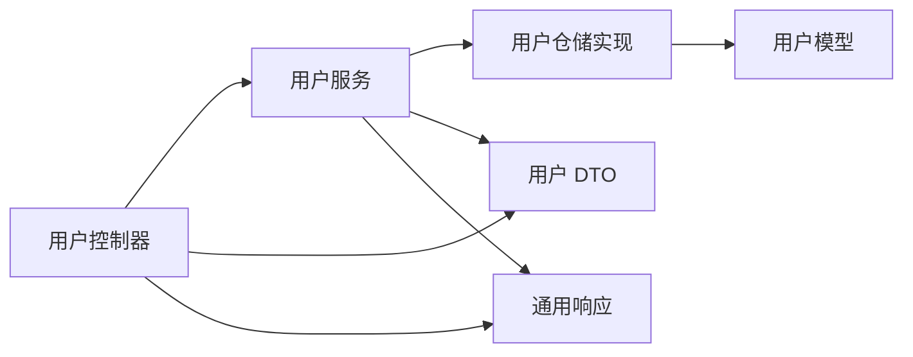

# 用户 CRUD 操作

<cite>
**本文档引用的文件**
- [src/api/app.py](file://src/api/app.py)
- [src/api/v1/controllers/user_controller.py](file://src/api/v1/controllers/user_controller.py)
- [src/api/v1/user_api.py](file://src/api/v1/user_api.py)
- [src/application/dto/user/user_create_dto.py](file://src/application/dto/user/user_create_dto.py)
- [src/application/dto/user/user_update_dto.py](file://src/application/dto/user/user_update_dto.py)
- [src/application/dto/user/user_response_dto.py](file://src/application/dto/user/user_response_dto.py)
- [src/application/dto/user/change_password_dto.py](file://src/application/dto/user/change_password_dto.py)
- [src/application/services/user_service.py](file://src/application/services/user_service.py)
- [src/domain/user/entities/user_entity.py](file://src/domain/user/entities/user_entity.py)
- [src/infrastructure/repositories/user_repo_impl.py](file://src/infrastructure/repositories/user_repo_impl.py)
- [src/infrastructure/persistence/models/user_models.py](file://src/infrastructure/persistence/models/user_models.py)
- [src/api/common/responses.py](file://src/api/common/responses.py)
- [src/domain/user/services/user_domain_service.py](file://src/domain/user/services/user_domain_service.py)
</cite>

## 目录
1. [引言](#引言)
2. [项目结构](#项目结构)
3. [核心组件](#核心组件)
4. [架构总览](#架构总览)
5. [详细组件分析](#详细组件分析)
6. [依赖分析](#依赖分析)
7. [性能考虑](#性能考虑)
8. [故障排除指南](#故障排除指南)
9. [结论](#结论)
10. [附录](#附录)

## 引言
本文件面向“用户 CRUD 操作”的完整实现，覆盖以下接口与能力：
- 用户创建：POST /v1/users
- 用户详情：GET /v1/users/{user_id}
- 用户列表：GET /v1/users（分页）
- 用户更新：PUT /v1/users/{user_id}
- 用户删除：DELETE /v1/users/{user_id}
- 密码修改：POST /v1/users/change-password（需认证）
- 当前用户信息：GET /v1/me（需认证）

文档同时解释数据传输对象（DTO）设计、请求/响应结构、业务逻辑、分页实现、以及用户状态管理与软删除机制。

## 项目结构
该系统采用分层架构，围绕用户模块构建：
- 控制器层：负责 HTTP 请求接收与响应封装
- 应用服务层：编排业务流程、调用仓储与缓存
- 领域层：用户实体与核心业务规则
- 基础设施层：ORM 模型、仓储实现、缓存与中间件
- API 注册：NinjaExtra API 实例集中注册控制器

**图表来源**
- [src/api/app.py:17-30](file://src/api/app.py#L17-L30)
- [src/api/v1/controllers/user_controller.py:34-51](file://src/api/v1/controllers/user_controller.py#L34-L51)
- [src/api/v1/user_api.py:18-19](file://src/api/v1/user_api.py#L18-L19)
- [src/application/services/user_service.py:15-23](file://src/application/services/user_service.py#L15-L23)
- [src/domain/user/entities/user_entity.py:11-32](file://src/domain/user/entities/user_entity.py#L11-L32)
- [src/domain/user/services/user_domain_service.py:10-18](file://src/domain/user/services/user_domain_service.py#L10-L18)
- [src/infrastructure/repositories/user_repo_impl.py:13-17](file://src/infrastructure/repositories/user_repo_impl.py#L13-L17)
- [src/infrastructure/persistence/models/user_models.py:12-23](file://src/infrastructure/persistence/models/user_models.py#L12-L23)

**章节来源**
- [src/api/app.py:17-30](file://src/api/app.py#L17-L30)
- [src/api/v1/controllers/user_controller.py:34-51](file://src/api/v1/controllers/user_controller.py#L34-L51)
- [src/api/v1/user_api.py:18-19](file://src/api/v1/user_api.py#L18-L19)

## 核心组件
- 用户控制器：提供用户 CRUD 与密码修改、当前用户信息等接口；使用 NinjaExtra 装饰器声明路由与响应类型。
- 用户服务：封装业务逻辑，如密码哈希、缓存读写、仓储调用、分页与总数统计。
- 用户实体：DDD 领域模型，包含业务规则与状态变更方法。
- 用户仓储实现：将领域实体与 Django ORM 模型相互转换，并执行数据库操作。
- 用户模型：Django ORM 模型，定义字段、索引与元信息。
- 通用响应：统一消息与分页响应结构。

**章节来源**
- [src/api/v1/controllers/user_controller.py:34-283](file://src/api/v1/controllers/user_controller.py#L34-L283)
- [src/application/services/user_service.py:15-172](file://src/application/services/user_service.py#L15-L172)
- [src/domain/user/entities/user_entity.py:11-120](file://src/domain/user/entities/user_entity.py#L11-L120)
- [src/infrastructure/repositories/user_repo_impl.py:13-138](file://src/infrastructure/repositories/user_repo_impl.py#L13-L138)
- [src/infrastructure/persistence/models/user_models.py:12-147](file://src/infrastructure/persistence/models/user_models.py#L12-L147)
- [src/api/common/responses.py:13-110](file://src/api/common/responses.py#L13-L110)

## 架构总览
用户相关请求在控制器层被接收，随后由应用服务层进行业务处理，仓储层负责与数据库交互，最终返回 DTO 响应。控制器层还提供 JWT 认证辅助方法，用于受保护接口。

**图表来源**
- [src/api/v1/controllers/user_controller.py:53-75](file://src/api/v1/controllers/user_controller.py#L53-L75)
- [src/application/services/user_service.py:28-50](file://src/application/services/user_service.py#L28-L50)
- [src/infrastructure/repositories/user_repo_impl.py:123-129](file://src/infrastructure/repositories/user_repo_impl.py#L123-L129)
- [src/infrastructure/persistence/models/user_models.py:12-23](file://src/infrastructure/persistence/models/user_models.py#L12-L23)

## 详细组件分析

### 用户控制器（UserController）
- 路由与权限
  - POST /v1/users：创建用户，响应 UserResponseDTO
  - GET /v1/users/{user_id}：按 ID 获取用户详情，响应 UserResponseDTO
  - GET /v1/users：分页获取用户列表，响应自定义 UserListResponse
  - PUT /v1/users/{user_id}：更新用户，响应 UserResponseDTO
  - DELETE /v1/users/{user_id}：删除用户，响应 MessageResponse
  - POST /v1/users/change-password：修改密码，需认证，响应 MessageResponse
  - GET /v1/me：获取当前用户信息，需认证，响应 UserResponseDTO
- 分页参数
  - page：整数，最小值 1
  - page_size：整数，最小值 1，最大值 100
- 认证机制
  - 通过 Authorization: Bearer <token> 传递 JWT
  - 使用 token_validator 校验令牌有效性
  - 仅受保护接口（修改密码、当前用户信息）需要认证

**图表来源**
- [src/api/v1/controllers/user_controller.py:190-225](file://src/api/v1/controllers/user_controller.py#L190-L225)
- [src/api/v1/controllers/user_controller.py:227-260](file://src/api/v1/controllers/user_controller.py#L227-L260)
- [src/api/v1/controllers/user_controller.py:262-283](file://src/api/v1/controllers/user_controller.py#L262-L283)

**章节来源**
- [src/api/v1/controllers/user_controller.py:33-189](file://src/api/v1/controllers/user_controller.py#L33-L189)
- [src/api/v1/controllers/user_controller.py:190-283](file://src/api/v1/controllers/user_controller.py#L190-L283)

### 用户服务（UserService）
- 密码处理：使用哈希算法对明文密码进行处理
- 重复性检查：用户名与邮箱唯一性校验
- 缓存策略：用户详情读取优先命中缓存，更新/删除后清理缓存
- 分页与统计：列表查询与总数统计
- 认证流程：用户名+密码认证，校验激活状态并更新最后登录时间
- 密码修改：校验原密码一致性后更新

**图表来源**
- [src/application/services/user_service.py:15-172](file://src/application/services/user_service.py#L15-L172)
- [src/infrastructure/repositories/user_repo_impl.py:13-138](file://src/infrastructure/repositories/user_repo_impl.py#L13-L138)

**章节来源**
- [src/application/services/user_service.py:24-149](file://src/application/services/user_service.py#L24-L149)

### 用户实体（UserEntity）
- 字段：用户标识、用户名、邮箱、密码、姓名、状态标志、时间戳、联系方式、简介等
- 校验：用户名长度、邮箱格式
- 权限与状态：激活/停用、员工/超级管理员权限变更
- 辅助：全名拼接、最后登录时间更新、字典序列化

**图表来源**
- [src/domain/user/entities/user_entity.py:11-120](file://src/domain/user/entities/user_entity.py#L11-L120)

**章节来源**
- [src/domain/user/entities/user_entity.py:33-98](file://src/domain/user/entities/user_entity.py#L33-L98)

### 用户仓储实现（UserRepositoryImpl）
- 实体与模型互转：保证领域层与基础设施层的数据一致性
- 查询：按 ID/用户名/邮箱获取，列表分页，总数统计
- 写入：保存与更新
- 删除：物理删除（非软删除）
- 存在性：用户名与邮箱唯一性检查

**图表来源**
- [src/infrastructure/repositories/user_repo_impl.py:117-133](file://src/infrastructure/repositories/user_repo_impl.py#L117-L133)
- [src/application/services/user_service.py:110-116](file://src/application/services/user_service.py#L110-L116)

**章节来源**
- [src/infrastructure/repositories/user_repo_impl.py:19-133](file://src/infrastructure/repositories/user_repo_impl.py#L19-L133)

### 用户模型（Django ORM）
- 继承 AbstractUser，扩展头像、昵称、性别、手机号、部门关联、创建者/修改者等
- 索引：用户名、邮箱、手机号
- 与用户档案、设备等模型关联

**章节来源**
- [src/infrastructure/persistence/models/user_models.py:12-80](file://src/infrastructure/persistence/models/user_models.py#L12-L80)

### DTO 设计与验证规则
- 用户创建 DTO（UserCreateDTO）
  - 字段：username、email、password、first_name、last_name、phone
  - 验证：用户名长度范围、邮箱格式、密码长度范围
  - 示例：包含示例值的 JSON Schema
- 用户更新 DTO（UserUpdateDTO）
  - 字段：first_name、last_name、phone、avatar、bio
  - 验证：各字段最大长度
  - 示例：包含示例值的 JSON Schema
- 用户响应 DTO（UserResponseDTO）
  - 字段：user_id、username、email、first_name、last_name、is_active、is_staff、is_superuser、avatar、phone、bio、date_joined、last_login
  - 特性：from_attributes 支持
- 密码修改 DTO（ChangePasswordDTO）
  - 字段：old_password、new_password
  - 验证：新密码长度范围
  - 示例：包含示例值的 JSON Schema

**章节来源**
- [src/application/dto/user/user_create_dto.py:9-34](file://src/application/dto/user/user_create_dto.py#L9-L34)
- [src/application/dto/user/user_update_dto.py:9-32](file://src/application/dto/user/user_update_dto.py#L9-L32)
- [src/application/dto/user/user_response_dto.py:11-30](file://src/application/dto/user/user_response_dto.py#L11-L30)
- [src/application/dto/user/change_password_dto.py:9-23](file://src/application/dto/user/change_password_dto.py#L9-L23)

### 分页查询实现
- 控制器层参数
  - page：默认 1，最小 1
  - page_size：默认 10，最小 1，最大 100
- 应用服务层
  - 调用仓储的 list_all(page, page_size) 获取分页数据
  - 调用 count() 获取总数
  - 组装 UserListResponse 返回
- 响应结构
  - users：用户列表（UserResponseDTO）
  - total：总数
  - page、page_size：当前页与每页大小

**图表来源**
- [src/api/v1/controllers/user_controller.py:109-133](file://src/api/v1/controllers/user_controller.py#L109-L133)
- [src/application/services/user_service.py:110-116](file://src/application/services/user_service.py#L110-L116)
- [src/infrastructure/repositories/user_repo_impl.py:117-133](file://src/infrastructure/repositories/user_repo_impl.py#L117-L133)

**章节来源**
- [src/api/v1/controllers/user_controller.py:109-133](file://src/api/v1/controllers/user_controller.py#L109-L133)
- [src/application/services/user_service.py:110-116](file://src/application/services/user_service.py#L110-L116)

### 用户状态管理与软删除机制
- 状态管理
  - 用户实体提供激活/停用、员工/超级管理员权限变更方法
  - 认证流程中校验 is_active 状态
- 删除机制
  - 仓储实现提供 delete 方法，执行物理删除
  - 应用服务在删除后清理用户相关缓存
- 软删除说明
  - 当前实现为物理删除，未见软删除标记字段（如 is_deleted）的使用

**章节来源**
- [src/domain/user/entities/user_entity.py:71-93](file://src/domain/user/entities/user_entity.py#L71-L93)
- [src/domain/user/services/user_domain_service.py:66-82](file://src/domain/user/services/user_domain_service.py#L66-L82)
- [src/application/services/user_service.py:100-108](file://src/application/services/user_service.py#L100-L108)
- [src/infrastructure/repositories/user_repo_impl.py:108-115](file://src/infrastructure/repositories/user_repo_impl.py#L108-L115)

## 依赖分析
- 控制器依赖应用服务
- 应用服务依赖仓储实现
- 仓储实现依赖 Django ORM 模型
- 控制器与应用服务均依赖 DTO 与通用响应结构
- 认证依赖 JWT 校验器

**图表来源**
- [src/api/v1/controllers/user_controller.py:14-21](file://src/api/v1/controllers/user_controller.py#L14-L21)
- [src/application/services/user_service.py:9-12](file://src/application/services/user_service.py#L9-L12)
- [src/infrastructure/repositories/user_repo_impl.py:8-10](file://src/infrastructure/repositories/user_repo_impl.py#L8-L10)
- [src/api/common/responses.py:13-20](file://src/api/common/responses.py#L13-L20)

**章节来源**
- [src/api/v1/controllers/user_controller.py:14-21](file://src/api/v1/controllers/user_controller.py#L14-L21)
- [src/application/services/user_service.py:9-12](file://src/application/services/user_service.py#L9-L12)
- [src/infrastructure/repositories/user_repo_impl.py:8-10](file://src/infrastructure/repositories/user_repo_impl.py#L8-L10)
- [src/api/common/responses.py:13-20](file://src/api/common/responses.py#L13-L20)

## 性能考虑
- 缓存：用户详情读取优先命中缓存，减少数据库访问；更新/删除后清理缓存，避免脏读
- 分页：仓储层使用切片方式获取分页数据，结合 count() 获取总数
- 哈希：密码使用哈希存储，避免明文存储风险
- 索引：用户模型对常用查询字段建立索引，提升查询效率

**章节来源**
- [src/application/services/user_service.py:54-66](file://src/application/services/user_service.py#L54-L66)
- [src/infrastructure/repositories/user_repo_impl.py:117-133](file://src/infrastructure/repositories/user_repo_impl.py#L117-L133)
- [src/infrastructure/persistence/models/user_models.py:76-80](file://src/infrastructure/persistence/models/user_models.py#L76-L80)

## 故障排除指南
- 用户不存在
  - 场景：查询、更新、删除、修改密码等
  - 表现：抛出错误或返回特定错误消息
  - 处理：确认 user_id 是否正确，检查数据库是否存在
- 重复字段冲突
  - 场景：创建用户时用户名或邮箱重复
  - 表现：抛出重复性错误
  - 处理：更换用户名或邮箱
- 令牌无效
  - 场景：受保护接口未携带有效 Bearer Token
  - 表现：抛出未登录或令牌无效错误
  - 处理：确保 Authorization 头格式正确且令牌有效
- 密码不正确
  - 场景：修改密码或认证
  - 表现：抛出原密码不正确错误
  - 处理：确认旧密码输入正确

**章节来源**
- [src/api/v1/controllers/user_controller.py:98-101](file://src/api/v1/controllers/user_controller.py#L98-L101)
- [src/api/v1/controllers/user_controller.py:185-188](file://src/api/v1/controllers/user_controller.py#L185-L188)
- [src/api/v1/controllers/user_controller.py:217-225](file://src/api/v1/controllers/user_controller.py#L217-L225)
- [src/application/services/user_service.py:30-36](file://src/application/services/user_service.py#L30-L36)
- [src/application/services/user_service.py:120-125](file://src/application/services/user_service.py#L120-L125)

## 结论
本项目实现了完整的用户 CRUD 能力，具备清晰的分层架构、完善的 DTO 校验、缓存与分页优化，并通过 JWT 实现受保护接口。当前删除为物理删除，未实现软删除；未来可在模型与仓储层引入软删除字段与过滤策略以增强数据安全与可恢复性。

## 附录

### API 接口定义与示例

- 创建用户
  - 方法：POST
  - 路径：/v1/users
  - 请求体：UserCreateDTO
  - 响应：UserResponseDTO
  - 示例请求体（字段参考）：[示例路径:20-29](file://src/application/dto/user/user_create_dto.py#L20-L29)
  - 示例响应体（字段参考）：[示例路径:28-29](file://src/application/dto/user/user_response_dto.py#L28-L29)

- 获取用户详情
  - 方法：GET
  - 路径：/v1/users/{user_id}
  - 路径参数：user_id（字符串）
  - 响应：UserResponseDTO

- 获取用户列表
  - 方法：GET
  - 路径：/v1/users
  - 查询参数：
    - page：整数，默认 1，最小 1
    - page_size：整数，默认 10，最小 1，最大 100
  - 响应：UserListResponse（包含 users、total、page、page_size）

- 更新用户
  - 方法：PUT
  - 路径：/v1/users/{user_id}
  - 路径参数：user_id（字符串）
  - 请求体：UserUpdateDTO
  - 响应：UserResponseDTO

- 删除用户
  - 方法：DELETE
  - 路径：/v1/users/{user_id}
  - 路径参数：user_id（字符串）
  - 响应：MessageResponse

- 修改密码
  - 方法：POST
  - 路径：/v1/users/change-password
  - 请求头：Authorization: Bearer <token>
  - 请求体：ChangePasswordDTO
  - 响应：MessageResponse

- 获取当前用户信息
  - 方法：GET
  - 路径：/v1/me
  - 请求头：Authorization: Bearer <token>
  - 响应：UserResponseDTO

**章节来源**
- [src/api/v1/controllers/user_controller.py:53-189](file://src/api/v1/controllers/user_controller.py#L53-L189)
- [src/api/v1/controllers/user_controller.py:190-260](file://src/api/v1/controllers/user_controller.py#L190-L260)
- [src/api/v1/user_api.py:50-149](file://src/api/v1/user_api.py#L50-L149)

### 错误码与状态码使用
- 400：请求参数非法（如 DTO 校验失败）
- 401：未登录或令牌无效（受保护接口）
- 404：资源不存在（用户不存在）
- 409：资源冲突（如用户名/邮箱已存在）
- 422：业务校验失败（如原密码不正确）
- 200/201：成功响应，返回对应 DTO 或消息

**章节来源**
- [src/api/v1/controllers/user_controller.py:98-101](file://src/api/v1/controllers/user_controller.py#L98-L101)
- [src/api/v1/controllers/user_controller.py:185-188](file://src/api/v1/controllers/user_controller.py#L185-L188)
- [src/api/v1/controllers/user_controller.py:217-225](file://src/api/v1/controllers/user_controller.py#L217-L225)
- [src/application/services/user_service.py:30-36](file://src/application/services/user_service.py#L30-L36)
- [src/application/services/user_service.py:120-125](file://src/application/services/user_service.py#L120-L125)