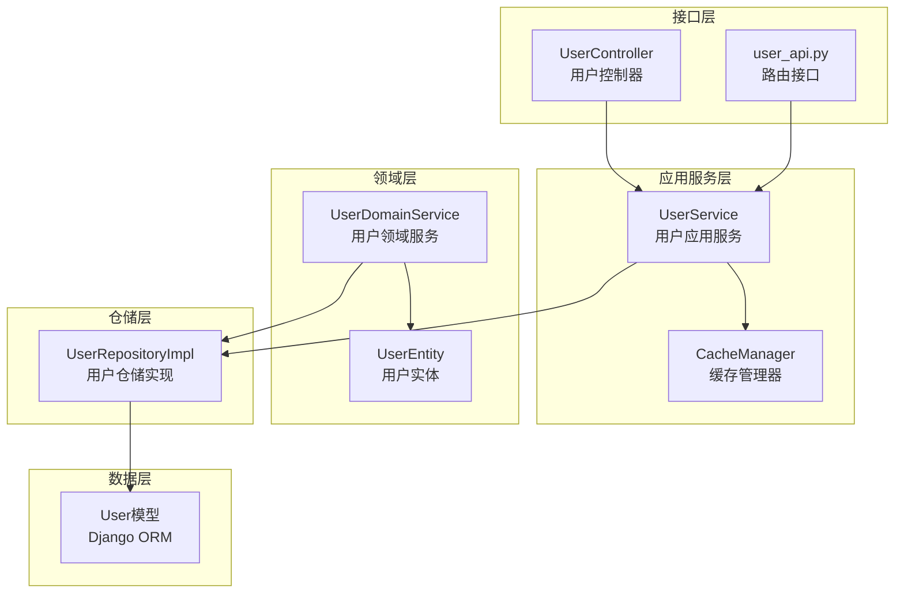
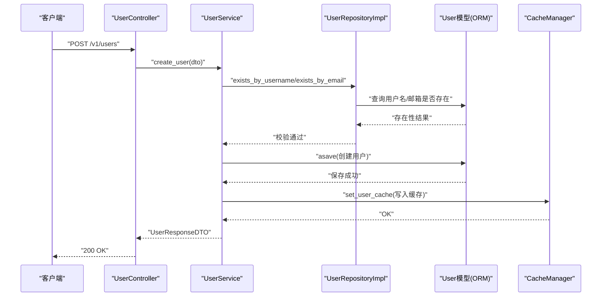
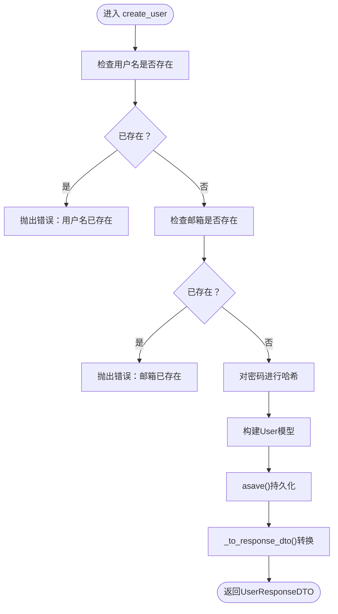
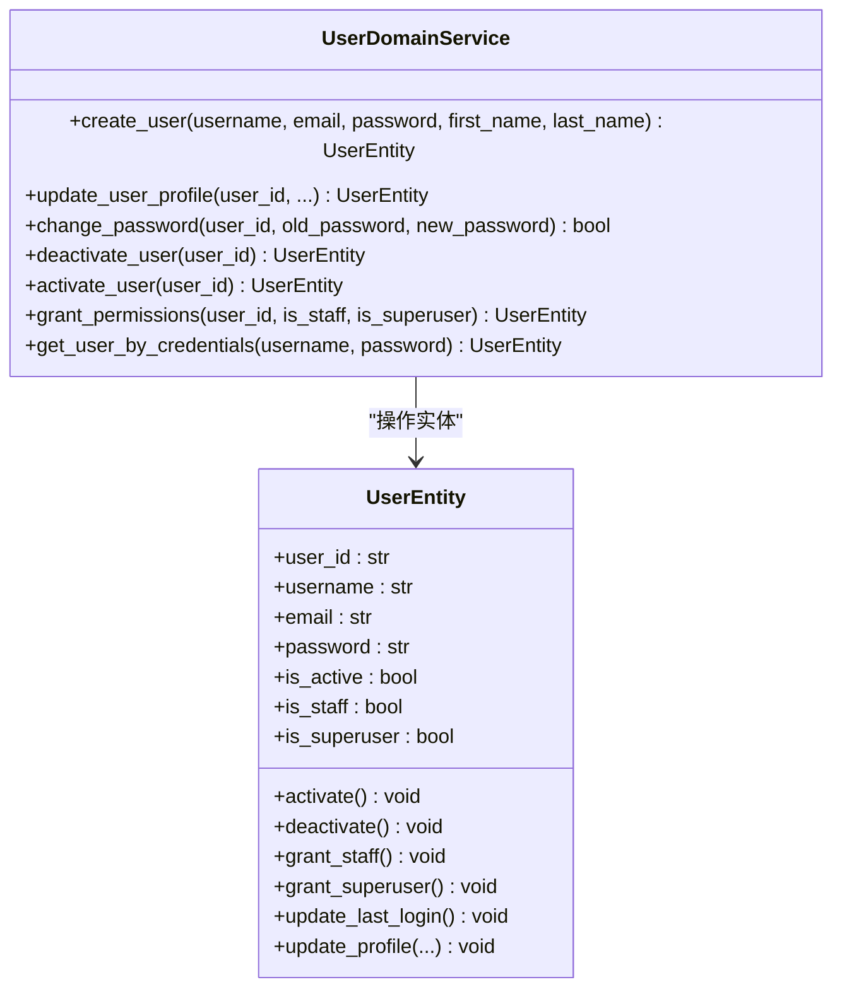
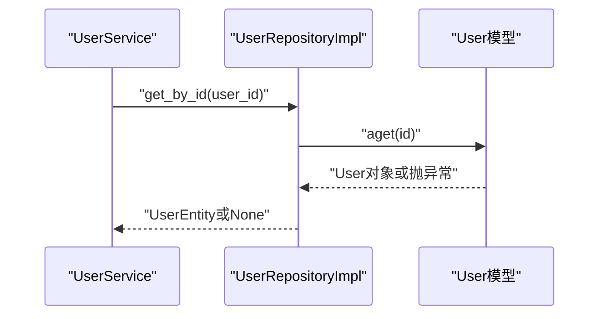
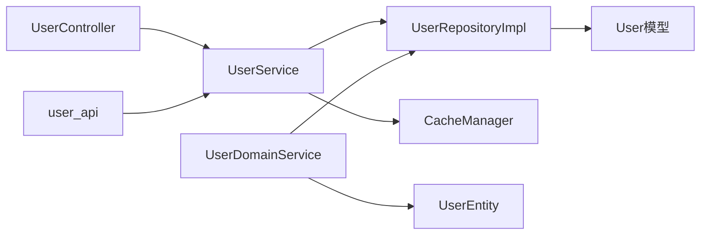

# 用户业务逻辑

<cite>
**本文档引用的文件**
- [src/application/services/user_service.py](file://src/application/services/user_service.py)
- [src/domain/user/services/user_domain_service.py](file://src/domain/user/services/user_domain_service.py)
- [src/infrastructure/repositories/user_repo_impl.py](file://src/infrastructure/repositories/user_repo_impl.py)
- [src/application/dto/user/user_login_dto.py](file://src/application/dto/user/user_login_dto.py)
- [src/application/dto/user/user_create_dto.py](file://src/application/dto/user/user_create_dto.py)
- [src/application/dto/user/user_update_dto.py](file://src/application/dto/user/user_update_dto.py)
- [src/application/dto/user/user_response_dto.py](file://src/application/dto/user/user_response_dto.py)
- [src/application/dto/user/change_password_dto.py](file://src/application/dto/user/change_password_dto.py)
- [src/api/v1/controllers/user_controller.py](file://src/api/v1/controllers/user_controller.py)
- [src/api/v1/user_api.py](file://src/api/v1/user_api.py)
- [src/infrastructure/cache/cache_manager.py](file://src/infrastructure/cache/cache_manager.py)
- [src/infrastructure/persistence/models/user_models.py](file://src/infrastructure/persistence/models/user_models.py)
- [src/domain/user/entities/user_entity.py](file://src/domain/user/entities/user_entity.py)
- [tests/test_services/test_user_service.py](file://tests/test_services/test_user_service.py)
</cite>

## 目录
1. [引言](#引言)
2. [项目结构](#项目结构)
3. [核心组件](#核心组件)
4. [架构总览](#架构总览)
5. [详细组件分析](#详细组件分析)
6. [依赖分析](#依赖分析)
7. [性能考虑](#性能考虑)
8. [故障排查指南](#故障排查指南)
9. [结论](#结论)
10. [附录](#附录)

## 引言
本文件系统性梳理用户业务逻辑，覆盖应用服务层（UserService）、领域服务层（UserDomainService）、仓储实现（UserRepositoryImpl），以及登录DTO与控制器交互流程。重点阐述用户创建、查询、更新、删除、密码变更与认证等核心流程，说明业务规则校验、领域模型操作、跨领域协调、数据访问模式、缓存策略、异常处理、事务管理、并发控制与性能优化实践。

## 项目结构
围绕用户模块的关键目录与文件组织如下：
- 应用服务层：处理业务用例与协调，负责DTO转换、缓存与仓储调用
- 领域服务层：封装跨实体的业务规则与状态变更
- 仓储实现：封装ORM数据访问，提供异步查询、分页与计数
- DTO层：输入输出数据结构与校验
- 控制器层：HTTP接口编排，鉴权与异常映射
- 缓存层：统一缓存键空间与读写策略
- 模型层：Django ORM模型与索引

图表来源
- [src/api/v1/controllers/user_controller.py:33-283](file://src/api/v1/controllers/user_controller.py#L33-L283)
- [src/api/v1/user_api.py:18-150](file://src/api/v1/user_api.py#L18-L150)
- [src/application/services/user_service.py:15-172](file://src/application/services/user_service.py#L15-L172)
- [src/infrastructure/cache/cache_manager.py:16-149](file://src/infrastructure/cache/cache_manager.py#L16-L149)
- [src/domain/user/services/user_domain_service.py:10-117](file://src/domain/user/services/user_domain_service.py#L10-L117)
- [src/domain/user/entities/user_entity.py:11-120](file://src/domain/user/entities/user_entity.py#L11-L120)
- [src/infrastructure/repositories/user_repo_impl.py:13-138](file://src/infrastructure/repositories/user_repo_impl.py#L13-L138)
- [src/infrastructure/persistence/models/user_models.py:12-147](file://src/infrastructure/persistence/models/user_models.py#L12-L147)

章节来源
- [src/api/v1/controllers/user_controller.py:33-283](file://src/api/v1/controllers/user_controller.py#L33-L283)
- [src/api/v1/user_api.py:18-150](file://src/api/v1/user_api.py#L18-L150)
- [src/application/services/user_service.py:15-172](file://src/application/services/user_service.py#L15-L172)
- [src/infrastructure/cache/cache_manager.py:16-149](file://src/infrastructure/cache/cache_manager.py#L16-L149)
- [src/domain/user/services/user_domain_service.py:10-117](file://src/domain/user/services/user_domain_service.py#L10-L117)
- [src/domain/user/entities/user_entity.py:11-120](file://src/domain/user/entities/user_entity.py#L11-L120)
- [src/infrastructure/repositories/user_repo_impl.py:13-138](file://src/infrastructure/repositories/user_repo_impl.py#L13-L138)
- [src/infrastructure/persistence/models/user_models.py:12-147](file://src/infrastructure/persistence/models/user_models.py#L12-L147)

## 核心组件
- 用户应用服务（UserService）
  - 负责用户生命周期业务：创建、查询、更新、删除、列表、密码变更、认证
  - 内置密码哈希、缓存读写、响应DTO转换
- 用户领域服务（UserDomainService）
  - 封装业务规则：用户名/邮箱唯一性、激活/停用、权限授予、凭据认证
  - 与仓储接口协作，确保业务不变式
- 用户仓储实现（UserRepositoryImpl）
  - 实现UserRepositoryInterface，完成ORM异步读写、分页、计数、存在性检查
- 登录DTO（UserLoginDTO）
  - 输入校验：用户名、密码、设备信息
- 控制器（UserController/user_api）
  - HTTP接口编排、鉴权、异常映射、响应封装

章节来源
- [src/application/services/user_service.py:15-172](file://src/application/services/user_service.py#L15-L172)
- [src/domain/user/services/user_domain_service.py:10-117](file://src/domain/user/services/user_domain_service.py#L10-L117)
- [src/infrastructure/repositories/user_repo_impl.py:13-138](file://src/infrastructure/repositories/user_repo_impl.py#L13-L138)
- [src/application/dto/user/user_login_dto.py:9-28](file://src/application/dto/user/user_login_dto.py#L9-L28)
- [src/api/v1/controllers/user_controller.py:33-283](file://src/api/v1/controllers/user_controller.py#L33-L283)
- [src/api/v1/user_api.py:18-150](file://src/api/v1/user_api.py#L18-L150)

## 架构总览
用户业务遵循分层架构与依赖倒置：
- 接口层（控制器/路由）仅依赖应用服务
- 应用服务依赖仓储接口与缓存管理器
- 领域服务封装核心业务规则，可被应用服务或控制器直接调用
- 仓储实现对接Django ORM，提供异步数据访问

图表来源
- [src/api/v1/controllers/user_controller.py:53-76](file://src/api/v1/controllers/user_controller.py#L53-L76)
- [src/application/services/user_service.py:28-51](file://src/application/services/user_service.py#L28-L51)
- [src/infrastructure/repositories/user_repo_impl.py:123-129](file://src/infrastructure/repositories/user_repo_impl.py#L123-L129)
- [src/infrastructure/cache/cache_manager.py:97-105](file://src/infrastructure/cache/cache_manager.py#L97-L105)
- [src/infrastructure/persistence/models/user_models.py:12-80](file://src/infrastructure/persistence/models/user_models.py#L12-L80)

## 详细组件分析

### 用户应用服务（UserService）
- 职责边界
  - 用户创建：重复性校验（用户名/邮箱）、密码哈希、持久化、缓存写入
  - 用户查询：缓存优先、仓储回退、响应DTO转换
  - 用户更新：动态字段更新、缓存失效
  - 用户删除：软删除、多类缓存清理
  - 列表与计数：分页与总数统计
  - 密码变更：旧密验证、新密哈希、持久化
  - 认证：凭据校验、账户状态检查、最后登录时间更新
- 关键点
  - 密码采用SHA-256哈希（注意：生产建议使用更安全的密码散列算法）
  - 查询优先命中缓存，避免重复ORM访问
  - 更新/删除后主动清理相关缓存，保证一致性
  - 响应DTO转换集中于私有方法，便于维护

图表来源
- [src/application/services/user_service.py:28-51](file://src/application/services/user_service.py#L28-L51)
- [src/application/services/user_service.py:151-167](file://src/application/services/user_service.py#L151-L167)

章节来源
- [src/application/services/user_service.py:15-172](file://src/application/services/user_service.py#L15-L172)

### 用户领域服务（UserDomainService）
- 职责边界
  - 用户创建：业务规则校验（唯一性）、实体构建、仓储保存
  - 用户资料更新：实体方法更新、仓储更新
  - 密码变更：旧密校验、新密赋值、仓储更新
  - 用户状态：激活/停用
  - 权限授予：员工/超级管理员权限
  - 凭据认证：状态检查、最后登录时间更新
- 关键点
  - 使用UserEntity承载业务行为（如激活/停用、权限授予、最后登录时间更新）
  - 与仓储接口解耦，便于替换实现或测试替身

图表来源
- [src/domain/user/services/user_domain_service.py:10-117](file://src/domain/user/services/user_domain_service.py#L10-L117)
- [src/domain/user/entities/user_entity.py:11-120](file://src/domain/user/entities/user_entity.py#L11-L120)

章节来源
- [src/domain/user/services/user_domain_service.py:10-117](file://src/domain/user/services/user_domain_service.py#L10-L117)
- [src/domain/user/entities/user_entity.py:11-120](file://src/domain/user/entities/user_entity.py#L11-L120)

### 用户仓储实现（UserRepositoryImpl）
- 职责边界
  - 实体与模型双向转换
  - 异步查询：按ID/用户名/邮箱获取
  - 保存/更新/删除
  - 列表与计数
  - 存在性检查
- 关键点
  - 使用异步ORM方法（aget、asave、adelete、aexists、acount）
  - 分页通过切片实现，offset计算
  - 模型转换时区分新增与更新场景

图表来源
- [src/infrastructure/repositories/user_repo_impl.py:72-78](file://src/infrastructure/repositories/user_repo_impl.py#L72-L78)
- [src/infrastructure/repositories/user_repo_impl.py:38-70](file://src/infrastructure/repositories/user_repo_impl.py#L38-L70)

章节来源
- [src/infrastructure/repositories/user_repo_impl.py:13-138](file://src/infrastructure/repositories/user_repo_impl.py#L13-L138)

### 用户登录DTO（UserLoginDTO）
- 设计要点
  - 字段：用户名、密码、设备信息
  - 示例与Schema增强，便于API文档与调试
- 验证逻辑
  - 控制器/服务层负责用户名密码校验与账户状态检查
  - DTO仅承担输入结构与基础约束

章节来源
- [src/application/dto/user/user_login_dto.py:9-28](file://src/application/dto/user/user_login_dto.py#L9-L28)

### 控制器与API（UserController/user_api）
- 职责边界
  - 定义REST接口、参数校验、鉴权装饰器
  - 从请求中提取当前用户信息（基于JWT）
  - 将异常映射为明确的错误信息
- 关键点
  - 依赖注入UserService实例，便于测试与替换
  - 对外暴露统一的响应结构（含分页列表）

章节来源
- [src/api/v1/controllers/user_controller.py:33-283](file://src/api/v1/controllers/user_controller.py#L33-L283)
- [src/api/v1/user_api.py:18-150](file://src/api/v1/user_api.py#L18-L150)

### 缓存策略（CacheManager）
- 设计要点
  - 统一前缀与分组命名空间（user/rbac/auth等）
  - 支持字符串/JSON自动解析
  - 提供用户、权限、角色专用缓存键
  - 生成通用缓存键工具
- 用户缓存
  - 读取：get_user_cache
  - 写入：set_user_cache
  - 删除：delete_user_cache
  - 删除权限/角色缓存：delete_permissions_cache、delete_roles_cache

章节来源
- [src/infrastructure/cache/cache_manager.py:16-149](file://src/infrastructure/cache/cache_manager.py#L16-L149)
- [src/application/services/user_service.py:52-66](file://src/application/services/user_service.py#L52-L66)
- [src/application/services/user_service.py:100-108](file://src/application/services/user_service.py#L100-L108)

### 数据模型（User模型）
- 设计要点
  - 扩展Django内置用户模型，增加头像、手机、部门关联等
  - 索引：用户名、邮箱、手机号，提升查询效率
  - 与UserProfile、UserDevice等模型配合，支撑完整用户画像

章节来源
- [src/infrastructure/persistence/models/user_models.py:12-147](file://src/infrastructure/persistence/models/user_models.py#L12-L147)

## 依赖分析
- 控制器依赖应用服务
- 应用服务依赖仓储接口与缓存管理器
- 仓储实现依赖ORM模型
- 领域服务依赖仓储接口与实体
- DTO仅作为数据载体，无业务逻辑

图表来源
- [src/api/v1/controllers/user_controller.py:33-51](file://src/api/v1/controllers/user_controller.py#L33-L51)
- [src/api/v1/user_api.py:18-48](file://src/api/v1/user_api.py#L18-L48)
- [src/application/services/user_service.py:21-22](file://src/application/services/user_service.py#L21-L22)
- [src/infrastructure/repositories/user_repo_impl.py:13-17](file://src/infrastructure/repositories/user_repo_impl.py#L13-L17)
- [src/domain/user/services/user_domain_service.py:16-17](file://src/domain/user/services/user_domain_service.py#L16-L17)
- [src/domain/user/entities/user_entity.py:11-16](file://src/domain/user/entities/user_entity.py#L11-L16)
- [src/infrastructure/cache/cache_manager.py:16-20](file://src/infrastructure/cache/cache_manager.py#L16-L20)

章节来源
- [src/api/v1/controllers/user_controller.py:33-51](file://src/api/v1/controllers/user_controller.py#L33-L51)
- [src/api/v1/user_api.py:18-48](file://src/api/v1/user_api.py#L18-L48)
- [src/application/services/user_service.py:21-22](file://src/application/services/user_service.py#L21-L22)
- [src/infrastructure/repositories/user_repo_impl.py:13-17](file://src/infrastructure/repositories/user_repo_impl.py#L13-L17)
- [src/domain/user/services/user_domain_service.py:16-17](file://src/domain/user/services/user_domain_service.py#L16-L17)
- [src/domain/user/entities/user_entity.py:11-16](file://src/domain/user/entities/user_entity.py#L11-L16)
- [src/infrastructure/cache/cache_manager.py:16-20](file://src/infrastructure/cache/cache_manager.py#L16-L20)

## 性能考虑
- 查询优化
  - 使用索引字段（用户名、邮箱、手机号）进行查询
  - 缓存热点用户数据，减少ORM访问
- 分页与计数
  - 列表接口支持分页，避免一次性加载大量数据
  - 计数与列表分离，降低锁竞争
- 缓存策略
  - 用户信息缓存短超时，权限/角色缓存中等超时
  - 更新/删除后主动失效相关缓存
- 并发控制
  - 仓储使用异步ORM，避免阻塞
  - 唯一性校验在应用层与仓储层双重保障
- 安全建议
  - 密码哈希建议升级为PBKDF2/SCRYPT/BLAKE2等
  - 敏感字段（密码）不写入缓存

章节来源
- [src/infrastructure/persistence/models/user_models.py:76-80](file://src/infrastructure/persistence/models/user_models.py#L76-L80)
- [src/infrastructure/cache/cache_manager.py:97-137](file://src/infrastructure/cache/cache_manager.py#L97-L137)
- [src/application/services/user_service.py:110-116](file://src/application/services/user_service.py#L110-L116)

## 故障排查指南
- 用户不存在
  - 查询接口返回None或抛出“用户不存在”
  - 检查ID/用户名/邮箱是否正确
- 用户已存在
  - 创建时提示用户名或邮箱已存在
  - 校验唯一性后再重试
- 密码错误
  - 认证或密码变更时提示原密码不正确
  - 确认旧密码与哈希策略一致
- 账户未激活
  - 认证时提示账户被停用
  - 检查账户状态或联系管理员
- 缓存不一致
  - 更新后读取到旧数据
  - 确认缓存清理逻辑是否执行
- 权限/角色缓存异常
  - 角色/权限变更后仍返回旧值
  - 手动清理对应缓存键

章节来源
- [src/application/services/user_service.py:30-36](file://src/application/services/user_service.py#L30-L36)
- [src/application/services/user_service.py:118-125](file://src/application/services/user_service.py#L118-L125)
- [src/application/services/user_service.py:131-141](file://src/application/services/user_service.py#L131-L141)
- [src/application/services/user_service.py:100-108](file://src/application/services/user_service.py#L100-L108)
- [src/infrastructure/cache/cache_manager.py:107-137](file://src/infrastructure/cache/cache_manager.py#L107-L137)

## 结论
该用户业务逻辑采用清晰的分层设计：控制器负责接口编排，应用服务负责业务编排与缓存，仓储负责数据访问，领域服务封装业务规则。通过DTO约束输入、缓存提升性能、异步ORM保证吞吐，整体具备良好的可维护性与扩展性。建议在生产环境中强化密码安全与缓存一致性策略。

## 附录

### 使用示例与最佳实践
- 创建用户
  - 输入：UserCreateDTO
  - 流程：控制器 → 应用服务 → 仓储 → 缓存写入
  - 注意：重复性校验、密码哈希、缓存写入
- 查询用户
  - 输入：用户ID/用户名/邮箱
  - 流程：缓存命中优先，否则仓储查询，再写入缓存
- 更新用户
  - 输入：UserUpdateDTO
  - 流程：仓储读取 → 动态字段更新 → 持久化 → 清理缓存
- 删除用户
  - 流程：仓储删除 → 清理用户/权限/角色缓存
- 修改密码
  - 输入：ChangePasswordDTO
  - 流程：旧密校验 → 新密哈希 → 持久化
- 登录认证
  - 输入：UserLoginDTO
  - 流程：用户名查询 → 账户状态检查 → 密码校验 → 更新最后登录时间

章节来源
- [src/api/v1/controllers/user_controller.py:53-76](file://src/api/v1/controllers/user_controller.py#L53-L76)
- [src/api/v1/controllers/user_controller.py:77-101](file://src/api/v1/controllers/user_controller.py#L77-L101)
- [src/api/v1/controllers/user_controller.py:135-162](file://src/api/v1/controllers/user_controller.py#L135-L162)
- [src/api/v1/controllers/user_controller.py:164-188](file://src/api/v1/controllers/user_controller.py#L164-L188)
- [src/api/v1/controllers/user_controller.py:190-225](file://src/api/v1/controllers/user_controller.py#L190-L225)
- [src/api/v1/controllers/user_controller.py:227-260](file://src/api/v1/controllers/user_controller.py#L227-L260)
- [src/application/services/user_service.py:28-51](file://src/application/services/user_service.py#L28-L51)
- [src/application/services/user_service.py:52-80](file://src/application/services/user_service.py#L52-L80)
- [src/application/services/user_service.py:82-98](file://src/application/services/user_service.py#L82-L98)
- [src/application/services/user_service.py:100-108](file://src/application/services/user_service.py#L100-L108)
- [src/application/services/user_service.py:118-129](file://src/application/services/user_service.py#L118-L129)
- [src/application/services/user_service.py:131-149](file://src/application/services/user_service.py#L131-L149)