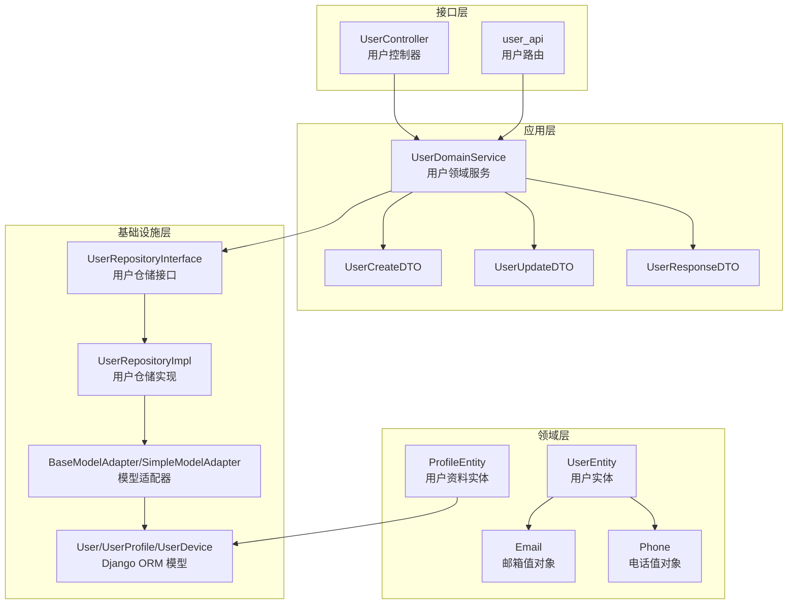
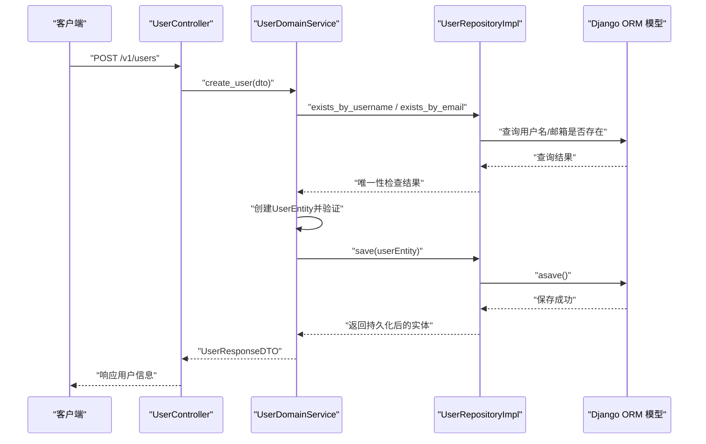
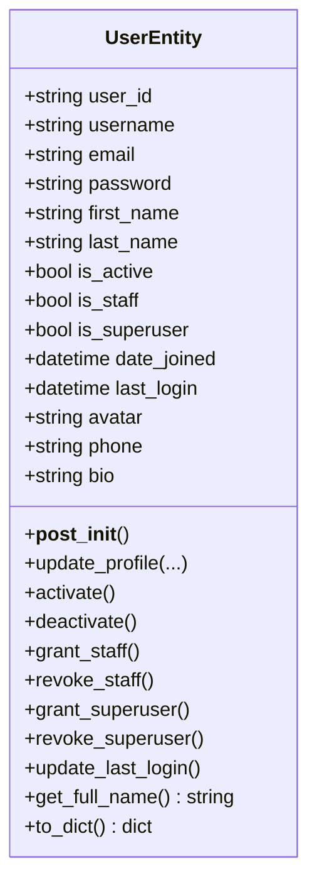
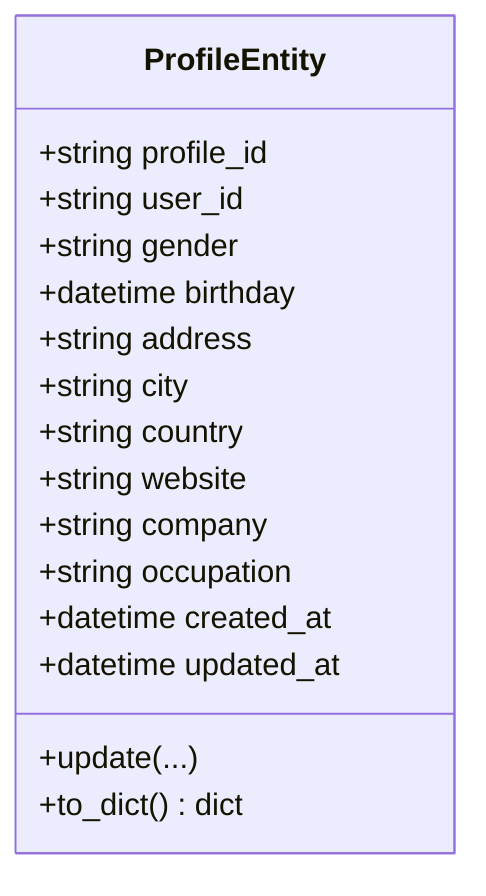
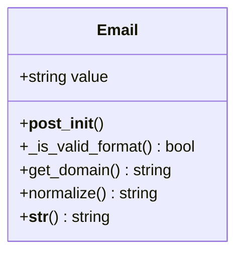
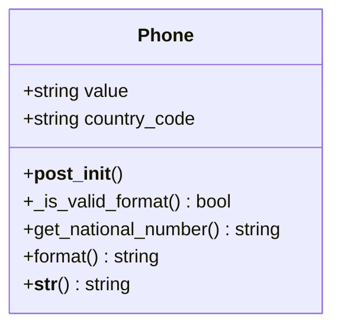
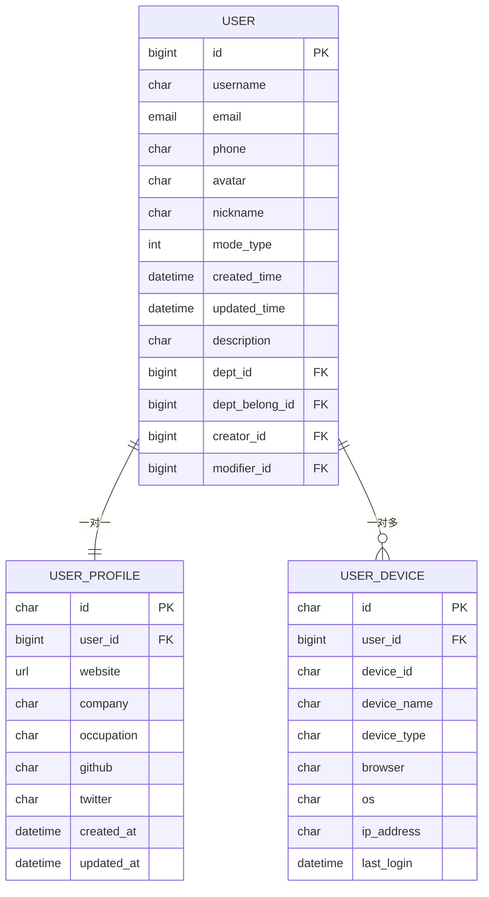
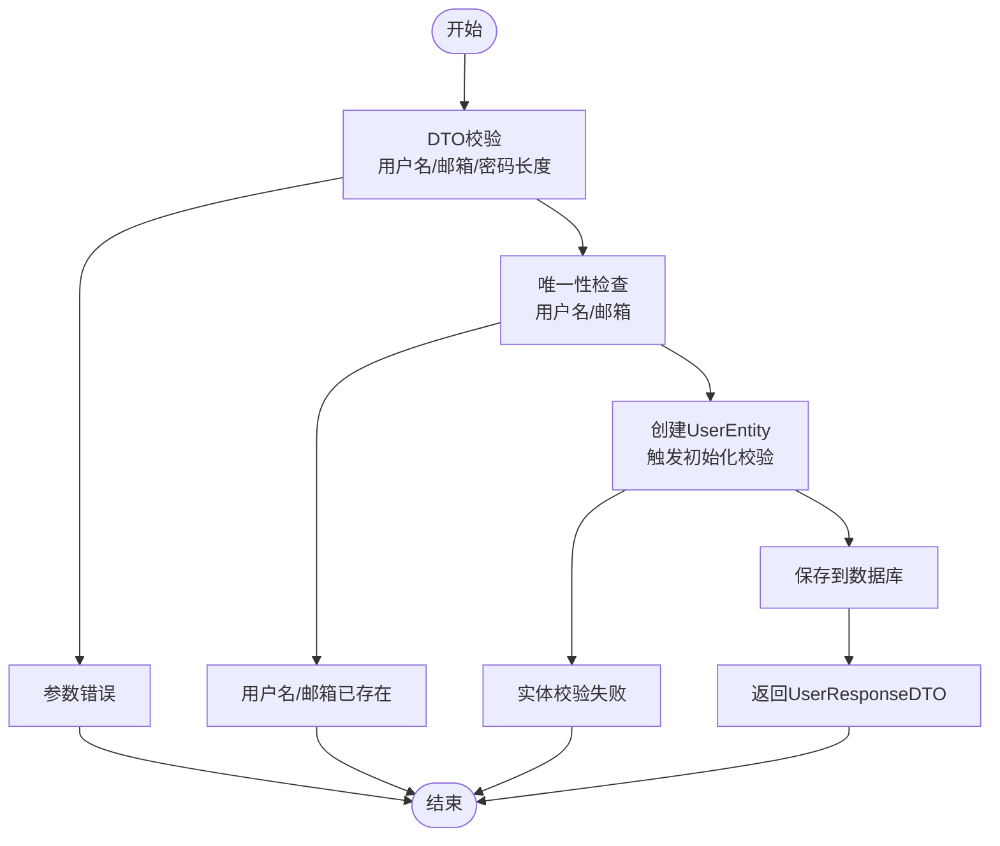
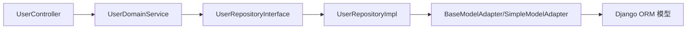

# 用户模型设计

<cite>
**本文档引用的文件**
- [src/domain/user/entities/user_entity.py](file://src/domain/user/entities/user_entity.py)
- [src/domain/user/entities/profile_entity.py](file://src/domain/user/entities/profile_entity.py)
- [src/domain/user/value_objects/email.py](file://src/domain/user/value_objects/email.py)
- [src/domain/user/value_objects/phone.py](file://src/domain/user/value_objects/phone.py)
- [src/infrastructure/persistence/models/user_models.py](file://src/infrastructure/persistence/models/user_models.py)
- [src/application/dto/user/user_create_dto.py](file://src/application/dto/user/user_create_dto.py)
- [src/application/dto/user/user_update_dto.py](file://src/application/dto/user/user_update_dto.py)
- [src/application/dto/user/user_response_dto.py](file://src/application/dto/user/user_response_dto.py)
- [src/domain/user/services/user_domain_service.py](file://src/domain/user/services/user_domain_service.py)
- [src/domain/user/repositories/user_repository.py](file://src/domain/user/repositories/user_repository.py)
- [src/infrastructure/repositories/user_repo_impl.py](file://src/infrastructure/repositories/user_repo_impl.py)
- [src/infrastructure/adapters/model_adapter.py](file://src/infrastructure/adapters/model_adapter.py)
- [src/api/v1/controllers/user_controller.py](file://src/api/v1/controllers/user_controller.py)
- [src/api/v1/user_api.py](file://src/api/v1/user_api.py)
- [tests/test_models/test_user_models.py](file://tests/test_models/test_user_models.py)
</cite>

## 目录
1. [简介](#简介)
2. [项目结构](#项目结构)
3. [核心组件](#核心组件)
4. [架构总览](#架构总览)
5. [详细组件分析](#详细组件分析)
6. [依赖关系分析](#依赖关系分析)
7. [性能考虑](#性能考虑)
8. [故障排除指南](#故障排除指南)
9. [结论](#结论)
10. [附录](#附录)

## 简介
本文件系统性阐述用户模型的设计与实现，覆盖领域实体（UserEntity）、用户资料实体（ProfileEntity）、值对象（Email、Phone）、数据库映射关系以及在实际业务中的使用方式与最佳实践。文档旨在帮助开发者理解用户模型的属性、行为、约束与数据流，确保在开发与维护过程中保持一致性和可扩展性。

## 项目结构
用户模型相关代码分布在多个层次：
- 领域层：用户实体、用户资料实体、值对象
- 应用层：DTO（数据传输对象）、领域服务
- 基础设施层：Django ORM 模型、仓储实现、模型适配器
- 接口层：API 控制器与路由

**图表来源**
- [src/api/v1/controllers/user_controller.py:33-283](file://src/api/v1/controllers/user_controller.py#L33-L283)
- [src/api/v1/user_api.py:1-150](file://src/api/v1/user_api.py#L1-L150)
- [src/domain/user/services/user_domain_service.py:1-117](file://src/domain/user/services/user_domain_service.py#L1-L117)
- [src/domain/user/repositories/user_repository.py:1-68](file://src/domain/user/repositories/user_repository.py#L1-L68)
- [src/infrastructure/repositories/user_repo_impl.py:1-138](file://src/infrastructure/repositories/user_repo_impl.py#L1-L138)
- [src/infrastructure/adapters/model_adapter.py:1-208](file://src/infrastructure/adapters/model_adapter.py#L1-L208)
- [src/infrastructure/persistence/models/user_models.py:1-147](file://src/infrastructure/persistence/models/user_models.py#L1-L147)

**章节来源**
- [src/api/v1/controllers/user_controller.py:33-283](file://src/api/v1/controllers/user_controller.py#L33-L283)
- [src/api/v1/user_api.py:1-150](file://src/api/v1/user_api.py#L1-L150)
- [src/domain/user/services/user_domain_service.py:1-117](file://src/domain/user/services/user_domain_service.py#L1-L117)
- [src/domain/user/repositories/user_repository.py:1-68](file://src/domain/user/repositories/user_repository.py#L1-L68)
- [src/infrastructure/repositories/user_repo_impl.py:1-138](file://src/infrastructure/repositories/user_repo_impl.py#L1-L138)
- [src/infrastructure/adapters/model_adapter.py:1-208](file://src/infrastructure/adapters/model_adapter.py#L1-L208)
- [src/infrastructure/persistence/models/user_models.py:1-147](file://src/infrastructure/persistence/models/user_models.py#L1-L147)

## 核心组件
本节聚焦用户模型的关键组成：用户实体、用户资料实体、值对象及其职责边界。

- 用户实体（UserEntity）
  - 负责承载用户核心属性与业务行为，如激活/停用、权限授予、最后登录时间更新、全名拼接、序列化等。
  - 内置基础验证（用户名长度、邮箱格式），并在初始化后自动触发校验。
- 用户资料实体（ProfileEntity）
  - 负责存储扩展信息（如性别、生日、地址、公司、职业等），并提供更新与序列化能力。
  - 包含创建与更新时间戳，默认值由构造函数设定。
- 邮箱值对象（Email）
  - 不可变对象，负责邮箱格式验证、域名提取、标准化（小写）等。
  - 构造时进行非空与格式校验，保证领域内邮箱的一致性与合法性。
- 电话值对象（Phone）
  - 不可变对象，支持国际格式，内置默认区号（+86），移除空格与连字符后进行格式校验。
  - 提供国家码处理、国内号码提取与格式化展示能力。

**章节来源**
- [src/domain/user/entities/user_entity.py:11-120](file://src/domain/user/entities/user_entity.py#L11-L120)
- [src/domain/user/entities/profile_entity.py:10-76](file://src/domain/user/entities/profile_entity.py#L10-L76)
- [src/domain/user/value_objects/email.py:10-40](file://src/domain/user/value_objects/email.py#L10-L40)
- [src/domain/user/value_objects/phone.py:10-50](file://src/domain/user/value_objects/phone.py#L10-L50)

## 架构总览
用户模型遵循分层架构与领域驱动设计（DDD）思想：
- 领域层：UserEntity、ProfileEntity、值对象，封装业务规则与不变量。
- 应用层：UserDomainService 组织业务用例，UserCreateDTO/UserUpdateDTO/UserResponseDTO 负责输入输出的数据契约。
- 基础设施层：Django ORM 模型（User、UserProfile、UserDevice）承担持久化；UserRepositoryImpl 实现数据访问；BaseModelAdapter/SimpleModelAdapter 提供模型与实体的双向转换。
- 接口层：UserController 与 user_api 路由负责接收请求、调用应用服务并返回响应。

**图表来源**
- [src/api/v1/controllers/user_controller.py:53-75](file://src/api/v1/controllers/user_controller.py#L53-L75)
- [src/domain/user/services/user_domain_service.py:19-40](file://src/domain/user/services/user_domain_service.py#L19-L40)
- [src/infrastructure/repositories/user_repo_impl.py:96-106](file://src/infrastructure/repositories/user_repo_impl.py#L96-L106)
- [src/infrastructure/persistence/models/user_models.py:12-87](file://src/infrastructure/persistence/models/user_models.py#L12-L87)

## 详细组件分析

### 用户实体（UserEntity）
- 属性设计
  - 标识符：user_id（默认生成UUID字符串）
  - 基本信息：username、email、password、first_name、last_name
  - 权限与状态：is_active、is_staff、is_superuser
  - 时间戳：date_joined、last_login
  - 扩展信息：avatar、phone、bio
- 行为方法
  - 更新资料：update_profile，按需更新字段并保留未传入字段
  - 权限管理：grant_staff、revoke_staff、grant_superuser、revoke_superuser
  - 状态管理：activate、deactivate
  - 登录追踪：update_last_login
  - 名称拼接：get_full_name
  - 序列化：to_dict，统一输出格式
- 约束与验证
  - 初始化后自动校验用户名长度（3-50）与邮箱格式（包含@）
  - 业务层面禁止空用户名与过短用户名

**图表来源**
- [src/domain/user/entities/user_entity.py:11-120](file://src/domain/user/entities/user_entity.py#L11-L120)

**章节来源**
- [src/domain/user/entities/user_entity.py:11-120](file://src/domain/user/entities/user_entity.py#L11-L120)

### 用户资料实体（ProfileEntity）
- 属性设计
  - 标识符：profile_id（默认空字符串）、user_id
  - 扩展信息：gender、birthday、address、city、country、website、company、occupation
  - 时间戳：created_at、updated_at（默认当前时间）
- 行为方法
  - 更新：update，按需更新字段并刷新updated_at
  - 序列化：to_dict，统一输出格式
- 默认值与验证
  - 默认值通过构造函数字段赋值
  - 无显式格式校验，遵循上层DTO与仓储约束

**图表来源**
- [src/domain/user/entities/profile_entity.py:10-76](file://src/domain/user/entities/profile_entity.py#L10-L76)

**章节来源**
- [src/domain/user/entities/profile_entity.py:10-76](file://src/domain/user/entities/profile_entity.py#L10-L76)

### 邮箱值对象（Email）
- 设计要点
  - 不可变对象（frozen=True），确保邮箱在领域内不可变
  - 构造时执行非空与格式校验（正则匹配）
  - 提供域名提取与标准化（小写）能力
- 约束与规范
  - 格式必须符合标准邮箱正则
  - 业务层可直接使用该值对象避免格式不一致

**图表来源**
- [src/domain/user/value_objects/email.py:10-40](file://src/domain/user/value_objects/email.py#L10-L40)

**章节来源**
- [src/domain/user/value_objects/email.py:10-40](file://src/domain/user/value_objects/email.py#L10-L40)

### 电话值对象（Phone）
- 设计要点
  - 不可变对象，内置默认区号（+86）
  - 构造时移除空格与连字符，校验中国手机号格式（1开头11位）
  - 提供国家码处理、国内号码提取与格式化展示
- 约束与规范
  - 仅支持中国手机号格式校验
  - 若传入带区号的号码，会剥离国家码进行校验与展示

**图表来源**
- [src/domain/user/value_objects/phone.py:10-50](file://src/domain/user/value_objects/phone.py#L10-L50)

**章节来源**
- [src/domain/user/value_objects/phone.py:10-50](file://src/domain/user/value_objects/phone.py#L10-L50)

### 数据库映射关系
- 用户模型（User）
  - 主键：id（BigAutoField）
  - 基本信息：username、email（EmailField）、phone（CharField，最大16）
  - 扩展信息：avatar（CharField，最大100）、nickname（CharField，最大150，缺省空串）
  - 部门关系：dept、dept_belong（外键到SystemDeptInfo，可空）
  - 创建者与修改者：creator、modifier（自引用外键，可空）
  - 系统字段：mode_type、description、created_time、updated_time
  - 索引：username、email、phone 的普通索引
- 用户档案模型（UserProfile）
  - 主键：id（UUIDField，主键，缺省UUID）
  - 关联：user（OneToOneField，级联删除，反向名为profile）
  - 扩展信息：website（URLField）、company、occupation、github、twitter（CharField）
  - 时间戳：created_at、updated_at
- 用户设备模型（UserDevice）
  - 主键：id（UUIDField，主键，缺省UUID）
  - 关联：user（ForeignKey，CASCADE，反向名为devices）
  - 设备信息：device_id、device_name、device_type、browser、os
  - 网络信息：ip_address（GenericIPAddressField）
  - 时间戳：last_login
  - 唯一约束：user 与 device_id 的联合唯一

**图表来源**
- [src/infrastructure/persistence/models/user_models.py:12-147](file://src/infrastructure/persistence/models/user_models.py#L12-L147)

**章节来源**
- [src/infrastructure/persistence/models/user_models.py:12-147](file://src/infrastructure/persistence/models/user_models.py#L12-L147)

### 使用示例与最佳实践
- 输入验证与DTO
  - 用户创建：UserCreateDTO 对用户名长度（3-50）、邮箱（EmailStr）、密码长度（≥6）进行约束
  - 用户更新：UserUpdateDTO 对可选字段进行长度与类型约束
  - 响应：UserResponseDTO 明确输出字段，支持 from_attributes
- 业务流程
  - 用户创建：UserDomainService 先检查用户名与邮箱唯一性，再创建UserEntity并保存
  - 用户更新：按需更新UserEntity字段，支持部分更新
  - 权限变更：grant_staff、grant_superuser、revoke_staff、revoke_superuser
  - 密码修改：校验旧密码一致性后更新
- 错误处理
  - 用户不存在、重复用户名/邮箱、未登录/令牌无效等场景抛出明确异常
- 性能优化
  - 数据库索引：username、email、phone 已建立索引
  - 分页查询：list_users 支持分页，避免一次性加载过多数据
  - DTO序列化：使用Pydantic模型，提升序列化性能与类型安全

**图表来源**
- [src/application/dto/user/user_create_dto.py:9-34](file://src/application/dto/user/user_create_dto.py#L9-L34)
- [src/domain/user/services/user_domain_service.py:19-40](file://src/domain/user/services/user_domain_service.py#L19-L40)

**章节来源**
- [src/application/dto/user/user_create_dto.py:9-34](file://src/application/dto/user/user_create_dto.py#L9-L34)
- [src/application/dto/user/user_update_dto.py:9-32](file://src/application/dto/user/user_update_dto.py#L9-L32)
- [src/application/dto/user/user_response_dto.py:11-30](file://src/application/dto/user/user_response_dto.py#L11-L30)
- [src/domain/user/services/user_domain_service.py:19-117](file://src/domain/user/services/user_domain_service.py#L19-L117)

## 依赖关系分析
- 控制器到服务：UserController 通过依赖注入或构造函数获取 UserService，调用业务方法
- 服务到仓储：UserDomainService 通过 UserRepositoryInterface 抽象访问数据
- 仓储到适配器：UserRepositoryImpl 使用 BaseModelAdapter/SimpleModelAdapter 进行模型与实体转换
- 适配器到ORM：适配器将实体映射到 Django ORM 模型，完成持久化

**图表来源**
- [src/api/v1/controllers/user_controller.py:44-51](file://src/api/v1/controllers/user_controller.py#L44-L51)
- [src/domain/user/services/user_domain_service.py:16-17](file://src/domain/user/services/user_domain_service.py#L16-L17)
- [src/domain/user/repositories/user_repository.py:19-67](file://src/domain/user/repositories/user_repository.py#L19-L67)
- [src/infrastructure/repositories/user_repo_impl.py:13-17](file://src/infrastructure/repositories/user_repo_impl.py#L13-L17)
- [src/infrastructure/adapters/model_adapter.py:17-37](file://src/infrastructure/adapters/model_adapter.py#L17-L37)

**章节来源**
- [src/api/v1/controllers/user_controller.py:44-51](file://src/api/v1/controllers/user_controller.py#L44-L51)
- [src/domain/user/services/user_domain_service.py:16-17](file://src/domain/user/services/user_domain_service.py#L16-L17)
- [src/domain/user/repositories/user_repository.py:19-67](file://src/domain/user/repositories/user_repository.py#L19-L67)
- [src/infrastructure/repositories/user_repo_impl.py:13-17](file://src/infrastructure/repositories/user_repo_impl.py#L13-L17)
- [src/infrastructure/adapters/model_adapter.py:17-37](file://src/infrastructure/adapters/model_adapter.py#L17-L37)

## 性能考虑
- 数据库索引
  - 用户表对 username、email、phone 建立索引，有利于高频查询与去重
- 查询与分页
  - list_users 支持分页，避免一次性拉取大量数据
- 序列化与DTO
  - 使用 Pydantic 模型进行输入输出，具备类型校验与高性能序列化
- 异步ORM
  - 使用 Django 的异步ORM方法（aget/asave/acount/aexists）提升并发性能

**章节来源**
- [src/infrastructure/persistence/models/user_models.py:76-80](file://src/infrastructure/persistence/models/user_models.py#L76-L80)
- [src/infrastructure/repositories/user_repo_impl.py:117-133](file://src/infrastructure/repositories/user_repo_impl.py#L117-L133)
- [src/api/v1/user_api.py:75-87](file://src/api/v1/user_api.py#L75-L87)

## 故障排除指南
- 常见错误与定位
  - 用户名/邮箱重复：UserDomainService 在创建用户时检查唯一性，若重复抛出异常
  - 用户不存在：get_by_id 或凭据认证失败时返回“用户不存在”
  - 未登录/令牌无效：控制器从请求头解析 Bearer Token，无效时返回相应错误
  - 邮箱/电话格式错误：值对象构造时触发格式校验，抛出异常
- 测试验证
  - 用户模型测试覆盖创建用户、超级用户、字符串表示等
  - 用户档案模型测试覆盖档案创建、自动创建与字符串表示

**章节来源**
- [src/domain/user/services/user_domain_service.py:23-29](file://src/domain/user/services/user_domain_service.py#L23-L29)
- [src/api/v1/controllers/user_controller.py:262-282](file://src/api/v1/controllers/user_controller.py#L262-L282)
- [src/domain/user/value_objects/email.py:19-23](file://src/domain/user/value_objects/email.py#L19-L23)
- [src/domain/user/value_objects/phone.py:21-27](file://src/domain/user/value_objects/phone.py#L21-L27)
- [tests/test_models/test_user_models.py:17-45](file://tests/test_models/test_user_models.py#L17-L45)

## 结论
本用户模型设计以领域驱动为核心，通过实体、值对象与仓储抽象清晰分离关注点，结合DTO与异步ORM实现高效稳定的用户管理能力。数据库层面通过索引与合理的字段设计提升查询性能，接口层提供完善的错误处理与权限控制。遵循本文档的最佳实践，可在保证数据一致性的同时提升系统的可维护性与扩展性。

## 附录
- 值对象使用建议
  - 邮箱：优先使用 Email 值对象进行构造与比较，避免直接使用原始字符串
  - 电话：优先使用 Phone 值对象，确保格式统一与展示一致
- DTO与实体映射
  - 使用 BaseModelAdapter/SimpleModelAdapter 进行模型与实体的双向转换，减少样板代码
- API调用示例路径
  - 创建用户：[src/api/v1/controllers/user_controller.py:53-75](file://src/api/v1/controllers/user_controller.py#L53-L75)
  - 获取用户详情：[src/api/v1/controllers/user_controller.py:77-101](file://src/api/v1/controllers/user_controller.py#L77-L101)
  - 更新用户：[src/api/v1/controllers/user_controller.py:135-162](file://src/api/v1/controllers/user_controller.py#L135-L162)
  - 删除用户：[src/api/v1/controllers/user_controller.py:164-188](file://src/api/v1/controllers/user_controller.py#L164-L188)
  - 修改密码：[src/api/v1/controllers/user_controller.py:190-225](file://src/api/v1/controllers/user_controller.py#L190-L225)
  - 获取当前用户：[src/api/v1/controllers/user_controller.py:227-260](file://src/api/v1/controllers/user_controller.py#L227-L260)