# 用户管理系统

<cite>
**本文档引用的文件**
- [src/domain/user/entities/user_entity.py](file://src/domain/user/entities/user_entity.py)
- [src/domain/user/entities/profile_entity.py](file://src/domain/user/entities/profile_entity.py)
- [src/domain/user/value_objects/email.py](file://src/domain/user/value_objects/email.py)
- [src/domain/user/value_objects/phone.py](file://src/domain/user/value_objects/phone.py)
- [src/application/services/user_service.py](file://src/application/services/user_service.py)
- [src/infrastructure/repositories/user_repo_impl.py](file://src/infrastructure/repositories/user_repo_impl.py)
- [src/api/v1/controllers/user_controller.py](file://src/api/v1/controllers/user_controller.py)
- [src/api/v1/user_api.py](file://src/api/v1/user_api.py)
- [src/application/dto/user/user_create_dto.py](file://src/application/dto/user/user_create_dto.py)
- [src/application/dto/user/user_update_dto.py](file://src/application/dto/user/user_update_dto.py)
- [src/application/dto/user/user_response_dto.py](file://src/application/dto/user/user_response_dto.py)
- [src/application/dto/user/change_password_dto.py](file://src/application/dto/user/change_password_dto.py)
- [src/infrastructure/persistence/models/user_models.py](file://src/infrastructure/persistence/models/user_models.py)
- [src/domain/user/repositories/user_repository.py](file://src/domain/user/repositories/user_repository.py)
- [src/api/common/permissions.py](file://src/api/common/permissions.py)
</cite>

## 目录
1. [引言](#引言)
2. [项目结构](#项目结构)
3. [核心组件](#核心组件)
4. [架构总览](#架构总览)
5. [详细组件分析](#详细组件分析)
6. [依赖关系分析](#依赖关系分析)
7. [性能考虑](#性能考虑)
8. [故障排除指南](#故障排除指南)
9. [结论](#结论)
10. [附录](#附录)

## 引言
本项目是一个基于 Django Ninja 的用户管理系统，采用领域驱动设计（DDD）与分层架构，涵盖用户模型设计、控制器接口、应用服务、仓储实现、领域值对象以及权限控制等模块。系统提供完整的用户 CRUD、认证、密码管理、用户状态与权限管理能力，并通过 DTO 和实体解耦表现层与业务层。

## 项目结构
系统采用分层架构，主要分为以下层次：
- 表现层：API 控制器与路由，负责接收请求、参数校验与响应封装
- 应用层：应用服务，编排业务流程，处理跨实体的业务规则
- 领域层：实体与值对象，承载业务语义与不变量
- 基础设施层：仓储实现与数据模型，负责数据持久化与查询优化
- 权限层：自定义权限类，集成 JWT 令牌校验与 RBAC 权限检查

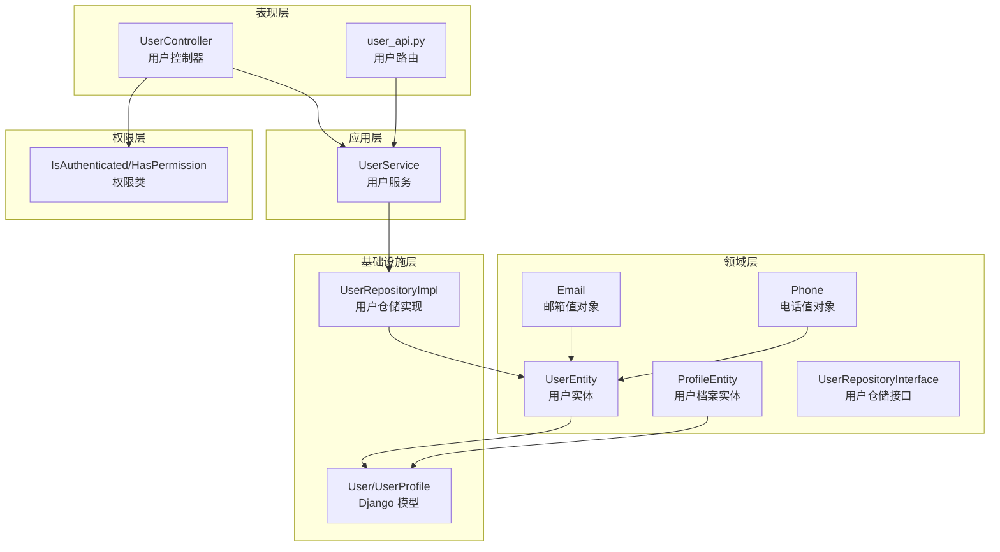

**图表来源**
- [src/api/v1/controllers/user_controller.py:33-283](file://src/api/v1/controllers/user_controller.py#L33-L283)
- [src/api/v1/user_api.py:18-150](file://src/api/v1/user_api.py#L18-L150)
- [src/application/services/user_service.py:15-172](file://src/application/services/user_service.py#L15-L172)
- [src/infrastructure/repositories/user_repo_impl.py:13-138](file://src/infrastructure/repositories/user_repo_impl.py#L13-L138)
- [src/domain/user/entities/user_entity.py:11-120](file://src/domain/user/entities/user_entity.py#L11-L120)
- [src/domain/user/entities/profile_entity.py:10-76](file://src/domain/user/entities/profile_entity.py#L10-L76)
- [src/domain/user/value_objects/email.py:10-40](file://src/domain/user/value_objects/email.py#L10-L40)
- [src/domain/user/value_objects/phone.py:10-50](file://src/domain/user/value_objects/phone.py#L10-L50)
- [src/infrastructure/persistence/models/user_models.py:12-147](file://src/infrastructure/persistence/models/user_models.py#L12-L147)
- [src/api/common/permissions.py:14-245](file://src/api/common/permissions.py#L14-L245)

**章节来源**
- [src/api/v1/controllers/user_controller.py:33-283](file://src/api/v1/controllers/user_controller.py#L33-L283)
- [src/api/v1/user_api.py:18-150](file://src/api/v1/user_api.py#L18-L150)
- [src/application/services/user_service.py:15-172](file://src/application/services/user_service.py#L15-L172)
- [src/infrastructure/repositories/user_repo_impl.py:13-138](file://src/infrastructure/repositories/user_repo_impl.py#L13-L138)
- [src/domain/user/entities/user_entity.py:11-120](file://src/domain/user/entities/user_entity.py#L11-L120)
- [src/domain/user/entities/profile_entity.py:10-76](file://src/domain/user/entities/profile_entity.py#L10-L76)
- [src/domain/user/value_objects/email.py:10-40](file://src/domain/user/value_objects/email.py#L10-L40)
- [src/domain/user/value_objects/phone.py:10-50](file://src/domain/user/value_objects/phone.py#L10-L50)
- [src/infrastructure/persistence/models/user_models.py:12-147](file://src/infrastructure/persistence/models/user_models.py#L12-L147)
- [src/api/common/permissions.py:14-245](file://src/api/common/permissions.py#L14-L245)

## 核心组件
- 用户实体：包含用户标识、基础信息、状态标志、时间戳等属性，并提供激活/停用、权限授予/撤销、登录时间更新等业务方法
- 用户档案实体：存储扩展信息，提供更新与序列化能力
- 邮箱值对象：不可变对象，负责邮箱格式验证、标准化与域名提取
- 电话值对象：不可变对象，支持国际区号默认值、格式验证与号码标准化
- 用户服务：封装用户注册、认证、密码修改、查询、分页、缓存等业务逻辑
- 用户仓储：定义数据访问契约，实现基于 Django ORM 的异步查询与持久化
- 用户控制器：暴露 REST API，处理请求参数、权限校验与响应封装
- DTO：用户创建、更新、响应与密码修改的数据传输对象
- 权限类：基于 JWT 的认证与 RBAC 权限控制

**章节来源**
- [src/domain/user/entities/user_entity.py:11-120](file://src/domain/user/entities/user_entity.py#L11-L120)
- [src/domain/user/entities/profile_entity.py:10-76](file://src/domain/user/entities/profile_entity.py#L10-L76)
- [src/domain/user/value_objects/email.py:10-40](file://src/domain/user/value_objects/email.py#L10-L40)
- [src/domain/user/value_objects/phone.py:10-50](file://src/domain/user/value_objects/phone.py#L10-L50)
- [src/application/services/user_service.py:15-172](file://src/application/services/user_service.py#L15-L172)
- [src/infrastructure/repositories/user_repo_impl.py:13-138](file://src/infrastructure/repositories/user_repo_impl.py#L13-L138)
- [src/api/v1/controllers/user_controller.py:33-283](file://src/api/v1/controllers/user_controller.py#L33-L283)
- [src/application/dto/user/user_create_dto.py:9-34](file://src/application/dto/user/user_create_dto.py#L9-L34)
- [src/application/dto/user/user_update_dto.py:9-32](file://src/application/dto/user/user_update_dto.py#L9-L32)
- [src/application/dto/user/user_response_dto.py:11-30](file://src/application/dto/user/user_response_dto.py#L11-L30)
- [src/application/dto/user/change_password_dto.py:9-23](file://src/application/dto/user/change_password_dto.py#L9-L23)
- [src/api/common/permissions.py:14-245](file://src/api/common/permissions.py#L14-L245)

## 架构总览
系统遵循 DDD 与分层架构，控制器仅负责输入输出，应用服务编排业务，仓储屏蔽数据访问细节，领域模型承载业务不变量。权限类统一处理认证与授权。

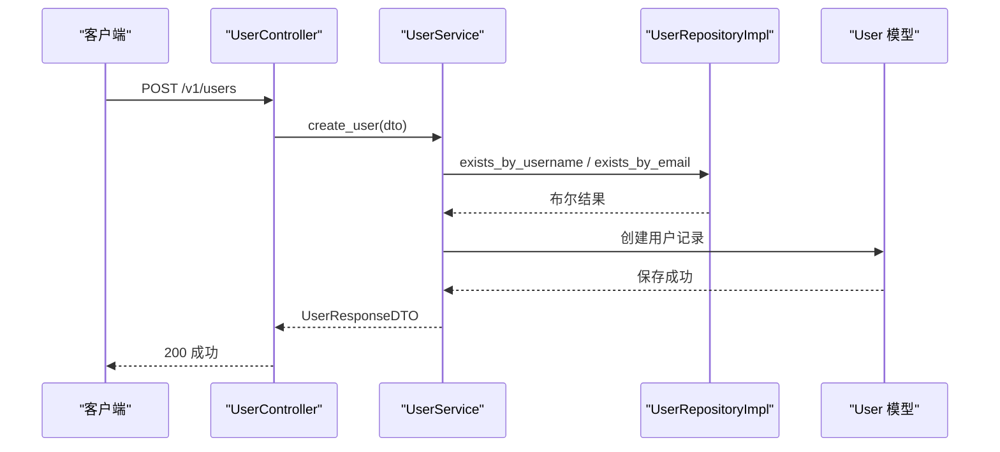

**图表来源**
- [src/api/v1/controllers/user_controller.py:53-76](file://src/api/v1/controllers/user_controller.py#L53-L76)
- [src/application/services/user_service.py:28-51](file://src/application/services/user_service.py#L28-L51)
- [src/infrastructure/repositories/user_repo_impl.py:123-129](file://src/infrastructure/repositories/user_repo_impl.py#L123-L129)
- [src/infrastructure/persistence/models/user_models.py:12-87](file://src/infrastructure/persistence/models/user_models.py#L12-L87)

**章节来源**
- [src/api/v1/controllers/user_controller.py:33-283](file://src/api/v1/controllers/user_controller.py#L33-L283)
- [src/application/services/user_service.py:15-172](file://src/application/services/user_service.py#L15-L172)
- [src/infrastructure/repositories/user_repo_impl.py:13-138](file://src/infrastructure/repositories/user_repo_impl.py#L13-L138)
- [src/infrastructure/persistence/models/user_models.py:12-147](file://src/infrastructure/persistence/models/user_models.py#L12-L147)

## 详细组件分析

### 用户实体分析
用户实体是领域模型的核心，包含用户标识、基础信息、状态标志与时间戳，并提供业务方法：
- 属性：用户 ID、用户名、邮箱、密码、姓名、状态标志、时间戳、联系方式等
- 行为：更新资料、激活/停用、授予/撤销员工与超级管理员权限、更新最后登录时间、序列化为字典
- 约束：用户名长度范围、邮箱格式校验；初始化后自动验证

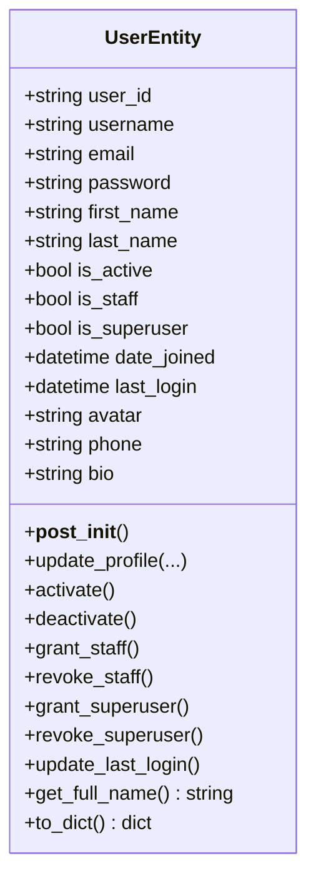

**图表来源**
- [src/domain/user/entities/user_entity.py:11-120](file://src/domain/user/entities/user_entity.py#L11-L120)

**章节来源**
- [src/domain/user/entities/user_entity.py:11-120](file://src/domain/user/entities/user_entity.py#L11-L120)

### 用户档案实体分析
用户档案实体用于存储扩展信息，提供更新与序列化能力：
- 属性：档案 ID、用户 ID、性别、生日、地址、城市、国家、网站、公司、职业等
- 行为：批量更新扩展信息并更新时间戳、序列化为字典

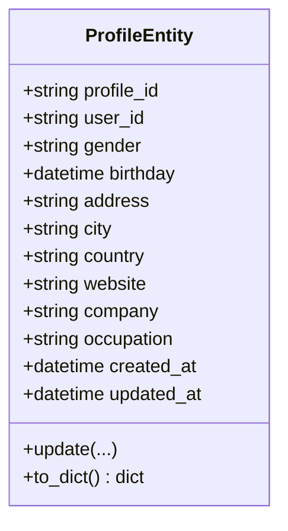

**图表来源**
- [src/domain/user/entities/profile_entity.py:10-76](file://src/domain/user/entities/profile_entity.py#L10-L76)

**章节来源**
- [src/domain/user/entities/profile_entity.py:10-76](file://src/domain/user/entities/profile_entity.py#L10-L76)

### 邮箱值对象分析
邮箱值对象是不可变对象，负责邮箱格式验证、标准化与域名提取：
- 属性：值、验证与标准化逻辑
- 行为：格式校验、获取域名、标准化为小写、字符串表示

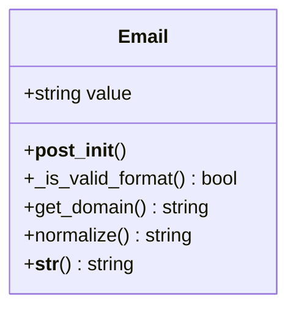

**图表来源**
- [src/domain/user/value_objects/email.py:10-40](file://src/domain/user/value_objects/email.py#L10-L40)

**章节来源**
- [src/domain/user/value_objects/email.py:10-40](file://src/domain/user/value_objects/email.py#L10-L40)

### 电话值对象分析
电话值对象是不可变对象，支持国际区号默认值、格式验证与号码标准化：
- 属性：值、默认区号
- 行为：移除空格与连字符、格式校验、获取国内号码、格式化显示、字符串表示

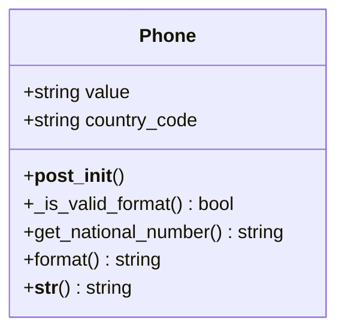

**图表来源**
- [src/domain/user/value_objects/phone.py:10-50](file://src/domain/user/value_objects/phone.py#L10-L50)

**章节来源**
- [src/domain/user/value_objects/phone.py:10-50](file://src/domain/user/value_objects/phone.py#L10-L50)

### 用户服务分析
用户服务封装核心业务逻辑：
- 注册：检查用户名与邮箱唯一性，创建用户并保存
- 查询：按 ID/用户名/邮箱获取用户，支持分页与总数统计
- 更新：动态更新用户字段并清除缓存
- 删除：删除用户并清理相关缓存
- 密码修改：校验原密码，更新新密码
- 认证：校验用户状态与密码，更新最后登录时间

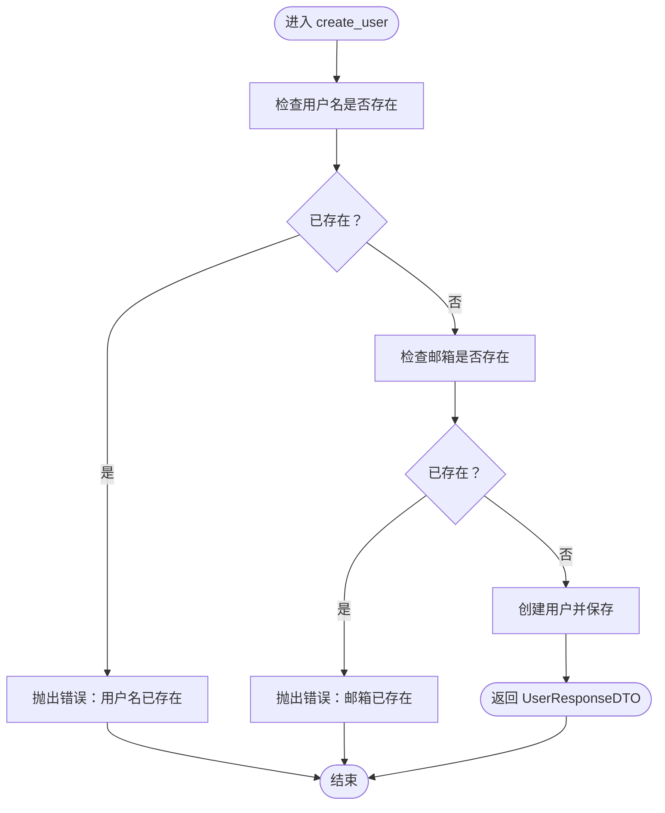

**图表来源**
- [src/application/services/user_service.py:28-51](file://src/application/services/user_service.py#L28-L51)

**章节来源**
- [src/application/services/user_service.py:15-172](file://src/application/services/user_service.py#L15-L172)

### 用户仓储实现分析
用户仓储实现数据访问契约，屏蔽 ORM 细节：
- 映射：实体与模型之间的双向转换
- 查询：按 ID/用户名/邮箱获取、分页列表、计数
- 写入：保存与更新用户
- 删除：按 ID 删除
- 唯一性：用户名与邮箱唯一性检查

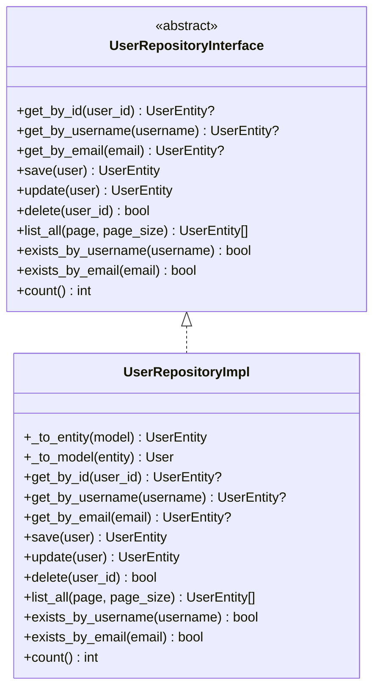

**图表来源**
- [src/domain/user/repositories/user_repository.py:11-68](file://src/domain/user/repositories/user_repository.py#L11-L68)
- [src/infrastructure/repositories/user_repo_impl.py:13-138](file://src/infrastructure/repositories/user_repo_impl.py#L13-L138)

**章节来源**
- [src/domain/user/repositories/user_repository.py:11-68](file://src/domain/user/repositories/user_repository.py#L11-L68)
- [src/infrastructure/repositories/user_repo_impl.py:13-138](file://src/infrastructure/repositories/user_repo_impl.py#L13-L138)

### 用户控制器分析
用户控制器暴露 REST API，处理请求与响应：
- 创建用户：POST /v1/users
- 获取用户详情：GET /v1/users/{user_id}
- 获取用户列表：GET /v1/users?page&page_size
- 更新用户：PUT /v1/users/{user_id}
- 删除用户：DELETE /v1/users/{user_id}
- 修改密码：POST /v1/users/change-password（需认证）
- 获取当前用户：GET /v1/me（需认证）

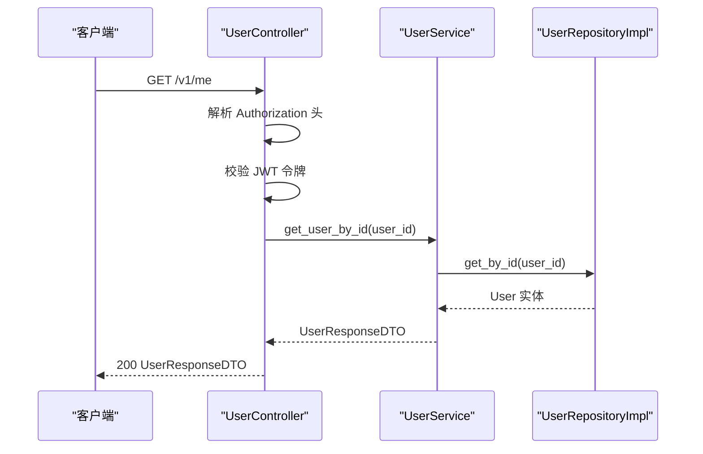

**图表来源**
- [src/api/v1/controllers/user_controller.py:227-261](file://src/api/v1/controllers/user_controller.py#L227-L261)
- [src/application/services/user_service.py:52-74](file://src/application/services/user_service.py#L52-L74)
- [src/infrastructure/repositories/user_repo_impl.py:72-86](file://src/infrastructure/repositories/user_repo_impl.py#L72-L86)

**章节来源**
- [src/api/v1/controllers/user_controller.py:33-283](file://src/api/v1/controllers/user_controller.py#L33-L283)

### 权限控制分析
系统提供多种权限控制方式：
- 认证：Bearer 令牌校验，注入用户信息到请求对象
- RBAC 权限：检查用户是否拥有指定权限或任一权限
- 管理员：检查用户角色是否包含 admin
- 公开访问：允许任何用户访问

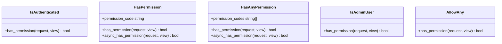

**图表来源**
- [src/api/common/permissions.py:14-245](file://src/api/common/permissions.py#L14-L245)

**章节来源**
- [src/api/common/permissions.py:14-245](file://src/api/common/permissions.py#L14-L245)

## 依赖关系分析
- 控制器依赖应用服务，应用服务依赖仓储接口，仓储实现依赖 Django 模型
- 领域实体与值对象不依赖外部框架，保证业务逻辑独立性
- DTO 作为跨层数据载体，避免直接暴露模型与实体
- 权限类统一处理认证与授权，减少控制器重复逻辑

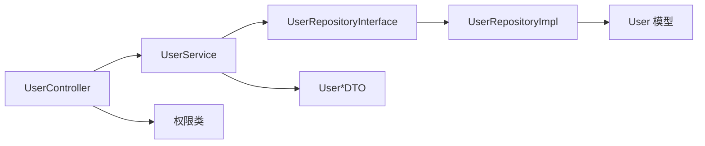

**图表来源**
- [src/api/v1/controllers/user_controller.py:33-283](file://src/api/v1/controllers/user_controller.py#L33-L283)
- [src/application/services/user_service.py:15-172](file://src/application/services/user_service.py#L15-L172)
- [src/infrastructure/repositories/user_repo_impl.py:13-138](file://src/infrastructure/repositories/user_repo_impl.py#L13-L138)
- [src/infrastructure/persistence/models/user_models.py:12-147](file://src/infrastructure/persistence/models/user_models.py#L12-L147)
- [src/api/common/permissions.py:14-245](file://src/api/common/permissions.py#L14-L245)

**章节来源**
- [src/api/v1/controllers/user_controller.py:33-283](file://src/api/v1/controllers/user_controller.py#L33-L283)
- [src/application/services/user_service.py:15-172](file://src/application/services/user_service.py#L15-L172)
- [src/infrastructure/repositories/user_repo_impl.py:13-138](file://src/infrastructure/repositories/user_repo_impl.py#L13-L138)
- [src/infrastructure/persistence/models/user_models.py:12-147](file://src/infrastructure/persistence/models/user_models.py#L12-L147)
- [src/api/common/permissions.py:14-245](file://src/api/common/permissions.py#L14-L245)

## 性能考虑
- 缓存：用户查询优先从缓存读取，更新与删除后清理缓存，降低数据库压力
- 分页：列表查询支持分页与总数统计，避免一次性加载大量数据
- 索引：用户模型定义了用户名、邮箱、手机号索引，提升查询效率
- 异步：仓储与服务均采用异步实现，提高并发处理能力
- DTO 序列化：响应 DTO 使用 from_attributes，减少不必要的转换成本

**章节来源**
- [src/application/services/user_service.py:54-66](file://src/application/services/user_service.py#L54-L66)
- [src/infrastructure/persistence/models/user_models.py:76-80](file://src/infrastructure/persistence/models/user_models.py#L76-L80)
- [src/application/dto/user/user_response_dto.py:28-30](file://src/application/dto/user/user_response_dto.py#L28-L30)

## 故障排除指南
- 用户不存在：查询用户时若返回空，控制器会抛出错误；请确认用户 ID 或凭据
- 令牌无效：认证接口要求 Bearer 令牌，若解析失败或校验失败将拒绝访问
- 密码错误：认证时若密码不匹配或用户被停用，将返回认证失败
- 唯一性冲突：注册时用户名或邮箱已存在会触发错误，需更换唯一字段
- 权限不足：访问受控接口时需具备相应权限，否则会被拒绝

**章节来源**
- [src/api/v1/controllers/user_controller.py:98-101](file://src/api/v1/controllers/user_controller.py#L98-L101)
- [src/application/services/user_service.py:131-149](file://src/application/services/user_service.py#L131-L149)
- [src/application/services/user_service.py:30-36](file://src/application/services/user_service.py#L30-L36)
- [src/api/common/permissions.py:20-44](file://src/api/common/permissions.py#L20-L44)

## 结论
该用户管理系统通过清晰的分层与领域建模，实现了用户 CRUD、认证、密码管理与权限控制等核心功能。实体与值对象保障业务不变量，应用服务编排业务流程，仓储屏蔽数据访问细节，权限类统一处理认证与授权。系统具备良好的扩展性与可维护性，适合在企业级场景中部署与演进。

## 附录

### API 接口文档
- 创建用户
  - 方法：POST
  - 路径：/v1/users
  - 认证：无需
  - 请求体：UserCreateDTO
  - 响应：UserResponseDTO
- 获取用户详情
  - 方法：GET
  - 路径：/v1/users/{user_id}
  - 认证：无需
  - 响应：UserResponseDTO
- 获取用户列表
  - 方法：GET
  - 路径：/v1/users
  - 认证：无需
  - 查询参数：page（≥1）、page_size（1-100）
  - 响应：包含 users、total、page、page_size 的列表响应
- 更新用户
  - 方法：PUT
  - 路径：/v1/users/{user_id}
  - 认证：无需
  - 请求体：UserUpdateDTO
  - 响应：UserResponseDTO
- 删除用户
  - 方法：DELETE
  - 路径：/v1/users/{user_id}
  - 认证：无需
  - 响应：MessageResponse
- 修改密码
  - 方法：POST
  - 路径：/v1/users/change-password
  - 认证：需要（Bearer 令牌）
  - 请求体：ChangePasswordDTO
  - 响应：MessageResponse
- 获取当前用户
  - 方法：GET
  - 路径：/v1/me
  - 认证：需要（Bearer 令牌）
  - 响应：UserResponseDTO

**章节来源**
- [src/api/v1/controllers/user_controller.py:53-261](file://src/api/v1/controllers/user_controller.py#L53-L261)
- [src/api/v1/user_api.py:50-150](file://src/api/v1/user_api.py#L50-L150)

### 用户状态管理与权限继承机制
- 用户状态：is_active 控制账户启用/停用；认证时会检查状态
- 权限继承：通过 RBAC 服务检查用户权限，支持单权限与任一权限检查
- 管理员：通过角色判断是否为管理员

**章节来源**
- [src/domain/user/entities/user_entity.py:71-93](file://src/domain/user/entities/user_entity.py#L71-L93)
- [src/application/services/user_service.py:131-149](file://src/application/services/user_service.py#L131-L149)
- [src/api/common/permissions.py:47-121](file://src/api/common/permissions.py#L47-L121)
- [src/api/common/permissions.py:198-233](file://src/api/common/permissions.py#L198-L233)