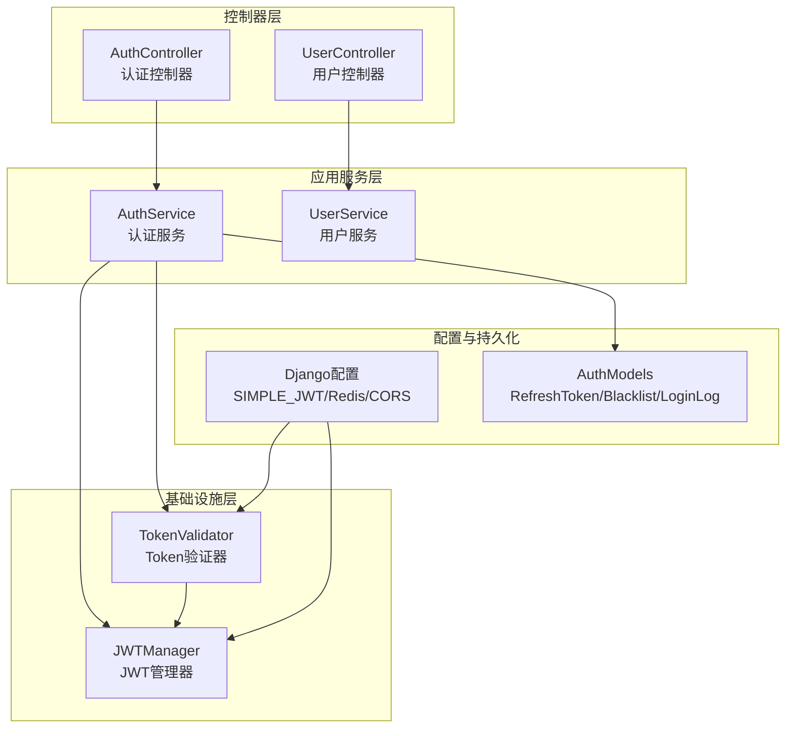
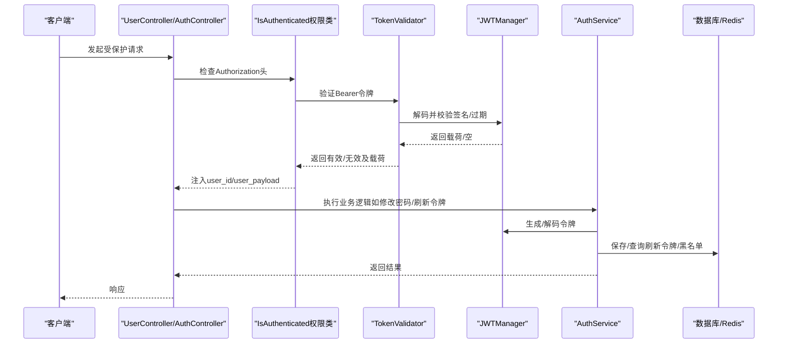
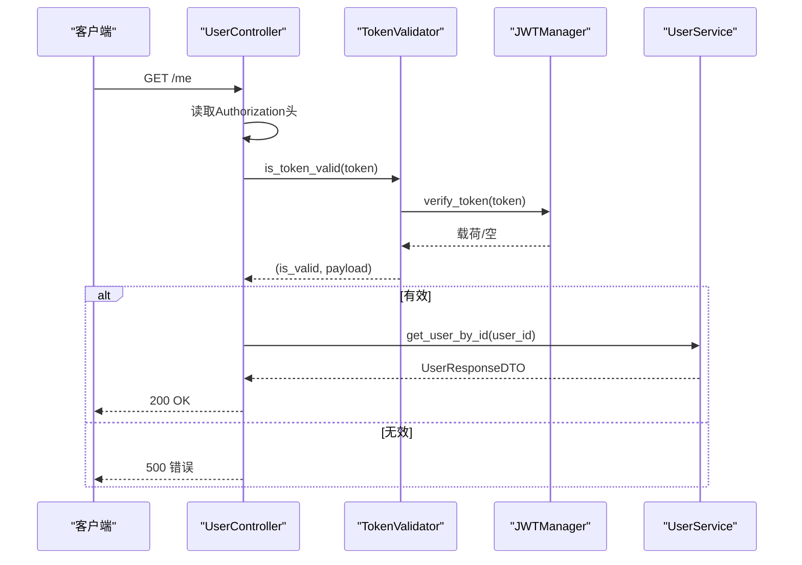
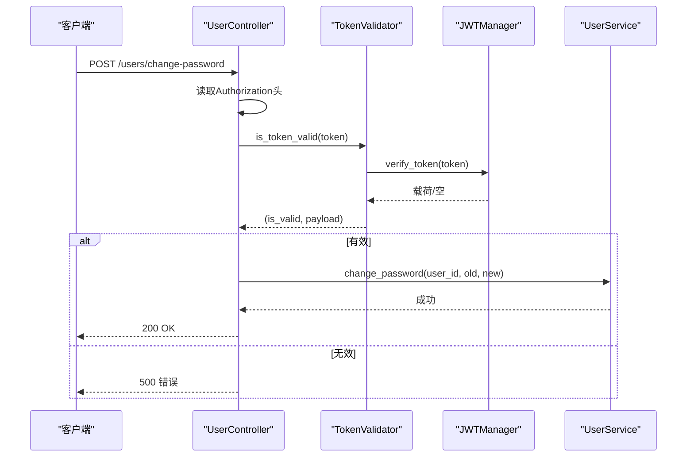
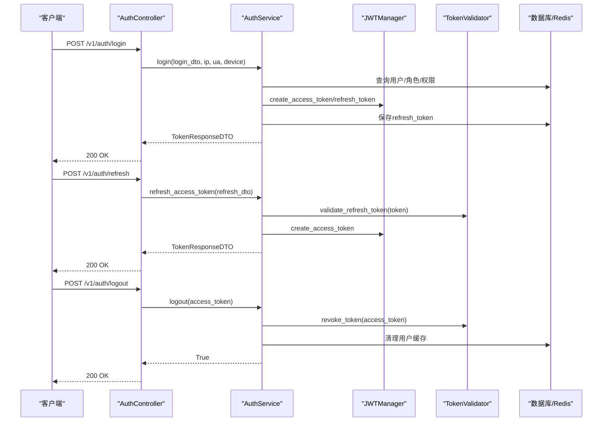
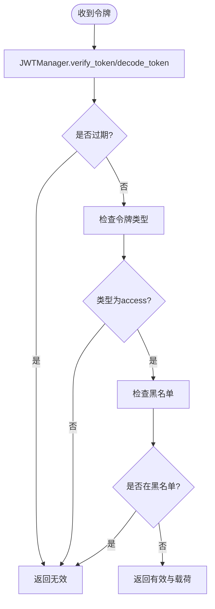
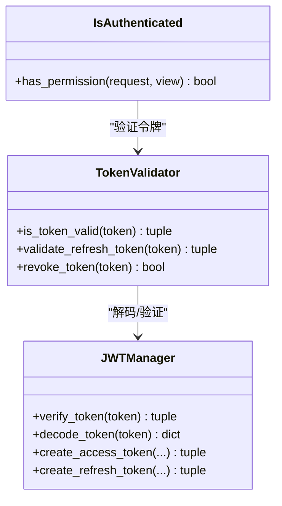
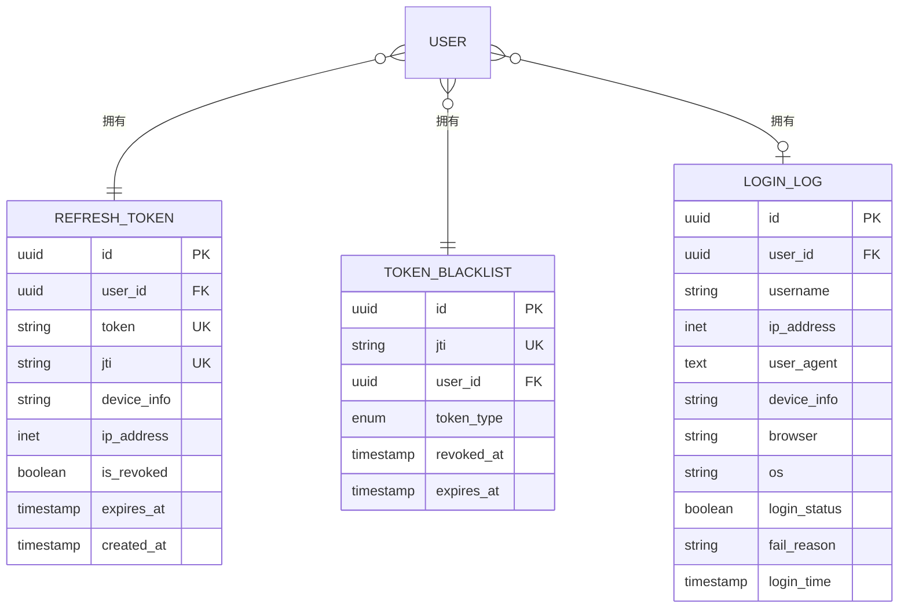
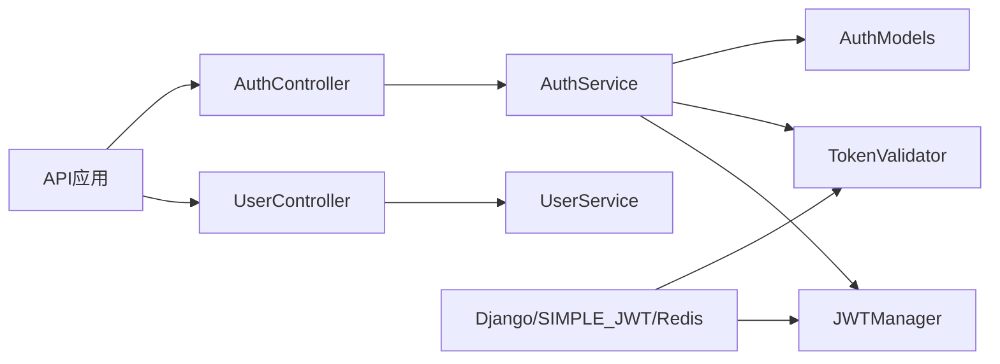

# 用户认证集成

<cite>
**本文档引用的文件**
- [src/api/v1/controllers/user_controller.py](file://src/api/v1/controllers/user_controller.py)
- [src/api/v1/controllers/auth_controller.py](file://src/api/v1/controllers/auth_controller.py)
- [src/application/services/auth_service.py](file://src/application/services/auth_service.py)
- [src/infrastructure/auth_jwt/jwt_manager.py](file://src/infrastructure/auth_jwt/jwt_manager.py)
- [src/infrastructure/auth_jwt/token_validator.py](file://src/infrastructure/auth_jwt/token_validator.py)
- [src/api/common/permissions.py](file://src/api/common/permissions.py)
- [src/application/dto/auth/token_response_dto.py](file://src/application/dto/auth/token_response_dto.py)
- [src/application/dto/user/change_password_dto.py](file://src/application/dto/user/change_password_dto.py)
- [config/settings/base.py](file://config/settings/base.py)
- [src/infrastructure/persistence/models/auth_models.py](file://src/infrastructure/persistence/models/auth_models.py)
- [src/api/app.py](file://src/api/app.py)
- [tests/test_api/test_auth_api.py](file://tests/test_api/test_auth_api.py)
- [src/core/exceptions/authentication_error.py](file://src/core/exceptions/authentication_error.py)
</cite>

## 目录
1. [简介](#简介)
2. [项目结构](#项目结构)
3. [核心组件](#核心组件)
4. [架构总览](#架构总览)
5. [详细组件分析](#详细组件分析)
6. [依赖关系分析](#依赖关系分析)
7. [性能考虑](#性能考虑)
8. [故障排除指南](#故障排除指南)
9. [结论](#结论)
10. [附录](#附录)

## 简介
本文件面向“用户认证集成”的目标，系统化阐述基于 Django Ninja-Extra 的 JWT 认证体系，重点覆盖以下内容：
- 用户控制器中认证相关功能：获取当前用户信息（GET /me）与修改密码（POST /users/change-password）的认证流程
- JWT 令牌验证机制：令牌解析、用户身份提取与权限检查
- 认证中间件与权限类：IsAuthenticated 权限类的应用与自定义认证逻辑
- 用户会话管理：令牌存储、过期处理与刷新机制
- 使用示例：前后端如何处理认证状态、错误处理与重新登录流程
- 安全最佳实践：令牌安全存储、防重放攻击与会话劫持防护
- 失败处理策略与用户体验优化建议

## 项目结构
该项目采用分层架构，围绕“控制器-应用服务-基础设施-领域模型”组织代码。认证相关的关键模块分布如下：
- 控制器层：用户控制器与认证控制器分别处理用户信息与认证相关接口
- 应用服务层：封装业务逻辑，协调 JWT 管理器与 Token 验证器
- 基础设施层：JWT 管理器负责令牌生成与解码；Token 验证器负责有效性校验与黑名单检查
- 配置层：Django 与 SIMPLE_JWT 配置，Redis 缓存与安全设置
- 持久化层：刷新令牌与黑名单模型，支持令牌撤销与审计

图表来源
- [src/api/v1/controllers/user_controller.py:33-283](file://src/api/v1/controllers/user_controller.py#L33-L283)
- [src/api/v1/controllers/auth_controller.py:16-133](file://src/api/v1/controllers/auth_controller.py#L16-L133)
- [src/application/services/auth_service.py:20-233](file://src/application/services/auth_service.py#L20-L233)
- [src/infrastructure/auth_jwt/jwt_manager.py:13-147](file://src/infrastructure/auth_jwt/jwt_manager.py#L13-L147)
- [src/infrastructure/auth_jwt/token_validator.py:11-108](file://src/infrastructure/auth_jwt/token_validator.py#L11-L108)
- [config/settings/base.py:137-151](file://config/settings/base.py#L137-L151)
- [src/infrastructure/persistence/models/auth_models.py:12-114](file://src/infrastructure/persistence/models/auth_models.py#L12-L114)

章节来源
- [src/api/v1/controllers/user_controller.py:33-283](file://src/api/v1/controllers/user_controller.py#L33-L283)
- [src/api/v1/controllers/auth_controller.py:16-133](file://src/api/v1/controllers/auth_controller.py#L16-L133)
- [src/application/services/auth_service.py:20-233](file://src/application/services/auth_service.py#L20-L233)
- [src/infrastructure/auth_jwt/jwt_manager.py:13-147](file://src/infrastructure/auth_jwt/jwt_manager.py#L13-L147)
- [src/infrastructure/auth_jwt/token_validator.py:11-108](file://src/infrastructure/auth_jwt/token_validator.py#L11-L108)
- [config/settings/base.py:137-151](file://config/settings/base.py#L137-L151)
- [src/infrastructure/persistence/models/auth_models.py:12-114](file://src/infrastructure/persistence/models/auth_models.py#L12-L114)

## 核心组件
- 用户控制器（UserController）
  - 提供 GET /me 获取当前用户信息
  - 提供 POST /users/change-password 修改密码
  - 通过 IsAuthenticated 权限类保护敏感接口
  - 内部使用 token_validator 对请求头中的 Bearer 令牌进行验证，并从载荷中提取用户标识
- 认证控制器（AuthController）
  - 提供 POST /v1/auth/login 登录，返回访问令牌与刷新令牌
  - 提供 POST /v1/auth/refresh 刷新访问令牌
  - 提供 POST /v1/auth/logout 撤销访问令牌
- 认证服务（AuthService）
  - 实现登录、刷新访问令牌、登出等业务逻辑
  - 与 JWTManager 和 TokenValidator 协作完成令牌生成、验证与撤销
  - 保存刷新令牌到数据库，记录登录日志
- JWT 管理器（JWTManager）
  - 负责访问令牌与刷新令牌的生成、解码、过期判断与声明提取
  - 读取 SIMPLE_JWT 配置决定算法、有效期等参数
- Token 验证器（TokenValidator）
  - 验证访问令牌与刷新令牌的有效性
  - 检查令牌类型、黑名单、过期状态
  - 支持将令牌加入黑名单以实现撤销
- 权限类（IsAuthenticated）
  - 在请求进入控制器前验证 Authorization 头中的 Bearer 令牌
  - 将用户标识与载荷注入请求对象，供后续处理使用
- DTO 与模型
  - TokenResponseDTO：统一的令牌响应结构
  - ChangePasswordDTO：修改密码输入结构
  - RefreshToken、TokenBlacklist、LoginLog：认证相关持久化实体

章节来源
- [src/api/v1/controllers/user_controller.py:190-283](file://src/api/v1/controllers/user_controller.py#L190-L283)
- [src/api/v1/controllers/auth_controller.py:36-133](file://src/api/v1/controllers/auth_controller.py#L36-L133)
- [src/application/services/auth_service.py:26-233](file://src/application/services/auth_service.py#L26-L233)
- [src/infrastructure/auth_jwt/jwt_manager.py:25-143](file://src/infrastructure/auth_jwt/jwt_manager.py#L25-L143)
- [src/infrastructure/auth_jwt/token_validator.py:21-103](file://src/infrastructure/auth_jwt/token_validator.py#L21-L103)
- [src/api/common/permissions.py:14-44](file://src/api/common/permissions.py#L14-L44)
- [src/application/dto/auth/token_response_dto.py:9-32](file://src/application/dto/auth/token_response_dto.py#L9-L32)
- [src/application/dto/user/change_password_dto.py:9-23](file://src/application/dto/user/change_password_dto.py#L9-L23)
- [src/infrastructure/persistence/models/auth_models.py:12-114](file://src/infrastructure/persistence/models/auth_models.py#L12-L114)

## 架构总览
下图展示了认证流程的整体交互：客户端发起请求，控制器通过权限类与验证器进行认证，应用服务调用 JWT 管理器与持久化层完成业务处理。

图表来源
- [src/api/v1/controllers/user_controller.py:262-283](file://src/api/v1/controllers/user_controller.py#L262-L283)
- [src/api/v1/controllers/auth_controller.py:42-133](file://src/api/v1/controllers/auth_controller.py#L42-L133)
- [src/api/common/permissions.py:20-44](file://src/api/common/permissions.py#L20-L44)
- [src/infrastructure/auth_jwt/token_validator.py:21-45](file://src/infrastructure/auth_jwt/token_validator.py#L21-L45)
- [src/infrastructure/auth_jwt/jwt_manager.py:82-103](file://src/infrastructure/auth_jwt/jwt_manager.py#L82-L103)
- [src/application/services/auth_service.py:113-180](file://src/application/services/auth_service.py#L113-L180)
- [src/infrastructure/persistence/models/auth_models.py:12-45](file://src/infrastructure/persistence/models/auth_models.py#L12-L45)

## 详细组件分析

### 用户控制器：获取当前用户信息（GET /me）
- 接口保护：通过 permissions=[IsAuthenticated] 应用认证中间件
- 认证流程：
  - 从请求头提取 Authorization: Bearer <token>
  - 使用 token_validator.is_token_valid(token) 验证令牌有效性
  - 若有效，从载荷中提取 user_id 并调用 UserService 获取用户详情
- 错误处理：未登录或令牌无效时抛出错误

图表来源
- [src/api/v1/controllers/user_controller.py:227-261](file://src/api/v1/controllers/user_controller.py#L227-L261)
- [src/infrastructure/auth_jwt/token_validator.py:21-45](file://src/infrastructure/auth_jwt/token_validator.py#L21-L45)
- [src/infrastructure/auth_jwt/jwt_manager.py:96-103](file://src/infrastructure/auth_jwt/jwt_manager.py#L96-L103)

章节来源
- [src/api/v1/controllers/user_controller.py:227-261](file://src/api/v1/controllers/user_controller.py#L227-L261)

### 用户控制器：修改密码（POST /users/change-password）
- 接口保护：通过 permissions=[IsAuthenticated] 应用认证中间件
- 认证流程：
  - 同样从 Authorization 头解析 Bearer 令牌并验证
  - 从载荷提取 user_id，调用 UserService.change_password(old_password, new_password)
- 错误处理：未登录或令牌无效时抛出错误

图表来源
- [src/api/v1/controllers/user_controller.py:190-226](file://src/api/v1/controllers/user_controller.py#L190-L226)
- [src/infrastructure/auth_jwt/token_validator.py:21-45](file://src/infrastructure/auth_jwt/token_validator.py#L21-L45)
- [src/infrastructure/auth_jwt/jwt_manager.py:96-103](file://src/infrastructure/auth_jwt/jwt_manager.py#L96-L103)

章节来源
- [src/api/v1/controllers/user_controller.py:190-226](file://src/api/v1/controllers/user_controller.py#L190-L226)

### 认证控制器：登录、刷新与登出
- 登录（POST /v1/auth/login）
  - 校验用户状态与密码
  - 生成访问令牌与刷新令牌，保存刷新令牌至数据库
  - 记录登录日志
- 刷新（POST /v1/auth/refresh）
  - 验证刷新令牌有效性
  - 生成新的访问令牌并返回
- 登出（POST /v1/auth/logout）
  - 撤销当前访问令牌（加入黑名单）

图表来源
- [src/api/v1/controllers/auth_controller.py:36-133](file://src/api/v1/controllers/auth_controller.py#L36-L133)
- [src/application/services/auth_service.py:26-180](file://src/application/services/auth_service.py#L26-L180)
- [src/infrastructure/auth_jwt/jwt_manager.py:25-80](file://src/infrastructure/auth_jwt/jwt_manager.py#L25-L80)
- [src/infrastructure/auth_jwt/token_validator.py:62-103](file://src/infrastructure/auth_jwt/token_validator.py#L62-L103)
- [src/infrastructure/persistence/models/auth_models.py:12-45](file://src/infrastructure/persistence/models/auth_models.py#L12-L45)

章节来源
- [src/api/v1/controllers/auth_controller.py:36-133](file://src/api/v1/controllers/auth_controller.py#L36-L133)
- [src/application/services/auth_service.py:26-180](file://src/application/services/auth_service.py#L26-L180)

### JWT 令牌验证机制
- 令牌解析与验证
  - 使用 JWTManager.decode_token/verify_token 解析与验证签名
  - 检查过期时间与算法配置
- 用户身份提取
  - 从载荷中提取 user_id、username、roles、permissions 等声明
- 权限检查
  - TokenValidator 额外检查令牌类型（access/refresh）、黑名单与过期
  - IsAuthenticated 权限类在请求进入控制器前完成认证并注入用户信息

图表来源
- [src/infrastructure/auth_jwt/jwt_manager.py:82-103](file://src/infrastructure/auth_jwt/jwt_manager.py#L82-L103)
- [src/infrastructure/auth_jwt/token_validator.py:21-45](file://src/infrastructure/auth_jwt/token_validator.py#L21-L45)

章节来源
- [src/infrastructure/auth_jwt/jwt_manager.py:82-143](file://src/infrastructure/auth_jwt/jwt_manager.py#L82-L143)
- [src/infrastructure/auth_jwt/token_validator.py:21-103](file://src/infrastructure/auth_jwt/token_validator.py#L21-L103)
- [src/api/common/permissions.py:20-44](file://src/api/common/permissions.py#L20-L44)

### 认证中间件与权限类
- IsAuthenticated 权限类
  - 在请求进入控制器前检查 Authorization 头
  - 调用 TokenValidator 验证令牌并注入 user_id 与 user_payload
- 自定义认证逻辑
  - 可扩展为 HasPermission/HasAnyPermission/IsAdminUser 等权限类
  - 结合异步权限检查服务完成细粒度权限控制

图表来源
- [src/api/common/permissions.py:14-44](file://src/api/common/permissions.py#L14-L44)
- [src/infrastructure/auth_jwt/token_validator.py:21-103](file://src/infrastructure/auth_jwt/token_validator.py#L21-L103)
- [src/infrastructure/auth_jwt/jwt_manager.py:82-103](file://src/infrastructure/auth_jwt/jwt_manager.py#L82-L103)

章节来源
- [src/api/common/permissions.py:14-44](file://src/api/common/permissions.py#L14-L44)

### 用户会话管理：令牌存储、过期与刷新
- 令牌存储
  - 刷新令牌保存至数据库（RefreshToken），包含 jti、过期时间、设备与IP信息
  - 黑名单通过 Redis 缓存键（token_blacklist:jti）实现，过期时间与令牌一致
- 过期处理
  - JWTManager 检查 exp 字段判断过期
  - TokenValidator 在验证时同步检查过期与黑名单
- 刷新机制
  - 使用刷新令牌换取新的访问令牌
  - 刷新后可选择轮换刷新令牌（配置项）

图表来源
- [src/infrastructure/persistence/models/auth_models.py:12-114](file://src/infrastructure/persistence/models/auth_models.py#L12-L114)

章节来源
- [src/infrastructure/persistence/models/auth_models.py:12-114](file://src/infrastructure/persistence/models/auth_models.py#L12-L114)
- [src/application/services/auth_service.py:191-208](file://src/application/services/auth_service.py#L191-L208)
- [src/infrastructure/auth_jwt/token_validator.py:54-60](file://src/infrastructure/auth_jwt/token_validator.py#L54-L60)

### 使用示例：前后端集成与错误处理
- 前端处理认证状态
  - 登录成功后保存 access_token 与 refresh_token（建议存储于 HttpOnly Cookie 或安全存储）
  - 每次请求在 Authorization 头添加 Bearer <access_token>
  - 当收到 401 未授权时，尝试使用 refresh_token 刷新访问令牌
- 错误处理与重新登录
  - 登录失败：提示用户名或密码错误
  - 刷新失败：引导用户重新登录
  - 登出：撤销访问令牌并清理本地存储
- 测试参考
  - 登录成功返回 access_token 与 refresh_token
  - 刷新成功返回新的 access_token

章节来源
- [tests/test_api/test_auth_api.py:23-87](file://tests/test_api/test_auth_api.py#L23-L87)
- [src/api/v1/controllers/auth_controller.py:36-105](file://src/api/v1/controllers/auth_controller.py#L36-L105)

### 安全最佳实践
- 令牌安全存储
  - 访问令牌尽量存储于 HttpOnly Cookie，避免 XSS 泄露
  - 刷新令牌同样置于安全存储，定期轮换
- 防重放与会话劫持
  - 使用 jti 作为唯一标识，加入黑名单实现撤销
  - 限制令牌有效期，启用刷新令牌轮换
- 配置加固
  - 生产环境开启 HTTPS、安全 Cookie、CORS 白名单
  - 使用强密钥与合适的算法与有效期

章节来源
- [config/settings/base.py:137-151](file://config/settings/base.py#L137-L151)
- [config/settings/base.py:158-163](file://config/settings/base.py#L158-L163)
- [config/settings/base.py:165-173](file://config/settings/base.py#L165-L173)
- [src/infrastructure/auth_jwt/token_validator.py:54-103](file://src/infrastructure/auth_jwt/token_validator.py#L54-L103)

## 依赖关系分析
- 控制器依赖应用服务：UserController 与 AuthController 通过依赖注入使用 UserService 与 AuthService
- 应用服务依赖基础设施：AuthService 依赖 JWTManager 与 TokenValidator，并与数据库模型交互
- 配置依赖：SIMPLE_JWT、Redis 缓存与安全设置影响令牌行为与安全性
- API 注册：API 应用实例集中注册控制器

图表来源
- [src/api/v1/controllers/user_controller.py:44-51](file://src/api/v1/controllers/user_controller.py#L44-L51)
- [src/api/v1/controllers/auth_controller.py:27-34](file://src/api/v1/controllers/auth_controller.py#L27-L34)
- [src/application/services/auth_service.py:12-18](file://src/application/services/auth_service.py#L12-L18)
- [src/api/app.py:24-30](file://src/api/app.py#L24-L30)
- [config/settings/base.py:137-151](file://config/settings/base.py#L137-L151)

章节来源
- [src/api/app.py:24-30](file://src/api/app.py#L24-L30)

## 性能考虑
- 缓存利用：Redis 缓存黑名单键，避免频繁数据库查询
- 异步操作：用户服务与认证服务均采用异步接口，提升并发性能
- 令牌最小化：仅在载荷中携带必要声明，减少体积
- 限流与安全中间件：结合速率限制与安全中间件降低攻击面

## 故障排除指南
- 常见错误与定位
  - 401 未授权：检查 Authorization 头格式与令牌有效性
  - 令牌过期：使用刷新令牌获取新访问令牌
  - 令牌被撤销：确认是否在黑名单中或已登出
- 异常类型
  - 认证错误：AuthenticationError
  - 权限不足：权限类返回 False 或业务层抛出相应异常
- 建议排查步骤
  - 核对 SIMPLE_JWT 配置与密钥
  - 检查 Redis 连接与缓存键命名
  - 查看登录日志与刷新令牌表

章节来源
- [src/core/exceptions/authentication_error.py:9-26](file://src/core/exceptions/authentication_error.py#L9-L26)
- [src/infrastructure/auth_jwt/token_validator.py:81-103](file://src/infrastructure/auth_jwt/token_validator.py#L81-L103)
- [src/infrastructure/persistence/models/auth_models.py:79-114](file://src/infrastructure/persistence/models/auth_models.py#L79-L114)

## 结论
本认证集成以 JWT 为核心，结合自定义权限类与 Token 验证器，实现了完整的登录、刷新、登出与权限控制能力。通过清晰的分层设计与配置化的安全策略，既满足了易用性也兼顾了安全性。建议在生产环境中强化令牌存储与网络传输安全，配合严格的日志与监控体系，持续优化用户体验与系统稳定性。

## 附录
- API 路由概览
  - GET /api/v1/me
  - POST /api/v1/users/change-password
  - POST /api/v1/auth/login
  - POST /api/v1/auth/refresh
  - POST /api/v1/auth/logout
- 关键配置项
  - SIMPLE_JWT：算法、访问/刷新令牌有效期、轮换与黑名单策略
  - Redis：黑名单缓存
  - CORS：跨域与凭证

章节来源
- [src/api/app.py:24-30](file://src/api/app.py#L24-L30)
- [config/settings/base.py:137-151](file://config/settings/base.py#L137-L151)
- [config/settings/base.py:158-163](file://config/settings/base.py#L158-L163)