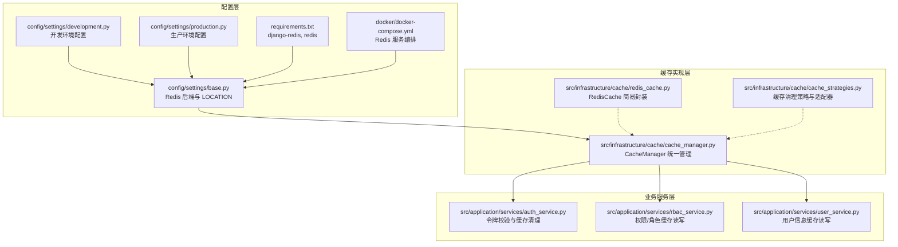
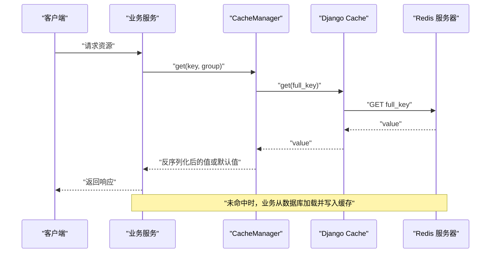
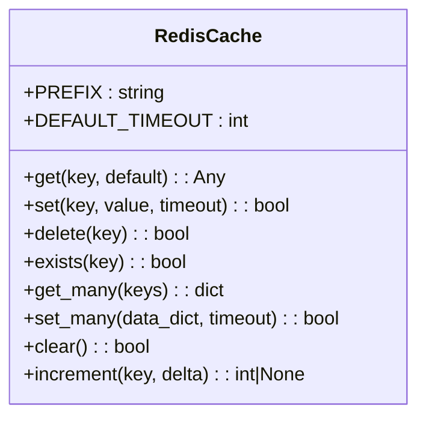
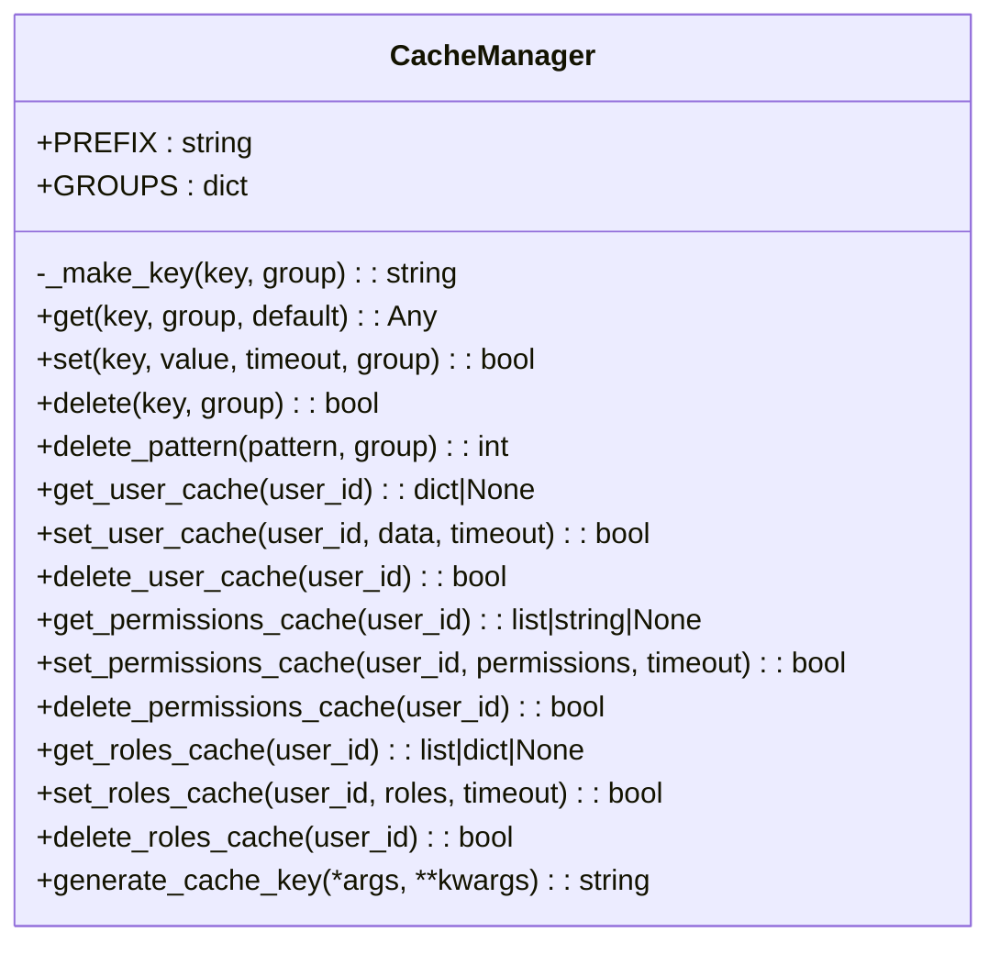
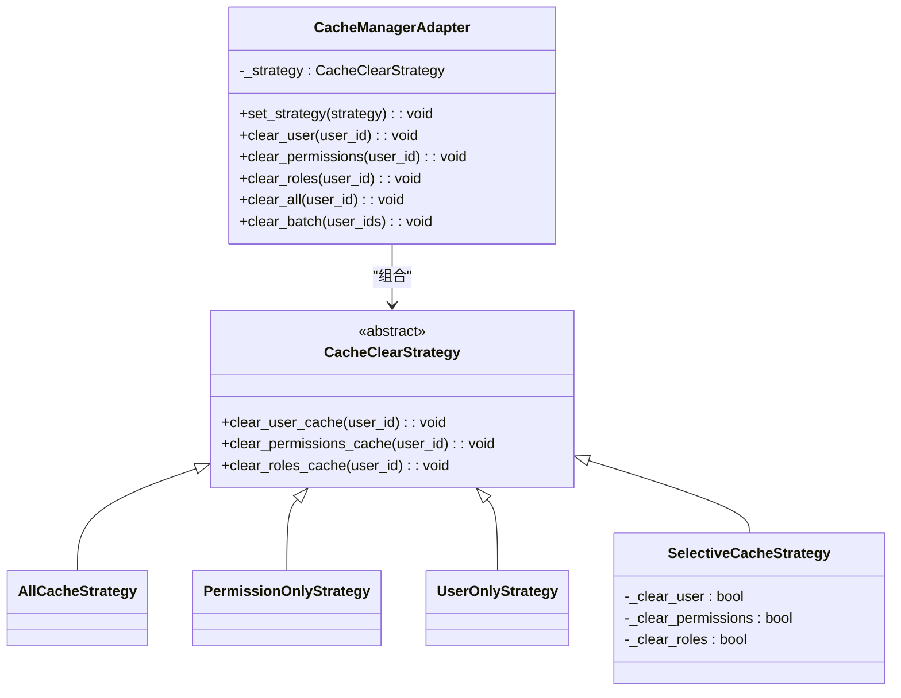
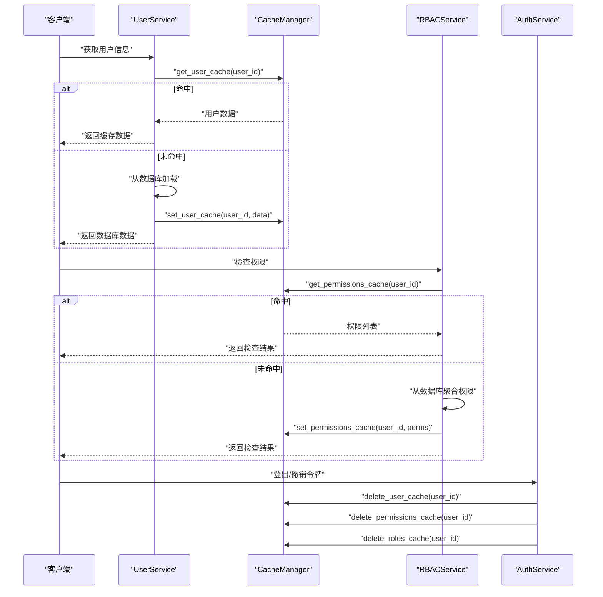
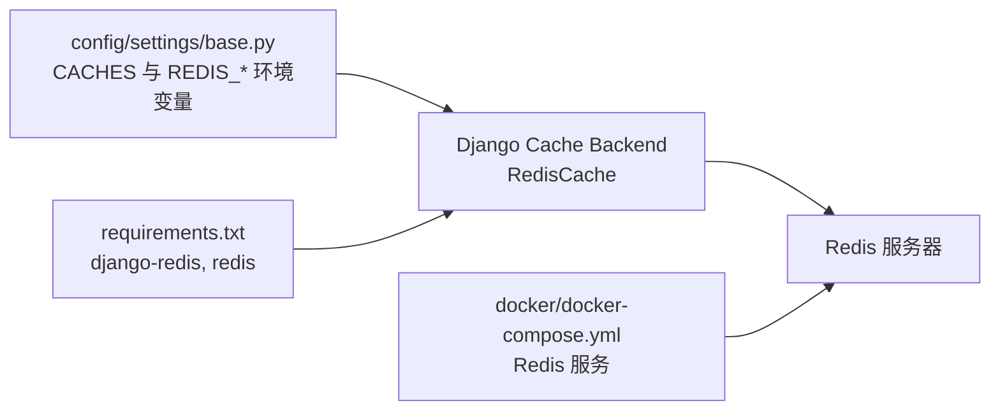

# Redis 缓存实现

<cite>
**本文档引用的文件**
- [redis_cache.py](file://src/infrastructure/cache/redis_cache.py)
- [cache_manager.py](file://src/infrastructure/cache/cache_manager.py)
- [cache_strategies.py](file://src/infrastructure/cache/cache_strategies.py)
- [base.py](file://config/settings/base.py)
- [development.py](file://config/settings/development.py)
- [production.py](file://config/settings/production.py)
- [requirements.txt](file://requirements.txt)
- [docker-compose.yml](file://docker/docker-compose.yml)
- [auth_service.py](file://src/application/services/auth_service.py)
- [rbac_service.py](file://src/application/services/rbac_service.py)
- [user_service.py](file://src/application/services/user_service.py)
</cite>

## 目录
1. [引言](#引言)
2. [项目结构](#项目结构)
3. [核心组件](#核心组件)
4. [架构总览](#架构总览)
5. [详细组件分析](#详细组件分析)
6. [依赖分析](#依赖分析)
7. [性能考虑](#性能考虑)
8. [故障排查指南](#故障排查指南)
9. [结论](#结论)
10. [附录](#附录)

## 引言
本文件系统性梳理项目中基于 Django 的 Redis 缓存实现，覆盖连接配置、初始化流程、序列化策略、缓存键设计与分组、清理策略、性能优化、监控与调试以及部署指南等内容。项目采用 Django 内置的 Redis 缓存后端，通过统一的缓存管理器封装常用操作，并在业务服务中按需使用缓存以提升性能。

## 项目结构
Redis 缓存相关代码集中在基础设施层的缓存子包中，配置位于 Django settings 中，运行时通过环境变量进行灵活切换。

**图表来源**
- [base.py:153-163](file://config/settings/base.py#L153-L163)
- [requirements.txt:17-19](file://requirements.txt#L17-L19)
- [docker-compose.yml:37-42](file://docker/docker-compose.yml#L37-L42)
- [cache_manager.py:16-148](file://src/infrastructure/cache/cache_manager.py#L16-L148)
- [cache_strategies.py:9-244](file://src/infrastructure/cache/cache_strategies.py#L9-L244)
- [auth_service.py:170-180](file://src/application/services/auth_service.py#L170-L180)
- [rbac_service.py:195-251](file://src/application/services/rbac_service.py#L195-L251)
- [user_service.py:45-108](file://src/application/services/user_service.py#L45-L108)

**章节来源**
- [base.py:153-163](file://config/settings/base.py#L153-L163)
- [requirements.txt:17-19](file://requirements.txt#L17-L19)
- [docker-compose.yml:37-42](file://docker/docker-compose.yml#L37-L42)

## 核心组件
- RedisCache：对 Django 缓存后端的轻量封装，提供 get/set/delete/exists/get_many/set_many/increment 等常用方法，内置 JSON 序列化与默认过期时间。
- CacheManager：统一的缓存管理器，提供带前缀与分组的键生成、用户/权限/角色专用缓存接口、MD5 键生成工具等。
- CacheClearStrategy 体系：基于策略模式的缓存清理方案，支持全量、仅权限、仅用户、选择性清理等策略，并通过适配器统一调用。

**章节来源**
- [redis_cache.py:15-169](file://src/infrastructure/cache/redis_cache.py#L15-L169)
- [cache_manager.py:16-148](file://src/infrastructure/cache/cache_manager.py#L16-L148)
- [cache_strategies.py:9-244](file://src/infrastructure/cache/cache_strategies.py#L9-L244)

## 架构总览
Django 通过 settings 中的 CACHES 指定 Redis 后端，业务层通过统一的 CacheManager 或直接使用 Django 的 cache 接口进行读写；RedisCache 提供更贴近业务的便捷方法。缓存键采用统一前缀与可选分组，确保命名空间隔离。

**图表来源**
- [cache_manager.py:42-58](file://src/infrastructure/cache/cache_manager.py#L42-L58)
- [base.py:158-163](file://config/settings/base.py#L158-L163)

## 详细组件分析

### RedisCache 实现
- 键前缀与默认过期：统一前缀与默认超时，避免键冲突并简化 TTL 管理。
- 序列化策略：对非基本类型自动 JSON 序列化，读取时尝试 JSON 反序列化，失败则回退为原始字符串。
- 批量操作：get_many/set_many，内部统一加上前缀再委托给 Django cache。
- 原子递增：increment 基于读取-计算-写入的原子性保障。
- 错误处理：捕获异常并记录日志，保证业务不中断。

**图表来源**
- [redis_cache.py:15-169](file://src/infrastructure/cache/redis_cache.py#L15-L169)

**章节来源**
- [redis_cache.py:27-147](file://src/infrastructure/cache/redis_cache.py#L27-L147)

### CacheManager 实现
- 键生成：支持带分组的复合键，便于按功能域隔离缓存。
- 分组缓存：预置用户、RBAC、鉴权、安全、系统等分组，提供便捷的 get/set/delete 方法。
- MD5 键生成：根据参数动态生成稳定键，适合复杂查询条件的缓存键。
- 警告提示：对不支持的 pattern 删除进行告警，避免误用。

**图表来源**
- [cache_manager.py:16-148](file://src/infrastructure/cache/cache_manager.py#L16-L148)

**章节来源**
- [cache_manager.py:34-144](file://src/infrastructure/cache/cache_manager.py#L34-L144)

### 缓存清理策略与适配器
- 策略接口：定义用户、权限、角色三类缓存的清理接口。
- 多种策略：
  - 全量清理：同时清理用户信息、权限、角色缓存。
  - 仅权限/仅用户：按需清理，减少影响面。
  - 选择性清理：按布尔开关决定清理范围。
- 适配器：统一对外接口，支持运行时切换策略。

**图表来源**
- [cache_strategies.py:9-244](file://src/infrastructure/cache/cache_strategies.py#L9-L244)

**章节来源**
- [cache_strategies.py:46-241](file://src/infrastructure/cache/cache_strategies.py#L46-L241)

### 业务中的缓存使用
- 用户服务：优先从缓存读取用户信息，未命中则从数据库加载并写入缓存；更新/删除用户时清理相关缓存。
- RBAC 服务：权限检查优先读缓存；角色变更后清理相关缓存；首次计算后写入缓存。
- 鉴权服务：登出/撤销令牌后清理用户相关缓存，确保状态一致。

**图表来源**
- [user_service.py:52-66](file://src/application/services/user_service.py#L52-L66)
- [rbac_service.py:233-251](file://src/application/services/rbac_service.py#L233-L251)
- [auth_service.py:171-178](file://src/application/services/auth_service.py#L171-L178)

**章节来源**
- [user_service.py:52-108](file://src/application/services/user_service.py#L52-L108)
- [rbac_service.py:195-251](file://src/application/services/rbac_service.py#L195-L251)
- [auth_service.py:171-180](file://src/application/services/auth_service.py#L171-L180)

## 依赖分析
- Django 缓存后端：通过 settings 中的 CACHES 指定 Redis 后端与 LOCATION，支持单机模式。
- 依赖组件：django-redis、redis。
- Docker 编排：提供 Redis 单实例容器，便于本地开发与测试。

**图表来源**
- [base.py:153-163](file://config/settings/base.py#L153-L163)
- [requirements.txt:17-19](file://requirements.txt#L17-L19)
- [docker-compose.yml:37-42](file://docker/docker-compose.yml#L37-L42)

**章节来源**
- [base.py:153-163](file://config/settings/base.py#L153-L163)
- [requirements.txt:17-19](file://requirements.txt#L17-L19)
- [docker-compose.yml:37-42](file://docker/docker-compose.yml#L37-L42)

## 性能考虑
- 连接复用：Django Redis 后端默认使用连接池，无需手动管理连接生命周期。
- 序列化开销：对复杂对象进行 JSON 序列化，建议尽量缓存简单结构以降低序列化成本。
- 批量操作：使用 get_many/set_many 减少网络往返。
- 原子递增：increment 提供简单的计数缓存场景支持。
- 键设计：统一前缀+分组，避免键冲突；对复杂查询使用 MD5 生成稳定键。
- 超时策略：合理设置过期时间，避免缓存雪崩；热点键可设置随机偏移。

[本节为通用性能建议，不直接分析具体文件，故无“章节来源”]

## 故障排查指南
- 连接问题
  - 检查 Redis 地址与端口是否正确，确认容器/服务可达。
  - 查看 Django 日志中关于缓存的错误信息，定位异常。
- 序列化问题
  - 非基本类型写入缓存会触发 JSON 序列化，若对象不可序列化会导致写入失败。
  - 读取时尝试 JSON 反序列化，失败则回退为原始字符串，注意类型判断。
- 键冲突与命名空间
  - 使用统一前缀与分组，避免与其他应用共享键空间。
- 清理策略
  - 若发现权限/角色缓存陈旧，检查对应策略是否正确执行清理。
- 监控与调试
  - 利用 Django 日志系统输出缓存操作日志，便于追踪。
  - 在开发环境适当提高日志级别以便快速定位问题。

**章节来源**
- [redis_cache.py:32-46](file://src/infrastructure/cache/redis_cache.py#L32-L46)
- [cache_manager.py:46-58](file://src/infrastructure/cache/cache_manager.py#L46-L58)
- [base.py:174-226](file://config/settings/base.py#L174-L226)

## 结论
本项目采用 Django 内置 Redis 缓存后端，配合统一的缓存管理器与策略化的清理方案，在保证易用性的同时提供了良好的扩展性与可维护性。通过合理的键设计、批量操作与超时策略，可在多数场景下获得稳定的性能表现。建议在生产环境中结合实际流量特征进一步优化 TTL 与批量粒度，并完善监控与告警机制。

[本节为总结性内容，不直接分析具体文件，故无“章节来源”]

## 附录

### 部署指南（单机/集群/哨兵）
- 单机模式
  - 在 settings 中配置 CACHES 使用单个 Redis 实例，通过 REDIS_HOST/REDIS_PORT/REDIS_DB 控制。
  - Docker 环境下可直接使用 docker-compose 提供的 Redis 服务。
- 集群/哨兵模式
  - Django Redis 后端支持连接字符串数组形式的多节点配置，可将 LOCATION 设为包含多个地址的列表以启用集群/哨兵。
  - 需要额外调整连接参数以满足高可用需求。
- 环境变量
  - REDIS_HOST、REDIS_PORT、REDIS_DB 用于指定 Redis 连接信息。
- Docker 编排
  - docker-compose 提供 Redis 单实例服务，便于本地联调。

**章节来源**
- [base.py:153-163](file://config/settings/base.py#L153-L163)
- [docker-compose.yml:37-42](file://docker/docker-compose.yml#L37-L42)

### 初始化流程与配置要点
- 初始化步骤
  - 设置 REDIS_* 环境变量。
  - 在 settings 中配置 CACHES 使用 Redis 后端与 LOCATION。
  - 启动应用后，Django 会自动建立与 Redis 的连接。
- 超时与重连
  - Django Redis 后端负责底层连接管理与重连，无需业务层干预。
- 监控与日志
  - 通过 LOGGING 配置输出缓存相关日志，便于问题定位。

**章节来源**
- [base.py:153-163](file://config/settings/base.py#L153-L163)
- [base.py:174-226](file://config/settings/base.py#L174-L226)

### 序列化策略说明
- 写入时
  - 对基本类型（str/int/float/bool/list/dict/None）直接存储。
  - 对复杂对象进行 JSON 序列化后再存储。
- 读取时
  - 若值为字符串，尝试 JSON 反序列化；失败则回退为原始字符串。
- 建议
  - 尽量缓存可序列化且稳定的对象，避免循环引用与不可序列化字段。

**章节来源**
- [redis_cache.py:57-62](file://src/infrastructure/cache/redis_cache.py#L57-L62)
- [redis_cache.py:37-43](file://src/infrastructure/cache/redis_cache.py#L37-L43)
- [cache_manager.py:64-67](file://src/infrastructure/cache/cache_manager.py#L64-L67)
- [cache_manager.py:49-55](file://src/infrastructure/cache/cache_manager.py#L49-L55)

### 性能优化建议
- 批量读写：优先使用 get_many/set_many。
- 键设计：使用分组与前缀，便于清理与统计。
- TTL 策略：热点键设置随机偏移，避免同时失效。
- 连接池：依赖 Django Redis 后端的连接池能力，避免频繁创建连接。

**章节来源**
- [redis_cache.py:93-118](file://src/infrastructure/cache/redis_cache.py#L93-L118)
- [cache_manager.py:84-90](file://src/infrastructure/cache/cache_manager.py#L84-L90)