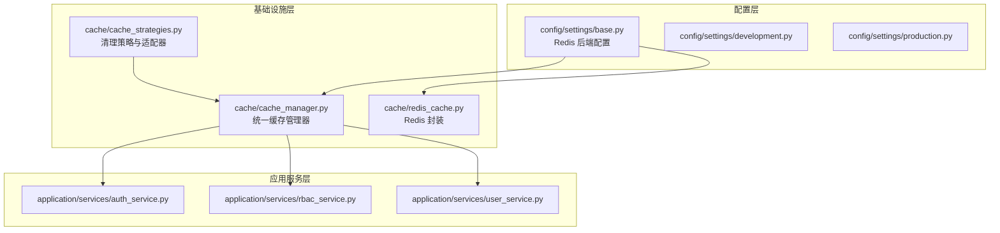
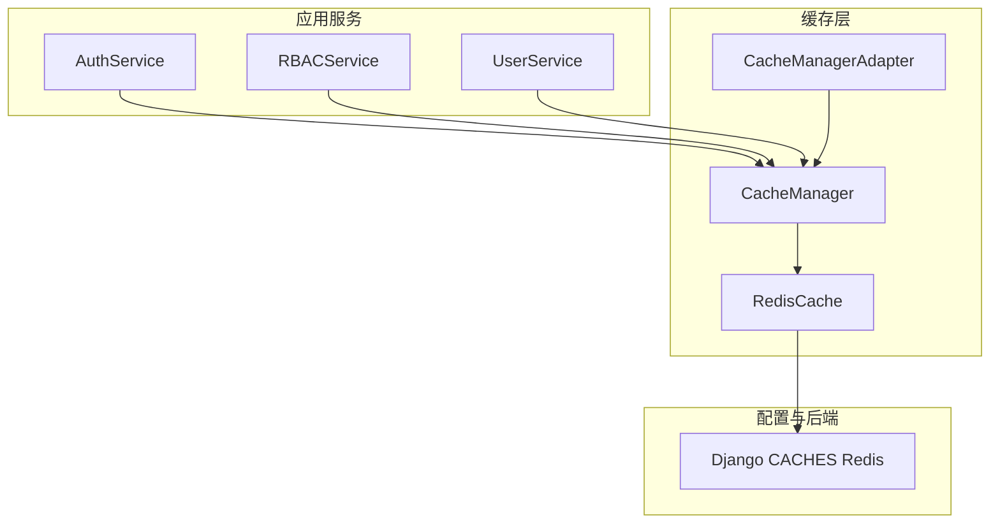
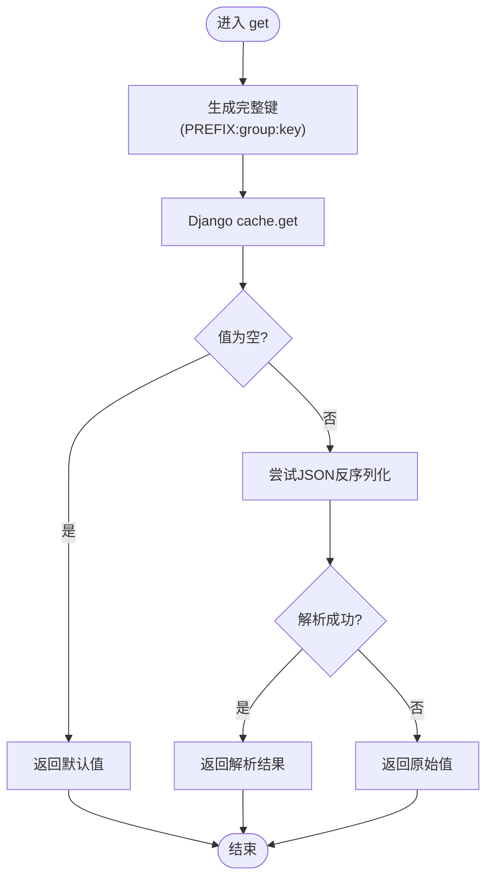
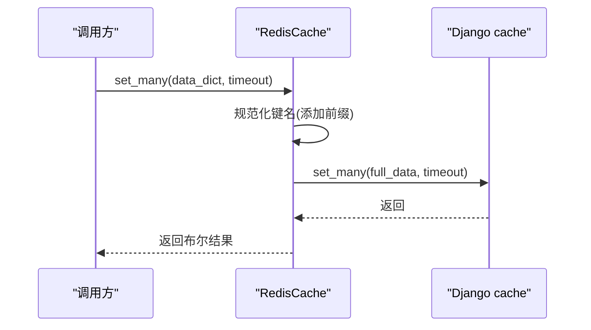
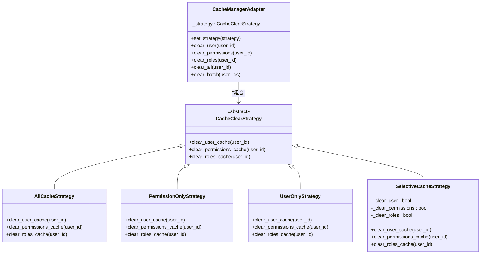
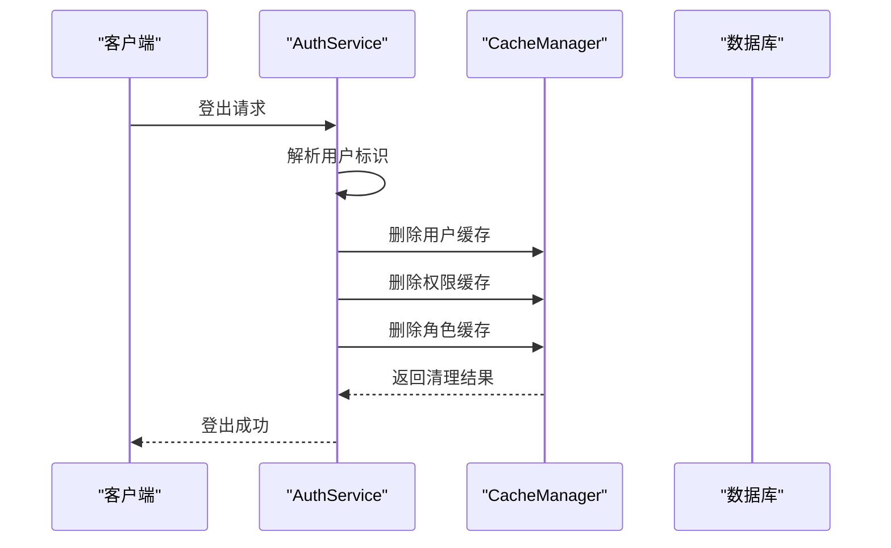
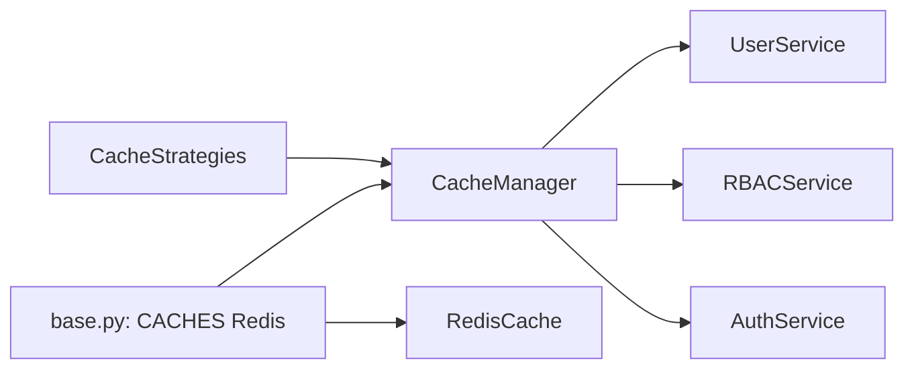

# 缓存优化系统

<cite>
**本文引用的文件**
- [cache_manager.py](file://src/infrastructure/cache/cache_manager.py)
- [redis_cache.py](file://src/infrastructure/cache/redis_cache.py)
- [cache_strategies.py](file://src/infrastructure/cache/cache_strategies.py)
- [base.py](file://config/settings/base.py)
- [development.py](file://config/settings/development.py)
- [production.py](file://config/settings/production.py)
- [auth_service.py](file://src/application/services/auth_service.py)
- [rbac_service.py](file://src/application/services/rbac_service.py)
- [user_service.py](file://src/application/services/user_service.py)
</cite>

## 目录
1. [简介](#简介)
2. [项目结构](#项目结构)
3. [核心组件](#核心组件)
4. [架构总览](#架构总览)
5. [详细组件分析](#详细组件分析)
6. [依赖分析](#依赖分析)
7. [性能考虑](#性能考虑)
8. [故障排查指南](#故障排查指南)
9. [结论](#结论)
10. [附录](#附录)

## 简介
本文件面向“缓存优化系统”的设计与实现，聚焦以下目标：
- 缓存管理器的设计架构：统一键空间、分组管理、序列化策略与生命周期控制
- Redis 缓存实现：基于 Django Cache 后端的封装、批量操作、增量计数等能力
- 缓存策略管理器：采用策略模式实现多种清理策略（全量、按需、选择性）
- 缓存使用场景：用户信息缓存、权限缓存、角色缓存等
- 性能优化最佳实践：缓存预热、批量操作、内存使用优化
- 一致性保障：缓存更新策略、穿透防护、雪崩预防
- 监控与调试：日志记录、错误处理与可观测性
- 配置示例与性能测试建议

## 项目结构
缓存相关代码集中在基础设施层的 cache 包内，并通过应用服务在运行时被调用；缓存后端由 Django 的 CACHES 配置统一管理。

**图表来源**
- [base.py:153-163](file://config/settings/base.py#L153-L163)
- [cache_manager.py:16-149](file://src/infrastructure/cache/cache_manager.py#L16-L149)
- [redis_cache.py:15-169](file://src/infrastructure/cache/redis_cache.py#L15-L169)
- [cache_strategies.py:9-245](file://src/infrastructure/cache/cache_strategies.py#L9-L245)
- [auth_service.py:14](file://src/application/services/auth_service.py#L14)
- [rbac_service.py:16](file://src/application/services/rbac_service.py#L16)
- [user_service.py:10](file://src/application/services/user_service.py#L10)

**章节来源**
- [base.py:153-163](file://config/settings/base.py#L153-L163)
- [cache_manager.py:16-149](file://src/infrastructure/cache/cache_manager.py#L16-L149)
- [redis_cache.py:15-169](file://src/infrastructure/cache/redis_cache.py#L15-L169)
- [cache_strategies.py:9-245](file://src/infrastructure/cache/cache_strategies.py#L9-L245)
- [auth_service.py:14](file://src/application/services/auth_service.py#L14)
- [rbac_service.py:16](file://src/application/services/rbac_service.py#L16)
- [user_service.py:10](file://src/application/services/user_service.py#L10)

## 核心组件
- 缓存管理器（CacheManager）
  - 统一键前缀与分组，提供用户、RBAC、鉴权、安全、系统等分组的读写删接口
  - 自动 JSON 序列化/反序列化，支持默认超时与异常兜底
- Redis 缓存封装（RedisCache）
  - 基于 Django Cache 的 Redis 后端，提供 get/set/delete/exists/get_many/set_many/increment 等常用方法
  - 对批量操作进行前缀规范化处理
- 缓存策略管理器（CacheClearStrategy + CacheManagerAdapter）
  - 策略模式：全量清理、仅权限/角色清理、仅用户清理、选择性清理
  - 适配器统一对外暴露清理接口，支持单用户与批量清理

**章节来源**
- [cache_manager.py:16-149](file://src/infrastructure/cache/cache_manager.py#L16-L149)
- [redis_cache.py:15-169](file://src/infrastructure/cache/redis_cache.py#L15-L169)
- [cache_strategies.py:9-245](file://src/infrastructure/cache/cache_strategies.py#L9-L245)

## 架构总览
缓存系统围绕“统一管理器 + 策略适配器 + 应用服务调用”展开，Redis 作为 Django Cache 的后端提供高性能存储。

**图表来源**
- [auth_service.py:14](file://src/application/services/auth_service.py#L14)
- [rbac_service.py:16](file://src/application/services/rbac_service.py#L16)
- [user_service.py:10](file://src/application/services/user_service.py#L10)
- [cache_manager.py:16-149](file://src/infrastructure/cache/cache_manager.py#L16-L149)
- [redis_cache.py:15-169](file://src/infrastructure/cache/redis_cache.py#L15-L169)
- [cache_strategies.py:170-245](file://src/infrastructure/cache/cache_strategies.py#L170-L245)
- [base.py:153-163](file://config/settings/base.py#L153-L163)

## 详细组件分析

### 缓存管理器（CacheManager）
- 设计要点
  - 键命名规范：统一前缀与可选分组，避免键冲突
  - 序列化策略：非基本类型自动 JSON 序列化，读取时尝试 JSON 反序列化
  - 生命周期：支持默认超时与异常捕获，失败返回默认值或 False
  - 分组接口：针对用户、权限、角色分别提供 get/set/delete 快捷方法
  - 键生成：支持基于参数生成稳定哈希键，便于复杂查询缓存
- 关键流程（读取）

**图表来源**
- [cache_manager.py:42-58](file://src/infrastructure/cache/cache_manager.py#L42-L58)

**章节来源**
- [cache_manager.py:16-149](file://src/infrastructure/cache/cache_manager.py#L16-L149)

### Redis 缓存封装（RedisCache）
- 设计要点
  - 基于 Django Cache 的 Redis 后端，统一前缀，简化调用
  - 批量读写：get_many/set_many，内部完成前缀映射
  - 原子递增：increment 基于读取-计算-写入的原子语义
  - 安全提示：clear 方法仅记录警告，避免误清空
- 关键流程（批量写入）

**图表来源**
- [redis_cache.py:107-118](file://src/infrastructure/cache/redis_cache.py#L107-L118)

**章节来源**
- [redis_cache.py:15-169](file://src/infrastructure/cache/redis_cache.py#L15-L169)

### 缓存策略管理器（策略模式）
- 设计要点
  - 抽象接口：定义用户、权限、角色三类缓存的清理方法
  - 多种策略：全量、仅权限/角色、仅用户、选择性
  - 适配器：统一对外接口，支持动态切换策略与批量清理
- 类关系图

**图表来源**
- [cache_strategies.py:9-245](file://src/infrastructure/cache/cache_strategies.py#L9-L245)

**章节来源**
- [cache_strategies.py:9-245](file://src/infrastructure/cache/cache_strategies.py#L9-L245)

### 缓存使用场景与集成点
- 用户信息缓存
  - 读取：优先从缓存获取，未命中再查询数据库，并写回缓存
  - 更新/删除：更新或删除用户数据后，清理对应用户缓存
- 权限缓存
  - 读取：先查缓存，命中则直接判断；未命中再查数据库并写回
  - 更新：角色/权限变更后，清理该用户的权限与角色缓存
- 登出清理
  - 登出时根据用户标识清理用户、权限、角色缓存，确保状态一致

**图表来源**
- [auth_service.py:164-180](file://src/application/services/auth_service.py#L164-L180)
- [cache_manager.py:92-137](file://src/infrastructure/cache/cache_manager.py#L92-L137)

**章节来源**
- [user_service.py:52-108](file://src/application/services/user_service.py#L52-L108)
- [rbac_service.py:201-251](file://src/application/services/rbac_service.py#L201-L251)
- [auth_service.py:164-180](file://src/application/services/auth_service.py#L164-L180)

## 依赖分析
- 配置层
  - Redis 后端通过 Django CACHES 集中配置，支持主机、端口、数据库索引
- 缓存层
  - CacheManager 依赖 Django cache 接口，负责键空间与序列化
  - RedisCache 作为 Redis 后端的轻量封装，提供批量与原子操作
  - CacheManagerAdapter 通过组合策略对象实现灵活的清理策略
- 应用服务层
  - 用户、RBAC、认证服务均通过 CacheManager 进行缓存读写与清理

**图表来源**
- [base.py:153-163](file://config/settings/base.py#L153-L163)
- [cache_manager.py:16-149](file://src/infrastructure/cache/cache_manager.py#L16-L149)
- [redis_cache.py:15-169](file://src/infrastructure/cache/redis_cache.py#L15-L169)
- [cache_strategies.py:170-245](file://src/infrastructure/cache/cache_strategies.py#L170-L245)
- [user_service.py:10](file://src/application/services/user_service.py#L10)
- [rbac_service.py:16](file://src/application/services/rbac_service.py#L16)
- [auth_service.py:14](file://src/application/services/auth_service.py#L14)

**章节来源**
- [base.py:153-163](file://config/settings/base.py#L153-L163)
- [cache_manager.py:16-149](file://src/infrastructure/cache/cache_manager.py#L16-L149)
- [redis_cache.py:15-169](file://src/infrastructure/cache/redis_cache.py#L15-L169)
- [cache_strategies.py:170-245](file://src/infrastructure/cache/cache_strategies.py#L170-L245)
- [user_service.py:10](file://src/application/services/user_service.py#L10)
- [rbac_service.py:16](file://src/application/services/rbac_service.py#L16)
- [auth_service.py:14](file://src/application/services/auth_service.py#L14)

## 性能考虑
- 缓存预热
  - 在系统启动或定时任务中对热点用户、权限集合进行预加载，降低首次访问延迟
- 批量操作
  - 优先使用 set_many/get_many 减少网络往返与序列化开销
- 内存使用优化
  - 控制缓存键数量与体积，合理设置超时时间，避免无限增长
- 连接与序列化
  - Redis 后端由 Django Cache 管理连接池；复杂对象统一 JSON 序列化，减少类型差异带来的问题
- 并发与一致性
  - 使用策略适配器在高并发下保证清理动作的一致性，避免遗漏或重复清理

[本节为通用指导，无需列出具体文件来源]

## 故障排查指南
- 常见问题
  - 缓存读取失败：检查键前缀与分组是否一致，确认序列化/反序列化是否成功
  - 清理无效：确认调用的是正确的分组接口或策略适配器
  - Redis 不可用：检查 CACHES 配置与网络连通性
- 日志与错误处理
  - 所有缓存操作均包含异常捕获与日志记录，便于定位问题
  - 清空缓存方法仅记录安全警告，避免误操作

**章节来源**
- [cache_manager.py:42-58](file://src/infrastructure/cache/cache_manager.py#L42-L58)
- [redis_cache.py:28-46](file://src/infrastructure/cache/redis_cache.py#L28-L46)
- [redis_cache.py:121-132](file://src/infrastructure/cache/redis_cache.py#L121-L132)

## 结论
本缓存优化系统通过统一的缓存管理器、Redis 后端封装与策略化的清理机制，实现了用户、权限、角色等关键数据的高效缓存与一致维护。配合批量操作与合理的超时策略，可在保证性能的同时提升系统的稳定性与可维护性。

[本节为总结性内容，无需列出具体文件来源]

## 附录

### 配置示例（摘自配置文件）
- Redis 后端配置
  - 主机、端口、数据库索引可通过环境变量配置
  - 默认使用 RedisCache 后端，键空间由 CacheManager 统一前缀管理
- 开发/生产差异化
  - 开发环境使用 SQLite 与更宽松的日志级别
  - 生产环境使用 PostgreSQL，并启用更强的安全配置

**章节来源**
- [base.py:153-163](file://config/settings/base.py#L153-L163)
- [development.py:10-24](file://config/settings/development.py#L10-L24)
- [production.py:12-39](file://config/settings/production.py#L12-L39)

### 性能测试建议
- 基准指标
  - QPS、P95/P99 延迟、缓存命中率、Redis 内存占用
- 测试场景
  - 热点用户读取、批量写入、并发清理、登出后一致性校验
- 工具与方法
  - 使用压测工具模拟真实流量，结合日志与指标监控观察缓存行为

[本节为通用指导，无需列出具体文件来源]