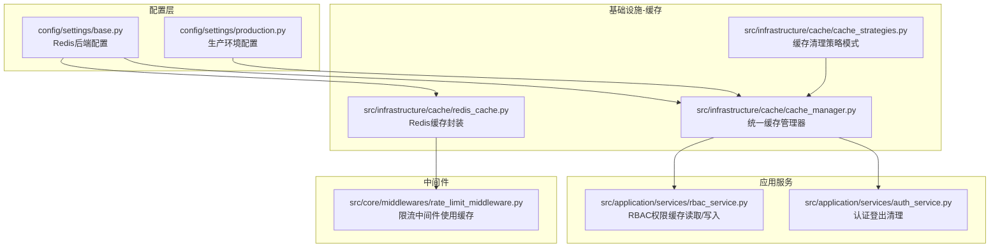
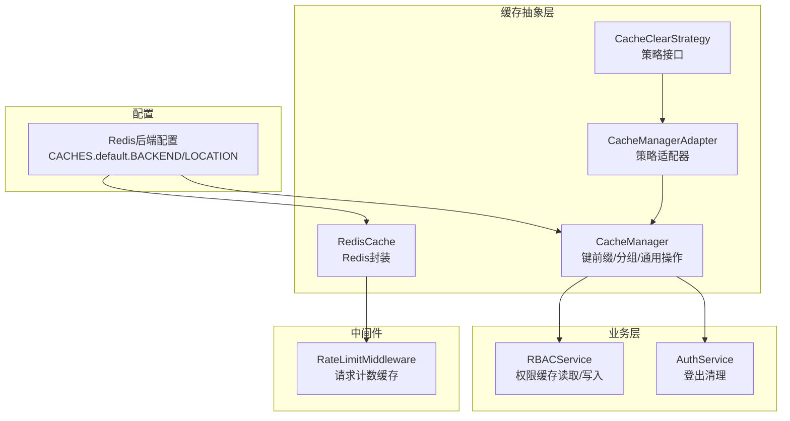
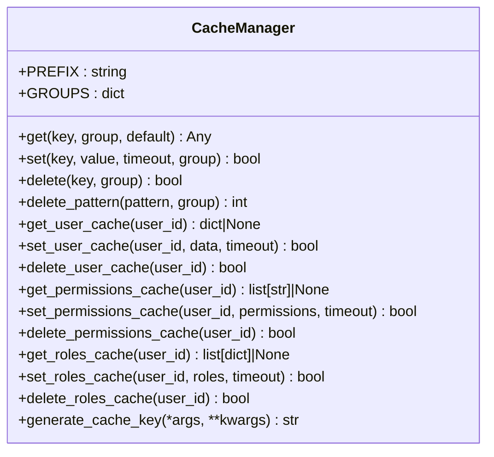
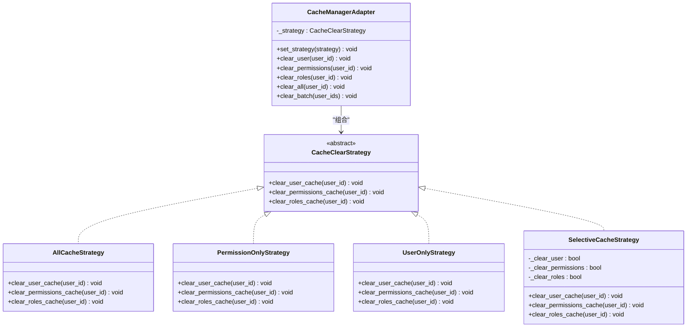
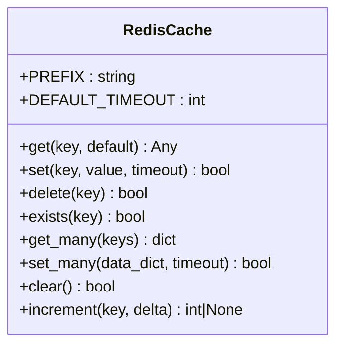
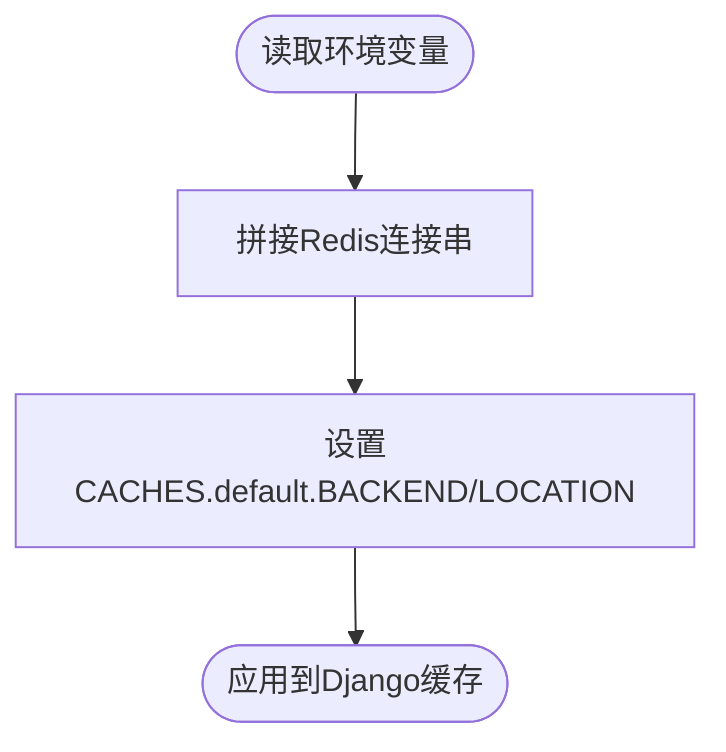
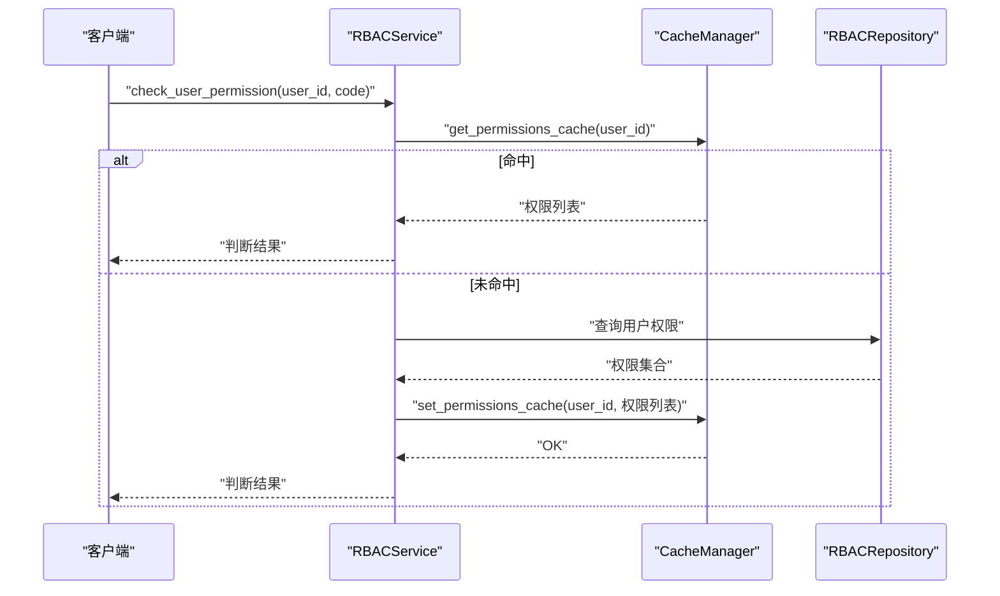
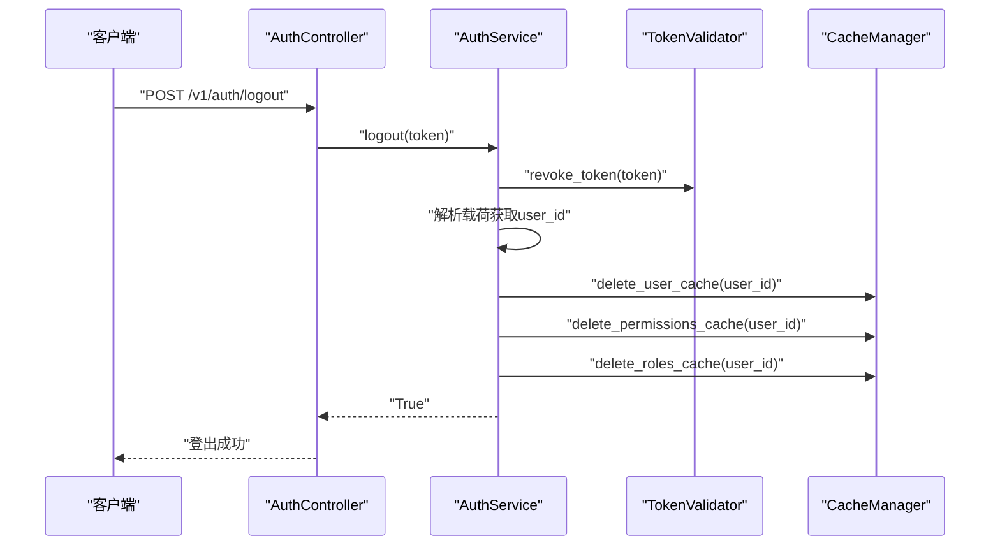
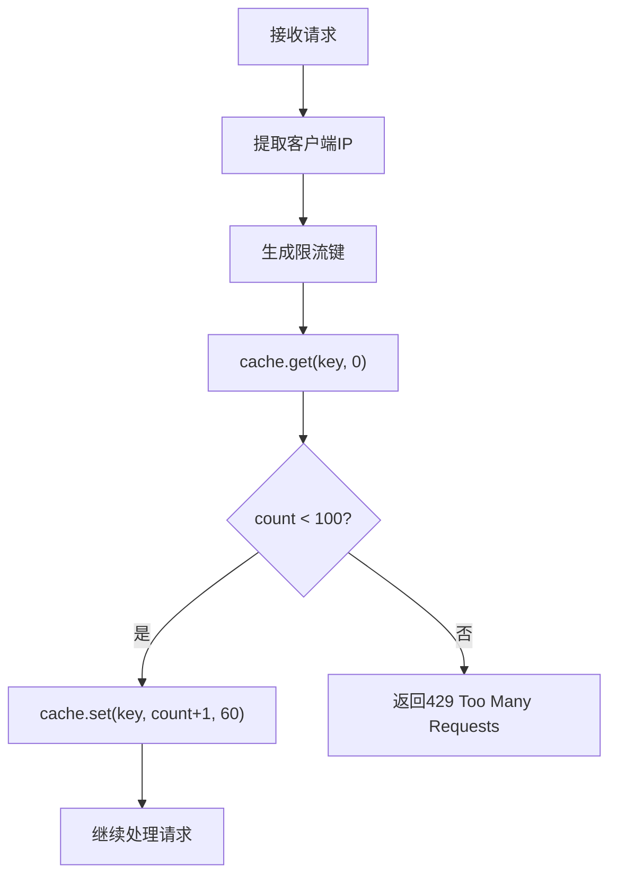
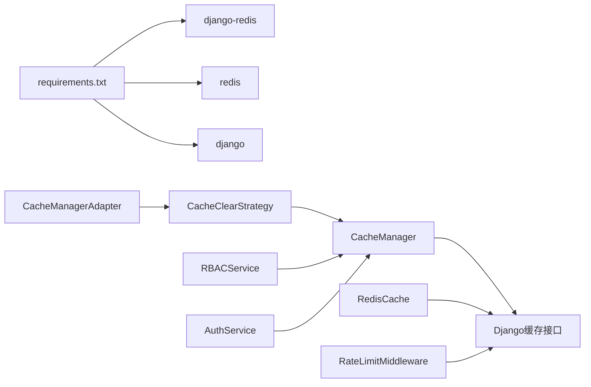

# 缓存策略管理

<cite>
**本文引用的文件**
- [cache_manager.py](file://src/infrastructure/cache/cache_manager.py)
- [cache_strategies.py](file://src/infrastructure/cache/cache_strategies.py)
- [redis_cache.py](file://src/infrastructure/cache/redis_cache.py)
- [base.py](file://config/settings/base.py)
- [production.py](file://config/settings/production.py)
- [rbac_service.py](file://src/application/services/rbac_service.py)
- [auth_service.py](file://src/application/services/auth_service.py)
- [rate_limit_middleware.py](file://src/core/middlewares/rate_limit_middleware.py)
- [requirements.txt](file://requirements.txt)
</cite>

## 目录
1. [简介](#简介)
2. [项目结构](#项目结构)
3. [核心组件](#核心组件)
4. [架构总览](#架构总览)
5. [详细组件分析](#详细组件分析)
6. [依赖分析](#依赖分析)
7. [性能考虑](#性能考虑)
8. [故障排查指南](#故障排查指南)
9. [结论](#结论)
10. [附录](#附录)

## 简介
本文件围绕仓库中的缓存策略管理进行系统化梳理与说明，重点覆盖以下方面：
- 缓存设计理念与实现机制：统一缓存管理、基于Redis的缓存后端、缓存清理策略模式
- 缓存淘汰策略现状与扩展建议：LRU/LFU/TTL等策略的适用场景与实现要点
- 缓存配置与切换机制：Redis后端配置、运行时策略切换、分组与键空间隔离
- 缓存预热策略：启动时数据加载、热点数据预加载
- 缓存一致性保障：缓存更新策略、缓存穿透防护、缓存雪崩预防
- 性能测试与评估：命中率统计、内存使用监控、响应时间分析
- 业务场景应用与优化建议：RBAC权限缓存、认证登出清理、限流中间件中的缓存使用

## 项目结构
缓存相关代码集中在基础设施层的缓存包中，配合配置文件完成Redis后端接入；业务服务在关键路径上使用缓存以提升性能。

**图表来源**
- [base.py:153-163](file://config/settings/base.py#L153-L163)
- [cache_manager.py:16-148](file://src/infrastructure/cache/cache_manager.py#L16-L148)
- [cache_strategies.py:9-244](file://src/infrastructure/cache/cache_strategies.py#L9-L244)
- [redis_cache.py:15-169](file://src/infrastructure/cache/redis_cache.py#L15-L169)
- [rbac_service.py:233-251](file://src/application/services/rbac_service.py#L233-L251)
- [auth_service.py:164-180](file://src/application/services/auth_service.py#L164-L180)
- [rate_limit_middleware.py:87-111](file://src/core/middlewares/rate_limit_middleware.py#L87-L111)

**章节来源**
- [base.py:153-163](file://config/settings/base.py#L153-L163)
- [cache_manager.py:16-148](file://src/infrastructure/cache/cache_manager.py#L16-L148)
- [cache_strategies.py:9-244](file://src/infrastructure/cache/cache_strategies.py#L9-L244)
- [redis_cache.py:15-169](file://src/infrastructure/cache/redis_cache.py#L15-L169)
- [rbac_service.py:233-251](file://src/application/services/rbac_service.py#L233-L251)
- [auth_service.py:164-180](file://src/application/services/auth_service.py#L164-L180)
- [rate_limit_middleware.py:87-111](file://src/core/middlewares/rate_limit_middleware.py#L87-L111)

## 核心组件
- 统一缓存管理器：提供键前缀、分组、通用get/set/delete、用户/权限/角色专用接口、键生成工具
- 缓存清理策略模式：基于策略模式的缓存清理适配器，支持全量清理、仅权限清理、仅用户清理、选择性清理
- Redis缓存封装：提供便捷的get/set/delete/exists/get_many/set_many/increment等方法
- 配置层：Redis后端配置、生产环境安全加固
- 业务服务集成：RBAC权限缓存读取与写入、认证登出清理
- 中间件集成：限流中间件使用缓存进行请求计数

**章节来源**
- [cache_manager.py:16-148](file://src/infrastructure/cache/cache_manager.py#L16-L148)
- [cache_strategies.py:9-244](file://src/infrastructure/cache/cache_strategies.py#L9-L244)
- [redis_cache.py:15-169](file://src/infrastructure/cache/redis_cache.py#L15-L169)
- [base.py:153-163](file://config/settings/base.py#L153-L163)
- [rbac_service.py:233-251](file://src/application/services/rbac_service.py#L233-L251)
- [auth_service.py:164-180](file://src/application/services/auth_service.py#L164-L180)
- [rate_limit_middleware.py:87-111](file://src/core/middlewares/rate_limit_middleware.py#L87-L111)

## 架构总览
下图展示缓存策略在系统中的位置与交互关系，包括配置、管理器、策略模式、业务服务与中间件的协作。

**图表来源**
- [base.py:153-163](file://config/settings/base.py#L153-L163)
- [cache_manager.py:16-148](file://src/infrastructure/cache/cache_manager.py#L16-L148)
- [cache_strategies.py:9-244](file://src/infrastructure/cache/cache_strategies.py#L9-L244)
- [redis_cache.py:15-169](file://src/infrastructure/cache/redis_cache.py#L15-L169)
- [rbac_service.py:233-251](file://src/application/services/rbac_service.py#L233-L251)
- [auth_service.py:164-180](file://src/application/services/auth_service.py#L164-L180)
- [rate_limit_middleware.py:87-111](file://src/core/middlewares/rate_limit_middleware.py#L87-L111)

## 详细组件分析

### 统一缓存管理器（CacheManager）
- 设计理念
  - 键前缀与分组：通过统一前缀与分组避免键冲突，便于按域隔离与批量清理
  - 类型安全：自动序列化非标量类型，读取时尝试反序列化，提升易用性
  - 异常兜底：捕获异常并返回默认值，降低缓存失败对业务的影响
- 关键能力
  - 通用操作：get/set/delete、批量删除提示（Django缓存后端支持度有限）
  - 业务专用：用户信息、权限、角色三类缓存的专用接口，内置默认超时
  - 键生成：基于参数生成稳定MD5键，便于查询缓存命中
- 适用场景
  - 用户会话相关数据、RBAC权限/角色缓存、热点查询结果缓存

**图表来源**
- [cache_manager.py:16-148](file://src/infrastructure/cache/cache_manager.py#L16-L148)

**章节来源**
- [cache_manager.py:16-148](file://src/infrastructure/cache/cache_manager.py#L16-L148)

### 缓存清理策略模式（CacheClearStrategy）
- 设计理念
  - 策略模式：通过接口定义统一的清理行为，支持在运行时切换策略
  - 多种策略：全量清理、仅权限清理、仅用户清理、选择性清理
  - 适配器：CacheManagerAdapter作为策略调度器，屏蔽调用方与策略实现的耦合
- 关键流程
  - 设置策略：运行时可动态切换策略
  - 清理调用：适配器转发到具体策略，策略再委托缓存管理器执行

**图表来源**
- [cache_strategies.py:9-244](file://src/infrastructure/cache/cache_strategies.py#L9-L244)

**章节来源**
- [cache_strategies.py:9-244](file://src/infrastructure/cache/cache_strategies.py#L9-L244)

### Redis缓存封装（RedisCache）
- 设计理念
  - 前缀隔离：统一前缀避免键冲突
  - 批量操作：提供get_many/set_many，减少网络往返
  - 原子递增：increment支持计数类缓存
  - 安全提示：clear清空提示不实现，防止误操作
- 适用场景
  - 限流中间件计数、日志统计、轻量计数器

**图表来源**
- [redis_cache.py:15-169](file://src/infrastructure/cache/redis_cache.py#L15-L169)

**章节来源**
- [redis_cache.py:15-169](file://src/infrastructure/cache/redis_cache.py#L15-L169)

### 配置与后端（Redis）
- Redis后端配置
  - 后端类型：django.core.cache.backends.redis.RedisCache
  - 地址来源：REDIS_HOST/REDIS_PORT/REDIS_DB环境变量
- 生产环境
  - 安全加固：HTTPS、HSTS、安全Cookie等
  - 日志级别：生产环境降低日志级别

**图表来源**
- [base.py:153-163](file://config/settings/base.py#L153-L163)

**章节来源**
- [base.py:153-163](file://config/settings/base.py#L153-L163)
- [production.py:1-39](file://config/settings/production.py#L1-L39)

### 业务集成：RBAC权限缓存
- 读取流程
  - 优先从缓存读取权限列表，命中则直接判断
  - 未命中则查询数据库，聚合角色与权限，写回缓存
- 写入/清理
  - 角色分配/移除后清理对应用户的权限与角色缓存

**图表来源**
- [rbac_service.py:233-251](file://src/application/services/rbac_service.py#L233-L251)
- [cache_manager.py:108-122](file://src/infrastructure/cache/cache_manager.py#L108-L122)

**章节来源**
- [rbac_service.py:233-251](file://src/application/services/rbac_service.py#L233-L251)
- [cache_manager.py:108-122](file://src/infrastructure/cache/cache_manager.py#L108-L122)

### 业务集成：认证登出清理
- 登出流程
  - 撤销令牌后，解析载荷获取用户ID，清理用户信息、权限、角色缓存

**图表来源**
- [auth_service.py:164-180](file://src/application/services/auth_service.py#L164-L180)
- [cache_manager.py:93-137](file://src/infrastructure/cache/cache_manager.py#L93-L137)

**章节来源**
- [auth_service.py:164-180](file://src/application/services/auth_service.py#L164-L180)
- [cache_manager.py:93-137](file://src/infrastructure/cache/cache_manager.py#L93-L137)

### 中间件集成：限流中间件
- 限流原理
  - 基于IP+方法+路径生成键，使用缓存计数，超限返回429
- 适用场景
  - 防刷、保护接口免受突发流量冲击

**图表来源**
- [rate_limit_middleware.py:87-111](file://src/core/middlewares/rate_limit_middleware.py#L87-L111)

**章节来源**
- [rate_limit_middleware.py:87-111](file://src/core/middlewares/rate_limit_middleware.py#L87-L111)

## 依赖分析
- 外部依赖
  - Redis：django-redis、redis，提供高性能分布式缓存
  - Django缓存接口：统一的get/set/delete等API
- 内部依赖
  - CacheManager依赖Django缓存接口
  - CacheManagerAdapter依赖CacheClearStrategy接口
  - RedisCache直接依赖Django缓存接口
  - 业务服务依赖CacheManager进行缓存读写

**图表来源**
- [requirements.txt:17-19](file://requirements.txt#L17-L19)
- [cache_manager.py](file://src/infrastructure/cache/cache_manager.py#L11)
- [redis_cache.py](file://src/infrastructure/cache/redis_cache.py#L10)
- [rbac_service.py](file://src/application/services/rbac_service.py#L16)
- [auth_service.py](file://src/application/services/auth_service.py#L14)
- [rate_limit_middleware.py](file://src/core/middlewares/rate_limit_middleware.py#L9)

**章节来源**
- [requirements.txt:17-19](file://requirements.txt#L17-L19)
- [cache_manager.py](file://src/infrastructure/cache/cache_manager.py#L11)
- [redis_cache.py](file://src/infrastructure/cache/redis_cache.py#L10)
- [rbac_service.py](file://src/application/services/rbac_service.py#L16)
- [auth_service.py](file://src/application/services/auth_service.py#L14)
- [rate_limit_middleware.py](file://src/core/middlewares/rate_limit_middleware.py#L9)

## 性能考虑
- 内存使用效率
  - 使用键前缀与分组隔离，便于按域清理与容量控制
  - 对非标量类型自动序列化，减少存储碎片
- 命中率
  - RBAC权限缓存命中率高，建议合理设置超时与预热
  - 限流中间件使用短周期过期，避免长期占用内存
- 响应时间
  - 批量操作：get_many/set_many减少RTT
  - 原子递增：increment适合计数类场景
- 过期处理
  - Redis负责TTL过期，CacheManager提供默认超时参数
  - 对热点数据可设置更长超时，对敏感数据设置较短超时

[本节为通用性能讨论，无需列出具体文件来源]

## 故障排查指南
- 缓存读取失败
  - 现象：返回默认值或None
  - 排查：检查Redis连接、键前缀与分组、JSON序列化/反序列化
- 缓存写入失败
  - 现象：set返回False
  - 排查：检查Redis可用性、序列化兼容性、超时参数
- 清理策略无效
  - 现象：用户/权限/角色缓存未被清理
  - 排查：确认策略是否正确设置、调用链路是否触发清理
- 限流误判
  - 现象：正常请求被限流
  - 排查：确认IP提取、键生成规则、缓存过期时间

**章节来源**
- [cache_manager.py:42-82](file://src/infrastructure/cache/cache_manager.py#L42-L82)
- [cache_strategies.py:176-240](file://src/infrastructure/cache/cache_strategies.py#L176-L240)
- [rate_limit_middleware.py:87-111](file://src/core/middlewares/rate_limit_middleware.py#L87-L111)

## 结论
本项目采用统一缓存管理器与策略模式的组合，实现了：
- 易用的键前缀与分组机制
- 灵活的缓存清理策略切换
- 与业务紧密集成的RBAC权限缓存与认证登出清理
- 中间件层的限流计数缓存

在现有基础上，建议进一步引入LRU/LFU/TTL等淘汰策略的实现与配置开关，以满足不同业务场景的差异化需求。

[本节为总结性内容，无需列出具体文件来源]

## 附录

### 缓存淘汰策略设计与实现建议
- LRU（最近最少使用）
  - 适用：热点数据频繁替换，追求更高的冷数据淘汰效率
  - 实现要点：维护访问顺序（如双向链表+哈希表），淘汰尾部节点
  - 配置：可按缓存域设置不同容量与淘汰阈值
- LFU（最不经常使用）
  - 适用：访问频率差异较大，需保留高频数据
  - 实现要点：为每个条目维护访问频次，定期衰减或使用计数器
  - 配置：衰减周期、最小计数阈值
- TTL（生存时间）
  - 适用：时效性强的数据，如会话令牌、验证码
  - 实现要点：基于Redis过期时间或自定义过期队列
  - 配置：按数据类型设置默认TTL与最大TTL

[本节为概念性内容，无需列出具体文件来源]

### 缓存预热策略
- 启动时预热
  - 方案：服务启动后异步加载热点角色/权限数据到缓存
  - 关键点：避免阻塞启动，设置合理的超时与重试
- 热点数据预加载
  - 方案：基于访问日志识别热点，定时任务批量写入缓存
  - 关键点：区分冷热数据，避免过度预热造成内存压力

[本节为概念性内容，无需列出具体文件来源]

### 缓存一致性保障
- 缓存更新策略
  - 先删后写：写数据库成功后再删除缓存，确保下次读取最新
  - 写后失效：写数据库成功后删除相关缓存，避免脏读
- 缓存穿透防护
  - 方案：对空结果也缓存，设置短TTL；对非法输入快速拒绝
- 缓存雪崩预防
  - 方案：为TTL增加抖动；热点数据双写；降级策略

[本节为概念性内容，无需列出具体文件来源]

### 性能测试与评估方法
- 命中率统计
  - 方法：对比缓存get命中次数与总请求次数
  - 工具：结合业务埋点与指标采集
- 内存使用监控
  - 方法：监控Redis内存使用、键数量、过期键比例
- 响应时间分析
  - 方法：分别测量缓存命中与未命中的RTT分布

[本节为通用指导，无需列出具体文件来源]