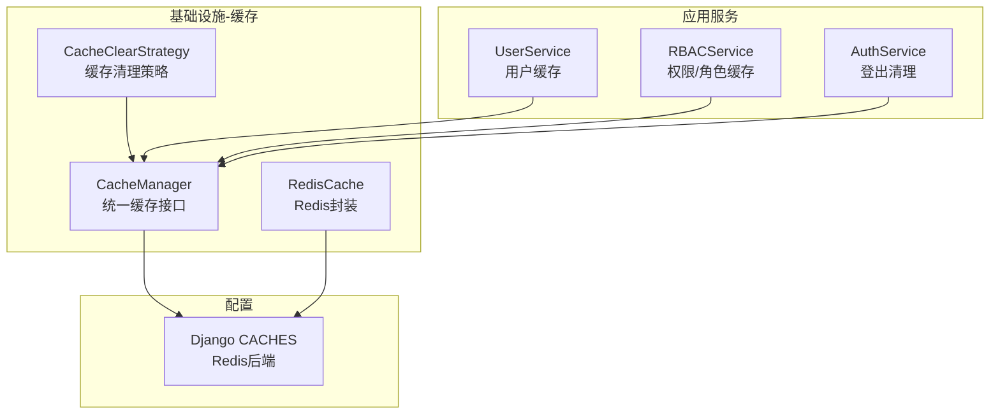
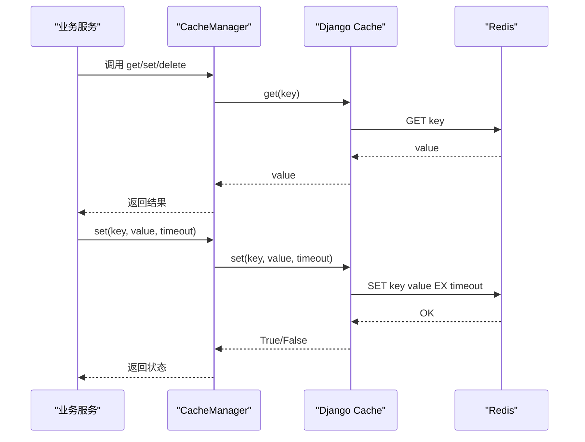
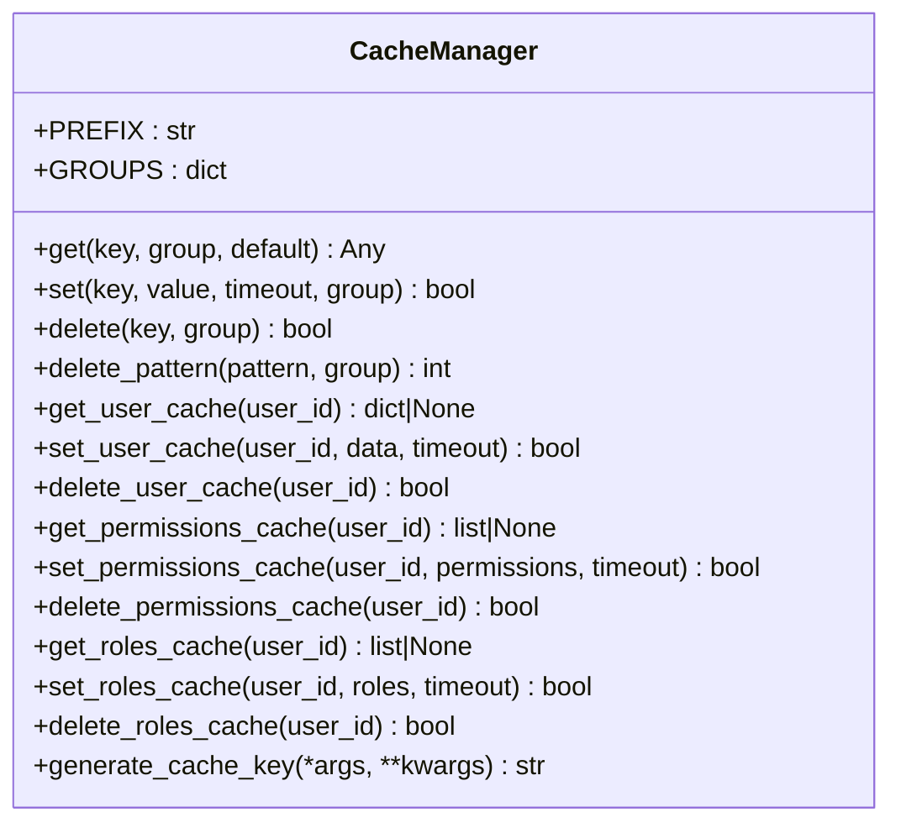
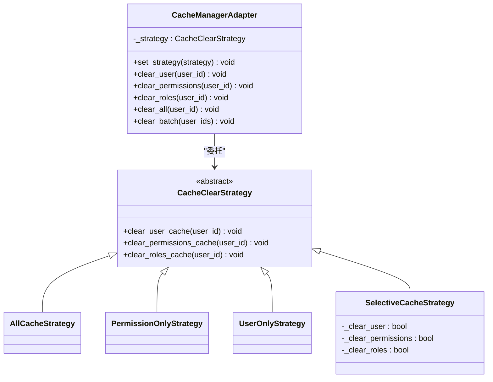
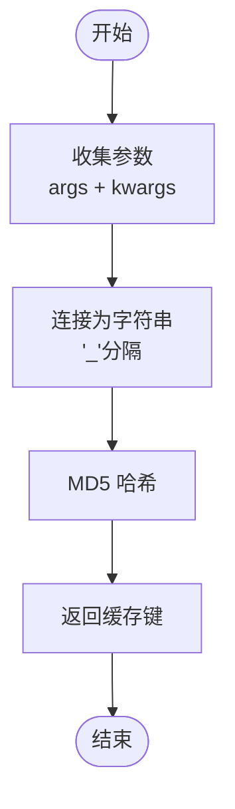
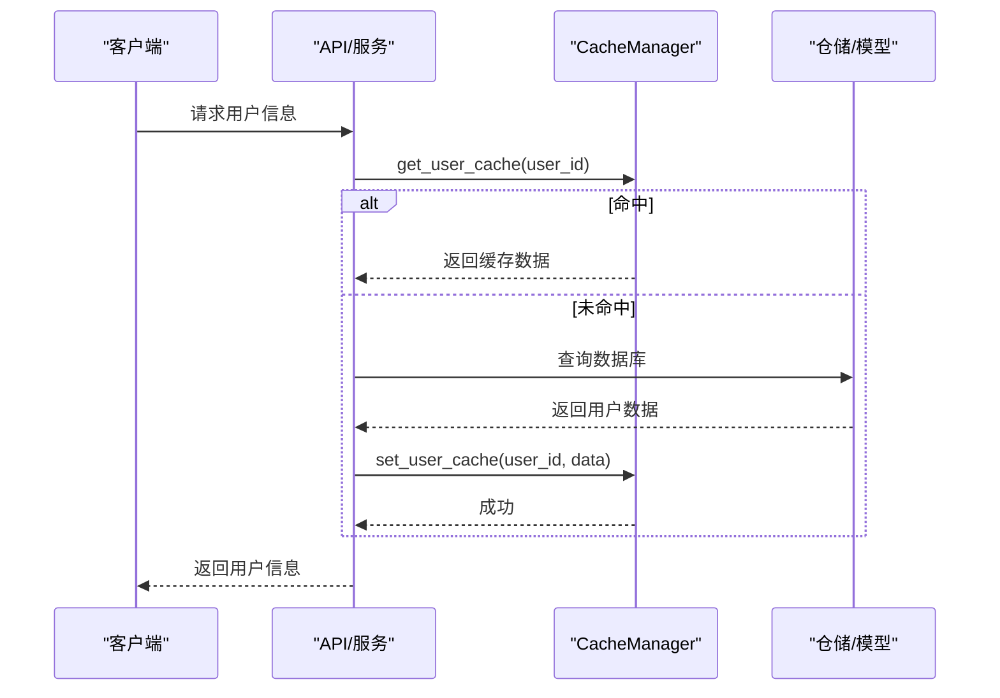
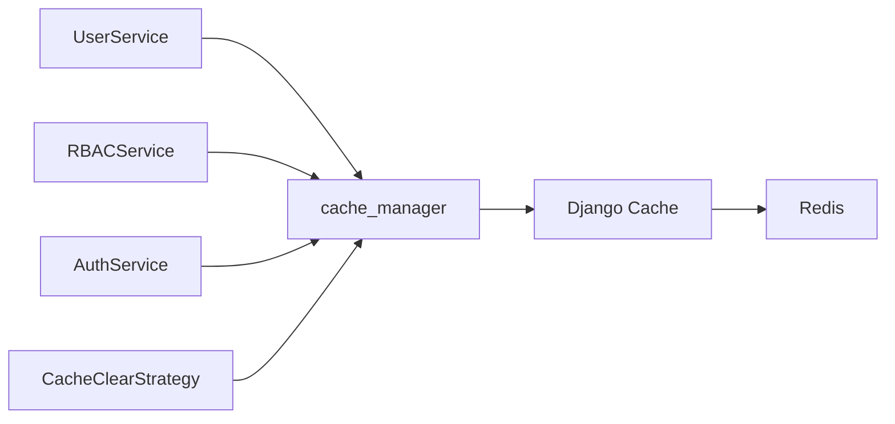

# 缓存管理器

<cite>
**本文引用的文件**
- [cache_manager.py](file://src/infrastructure/cache/cache_manager.py)
- [redis_cache.py](file://src/infrastructure/cache/redis_cache.py)
- [cache_strategies.py](file://src/infrastructure/cache/cache_strategies.py)
- [base.py](file://config/settings/base.py)
- [user_service.py](file://src/application/services/user_service.py)
- [rbac_service.py](file://src/application/services/rbac_service.py)
- [auth_service.py](file://src/application/services/auth_service.py)
- [rate_limit_middleware.py](file://src/core/middlewares/rate_limit_middleware.py)
</cite>

## 目录
1. [简介](#简介)
2. [项目结构](#项目结构)
3. [核心组件](#核心组件)
4. [架构总览](#架构总览)
5. [详细组件分析](#详细组件分析)
6. [依赖分析](#依赖分析)
7. [性能考虑](#性能考虑)
8. [故障排查指南](#故障排查指南)
9. [结论](#结论)
10. [附录](#附录)

## 简介
本文件面向“缓存管理器”模块，系统性阐述 CacheManager 的设计与实现，涵盖统一缓存接口理念、缓存键生成机制、分组策略、序列化与反序列化、专用缓存方法（用户、权限、角色）、以及在实际业务中的使用方式与最佳实践。同时提供键生成算法与参数化键的生成流程说明，并给出常见问题的排查建议。

## 项目结构
缓存相关代码位于基础设施层的缓存子包中，配合 Django 的 CACHES 后端（默认 Redis）工作；业务服务通过统一的 CacheManager 接口进行缓存读写与清理。

图表来源
- [cache_manager.py:16-149](file://src/infrastructure/cache/cache_manager.py#L16-L149)
- [redis_cache.py:15-169](file://src/infrastructure/cache/redis_cache.py#L15-L169)
- [cache_strategies.py:9-245](file://src/infrastructure/cache/cache_strategies.py#L9-L245)
- [base.py:153-163](file://config/settings/base.py#L153-L163)

章节来源
- [cache_manager.py:16-149](file://src/infrastructure/cache/cache_manager.py#L16-L149)
- [base.py:153-163](file://config/settings/base.py#L153-L163)

## 核心组件
- CacheManager：统一的缓存操作入口，提供基础 get/set/delete 以及用户、权限、角色专用方法，内置键前缀与分组常量，支持参数化键生成。
- RedisCache：基于 Redis 的缓存封装，提供便捷的 get/set/delete/exists/get_many/set_many/increment 等方法，内部同样使用前缀与 JSON 序列化。
- CacheClearStrategy：缓存清理策略模式，包含全量清理、仅权限清理、仅用户清理、选择性清理等策略，并提供适配器统一调用。
- Django CACHES：默认使用 Redis 后端，键空间隔离通过前缀实现。

章节来源
- [cache_manager.py:16-149](file://src/infrastructure/cache/cache_manager.py#L16-L149)
- [redis_cache.py:15-169](file://src/infrastructure/cache/redis_cache.py#L15-L169)
- [cache_strategies.py:9-245](file://src/infrastructure/cache/cache_strategies.py#L9-L245)
- [base.py:153-163](file://config/settings/base.py#L153-L163)

## 架构总览
CacheManager 作为统一入口，向上为业务服务提供稳定的缓存能力；向下依赖 Django 的 cache 接口，实际存储由 Redis 后端承载。缓存键采用“前缀:分组:键”的命名规范，确保键空间隔离与可维护性。

图表来源
- [cache_manager.py:42-82](file://src/infrastructure/cache/cache_manager.py#L42-L82)
- [base.py:153-163](file://config/settings/base.py#L153-L163)

## 详细组件分析

### CacheManager 设计与实现
- 统一接口理念
  - 提供基础 CRUD 方法：get、set、delete；支持按组删除 delete_pattern（当前记录警告，需后端支持）。
  - 提供专用方法：用户缓存、权限缓存、角色缓存，便于语义化调用。
  - 提供参数化键生成方法，避免手写重复键逻辑。
- 键前缀与分组
  - 前缀：统一使用项目标识，保证键空间隔离。
  - 分组：按领域划分（用户、RBAC、认证、安全、系统），便于后续按域清理。
- 序列化与反序列化
  - 写入：非基本类型自动 JSON 序列化；读取时尝试 JSON 反序列化，失败则回退为原始字符串。
  - 默认超时：set 默认超时为小时级，部分专用方法提供更短超时以降低数据陈旧风险。
- 错误处理与日志
  - 所有异常均捕获并记录，返回安全默认值或 False，保障业务稳定性。

图表来源
- [cache_manager.py:16-149](file://src/infrastructure/cache/cache_manager.py#L16-L149)

章节来源
- [cache_manager.py:16-149](file://src/infrastructure/cache/cache_manager.py#L16-L149)

### RedisCache 封装
- 与 CacheManager 的差异
  - 仅使用前缀，不参与分组；提供 exists、get_many、set_many、increment 等常用方法。
  - 适合对单一前缀空间进行快速操作的场景。
- 序列化策略
  - 与 CacheManager 一致：复杂对象 JSON 序列化，读取时尝试 JSON 反序列化。
- 安全性提示
  - clear 方法当前仅记录警告，不提供跨键清理能力，避免误删。

章节来源
- [redis_cache.py:15-169](file://src/infrastructure/cache/redis_cache.py#L15-L169)

### 缓存清理策略模式
- 策略接口
  - 定义 clear_user_cache、clear_permissions_cache、clear_roles_cache 抽象方法。
- 具体策略
  - 全量策略：清理用户、权限、角色全部相关缓存。
  - 仅权限策略：仅清理权限与角色缓存。
  - 仅用户策略：仅清理用户信息缓存。
  - 选择性策略：按配置开关决定清理范围。
- 适配器
  - CacheManagerAdapter 统一对外接口，支持运行时切换策略。

图表来源
- [cache_strategies.py:9-245](file://src/infrastructure/cache/cache_strategies.py#L9-L245)

章节来源
- [cache_strategies.py:9-245](file://src/infrastructure/cache/cache_strategies.py#L9-L245)

### 键生成与参数化键
- 基础键生成
  - _make_key：根据前缀与可选分组生成完整键。
- 参数化键生成
  - generate_cache_key：将位置参数与关键字参数拼接后做 MD5 哈希，得到稳定且唯一的键。
- 使用建议
  - 对于动态组合查询或计算结果，优先使用参数化键生成，避免手工拼接导致冲突。

图表来源
- [cache_manager.py:140-144](file://src/infrastructure/cache/cache_manager.py#L140-L144)

章节来源
- [cache_manager.py:34-39](file://src/infrastructure/cache/cache_manager.py#L34-L39)
- [cache_manager.py:140-144](file://src/infrastructure/cache/cache_manager.py#L140-L144)

### 专用缓存方法详解
- 用户缓存
  - get_user_cache/set_user_cache/delete_user_cache：键格式为 user:{user_id}，分组为 user。
  - 超时较短，适合高频读取但不希望长期滞留的用户信息。
- 权限缓存
  - get_permissions_cache/set_permissions_cache/delete_permissions_cache：键格式为 permissions:{user_id}，分组为 rbac。
  - 超时较短，配合 RBAC 变更及时失效。
- 角色缓存
  - get_roles_cache/set_roles_cache/delete_roles_cache：键格式为 roles:{user_id}，分组为 rbac。
  - 超时较短，与权限缓存协同使用。

章节来源
- [cache_manager.py:92-137](file://src/infrastructure/cache/cache_manager.py#L92-L137)

### 在业务中的使用示例与最佳实践
- 用户服务
  - 读取：先查缓存，命中则直接返回；未命中再查数据库并写回缓存。
  - 更新/删除：同步清理对应用户缓存，避免脏读。
- RBAC 服务
  - 用户权限/角色变更后，清理对应用户的权限与角色缓存。
- 认证服务
  - 登出时清理用户信息、权限、角色三类缓存，确保会话撤销生效。
- 最佳实践
  - 明确超时策略：热点数据短超时，低频数据长超时。
  - 保持键命名一致性：统一使用前缀与分组。
  - 异常兜底：所有缓存操作均应捕获异常并记录日志。
  - 清理策略：根据业务场景选择合适的清理策略，避免过度清理影响性能。

图表来源
- [user_service.py:52-66](file://src/application/services/user_service.py#L52-L66)
- [cache_manager.py:92-105](file://src/infrastructure/cache/cache_manager.py#L92-L105)

章节来源
- [user_service.py:52-66](file://src/application/services/user_service.py#L52-L66)
- [rbac_service.py:201-248](file://src/application/services/rbac_service.py#L201-L248)
- [auth_service.py:164-180](file://src/application/services/auth_service.py#L164-L180)

## 依赖分析
- CacheManager 依赖 Django 的 cache 接口，实际存储由 Redis 后端提供。
- 业务服务通过导入全局实例 cache_manager 使用统一接口。
- 缓存清理策略通过适配器模式解耦不同清理需求。

图表来源
- [cache_manager.py:147-149](file://src/infrastructure/cache/cache_manager.py#L147-L149)
- [base.py:153-163](file://config/settings/base.py#L153-L163)
- [cache_strategies.py:170-245](file://src/infrastructure/cache/cache_strategies.py#L170-L245)

章节来源
- [cache_manager.py:147-149](file://src/infrastructure/cache/cache_manager.py#L147-L149)
- [base.py:153-163](file://config/settings/base.py#L153-L163)
- [cache_strategies.py:170-245](file://src/infrastructure/cache/cache_strategies.py#L170-L245)

## 性能考虑
- 键前缀与分组
  - 通过前缀与分组实现键空间隔离，减少键冲突，便于后续批量清理。
- 序列化成本
  - 复杂对象 JSON 序列化带来一定 CPU 开销，建议仅对必要数据进行缓存。
- 超时策略
  - 热点数据短超时，降低陈旧数据带来的额外序列化与网络开销。
- 批量操作
  - RedisCache 提供 get_many/set_many，可在一次往返内完成批量读写，提升吞吐。
- 并发与锁
  - 当前实现未引入分布式锁，高并发下可能出现缓存击穿；可结合业务场景引入互斥锁或预热策略。

## 故障排查指南
- 常见问题
  - 缓存未生效：确认 Django CACHES 配置正确，Redis 服务可用。
  - 键冲突：检查是否手动拼接键名，建议使用统一前缀与分组。
  - 读取异常：确认写入时是否为复杂对象，读取端是否能正确反序列化。
  - 清理无效：delete_pattern 当前仅记录警告，需后端支持或改用分组清理。
- 日志定位
  - CacheManager 与 RedisCache 在异常时会记录错误日志，可通过日志定位具体键与异常原因。
- 中间件干扰
  - 速率限制中间件使用 cache 进行计数，若出现异常可检查其键命名与过期时间。

章节来源
- [cache_manager.py:56-82](file://src/infrastructure/cache/cache_manager.py#L56-L82)
- [redis_cache.py:44-78](file://src/infrastructure/cache/redis_cache.py#L44-L78)
- [rate_limit_middleware.py:99-111](file://src/core/middlewares/rate_limit_middleware.py#L99-L111)

## 结论
CacheManager 通过统一接口、前缀与分组策略、序列化兼容与专用方法，提供了清晰、可维护、可扩展的缓存能力。结合策略模式的缓存清理方案，能够灵活应对不同业务场景下的缓存生命周期管理。建议在实际使用中遵循键命名规范、合理设置超时、做好异常兜底与日志记录，并根据业务特性选择合适的清理策略。

## 附录

### 配置要点
- Redis 后端
  - 通过 CACHES 指定 Redis 地址与数据库编号，确保与部署环境一致。
- 日志
  - 通过 LOGGING 配置输出缓存相关日志，便于问题排查。

章节来源
- [base.py:153-163](file://config/settings/base.py#L153-L163)
- [base.py:174-226](file://config/settings/base.py#L174-L226)