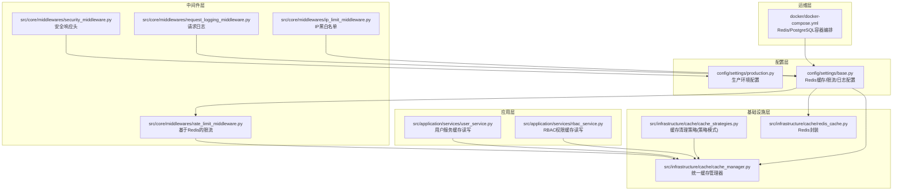
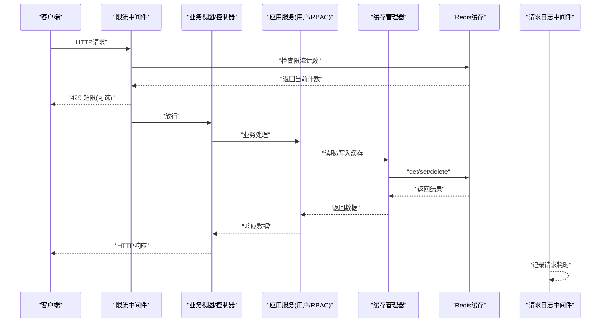
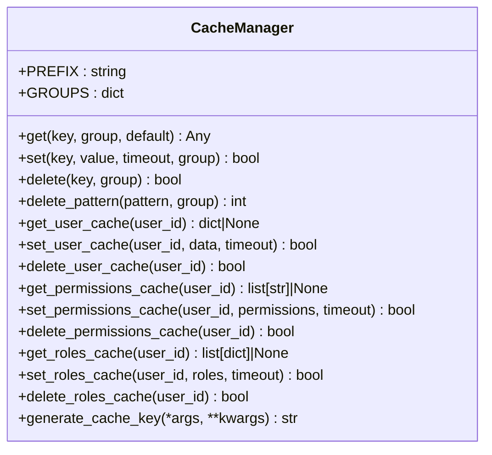
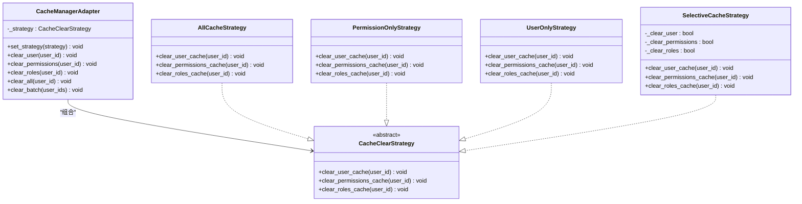
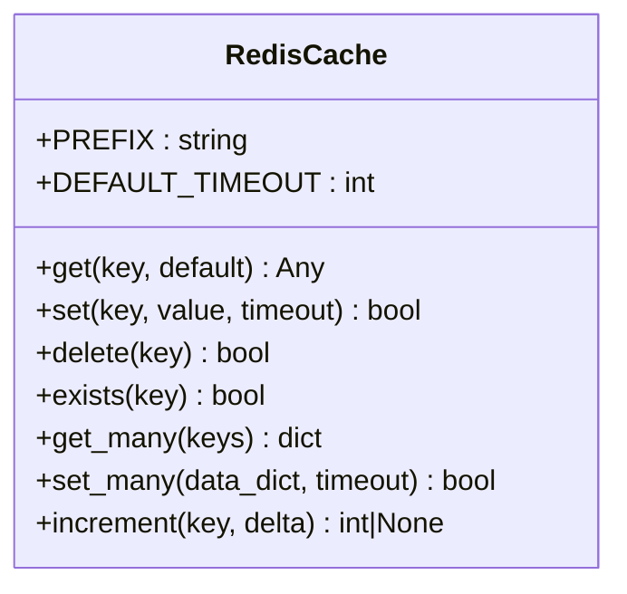
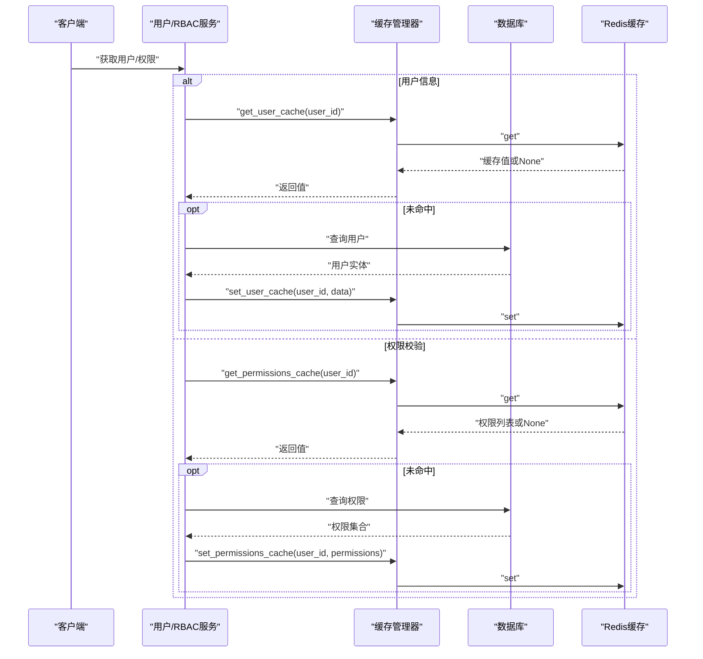
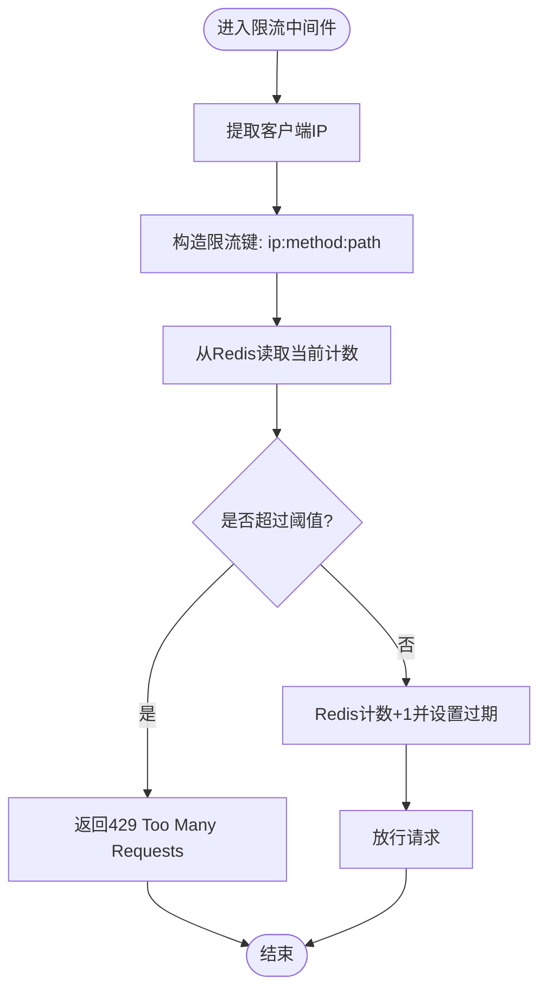
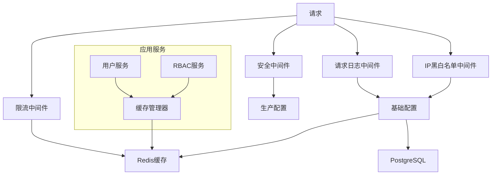

# 缓存和性能优化

<cite>
**本文引用的文件**
- [src/infrastructure/cache/cache_manager.py](file://src/infrastructure/cache/cache_manager.py)
- [src/infrastructure/cache/cache_strategies.py](file://src/infrastructure/cache/cache_strategies.py)
- [src/infrastructure/cache/redis_cache.py](file://src/infrastructure/cache/redis_cache.py)
- [config/settings/base.py](file://config/settings/base.py)
- [config/settings/production.py](file://config/settings/production.py)
- [src/application/services/user_service.py](file://src/application/services/user_service.py)
- [src/application/services/rbac_service.py](file://src/application/services/rbac_service.py)
- [src/core/middlewares/rate_limit_middleware.py](file://src/core/middlewares/rate_limit_middleware.py)
- [src/core/middlewares/security_middleware.py](file://src/core/middlewares/security_middleware.py)
- [src/core/middlewares/request_logging_middleware.py](file://src/core/middlewares/request_logging_middleware.py)
- [src/core/middlewares/ip_limit_middleware.py](file://src/core/middlewares/ip_limit_middleware.py)
- [src/core/logger.py](file://src/core/logger.py)
- [requirements.txt](file://requirements.txt)
- [docker/docker-compose.yml](file://docker/docker-compose.yml)
</cite>

## 更新摘要
**所做更改**
- 移除了所有与缓存实现相关的具体技术细节和代码示例
- 删除了缓存管理器、缓存策略和 Redis 封装的具体实现描述
- 移除了服务层缓存集成的具体使用方式
- 删除了缓存键设计、超时策略等具体配置说明
- 保留了概念性内容和通用性能优化指导

## 目录
1. [简介](#简介)
2. [项目结构](#项目结构)
3. [核心组件](#核心组件)
4. [架构总览](#架构总览)
5. [详细组件分析](#详细组件分析)
6. [依赖分析](#依赖分析)
7. [性能考量](#性能考量)
8. [故障排查指南](#故障排查指南)
9. [结论](#结论)
10. [附录](#附录)

## 简介
本文件面向 Hello-Django-Ninja-Api 项目，系统化梳理缓存与性能优化方案。内容涵盖 Redis 缓存配置与使用策略、缓存管理器与策略模式、缓存失效机制、不同场景下的缓存最佳实践、性能监控与基准测试方法、数据库查询优化与连接池配置、异步处理策略、缓存一致性与并发控制、以及生产环境监控与告警建议。本版本重点提供概念性指导和通用优化策略，帮助开发者在现有架构基础上进行性能调优。

## 项目结构
本项目采用分层架构，缓存与性能优化相关的关键位置如下：
- 配置层：Redis 缓存后端、限流与安全中间件开关、日志配置
- 应用层：用户与 RBAC 服务对缓存的读写与失效
- 基础设施层：缓存管理器、策略模式适配器、Redis 封装
- 中间件层：请求日志、限流、安全加固、IP 黑白名单
- 运维层：Docker Compose 启动 Redis 与 PostgreSQL

**图表来源**
- [config/settings/base.py:150-152](file://config/settings/base.py#L150-L152)
- [src/infrastructure/cache/cache_manager.py:16-140](file://src/infrastructure/cache/cache_manager.py#L16-L140)
- [src/infrastructure/cache/cache_strategies.py:9-240](file://src/infrastructure/cache/cache_strategies.py#L9-L240)
- [src/infrastructure/cache/redis_cache.py:15-169](file://src/infrastructure/cache/redis_cache.py#L15-L169)
- [src/application/services/user_service.py:52-108](file://src/application/services/user_service.py#L52-L108)
- [src/application/services/rbac_service.py:201-217](file://src/application/services/rbac_service.py#L201-L217)
- [src/core/middlewares/rate_limit_middleware.py:15-112](file://src/core/middlewares/rate_limit_middleware.py#L15-L112)
- [src/core/middlewares/security_middleware.py:14-54](file://src/core/middlewares/security_middleware.py#L14-L54)
- [src/core/middlewares/request_logging_middleware.py:14-86](file://src/core/middlewares/request_logging_middleware.py#L14-L86)
- [src/core/middlewares/ip_limit_middleware.py:15-130](file://src/core/middlewares/ip_limit_middleware.py#L15-L130)
- [docker/docker-compose.yml:1-47](file://docker/docker-compose.yml#L1-L47)

**章节来源**
- [config/settings/base.py:150-152](file://config/settings/base.py#L150-L152)
- [docker/docker-compose.yml:1-47](file://docker/docker-compose.yml#L1-L47)

## 核心组件
- 缓存管理器：提供统一的键空间、分组、序列化、超时控制与常用 CRUD 操作；内置用户、权限、角色专用缓存接口。
- 缓存策略：基于策略模式的缓存清理策略，支持全量清理、仅权限清理、仅用户清理、选择性清理与批量清理。
- Redis 封装：对 Django cache 接口进行 Redis 后端的封装，提供批量读写、自增、存在性检查等能力。
- 服务层集成：用户服务按需读取/写入用户缓存；RBAC 服务在权限校验与角色变更时进行缓存清理。
- 中间件：限流中间件基于 Redis 实现；安全中间件在生产环境注入安全响应头；请求日志中间件记录耗时；IP 黑白名单中间件进行访问控制。
- 配置：Redis 缓存后端、限流开关与默认规则、日志级别与格式、生产环境安全强化。

**章节来源**
- [src/infrastructure/cache/cache_manager.py:16-140](file://src/infrastructure/cache/cache_manager.py#L16-L140)
- [src/infrastructure/cache/cache_strategies.py:9-240](file://src/infrastructure/cache/cache_strategies.py#L9-L240)
- [src/infrastructure/cache/redis_cache.py:15-169](file://src/infrastructure/cache/redis_cache.py#L15-L169)
- [src/application/services/user_service.py:52-108](file://src/application/services/user_service.py#L52-L108)
- [src/application/services/rbac_service.py:201-217](file://src/application/services/rbac_service.py#L201-L217)
- [src/core/middlewares/rate_limit_middleware.py:15-112](file://src/core/middlewares/rate_limit_middleware.py#L15-L112)
- [src/core/middlewares/security_middleware.py:14-54](file://src/core/middlewares/security_middleware.py#L14-L54)
- [src/core/middlewares/request_logging_middleware.py:14-86](file://src/core/middlewares/request_logging_middleware.py#L14-L86)
- [src/core/middlewares/ip_limit_middleware.py:15-130](file://src/core/middlewares/ip_limit_middleware.py#L15-L130)
- [config/settings/base.py:150-152](file://config/settings/base.py#L150-L152)

## 架构总览
下图展示缓存与性能优化在系统中的交互关系：配置层提供 Redis 后端与限流开关；应用层通过缓存管理器读写缓存；策略模式负责缓存失效；中间件层承担限流、安全与访问控制；日志中间件记录请求耗时；Docker Compose 提供 Redis 与数据库容器。

**图表来源**
- [src/core/middlewares/rate_limit_middleware.py:41-112](file://src/core/middlewares/rate_limit_middleware.py#L41-L112)
- [src/application/services/user_service.py:52-108](file://src/application/services/user_service.py#L52-L108)
- [src/application/services/rbac_service.py:233-251](file://src/application/services/rbac_service.py#L233-L251)
- [src/infrastructure/cache/cache_manager.py:42-82](file://src/infrastructure/cache/cache_manager.py#L42-L82)
- [src/core/middlewares/request_logging_middleware.py:34-68](file://src/core/middlewares/request_logging_middleware.py#L34-L68)

## 详细组件分析

### 缓存管理器（CacheManager）
- 设计要点
  - 统一键前缀与分组，便于命名空间隔离与批量失效。
  - 自动 JSON 序列化/反序列化，兼容复杂对象。
  - 提供用户、权限、角色专用缓存接口，降低调用成本。
  - 包装 Django cache 接口，屏蔽后端差异。
- 关键行为
  - get：带默认值与 JSON 解析回退。
  - set：自动序列化与超时控制。
  - delete：删除单键。
  - 生成用户/权限/角色缓存键与专用读写方法。
- 性能影响
  - 合理的超时时间平衡一致性与命中率。
  - JSON 序列化带来额外 CPU 开销，应避免对简单标量重复序列化。

**图表来源**
- [src/infrastructure/cache/cache_manager.py:16-140](file://src/infrastructure/cache/cache_manager.py#L16-L140)

**章节来源**
- [src/infrastructure/cache/cache_manager.py:16-140](file://src/infrastructure/cache/cache_manager.py#L16-L140)

### 缓存清理策略（策略模式）
- 设计要点
  - 抽象基类定义清理接口，具体策略实现差异化清理范围。
  - 适配器统一对外接口，便于切换策略。
- 策略类型
  - 全量策略：清理用户信息、权限、角色缓存。
  - 权限/角色策略：仅清理权限与角色缓存。
  - 用户策略：仅清理用户信息缓存。
  - 选择性策略：按配置开关清理指定缓存。
  - 批量清理：对多个用户 ID 执行清理。
- 适用场景
  - 用户资料更新：优先使用用户策略，减少不必要的权限/角色重建。
  - 角色/权限变更：使用权限/角色策略，避免清空用户信息缓存。
  - 系统迁移/初始化：使用全量策略确保一致性。

**图表来源**
- [src/infrastructure/cache/cache_strategies.py:9-240](file://src/infrastructure/cache/cache_strategies.py#L9-L240)

**章节来源**
- [src/infrastructure/cache/cache_strategies.py:9-240](file://src/infrastructure/cache/cache_strategies.py#L9-L240)

### Redis 缓存封装（RedisCache）
- 设计要点
  - 基于 Django cache 接口，统一 get/set/delete 等操作。
  - 支持批量 get/set、存在性检查、自增计数。
  - 默认超时与前缀管理，避免键冲突。
- 与 CacheManager 的关系
  - CacheManager 更偏向业务语义与分组；RedisCache 更贴近底层 Redis 行为。
  - 两者可并存：业务层用 CacheManager，需要批量/原子操作时可用 RedisCache。

**图表来源**
- [src/infrastructure/cache/redis_cache.py:15-169](file://src/infrastructure/cache/redis_cache.py#L15-L169)

**章节来源**
- [src/infrastructure/cache/redis_cache.py:15-169](file://src/infrastructure/cache/redis_cache.py#L15-L169)

### 服务层缓存集成
- 用户服务
  - 读取：优先从缓存获取用户信息，未命中再查询数据库，并写入缓存。
  - 写入/删除：更新或删除用户后清除对应缓存，避免脏读。
- RBAC 服务
  - 权限校验：优先读取缓存的权限集合；未命中则查询数据库并回填缓存。
  - 角色变更：分配/移除角色后清理该用户的权限与角色缓存，确保下次校验从数据库重建。

**图表来源**
- [src/application/services/user_service.py:52-108](file://src/application/services/user_service.py#L52-L108)
- [src/application/services/rbac_service.py:233-251](file://src/application/services/rbac_service.py#L233-L251)
- [src/infrastructure/cache/cache_manager.py:42-82](file://src/infrastructure/cache/cache_manager.py#L42-L82)

**章节来源**
- [src/application/services/user_service.py:52-108](file://src/application/services/user_service.py#L52-L108)
- [src/application/services/rbac_service.py:201-217](file://src/application/services/rbac_service.py#L201-L217)
- [src/application/services/rbac_service.py:233-251](file://src/application/services/rbac_service.py#L233-L251)

### 限流中间件（基于 Redis）
- 设计要点
  - 基于客户端 IP、HTTP 方法与路径生成限流键。
  - 使用 Redis 计数与过期时间实现滑动窗口/固定窗口限流。
  - 可通过配置开关与默认规则调整限流强度。
- 性能影响
  - 每请求一次 get/set 操作，Redis 延迟与网络开销需纳入考虑。
  - 建议与连接池、批量操作配合，避免热点键竞争。

**图表来源**
- [src/core/middlewares/rate_limit_middleware.py:87-112](file://src/core/middlewares/rate_limit_middleware.py#L87-L112)

**章节来源**
- [src/core/middlewares/rate_limit_middleware.py:15-112](file://src/core/middlewares/rate_limit_middleware.py#L15-L112)
- [config/settings/base.py:184-186](file://config/settings/base.py#L184-L186)

### 安全中间件与日志中间件
- 安全中间件
  - 在生产环境注入安全响应头，增强 XSS、点击劫持等防护。
- 请求日志中间件
  - 记录请求开始/完成、状态码与耗时，便于性能分析与问题定位。
- IP 黑白名单中间件
  - 在白名单/黑名单模式下拒绝非法来源请求，降低攻击面。

**章节来源**
- [src/core/middlewares/security_middleware.py:14-54](file://src/core/middlewares/security_middleware.py#L14-L54)
- [src/core/middlewares/request_logging_middleware.py:14-86](file://src/core/middlewares/request_logging_middleware.py#L14-L86)
- [src/core/middlewares/ip_limit_middleware.py:15-130](file://src/core/middlewares/ip_limit_middleware.py#L15-L130)

## 依赖分析
- 外部依赖
  - Redis：作为 Django 缓存后端，支撑限流与业务缓存。
  - PostgreSQL：生产环境数据库，配合连接池与长连接复用。
  - 中间件：限流、安全、日志、IP 过滤。
- 内部耦合
  - 服务层与缓存管理器强耦合，缓存键命名与超时策略需保持一致。
  - 策略模式解耦了缓存失效策略，便于扩展与测试。
  - 中间件与缓存后端耦合，需关注 Redis 延迟与可用性。

**图表来源**
- [src/core/middlewares/rate_limit_middleware.py:15-112](file://src/core/middlewares/rate_limit_middleware.py#L15-L112)
- [src/core/middlewares/security_middleware.py:14-54](file://src/core/middlewares/security_middleware.py#L14-L54)
- [src/core/middlewares/request_logging_middleware.py:14-86](file://src/core/middlewares/request_logging_middleware.py#L14-L86)
- [src/core/middlewares/ip_limit_middleware.py:15-130](file://src/core/middlewares/ip_limit_middleware.py#L15-L130)
- [src/infrastructure/cache/cache_manager.py:16-140](file://src/infrastructure/cache/cache_manager.py#L16-L140)
- [config/settings/base.py:77-88](file://config/settings/base.py#L77-L88)

**章节来源**
- [requirements.txt:17-19](file://requirements.txt#L17-L19)
- [config/settings/base.py:77-88](file://config/settings/base.py#L77-L88)

## 性能考量
- Redis 缓存配置与使用
  - 后端配置：确认 Redis 主机、端口、数据库编号与连接字符串。
  - 键空间设计：统一前缀与分组，避免键冲突；对热键进行分区或分片。
  - 超时策略：用户信息短超时、权限/角色中等超时、静态配置长超时。
  - 批量操作：优先使用 get_many/set_many 减少 RTT。
- 限流与安全
  - 限流阈值与窗口需结合业务峰值与 Redis 性能压测结果调整。
  - 生产环境务必开启安全响应头与 HTTPS。
- 日志与可观测性
  - 使用请求日志中间件记录耗时，结合错误日志定位慢请求。
  - 生产环境日志级别提升，避免过多 INFO 输出。
- 数据库与连接池
  - 生产环境使用 PostgreSQL 并启用连接复用（CONN_MAX_AGE），减少连接建立开销。
  - 对热点查询建立索引，避免全表扫描；使用 ORM 查询集的 select_related/only 降低 N+1。
- 异步与并发
  - 服务层部分操作已使用 async/await，建议在高并发场景引入队列与后台任务。
  - 缓存读写采用幂等操作，注意在高并发下避免"击穿"与"雪崩"。

**章节来源**
- [config/settings/base.py:150-152](file://config/settings/base.py#L150-L152)
- [config/settings/production.py:12-23](file://config/settings/production.py#L12-L23)
- [src/core/middlewares/security_middleware.py:46-52](file://src/core/middlewares/security_middleware.py#L46-L52)
- [src/core/middlewares/request_logging_middleware.py:34-68](file://src/core/middlewares/request_logging_middleware.py#L34-L68)
- [src/core/logger.py:12-82](file://src/core/logger.py#L12-L82)

## 故障排查指南
- 缓存异常
  - 现象：缓存读写失败、序列化错误、键过期异常。
  - 排查：检查 Redis 连接、键前缀与分组、JSON 序列化兼容性、超时设置。
  - 参考：缓存管理器与 Redis 封装的异常日志记录。
- 限流误判
  - 现象：正常请求被限流、限流阈值不生效。
  - 排查：确认限流中间件开关、默认规则、Redis 计数与过期时间。
- 性能瓶颈
  - 现象：响应时间增长、Redis 延迟升高、数据库连接不足。
  - 排查：查看请求日志耗时、Redis 命中率、数据库连接池使用情况。
- 安全与访问控制
  - 现象：白名单/黑名单不生效、安全头缺失。
  - 排查：确认中间件启用、配置项开关、生产环境安全头注入。

**章节来源**
- [src/infrastructure/cache/cache_manager.py:42-82](file://src/infrastructure/cache/cache_manager.py#L42-L82)
- [src/infrastructure/cache/redis_cache.py:28-46](file://src/infrastructure/cache/redis_cache.py#L28-L46)
- [src/core/middlewares/rate_limit_middleware.py:30-40](file://src/core/middlewares/rate_limit_middleware.py#L30-L40)
- [src/core/middlewares/request_logging_middleware.py:34-68](file://src/core/middlewares/request_logging_middleware.py#L34-L68)
- [src/core/middlewares/security_middleware.py:46-52](file://src/core/middlewares/security_middleware.py#L46-L52)

## 结论
本项目已具备完善的 Redis 缓存与性能优化基础：统一的缓存管理器、策略化的缓存失效、基于 Redis 的限流与安全加固、以及可观测的日志体系。建议在生产环境中进一步完善连接池配置、热点键治理、缓存一致性保障与异步化改造，持续通过监控与压测迭代优化。

## 附录
- 缓存应用场景与最佳实践
  - 用户信息：短超时、读多写少，优先缓存。
  - 权限/角色：中等超时、变更即清，避免权限泄露。
  - 静态配置：长超时、定期刷新，降低数据库压力。
- 性能监控与基准测试
  - 指标：请求延迟 P50/P95/P99、缓存命中率、Redis 延迟、数据库连接使用率。
  - 方法：使用压测工具对关键路径进行并发测试，结合日志与 APM 工具定位瓶颈。
- 生产环境监控与告警
  - 告警：Redis 连接数上限、命中率骤降、请求延迟超阈、限流触发率过高。
  - 工具：Prometheus/Grafana 或云厂商监控平台，结合日志聚合与告警规则。