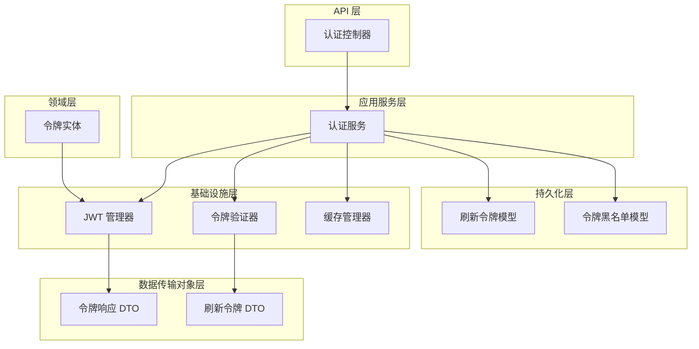
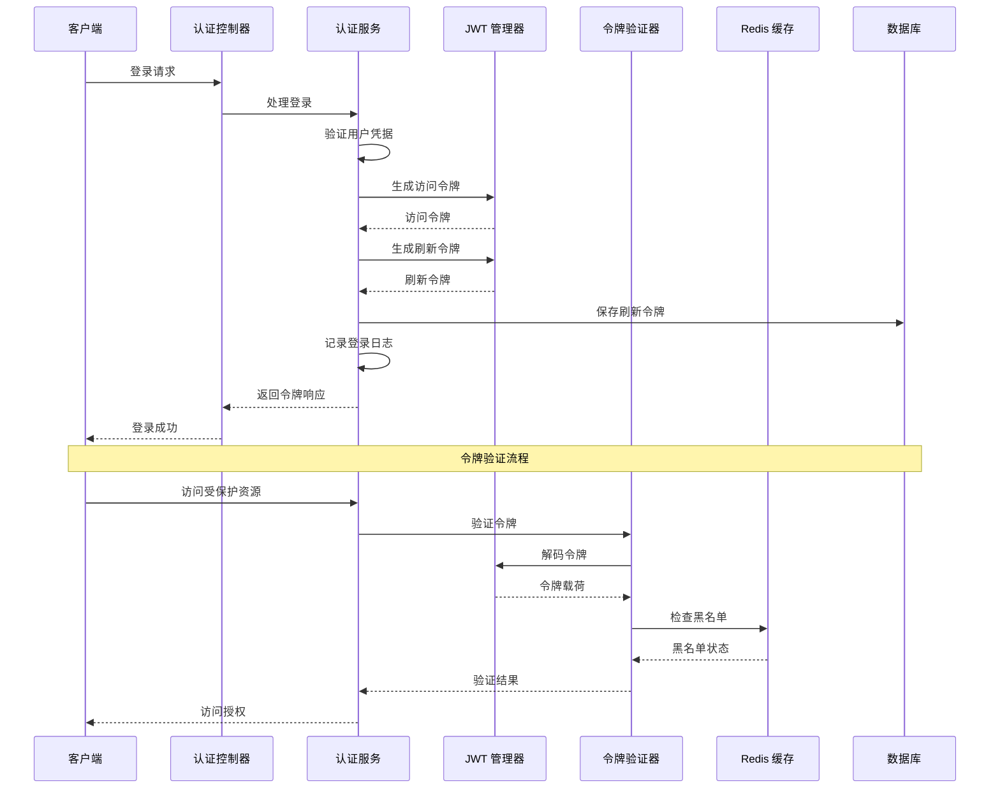
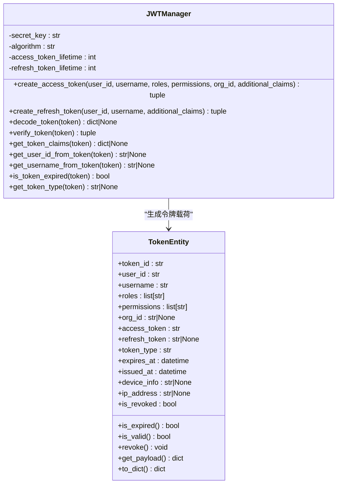
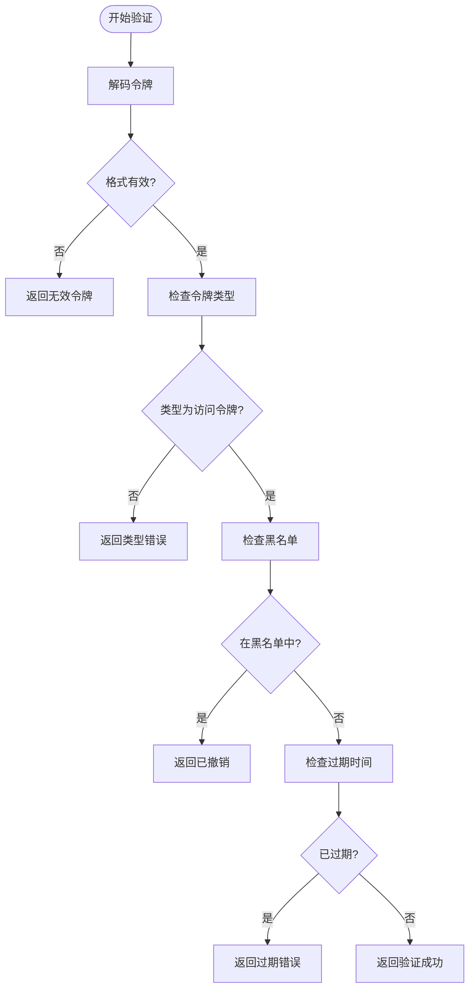
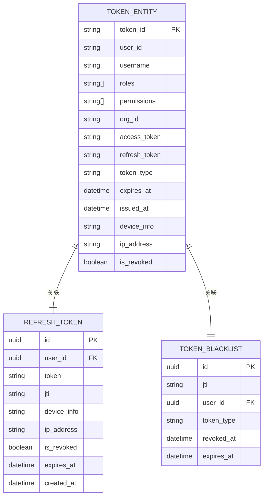
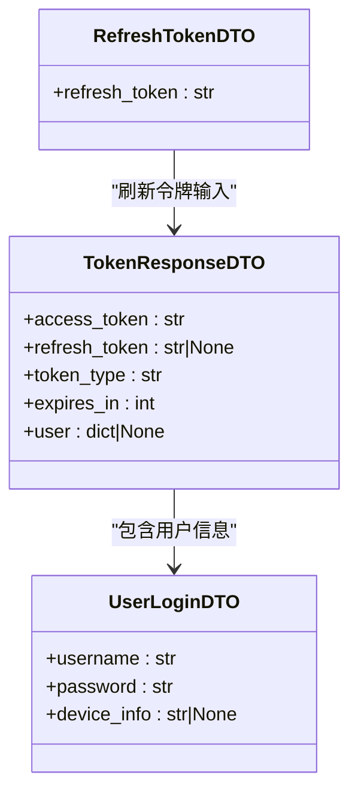
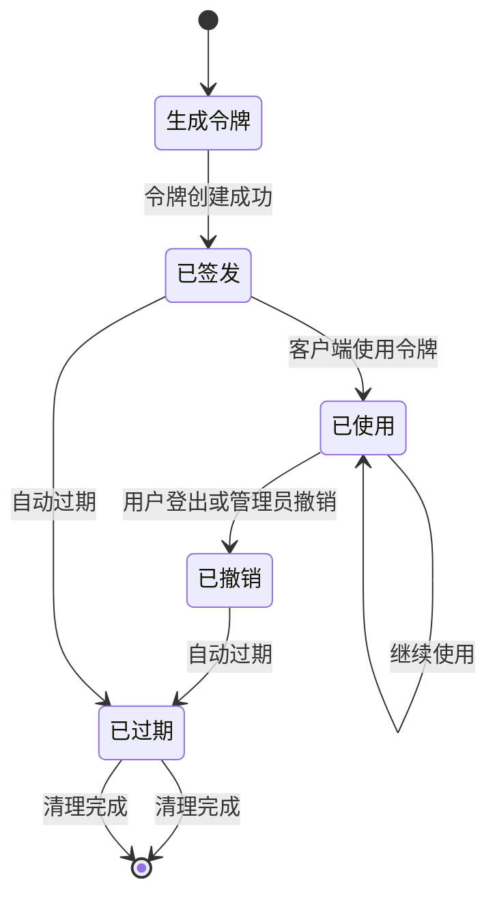
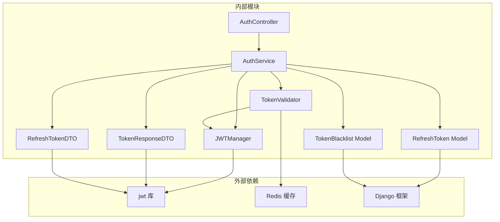
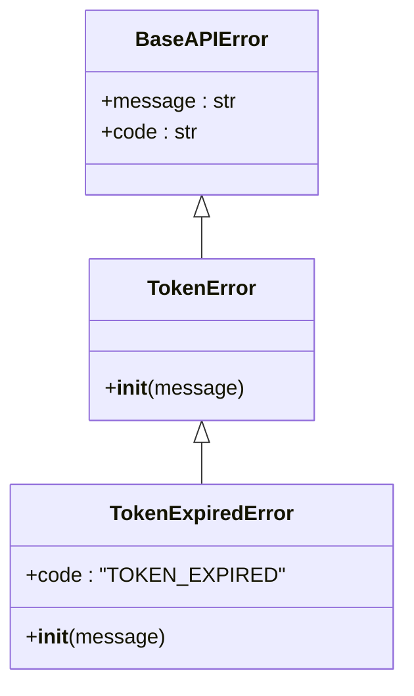

# JWT 令牌管理

<cite>
**本文档引用的文件**
- [jwt_manager.py](file://src/infrastructure/auth_jwt/jwt_manager.py)
- [token_validator.py](file://src/infrastructure/auth_jwt/token_validator.py)
- [token_entity.py](file://src/domain/auth/entities/token_entity.py)
- [token_response_dto.py](file://src/application/dto/auth/token_response_dto.py)
- [refresh_token_dto.py](file://src/application/dto/auth/refresh_token_dto.py)
- [auth_controller.py](file://src/api/v1/controllers/auth_controller.py)
- [auth_service.py](file://src/application/services/auth_service.py)
- [auth_models.py](file://src/infrastructure/persistence/models/auth_models.py)
- [base.py](file://config/settings/base.py)
- [token_error.py](file://src/core/exceptions/token_error.py)
- [security_middleware.py](file://src/core/middlewares/security_middleware.py)
- [test_auth_api.py](file://tests/test_api/test_auth_api.py)
</cite>

## 目录
1. [简介](#简介)
2. [项目结构](#项目结构)
3. [核心组件](#核心组件)
4. [架构概览](#架构概览)
5. [详细组件分析](#详细组件分析)
6. [依赖关系分析](#依赖关系分析)
7. [性能考虑](#性能考虑)
8. [故障排除指南](#故障排除指南)
9. [结论](#结论)
10. [附录](#附录)

## 简介
本文件详细介绍该 Django Ninja API 项目中的 JWT 令牌管理系统。系统采用基于 Django 的认证框架，结合自定义的 JWT 管理器和令牌验证器，实现了完整的令牌生命周期管理，包括令牌生成、验证、刷新和撤销功能。系统支持访问令牌和刷新令牌的区分管理，并提供了基于 Redis 的黑名单机制来防止令牌重放攻击。

## 项目结构
JWT 令牌管理系统分布在多个层次中，采用分层架构设计：

**图表来源**
- [auth_controller.py:16-133](file://src/api/v1/controllers/auth_controller.py#L16-L133)
- [auth_service.py:20-233](file://src/application/services/auth_service.py#L20-L233)
- [jwt_manager.py:13-147](file://src/infrastructure/auth_jwt/jwt_manager.py#L13-L147)
- [token_validator.py:11-108](file://src/infrastructure/auth_jwt/token_validator.py#L11-L108)

**章节来源**
- [auth_controller.py:16-133](file://src/api/v1/controllers/auth_controller.py#L16-L133)
- [auth_service.py:20-233](file://src/application/services/auth_service.py#L20-L233)
- [jwt_manager.py:13-147](file://src/infrastructure/auth_jwt/jwt_manager.py#L13-L147)
- [token_validator.py:11-108](file://src/infrastructure/auth_jwt/token_validator.py#L11-L108)

## 核心组件
JWT 令牌管理系统由以下核心组件构成：

### JWT 管理器
负责 JWT 令牌的生成、解码和基本验证功能：
- 访问令牌生成：包含用户身份信息、角色权限、组织信息
- 刷新令牌生成：专门用于获取新的访问令牌
- 令牌解码：验证签名并提取载荷
- 过期时间检查：验证令牌是否仍在有效期内

### 令牌验证器
提供完整的令牌验证流程：
- 令牌格式验证：确保令牌符合 JWT 格式
- 类型检查：区分访问令牌和刷新令牌
- 黑名单检查：防止已撤销令牌的使用
- 过期时间验证：检查令牌是否过期

### 令牌实体
领域模型定义了令牌的完整信息：
- TokenEntity：包含访问令牌、刷新令牌及其元数据
- TokenBlacklistEntity：用于黑名单管理的实体

### 数据传输对象
标准化 API 响应格式：
- TokenResponseDTO：令牌响应的标准格式
- RefreshTokenDTO：刷新令牌的输入格式

**章节来源**
- [jwt_manager.py:13-147](file://src/infrastructure/auth_jwt/jwt_manager.py#L13-L147)
- [token_validator.py:11-108](file://src/infrastructure/auth_jwt/token_validator.py#L11-L108)
- [token_entity.py:11-105](file://src/domain/auth/entities/token_entity.py#L11-L105)
- [token_response_dto.py:9-32](file://src/application/dto/auth/token_response_dto.py#L9-L32)
- [refresh_token_dto.py:9-22](file://src/application/dto/auth/refresh_token_dto.py#L9-L22)

## 架构概览
系统采用分层架构，各层职责明确：

**图表来源**
- [auth_controller.py:42-78](file://src/api/v1/controllers/auth_controller.py#L42-L78)
- [auth_service.py:26-112](file://src/application/services/auth_service.py#L26-L112)
- [jwt_manager.py:25-80](file://src/infrastructure/auth_jwt/jwt_manager.py#L25-L80)
- [token_validator.py:21-45](file://src/infrastructure/auth_jwt/token_validator.py#L21-L45)

## 详细组件分析

### JWT 管理器实现
JWT 管理器是系统的核心组件，负责所有令牌相关的操作：

**图表来源**
- [jwt_manager.py:13-147](file://src/infrastructure/auth_jwt/jwt_manager.py#L13-L147)
- [token_entity.py:11-79](file://src/domain/auth/entities/token_entity.py#L11-L79)

#### 令牌生成算法
系统采用 HS256 对称加密算法，使用 Django 的 SECRET_KEY 作为签名密钥。令牌载荷包含以下关键字段：

**访问令牌载荷结构：**
- `user_id`: 用户唯一标识符
- `username`: 用户名
- `roles`: 用户角色列表
- `permissions`: 用户权限列表
- `org_id`: 组织机构标识
- `type`: 令牌类型（固定为 "access"）
- `exp`: 过期时间戳
- `iat`: 签发时间戳
- `jti`: JWT ID（唯一标识符）

**刷新令牌载荷结构：**
- `user_id`: 用户唯一标识符
- `username`: 用户名
- `type`: 令牌类型（固定为 "refresh"）
- `exp`: 过期时间戳
- `iat`: 签发时间戳
- `jti`: JWT ID（唯一标识符）

#### 过期时间管理
系统支持灵活的过期时间配置：
- 访问令牌默认 60 分钟（可通过环境变量配置）
- 刷新令牌默认 1440 分钟（24 小时）
- 过期时间通过 `ACCESS_TOKEN_LIFETIME` 和 `REFRESH_TOKEN_LIFETIME` 环境变量控制

**章节来源**
- [jwt_manager.py:19-23](file://src/infrastructure/auth_jwt/jwt_manager.py#L19-L23)
- [jwt_manager.py:25-80](file://src/infrastructure/auth_jwt/jwt_manager.py#L25-L80)
- [base.py:138-151](file://config/settings/base.py#L138-L151)

### 令牌验证器工作流程
令牌验证器提供多层验证保障：

**图表来源**
- [token_validator.py:21-45](file://src/infrastructure/auth_jwt/token_validator.py#L21-L45)

#### 验证步骤详解
1. **格式验证**：使用 `jwt.decode()` 验证令牌格式和签名
2. **类型检查**：确保令牌类型为 "access"
3. **黑名单检查**：通过 Redis 缓存检查令牌是否被撤销
4. **过期时间验证**：比较当前时间和令牌过期时间

#### 黑名单机制
系统使用 Redis 实现高效的黑名单管理：
- 黑名单键格式：`token_blacklist:{jti}`
- 过期时间与令牌过期时间同步
- 支持即时撤销和过期自动清理

**章节来源**
- [token_validator.py:21-103](file://src/infrastructure/auth_jwt/token_validator.py#L21-L103)

### 令牌实体数据结构
令牌实体定义了完整的令牌信息模型：

**图表来源**
- [token_entity.py:11-31](file://src/domain/auth/entities/token_entity.py#L11-L31)
- [auth_models.py:12-44](file://src/infrastructure/persistence/models/auth_models.py#L12-L44)
- [auth_models.py:47-76](file://src/infrastructure/persistence/models/auth_models.py#L47-L76)

#### 字段定义说明
**TokenEntity 主要字段：**
- `token_id`: 令牌唯一标识符
- `user_id`: 关联用户标识
- `username`: 用户名
- `roles`: 用户角色列表
- `permissions`: 用户权限列表
- `org_id`: 组织机构标识
- `access_token`: JWT 访问令牌字符串
- `refresh_token`: JWT 刷新令牌字符串
- `token_type`: 令牌类型（默认 "Bearer"）
- `expires_at`: 过期时间
- `issued_at`: 签发时间
- `device_info`: 设备信息
- `ip_address`: IP 地址
- `is_revoked`: 是否已撤销

**TokenBlacklistEntity 字段：**
- `blacklist_id`: 黑名单记录标识
- `token_jti`: 令牌 JWT ID
- `user_id`: 关联用户
- `revoked_at`: 撤销时间
- `expires_at`: 原过期时间

**章节来源**
- [token_entity.py:11-105](file://src/domain/auth/entities/token_entity.py#L11-L105)
- [auth_models.py:12-114](file://src/infrastructure/persistence/models/auth_models.py#L12-L114)

### 令牌响应 DTO 设计
系统使用 Pydantic 定义标准的令牌响应格式：

**图表来源**
- [token_response_dto.py:9-32](file://src/application/dto/auth/token_response_dto.py#L9-L32)
- [refresh_token_dto.py:9-22](file://src/application/dto/auth/refresh_token_dto.py#L9-L22)

#### 响应字段说明
**TokenResponseDTO 字段：**
- `access_token`: JWT 访问令牌字符串
- `refresh_token`: JWT 刷新令牌字符串（可选）
- `token_type`: 令牌类型，默认 "Bearer"
- `expires_in`: 过期时间（秒）
- `user`: 用户信息字典（可选）

**RefreshTokenDTO 字段：**
- `refresh_token`: 刷新令牌字符串

**章节来源**
- [token_response_dto.py:9-32](file://src/application/dto/auth/token_response_dto.py#L9-L32)
- [refresh_token_dto.py:9-22](file://src/application/dto/auth/refresh_token_dto.py#L9-L22)

### 令牌生命周期管理
完整的令牌生命周期从生成到失效的全过程：

#### 生命周期阶段详解
1. **生成阶段**：系统生成访问令牌和刷新令牌
2. **签发阶段**：令牌分配给用户，刷新令牌保存到数据库
3. **使用阶段**：客户端使用访问令牌访问受保护资源
4. **撤销阶段**：用户登出或管理员撤销令牌
5. **过期阶段**：令牌自然过期
6. **清理阶段**：系统清理过期和撤销的令牌

**章节来源**
- [auth_service.py:26-112](file://src/application/services/auth_service.py#L26-L112)
- [auth_service.py:164-180](file://src/application/services/auth_service.py#L164-L180)

## 依赖关系分析

**图表来源**
- [jwt_manager.py:9](file://src/infrastructure/auth_jwt/jwt_manager.py#L9)
- [token_validator.py:6](file://src/infrastructure/auth_jwt/token_validator.py#L6)
- [auth_service.py:10-17](file://src/application/services/auth_service.py#L10-L17)

### 组件耦合度分析
- **JWTManager**：低耦合，仅依赖 Django 配置和 jwt 库
- **TokenValidator**：中等耦合，依赖 JWTManager 和 Redis 缓存
- **AuthService**：高耦合，依赖多个组件和数据库模型
- **AuthController**：低耦合，主要依赖认证服务

### 循环依赖检测
系统通过模块导入避免了循环依赖：
- 控制器依赖服务层
- 服务层依赖基础设施层
- 基础设施层不依赖上层

**章节来源**
- [auth_controller.py:10-13](file://src/api/v1/controllers/auth_controller.py#L10-L13)
- [auth_service.py:10-17](file://src/application/services/auth_service.py#L10-L17)
- [jwt_manager.py:9](file://src/infrastructure/auth_jwt/jwt_manager.py#L9)

## 性能考虑
JWT 令牌管理系统在性能方面采用了多项优化措施：

### 缓存策略
- **Redis 黑名单缓存**：使用 Redis 快速检查令牌有效性
- **用户权限缓存**：减少重复查询用户权限的开销
- **令牌载荷缓存**：避免重复解码相同令牌

### 异步处理
- **异步认证服务**：使用 `async def` 方法提高并发性能
- **异步数据库操作**：使用 `await` 关键字进行非阻塞数据库访问

### 内存优化
- **令牌载荷最小化**：只包含必要的用户信息
- **及时清理过期令牌**：定期清理数据库中的过期令牌

## 故障排除指南

### 常见错误类型
系统定义了专门的令牌错误异常：

**图表来源**
- [token_error.py:9-46](file://src/core/exceptions/token_error.py#L9-L46)

#### 错误诊断流程
1. **令牌无效**：检查签名密钥配置和令牌格式
2. **令牌过期**：验证服务器时间同步和令牌过期时间
3. **令牌撤销**：检查 Redis 黑名单状态
4. **权限不足**：验证用户角色和权限配置

**章节来源**
- [token_error.py:9-46](file://src/core/exceptions/token_error.py#L9-L46)

### 调试建议
- 启用 Django 调试模式查看详细错误信息
- 检查 Redis 连接状态和配置
- 验证环境变量配置正确性
- 查看系统日志了解具体错误原因

**章节来源**
- [base.py:166-173](file://config/settings/base.py#L166-L173)

## 结论
该 JWT 令牌管理系统采用清晰的分层架构设计，实现了完整的令牌生命周期管理。系统具有以下特点：

1. **安全性**：采用 HS256 算法和黑名单机制防止令牌重放攻击
2. **灵活性**：支持可配置的过期时间和令牌类型
3. **可扩展性**：模块化设计便于功能扩展和维护
4. **性能**：使用 Redis 缓存和异步处理提升系统性能

系统通过严格的错误处理和日志记录，为生产环境提供了可靠的令牌管理解决方案。

## 附录

### 配置选项
系统支持多种环境变量配置：

**JWT 相关配置：**
- `JWT_ACCESS_TOKEN_LIFETIME`: 访问令牌过期时间（分钟）
- `JWT_REFRESH_TOKEN_LIFETIME`: 刷新令牌过期时间（分钟）
- `SECRET_KEY`: JWT 签名密钥

**Redis 缓存配置：**
- `REDIS_HOST`: Redis 服务器主机
- `REDIS_PORT`: Redis 服务器端口
- `REDIS_DB`: Redis 数据库编号

**章节来源**
- [base.py:138-151](file://config/settings/base.py#L138-L151)
- [base.py:154-163](file://config/settings/base.py#L154-L163)

### API 使用示例
系统提供了完整的认证 API 接口：

**登录接口：**
- URL: `/api/v1/auth/login`
- 方法: POST
- 输入: 用户名、密码、设备信息
- 输出: 访问令牌、刷新令牌、用户信息

**刷新令牌接口：**
- URL: `/api/v1/auth/refresh`
- 方法: POST
- 输入: 刷新令牌
- 输出: 新的访问令牌

**登出接口：**
- URL: `/api/v1/auth/logout`
- 方法: POST
- 输入: Bearer 令牌
- 输出: 操作结果消息

**章节来源**
- [auth_controller.py:36-133](file://src/api/v1/controllers/auth_controller.py#L36-L133)
- [test_auth_api.py:23-87](file://tests/test_api/test_auth_api.py#L23-L87)

### 安全最佳实践
1. **密钥管理**：使用强随机密钥，定期轮换
2. **令牌存储**：敏感令牌不存储在本地存储中
3. **传输安全**：使用 HTTPS 传输令牌
4. **权限控制**：实施最小权限原则
5. **监控审计**：记录所有令牌操作日志