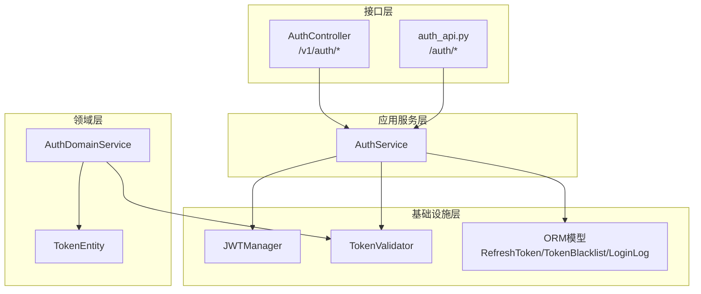
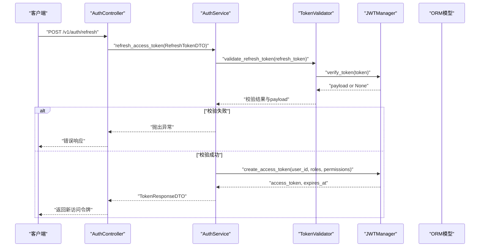
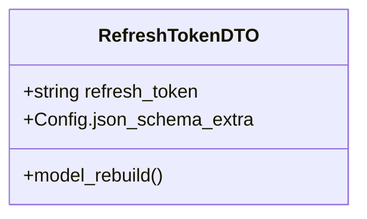
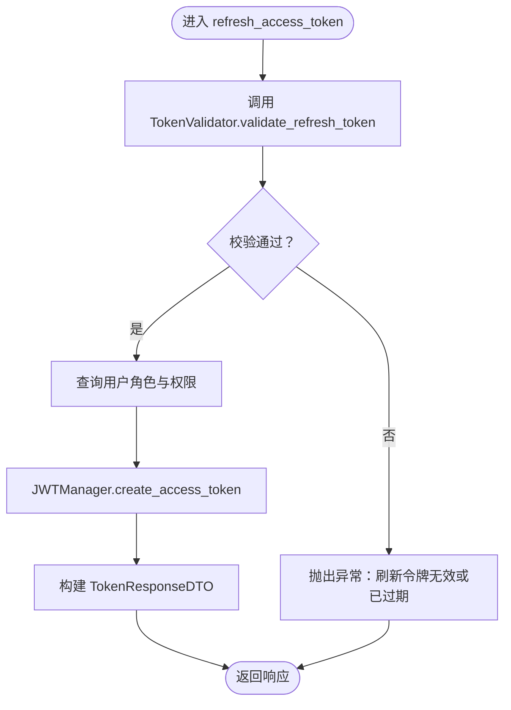
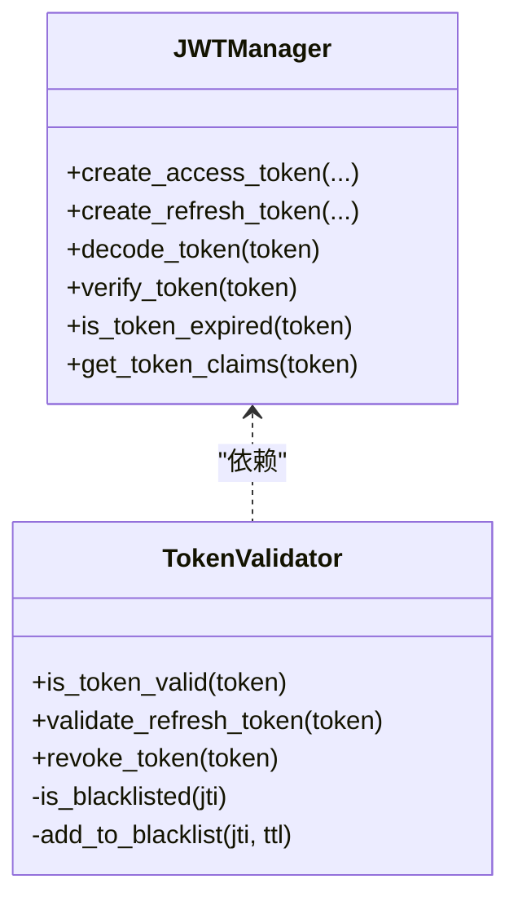
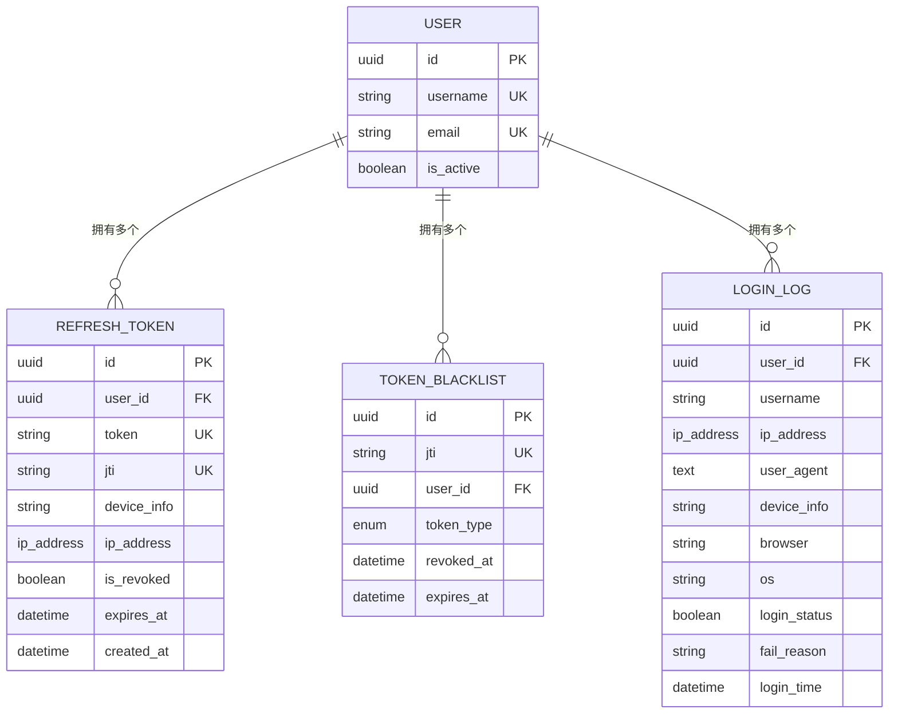
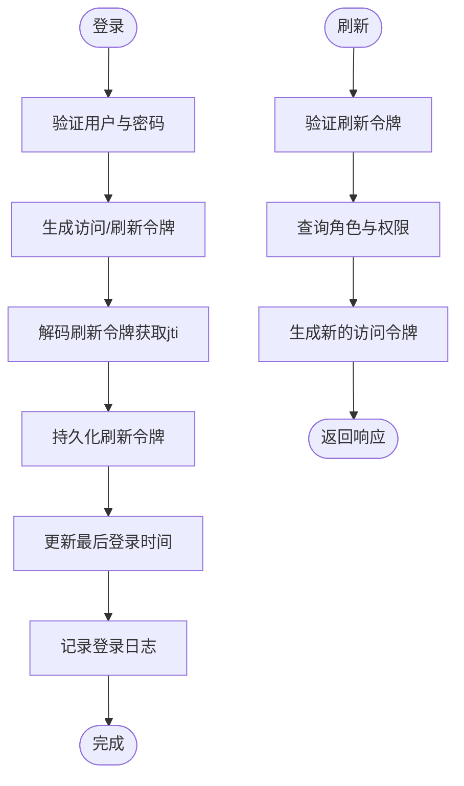
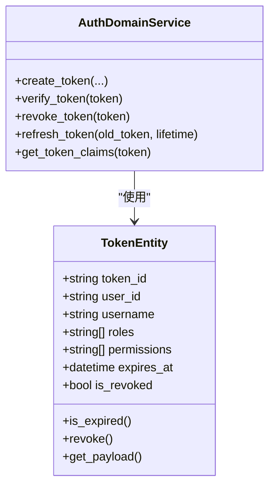
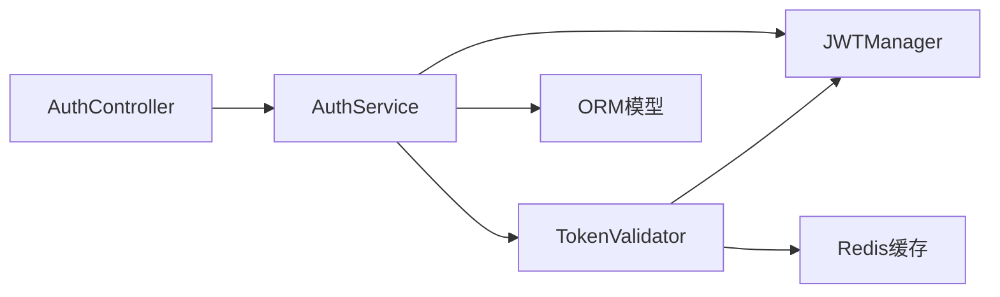

# 令牌刷新系统

<cite>
**本文档引用的文件**
- [src/application/dto/auth/refresh_token_dto.py](file://src/application/dto/auth/refresh_token_dto.py)
- [src/application/dto/auth/token_response_dto.py](file://src/application/dto/auth/token_response_dto.py)
- [src/application/services/auth_service.py](file://src/application/services/auth_service.py)
- [src/api/v1/controllers/auth_controller.py](file://src/api/v1/controllers/auth_controller.py)
- [src/api/v1/auth_api.py](file://src/api/v1/auth_api.py)
- [src/domain/auth/entities/token_entity.py](file://src/domain/auth/entities/token_entity.py)
- [src/domain/auth/services/auth_domain_service.py](file://src/domain/auth/services/auth_domain_service.py)
- [src/infrastructure/persistence/models/auth_models.py](file://src/infrastructure/persistence/models/auth_models.py)
- [src/infrastructure/auth_jwt/jwt_manager.py](file://src/infrastructure/auth_jwt/jwt_manager.py)
- [src/infrastructure/auth_jwt/token_validator.py](file://src/infrastructure/auth_jwt/token_validator.py)
- [config/settings/base.py](file://config/settings/base.py)
- [src/infrastructure/persistence/migrations/0001_initial.py](file://src/infrastructure/persistence/migrations/0001_initial.py)
- [tests/test_services/test_auth_service.py](file://tests/test_services/test_auth_service.py)
</cite>

## 目录
1. [简介](#简介)
2. [项目结构](#项目结构)
3. [核心组件](#核心组件)
4. [架构总览](#架构总览)
5. [详细组件分析](#详细组件分析)
6. [依赖分析](#依赖分析)
7. [性能考量](#性能考量)
8. [故障排查指南](#故障排查指南)
9. [结论](#结论)
10. [附录](#附录)

## 简介
本文件系统化梳理了该Django Ninja API项目中的令牌刷新机制，覆盖刷新令牌的生成、存储、验证与撤销全流程；详解刷新令牌DTO的设计与校验；阐述认证服务中的刷新逻辑（旧令牌验证、新令牌生成、旧令牌撤销）；说明数据库中刷新令牌的存储策略（表结构、索引与查询性能）；解释刷新令牌与访问令牌的关联关系（一对多与级联）；提供完整的刷新流程图；总结安全最佳实践（安全存储、防重放、令牌轮换）；并给出API使用示例与错误处理方案。

## 项目结构
围绕“令牌刷新”主题，相关代码分布在以下层次：
- 接口层：控制器与路由，负责接收请求、参数校验与返回响应
- 应用服务层：封装认证业务逻辑，协调JWT管理器、验证器与持久化
- 基础设施层：JWT工具、令牌验证、ORM模型与迁移
- 领域层：令牌实体与领域服务（本地演示用）

**图表来源**
- [src/api/v1/controllers/auth_controller.py:16-133](file://src/api/v1/controllers/auth_controller.py#L16-L133)
- [src/api/v1/auth_api.py:13-74](file://src/api/v1/auth_api.py#L13-L74)
- [src/application/services/auth_service.py:20-233](file://src/application/services/auth_service.py#L20-L233)
- [src/infrastructure/auth_jwt/jwt_manager.py:13-147](file://src/infrastructure/auth_jwt/jwt_manager.py#L13-L147)
- [src/infrastructure/auth_jwt/token_validator.py:11-108](file://src/infrastructure/auth_jwt/token_validator.py#L11-L108)
- [src/infrastructure/persistence/models/auth_models.py:12-114](file://src/infrastructure/persistence/models/auth_models.py#L12-L114)
- [src/domain/auth/entities/token_entity.py:11-105](file://src/domain/auth/entities/token_entity.py#L11-L105)
- [src/domain/auth/services/auth_domain_service.py:11-130](file://src/domain/auth/services/auth_domain_service.py#L11-L130)

**章节来源**
- [src/api/v1/controllers/auth_controller.py:16-133](file://src/api/v1/controllers/auth_controller.py#L16-L133)
- [src/api/v1/auth_api.py:13-74](file://src/api/v1/auth_api.py#L13-L74)
- [src/application/services/auth_service.py:20-233](file://src/application/services/auth_service.py#L20-L233)
- [src/infrastructure/auth_jwt/jwt_manager.py:13-147](file://src/infrastructure/auth_jwt/jwt_manager.py#L13-L147)
- [src/infrastructure/auth_jwt/token_validator.py:11-108](file://src/infrastructure/auth_jwt/token_validator.py#L11-L108)
- [src/infrastructure/persistence/models/auth_models.py:12-114](file://src/infrastructure/persistence/models/auth_models.py#L12-L114)
- [src/domain/auth/entities/token_entity.py:11-105](file://src/domain/auth/entities/token_entity.py#L11-L105)
- [src/domain/auth/services/auth_domain_service.py:11-130](file://src/domain/auth/services/auth_domain_service.py#L11-L130)

## 核心组件
- 刷新令牌DTO：定义刷新令牌输入结构与示例
- 认证服务：登录生成刷新令牌并持久化、刷新访问令牌、登出撤销
- JWT管理器：生成访问/刷新令牌、解码与过期判断
- 令牌验证器：验证刷新令牌有效性、黑名单检查、撤销入黑
- ORM模型：刷新令牌、黑名单、登录日志的数据库映射
- 控制器与路由：对外暴露登录/刷新/登出接口

**章节来源**
- [src/application/dto/auth/refresh_token_dto.py:9-21](file://src/application/dto/auth/refresh_token_dto.py#L9-L21)
- [src/application/services/auth_service.py:20-233](file://src/application/services/auth_service.py#L20-L233)
- [src/infrastructure/auth_jwt/jwt_manager.py:13-147](file://src/infrastructure/auth_jwt/jwt_manager.py#L13-L147)
- [src/infrastructure/auth_jwt/token_validator.py:11-108](file://src/infrastructure/auth_jwt/token_validator.py#L11-L108)
- [src/infrastructure/persistence/models/auth_models.py:12-114](file://src/infrastructure/persistence/models/auth_models.py#L12-L114)
- [src/api/v1/controllers/auth_controller.py:16-133](file://src/api/v1/controllers/auth_controller.py#L16-L133)

## 架构总览
下图展示了从客户端发起刷新请求到服务端完成令牌刷新与返回的端到端流程。

**图表来源**
- [src/api/v1/controllers/auth_controller.py:80-105](file://src/api/v1/controllers/auth_controller.py#L80-L105)
- [src/application/services/auth_service.py:113-162](file://src/application/services/auth_service.py#L113-L162)
- [src/infrastructure/auth_jwt/token_validator.py:62-79](file://src/infrastructure/auth_jwt/token_validator.py#L62-L79)
- [src/infrastructure/auth_jwt/jwt_manager.py:25-80](file://src/infrastructure/auth_jwt/jwt_manager.py#L25-L80)

## 详细组件分析

### 刷新令牌DTO设计
- 字段定义：包含刷新令牌字符串字段
- 校验与示例：基于Pydantic进行字段校验，并提供JSON Schema示例
- 循环引用处理：显式重建模型以避免循环导入

**图表来源**
- [src/application/dto/auth/refresh_token_dto.py:9-21](file://src/application/dto/auth/refresh_token_dto.py#L9-L21)

**章节来源**
- [src/application/dto/auth/refresh_token_dto.py:9-21](file://src/application/dto/auth/refresh_token_dto.py#L9-L21)

### 认证服务中的刷新逻辑
- 输入：RefreshTokenDTO
- 步骤：
  1) 使用TokenValidator验证刷新令牌（类型、黑名单、签名与过期）
  2) 从payload提取user_id与username
  3) 查询用户角色与权限
  4) 生成新的访问令牌
  5) 返回TokenResponseDTO（不含refresh_token字段）
- 注意：当前实现未撤销旧刷新令牌，仅验证并生成新访问令牌

**图表来源**
- [src/application/services/auth_service.py:113-162](file://src/application/services/auth_service.py#L113-L162)
- [src/infrastructure/auth_jwt/token_validator.py:62-79](file://src/infrastructure/auth_jwt/token_validator.py#L62-L79)
- [src/infrastructure/auth_jwt/jwt_manager.py:25-80](file://src/infrastructure/auth_jwt/jwt_manager.py#L25-L80)

**章节来源**
- [src/application/services/auth_service.py:113-162](file://src/application/services/auth_service.py#L113-L162)
- [src/infrastructure/auth_jwt/token_validator.py:62-79](file://src/infrastructure/auth_jwt/token_validator.py#L62-L79)
- [src/infrastructure/auth_jwt/jwt_manager.py:25-80](file://src/infrastructure/auth_jwt/jwt_manager.py#L25-L80)

### JWT管理器与令牌验证器
- JWTManager
  - 生成访问/刷新令牌，携带jti、exp、iat、type等声明
  - 解码与过期判断，支持算法与密钥配置
- TokenValidator
  - 验证访问令牌与刷新令牌，检查黑名单
  - 支持将令牌加入黑名单（按剩余有效期缓存）

**图表来源**
- [src/infrastructure/auth_jwt/jwt_manager.py:13-147](file://src/infrastructure/auth_jwt/jwt_manager.py#L13-L147)
- [src/infrastructure/auth_jwt/token_validator.py:11-108](file://src/infrastructure/auth_jwt/token_validator.py#L11-L108)

**章节来源**
- [src/infrastructure/auth_jwt/jwt_manager.py:13-147](file://src/infrastructure/auth_jwt/jwt_manager.py#L13-L147)
- [src/infrastructure/auth_jwt/token_validator.py:11-108](file://src/infrastructure/auth_jwt/token_validator.py#L11-L108)

### 数据库存储策略
- 刷新令牌模型（RefreshToken）
  - 关系：外键关联用户，一对多关系
  - 唯一与索引：token与jti均唯一且建立索引
  - 字段：token、jti、device_info、ip_address、is_revoked、expires_at、created_at
- 黑名单模型（TokenBlacklist）
  - 存储已撤销的访问/刷新令牌JTI，带token_type与expires_at
- 登录日志模型（LoginLog）
  - 记录登录IP、UA、设备信息、状态与失败原因
- 迁移文件
  - 定义上述表结构、索引与约束

**图表来源**
- [src/infrastructure/persistence/models/auth_models.py:12-114](file://src/infrastructure/persistence/models/auth_models.py#L12-L114)
- [src/infrastructure/persistence/migrations/0001_initial.py:522-586](file://src/infrastructure/persistence/migrations/0001_initial.py#L522-L586)

**章节来源**
- [src/infrastructure/persistence/models/auth_models.py:12-114](file://src/infrastructure/persistence/models/auth_models.py#L12-L114)
- [src/infrastructure/persistence/migrations/0001_initial.py:522-586](file://src/infrastructure/persistence/migrations/0001_initial.py#L522-L586)

### 刷新令牌与访问令牌的关联关系
- 一对多关系：一个用户可拥有多个刷新令牌（不同设备/会话）
- 级联操作：删除用户时，刷新令牌与黑名单记录随用户级联删除
- 当前实现要点：
  - 登录时生成刷新令牌并持久化
  - 刷新访问令牌时仅验证刷新令牌并生成新访问令牌
  - 未实现“撤销旧刷新令牌”的逻辑（可在后续版本增强）

**章节来源**
- [src/infrastructure/persistence/models/auth_models.py:19-24](file://src/infrastructure/persistence/models/auth_models.py#L19-L24)
- [src/application/services/auth_service.py:70-87](file://src/application/services/auth_service.py#L70-L87)
- [src/application/services/auth_service.py:113-162](file://src/application/services/auth_service.py#L113-L162)

### 登录与刷新流程对比
- 登录流程
  - 验证用户与密码
  - 生成访问/刷新令牌
  - 解码刷新令牌获取jti
  - 持久化刷新令牌
  - 更新最后登录时间
  - 记录登录日志
- 刷新流程
  - 验证刷新令牌（类型、黑名单、签名与过期）
  - 查询用户角色与权限
  - 生成新的访问令牌
  - 返回TokenResponseDTO

**图表来源**
- [src/application/services/auth_service.py:26-111](file://src/application/services/auth_service.py#L26-L111)
- [src/application/services/auth_service.py:113-162](file://src/application/services/auth_service.py#L113-L162)

**章节来源**
- [src/application/services/auth_service.py:26-111](file://src/application/services/auth_service.py#L26-L111)
- [src/application/services/auth_service.py:113-162](file://src/application/services/auth_service.py#L113-L162)

### 领域层（本地演示）
- TokenEntity：封装令牌生命周期、撤销与载荷
- AuthDomainService：提供令牌创建、验证、撤销与刷新的领域逻辑
- 与应用服务的关系：领域服务更贴近业务语义，应用服务负责跨组件编排

**图表来源**
- [src/domain/auth/entities/token_entity.py:11-105](file://src/domain/auth/entities/token_entity.py#L11-L105)
- [src/domain/auth/services/auth_domain_service.py:11-130](file://src/domain/auth/services/auth_domain_service.py#L11-L130)

**章节来源**
- [src/domain/auth/entities/token_entity.py:11-105](file://src/domain/auth/entities/token_entity.py#L11-L105)
- [src/domain/auth/services/auth_domain_service.py:11-130](file://src/domain/auth/services/auth_domain_service.py#L11-L130)

## 依赖分析
- 组件耦合
  - AuthController依赖AuthService
  - AuthService依赖JWTManager、TokenValidator、ORM模型与RBAC仓库
  - TokenValidator依赖JWTManager与缓存
- 外部依赖
  - Django REST Framework SimpleJWT配置（JWT参数、轮换与黑名单）
  - Redis缓存用于黑名单键值存储

**图表来源**
- [src/api/v1/controllers/auth_controller.py:27-34](file://src/api/v1/controllers/auth_controller.py#L27-L34)
- [src/application/services/auth_service.py:10-17](file://src/application/services/auth_service.py#L10-L17)
- [src/infrastructure/auth_jwt/token_validator.py:17-18](file://src/infrastructure/auth_jwt/token_validator.py#L17-L18)
- [config/settings/base.py:137-151](file://config/settings/base.py#L137-L151)

**章节来源**
- [src/api/v1/controllers/auth_controller.py:27-34](file://src/api/v1/controllers/auth_controller.py#L27-L34)
- [src/application/services/auth_service.py:10-17](file://src/application/services/auth_service.py#L10-L17)
- [src/infrastructure/auth_jwt/token_validator.py:17-18](file://src/infrastructure/auth_jwt/token_validator.py#L17-L18)
- [config/settings/base.py:137-151](file://config/settings/base.py#L137-L151)

## 性能考量
- 数据库索引
  - RefreshToken：token、jti、user建立索引，提升查找与去重效率
  - TokenBlacklist：jti唯一索引，快速黑名单命中
  - LoginLog：user与login_time索引，便于审计与统计
- 缓存策略
  - 黑名单使用Redis缓存，键名包含jti，超时与令牌过期时间一致，降低数据库压力
- 查询复杂度
  - 刷新令牌验证主要为O(1)哈希命中与O(1)数据库唯一查询
  - 登录持久化为单条写入，成本低

**章节来源**
- [src/infrastructure/persistence/models/auth_models.py:38-41](file://src/infrastructure/persistence/models/auth_models.py#L38-L41)
- [src/infrastructure/auth_jwt/token_validator.py:47-60](file://src/infrastructure/auth_jwt/token_validator.py#L47-L60)

## 故障排查指南
- 常见错误与定位
  - 刷新令牌无效或已过期：检查TokenValidator.validate_refresh_token返回的错误信息
  - 用户不存在：AuthService在刷新时尝试获取用户信息，若不存在则返回空用户信息
  - 登录失败：检查用户激活状态与密码校验逻辑
- 测试参考
  - 单元测试覆盖登录、刷新与登出场景，可作为行为参考

**章节来源**
- [src/application/services/auth_service.py:118-120](file://src/application/services/auth_service.py#L118-L120)
- [src/application/services/auth_service.py:146-154](file://src/application/services/auth_service.py#L146-L154)
- [tests/test_services/test_auth_service.py:27-142](file://tests/test_services/test_auth_service.py#L27-L142)

## 结论
该系统实现了标准的JWT刷新流程：登录生成访问/刷新令牌并持久化，刷新时验证刷新令牌后生成新的访问令牌。数据库层面通过索引与缓存保障查询与黑名单检查性能。建议后续增强包括：在刷新时撤销旧刷新令牌、完善登出撤销逻辑、引入刷新令牌轮换策略与更强的防重放措施。

## 附录

### API使用示例与错误处理
- 登录
  - 方法：POST /v1/auth/login
  - 请求体：UserLoginDTO
  - 响应：TokenResponseDTO（包含access_token、refresh_token、expires_in、user）
  - 错误：用户名或密码错误、用户未激活
- 刷新访问令牌
  - 方法：POST /v1/auth/refresh
  - 请求体：RefreshTokenDTO
  - 响应：TokenResponseDTO（仅返回新的access_token，refresh_token为None）
  - 错误：刷新令牌无效或已过期
- 登出
  - 方法：POST /v1/auth/logout
  - 请求头：Authorization: Bearer <access_token>
  - 响应：MessageResponse
  - 错误：无（内部捕获并忽略无效token）

**章节来源**
- [src/api/v1/controllers/auth_controller.py:36-105](file://src/api/v1/controllers/auth_controller.py#L36-L105)
- [src/api/v1/auth_api.py:22-73](file://src/api/v1/auth_api.py#L22-L73)
- [src/application/dto/auth/token_response_dto.py:9-31](file://src/application/dto/auth/token_response_dto.py#L9-L31)

### 安全最佳实践
- 刷新令牌安全存储
  - 仅在内存缓存中存放黑名单键，避免持久化泄露
  - 使用强随机jti，确保唯一性与不可预测性
- 防重放攻击
  - 严格校验令牌类型（refresh），防止访问令牌被误用
  - 启用黑名单后旋转刷新令牌，缩短刷新令牌生命周期
- 令牌轮换策略
  - 在SimpleJWT配置中启用刷新令牌轮换与黑名单
  - 登录与刷新时生成新的jti，旧jti自动失效

**章节来源**
- [src/infrastructure/auth_jwt/token_validator.py:62-79](file://src/infrastructure/auth_jwt/token_validator.py#L62-L79)
- [config/settings/base.py:137-151](file://config/settings/base.py#L137-L151)